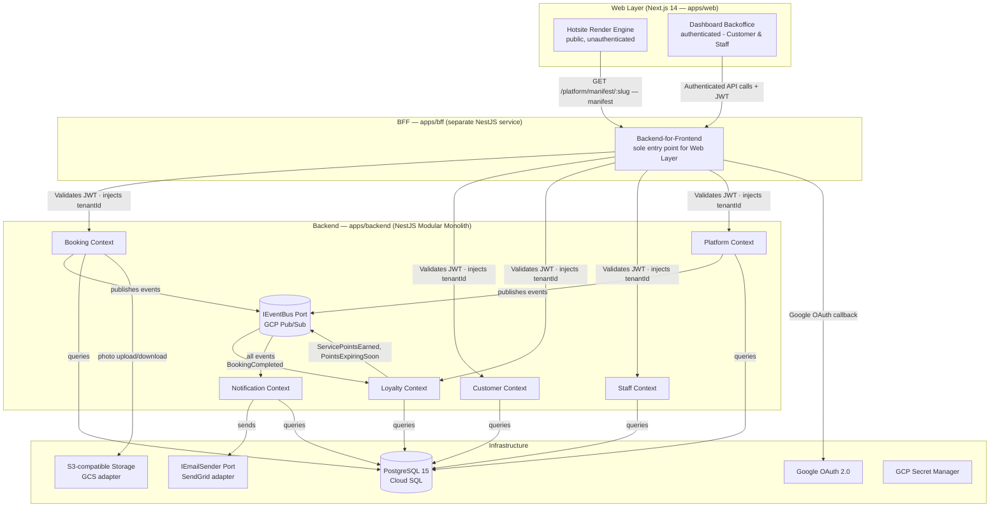

# System Architecture & Hexagonal Design - Ikaro

## Overview

Ikaro is designed as a **Modular Monolith** using **Hexagonal Architecture (Ports & Adapters)**. This ensures that the core business logic is isolated from external technologies (Database, APIs, UI), making the system highly testable and maintainable.

---

## High-Level System Diagram



---

## 4. Hotsite & Dashboard Logic

### **Hotsite Manifest (UC-001, UC-011)**
The BFF serves a dynamic `Hotsite Manifest` (JSON) to the Web Layer. This manifest defines the branding (colors, logo) and the layout (which modules to render) for a specific tenant slug.

### **Role-Based Dashboard (UC-003+ )**
The Dashboard shell uses the JWT role (`STAFF` or `CUSTOMER`) to load the appropriate UI modules and enforce client-side permissions.

---

## Hexagonal Architecture (Ports & Adapters)

Each Bounded Context (e.g., Booking) follows the same internal structure to ensure isolation.

### 1. **The Core (Domain Layer)**
- **Entities:** Business objects with identity (e.g., `Booking`).
- **Value Objects:** Objects defined by attributes (e.g., `Money`, `Slot`).
- **Domain Events:** Significant business occurrences (e.g., `BookingApproved`).
- **Domain Services:** Logic that doesn't fit in a single entity.
- **Rules:** NO dependencies on any external libraries or frameworks.

### 2. **The Ports (Application Layer)**
- **Input Ports (Use Cases):** Interfaces defining what the system can do (e.g., `ICreateBookingUseCase`).
- **Output Ports (Gateways):** Interfaces defining what the system needs from the outside (e.g., `IBookingRepository`, `IEmailSender`).
- **Use Case Handlers:** Orchestrate the domain entities to fulfill a request.

### 3. **The Adapters (Infrastructure Layer)**
- **Driving Adapters (Input):**
  - REST Controllers (NestJS).
  - Internal Event Listeners.
  - **Scheduled Tasks (Cron Jobs):** Triggers for daily reminders (6 AM) and loyalty expiration checks.
  - CLI Commands.
- **Driven Adapters (Output):**
  - `PostgresBookingRepository` (TypeORM/Prisma).
  - `AwsSesEmailSender`.
  - `GoogleCloudPhotoStorage`.

---

## Folder Structure (Pattern)

Within the monorepo, each context will look like this:

```text
src/contexts/booking/
├── domain/                # Pure business logic
│   ├── entities/
│   ├── value-objects/
│   ├── events/
│   └── services/
├── application/           # Orchestration
│   ├── use-cases/
│   ├── ports/             # Interfaces (Repositories, Clients)
│   └── dtos/
└── infrastructure/        # External implementations
    ├── adapters/
    │   ├── persistence/   # Database impl
    │   ├── clients/       # API/Email impl
    │   └── controllers/   # REST API
    └── module.config.ts   # NestJS Module definition
```

---

## Communication Patterns

### **1. Synchronous (Internal API)**
- When the BFF needs data from multiple contexts, it calls their Application Services directly.
- **Rule:** Contexts should rarely call each other synchronously to avoid tight coupling.

### **2. Asynchronous (Domain Events)**
- **The Contract (Port):** We use a technology-agnostic `IEventBus` interface. The domain layer only knows how to `publish` and `subscribe`, never how the message is physically transported.
- **Local Development:** **GCP Pub/Sub Emulator** running in a Docker container (`google/cloud-sdk`). This ensures developers test real asynchronous behaviour, retries, and dead-letter subscriptions locally with full parity to production.
- **Production:** **GCP Pub/Sub** (managed, serverless). Swapping to another broker (AWS SQS, Apache Kafka) requires only a new **Adapter** implementation — the domain layer never changes.
- **Robustness (Idempotency):** Every event consumer (handler) must be **Idempotent**. This means if a message is delivered twice (at-least-once delivery), the system state remains consistent.
- **Technology Mapping:**
  - *Publisher:* `BookingContext` completes a wash → `eventBus.publish(new BookingCompleted(data))`.
  - *Subscriber:* `LoyaltyContext` → `eventBus.subscribe('BookingCompleted', handleLoyaltyUpdate)`.

---

## Multi-Tenancy Enforcement

The architecture enforces tenant isolation at the **Adapter Layer**:
- **Persistence Adapter:** Every query automatically injects `WHERE tenant_id = current_tenant`.
- **Controller Adapter:** A global `TenantInterceptor` extracts the `X-Tenant-ID` header and injects it into the request context.
- **Security:** Use cases always require a `tenantId` parameter to ensure operations are scoped correctly.

---

## Key Benefits for Ikaro

1. **Independent Testing:** We can test the `Booking` use cases with a "MemoryRepository" (no DB needed).
2. **Tech Agnostic:** If we switch from SES to SendGrid, we only change one adapter in `infrastructure/`.
3. **Module Isolation:** If `Loyalty` grows too big, we can extract it into a microservice by changing its adapters to use HTTP instead of internal calls.

---

**Status:** Phase 2 - Technical Architecture  
**Next:** `12-DATABASE_SCHEMA.md` (Multi-tenant Table Design)
