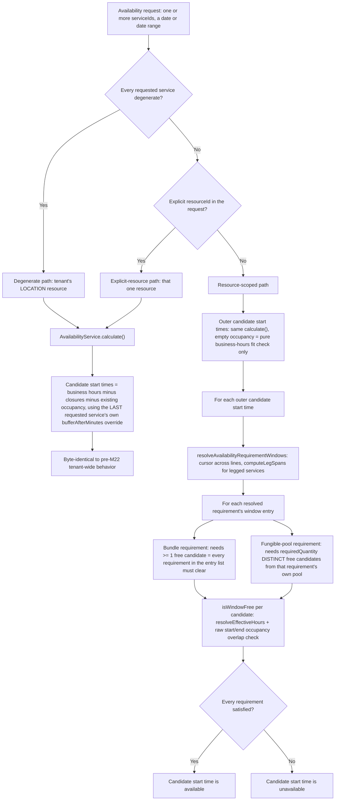

# Ikaro — Business Logic Reference (Visual)

**Audience:** developers and AI agents who need to understand a genuinely complex, cross-cutting piece of business logic without re-deriving it from prose scattered across several docs.

**Scope:** algorithms, state machines, and formulas that span multiple use cases or aggregates within one bounded context — the kind of logic that's easy to get subtly wrong from memory and expensive to re-verify from scratch. This doc does **not** duplicate the canonical sources:
- Aggregate shapes/invariants → `docs/02-DOMAIN_MODEL.md`
- Event payloads → `docs/03-DOMAIN_EVENTS.md`
- Use-case flows/alternative flows → `docs/04-USE_CASES.md`
- Schema DDL/constraints → `docs/13-DATABASE_SCHEMA.md`

Everything below cross-references those instead of restating them.

**Structure:** one section per bounded context, added **incrementally** — a section is written the first time a story in that context introduces business logic complex enough to earn it, not upfront for every context. `/story-discovery`'s own checklist flags when a new story likely needs a new/updated section here; `/mark-done`'s stale-reference sweep checks existing sections against what actually shipped. A bounded context with no section below simply hasn't had complex-enough logic land yet — that's not staleness, it's "not written yet."

---

## Booking — Resource-Scoped Scheduling & Availability (M21–M22)

### Why this exists

Through M21, "is the tenant free at this time" was answerable from one `Booking` row's own `scheduledAt`/`totalDurationMins` — one exclusion constraint (`EX_booking_bookings_approved_slot`, retired by M22-S03) protected the whole tenant as a single unit. Starting with M22, a `Service` can require a specific resource (or a bundle of several, or a different resource per leg of a multi-stage service), so "is this booking possible" became "is every resource this booking needs simultaneously free for its own sub-window" — a materially different algorithm, described below.

### Resource requirement shapes

A `Service`'s `resourceRequirements`/`legs` fields (M22-S01) determine which shape applies:

| Shape | Service configuration | Meaning | Example |
|---|---|---|---|
| **Degenerate** | `resourceRequirements: []` (the default — no service starts with one configured), or exactly one `{ type: LOCATION, resourcePoolIds: null/[] }` requirement, and no `legs` | Falls back to the tenant's single backfilled `LOCATION` resource — byte-identical to the pre-M21 whole-tenant booking model. Exact check: `isDegenerateService()` in `availability-resource-scope.helpers.ts`. | Car wash's original "Lavagem Simples" |
| **Flat, single requirement** | One entry in `resourceRequirements`, no `legs` | The resolved resource(s) block the line's *whole* duration | A single hairdresser's chair |
| **Flat, bundle** | 2+ entries in `resourceRequirements`, no `legs` | **Every** requirement must have its own free candidate *simultaneously* — intersection | A service needing a ROOM **and** an EQUIPMENT unit together |
| **Legged** | `legs: [{ legIndex, durationMinutes, resourceRequirements, transitionGapAfterMinutes }, ...]` | Each leg has its own duration, own resource requirement(s), and own resource — sequenced by `AvailabilityService.computeLegSpans()`, not the flat model | A multi-stage spa treatment |

A requirement's `resourcePoolIds` (when set) restricts candidates to that explicit list; when unset, candidates are every active resource of the requirement's `type` for the tenant. `requiredQuantity` (default 1) is how many *distinct* resources that one requirement needs simultaneously — this is what makes a requirement "fungible pool" shaped (`requiredQuantity > 1`) versus "single resource" shaped (`requiredQuantity === 1`), independent of the `selectionMode` field. A requirement is only saveable when its candidate set (the explicit non-empty `resourcePoolIds`, otherwise every active resource of the `type`) holds at least `requiredQuantity` resources — enforced by `assertResourceRequirementsAvailable()` at write time (`quantity-exceeds-candidates`, 422) because neither availability nor occupancy resolution could ever satisfy it. `selectionMode` (`NONE` / `CUSTOMER_CHOICE` / `AUTO_ANY` / `AUTO_FUNGIBLE_POOL`) is carried on the `ResourceRequirement` value object but is **not** branched on by the availability/occupancy resolution algorithms below — it's a UX/booking-flow signal (M22-S01/M23 scope: does the customer pick from the pool, or does the system), not resolution logic. Don't infer resolution behavior from it.

### Availability computation algorithm

Three read paths exist, chosen by `GetAvailabilityUseCase.computeSlots()`/`GetAvailabilitySummaryUseCase.execute()`:

Key files: `get-availability.use-case.ts` (single day), `availability-summary.helpers.ts` (date range — batches each distinct resource's schedule/occupancy once for the whole range, not once per day), `resource-scoped-availability.helpers.ts` (shared outer-slot orchestration), `availability-window-resolution.helpers.ts` (per-line/per-leg window resolution + the intersect/union combinator), `resource-occupancy.helpers.ts` (the write-path mirror — same cursor/leg-span shape, but picks one deterministic candidate set to actually book rather than unioning across a pool).

**Write path vs. read path divergence (known, deliberate, M23 scope to close):** the read path unions across *every* free pool member; the write path (`resource-occupancy.helpers.ts`) deterministically picks the first `requiredQuantity` candidates from the pool and does not retry a different member on conflict. A slot the read path advertises as available (because *some* pool member is free) can still be rejected at booking time if the specific member the write path picked isn't. Actually making a booking succeed against whichever pool member is free is scoped to M23's real booking flow (`plan/M22-MULTIVERTICAL-SERVICE-AVAILABILITY.md`'s own Non-Goals: *"Actually booking a resource-scoped/bundled/legged appointment (UC-061–068) — that's M23... no customer-facing booking flow changes"*) — this is a known, accepted gap in M22, not a bug to fix casually.

### `resource_occupancy.lock_state` lifecycle

```mermaid
stateDiagram-v2
  [*] --> REQUESTED: PENDING request, degenerate service
  [*] --> HOLD: PENDING request, resource-scoped service (manual approval)
  [*] --> COMMITTED: AUTO_CONFIRM booking, or a pre-existing APPROVED booking backfilled by M22-S03's migration

  REQUESTED --> COMMITTED: staff approves
  REQUESTED --> [*]: reject or cancel (row deleted)

  HOLD --> COMMITTED: staff approves
  HOLD --> [*]: reject or cancel (row deleted)
  HOLD --> [*]: hold_expires_at passes (documented; no worker enforces this yet — explicit M23 scope)

  COMMITTED --> COMMITTED: reschedule (release + reassign to the new window, same lock_state)
  COMMITTED --> [*]: reject or cancel (row deleted)
```

- **`REQUESTED`** exists so a degenerate (LOCATION-fallback) service's PENDING request never blocks a *concurrent* PENDING request for the same popular slot — it's structurally excluded from the GIST exclusion constraint's own `WHERE` clause (`lock_state IN ('HOLD','COMMITTED')`), preserving car-wash-vertical byte-identical behavior. It still blocks against an existing `COMMITTED`/`HOLD` row (the pre-check in `BookingSlotConflictService` isn't scoped by `lock_state`) — only REQUESTED-vs-REQUESTED is deliberately unguarded. `REQUESTED`'s only *read* consumer is M22-S05's manager day grid (`IBookingAvailabilityPort.findDayGridOccupancy()`) — every other read path (availability computation, conflict checking) queries `lock_state IN ('HOLD','COMMITTED')` only and never sees these rows.
- **`HOLD`** is the resource-scoped-service equivalent of a manual-approval pending booking — it *is* included in the GIST exclusion (two customers can't both hold the same real resource), and carries a `hold_expires_at`.
- **`COMMITTED`** backs every approved booking, whether it arrived via `AUTO_CONFIRM`, staff approval, or the historical backfill.
- `booking_line_resource_assignments` (a *separate* table) is the immutable audit record of which resource a line was ever assigned to — `release()` only ever deletes `resource_occupancy` rows, never assignment rows; re-resolving the same `(line, resource, leg, quantity)` tuple (a reschedule back to the same resource, or an approval that reuses the request-time resolution) reuses the existing assignment row via an idempotent upsert rather than duplicating it.

### Buffer / turnover / transition-gap formulas

| Scenario | Formula | Where computed |
|---|---|---|
| Flat service, the line's own **last** position in a multi-service booking | `max(service.bufferAfterMinutes, resource.turnoverMinutes)` added once, after the line's own duration | `AvailabilityService.effectiveFlatGapMinutes()` — write path: `resource-occupancy.helpers.ts`; read path: `availability-window-resolution.helpers.ts` |
| Flat service, a **non-last** line in a multi-service booking | No gap — the next line starts exactly when this one ends | same |
| Legged service, **each leg's own** `endsAt` | That leg's resolved resource's own `turnoverMinutes`, added only to that leg's own occupied window | `AvailabilityService.computeLegSpans()` is called once with **zero** turnover for every leg (turnover never affects leg *sequencing* — verified directly against its implementation); each resolved candidate then adds its own resource's turnover to its own raw span independently, so two different pool members for the same leg can carry different gaps |
| Legged service, **between** two legs | `leg.transitionGapAfterMinutes` — a static, per-leg, service-configured value, entirely independent of any resource's turnover | `computeLegSpans()`'s own cursor advance |
| Outer/coarse candidate-start-time generation (all three read paths) | The **last** requested service's own `bufferAfterMinutes`, falling back to the tenant-wide default only when the service has none set — never the tenant default when a smaller override exists | `resource-scoped-availability.helpers.ts`, `get-availability.use-case.ts`, `availability-summary.helpers.ts` |

The non-obvious correctness point worth remembering: turnover is a **per-resource, per-leg-position-independent** quantity. Because it never influences a *later* leg's start time, a fungible pool's individual members can each keep their own turnover instead of the whole pool being forced onto its slowest member's value — this was a real bug (pool-wide max turnover applied to every candidate) found and fixed during M22-S03's review cycle.

### Why one shared GIST exclusion table, not one per family

`booking.resource_occupancy` is the *only* DB-level structural guarantee against double-booking a resource — the query-time conflict check (`BookingSlotConflictService`) is a companion to it, not a replacement (per `docs/ENGINEERING_RULES.md`'s "companion to the DB constraint" rule). A Postgres exclusion constraint cannot span two tables, so once a resource can be contended for by more than one *family* of commitment — an APPOINTMENT `Booking` line today, a `ClassSession` once M24 ships — every family that can ever contend for that resource has to write into the *same* table. `source_type` (`BOOKING_LINE` / `CLASS_SESSION`) discriminates which family a row belongs to; only `BOOKING_LINE` is reachable until M24. Full rationale: `docs/02-DOMAIN_MODEL.md` § UC-060, `docs/ENGINEERING_RULES.md` § "A single exclusion constraint stops generalizing...".

### Migration sequencing (historical — fully executed)

M22-S03 (PR #483, merged 2026-09-17) executed the documented expand → backfill → dual-write → validate → contract sequence in one story:

| Phase | Migration / mechanism | Outcome |
|---|---|---|
| 1. Expand | `1748500000012-CreateResourceOccupancy.ts` | Creates `booking_line_resource_assignments`, `resource_occupancy` (with the GIST exclusion), `UNIQUE(tenant_id, line_id)` on `booking_lines`. Old constraint not yet dropped. |
| 2. Backfill | `1748500000013-BackfillResourceOccupancy.ts` | Every pre-existing `APPROVED` booking line gets an assignment + `COMMITTED` occupancy row against the tenant's `LOCATION` resource, with correct per-line sequential sub-windows and buffer/turnover on the last line. |
| 3. Dual-read/write | Shipped in the same PR's use-case changes | New booking creation/approval/reschedule/reject/cancel all read/write `resource_occupancy`; the old tenant-wide constraint stayed live as a safety net through this window. |
| 4. Validate | Integration test suite (`typeorm-resource-occupancy.repository.integration.spec.ts`, `backfill-resource-occupancy.integration.spec.ts`) | Confirms GIST exclusion behavior, backfill correctness, and tenant scoping against real Postgres. |
| 5. Contract | `1748500000014-DropTenantWideExclusion.ts` | Drops `EX_booking_bookings_approved_slot` — mechanically fails closed first: a `DO $$ ... RAISE EXCEPTION` block verifies every `APPROVED` booking line already has a `COMMITTED` `resource_occupancy` row before the `DROP CONSTRAINT` runs, rather than relying only on the originally-planned manual pre-deploy check. |

---

## Other bounded contexts

Not yet written. Add a section here the next time a story in Customer, Staff, Loyalty, Notification, or Platform introduces business logic complex enough to earn one — see this doc's own header for the "incremental, not upfront" rule, and `/story-discovery`'s checklist item that flags the decision at discovery time.
