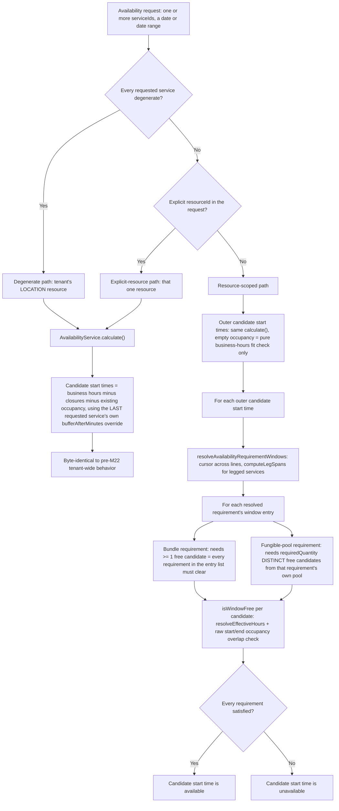
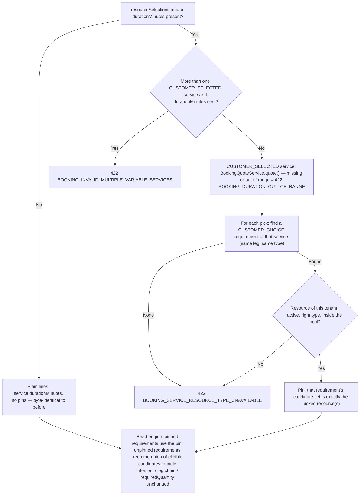
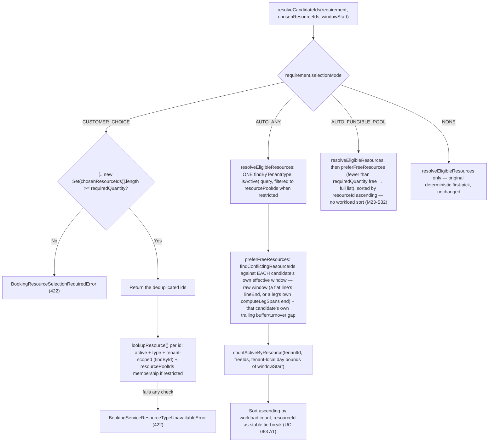
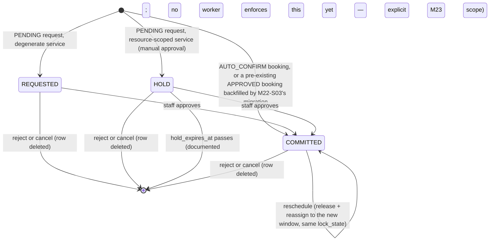
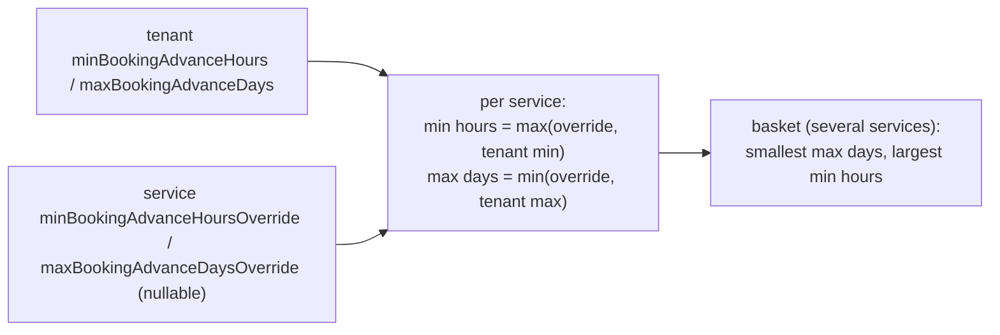
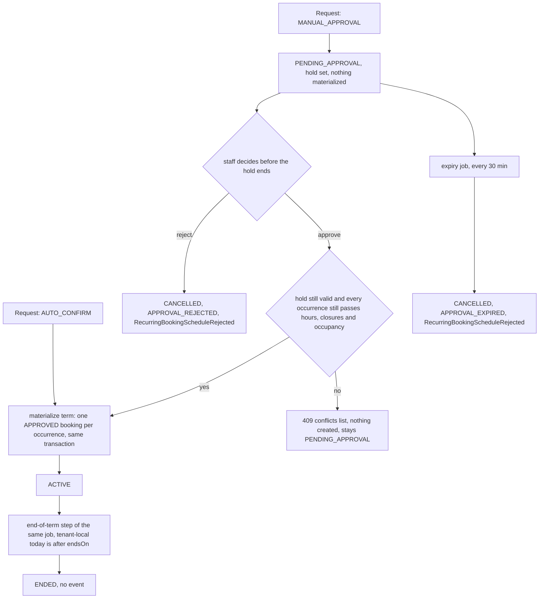
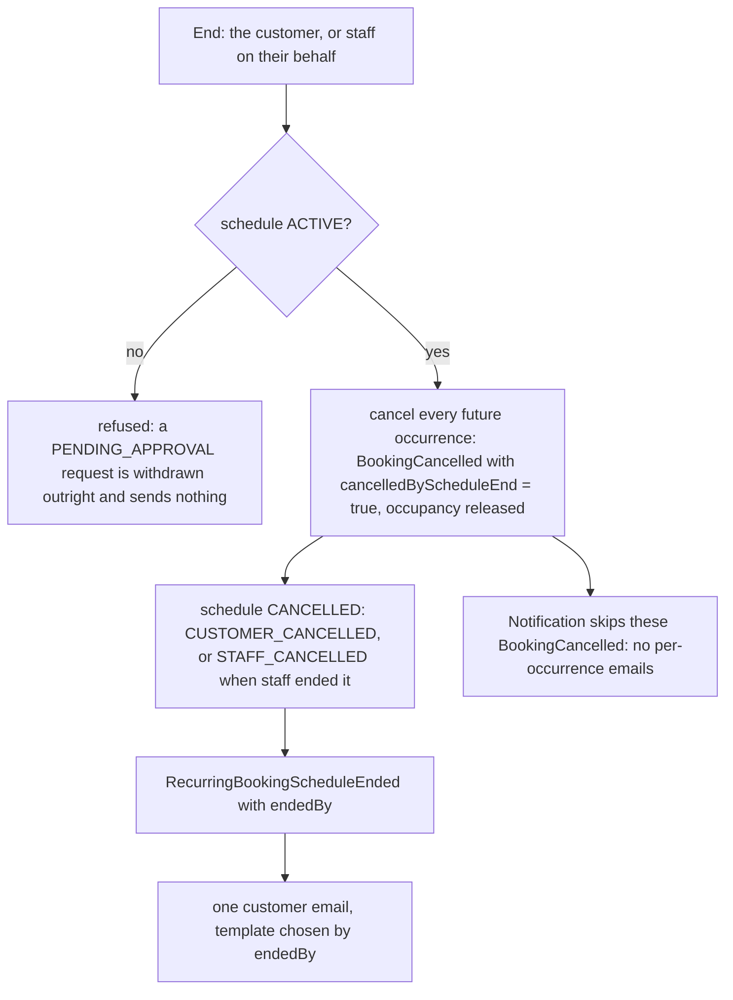
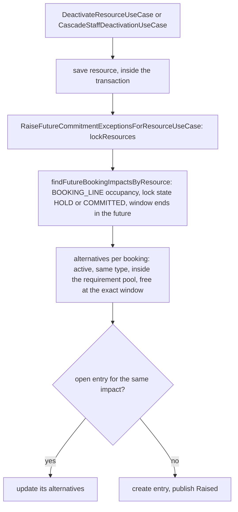
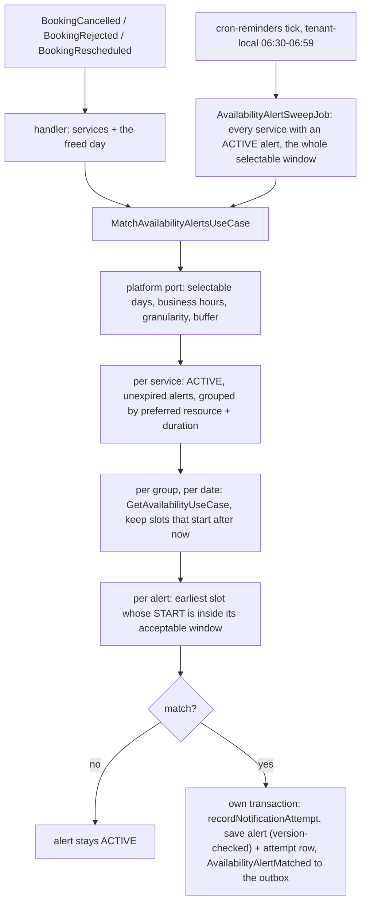

# Ikaro — Business Logic Reference (Visual)

**Audience:** developers and AI agents who need to understand a genuinely complex, cross-cutting piece of business logic without re-deriving it from prose scattered across several docs.

**Scope:** algorithms, state machines, and formulas that span multiple use cases or aggregates within one bounded context — the kind of logic that's easy to get subtly wrong from memory and expensive to re-verify from scratch. This doc does **not** duplicate the canonical sources:
- Aggregate shapes/invariants → `docs/02-DOMAIN_MODEL.md`
- Event payloads → `docs/03-DOMAIN_EVENTS.md`
- Use-case flows/alternative flows → `docs/04-USE_CASES.md`
- Schema DDL/constraints → `docs/13-DATABASE_SCHEMA.md`

Everything below cross-references those instead of restating them.

**Structure:** one section per bounded context, added **incrementally** — a section is written the first time a story in that context introduces business logic complex enough to earn it, not upfront for every context. `/story-discovery`'s own checklist flags when a new story likely needs a new/updated section here; `/mark-done`'s stale-reference sweep checks existing sections against what actually shipped. A bounded context with no section below simply hasn't had complex-enough logic land yet — that's not staleness, it's "not written yet."

---

## Booking — Resource-Scoped Scheduling & Availability (M21–M22)

### Why this exists

Through M21, "is the tenant free at this time" was answerable from one `Booking` row's own `scheduledAt`/`totalDurationMins` — one exclusion constraint (`EX_booking_bookings_approved_slot`, retired by M22-S03) protected the whole tenant as a single unit. Starting with M22, a `Service` can require a specific resource (or a bundle of several, or a different resource per leg of a multi-stage service), so "is this booking possible" became "is every resource this booking needs simultaneously free for its own sub-window" — a materially different algorithm, described below.

### Resource requirement shapes

A `Service`'s `resourceRequirements`/`legs` fields (M22-S01) determine which shape applies:

| Shape | Service configuration | Meaning | Example |
|---|---|---|---|
| **Degenerate** | `resourceRequirements: []` (the default — no service starts with one configured), or exactly one `{ type: LOCATION, resourcePoolIds: null/[] }` requirement, and no `legs` | Falls back to the tenant's single backfilled `LOCATION` resource — byte-identical to the pre-M21 whole-tenant booking model. Exact check: `isDegenerateService()` in `availability-resource-scope.helpers.ts`. | Car wash's original "Lavagem Simples" |
| **Flat, single requirement** | One entry in `resourceRequirements`, no `legs` | The resolved resource(s) block the line's *whole* duration | A single hairdresser's chair |
| **Flat, bundle** | 2+ entries in `resourceRequirements`, no `legs` | **Every** requirement must have its own free candidate *simultaneously* — intersection | A service needing a ROOM **and** an EQUIPMENT unit together |
| **Legged** | `legs: [{ legIndex, durationMinutes, resourceRequirements, transitionGapAfterMinutes }, ...]` | Each leg has its own duration, own resource requirement(s), and own resource — sequenced by `AvailabilityService.computeLegSpans()`, not the flat model | A multi-stage spa treatment |

A requirement's `resourcePoolIds` (when set) restricts candidates to that explicit list; when unset, candidates are every active resource of the requirement's `type` for the tenant. `requiredQuantity` (default 1) is how many *distinct* resources that one requirement needs simultaneously — this is what makes a requirement "fungible pool" shaped (`requiredQuantity > 1`) versus "single resource" shaped (`requiredQuantity === 1`), independent of the `selectionMode` field. A requirement is only saveable when its candidate set (the explicit non-empty `resourcePoolIds`, otherwise every active resource of the `type`) holds at least `requiredQuantity` resources — enforced by `assertResourceRequirementsAvailable()` at write time (`quantity-exceeds-candidates`, 422) because neither availability nor occupancy resolution could ever satisfy it. `selectionMode` (`NONE` / `CUSTOMER_CHOICE` / `AUTO_ANY` / `AUTO_FUNGIBLE_POOL`) is carried on the `ResourceRequirement` value object; through M22 it was a UX/booking-flow signal not yet branched on by resolution — **as of M23-S01, the write path (only) is selectionMode-aware**, per its own subsection below. The read/availability path (the algorithm immediately below) never auto-selects anything and takes the union of every eligible candidate for a requirement — with one exception, added by M23-S29: a customer's validated pick for a `CUSTOMER_CHOICE` requirement *pins* that requirement's candidate set to the chosen resource(s) (see "Pinned selections and a chosen duration" below); an unpinned `CUSTOMER_CHOICE` requirement keeps the union.

### Availability computation algorithm

Three read paths exist, chosen by `GetAvailabilityUseCase.computeSlots()`/`GetAvailabilitySummaryUseCase.execute()`:

```mermaid
flowchart TD
  A["Availability request: one or more serviceIds, a date or date range"] --> B{"Every requested service degenerate?"}
  B -->|Yes| C["Degenerate path: tenant's LOCATION resource"]
  B -->|No| D{"Explicit resourceId in the request?"}
  D -->|Yes| E["Explicit-resource path: that one resource"]
  D -->|No| F["Resource-scoped path"]

  C --> G["AvailabilityService.calculate()"]
  E --> G
  G --> G1["Candidate start times = business hours minus closures minus existing occupancy, using the LAST requested service's own bufferAfterMinutes override"]
  G1 --> G2["Byte-identical to pre-M22 tenant-wide behavior"]

  F --> F1["Outer candidate start times: same calculate(), empty occupancy = pure business-hours fit check only"]
  F1 --> F2["For each outer candidate start time"]
  F2 --> F3["resolveAvailabilityRequirementWindows: cursor across lines, computeLegSpans for legged services"]
  F3 --> F4["For each resolved requirement's window entry"]
  F4 --> I["Bundle requirement: needs >= 1 free candidate = every requirement in the entry list must clear"]
  F4 --> J["Fungible-pool requirement: needs requiredQuantity DISTINCT free candidates from that requirement's own pool"]
  I --> K["isWindowFree per candidate: resolveEffectiveHours + raw start/end occupancy overlap check"]
  J --> K
  K --> L{"Every requirement satisfied?"}
  L -->|Yes| M["Candidate start time is available"]
  L -->|No| N["Candidate start time is unavailable"]
```

Key files: `get-availability.use-case.ts` (single day), `availability-summary.helpers.ts` (date range — batches each distinct resource's schedule/occupancy once for the whole range, not once per day), `resource-scoped-availability.helpers.ts` (shared outer-slot orchestration), `availability-window-resolution.helpers.ts` (per-line/per-leg window resolution + the intersect/union combinator), `availability-window-candidates.helpers.ts` (the shared per-calculation `WindowResolutionContext` and promise-cached candidate loading), `availability-lines.helpers.ts` (the per-request `AvailabilityLine`s — quoted duration + validated pins — built once up front, M23-S29), `resource-pool.helpers.ts` (the one pool rule shared by the write path, the read path and the public resource-options read), `resource-occupancy.helpers.ts` (the write-path orchestrator — same cursor/leg-span shape, delegates per-shape candidate building to `resource-occupancy-candidate-builders.helpers.ts` and per-requirement resolution to `resource-requirement-resolution.helpers.ts`, split out M23-S01 for file length).

### Pinned selections and a chosen duration (M23-S29)

`GET /schedule/availability` and `/summary` accept the customer's `CUSTOMER_CHOICE` picks (`resourceSelections`) and the chosen duration of the one `CUSTOMER_SELECTED` service (`durationMinutes`). Both are resolved **once, up front**, into `AvailabilityLine`s (`availability-lines.helpers.ts`) — each line is a requested service plus its quoted duration plus its validated pins — which the three read paths then consume. The write-path `ResolutionContext` helpers are not reused (a separate engine that throws instead of degrading); only the pure pool rule (`isInResourcePool`, `resource-pool.helpers.ts`) is shared between the write path, the read path and the public resource-options read.

```mermaid
flowchart TD
  A["resourceSelections and/or durationMinutes present?"] -->|No| B["Plain lines: service.durationMinutes, no pins — byte-identical to before"]
  A -->|Yes| C{"More than one CUSTOMER_SELECTED service and durationMinutes sent?"}
  C -->|Yes| X1["422 BOOKING_INVALID_MULTIPLE_VARIABLE_SERVICES"]
  C -->|No| D["CUSTOMER_SELECTED service: BookingQuoteService.quote() — missing or out of range = 422 BOOKING_DURATION_OUT_OF_RANGE"]
  D --> E["For each pick: find a CUSTOMER_CHOICE requirement of that service (same leg, same type)"]
  E -->|None| X2["422 BOOKING_SERVICE_RESOURCE_TYPE_UNAVAILABLE"]
  E -->|Found| F{"Resource of this tenant, active, right type, inside the pool?"}
  F -->|No| X2
  F -->|Yes| G["Pin: that requirement's candidate set is exactly the picked resource(s)"]
  G --> H["Read engine: pinned requirements use the pin; unpinned requirements keep the union of eligible candidates; bundle intersect / leg chain / requiredQuantity unchanged"]
  B --> H
```

Rules that are easy to get wrong:
- **Stricter than the write path on purpose.** `POST /bookings` ignores a selection entry that matches no `CUSTOMER_CHOICE` requirement (its replay of existing assignments depends on that); the read path rejects it, because a silently ignored pick would show the customer availability for a resource they never constrained.
- **A pin replaces the candidate set, it does not add to it.** With `requiredQuantity > 1` and fewer distinct picks than the quantity, the requirement can never be satisfied and no slot is offered — the read path never over-promises.
- **Unpinned `CUSTOMER_CHOICE` requirements keep the union** so the UI can show availability progressively before every pick is made; `POST /bookings` still requires the full selection.
- **A pinned service takes the resource-scoped path even if it is otherwise degenerate** (`LOCATION`-only) — a pin is meaningless to the tenant-wide model. A degenerate `CUSTOMER_SELECTED` service with only a duration stays on the degenerate path, using the quoted duration.
- **The duration threads through every read site** — the outer fit-check, flat-line windows, the degenerate path and the summary's per-day slots all read `line.durationMinutes`, never `service.durationMinutes`.
- **A legged service's windows never depend on a chosen duration.** Its length is the sum of its legs (UC-052), and the aggregate forbids combining `legs` with `durationPolicy = CUSTOMER_SELECTED` in both directions (`BOOKING_SERVICE_LEGS_CUSTOM_DURATION_CONFLICT`, 409). For data that predates that rule, the read path still validates a chosen duration (exactly as `POST /bookings` does) but builds a legged line's windows from the legs alone — the same as the write path, so the two never disagree. **A legged service's persisted `durationMinutes` is always that span** (M23-S11b: `Service.setLegs()` writes it, `Service.update()` recomputes it, migration `1748500000024` backfilled the older rows) — it matters because every booking line copies `durationMinutes` and the line-to-line cursor below advances by it, while only the legs' own windows come from the legs: were the two to differ, the line after a journey would overlap or leave a gap.
- **One `WindowResolutionContext` per calculation** (promise-cached candidate sets and resource rows, `availability-window-resolution.helpers.ts`) is shared by every candidate start time — and by every day of a summary — so a requirement's candidates are loaded once, not once per slot per day; slots, days and lines are then evaluated concurrently without duplicating a load.
- `resourceId` together with `resourceSelections` is a `400`: the explicit-resource view is a single resource's own schedule, not the service's requirements.

**Write path vs. read path divergence (M22 gap, closed by M23-S01 and M23-S32):** the read path unions across *every* free pool member, regardless of `selectionMode` — except that a `CUSTOMER_CHOICE` requirement pinned by the customer's pick (M23-S29, below) is narrowed to that resource. The write path's behavior now depends on `selectionMode` — see the subsection immediately below. For `AUTO_FUNGIBLE_POOL` the gap is closed as of M23-S32: the write path narrows the pool to units free for the exact window (each with its own trailing gap) and takes the first `requiredQuantity` of them by `resourceId` ascending, so a slot the read path advertises because *some* unit is free books onto that unit; the unit stays anonymous to the customer (UC-062), and a pool needs no workload balancing, so its tie-break is the id alone. `NONE` (a plain `LOCATION`) keeps the original first-eligible pick. The same holds for simultaneous requests: automatic selection reads occupancy while holding the lock on every unit it might pick (`lockCandidateResources()`, `resource-candidate-locking.helpers.ts`, called by `resolveBookingLinesResourceCandidates()` before the first line is resolved), so two requests on an empty pool queue behind each other, the second reads the first's committed row, and picks the other unit instead of colliding on the same one.

### selectionMode resolution algorithm (M23-S01)

Real, `selectionMode`-aware resolution — choosing *which* resource gets assigned — only exists on the **write path** (`resource-requirement-resolution.helpers.ts`'s `resolveCandidateIds()`), triggered from `RequestBookingUseCase`/`RequestAuthenticatedBookingUseCase` (fresh customer input) and replayed by `ApproveBookingUseCase`/`RescheduleBookingUseCase` (no fresh input available at those points — see below):

```mermaid
flowchart TD
  A["resolveCandidateIds(requirement, chosenResourceIds, windowStart)"] --> B{"requirement.selectionMode"}
  B -->|CUSTOMER_CHOICE| C{"[...new Set(chosenResourceIds)].length >= requiredQuantity?"}
  C -->|No| D["BookingResourceSelectionRequiredError (422)"]
  C -->|Yes| E["Return the deduplicated ids"]
  E --> F["lookupResource() per id: active + type + tenant-scoped (findById) + resourcePoolIds membership if restricted"]
  F -->|fails any check| G["BookingServiceResourceTypeUnavailableError (422)"]

  B -->|AUTO_ANY| H["resolveEligibleResources: ONE findByTenant(type, isActive) query, filtered to resourcePoolIds when restricted"]
  H --> H2["preferFreeResources: findConflictingResourceIds against EACH candidate's own effective window — raw window (a flat line's lineEnd, or a leg's own computeLegSpans end) + that candidate's own trailing buffer/turnover gap"]
  H2 --> I["countActiveByResource(tenantId, freeIds, tenant-local day bounds of windowStart)"]
  I --> J["Sort ascending by workload count, resourceId as stable tie-break (UC-063 A1)"]

  B -->|AUTO_FUNGIBLE_POOL| K2["resolveEligibleResources, then preferFreeResources (fewer than requiredQuantity free → full list), sorted by resourceId ascending — no workload sort (M23-S32)"]
  B -->|NONE| K["resolveEligibleResources only — original deterministic first-pick, unchanged"]
```

- **AUTO_ANY's tie-break only applies among candidates already free for the exact requested window** (UC-063 A1's own wording — "more than one staff member is free... System selects the one with the least already-locked workload"). `preferFreeResources()` narrows to the conflict-free subset (via `findConflictingResourceIds`, the same method the final `assertSlotFree()` backstop uses) *before* the workload sort runs — otherwise a candidate with lower total day-workload but a real conflict at the exact window could be preferred over a busier-overall candidate that's genuinely free, incorrectly 409ing a bookable slot. Applies equally to flat **and legged** requirements: a leg's own raw `[startsAt, endsAtWithTurnover)` span is knowable from the service's static leg definitions alone (`computeLegSpans`, called with zero turnover, is independent of which resource ends up chosen for the leg — only that resource's own trailing turnover extension isn't known yet), so `resolveLeggedLineCandidates` computes every leg's span *before* resolving resources and feeds each leg's own span into the identical pre-filter flat lines get. If every eligible candidate appears busy, the filter (for a multi-unit requirement: when fewer than `requiredQuantity` units are free) falls back to the unfiltered list so the normal `requiredQuantity`/`assertSlotFree` error paths still fire correctly — this is what preserves UC-065 A1's atomic all-or-nothing design: preferring a free candidate up front only reduces needless 409s, it never substitutes for the final cross-line `assertSlotFree()` check.
- **The pre-filter checks each candidate's own TRUE effective window, not a shared raw window.** The window actually persisted/checked for a chosen resource extends past its raw window by that specific resource's own trailing buffer/turnover gap (`effectiveFlatGapMinutes(bufferAfterMinutes, resource.turnoverMinutes)` for a flat line, or the resource's own `turnoverMinutes` for a leg) — a resource with a longer turnover can be busy only during that trailing extension while still appearing "free" against the raw window alone. `preferFreeResources()` takes an `effectiveGapMinutes(resource)` callback and builds one conflict-check window per candidate rather than one shared window for all of them. Both `resolveFlatLineCandidates()` and `resolveLeggedLineCandidates()` (`resource-occupancy-candidate-builders.helpers.ts`) define this gap function once and pass the identical closure into both the pre-filter and the final candidate build, so the two can never compute a different answer for the same resource.
- **`resolveEligibleResources()` always loads the tenant's full active set of the requirement's type in ONE `findByTenant()` query, populating `ctx.resourceCache` from it** — never a per-candidate `findById()` loop. A `resourcePoolIds`-restricted requirement filters that same loaded set down to the configured pool ids, rather than returning the raw pool ids unfiltered: a pool is a fixed, curated list that can drift out of date (a member deactivated since it was configured), and returning it unfiltered let a since-deactivated pool member reach the workload sort, possibly win the tie-break over a genuinely eligible member, and then fail the *entire* requirement at the final `lookupResource()` check — even though an active, free pool member existed. Both fixes (the N+1 query and the stale-pool-membership correctness gap) share this one function because they share the same root cause: eligibility was previously computed from bare ids without ever loading (or filtering by) the actual `Resource` rows.
- **`resourceSelections`** (`POST /bookings` body, `ResourceSelectionInput[]`) is keyed by `(serviceId, legIndex, resourceType)` — `legIndex: null` for a flat requirement. Deduplicated before the `requiredQuantity` check — a client submitting the same resourceId twice can't satisfy a multi-unit requirement with one physical resource. An entry that doesn't match any `CUSTOMER_CHOICE` requirement on the booking is simply unused, never an error — this is what makes replay-based re-resolution (next bullet) safe.
- **Duplicate-service disambiguation:** two lines booking the *same* service (`docs/14-API_CONTRACTS.md`'s "duplicates are allowed — two Basic Wash lines = two cars") share one `(serviceId, legIndex, resourceType)` key, so a plain `Map.get(key)` can't tell which occurrence a submitted selection belongs to — the first version of this algorithm resolved every occurrence against the SAME first-submitted entry, silently discarding a customer's second choice with no error at all (worse than a 409, since sequential same-basket lines never actually overlap in time). `consumeSelections()` (`resource-resolution-context.helpers.ts`) instead shifts the next `requirement.requiredQuantity` ids off the front of that key's own queue and mutates it in place, so the Nth line-occurrence of a duplicated service consumes the Nth batch, in the client's own submission order — the same "order is preserved" guarantee the API contract already makes for `serviceIds`, extended to `resourceSelections`.
- **Approval/reschedule re-resolution replay:** `ApproveBookingUseCase`/`RescheduleBookingUseCase`/`RescheduleBookingAsCustomerUseCase` re-run the *entire* resolution (not just a re-check) every time, to stay the single source of truth for "what resources does this booking occupy". `ApproveBookingUseCase` has no HTTP body carrying a fresh `resourceSelections` at all. `deriveResourceSelectionsFromAssignments()` (`resource-occupancy.helpers.ts`) replays the booking's existing picks as `resourceSelections`, so a `CUSTOMER_CHOICE` pick survives re-resolution unchanged (the customer's confirmed staff member doesn't silently change at approval time) while `AUTO_ANY`/`AUTO_FUNGIBLE_POOL` requirements simply ignore the replayed entries and re-derive fresh, exactly as before M23-S01. Reads via the **live `resource_occupancy` projection** (joined to `booking_line_resource_assignments` for `resourceType`/`legIndex`), not the audit table directly — that table is append-only and never deletes a superseded row, so a booking rescheduled to a different resource more than once would otherwise resurface stale, no-longer-occupying resource ids. **Ordered by each row's own `booking_line_id`'s position within the caller-supplied line-id list** (`array_position()` in the TypeORM adapter's SQL), not just `quantity_position` — Postgres gives no defined secondary order among rows tied on `quantity_position` alone (`NULL` for every single-unit requirement, the common case), so without this a duplicate-service booking's two lines could replay with their assignments swapped, defeating the consume-in-order disambiguation above at approval/reschedule time specifically. **Reschedule-only override (M23-S03, UC-069):** unlike approval, both reschedule use cases *do* have an optional fresh `resourceSelections` in their request body — `mergeResourceSelections()` (`resource-occupancy.helpers.ts`) lets a body-supplied entry override the replayed pick for its exact `(serviceId, legIndex, resourceType)` key (a customer picking a different staff member on reschedule, or a staff A3 override), while every other key still replays unchanged; an override entry with no matching `CUSTOMER_CHOICE` requirement is simply unused, never an error, same safety property as `POST /bookings`'s own `resourceSelections` handling.
- **AUTO_ANY workload counting excludes the booking's own existing occupancy** (`countActiveByResource(..., excludeBookingLineIds)`, mirroring `findConflictingResourceIds`'s identical self-exclusion) — `resolveBookingLinesResourceCandidates()` always passes the resolution's own line ids as the exclusion set. A no-op at creation time (the lines are brand new); at approval/reschedule, without this a booking's own already-held `HOLD`/`COMMITTED` row would count as workload *against itself*, biasing the tie-break away from the resource it's already holding for no real reason.
- **Tenant isolation** falls out of `lookupResource()`'s existing `findById(id, tenantId)` call — a `resourceSelections` entry naming another tenant's resource id resolves to nothing and fails the same `BookingServiceResourceTypeUnavailableError` check as an inactive/wrong-type resource; no separate tenant check was needed.
- **`resourcePoolIds: []` (a real, empty, non-null array) means unrestricted, identically to `null`** — the same convention `isDegenerateService()`, `resolveEligibleResources()`, and `availability-window-resolution.helpers.ts`'s own pool check all already use. `lookupResource()`'s `poolRestricted` check must use `.length > 0`, never a bare truthiness check on the array itself — an empty array is truthy in JS, so a bare check would treat an intentionally-unrestricted `CUSTOMER_CHOICE` requirement (`ResourceRequirementSchema` has no `.min(1)` on `resourcePoolIds`, so `[]` is a real, saveable config) as "restricted to nothing," rejecting every selection.
- **Response identity fields:** `ResourceOccupancyCandidate.selectionMode` (stamped from the originating requirement) lets `toBookingResult()` (`booking-request.helpers.ts`) decide what to reveal — a flat `AUTO_ANY` candidate's `resourceName` (UC-063), or every legged candidate's full `itinerary` entry regardless of its own `selectionMode` (UC-065 — schedule disclosure isn't identity disclosure). `AUTO_FUNGIBLE_POOL`/`CUSTOMER_CHOICE` flat candidates reveal nothing (UC-062: pool identity must stay hidden; `CUSTOMER_CHOICE`: the customer already knows their own pick).
- **Conflict-error granularity:** `BookingSlotConflictService.assertSlotFree()` classifies a genuine submit-time conflict (UC-064 A2, UC-065 A1) using `ResourceOccupancyCandidate.isBundleMember` — stamped per-candidate at resolution time from its own line's requirement count (`resourceRequirements.length >= 2`, the story's own bundle definition), not inferred from the flattened conflict list's candidate count. Any conflicting candidate with a non-null `legIndex` → `BookingLegUnavailableError`; else any conflicting candidate with `isBundleMember` → `BookingBundlePartiallyUnavailableError`; else the original generic `BookingSlotUnavailableError`. An ordinary multi-service basket (two independent single-resource services, neither itself a bundle) correctly falls through to the generic message — inferring "bundle" from flat-candidate-count alone would mislabel that case.

### `resource_occupancy.lock_state` lifecycle

```mermaid
stateDiagram-v2
  [*] --> REQUESTED: PENDING request, degenerate service
  [*] --> HOLD: PENDING request, resource-scoped service (manual approval)
  [*] --> COMMITTED: AUTO_CONFIRM booking, or a pre-existing APPROVED booking backfilled by M22-S03's migration

  REQUESTED --> COMMITTED: staff approves
  REQUESTED --> [*]: reject or cancel (row deleted)

  HOLD --> COMMITTED: staff approves
  HOLD --> [*]: reject or cancel (row deleted)
  HOLD --> [*]: hold_expires_at passes (documented; no worker enforces this yet — explicit M23 scope)

  COMMITTED --> COMMITTED: reschedule (release + reassign to the new window, same lock_state)
  COMMITTED --> [*]: reject or cancel (row deleted)
```

- **`REQUESTED`** exists so a degenerate (LOCATION-fallback) service's PENDING request never blocks a *concurrent* PENDING request for the same popular slot — it's structurally excluded from the GIST exclusion constraint's own `WHERE` clause (`lock_state IN ('HOLD','COMMITTED')`), preserving car-wash-vertical byte-identical behavior. It still blocks against an existing `COMMITTED`/`HOLD` row (the pre-check in `BookingSlotConflictService` isn't scoped by `lock_state`) — only REQUESTED-vs-REQUESTED is deliberately unguarded. `REQUESTED`'s only *read* consumer is M22-S05's manager day grid (`IBookingAvailabilityPort.findDayGridOccupancy()`) — every other read path (availability computation, conflict checking) queries `lock_state IN ('HOLD','COMMITTED')` only and never sees these rows.
- **`HOLD`** is the resource-scoped-service equivalent of a manual-approval pending booking — it *is* included in the GIST exclusion (two customers can't both hold the same real resource), and carries a `hold_expires_at`.
- **`COMMITTED`** backs every approved booking, whether it arrived via `AUTO_CONFIRM`, staff approval, or the historical backfill.
- `booking_line_resource_assignments` (a *separate* table) is the immutable audit record of which resource a line was ever assigned to — `release()` only ever deletes `resource_occupancy` rows, never assignment rows; re-resolving the same `(line, resource, leg, quantity)` tuple (a reschedule back to the same resource, or an approval that reuses the request-time resolution) reuses the existing assignment row via an idempotent upsert rather than duplicating it.

### Buffer / turnover / transition-gap formulas

| Scenario | Formula | Where computed |
|---|---|---|
| Flat service, the line's own **last** position in a multi-service booking | `max(service.bufferAfterMinutes, resource.turnoverMinutes)` added once, after the line's own duration | `AvailabilityService.effectiveFlatGapMinutes()` — write path: `resource-occupancy-candidate-builders.helpers.ts`; read path: `availability-window-resolution.helpers.ts` |
| Flat service, a **non-last** line in a multi-service booking | No gap — the next line starts exactly when this one ends | same |
| Legged service, **each leg's own** `endsAt` | That leg's resolved resource's own `turnoverMinutes`, added only to that leg's own occupied window | `AvailabilityService.computeLegSpans()` is called once with **zero** turnover for every leg (turnover never affects leg *sequencing* — verified directly against its implementation); each resolved candidate then adds its own resource's turnover to its own raw span independently, so two different pool members for the same leg can carry different gaps |
| Legged service, **between** two legs | `leg.transitionGapAfterMinutes` — a static, per-leg, service-configured value, entirely independent of any resource's turnover | `computeLegSpans()`'s own cursor advance |
| Outer/coarse candidate-start-time generation (all three read paths) | The **last** requested service's own `bufferAfterMinutes`, falling back to the tenant-wide default only when the service has none set — never the tenant default when a smaller override exists | `resource-scoped-availability.helpers.ts`, `get-availability.use-case.ts`, `availability-summary.helpers.ts` |

**Which rule held a resource, and why it is persisted (M18-S10).** The same formula is also stored *with its origin* on each `resource_occupancy` row at write time — `gap_minutes` + `gap_source` (`SERVICE_BUFFER` or `RESOURCE_TURNOVER`; NULL = no gap, or a row written before the columns existed) — so the manager's schedule can say who is held and why without recomputing from current config (which is wrong after any later edit). One rule, `resolveGap()` (`resource-gap-source.ts`, exposed as `AvailabilityService.resolveFlatGap()`): the larger of buffer and turnover wins, a **tie goes to the service buffer**, none when both are 0; only the booking's last line carries the service buffer, and a legged line's gap is its resource's turnover alone. Writers: create, reschedule and recurring materialization record it; a **resource reassignment recomputes it from the target resource** (the leg's work interval stays the persisted one — end minus recorded gap — never the current leg definition) and checks the recomputed window for conflicts. Views: the columns board draws one strip per held resource; the merged Day timeline and Week view draw one strip per booking (longest hold, resources named, cause = a service buffer if any held-longest resource has it, else the turnover, else "origin not recorded"), MANAGER only.

The non-obvious correctness point worth remembering: turnover is a **per-resource, per-leg-position-independent** quantity. Because it never influences a *later* leg's start time, a fungible pool's individual members can each keep their own turnover instead of the whole pool being forced onto its slowest member's value — this was a real bug (pool-wide max turnover applied to every candidate) found and fixed during M22-S03's review cycle.

### Why one shared GIST exclusion table, not one per family

`booking.resource_occupancy` is the *only* DB-level structural guarantee against double-booking a resource — the query-time conflict check (`BookingSlotConflictService`) is a companion to it, not a replacement (per `docs/ENGINEERING_RULES_BACKEND.md`'s "companion to the DB constraint" rule). A Postgres exclusion constraint cannot span two tables, so once a resource can be contended for by more than one *family* of commitment — an APPOINTMENT `Booking` line today, a `ClassSession` once M24 ships — every family that can ever contend for that resource has to write into the *same* table. `source_type` (`BOOKING_LINE` / `CLASS_SESSION`) discriminates which family a row belongs to; only `BOOKING_LINE` is reachable until M24. Full rationale: `docs/02-DOMAIN_MODEL.md` § UC-060, `docs/ENGINEERING_RULES_BACKEND.md` § "A single exclusion constraint stops generalizing...".

### Migration sequencing (historical — fully executed)

M22-S03 (PR #483, merged 2026-09-17) executed the documented expand → backfill → dual-write → validate → contract sequence in one story:

| Phase | Migration / mechanism | Outcome |
|---|---|---|
| 1. Expand | `1748500000012-CreateResourceOccupancy.ts` | Creates `booking_line_resource_assignments`, `resource_occupancy` (with the GIST exclusion), `UNIQUE(tenant_id, line_id)` on `booking_lines`. Old constraint not yet dropped. |
| 2. Backfill | `1748500000013-BackfillResourceOccupancy.ts` | Every pre-existing `APPROVED` booking line gets an assignment + `COMMITTED` occupancy row against the tenant's `LOCATION` resource, with correct per-line sequential sub-windows and buffer/turnover on the last line. |
| 3. Dual-read/write | Shipped in the same PR's use-case changes | New booking creation/approval/reschedule/reject/cancel all read/write `resource_occupancy`; the old tenant-wide constraint stayed live as a safety net through this window. |
| 4. Validate | Integration test suite (`typeorm-resource-occupancy.repository.integration.spec.ts`) | Confirms GIST exclusion behavior and tenant scoping against real Postgres. |
| 5. Contract | `1748500000014-DropTenantWideExclusion.ts` | Drops `EX_booking_bookings_approved_slot` — mechanically fails closed first: a `DO $$ ... RAISE EXCEPTION` block verifies every `APPROVED` booking line already has a `COMMITTED` `resource_occupancy` row before the `DROP CONSTRAINT` runs, rather than relying only on the originally-planned manual pre-deploy check. |

---

## Booking — Booking Window (M23-S33)

### Why this exists

How far ahead and how soon a booking may be made used to be a UI rule only: the calendar hid dates and nothing on the backend read `maxBookingAdvanceDays` or `minBookingAdvanceHours`, so a direct API call booked any date. The backend is now the authority, and a service can tighten the tenant's window with its own overrides.

### The effective window

The tenant window (`settings.booking`) is the **ceiling** for every service. A service override can only tighten it:

```mermaid
flowchart LR
  T["tenant minBookingAdvanceHours / maxBookingAdvanceDays"] --> R
  S["service minBookingAdvanceHoursOverride / maxBookingAdvanceDaysOverride (nullable)"] --> R
  R["per service:<br/>min hours = max(override, tenant min)<br/>max days = min(override, tenant max)"] --> B["basket (several services):<br/>smallest max days, largest min hours"]
```

The clamp is applied on **every read**, never persisted, so a tenant that shrinks its window later wins over a stale looser override with no cascade or migration (`resolveEffectiveBookingWindow()`). The same resolved values ride on every service read (`bookingPolicy.effectiveMinBookingAdvanceHours` / `effectiveMaxBookingAdvanceDays`) so the booking page never recomputes them. This is deliberately **not** the MAX-override rule of `resolveEffectiveRescheduleWindowHours()`: a basket's window is the strictest of its services.

### The check

`assertWithinBookingWindow()` runs, in this order, on the requested start:

1. `startsAt <= now` → `422 BOOKING_SCHEDULED_IN_PAST` (the creation path had no past check before this).
2. `startsAt < now + minAdvanceHours` → `422 BOOKING_TOO_SOON` (an instant comparison — no timezone).
3. tenant-local date of `startsAt` `> today + maxAdvanceDays − 1` (today also tenant-local) → `422 BOOKING_TOO_FAR_AHEAD`.

It is called by `POST /bookings`, `POST /bookings/authenticated` and the **customer** reschedule (the new start), before any transaction opens. Staff and manager reschedules (including the M23-S08 worklist) are exempt, like they are from the cancellation and reschedule windows (UC-069 A3). Existing bookings are never re-checked. Recurring schedules are out of scope — they are bounded by their own `recurringHorizonDays`.

**Availability reads are deliberately not trimmed.** Staff use the same endpoints, and a read that threw would also stop the alert sweep's per-group read. The public booking page instead hides what the backend would reject: its calendar and carousel use the basket's effective maximum and disable the days before the first one the minimum notice leaves, and the slot picker hides a slot that has already started or starts inside the minimum notice.

### Tenant-local "today"

"Today" for the availability reads (`GetAvailabilityUseCase`, `GetAvailabilitySummaryUseCase`), `OpenScheduleUseCase`, the alert sweep and the public calendar/carousel is the **tenant-local calendar day** — the same boundary as the window rule. It was the UTC date before M23-S33, which for a UTC−3 tenant flipped "today" to tomorrow at 21:00 local.

### Saving a service policy

`UpdateServiceBookingPolicyUseCase` rejects (`422 BOOKING_SERVICE_BOOKING_POLICY_INVALID`, field named) a *changed* override that is looser than the tenant window, and one that leaves `effective min hours / 24 >= effective max days` (nothing bookable). An override left unchanged is not re-validated, so one that went stale after the tenant shrank its window does not block saving the rest of the policy. The tenant settings validator enforces the same cross-field rule on the tenant's own two values (`minBookingAdvanceHours / 24 < maxBookingAdvanceDays`, ceilings 8760 h / 365 days).

### Known limitations

- **After business hours the tenant's today stays an enabled day with no slots left.** The summary marks a day available when the business hours leave slots, without looking at the clock, and the availability read is deliberately untrimmed (above), so the carousel and calendar show today enabled; the page then hides every elapsed slot and says there is none. Decided on 2026-10-07 to leave it, and to make the E2E helpers clock-aware instead (`docs/ENGINEERING_RULES_TESTING.md`): trimming the read would change what staff and the alert sweep see.
- **Recurring schedules are not window-checked yet.** `RequestRecurringBookingScheduleUseCase` validates only the term length (`assertValidTerm`), so a schedule's `startsOn` can be in the past, inside the minimum notice or beyond the maximum days, and approval creates every occurrence, including ones already past. Tracked as M23-S35, which also settles that a renewal is, in the backend, an ordinary create request.

---

## Booking — Recurring Reservations (M23-S04, M23-S05)

### Why this exists

`RecurringBookingSchedule` (UC-070) is a fixed-term WEEKLY-only pattern (MVP scope, locked in during story-discovery) — one shared time-of-day across a set of weekdays, no per-day override, no other frequency value. A schedule is checked over its whole term up front and its occurrences are materialized **once** as ordinary linked `Booking` rows: at creation for an `AUTO_CONFIRM` service, at staff approval for a `MANUAL_APPROVAL` one (M23-S05). There is no rolling generation. `apps/backend/src/contexts/booking/domain/recurrence-rule.helpers.ts` is a domain-layer, zero-framework-deps pure-function module shared unchanged by the creation-time checks, the approval-time re-check and the materialization — all import the exact same `enumerateRecurrenceOccurrences()` function so they can never silently disagree about what "conflict-free" or "in the term" means. Skip and reschedule of one occurrence are the linked booking's ordinary cancel and reschedule (M23-S08).

### Term validation and occurrence enumeration

`resolveHorizonEndDate(startsOn, horizonDays)` adds `horizonDays` calendar days to `startsOn` (via `shared/utils/calendar-date.ts`'s `addDaysUTC` — UTC-string arithmetic, safe for calendar dates since a date string's weekday is timezone-invariant). `horizonDays` is `Service.bookingPolicy.recurringHorizonDays` (nullable; `null` inherits the 90-day platform default `DEFAULT_RECURRING_HORIZON_DAYS`), capped at 180 (`MAX_RECURRING_HORIZON_DAYS` in `@ikaro/types`, enforced by the shared Zod schema — every occurrence of the term is materialized at creation, so the ceiling bounds one request's work). It is the schedule's **maximum term**: `endsOn` is required and `resolveHorizonEndDate(startsOn, horizonDays)` is the latest date it may take (`RecurringBookingScheduleInvalidDateRangeError`, `422`, otherwise).

`enumerateRecurrenceOccurrences(recurrence, startsOn, endsOn, timezone)` walks every calendar date from `startsOn` to `endsOn` inclusive (the term was already validated by `assertValidTerm()`: `startsOn <= endsOn <= startsOn + the maximum term`), keeping the ones matching `recurrence.daysOfWeek` (via `getUtcWeekDayName`), and converts each matching local date + `recurrence.startTime` to a UTC instant via `localDateTimeToUTCIso`. Returns both the UTC instant and the tenant-local calendar date string (the latter is the key for the working-hours check's per-date lookup).

### Creation-time checks — hours and closures, occupancy

An occurrence that cannot be honored blocks the whole request atomically, before either the `ACTIVE` or `PENDING_APPROVAL` status branch commits (UC-070 A1) — no partial schedule ever exists. The refusal is one `409` listing every affected occurrence as `{ occurrenceStart, reason }`, `reason` being `OCCUPIED`, `CLOSED` or `OUTSIDE_HOURS`, with hours and occupancy violations merged into one list.

0. **Working hours and closures (M23-S18)** — runs inside the same transaction, once the considered resources are resolved (the cap check has already taken the resource/service lock), as one exported pure in-memory pass over the occurrences that calls `AvailabilityService.windowHoursVerdict()` — the hours-and-closures half that `isWindowFree()` itself delegates to, which also says whether a refusal is `CLOSED` or `OUTSIDE_HOURS` — so creation and availability apply literally the same rule (business hours, the resource's own hours, full and partial closures, tenant-wide and resource-scoped openings). The window checked is the one the occupancy check uses, `occurrenceStart → start + durationMinutes + max(service.bufferAfterMinutes, resource.turnoverMinutes)`, because that is what availability offers a slot against. Closures and openings for the whole term are loaded once per pattern (batched over the considered resources), then grouped by tenant-local date in memory. Per policy: `FIXED_ASSIGNMENT` — the chosen resource must be open; `AUTO_ANY` and `AUTO_FUNGIBLE_POOL` — at least one eligible resource must be open (M23-S32 aligned the pool with a one-off booking, which takes any free unit). M23-S05 runs the same pass, and the occupancy layer below, again at approval, for a `MANUAL_APPROVAL` schedule, since a closure or booking may have appeared while it waited; see § Approval, expiry and end of term.

Then the occupancy layer:

**`assertPatternConflictFree()`** (`recurring-booking-schedule-request.helpers.ts`) — checks every enumerated occurrence against `resource_occupancy` in a number of queries independent of the occurrence count: the resources that decide the outcome are resolved once, locked once (`lockResources()`), every (resource × occurrence) window — each extended by that resource's own trailing gap, `max(service.bufferAfterMinutes, resource.turnoverMinutes)` — goes into a single `IResourceOccupancyRepository.findConflictingWindows()` query, and the verdict is decided per occurrence in memory. Which resources decide it follows the requirement's `selectionMode`, mirroring what `resolveRequirementResources()` does for a one-off booking: `CUSTOMER_CHOICE` (`FIXED_ASSIGNMENT`) — the caller's pick, validated by the same rules, must be free in every occurrence; `AUTO_ANY` — an occurrence is blocked only when **every** eligible resource is busy in it (the workload tie-break never affects accept/reject), where busy and closed count together: `findCombinedRefusals()` refuses an occurrence when each considered resource is busy or closed in it, whichever mix, so a closed free resource and an open busy one never satisfy the two checks separately; `AUTO_FUNGIBLE_POOL` — like `AUTO_ANY`, an occurrence is blocked only when **every** eligible unit is busy, since a one-off booking now assigns any free unit (M23-S32); only the pick differs (below). Zero occurrences make no queries at all. It sees every already-materialized `Booking` row — a one-off booking or another schedule's materialized occurrence — so two recurring schedules colliding on the same resource are reported here as ordinary `OCCUPIED` entries in the one `conflicts` list (there is no separate schedule-versus-schedule check: M23-S05 removed it, because once every `ACTIVE` schedule holds its occurrences this check alone catches the collision).

### Cap + locking protocol

`FIXED_ASSIGNMENT` acquires `pg_advisory_xact_lock` via `ITenantLockPort.lockResources()` on every entry of the caller-chosen `resourceIds`, in canonical order; `RESOLVE_PER_OCCURRENCE` locks on `serviceId` instead (`lockService()`), since no resource id is known before per-occurrence resolution (`assertPatternConflictFree()` then also locks the resources it considers — every eligible one for `AUTO_ANY` and `AUTO_FUNGIBLE_POOL` — once, for the rest of the transaction, in the same canonical order). Either lock, acquired first inside the same transaction, atomically covers two things in one critical section: the `MAX_ACTIVE_SCHEDULES_PER_RESOURCE`/`MAX_ACTIVE_RESOLVE_PER_OCCURRENCE_SCHEDULES_PER_SERVICE` cap check (both 50, app-enforced), and — inside `prepareRequest()` — a `findByIdForUpdate()` re-read of the `Service` row itself, so a concurrent `UpdateServiceBookingPolicyUseCase`/resource-requirements write can never be based on a stale eligibility/approval-policy read (both use cases lock the same `Service` row).

### Optimistic concurrency on mutation

`RecurringBookingScheduleEntity.version` (`@VersionColumn`, default 1) protects `end()`, `reassignResource()`, `approve()`, `reject()`, `expire()` and `markEnded()` (M23-S08 removed `skipOccurrence()`/`rescheduleOccurrence()`: an occurrence is its linked booking) — each loads the schedule outside any transaction, mutates in memory, then saves inside one. `TypeOrmRecurringBookingScheduleRepository.persist()`'s update path is a version-checked `UPDATE ... WHERE version = :version`, incrementing via a raw SQL literal (`version: () => '"version" + 1'`); a mismatch throws `BookingConcurrentModificationError` (409, the same generic error `Booking`'s own optimistic-concurrency path uses). This exactly mirrors `TypeOrmBookingRepository`'s own `persistBooking()` shape — a brand-new aggregate (`version === undefined`) inserts and lets the DB default apply; every subsequent save re-checks and re-increments.

### Approval, expiry and end of term (M23-S05)

```mermaid
flowchart TD
  A[Request: AUTO_CONFIRM] --> M[materialize term: one APPROVED booking per occurrence, same transaction]
  B[Request: MANUAL_APPROVAL] --> P[PENDING_APPROVAL, hold set, nothing materialized]
  P --> S{staff decides before the hold ends}
  S -- reject --> X[CANCELLED, APPROVAL_REJECTED, RecurringBookingScheduleRejected]
  S -- approve --> C{hold still valid and every occurrence still passes hours, closures and occupancy}
  C -- yes --> M
  C -- no --> R[409 conflicts list, nothing created, stays PENDING_APPROVAL]
  P --> E[expiry job, every 30 min] --> Y[CANCELLED, APPROVAL_EXPIRED, RecurringBookingScheduleRejected]
  M --> AC[ACTIVE]
  AC --> N[end-of-term step of the same job, tenant-local today is after endsOn] --> D[ENDED, no event]
```

**Approval is atomic, like creation.** The approve use case takes the same lock as the request path (`lockResources()` for `FIXED_ASSIGNMENT`, `lockService()` for `RESOLVE_PER_OCCURRENCE`), re-reads the schedule and requires `PENDING_APPROVAL` with a hold still in the future, then re-runs the hours-and-closures pass and the occupancy check over the whole term. One failing occurrence refuses the whole approval with the creation-time `409` conflicts list; nothing is created, the schedule stays pending and staff can reject it or let it expire. There is deliberately no UC-073 worklist entry for this: an entry needs an existing booking (`affectedType = 'BOOKING'`), and no occurrence was created. A conflict discovered after the schedule is `ACTIVE` concerns a real booking and is UC-073's (today: a resource deactivation).

**Materialization** creates one booking per occurrence of `enumerateRecurrenceOccurrences()`, directly `APPROVED` (`Booking.materializeRecurringOccurrence()`), with `recurringScheduleId` set, in the same transaction as the status change. The resource of each occurrence is not resolved again: the same pass that accepted the term (`assertPatternConflictFree()`) returns a plan — `recurring-occurrence-resource-plan.helpers.ts` — with the chosen resource per occurrence (the customer's pick for `FIXED_ASSIGNMENT`, the first open and free unit by `resourceId` for `AUTO_FUNGIBLE_POOL` (no day-load sort), and for `AUTO_ANY` the least-loaded resource among those open (hours, closures) and free (occupancy) at that exact window, resourceId as the tie-break, where load is the `HOLD`/`COMMITTED` occupancy on the tenant-local day). Occurrences fall on different days, so none changes another's free set or day load and the whole term is planned from the state before anything is written. The plan costs at most one extra query (the day windows, `findActiveWindows()`, only when `AUTO_ANY` has more than one eligible resource). Persisting is three statements whatever the term length: `IBookingRepository.insertMany()` (bookings and lines), then `IResourceOccupancyRepository.assignMany()` (assignment rows and `COMMITTED` occupancy rows). `assignMany()` (and `assign()` for one line) write with one `INSERT ... SELECT FROM unnest(...)` per table — one array per column, a fixed number of bound parameters whatever the row count, guarded by a unit test that compares each statement's column list with its entity; the bookings insert is entity-driven and bounded by the term cap (at most 180 occurrences), far inside PostgreSQL's bound-parameter limit. A rerun cannot duplicate occurrences: approving an already-`ACTIVE` schedule is refused first, and the `(tenant_id, recurring_schedule_id, scheduled_at)` unique index is the database-level backstop. The bookings raise no `BookingRequested`/`BookingApproved`: the notification context sends one email per such event, so a term would send one pair per occurrence. The number of queries does not grow with the length of the term (measured against a local Postgres with no network latency: a 64-occurrence term, including the whole-term conflict check and the HTTP round trip, took about 550 ms when each occurrence was resolved and saved on its own and about 160 ms batched; with real database latency the gap widens, because the statement count is constant instead of roughly ten per occurrence).

**Expiry and end of term share one job** on the existing 30-minute `cron-reminders` trigger. It iterates active tenants and queries each tenant-scoped (the `(tenant_id, status, approval_hold_expires_at)` index is enough; there is no cross-tenant index). Step 1 cancels `PENDING_APPROVAL` schedules past their hold (`APPROVAL_EXPIRED`), one transaction per schedule. Step 2 moves `ACTIVE` schedules whose `endsOn` is before the tenant-local date to `ENDED`, which is what keeps the `status = 'ACTIVE'` caps and list filter from counting an expired schedule; it raises no event and touches no booking. The 30-minute granularity affects only when cleanup happens: approve itself refuses a request whose hold has passed.

### Ending a schedule and the emails around it (M23-S28)

```mermaid
flowchart TD
  E[End: the customer, or staff on their behalf] --> A{schedule ACTIVE?}
  A -- no --> X[refused: a PENDING_APPROVAL request is withdrawn outright and sends nothing]
  A -- yes --> C[cancel every future occurrence: BookingCancelled with cancelledByScheduleEnd = true, occupancy released]
  C --> S[schedule CANCELLED: CUSTOMER_CANCELLED, or STAFF_CANCELLED when staff ended it]
  S --> V[RecurringBookingScheduleEnded with endedBy]
  V --> N[one customer email, template chosen by endedBy]
  C --> Q[Notification skips these BookingCancelled: no per-occurrence emails]
```

Ending is one transaction in `EndRecurringBookingScheduleUseCase`: the occurrences are cancelled through the same `Booking.cancel()` as any cancellation (so the audit rows and the availability-alert handler still see them), with `cancelledByScheduleEnd` set, and the schedule's `end()` raises the single `Ended` event. `SendBookingCancelledNotificationUseCase` returns before sending anything when that flag is set (the skip is in the use case, not the handler, so the handler stays one call). A single occurrence cancelled on its own is an ordinary cancellation and still emails the customer and the managers.

| Event | Recipient | Template (`NotificationTemplateKey`) |
| --- | --- | --- |
| `RecurringBookingScheduleCreated` (at creation for `AUTO_CONFIRM`, at approval for `MANUAL_APPROVAL`) | the schedule's customer, also when staff created it | `RECURRING_SCHEDULE_CREATED_CUSTOMER` |
| `RecurringBookingScheduleApprovalRequested` | the tenant's managers, never the customer | `RECURRING_SCHEDULE_APPROVAL_REQUESTED_ADMIN` |
| `RecurringBookingScheduleRejected`, `APPROVAL_REJECTED` | the customer | `RECURRING_SCHEDULE_REJECTED_CUSTOMER` |
| `RecurringBookingScheduleRejected`, `APPROVAL_EXPIRED` | the customer | `RECURRING_SCHEDULE_EXPIRED_CUSTOMER` |
| `RecurringBookingScheduleEnded`, `endedBy = CUSTOMER` | the customer | `RECURRING_SCHEDULE_ENDED_CUSTOMER` |
| `RecurringBookingScheduleEnded`, `endedBy = STAFF` | the customer | `RECURRING_SCHEDULE_ENDED_BY_STAFF_CUSTOMER` |

Two templates share an event when the copy differs (rejected/expired, ended by whom): `trigger_event` stores the enum value, so they are told apart by the `recipientType` label in `notifications.json`. The language is the tenant's (`settings.localization.language`), never the customer's. It is set once at provisioning from the tenant's country and is read-only in Settings, so it is always `pt-BR` or `en` (`docs/21-TENANTS_SETTINGS_SCHEMA.md` § Localization Settings); a tenant's template rows are one per `(tenant_id, trigger_event, channel)` in that language, and the migration that introduced these keys copied them to existing tenants by it. The copy is chosen at send time through `resolveSupportedLocale()` (`@ikaro/i18n`, shared with the web app). No email carries a staff name or an internal id; a customer or service that no longer exists is skipped with a warning, never retried.

---

## Booking — Future-Commitment Worklist (M23-S08)

### Why this exists

Deactivating a resource (directly, or by deactivating the staff member behind it) can leave future bookings on something that no longer exists. Nothing may move a booking silently, so the system only **records** the impact and a manager decides. The algorithm spans the two deactivation use cases, the occupancy repository, the resolver, and the recurring-schedule aggregate, so it is described once here.

### Raise

```mermaid
flowchart TD
  A[DeactivateResourceUseCase or CascadeStaffDeactivationUseCase] --> B[save resource, inside the transaction]
  B --> C[RaiseFutureCommitmentExceptionsForResourceUseCase: lockResources]
  C --> D[findFutureBookingImpactsByResource: BOOKING_LINE occupancy, lock state HOLD or COMMITTED, window ends in the future]
  D --> E[alternatives per booking: active, same type, inside the requirement pool, free at the exact window]
  E --> F{open entry for the same impact?}
  F -- yes --> G[update its alternatives]
  F -- no --> H[create entry, publish Raised]
```

One entry per affected booking, whatever its status (`PENDING`, `INFO_REQUESTED`, `APPROVED`); a `REQUESTED` lock state is never a real commitment. The `(tenant_id, source_type, source_id, affected_type, affected_id) WHERE status = 'OPEN'` partial unique index is the DB-level guarantee that a repeat trigger updates instead of duplicating. Recurring schedules get no entry of their own: each materialized occurrence is a booking and is covered like any other. A resource with no future bookings raises nothing.

### Resolve (best-effort per booking)

`resolve` takes 1–100 entry ids and one choice. **Each entry runs in its own transaction**, so a booking whose alternative was taken in the meantime stays `OPEN` and is reported (`STILL_OPEN`) while the rest resolve.

| Choice | Effect |
|---|---|
| KEEP | Entry resolved, booking unchanged |
| REASSIGN | Same window, another resource: validated (active, same type, inside the pool, free excluding the booking's own lines) then released and re-assigned; `AUTO` takes the least-loaded free candidate; a bundle's other resources are untouched; no `BookingRescheduled` |
| RESCHEDULE | One entry only, `APPROVED` booking only; `RescheduleBookingUseCase`'s logic (`rescheduleBookingInTransaction`) composed in the same transaction, the resource re-resolved fresh at the new time. A `CUSTOMER_CHOICE` booking whose chosen resource is the deactivated one cannot re-resolve and stays `OPEN` — REASSIGN or CANCEL it instead |
| CANCEL | The same staff cancellation `CancelBookingAsAdminUseCase` performs (`Booking.cancel` as staff, then `releaseBookingOccupancy`), in the entry's own transaction |

After a REASSIGN batch, a `FIXED_ASSIGNMENT` schedule's assignment row is swapped to the new resource only when no future non-terminal linked booking is left on the old one **and** every moved occurrence landed on the same new resource (an `AUTO` batch can scatter them); otherwise it stays as the record of what was requested. This step is best-effort and runs after the reassigns have committed — a failure is logged, never turned into a failed resolve.

### Known limitation

A booking whose resolver read the resource as active just before its deactivation commits, and which inserts after the raise step ran, is not caught. `lockResources` narrows the window; it does not close it.

---

## Booking — Availability Alerts (M23-S06, M23-S07)

### Why this exists

An `AvailabilityAlert` is an expiring, non-reserving intent: "tell me when something I can book matches this". Capacity can open up in two different ways, and a notification is only useful when the customer can **act on it**, so the matching has three rules that are easy to get subtly wrong: what counts as "bookable", which dates a customer can actually select, and how a customer is kept from being told twice. The aggregate (`docs/02-DOMAIN_MODEL.md` § `AvailabilityAlert`), the table (`docs/13-DATABASE_SCHEMA.md`) and the event (`docs/03-DOMAIN_EVENTS.md` § `AvailabilityAlertMatched`) are canonical; this section is the algorithm that connects them.

### Two triggers, one use case

```mermaid
flowchart TD
  A["BookingCancelled / BookingRejected / BookingRescheduled"] --> B["handler: services + the freed day"]
  S["cron-reminders tick, tenant-local 06:30-06:59"] --> T["AvailabilityAlertSweepJob: every service with an ACTIVE alert, the whole selectable window"]
  B --> M["MatchAvailabilityAlertsUseCase"]
  T --> M
  M --> C["platform port: selectable days, business hours, granularity, buffer"]
  C --> D["per service: ACTIVE, unexpired alerts, grouped by preferred resource + duration"]
  D --> E["per group, per date: GetAvailabilityUseCase, keep slots that start after now"]
  E --> F["per alert: earliest slot whose START is inside its acceptable window"]
  F --> G{"match?"}
  G -- no --> H[alert stays ACTIVE]
  G -- yes --> I["own transaction: recordNotificationAttempt, save alert (version-checked) + attempt row, AvailabilityAlertMatched to the outbox"]
```

- **Fast path (event handlers).** A cancelled, rejected or rescheduled booking released a slot, so the handler re-checks only **that tenant-local day** for **that booking's services**. `BookingCancelled` carries `scheduledAt` and the line services; `BookingRescheduled` carries `previousSlot.startTime` (an ISO instant, whatever its name suggests); `BookingRejected` carries neither, so its handler resolves the booking and delegates (`MatchAvailabilityAlertsForBookingUseCase`). A freed day outside the selectable window is skipped — the sweep picks it up when the date enters the window.
- **Slow path (daily sweep).** Capacity can also appear with **no booking event at all**: the booking window rolls forward a day, a manager extends hours, adds an opening, or adds or reactivates a resource. Once a day per tenant the sweep re-checks every service that has an `ACTIVE` alert over the whole selectable window. It rides the existing 30-minute `cron-reminders` trigger as its own consumer (`availability-alert-sweep`) and gates itself to the tenant-local 06:30–06:59 window (after `booking-reminder`'s 06:00–06:29), so exactly one tick per day lands in it and no "last run" state is stored. A tenant that fails never stops the others; after the last tenant the job throws so the message is nacked and redelivered while the window is still open (a re-run is a no-op for alerts already notified) — a swallowed error would otherwise wait a whole day.
- **Cost.** Alerts of one service that share a preferred resource and a duration share one availability read per day; the sweep never runs one availability query per alert. The `(tenant_id, service_id, status)` index serves the alert read.

### What "bookable" means

The use case does not compare an alert with a raw "freed window". It asks the **real availability engine** (`GetAvailabilityUseCase` — working hours, closures, openings, occupancy, resource rules — see § Availability computation algorithm) for the service on the date (at the alert's chosen duration for a `CUSTOMER_SELECTED` service). An alert's **preferred resource is only a further filter** on that result: the slot must also be free for that resource. The explicit-resource read is never used on its own, because it ignores the service's other requirements — used alone it would offer a bundle's slot while another required resource is occupied. A slot that has **already started** (the read still lists the earlier slots of today) is dropped. A domain error from the read (service or resource deactivated, duration no longer valid) means "nothing bookable"; it ends that group's read after one warning and never fails the run.

### What the customer can actually select

Only dates a customer can pick on the public booking page are considered, so an email is never sent about something the screen would not let them choose:

The window starts on the **tenant-local date** of the run (M23-S33; it was the UTC date before) and is at most `selectableDays` long — the contract of the availability read itself (it rejects any date before the tenant's today) and of the public calendar, so the three never disagree. Each service's own effective window narrows it further (see *Booking — Booking Window*): the sweep never looks past the service's own maximum, and it drops a slot that starts inside the service's minimum notice. A freed booking contributes the tenant-local day its slot is listed under; if that day is already behind the window it is left to the next sweep.

| Hotsite `BOOKING_CTA` date picker | Selectable window (days ahead, today included) |
|---|---|
| carousel (the default) | `min(carouselDays, maxBookingAdvanceDays)` — `carouselDays` defaults to 14 |
| calendar | `maxBookingAdvanceDays` |

The hotsite's `BOOKING_CTA` module is read whether or not it is enabled (the public page does the same), and a tenant with no hotsite config gets the carousel/14 default. The per-service `maxBookingAdvanceDaysOverride` narrows it for that service's alerts, as it does for booking (M23-S33). An alert for a date beyond the window simply waits — the sweep matches it the day it enters the window, which is why an alert may live up to 365 days (`ALERT_MAX_EXPIRY_DAYS`, the highest value `maxBookingAdvanceDays` can take; the default stays 30).

### Criteria matching

The customer states when they can **start**, so the slot's *start* is what is compared (a slot's own end includes the service buffer, which is not the customer's concern):

- `ONE_TIME_RANGE` — `acceptableStartAt <= slot start < acceptableEndAt`.
- `WEEKLY_PREFERENCE` — the slot's start date **in the alert's timezone** (always the tenant's) is one of the weekdays, and its local start time is in `[localStartTime, localEndTime)`.

Of the slots that match, the **earliest** becomes the alert's `matching_window`. `participantCount` is stored on the alert but is not part of matching: the availability engine has no notion of participants.

### One notification per alert

`recordNotificationAttempt()` moves the alert `ACTIVE → NOTIFIED`, so a notified alert is never matched again — one notification per alert, however many triggers see the same slot. The aggregate also refuses an alert that is cancelled, expired or already past its `expiresAt` (the expiry job runs on a coarse schedule). Two triggers racing on the same alert are serialized by the aggregate's **optimistic version check**: the loser gets `BookingConcurrentModificationError`, which the use case treats as "already handled" — the same primitive and outcome as `ExpireAvailabilityAlertsJob`, so no row lock is needed. The attempt row is inserted `ON CONFLICT (tenant_id, alert_id, matching_window, channel) DO NOTHING` in the same transaction as the status change and the outbox event, so a replayed event is a no-op. `outcome` is written as `PENDING`: `NOTIFIED` means "a match was found and handed off", not "an email was delivered" — the Notification-context consumer (a later story) updates it.

### Known limitations

- A booking window shortened *after* an alert was created never un-notifies anything; an alert simply waits for the new, smaller window.
- Participant criteria are not matched (see above); the alert page does not send `participantCount` at all (M23-S31).
- An alert is for **one service**: there is no basket alert, so a multi-service booking attempt cannot create one. A legged or bundled service is matched as a whole (the service-level availability read applies every requirement), and the one `preferredResourceId` is only a further filter on it — an alert cannot carry per-leg resource picks (M23-S31 sends none for such services).
- The sweep applies the same effective window the backend enforces on booking (M23-S33), so it never notifies about a slot booking would reject.
- **A duration is required on a customer-selected-duration service (M23-S34).** Create and update apply `BookingQuoteService`'s rule — the same one `POST /bookings` and the availability read use, with no fallback to `Service.durationMinutes` — so a `CUSTOMER_SELECTED` alert is only ever stored with a duration inside the service's min/max/increment (`422 BOOKING_DURATION_OUT_OF_RANGE` otherwise, also when an update clears it). Not covered: a service whose duration policy or min/max/increment is edited *after* an alert exists can leave that alert unmatchable; the matching logs one warning per run and skips it.

---

## Other bounded contexts

Not yet written. Add a section here the next time a story in Customer, Staff, Loyalty, Notification, or Platform introduces business logic complex enough to earn one — see this doc's own header for the "incremental, not upfront" rule, and `/story-discovery`'s checklist item that flags the decision at discovery time.
