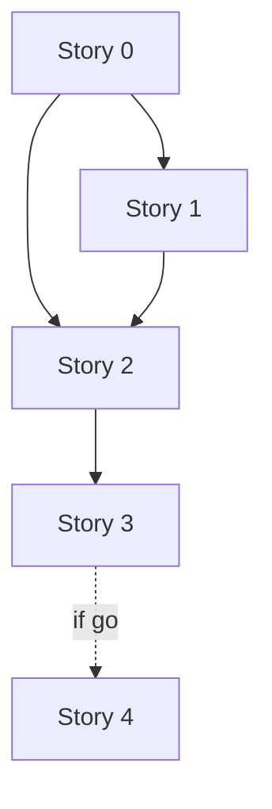

# TD41 — Agent Context Slimming (`.copilot/context.md`)

## Status

- **Type**: Technical Debt / Agent Context Hygiene
- **Priority**: Medium (every agent session pays the cost; no correctness defect)
- **Context**: `.copilot/context.md` (symlinked as `CLAUDE.md` / `AGENTS.md` / `gemini.md`), `docs/*`, `packages/architecture-check`
- **Created**: 2026-09-20
- **Discovered**: M22-S04 session review, 2026-09-20 — `/context` showed memory files at ~24.8k tokens; an audit of the file followed.
- **Decision status**: Ready for discovery in the order below; each story still begins with `/story-discovery`.
- **Related**: TD37 (architecture-check conventions), `docs/STORY_SCHEMA.md`, `docs/DEFINITION_OF_DONE.md` (stale-reference sweep)
- **Revised**: 2026-09-20 — pre-discovery review session narrowed the trap-scenario scope, added a canonical-home dedup rule, and fixed a pointer-matching gap (bold-lead-in-bullet targets), all folded into Story 0 below before any story goes to `/story-discovery`.
- **Extended**: 2026-09-20 — added Stories 3–4 (measure, then conditionally split `docs/ENGINEERING_RULES.md`) after the same session's real `/context` evidence suggested that file — not `context.md` — may be the larger per-session cost driver on ordinary coding tasks. TD scope broadens from "`.copilot/context.md` only" to "agent-loaded doc hygiene"; Stories 0–2 are unchanged.
- **Story 3 resolved**: 2026-09-23 — real, isolated token measurement (61,936 / 19,241 / 7,438 for `ENGINEERING_RULES.md` / `AGENT_PATTERNS.md` / `CODE_STANDARDS.md`; 88,615 combined) plus real-session corroboration. Decision: **GO** — Story 4 runs next, with a locked-in split-boundary list (see Story 3's own section for full detail).

## Problem

`.copilot/context.md` is loaded into every agent session (Claude, Codex, Gemini — one canonical file by design). Measured 2026-09-20: **512 lines, 62,935 chars** (harness-reported ~24.8k tokens for memory files).

- §7 Engineering Rules is **126 lines / 29,067 chars — 46% of the file**. It holds 37 "Critical code invariants" bullets averaging 413 chars (longest 1,082), where the _rule_ is one sentence and the rest is rationale that the pointed-to doc already holds.
- 34 of the 37 bullets already end with `→ docs/… § …`; **32 resolve, 1 is broken** (`docs/15-HOTSITE_DYNAMIC_ARCHITECTURE.md § implicit vs. explicit CSS defaults`); 3 bullets have no pointer.
- Story history is not the driver (0 PR numbers and 0 milestone tags in the invariants; ~9 dates file-wide — e.g. the Snyk-removal paragraph, "Trimmed from 20 to 11", "decided 2026-07-23 per TD31").
- Nothing stops regrowth: the file grew again in the same session that identified the problem.
- **Cross-doc duplication predates this TD and compounds the problem:** the `useExisting`/`useClass` DI rule is independently, fully explained in three places — `docs/ANTI_PATTERNS.md` row 68, `docs/ENGINEERING_RULES.md` lines 756–767 (its own code example, its own "Why:"), and `CLAUDE.md` §8 — with no pointer between them. Confirmed 2026-09-20 during this TD's own review. Fixing this specific case is now part of Story 0 (below), under a new canonical-home rule.

**Why this matters:** every session spends context on rationale it rarely needs, diluting the gates that must not be missed; a broken pointer silently drops a rule's detail; without a guard the file only grows.

## Chosen approach (decided in this session, 2026-09-20 — not yet via story-discovery)

**Keep-in-file test.** A rule stays in `context.md` only if (a) it is a non-negotiable gate/invariant (§0, §2, §9 verbatim), (b) it is CI-enforced (name + one line), or (c) it is a _writing-time trap_ an agent hits before it would think to load a doc — trigger + rule in ≤ 2 lines. Everything else becomes a pointer; the _why_, examples and history live in the target doc.

**Safety net before any cut:** a mechanical guard (required anchors, resolvable pointers, no PR#/ISO dates, per-section budgets as a ratchet) plus a set of named trap scenarios evaluated against the file before and after.

**Canonical-home rule (added 2026-09-20, post-draft review; filenames updated 2026-09-23 per TD41-S4's split).** Each rule/pattern gets exactly one file that holds its full explanation: `docs/ANTI_PATTERNS.md` for "what not to do + why + fix", the relevant `docs/ENGINEERING_RULES_*.md` split file / `docs/CODE_STANDARDS.md` for "how to do it correctly", `docs/CI_TRAPS.md` for CI/deploy-specific gotchas. Every other file — including `context.md` itself — gets a `→ doc § heading` pointer, never a second full explanation. Applies in two directions Story 0 now checks: (1) a pattern already fully explained in one canonical doc must not get a second full explanation in another (the `useExisting` case above), and (2) relocating a §7 bullet's rationale (Story 1) must land in the *one* doc that should canonically hold it, not wherever happens to already have some text on the topic.

Rejected: deleting bullets and relying on §10's task→docs table (writing-time traps aren't loaded until the agent knows to look); reword-only compression (moves nothing, unverifiable); a size cap alone (invites deleting rules to pass); a mechanical cross-doc duplication *detector* in `architecture-check` (fuzzy/semantic — the same rule is worded differently in each duplicate location, so exact-match or budget-style checks won't catch it; this is exactly the "broad, exploratory" check `docs/ANTI_PATTERNS.md` row 143 says not to force into a blocking gate — routed to `/docs-audit` instead, non-blocking, see that skill's updated mandate).

### Stories

- Story 0 — guard + trap scenarios (foundation)
- Story 1 — slim §7 (depends on 0)
- Story 2 — slim the rest + final budget (depends on 0, 1)
- Story 3 — measure `docs/ENGINEERING_RULES.md`'s real per-session cost and decide whether to split it (depends on 2)
- Story 4 — execute the split, **conditional on Story 3's "go" decision** (depends on 3; dropped entirely if Story 3 says no)

### Story 0 — Agent-context guard: detector, ratchet policy, trap scenarios 🟡 ✅ Done

**Agent:** `devops` + `backend-ts`
**Complexity:** M
**Docs to load:** `docs/TD37-ARCHITECTURE-CHECK-DECISIONS.md` (detector + policy discipline), `docs/08-TESTING_STRATEGY.md`, `.copilot/context.md` §0/§2/§7/§9, `docs/STORY_SCHEMA.md`
**Dependencies:** none
**Pattern:** plain composition — no named pattern applies (one detector returning the existing `ScanResult`, like every sibling in `packages/architecture-check/src/detectors/`)

**Description:**
Build the safety net before touching a rule.

1. **Detector `checkAgentContextFile`** reads `.copilot/context.md` (`scannedTargets = 1`, so the CLI's existing "zero targets" guard fails if the file moves), driven by `packages/architecture-check/agent-context-policy.json` (separate from `architecture-policy.json` to leave that registry's schema untouched): `requiredAnchors` (phrases that must exist — "Story / TD gate", "Doc/config gate", "Autonomous implementation chain", "Pre-push validation", "Workspace ownership gate", "Local verification gate", the eleven §2 invariants by number, "PR GATE", "Stuck conditions"); pointer check (every ``→ `docs/…` `` or ``→ `infra/…` `` reference must resolve to an existing file, and a `§ <heading>` must match, case-insensitive prefix, **either** a markdown heading (`#`–`####`) **or** a bold-lead-in bullet label (`- **Label:**`) in that file — verified 2026-09-20 that `docs/ENGINEERING_RULES.md` alone has 25 pointer targets written as bold-lead-in bullets alongside 73 real headings, so matching headings only would false-flag ~25 existing, legitimate pointers on day one; the dual-style match is also what correctly identifies today's one broken pointer, whose target — `docs/15-HOTSITE_DYNAMIC_ARCHITECTURE.md` line 606 — exists only as a bold bullet, not a heading); `forbiddenPatterns` (`PR #\d+` and ISO dates, with an allowlist whose entries carry rationale/owner/review date); `budgets` (`maxLines`/`maxChars` for the file and per top-level section, **set at today's measured values so the guard lands green — a ratchet**: Stories 1–2 lower them to what they achieve; raising one needs a stated reason); `symlinkIntegrity` — `CLAUDE.md`, `AGENTS.md`, `gemini.md` must each resolve (`fs.lstatSync().isSymbolicLink()` + target check) to `.copilot/context.md`. Verified 2026-09-20 all three are intact today, but nothing currently guards against one silently becoming a divergent real file (a merge tool, an IDE action, or a bad conflict resolution can do this with no other test catching it) — which would break the "one canonical file" premise this entire TD depends on.
2. **`docs/AGENT_CONTEXT_TRAP_SCENARIOS.md`**: scoped to patterns with **no existing mechanical backstop** — no CI-enforced ESLint selector/`architecture-check` detector. Verified 2026-09-20: `useExisting`, hardcoded `'pt-BR'`, network I/O inside `txManager.run()`, and a missing locale entry are already CI-enforced (real ESLint selectors/detectors confirmed present in `apps/backend/eslint.config.js`/`apps/web/eslint.config.js`/`packages/architecture-check`) — excluded from the scenario set; the trap doc cites the backing detector/ESLint-rule name instead of re-testing them. `WHERE id = ? without tenant_id` is already `docs/ANTI_PATTERNS.md` row 1 — cited by row number, no scenario needed. The remaining ~5 patterns (outbox event with no consumer; unescaped `%…%` LIKE; the Cloudflare Turnstile test-sitekey iframe trap — corrected 2026-09-20 from an earlier, non-existent "`getByText` in an E2E spec" description found during `/story-discovery`; the real content is `docs/ENGINEERING_RULES.md § Cloudflare Turnstile's test sitekey never renders an interactive iframe`, lines 857–879; plain `ADD CONSTRAINT CHECK` on a live table; `InsertQueryBuilder.onConflict()`) get **both** treatments, not an either/or: item 4 below promotes their full explanation into `ANTI_PATTERNS.md`/`CI_TRAPS.md` (closing the gap that today only `ENGINEERING_RULES.md` — never auto-loaded by `/pre-pr` — holds them), *and* they still get a scenario here, because a `/pre-pr`-time catch is a later, more expensive backstop than a write-time one and doesn't remove the need to verify the write-time trigger survives compression. **The trap doc itself carries no rationale** — each entry is only a prompt, the expected agent behavior, a pass/fail criterion, the `context.md` bullet it exercises, and a citation to its (now-promoted) `ANTI_PATTERNS.md`/`CI_TRAPS.md` row; restating the "why" here would recreate the exact duplication this TD just fixed for `useExisting`. Plus a gate scenario: an agent given a story prompt must reach `/story-discovery` first (no promotion needed — already verbatim in `context.md` §9). Evaluation: run each prompt in a fresh session against the pre-slim file (`git show <base-sha>:.copilot/context.md`) and the post-slim file; any scenario that passed before and fails after means the responsible bullet's trigger was cut too far — restore it.
3. **Manifest convention** for Stories 1–2: every sentence removed from `context.md` is listed in the PR description as `removed sentence → <doc> § <heading>` (removed lines are listed mechanically with `git diff -U0 <base> -- .copilot/context.md | grep '^-'`); the destination heading must exist (or be added in the same PR). **Cross-doc check, not just the one target:** before writing relocated content into a doc, grep all four canonical docs (`docs/ANTI_PATTERNS.md`, `docs/ENGINEERING_RULES.md`, `docs/CI_TRAPS.md`, `docs/CODE_STANDARDS.md`) for an existing explanation of the same pattern — not only the one the bullet already happened to point to. If found, cite it instead of writing a second copy (this is the check that would have caught the `useExisting` triplication). Nothing is deleted — only relocated, or justified as redundant with a cited existing line.
4. Fix the concrete issues found during this TD's own review, so the guard is green with no exception, and close the `/pre-pr`-coverage gap for the tier-3 trap patterns: (a) the broken pointer — restore a real `####` heading at `docs/15-HOTSITE_DYNAMIC_ARCHITECTURE.md` line 606 (preferred over repointing, since it also resolves correctly under a plain-heading-only reading, not just the dual-style match above); (b) the confirmed `useExisting`/`useClass` triplication — collapse `docs/ENGINEERING_RULES.md` lines 756–767 to a `→ docs/ANTI_PATTERNS.md` pointer at row 68's pattern (its canonical home per the new canonical-home rule); leave `CLAUDE.md` §8's existing one-line table row as-is — it already meets the keep-in-file test's CI-enforced criterion (b), so it isn't a third full explanation; (c) **promote the item-2 tier-3 patterns' full explanation out of `docs/ENGINEERING_RULES.md`**, which `/pre-pr`'s bad-smell-audit never auto-loads, into a doc it does: outbox-no-consumer, unescaped LIKE, `onConflict()`, and CHECK-constraint-on-live-table become new `docs/ANTI_PATTERNS.md` rows (Pattern|Problem|Fix shape, matching existing rows like #52/#56); the Cloudflare Turnstile test-sitekey iframe trap (lines 857–879, a clean standalone heading) becomes a `docs/CI_TRAPS.md` entry (a test-execution nuance, not a code anti-pattern); update each corresponding `context.md` §7 bullet's pointer to the new location — the rule's content and CI-enforcement status don't change, only where the full detail lives.
5. **One-time cross-doc dedup audit:** beyond the `useExisting` case already fixed in item 4, pairwise-compare `docs/ANTI_PATTERNS.md`, `docs/ENGINEERING_RULES.md`, `docs/CI_TRAPS.md`, and `docs/CODE_STANDARDS.md` for any other pattern with substantially overlapping full-detail content in 2+ files. Fixing every hit found isn't required to close this story (that's bounded scope creep) — record them as a findings list in the PR description, to be resolved by Story 1 (if the pattern falls inside `context.md` §7's scope) or Story 2 (otherwise) when that story's content-relocation work touches the same doc anyway.

**Backend use case steps:** none — no runtime code.
**Backend HTTP surface:** none.
**BFF endpoint spec:** none.
**New migration / i18n keys / env vars / feature flags:** none.

**Files to create/modify:** _(existing paths verified 2026-09-20)_

- `packages/architecture-check/src/detectors/agent-context-file.ts` (new)
- `packages/architecture-check/src/detectors/agent-context-file.spec.ts` (new)
- `packages/architecture-check/agent-context-policy.json` (new)
- `packages/architecture-check/src/index.ts` (modify — export `checkAgentContextFile`)
- `packages/architecture-check/src/cli.ts` (modify — add to `results`; `cli-regression.spec.ts` does not enumerate rules, so it is unchanged)
- `docs/AGENT_CONTEXT_TRAP_SCENARIOS.md` (new — minimal eval spec only: prompt + expected behavior + pass/fail criterion + citation, no restated rationale)
- `.copilot/context.md` (modify — add `agent-context-file` to the "CI-enforced by `architecture-check` detectors" list; fix the broken pointer; repoint the 5 promoted §7 bullets to their new `ANTI_PATTERNS.md`/`CI_TRAPS.md` location)
- `docs/15-HOTSITE_DYNAMIC_ARCHITECTURE.md` (modify — restore the heading at line 606)
- `docs/ENGINEERING_RULES.md` (modify — collapse the `useExisting` duplicate at lines 756–767 to a pointer at `docs/ANTI_PATTERNS.md` row 68; remove the 4 promoted patterns' full explanations, replaced with pointers)
- `docs/ANTI_PATTERNS.md` (modify — add new rows for outbox-no-consumer, unescaped LIKE, `onConflict()`, CHECK-constraint-on-live-table)
- `docs/CI_TRAPS.md` (modify — add the Cloudflare Turnstile test-sitekey iframe entry, relocated from `docs/ENGINEERING_RULES.md` lines 857–879)

**Acceptance criteria — product:**

- [ ] An edit that deletes a required anchor, breaks a doc pointer (in either heading style), adds a PR number or non-allowlisted ISO date, or grows a section past its budget fails `pnpm architecture-check` (hence `ci:fast` and the CI Architecture validation job) with a finding naming the line.
- [ ] The guard lands green on today's file with zero broken pointers and no exception for the pointer; the pointer-resolution unit tests include a case targeting a bold-lead-in-bullet anchor, not just a markdown heading.
- [ ] `CLAUDE.md`, `AGENTS.md`, `gemini.md` are verified as real symlinks to `.copilot/context.md` by the guard; a divergent real file at any of the three fails `pnpm architecture-check`.
- [ ] `docs/AGENT_CONTEXT_TRAP_SCENARIOS.md` defines scenarios only for patterns with no existing CI enforcement (≈5–6 scenarios, not 10) plus the story-discovery gate scenario; every CI-enforced pattern lists the detector/ESLint-rule that backstops it instead of a scenario; every included scenario's entry has no restated rationale — only prompt, expected behavior, pass/fail criterion, the `context.md` bullet it exercises, and a citation to its `ANTI_PATTERNS.md`/`CI_TRAPS.md` row; a baseline pass/fail table against the current file is recorded in the PR.
- [ ] The five promoted tier-3 patterns (outbox-no-consumer, unescaped LIKE, `onConflict()`, CHECK-constraint-on-live-table, Cloudflare Turnstile test-sitekey iframe trap) each have a real row in `docs/ANTI_PATTERNS.md` or `docs/CI_TRAPS.md`, and their `context.md` §7 bullets point there instead of `docs/ENGINEERING_RULES.md`.
- [ ] Zero cross-doc content duplication remains for any pattern touched by this story: the `useExisting`/`useClass` triplication (`ANTI_PATTERNS.md` row 68 / `ENGINEERING_RULES.md` lines 756–767 / `CLAUDE.md` §8) is collapsed to one canonical explanation with pointers from the others; any further overlaps found during the item-5 audit are recorded in the PR as a findings list for Stories 1–2.

**Acceptance criteria — technical:**

- Unit:
  - [ ] `agent-context-file.spec.ts`: missing anchor; unresolvable pointer (missing file; existing file with missing `§` heading in both anchor styles); a pointer resolving to a bold-lead-in-bullet label (`- **Label:**`) rather than a markdown heading — must pass, not flag as broken; `PR #123`; non-allowlisted ISO date; allowlisted date accepted; maxLines/maxChars/per-section overruns; `scannedTargets = 1`; zero targets when the file is absent; all three symlinks intact (pass); one symlink replaced with a divergent real file (fail); one symlink pointing to the wrong target (fail)
- Integration: none — pure file-content function, no DB
- Tenant isolation: n/a — no tenant data
- E2E: none — covered by unit; the wiring runs as `pnpm architecture-check` in CI
- [ ] Coverage ≥80% on changed code
- [ ] `tsc --noEmit` clean, lint clean

### Story 1 — Slim §7 Engineering Rules 🟡 ✅ Done

**Agent:** `devops`
**Complexity:** L
**Docs to load:** `.copilot/context.md` §7, `docs/ENGINEERING_RULES.md`, `docs/CI_TRAPS.md`, `docs/CODE_STANDARDS.md`, `docs/AGENT_CONTEXT_TRAP_SCENARIOS.md`, `infra/terraform/README.md` § Gotchas (Cross-layer deployment invariants' pointer target — read-only verification, no edits expected there)
**Dependencies:** Story 0
**Pattern:** plain composition — no named pattern applies (documentation relocation, no code)

**Description:**
Apply the keep-in-file test to **every bullet in all of §7** — not just the "Critical code invariants" subsection, but also Architecture, Cross-layer deployment invariants, and CI gates, each of which has the same redundant "rule + rationale + `→ doc`" shape and whose pointer targets were verified (2026-09-20, this discovery session) to already hold the full rationale (`infra/terraform/README.md`'s "Gotchas" section for Cross-layer; `docs/CI_TRAPS.md § Snyk SCA failures` for the CI-gates paragraph) — compressing them is equally mechanical/low-risk, it just wasn't named explicitly in the original draft of this story. Each becomes ``- **<trigger>** — <rule, ≤ 2 lines>. → `doc` § <heading>``; per Story 0's canonical-home rule, the removed rationale is moved into its one canonical doc **only where no canonical doc already holds it** — checked across all four (`docs/ANTI_PATTERNS.md`, `docs/ENGINEERING_RULES.md`, `docs/CI_TRAPS.md`, `docs/CODE_STANDARDS.md`), not just the single doc the bullet happened to point to; many already hold it — then just cite. Also resolve any Story-0-item-5 findings whose pattern falls inside §7's scope.

**Non-negotiable safeguard (added 2026-09-20, post-discovery-review): preserving agent context quality outranks hitting any specific character target.** Before cutting a bullet down to trigger + pointer, verify two things, not one: (1) the target doc actually, fully covers the cut content (grep it — don't assume from the existing `→` citation alone), and (2) an agent doing the kind of task the trigger describes is *guaranteed* to load that target doc via §10's task→docs table — dynamic loading only substitutes for inline text when that's true. A bullet describing a genuine writing-time trap an agent could hit *before* it would think to load any doc (keep-in-file criterion (c)) stays inline regardless of size pressure — never cut a real trigger just to make a number. If applying this safeguard honestly leaves §7 larger than originally hoped, that is the correct outcome, not a shortfall — the budget gets ratcheted to whatever this careful pass actually achieves (see the revised acceptance criterion below), not the other way around.

**CI-backing lever (added 2026-09-20): where a mechanical check already exists, trust it and compress harder.** Verified 2026-09-20: only 5 of the 37 invariant bullets are currently labeled `CI-enforced`; the other 32 are not. For each unlabeled bullet, grep `packages/architecture-check/src/detectors/` and the relevant `eslint.config.js` files for a real backing check before assuming none exists — if one is found, add the `CI-enforced` label and compress that bullet to keep-in-file criterion (b)'s shape (name + one line; the CI gate itself is the actual safety net, prose redundancy adds no protection). This is a real but bounded lever, not a way to close the whole budget gap: most of these 32 describe genuinely un-mechanizable traps (timing/behavioral/business-logic gotchas no AST-based detector can catch — e.g. Cloud Run timer starvation, migration-backfill ordering, which race-condition primitive shape fits) and must keep real explanatory prose per the safeguard above regardless of this pass's outcome.

Of the three pointer-less bullets: the meta bullet ("Several invariants are already fully covered…") is deleted as redundant with §7's own top-line pointer; the pt-BR/locale bullet gets a real pointer (`docs/ANTI_PATTERNS.md`'s existing hardcoded-locale row already covers it in full); the "CI-enforced by architecture-check detectors" enumeration bullet stays **self-contained, with no forced pointer** — no canonical doc holds a detector registry (checked `docs/TD37-ARCHITECTURE-CHECK-DECISIONS.md`: tool-selection rationale only, not a registry), and inventing a citation there would be a fabricated pointer, not real redundancy removal; this bullet already matches keep-in-file criterion (b) ("CI-enforced: name + one line" per item) as-is. A 3-line "How to edit this file" header states the keep-in-file test, the canonical-home rule, **and this safeguard**. **No rule's content changes** — only relocation; a content change is raised separately. Ratchet the §7 budget in the policy to the achieved value. Run the trap scenarios before/after and put the manifest and the table in the PR description.

**Backend use case steps / HTTP surface / BFF endpoint spec:** none.
**New migration / i18n keys / env vars / feature flags:** none.

**Files to create/modify:**

- `.copilot/context.md` (modify)
- `docs/ENGINEERING_RULES.md` (modify — receives relocated rationale only where missing)
- `docs/CI_TRAPS.md` (modify — Snyk narrative + any relocated trap text)
- `docs/CODE_STANDARDS.md` (modify — only if a relocated rule belongs there)
- `packages/architecture-check/agent-context-policy.json` (modify — ratchet the §7 budget)

**Acceptance criteria — product:**

- [ ] No pre-set §7 total is required. The keep-in-file test (plus the safeguard above) is applied faithfully across all of §7 (Critical code invariants, Architecture, Cross-layer deployment invariants, CI gates) — real, verified-redundant rationale relocated, no criterion-(c) trigger bullet cut for size — and the policy's §7 budget is ratcheted to whatever that honest pass measures at (today's baseline: 29,258 chars). Within the "Critical code invariants" subsection specifically: every invariant bullet ≤ 2 lines + pointer; average bullet ≤ 220 chars where the safeguard allows it.
- [ ] No rule lost: the PR description carries the full manifest (removed sentence → `<doc> § <heading>`); every destination heading exists; a reviewer spot-checks ≥ 10 entries for the relocated content.
- [ ] No relocated content duplicates an existing explanation in a different canonical doc — checked against all four (`ANTI_PATTERNS.md`, `ENGINEERING_RULES.md`, `CI_TRAPS.md`, `CODE_STANDARDS.md`), not just the bullet's original target.
- [ ] Every trap scenario that passed against the base file still passes against the slimmed file (table in the PR) — this, not the char count, is the actual proof that no writing-time trigger was lost.
- [ ] The two genuinely pointer-less bullets (pt-BR/locale; the meta bullet, which is deleted instead) are resolved; the CI-enforced detector-list bullet is confirmed to intentionally keep no pointer, with the reason stated in the PR.

**Acceptance criteria — technical:**

- Unit: `pnpm architecture-check` green with the ratcheted §7 budget (no new test files)
- Integration: none — no code
- Tenant isolation: n/a
- E2E: none
- [ ] Coverage ≥80% on changed code — n/a, no executable code changed (one JSON value)
- [ ] `tsc --noEmit` clean, lint clean, `pnpm prettier --check .` clean

### Story 2 — Slim the rest of the file and set the final budget 🟡 ✅ Done

**Agent:** `devops`
**Complexity:** M
**Docs to load:** `.copilot/context.md` §6/§8–§17, `.claude/commands/pr-land.md`, `.claude/commands/pre-pr.md`, `.claude/commands/run-batch.md`, `docs/REPOSITORY_STRUCTURE.md`, `docs/DEFINITION_OF_DONE.md`
**Dependencies:** Story 0, Story 1
**Pattern:** plain composition — no named pattern applies

**Description:**
Same test on the remaining weight: §9 Story Implementation Workflow (10.7k) — keep the gates verbatim (PR GATE, Step 0 rule, autonomous chain, stuck conditions, Step 10) but point to the command files for what they already hold (Step 5's long bot-finding-discipline paragraph is in `pr-land.md` Step 3; "Parallel batch execution" is in `run-batch.md`); §10 loading table (5.0k) — keep the rows, shorten verbose cells; §8 — drop the "Trimmed from 20 to 11 on…" history sentence; §11 — move the "(decided 2026-07-23 per TD31 Story 11…)" history to `docs/REPOSITORY_STRUCTURE.md`; §6 — drop "found via /docs-audit 2026-08-04"; §14 ("Canonical registry: §17") deleted and §16 merged into §17's intro. Also resolve any remaining Story-0-item-5 dedup findings outside §7's scope, using the same canonical-home rule as Story 1 (check all four canonical docs, not just one target, before writing relocated content) — including the one item Story 0 recorded as inside §7's scope but Story 1's PR (#493) didn't address: `docs/ENGINEERING_RULES.md § /internal/ routes are pre-auth only` and `docs/CODE_STANDARDS.md § /internal routes and RequestContext` still fully duplicate the same explanation (confirmed still true 2026-09-22, this story's discovery) — collapse `CODE_STANDARDS.md`'s copy to a pointer at `ENGINEERING_RULES.md`'s fuller explanation, its canonical home. Ratchet the total budget from Story 1's actual result (from the 62,935/512 pre-TD41 baseline to today's 58,418/513 after Story 1) to whatever this story's honest pass achieves — **no pre-set number required** (resolved at this story's discovery, 2026-09-22, the same way Story 1's own fixed-target AC was revised: quality/completeness of agent context outranks hitting a pre-picked size), remove the allowlist entries that no longer apply, and add a one-line DoD item: a new rule goes into its one canonical doc first and gets a `context.md` line only if it passes the keep-in-file test.

**Budget-vs-quality tradeoff (locked in during story-discovery, 2026-09-22).** Same resolution as Story 1: the original AC's fixed `≤ 45,000 chars / ≤ 400 lines` target is not required to be hit if honoring the keep-in-file test and Story 1's non-negotiable safeguard (never cut a genuine writing-time trigger or gate just to hit a number) can't reach it. Apply the described compressions faithfully (§9 Step 5 + Parallel batch execution → pointers, §10 cell-shortening, §6/§8/§11/§14/§16 drops, the folded-in `/internal` routes dedup fix) and ratchet the policy's file/section budgets to whatever that honest pass measures at.

**Backend use case steps / HTTP surface / BFF endpoint spec:** none.
**New migration / i18n keys / env vars / feature flags:** none.

**Files to create/modify:**

- `.copilot/context.md` (modify)
- `docs/REPOSITORY_STRUCTURE.md` (modify — relocated §11 decision history)
- `docs/DEFINITION_OF_DONE.md` (modify — one line)
- `docs/ENGINEERING_RULES.md` (modify — verify `§ /internal/ routes are pre-auth only` stays fully self-sufficient as the canonical home)
- `docs/CODE_STANDARDS.md` (modify — collapse `§ /internal routes and RequestContext` to a pointer)
- `packages/architecture-check/agent-context-policy.json` (modify — final budgets, trimmed allowlist)

**Acceptance criteria — product:**

- [ ] No pre-set `context.md` total is required (per the budget-vs-quality tradeoff above) — the keep-in-file test and Story 1's non-negotiable safeguard are applied faithfully across §6/§8–§17, and the policy's file/section budgets are ratcheted to whatever that honest pass measures at; zero PR numbers; zero non-allowlisted ISO dates.
- [ ] Protected gates (§0, §2, §9's PR GATE / stuck conditions / Step 10) are byte-identical to the base — evidence: `git diff` restricted to those line ranges is empty (pasted in the PR).
- [ ] Every trap scenario that passed against the base file still passes, including the gate scenario (`/story-discovery` first).
- [ ] Manifest complete, as in Story 1, including the cross-doc duplication check against all four canonical docs.
- [ ] Every Story-0-item-5 dedup finding — including the `/internal` routes duplication originally assigned to Story 1 but missed there — is either resolved (collapsed to one canonical doc + pointers) or explicitly carried forward with a stated reason; none silently dropped.

**Acceptance criteria — technical:**

- Unit: `pnpm architecture-check` green with the final budgets
- Integration: none
- Tenant isolation: n/a
- E2E: none
- [ ] Coverage ≥80% on changed code — n/a, no executable code changed
- [ ] `tsc --noEmit` clean, lint clean, `pnpm prettier --check .` clean

### Story 3 — Measure `docs/ENGINEERING_RULES.md`'s real per-session cost and decide on a split 🟡 ✅ Done

**Agent:** `devops`
**Complexity:** S
**Docs to load:** `docs/ENGINEERING_RULES.md` (post-Story-2 content), `.copilot/context.md` §10 (loading table), this TD's Problem/self-dry-run sections (the heading-based categorization already worked out)
**Dependencies:** Story 2 (measurement must reflect the file's content after all TD41 relocations land, not a stale pre-TD41 snapshot)
**Pattern:** plain composition — an investigation/decision story, no code

**Description:**
Get real evidence before committing to a restructuring, instead of extrapolating from file-size arithmetic — the exact mistake this TD's own self-dry-run already flagged against, citing `docs/ANTI_PATTERNS.md` row 149's "arithmetic that lines up is not confirmation" precedent.

1. **Isolated measurement:** in a fresh, otherwise-empty session, `Read` `docs/ENGINEERING_RULES.md` alone and record the exact token cost via `/context` — zero confounds, unlike an in-session delta blended with story-specific doc loads and code exploration (which is all a real in-session `/context` comparison during this TD's own discussion could show). Repeat for `docs/AGENT_PATTERNS.md` and `docs/CODE_STANDARDS.md` to get the real, measured size of the full "Writing any code" bundle — not the char/4 estimate used while drafting this TD.
2. **Real-session sampling, if available:** if `/context` snapshots exist from a handful of past stories' implementation phases (the M22-S05 day-grid session is one concrete example already seen during this TD's own discussion), sample 2–3 more to see how much of their `Messages` growth is plausibly attributable to this doc bundle versus story-specific docs/code exploration — corroborating evidence, not the primary measurement.
3. **Decision, backed by the numbers from 1–2, not the heading-count analysis alone:** either (a) confirm the bundle's real cost justifies Story 4, and lock in a concrete split-file boundary list — informed by the heading-based categorization already produced during this TD's discussion (Testing as its own file, cleanly separable; Backend+Database merged, not split, since persistence patterns are backend patterns in this codebase; BFF evaluated for whether its small existing footprint justifies its own file or should fold into Backend; Frontend/Web as its own file; a Shared/cross-cutting file for patterns spanning 2+ layers, e.g. the exception-handling/i18n envelope, Value Objects, Controller/Route boundaries) — or (b) close this story with "not worth it," recording the measured numbers as the stated reason, in which case Story 4 does not run.
4. Regardless of the split decision, record the confirmed routing mismatch found during this TD's discovery: the `Cloud Run CPU throttling`/`vpc_egress` entries live in a doc that `§10`'s "Writing Terraform / infra code" row never loads — a correctness bug independent of the size question. Fix it as part of Story 4 if it runs, or as a tiny standalone fix if Story 3 concludes "not worth it."

**Resolved at story-discovery, 2026-09-23 — method substitution.** `/context` cannot literally be invoked the way the story describes: it reports the *current interactive session's* own accounting, and there is no way to script "open a fresh, otherwise-empty session and run `/context`" without a human at the terminal. Confirmed with the user before proceeding (never improvise past a named reference without asking): used **JSONL transcript introspection** instead — Claude Code writes every subagent's full transcript, including real per-turn Anthropic API `usage` blocks (`cache_creation_input_tokens`, `cache_read_input_tokens`, etc., straight from the API response), to `~/.claude/projects/<project>/<session>/subagents/agent-<id>.jsonl`. A fresh, non-fork general-purpose subagent was scripted to `Read` the three files in fixed sequence and emit nothing else; each turn's `cache_creation_input_tokens` delta (minus the immediately preceding turn's own `output_tokens`, which get folded into the next turn's input) isolates that file's exact real token cost. This is a genuine tokenizer measurement, not a char/4 estimate, and needed no manual session-switching from the user.

**Measured results (2026-09-23, post-Story-2 content):**

| File | Real token cost | Notes |
|---|---|---|
| `docs/ENGINEERING_RULES.md` | **61,936** | A single unbounded `Read` call hits Claude Code's per-call token cap and returns only lines 1–361 of 974 (~38%) — not silent: the tool attaches an explicit `read_truncation_notice` banner verified in the raw transcript verbatim: *"[Truncated: PARTIAL view — .../docs/ENGINEERING_RULES.md: showing lines 1-361 of 974 total (57225 tokens, cap 25000). Call Read with offset=362 limit=361 for the next page, or Grep to find a specific section. Do NOT answer from this page alone if the answer may be further in the file.]"* — confirming the real 25,000-token cap and giving an independent, harness-side token estimate (57,225) that lands within ~8% of this row's own real, API-usage-derived total, cross-validating the measurement method. Getting the full file required 3 sequential paginated `Read` calls (offsets 1, 362, 723); the **61,936 total is the sum of each chunk's real `cache_creation_input_tokens` delta minus the immediately preceding turn's own `output_tokens`** (which get folded into the next turn's cached input) — 24,384 + 24,219 + 13,333 — so cached prefixes, assistant/tool-call scaffolding, and tool-result wrapper overhead are all netted out of each chunk before summing. |
| `docs/AGENT_PATTERNS.md` | **19,241** | Full file in one `Read` call, no truncation. Same derivation: that turn's `cache_creation_input_tokens` (19,830) minus the preceding turn's `output_tokens` (589). |
| `docs/CODE_STANDARDS.md` | **7,438** | Full file in one `Read` call, no truncation. Same derivation: that turn's `cache_creation_input_tokens` (7,528) minus the preceding turn's `output_tokens` (90). |
| **Combined "Writing any code" bundle** | **88,615** | `ENGINEERING_RULES.md` alone is ~70% of it. |

**Real-session corroboration (best-effort, item 2):** sampled two real past sessions' transcripts (an M21-S06 implementation session and a large M20-era session) for actual `Read`-tool calls on `docs/ENGINEERING_RULES.md`. Neither did a full load: both used `grep`/Bash to find a section first, then a small targeted `Read` with an explicit offset/limit — real marginal cost ~111 tokens per call, nowhere near the full-file number. This *discovery session itself* reproduced the same pattern live: when this skill's own Step 2 said "load unconditionally: `docs/ENGINEERING_RULES.md`," the actual action taken was a heading-only `grep`, not a full `Read`. Conclusion: in practice, agents (including this one, moments earlier) routinely route around the file's real cost by grepping instead of complying with "load unconditionally" — which means the doc's own stated safety net ("a story can no longer be checked against them without loading this file explicitly," §Step 2) is being informally bypassed in the field, independent of the pure cost question.

**Decision: GO.** Both the raw cost (61,936 tokens, the dominant share of the bundle) and the truncation behavior (a compliant full read needs 3 calls; a naive one gets only ~38%, flagged by the tool's own truncation banner) are concrete, mechanically-confirmed reasons — not file-size arithmetic. Story 4 runs.

**Split-file boundary list (locked in).** BFF-specific content in the file is genuinely tiny — three short headings (Express `Request.user` typing, Staff OAuth login URL format, `/internal/` routes are pre-auth only), ~30 lines total — so it folds into Backend rather than earning its own file; no `docs/ENGINEERING_RULES_BFF.md` is created.

- **`docs/ENGINEERING_RULES_TESTING.md`** — Testing Patterns (detail) + all its subsections; Cloudflare Turnstile's test sitekey; SonarCloud's `S5976` duplicate-test rule; Node's default V8 heap limit; an integration test seeding fixtures under fixed tenant UUIDs.
- **`docs/ENGINEERING_RULES_BACKEND.md`** (Backend + Database + BFF folded in) — Transactions + all subsections; Migration backfills; Migration-driven privilege grants; Adding a CHECK constraint to a live table; LIKE/ILIKE pattern escaping; Aggregate domain events → outbox; Cloud Run CPU throttling; OpenRouter chatbot outbound HTTP resilience; Cloud Run `vpc_egress` mode (this is where the routing-mismatch fix lands in Story 4); Backend read use cases for cross-context access; Adding a new notification type; Event Handlers (Pub/Sub consumers); the 3 BFF headings above; a lock only orders callers who both acquire it; `architecture-check`'s `transactional-save` detector; a wholesale-replaced child collection; a child table with only a composite PK; a versioned append-only child concept.
- **`docs/ENGINEERING_RULES_FRONTEND.md`** — Web — Shared Helpers (`apps/web`) + all subsections; CSP allowances for a new external UI resource; Hotsite full-page components must paint `--ba-background`.
- **`docs/ENGINEERING_RULES_SHARED.md`** (genuinely cross-cutting, 2+ layers) — Repository slice ownership; Value Objects + all subsections; Partial-update types for deeply-nested Zod schemas; Schema-level enforcement of "never persisted here" invariants; RequestContext; Observability ports; Controller, Route, and Shared-UI Boundaries; Static locale/config files in workspace packages; Authoring new i18n UI copy keys; Exception handling & i18n pattern + all subsections; `no-restricted-syntax` selectors must be checked against every bypass shape; before a blind `Write`, grep for expected exported symbols; re-check a same-file documented invariant when extending an algorithm.

**Files to create/modify:**
- `td/TD41-AGENT-CONTEXT-SLIMMING.md` (modify — record the measured numbers and the go/no-go decision)

**Acceptance criteria — product:**
- [x] A real, isolated token measurement exists for `docs/ENGINEERING_RULES.md`, `docs/AGENT_PATTERNS.md`, and `docs/CODE_STANDARDS.md`, individually and combined — not a char-based estimate.
- [x] A clear go/no-go decision on Story 4 is recorded in this TD, with the measured numbers as the stated reason either way.
- [x] If "go": a concrete split-file boundary list is recorded, with every genuinely cross-cutting pattern explicitly assigned to the Shared file, not left ambiguous or duplicated.
- [x] The Cloud Run/`vpc_egress` routing mismatch is recorded as a finding regardless of the split decision.

**Acceptance criteria — technical:**
- Unit: none — no code
- Integration: none
- Tenant isolation: n/a
- E2E: none
- Coverage: n/a — no executable code changed
- `tsc --noEmit` / lint: n/a — no code touched

### Story 4 — Split `docs/ENGINEERING_RULES.md` into topic-focused docs 🟡 ✅ Done

**Agent:** `devops`
**Complexity:** L
**Docs to load:** `docs/ENGINEERING_RULES.md`, `docs/AGENT_PATTERNS.md`, `.copilot/context.md` §10, Story 3's recorded split-boundary decision
**Dependencies:** Story 3 ✅ Done — GO decision confirmed (PR #507)
**Pattern:** plain composition — documentation restructuring, no code

**Description:**
Execute the split decided in Story 3 (refined at this story's own discovery, below). Create the new topic-focused files by relocating each heading's content wholesale — **no rewriting, no compression; this is a reorganization, not a slimming pass**, unlike Stories 1–2. Update `.copilot/context.md` §10's loading table so each task-type row points to the right split file(s) instead of the monolith. Run `/docs-audit` afterward to confirm every cross-reference to `docs/ENGINEERING_RULES.md § <heading>` anywhere in the codebase still resolves to its new location. Apply the same manifest discipline as Stories 1–2: every relocated heading tracked, cross-checked against the canonical docs for pre-existing duplication before landing in its new home.

**Resolved at story-discovery, 2026-09-23.** A full-repo cross-reference scan (Explore agent, verified) found **277 matches across 90 files** citing `docs/ENGINEERING_RULES.md`. Four decisions locked in against that real data:

1. **Split into 5 files, not 4** — Story 3's split-boundary list bundled Cloud Run CPU throttling and Cloud Run `vpc_egress` mode into Backend; refined here into their own **`docs/ENGINEERING_RULES_INFRA.md`**, since they're infra-authoring conventions, not backend business-logic/persistence ones, and this cleanly matches the exact §10 row (`Writing Terraform / infra code`) that had the confirmed routing mismatch. Final 5 files and their content:
   - **`docs/ENGINEERING_RULES_TESTING.md`** — Testing Patterns (detail) + all subsections; Cloudflare Turnstile's test sitekey; SonarCloud's `S5976`; Node's V8 heap limit; integration test fixture teardown.
   - **`docs/ENGINEERING_RULES_BACKEND.md`** (Backend + Database + BFF folded in) — Transactions + subsections; Migration backfills; Migration-driven privilege grants; CHECK constraint on a live table; LIKE/ILIKE escaping; Aggregate events → outbox; OpenRouter chatbot outbound HTTP resilience; Backend read use cases for cross-context access; Adding a new notification type; Event Handlers (Pub/Sub); the 3 BFF headings (Express `Request.user` typing, Staff OAuth login URL format, `/internal/` routes are pre-auth only); lock-ordering; `transactional-save` detector; wholesale-replaced child collection; composite-PK-only child table; versioned append-only child concept.
   - **`docs/ENGINEERING_RULES_INFRA.md`** *(new, not in Story 3's original list)* — Cloud Run CPU throttling; Cloud Run `vpc_egress` mode.
   - **`docs/ENGINEERING_RULES_FRONTEND.md`** — Web — Shared Helpers + subsections; CSP allowances; hotsite full-page components.
   - **`docs/ENGINEERING_RULES_SHARED.md`** — Repository slice ownership; Value Objects + subsections; partial-update Zod types; schema-level enforcement; RequestContext; Observability ports; Controller/Route/Shared-UI Boundaries; static locale/config files; i18n copy-key authoring; Exception handling & i18n pattern + subsections; `no-restricted-syntax` selector check; grep-before-blind-Write; re-check-same-file-invariant.

2. **`docs/ENGINEERING_RULES.md` survives as a thin redirect/index**, not deleted — one line per heading naming its new home. Costs nothing once §10 stops loading it directly, and is the safety net that makes decision 3 low-risk.

3. **Fix scope: every file with a match, except `docs/archive/**`.** The 277 matches split roughly into ~25-30 "live surface" files (`.copilot/context.md`, `.claude/commands/*.md` + their byte-identical `.agents/skills/*/SKILL.md` twins — fix both copies of each — canonical `docs/*.md`, infra READMEs, source-code comments/strings in `apps/`/`packages/`) and ~45+ shipped milestone/TD plan files. Per this story-discovery, **all of them get repointed**, except `docs/archive/**` (2 matches, in `TD02-LOCALIZATION.md` and `TD-21-SEPARATION...md`) — left untouched, since `docs/archive/` is an explicit frozen historical record (§10: "Never load") and the redirect stub keeps its old citation resolving regardless.

4. **§10 loading-table redesign** (not a pure find-replace — the generic "Writing any code" row loading all 5 split files would recreate the exact cost this split exists to remove):

   | Task | New doc set |
   |---|---|
   | Writing any code | `CODE_STANDARDS.md` + `AGENT_PATTERNS.md` + `ENGINEERING_RULES_SHARED.md` |
   | Database / migration | `DATABASE_SCHEMA.md` + `DOMAIN_MODEL.md` + `ENGINEERING_RULES_BACKEND.md` |
   | Event handler | `DOMAIN_EVENTS.md` + `BOUNDED_CONTEXTS.md` + `ENGINEERING_RULES_BACKEND.md` |
   | Staff OAuth login / invite link | `ENGINEERING_RULES_BACKEND.md` § Staff OAuth login URL format |
   | New notification type | `ENGINEERING_RULES_BACKEND.md` § Adding a new notification type |
   | New error code (`@ikaro/types`) | `ENGINEERING_RULES_SHARED.md` § Adding a new error — checklist |
   | New UI copy / locale key | `ENGINEERING_RULES_SHARED.md` § Authoring new i18n UI copy keys + `CODE_STANDARDS.md` |
   | Hotsite / public frontend | *(add)* `ENGINEERING_RULES_FRONTEND.md` |
   | Dashboard / admin frontend | *(add)* `ENGINEERING_RULES_FRONTEND.md` |
   | BFF implementation | *(add)* `ENGINEERING_RULES_BACKEND.md` |
   | Testing patterns | `08-TESTING_STRATEGY.md` + `ENGINEERING_RULES_TESTING.md` |
   | Value objects / mappers | `VALUE_OBJECTS_REFERENCE.md` + `ENGINEERING_RULES_SHARED.md` |
   | Writing Terraform / infra code | *(add)* `ENGINEERING_RULES_INFRA.md` — fixes the routing mismatch |
   | Observability | *(add)* `ENGINEERING_RULES_INFRA.md` |
   | Deployment / infra | *(add)* `ENGINEERING_RULES_INFRA.md` |

5. **5 config-shaped files approved for editing** (comment/rationale-string fixes only, zero behavior change — normally needs explicit yes per §0's doc/config gate, obtained at this discovery): `packages/architecture-check/architecture-policy.json` (L504 rationale string), `.coderabbit.yaml` (L9 path entry), `.github/workflows/deploy-staging.yml` (L412 comment), `infra/terraform/modules/monitoring/main.tf` (L32 comment), `infra/docker/otel-collector/config.yaml` (L36 comment). Also in scope, already covered by the standard code-file autonomy: `packages/architecture-check/src/detectors/jest-fn-port-mock.ts` (L248 runtime lint-error message string) and `agent-context-file.spec.ts` (3 hardcoded `'docs/ENGINEERING_RULES.md'` fixture-map keys).

**Files to create/modify:**
- `docs/ENGINEERING_RULES_TESTING.md`, `docs/ENGINEERING_RULES_BACKEND.md`, `docs/ENGINEERING_RULES_INFRA.md`, `docs/ENGINEERING_RULES_FRONTEND.md`, `docs/ENGINEERING_RULES_SHARED.md` (new)
- `docs/ENGINEERING_RULES.md` (reduced to a redirect/index — not deleted)
- `.copilot/context.md` (modify — §10 loading table repointed per the table above)
- `packages/architecture-check/agent-context-policy.json` (modify — ratchet budgets for the changed §10 section)
- Every live-surface file carrying a `→ docs/ENGINEERING_RULES.md § <heading>` pointer or bare mention (full list in the PR manifest — includes `.claude/commands/*.md` + `.agents/skills/*/SKILL.md` twins, canonical `docs/*.md`, infra READMEs, and source comments/strings across `apps/`/`packages/`)
- Every shipped milestone/TD plan file with a match (full list in the PR manifest) — **except** `docs/archive/**`
- The 5 approved config-shaped files (see item 5 above)
- `packages/architecture-check/src/detectors/jest-fn-port-mock.ts`, `agent-context-file.spec.ts` (repoint doc citations)

**Acceptance criteria — product:**
- [x] Every heading from the original `docs/ENGINEERING_RULES.md` exists in exactly one new location across the 5 new files — zero content lost, zero duplicated (byte-verified: 74 headings in, 74 out, only 41 bytes of deliberate blank-line spacers added; manifest in PR #508).
- [x] `docs/ENGINEERING_RULES.md` is reduced to a redirect/index (one line per heading → new file), not deleted.
- [x] §10's loading table matches the locked-in table above exactly; the Cloud Run/`vpc_egress` routing mismatch is fixed via `ENGINEERING_RULES_INFRA.md`.
- [x] Every file found in the discovery-time cross-reference scan is repointed, except `docs/archive/**` (left untouched, redirect stub covers it).
- [x] Cross-reference verification done via a full-repo grep sweep re-run against the post-split state (not a full `/docs-audit` invocation — its broader ~20-doc-vs-code drift check is orthogonal to this story's narrow "did the split break any pointer" concern, which the direct sweep answers precisely): confirmed zero remaining bare `docs/ENGINEERING_RULES.md` citations repo-wide except the new files' own accurate "split from" provenance notes and a handful of pre-existing, deliberately-untouched historical/negative references (`docs/CI_TRAPS.md`'s relocation note, two "file has no such section" mentions, TD41's own Story 0–3 narrative).
- [x] Genuinely cross-cutting patterns (error/i18n envelope, Value Objects, Controller/Route boundaries) live in exactly one Shared file, not duplicated across layer files.

**Acceptance criteria — technical:**
- Unit: none — no code
- Integration: none
- Tenant isolation: n/a
- E2E: none
- Coverage: n/a — no executable code changed
- `tsc --noEmit` / lint: n/a — docs only

### Story 5 — Sync `.agents/skills/docs-audit/SKILL.md` with `.claude/commands/docs-audit.md`'s cross-doc-duplication and canonical-home-rule safeguards 🟡 ✅ Done

**Agent:** `devops`
**Complexity:** S
**Docs to load:** `.claude/commands/docs-audit.md`, `.agents/skills/docs-audit/SKILL.md`
**Dependencies:** none
**Pattern:** plain composition — mechanical content sync, no code

**Discovered:** 2026-09-23, Codex `/pr-review` (Important finding) on TD41-S4's PR #508.
**Root cause:** TD41-S0 (2026-09-20) added the cross-doc-duplication check and the canonical-home-rule enforcement paragraph to `.claude/commands/docs-audit.md` — its frontmatter `description` and body intro (adds "cross-doc content duplication" to what the audit covers), the "Standards/structure bucket" bullet (adds the duplication-flagging sentence + the `useExisting`/`ENGINEERING_RULES.md` worked example), two new bullets in the doc-consistency checklist (a `context.md`-vs-canonical-doc duplication cross-check; a `AGENT_CONTEXT_TRAP_SCENARIOS.md` drift check), a "Cross-doc duplication" findings section in the report template, and a canonical-home proposal paragraph — but never propagated any of it to `.agents/skills/docs-audit/SKILL.md`, the byte-identical twin Codex actually reads (confirmed via direct `diff`, 2026-09-23: 6 distinct blocks missing, `.claude/commands/docs-audit.md` at 213 lines vs. `.agents/skills/docs-audit/SKILL.md` at 206). TD41-S4 confirmed the drift is real while fixing two unrelated citations shared by both files, but backporting a whole prior story's missing methodology section is unrelated to splitting `ENGINEERING_RULES.md` and was correctly out of that PR's scope.

**Description:**
Port every block `diff .claude/commands/docs-audit.md .agents/skills/docs-audit/SKILL.md` currently reports as `.claude/commands`-only into `.agents/skills/docs-audit/SKILL.md`, verbatim (same content this skill's own Steps run against, not a reworded copy — the two files must stay byte-identical, same convention as every other `.claude/commands/*.md` / `.agents/skills/*/SKILL.md` pair in this repo). Concretely: the two `description` lines (frontmatter + body intro), the "Standards/structure bucket" bullet's duplication-flagging sentence and worked example, the two doc-consistency checklist bullets (`context.md`-vs-canonical-doc cross-check; trap-scenario drift check), the "Cross-doc duplication" findings-report section, and the canonical-home proposal paragraph. Re-run the same `diff` after and confirm zero remaining lines.

**Files to create/modify:**
- `.agents/skills/docs-audit/SKILL.md` (modify — port the 6 missing blocks from `.claude/commands/docs-audit.md`)

**Acceptance criteria — product:**
- [x] `diff .claude/commands/docs-audit.md .agents/skills/docs-audit/SKILL.md` reports zero differences.
- [x] Codex's next `/pre-pr`-dispatched `/docs-audit`-equivalent reasoning has access to the same cross-doc-duplication and canonical-home-rule checks Claude's copy already has.

**Acceptance criteria — technical:**
- Unit: none — no code
- Integration: none
- Tenant isolation: n/a
- E2E: none
- Coverage: n/a — no executable code changed
- `tsc --noEmit` / lint: n/a — docs only

## Self-dry-run findings (at drafting, 2026-09-20)

- **No workaround or mounting complexity:** the guard is a real detector, not a convention. Each check (anchors, pointers, patterns, budgets) maps to a failure observed today — a broken pointer exists now, and the file regrew in the same session that found the problem. A size cap alone was the rejected simpler option. `forbiddenPatterns` may be dropped if it proves noisy.
- **Open items for `/story-discovery`:**
  1. Trap scenarios are agent-run and manual here; automating them is deferred.
  2. Whether `agent-context-policy.json` stays separate from `architecture-policy.json`.
  3. The 45k/400 targets are confirmed once Story 1's actual number is known.
  4. Token count is approximated by chars, since the harness-reported figure may include other memory files — before Story 2 locks the final budget, run a real tokenizer against `context.md` directly, since code blocks/tables tokenize differently than prose and a char-based proxy could be off in either direction.
  5. Whether Story 0 item 5's dedup findings *beyond* the `useExisting` case (already fixed in item 4) must be resolved before Story 0 closes, or can defer entirely to Stories 1–2 as a recorded list — current draft: defer, to keep Story 0 bounded.
  6. Whether the trap-scenario evaluation (item 2) must pass against both Claude and Codex, not just whichever tool performs the TD41 work — `context.md` is loaded identically by both and `/pr-land` dispatches Codex for real review, so a trigger phrase that reads clearly to one model family isn't guaranteed to fire the same way for the other.
- **Risk:** relocated text makes target docs longer. Mitigation: relocate only where the target section lacks it; docs load on demand, so it costs nothing per session.
- **Cross-doc duplication risk (added 2026-09-20):** this predates the TD and isn't fully solved by it — Story 0 fixes the one confirmed instance (`useExisting` in 3 places) and states the canonical-home rule; it doesn't sweep the whole doc set for other instances (bounded scope, item 5 above). Ongoing regression is caught by `/docs-audit`'s extended mandate (non-blocking periodic audit — see its updated Step 2b/3e/4/5), not by `architecture-check`, since cross-doc semantic duplication isn't a deterministic check `docs/ANTI_PATTERNS.md` row 143 would allow into a blocking gate.
- **Coding-bundle bloat is real, unconfirmed at session-level, and now Stories 3–4 (added 2026-09-20, superseding the earlier "separate sibling TD" recommendation below):** measured `docs/ENGINEERING_RULES.md` at 162,374 chars/1,026 lines — by far the largest canonical doc — inside a 220,604-char "Writing any code" bundle (`CODE_STANDARDS.md` + `AGENT_PATTERNS.md` + `ENGINEERING_RULES.md`, ~3.5× `context.md`'s own size). This is a *different kind* of problem from `context.md`'s: `context.md`'s bloat is redundant rationale duplicating what target docs already hold; `ENGINEERING_RULES.md`'s size is mostly legitimate accumulated detail *for* dozens of already-documented rules — the canonical-home rule this TD introduces explicitly wants that detail to live there, not be compressed away. A live in-session `/context` comparison during this TD's own discussion showed a real but confounded +42.4k-token delta (story-specific doc loads + code exploration mixed with whatever doc-bundle cost is in there) — real evidence the concern isn't imaginary, but not a clean, isolated measurement. Rather than a sibling TD, this became **Story 3** (get the clean, isolated measurement and decide) and **Story 4** (execute the split, only if Story 3 says go) — kept as separate stories, not folded into Stories 0–2, so the differently-shaped problem doesn't distort the machinery already built for `context.md`'s narrower one.
