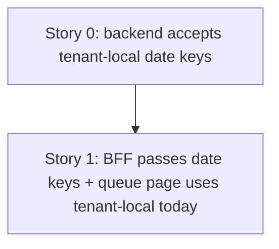

# TD48 — Booking List Date Filters Use UTC Days Instead of the Tenant's Timezone

## Status
- **Type**: Technical Debt / Correctness
- **Priority**: Medium — silently drops real bookings from the schedule and the bookings queue for any tenant taking bookings late on a week's (or day's) last local evening; needs no unusual volume. No tenant report yet.
- **Context**: `apps/backend` (booking context, `GET /bookings`), `apps/bff` (booking feature), `apps/web` (`app/dashboard/bookings`)
- **Created**: 2026-09-28
- **Discovered**: while verifying TD46 (PR #528) — first noted in TD47, then proven with a throwaway integration test the same day
- **Decision status**: Two stories in dependency order (Story 0 → Story 1); the approach below was decided in this session. `/story-discovery` ran for Story 0 on 2026-09-28 (timezone now forwarded by the controller from `RequestContext`, not injected into the use case — see Story 0); it ran for Story 1 on 2026-09-28 (queue's dot/chip UTC slice folded in, `WeekNav` approach A, page throws on a settings failure — see Story 1)
- **Related**: TD46 (`docs/archive/td/TD46-COLUMNS-BOARD-WEEK-BOUNDARY-BOOKING-FETCH-GAP.md`, PR #528) — its one-day-earlier fetch stays correct, but its scenario is narrower for UTC-3 tenants because of this bug; TD47 (`td/TD47-SCHEDULE-BOOKINGS-RANGE-FETCH-PAGINATION.md`) — independent row-cap defect on the same fetch; PR #417 (M20-S02) — the earlier fix of this same bug class on the availability path

---

## Problem

`GET /bookings` filters on `scheduledAt` (a UTC instant) using a `from`/`to`/`date` that every caller means as a **tenant-local calendar range**, but the range is converted as if it were UTC:

- `buildBookingListParams` (`apps/bff/src/features/booking/bookings-list-query.util.ts:17-24`) turns a date key into `${d}T00:00:00.000Z` … `${d}T23:59:59.999Z`, and `date` into the same pair.
- The backend applies them verbatim: `new Date(input.from)` / `new Date(input.to)` (`list-bookings.use-case.ts:61-62`), then `where.scheduledAt = Between(…)` (`typeorm-booking.repository.ts:159-164`). No timezone conversion happens anywhere on the path.

For a tenant behind UTC (`America/Sao_Paulo`, UTC-3 year-round) a booking after 21:00 local has a UTC instant on the **next** UTC day, so it falls outside its own local day's range; a tenant ahead of UTC loses the early-morning bookings of the first local day instead.

**Proven 2026-09-28** with a throwaway backend integration test against the repo's real `findAllByTenantPaginated` and the exact BFF bounds (tenant timezone `America/Sao_Paulo`; week Mon 2026-08-10 – Sun 2026-08-16):
- Booking A, Sunday 12:00 local (`2026-08-16T15:00:00.000Z`) — returned for that week (control).
- Booking B, Sunday 22:00 local (`2026-08-17T01:00:00.000Z`) — **not** returned for that week; returned for the next week's range (`2026-08-17`–`2026-08-23`).

Effect on the schedule: B does not appear in the Day view, Week view, or columns board of its own local week (it only surfaces as a columns-board spillover banner).

### Second, coupled defect — the bookings queue's own "today"
`apps/web/app/dashboard/bookings/page.tsx` builds `today`, `tomorrow` and `windowEnd` with `toISODate(now)` / `addDays(now, …)`, which is `date.toISOString().slice(0, 10)` — a plain **UTC** date, not the tenant's local date (the schedule page uses `toISODateInTimezone(new Date(), timezone)` correctly). Combined with the UTC bounds above, the queue's `date: today` list is internally consistent but shifted against the tenant's real day. **Fixing only the range conversion would make this page worse**, so both must change together. This part is from code reading only; it was not reproduced.

### The codebase already solves this elsewhere
- `localDateRangeBoundsUTC(from, to, timezone)` (`apps/backend/src/shared/utils/calendar-date.ts:120-133`) — its own doc comment describes this exact bug class and cites PR #417; used by the availability day-grid path.
- `admin-schedule-reminder.job.ts:38-46` and `booking-reminder.job.ts:112-135` compute tenant-local `startOf('day')`/`endOf('day')` with Luxon and pass them to the same `scheduledAfter`/`scheduledBefore` filter — so those already behave correctly. The list path is the outlier.
- The sibling endpoints (`GET /schedule/closures`, `/schedule/openings`, availability summary) already take `from=YYYY-MM-DD&to=YYYY-MM-DD` date keys and convert in the backend (`docs/14-API_CONTRACTS.md`).

### Premise notes (verified against the code, 2026-09-28)
- The BFF has **no** access to the tenant's timezone (no reference in `apps/bff/src`), so converting there would need a new tenant-settings read on every list request. The backend already has it for free: `RequestInterceptor` eager-loads the tenant's settings into `RequestContext.settings` on every request, and controllers forward `settings.*` fields to use cases as explicit input (`docs/ENGINEERING_RULES_SHARED.md` § RequestContext — use cases must not inject `RequestContext` or re-fetch settings). `BookingController.create()` already passes `timezone: settings.businessHours.timezone` this way. (Only the two booking *repositories* inject `TENANT_SETTINGS_PORT` — infrastructure, not a use-case precedent.)
- The backend list DTO takes `from`/`to` as `z.iso.datetime()` instants (`list-bookings.dto.ts`); the BFF list controller is its only caller, and `buildBookingListParams` has a single caller.
- The shared repository filter is **inclusive** at both ends and has three callers (list use case + the two reminder jobs). `localDateRangeBoundsUTC` returns an **exclusive** end (next local midnight), so it is not a drop-in for this path.

---

## Chosen approach (decided in this session, 2026-09-28 — refined by Story 0's `/story-discovery`, same day)

Convert in the **backend**, where the tenant's timezone is already available, and pass **date keys** from the BFF, matching the sibling endpoints. Compute the inclusive local-day bounds the way the reminder jobs already do (`startOf('day')` / `endOf('day')` in the tenant zone), so the shared repository filter's inclusive semantics stay untouched.

Rejected: converting in the BFF (needs a new settings read per request, with nothing to gain); switching to `localDateRangeBoundsUTC`'s exclusive end (would force a semantic change in a filter three callers rely on).

**Why two stories, in this order:** the BFF and backend deploy as separate services, so a rolling deploy runs old and new side by side. Story 0 makes the backend accept date keys **in addition to** the existing instants, so an old BFF keeps working; only then does Story 1 switch the BFF and web over.

**When the user-visible bug is actually fixed:** only when **Story 1 is deployed**. Story 0 makes the backend correct for a date-key caller, but no live caller sends date keys until Story 1 switches the BFF over — until then the schedule and the bookings queue behave exactly as they do today. Story 0's acceptance criteria are therefore verified at the API/integration level; the end-to-end schedule and queue behaviour is verified in Story 1.

---

### Story 0 — Backend list-bookings accepts tenant-local date keys ✅ Done

**Agent:** backend-ts
**Complexity:** M
**Docs to load:** `docs/ENGINEERING_RULES_BACKEND.md`, `docs/ENGINEERING_RULES_SHARED.md` (§ RequestContext), `docs/14-API_CONTRACTS.md` (`GET /bookings` query params), `docs/08-TESTING_STRATEGY.md`, `docs/06-TENANT_ISOLATION_STRATEGY.md`
**Dependencies:** none
**Pattern:** plain composition — reuse the tenant-local day-bounds computation the reminder jobs already use; no new named pattern

**Discovered:** 2026-09-28, while verifying TD46 (PR #528); reproduced with a throwaway integration test the same day
**Root cause:** traced live — the BFF's UTC-day bounds (`bookings-list-query.util.ts:17-24`) applied verbatim by `list-bookings.use-case.ts:61-62` and `typeorm-booking.repository.ts:159-164`, with no timezone conversion.

**Description:**
Make `GET /bookings` interpret a date-key `from`/`to` in the tenant's timezone.

1. Extend `ListBookingsSchema` (`list-bookings.dto.ts`) so `from` and `to` each accept either a `YYYY-MM-DD` date key (`z.iso.date()`, calendar-validated per TD42) **or** the existing `z.iso.datetime()` instant. Instants keep today's exact behavior, so an old BFF keeps working during a rolling deploy.
2. `BookingController.list` (`booking.controller.ts`) adds `timezone: settings.businessHours.timezone` to the use-case input — it already destructures `settings` from `RequestContext` there for `cancellationWindowHours`, and `create()` already forwards `timezone` the same way. `ListBookingsUseCaseInput` gains `timezone: string`. **No `TENANT_SETTINGS_PORT` injection into the use case** (`docs/ENGINEERING_RULES_SHARED.md` § RequestContext) — the settings are already loaded once per request, so there is also no "read only when a date key is present" branch.
3. Add two single-bound helpers next to `localDateRangeBoundsUTC` in `calendar-date.ts`: `localDateStartUTC(key, timezone)` (start of that local day) and `localDateEndUTC(key, timezone)` (the **last millisecond** of that local day, inclusive), both returning UTC `Date`s and computed like the reminder jobs (`DateTime.fromISO(key, { zone }).startOf('day'|endOf('day')).toUTC().toJSDate()`). Two single-bound helpers, not a range helper, because `from` and `to` are independently optional (the BFF already sends `from` without `to`) and `localDateRangeBoundsUTC` needs both and returns an exclusive end.
4. `from` and `to` are each interpreted **independently**: a date key becomes its local day bound (step 3), an instant passes through unchanged (`new Date(value)`, exactly as today). Mixed forms (`from` a date key, `to` an instant, or the reverse) and `to` alone are therefore allowed. `from` later than `to` stays as today — no validation, an empty result. The repository filter and its other two callers (the reminder jobs) are **not** changed, and the reminder jobs do not adopt the new helpers in this story (scope).
5. Correct `docs/14-API_CONTRACTS.md:766`'s `GET /bookings` bullet: it currently lists the BFF's params (`date`, `page`) on the backend route. State the backend's real params (`status`, `from`, `to`, `limit`, `offset`) and that `from`/`to` accept a `YYYY-MM-DD` date key (interpreted in the tenant's timezone) or an ISO instant. The BFF-side `date`/`page` mapping note moves to Story 1's scope. Add the matching request blocks to `apps/backend/http/booking/bookings.http`.

**Backend HTTP surface:** reuses `GET /bookings` — the query schema is extended, no new route.
**New migration / i18n keys / env vars / feature flags:** none

**Files to create/modify:**
- `apps/backend/src/contexts/booking/application/dtos/list-bookings.dto.ts` (modify) + `list-bookings.dto.spec.ts` (create)
- `apps/backend/src/contexts/booking/application/use-cases/list-bookings.use-case.ts` (modify — `timezone` input + date-key handling) + `list-bookings.use-case.spec.ts` (modify)
- `apps/backend/src/contexts/booking/infrastructure/controllers/booking.controller.ts` (modify — forward `settings.businessHours.timezone`) + `booking.controller.spec.ts` (modify)
- `apps/backend/src/shared/utils/calendar-date.ts` (modify — `localDateStartUTC` / `localDateEndUTC`) + `calendar-date.spec.ts` (modify)
- `apps/backend/src/contexts/booking/infrastructure/controllers/booking-list.controller.integration.spec.ts` (create — new file, not appended to the 2,360-line `booking.controller.integration.spec.ts`; goes through HTTP so the real `RequestInterceptor` supplies the tenant's timezone)
- `apps/backend/http/booking/bookings.http` (modify)
- `docs/14-API_CONTRACTS.md` (modify)

**Acceptance criteria — product:**
- [ ] At the API level, a `GET /bookings` request with date-key `from`/`to` returns a booking at any local time on a day (including after 21:00 for a UTC-3 tenant) when listing that local day or a local range containing it, and does not return it for the adjacent day. (No live caller sends date keys until Story 1 deploys, so the schedule/queue are unchanged by this story alone.)

**Acceptance criteria — technical:**
- Unit:
  - [ ] `list-bookings.dto.spec.ts`: `from`/`to` accept a valid date key and a valid instant; reject `2026-02-30` and free text
  - [ ] `list-bookings.use-case.spec.ts`: with `timezone: 'America/Sao_Paulo'`, a date-key range reaches the repository as the local start of `from` and the local end of `to`, both as UTC instants; an instant input is passed through unchanged and the `timezone` input is ignored for it; a date-key `from` with an instant `to` (and the reverse) and a `to` alone each convert only the date-key side; `from` later than `to` is passed through unvalidated
  - [ ] `booking.controller.spec.ts`: `list()` forwards `settings.businessHours.timezone` from `RequestContext` to the use case
  - [ ] `calendar-date.spec.ts`: `localDateStartUTC` returns the local day's first instant and `localDateEndUTC` its last millisecond, across a month boundary and for both a UTC- (`America/Sao_Paulo`) and a UTC+ (`Pacific/Auckland`) zone
- Integration (`booking-list.controller.integration.spec.ts`, real Postgres, through HTTP):
  - [ ] Tenant `America/Sao_Paulo`, bookings at `2026-08-16T15:00:00.000Z` (Sunday 12:00 local) and `2026-08-17T01:00:00.000Z` (Sunday 22:00 local) — `GET /bookings?from=2026-08-10&to=2026-08-16` returns **both**, and `from=2026-08-17&to=2026-08-23` returns neither
  - [ ] The same request with instants (`…T00:00:00.000Z`/`…T23:59:59.999Z`) behaves exactly as before (non-regression for an old BFF)
- Tenant isolation:
  - [ ] Tenant A (`America/Sao_Paulo`) has a booking inside the range; a Tenant B caller does not receive it. Tenant B is provisioned through `POST /internal/tenants` with a UTC+ `timezone` (e.g. `Pacific/Auckland`), and a date-key request from Tenant B is converted with Tenant B's own zone (seed a Tenant B booking whose instant falls on a different UTC day than its `Pacific/Auckland` local day, and assert it is returned for its local day — proving B's zone, not A's or UTC, was applied)
- E2E: none — covered by the integration test; the surface is a query filter
- [ ] Coverage ≥80% on changed code
- [ ] `tsc --noEmit` clean, lint clean

---

### Story 1 — BFF passes date keys and the bookings queue uses the tenant's local "today" ✅ Done

**Agent:** bff-ts + frontend-ts (one deliberate two-layer PR — see the note below)
**Complexity:** M
**Docs to load:** `docs/24-BFF_ARCHITECTURE.md`, `docs/ENGINEERING_RULES_FRONTEND.md`, `docs/08-TESTING_STRATEGY.md`, `docs/14-API_CONTRACTS.md`
**Dependencies:** Story 0 — ✅ merged (PR #529). Backend and BFF ship in one release, so there is no separate "deployed first" gate; the merge review only confirms Story 0 is on `main`.
**Pattern:** plain composition — no new named pattern

**Description:**
Stop converting date keys to UTC instants in the BFF, and make the bookings queue derive its dates — and its dot/chip day-bucketing — in the tenant's timezone.

1. `buildBookingListParams` (`bookings-list-query.util.ts`) forwards `date` as `from = to = date` and `from`/`to` unchanged, as date keys, with no `T…Z` suffix. It still maps `page` to `offset`.
2. `apps/web/app/dashboard/bookings/page.tsx` derives `today` with `toISODateInTimezone(new Date(), timezone)`, taking the timezone from `tenantSettings.settings.businessHours.timezone`. The page **awaits `fetchTenantSettings(token)` with no `.catch`**, exactly like `app/dashboard/schedule/page.tsx`: a settings failure surfaces as an error instead of silently falling back to the UTC date (which is the bug). The existing `.catch(() => null)` and its 14-day `welcomeStaffScreenDays` fallback become dead code and are removed. `tomorrow` and `windowEnd` come from date-key arithmetic instead of `addDays(now, …)` + `toISODate`. The derivation lives in a small pure helper, `resolveBookingQueueWindow({ now, timezone, windowDays })` → `{ today, tomorrow, windowEnd }`, in the new `apps/web/features/booking/model/booking-queue-window.ts` (booking slice, CLAUDE.md §11), so the page stays thin (CLAUDE.md §7 Testing) **and** the "today" logic is unit-testable with a fixed clock — see the test plan below. Date-key arithmetic uses a new `addDaysToDateKey(key, n)` in `apps/web/features/booking/schedule/date-utils.ts`, next to `getWeekEndKey` and built on the same `toISODate(addDays(parseDateKey(key), n))` idiom.
3. **Fix** `BookingQueuePage.tsx`'s client-side date arithmetic — in scope, not an optional audit. It mixes browser-local and UTC: `new Date(today + 'T00:00:00')` (lines 45 and 58) is a browser-local midnight, while `toISODate(windowStart)` / `toISODate(windowEnd)` (lines 52–53) read it back as a UTC date. Verified from code: this shifts the keys by a day only for a browser at a **positive** UTC offset (its local midnight is the previous UTC day); a UTC-3 browser round-trips correctly. **Approach A (decided):** the queue page works only in date-key strings — window start is a key in state, prev/next use `addDaysToDateKey`, and `todayInWindow` / `upcomingVisible` are string comparisons — so every key sent to the server is browser-independent. It builds a `Date` only for `WeekNav`'s props, via `toLocalDate(key)`, exactly as `SchedulePage` does. **Out of scope:** `WeekNav` itself renders `day.getDate()` in browser-local time but keys days with UTC `toISODate(day)`; that shared-component defect (it also affects the schedule page for positive-offset browsers) gets a separate follow-up story (`/create-story`), not this PR.
3b. **Fix** the queue's dot/chip day-bucketing, same bug class: `activeDates` and the `selectedUpcomingDate` filter use `item.scheduledAt.slice(0, 10)`, the **UTC** date of the booking instant, so a 22:00-local booking (UTC-3) gets its `WeekNav` dot on the next day and drops out of its own day chip's filter. Replace with `toISODateInTimezone(new Date(item.scheduledAt), timezone)`, the timezone from `useFormatting()` — the same call `BookingCard` already uses.
4. Update the `.http` request blocks and the BFF list-query util's own spec accordingly (the util currently has none — add one).
5. In `docs/14-API_CONTRACTS.md`'s BFF note for `GET /v1/bookings` (near line 769), document the BFF-side mapping that Story 0 removed from the backend route's bullet: the BFF accepts `date`, `from`, `to` (date keys) and `page`, and forwards `date` as `from = to = date` and `page` as `offset`, all as tenant-local date keys.

**Why one PR for both layers:** shipping the BFF change alone would give the queue a UTC-date `today` interpreted as a local day (wrong for the evening window); shipping the web change alone would give it a local `today` still converted as UTC. Either order leaves a wrong window between the two merges, so they land together.

**BFF endpoint spec:** `GET /v1/bookings` — same route, auth and response shape; only the outgoing backend query changes (date keys instead of instants).
**New migration / i18n keys / env vars / feature flags:** none

**Files to create/modify:**
- `apps/bff/src/features/booking/bookings-list-query.util.ts` (modify) + `bookings-list-query.util.spec.ts` (create)
- `apps/bff/src/features/booking/bookings.controller.component.spec.ts` (modify — assert the outgoing `from`/`to` are date keys)
- `apps/web/app/dashboard/bookings/page.tsx` (modify — thin page, calls the helper below; no `.catch` on the settings fetch)
- `apps/web/features/booking/model/booking-queue-window.ts` (create — `resolveBookingQueueWindow`) + `booking-queue-window.spec.ts` (create)
- `apps/web/features/booking/schedule/date-utils.ts` (modify — `addDaysToDateKey`) + `date-utils.spec.ts` (modify)
- `apps/web/features/booking/components/dashboard/bookings/BookingQueuePage.tsx` (modify — key-string window state, tenant-timezone dot/chip bucketing) + `BookingQueuePage.spec.tsx` (modify)
- `apps/bff/http/bookings/bookings.http` (modify — the queue request comments at ~lines 46–66)
- `docs/14-API_CONTRACTS.md` (modify — the `GET /v1/bookings` BFF note; the backend route bullet is Story 0's)
- `plan/journey/staff/prototypes/agenda/dev-notes.md` (modify — one sentence: the queue's date params are tenant-local keys; done in this story's discovery commit)

**Acceptance criteria — product:**
- [ ] For a UTC-3 tenant at 22:00 local, the bookings queue's "today" is still the current local day and lists the evening's approved bookings; nothing from the previous local evening appears in it.
- [ ] In the queue, a booking at 22:00 local (UTC-3) gets its `WeekNav` activity dot on its own local day, and selecting that day's chip keeps it in the "Próximos dias" list.
- [ ] The schedule's Sunday-late-evening booking appears in its own local week. This is fixed only once **both** Story 0 and this story are deployed (Story 0 alone changes nothing a caller sees) — verify against the deployed pair, not Story 0 in isolation.
  - ⚠️ Verified via unit/integration tests only (fixed-clock `booking-queue-window.spec.ts`, `BookingQueuePage.spec.tsx`'s TZ/dot/chip suite, Story 0's real-Postgres integration test) — by the story's own design there is no automated E2E for this (the Server Component's `today` is outside Playwright's clock control). The deployed-pair schedule behavior itself needs a live check by the user, 2026-09-28.

**Acceptance criteria — technical:**
- Unit:
  - [ ] `bookings-list-query.util.spec.ts`: `date` → `from = to = date`; `from`/`to` pass through unsuffixed; `page`/`limit` → `offset`/`limit`; no `T…Z` suffix on any output
  - [ ] Queue-window helper spec, **with a fixed clock** (Vitest fake timers or an injected `now`): tenant `America/Sao_Paulo` at `2026-08-16T01:30:00.000Z` (= 22:30 local on 2026-08-15) yields `today = 2026-08-15`, not `2026-08-16`; `tomorrow`/`windowEnd` follow from `today`; a UTC+ tenant zone near local midnight yields its own local date; the window crosses a month boundary correctly. This is the regression test for the queue's own "today" defect (the half of this TD proven by code reading only) — it needs no browser, server clock or E2E, because the derivation is a pure function.
  - [ ] `date-utils.spec.ts`: `addDaysToDateKey` adds/subtracts days across a month and a year boundary and returns a `YYYY-MM-DD` key regardless of the runner's `TZ`
  - [ ] `BookingQueuePage.spec.tsx`: `today`/`tomorrow`/window boundaries derive from the passed tenant-local `today` by date-key arithmetic, including across a month boundary, and are unchanged when the test runs under a non-UTC `TZ` (assert with two different `TZ` values — including a positive-offset one, the only case the old round-trip actually broke — so a browser-local/UTC round-trip regression fails); prev/next move the window by whole days across a month boundary
  - [ ] `BookingQueuePage.spec.tsx`: with a UTC-3 tenant timezone, a booking at `2026-08-17T01:00:00.000Z` (22:00 local on 2026-08-16) puts its activity dot on `2026-08-16`, not `2026-08-17`, and appears when the `2026-08-16` day chip is selected
- Integration: n/a for web; BFF covered by the component test below
- Tenant isolation: n/a — no tenant data handled client-side; the BFF forwards the tenant context unchanged
- E2E:
  - [ ] none — `today` is computed in a Server Component (`page.tsx`), so a Playwright browser clock does not control it; the derivation is instead covered by the fixed-clock unit spec above and the end-to-end range behaviour by Story 0's real-Postgres integration test
- BFF component:
  - [ ] `bookings.controller.component.spec.ts`: `GET /v1/bookings?date=2026-08-16` calls the backend with `from=2026-08-16&to=2026-08-16`
- [ ] Coverage ≥80% on changed code
- [ ] `tsc --noEmit` clean, lint clean

---

## Self-dry-run findings
- **4o (no workaround):** the root cause (a wrong-timezone range conversion) is fixed at the layer that owns the tenant's timezone, reusing the pattern the reminder jobs already use — no compensating offset, no BFF-side special case.
- **4q (pattern and test plan):** pattern stated per story; every tier has a named scenario, and the integration case is the proven reproduction (seed values included).
- **Expand/contract:** Story 0 accepts both forms, so no rolling-deploy window breaks. A later story could drop the instant form once nothing sends it; left out deliberately — nothing depends on removing it.
- **Ripple:** the two reminder jobs already behave correctly and are untouched. Other `listBookings` callers (`useBookings`, `BookingPhotoPicker`) send neither `date` nor `from`/`to`, so they are unaffected.
- **Resolved by Story 0's `/story-discovery` (2026-09-28):** the helpers are `localDateStartUTC`/`localDateEndUTC` in `calendar-date.ts`; the timezone comes from the controller via `RequestContext`; from/to are interpreted independently; the integration test is a new controller-level spec.
- **Resolved by Story 1's `/story-discovery` (2026-09-28):** the queue-window helper lives in `features/booking/model/booking-queue-window.ts`, with `addDaysToDateKey` in `features/booking/schedule/date-utils.ts`; the failing browser combination is a **positive**-offset browser only (a UTC-3 browser round-trips correctly); the queue's `scheduledAt.slice(0, 10)` dot/chip bucketing is folded in (item 3b); the page throws on a settings failure like the schedule page; `WeekNav` is handled by approach A.
- **Follow-up, not in this TD's stories:** `WeekNav` (shared shell component) mixes browser-local `getDate()` with UTC `toISODate` and needs a key-based API — a separate story via `/create-story`, offered once Story 1 is merged.
