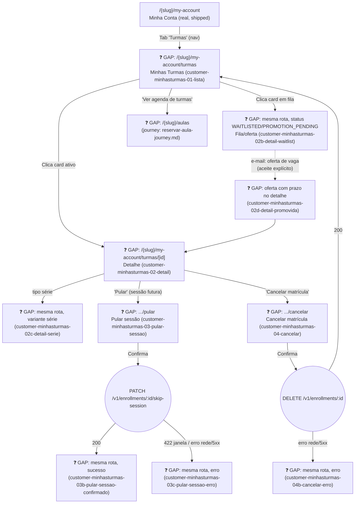

# CUSTOMER — Minha Conta: Turmas section (discovery-stage)

> **Provenance:** This section was originally added 2026-08-21 directly inside the real, shipped `plan/journey/customer/minha-conta.md` (M13-S27–S30), interleaved with real Bookings/Loyalty content. Pulled back out and reverted to pristine shipped state on 2026-08-22 as part of restructuring this discovery into `docs/discovery/multivertical-booking/` — see `multivertical-booking.md` §9's dated entry. This file preserves that content verbatim; nothing here is implemented or promoted.

**UCs covered:** CAND-25, CAND-27, CAND-28, CAND-38 (`../multivertical-booking_USECASES.md`)
**Status:** Draft, discovery-complete prototype, no story/milestone yet (❓ GAP throughout).
**Prototype screens:** `customer-minhasturmas-01-lista.html` through `customer-minhasturmas-04b-cancelar-erro.html` (this folder) — relocated from `plan/journey/customer/prototypes/minha-conta/06-minhas-turmas.html` etc. on 2026-08-22, renamed to the flat actor-prefixed convention.

## Flow (Turmas nodes, extracted from the shared minha-conta.md diagram)

## Pages referenced

| Page / Route | Component | Story | Status |
|---|---|---|---|
| `/{slug}/my-account/turmas` | `MinhasTurmasPage` | — | ❓ GAP |
| `/{slug}/my-account/turmas/[enrollmentId]` | `TurmaDetailPage` | — | ❓ GAP |
| `/{slug}/my-account/turmas/[enrollmentId]/pular` | `PularSessaoPage` | — | ❓ GAP |
| `/{slug}/my-account/turmas/[enrollmentId]/cancelar` | `CancelarMatriculaPage` | — | ❓ GAP |

## BFF calls in this flow

| Call | When | Roles |
|---|---|---|
| `GET /v1/enrollments?status=CONFIRMED,WAITLISTED,PROMOTION_PENDING` | Minhas Turmas — page load | CUSTOMER (filtered to own enrollments) |
| `GET /v1/enrollments/:id` | Detalhe da matrícula | CUSTOMER (ownership enforced — 404 if `customerId ≠ JWT.sub`) |
| `PATCH /v1/enrollments/:id/skip-session` | Pular sessão (`{ sessionId, reason?: string }`) | CUSTOMER |
| `DELETE /v1/enrollments/:id` | Cancelar matrícula (soft delete → CANCELLED) | CUSTOMER |

## Prototype screens

| File | Screen | CAND | Status |
|---|---|---|---|
| `customer-minhasturmas-01-lista.html` | Minhas Turmas — lista de matrículas | CAND-25/27/28 | ❓ GAP |
| `customer-minhasturmas-02-detail.html` | Detalhe da matrícula (turma fixa) | CAND-27 | ❓ GAP |
| `customer-minhasturmas-02b-detail-waitlist.html` | Detalhe — status WAITLISTED/PROMOTION_PENDING | CAND-24/25 | ❓ GAP |
| `customer-minhasturmas-02c-detail-serie.html` | Detalhe — variante série com fim | CAND-27 | ❓ GAP |
| `customer-minhasturmas-02d-detail-promovida.html` | Detalhe — banner pós-promoção (24h) | CAND-25 | ❓ GAP |
| `customer-minhasturmas-03-pular-sessao.html` | Pular sessão — form | CAND-27 | ❓ GAP |
| `customer-minhasturmas-03b-pular-sessao-confirmado.html` | Pular sessão — sucesso | CAND-27 | ❓ GAP |
| `customer-minhasturmas-03c-pular-sessao-erro.html` | Pular sessão — erro (janela/rede) | CAND-27 | ❓ GAP |
| `customer-minhasturmas-04-cancelar.html` | Cancelar matrícula — confirmação | CAND-28 | ❓ GAP |
| `customer-minhasturmas-04b-cancelar-erro.html` | Cancelar matrícula — erro | CAND-28 | ❓ GAP |

## Open questions / implementation gaps

- [ ] **No story/milestone exists for any of these routes.** Needs `/discovery-to-milestone` before implementation.
- [x] **Waitlist promotion:** explicit `PROMOTION_PENDING` offer with accept/decline/expiry — resolved, `multivertical-booking.md` promotion-finalization rules.
- [x] **Skip-session minimum-notice window:** dedicated `classSkipWindowHours`, separate from `classCancellationWindowHours` — resolved 2026-08-21, `CAND-27` A3.
- [ ] **Reposição (`CAND-38`) has a discovery-stage prototype screen** (`customer-04d-reagendada.html`, this same `prototype/` folder) — not built to `plan/journey/`'s implementation-grade bar. Needs its own prototype pass (linked from `customer-minhasturmas-03-pular-sessao.html`) once promoted.
- [x] **Promotion offer deadline:** returned by the backend as `offerExpiresAt`; the client does not derive the offer state from a local 24-hour calculation. A separate unread flag is deferred; the active offer remains visible until accepted, declined or expired.
- [x] **The original `EnrollmentSession` interface is superseded** — canonically, a recurring occurrence is its own `ClassSessionBooking` row (`seriesId` set, own `status`), and attendance lives on `ClassSessionAttendee.attendance` (`PRESENT|NO_SHOW`). "Pulou" is derived at display time (`status=CANCELLED AND seriesId≠null`), not a stored enum value. The implementation story must remove the obsolete interface rather than reconcile it.
- [ ] **The original "Pular sessão — lógica" sketch ("Backend marca `session.status = SKIPPED`") predates and doesn't reflect either 2026-08-21 decision**: no mention of the `classSkipWindowHours` notice check (`CAND-27` A3), and no mention of the `CAND-38` reschedule alternative. Needs a rewrite once this journey is promoted, not just a schema update.
- [x] **Naming reconciliation:** canonical persistence/domain names are `Service`, `ClassScheduleTemplate`, `ClassSessionBooking` and `RecurringEnrollment`; `ClassType`/`Enrollment` may remain read-model labels only and must not become aggregates.

## Discovery reconciliation — required before implementation

The automatic-promotion banner is superseded by the actionable offer lifecycle `WAITLISTED → PROMOTION_PENDING → CONFIRMED|CANCELLED`. The customer must see deadline, group quantity, accept/decline and expiry states.

The read model is derived from canonical `RecurringEnrollment`, `ClassSessionBooking`, and attendee attendance. It may simplify display, but must not persist obsolete `EnrollmentSession` statuses. The skip flow uses `classSkipWindowHours`, describes a waitlist **offer** rather than automatic confirmation, and offers a make-up only when contract, date window and monthly cap permit it.
