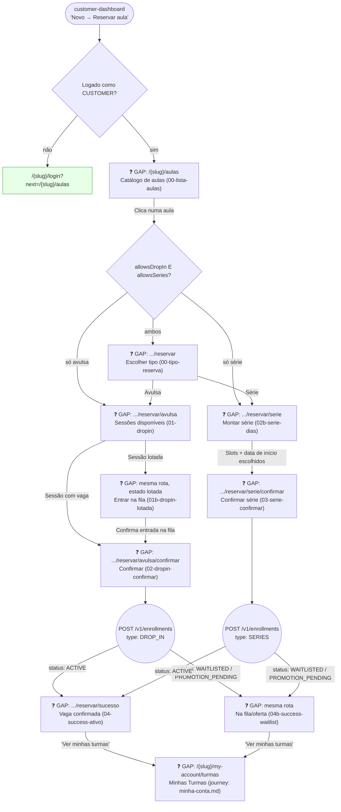

# CUSTOMER — Reservar Aula (Turmas)

**Actor(s):** CUSTOMER
**Goal:** Authenticated customer with an active class-access contract browses the class catalog and enrolls in a new class — a one-off drop-in session or a standing recurring series
**UCs covered:** CAND-21, CAND-22, CAND-24, CAND-26 (`docs/discovery/multivertical-booking_USECASES.md`)
**Status:** Draft — discovery-complete prototype (`plan/journey/customer/prototypes/reservar-aula/dev-notes.md`), no story/milestone yet. See the promotion-status note in `docs/discovery/multivertical-booking.md` and `plan/journey/README.md`.

> Complements `minha-conta.md`'s Turmas section, which covers managing an *existing* enrollment (skip a session, cancel, watch a waitlist). This journey is the "before" — creating a new one.

## Flow

## Pages referenced

| Page / Route | Component | Story | Status |
|---|---|---|---|
| `/{slug}/login?next=/{slug}/aulas` | existing login page | M03 | ✅ Existente |
| `/{slug}/aulas` | `ClassCatalogPage` | — | ❓ GAP |
| `/{slug}/aulas/[classTypeId]/reservar` | `ReservaTypePicker` | — | ❓ GAP |
| `/{slug}/aulas/[classTypeId]/reservar/avulsa` | `DropInSessionPicker` | — | ❓ GAP |
| `/{slug}/aulas/[classTypeId]/reservar/avulsa/confirmar` | `DropInConfirmPage` | — | ❓ GAP |
| `/{slug}/aulas/[classTypeId]/reservar/serie` | `SeriesBuilderPage` | — | ❓ GAP |
| `/{slug}/aulas/[classTypeId]/reservar/serie/confirmar` | `SeriesConfirmPage` | — | ❓ GAP |
| `/{slug}/aulas/[classTypeId]/reservar/sucesso` | `EnrollmentSuccessPage` | — | ❓ GAP |

## BFF calls in this flow

| Call | When | Roles |
|---|---|---|
| `GET /v1/class-types` | Catálogo de aulas — page load | CUSTOMER |
| `GET /v1/class-types/:classTypeId/sessions?from=&limit=` | Seleção de sessão drop-in | CUSTOMER |
| `GET /v1/class-types/:classTypeId/recurring-slots` | Montagem da série | CUSTOMER |
| `POST /v1/enrollments` | Confirmação (drop-in ou série) | CUSTOMER |

Full request/response shapes: `plan/journey/customer/prototypes/reservar-aula/dev-notes.md`.

## Open questions / gaps

- [ ] **No story/milestone exists for any route in this journey.** This whole flow needs to go through `/discovery-to-milestone` before implementation — see the promotion-status note in `docs/discovery/multivertical-booking.md`.
- [x] **`EnrollmentCreated.status` is canonicalized.** The BFF projection exposes `CONFIRMED | PENDING_APPROVAL | WAITLISTED | PROMOTION_PENDING | CANCELLED` occurrence state and separates recurring intent.
- [x] **`trial_slots`/`reserved_non_member_count` are part of the availability/access contract** for authenticated pay-per-class customers as well as guests.
- [ ] Reposição/`classSkipWindowHours` (`CAND-38`, `CAND-27`) belong to `minha-conta.md`'s Turmas section (managing an *existing* enrollment), not here — this journey only covers creating a new one.
- [x] **`ClassType` is explicitly a BFF read model, not an aggregate.** It is mapped from `Service`, `ClassScheduleTemplate`, the next-session projection and resolved resource display data; it must not become a literal persistence endpoint or aggregate.
- [x] **Catalog fields are documented in the schema companion.** `color`/`description`/`allowsDropIn`/`allowsSeries` belong to the SESSION service catalog contract.
- [x] **Contract-less authenticated customers use `CAND-22b`.** The BFF contract branches between contract-backed access and pay-per-class access; no payment is processed by Ikaro.
- [x] **Series responses expose separate recurring intent and occurrence state.** The read model represents one `RecurringEnrollment` plus its generated `ClassSessionBooking` occurrences; it does not persist a generic Enrollment aggregate.

## Prototype

Folder: `customer/prototypes/reservar-aula/`

| File | Screen | Story | Status |
|---|---|---|---|
| `index.html` | Hub de navegação | — | ❓ GAP |
| `customer-reservaraula-01-lista-aulas.html` | Catálogo de aulas | — | ❓ GAP |
| `customer-reservaraula-01b-lista-aulas-vazia.html` | Catálogo — estado vazio (filtro sem resultado) | — | ❓ GAP |
| `customer-reservaraula-00-tipo-reserva.html` | Bifurcação avulsa/série | — | ❓ GAP |
| `customer-reservaraula-02-dropin.html` | Seleção de sessão drop-in, badges de vagas | — | ❓ GAP |
| `customer-reservaraula-02b-dropin-lotada.html` | Sessão lotada → entrada na fila | — | ❓ GAP |
| `customer-reservaraula-03-dropin-confirmar.html` | Confirmação drop-in | — | ❓ GAP |
| `customer-reservaraula-03b-serie-dias.html` | Montagem de série (slots + data + preview) | — | ❓ GAP |
| `customer-reservaraula-04-serie-confirmar.html` | Confirmação série | — | ❓ GAP |
| `customer-reservaraula-05-success-ativo.html` | Sucesso — vaga garantida (ACTIVE) | — | ❓ GAP |
| `customer-reservaraula-05b-success-waitlist.html` | Sucesso — na fila/oferta (`WAITLISTED`/`PROMOTION_PENDING`) | — | ❓ GAP |
| `dev-notes.md` | Implementation handoff (routes, BFF contracts, types) | — | ✅ Criado |

## Discovery reconciliation — required before implementation

This journey is no longer contract-only. An authenticated non-member may make a one-off pay-per-class booking when the service enables drop-ins; capacity may yield `CONFIRMED`, `PENDING_APPROVAL`, or `WAITLISTED`. A recurring series remains contract-only.

`WAITLISTED` is not an automatic booking. Promotion creates `PROMOTION_PENDING`, holds capacity, and requires explicit accept/decline before confirmation. The BFF read model must expose canonical `ClassSessionBooking` occurrence states and a separate `RecurringEnrollment`; it must not make `EnrollmentSession` a mutable source-of-truth.
