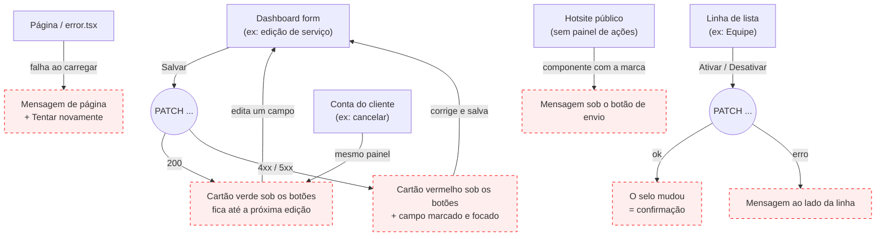

# MANAGER — Feedback e painel de ações

**Actor(s):** MANAGER (dashboard), CUSTOMER (conta do cliente), GUEST/CUSTOMER (hotsite público)
**Goal:** When a save, action or load fails or succeeds, the user sees the result next to the action they just took, with the offending field marked — on every surface of `apps/web`.
**UCs covered:** none — a cross-cutting UI pattern. Source of truth: `td/TD57-INLINE-FEEDBACK-AND-ACTION-PANE-PATTERN.md`. Lives under `manager/` because the dashboard is its main surface. The customer-account and public-hotsite screens live in their own actor folders, as the folder convention requires: `customer/prototypes/minha-conta/03c`–`03d` and `guest/prototypes/lead-form/01j`–`01k`; the hub `index.html` here links to them.
**Status:** In progress (TD57) — the shared components shipped with TD57-S01 and the service edit screen uses them since TD57-S02; the screens below marked ⚠ still use their own boxes until their stories land (done: TD57-S01–S04 and S06–S12; pending: S05 and S13–S16). The service-edit error that triggered it is real: a 422 rendered below four cards, out of view.

## Flow

```mermaid
flowchart TD
    Edit["Dashboard form<br/>(ex: edição de serviço)"] -->|"Salvar"| Call(("PATCH ..."))
    Call -->|"200"| Ok["Cartão verde sob os botões<br/>fica até a próxima edição"]
    Call -->|"4xx / 5xx"| Err["Cartão vermelho sob os botões<br/>+ campo marcado e focado"]
    Ok -->|"edita um campo"| Edit
    Err -->|"corrige e salva"| Edit

    Row["Linha de lista<br/>(ex: Equipe)"] -->|"Ativar / Desativar"| RowCall(("PATCH ..."))
    RowCall -->|"ok"| Badge["O selo mudou<br/>= confirmação"]
    RowCall -->|"erro"| RowErr["Mensagem ao lado da linha"]

    Load["Página / error.tsx"] -->|"falha ao carregar"| Page["Mensagem de página<br/>+ Tentar novamente"]

    Cust["Conta do cliente<br/>(ex: cancelar)"] -->|"mesmo painel"| Ok
    Pub["Hotsite público<br/>(sem painel de ações)"] -->|"componente com a marca"| PubMsg["Mensagem sob o botão de envio"]

    classDef gap stroke:#f00,stroke-dasharray: 5 5,fill:#fee
    class Ok,Err,Badge,RowErr,Page,PubMsg gap
```

Every node in red is a gap: the screens not yet migrated do not use the shared components (the area stories `TD57-S13`–`S16` remain). The shared components exist since `TD57-S01`; the branded counterpart for the public hotsite exists since `TD57-S06` and its callers migrate in `TD57-S16`.

## Pages referenced

| Page / Route | Component | Story | Status |
|---|---|---|---|
| `/dashboard/services/[id]/edit` (all five tabs) | `ServiceEditPanels` + `ActionPane` | TD57-S02 | ✅ Feedback in the pane; per-reason policy errors; pre-send validation |
| `/dashboard/services/[id]/edit` (Recursos, Políticas, Formulário) | `ServiceResourceModePicker`, `PolicyDurationPricingCard`, `IntakeQuestionsCard` | TD57-S03 | ✅ First box level with the pane on all five tabs (intro inside the first card; the mode picker in a card) |
| `/dashboard/team` | `MemberRow` | TD57-S04 | ✅ The changed badge/button is the confirmation; failures show inline beside the row |
| `/dashboard/resources` | `ResourceListPage` | TD57-S07 | ✅ Feedback in the pane / shared components |
| `/[slug]/my-account/bookings/[id]/cancel` | `CancelConfirmPage` | TD57-S11 | ✅ Error under the buttons, in the pane |
| `/dashboard/bookings/[id]` | `BookingDetailPage` + `BookingDetailAsideCard` | TD57-S12 | ✅ Failure under the buttons of the shared `ActionPane` — drawn in `staff/prototypes/agenda/01`, `01e` |
| `/dashboard/bookings/[id]/complete`, `/reschedule` | `MarkCompleteActionRail`, `RescheduleActionRail` | TD57-S12 | ✅ Rail error under the buttons of the shared `ActionPane` — `staff/prototypes/agenda/04c`, `05d` |
| `/dashboard/schedule` | `SchedulePage`, `ScheduleResourceColumnsBoard`, `ResourceFilterMenu` | TD57-S12 | ✅ Page-level `FeedbackMessage` with retry; field-level message on the resource select — `staff/prototypes/horarios/11` |
| `/dashboard/scheduling-exceptions` | `SchedulingExceptionWorklistPage`, `BulkResultList`, the sheets | TD57-S12 | ✅ Shared `FeedbackMessage` / sheet message — `manager/prototypes/scheduling-exceptions/01d`, `01j`, `01k` |
| `/[slug]` (lead form) | public lead form + branded feedback component | TD57-S16 | ⚠ Component exists (TD57-S06); form still uses a hand-rolled box |
| Shared components | `FeedbackMessage`, `ActionPane`, `FieldFeedback`, `useFormFeedback` | TD57-S01 | ✅ EXISTS |

## Open questions / gaps

- [x] Customer screens: resolved in TD57-S11 discovery (2026-11-02) — they adopt the shared fixed bottom bar at `bottom-0` (drill-down routes hide the customer bottom nav)
- [x] Branded error colour: resolved in TD57-S06 — a fixed semantic red/green on the box's own white surface with a dark 1px ring, so the white surface or the ring always reaches 3:1 against any tenant background; only radius and fonts follow the tenant
- [x] Window-narrowing hint: resolved in TD57-S02 discovery (2026-10-30) — the catch-all `BOOKING_SERVICE_BOOKING_POLICY_INVALID` is split into seven per-reason codes; the window codes carry the business limit in their text; no static hint
