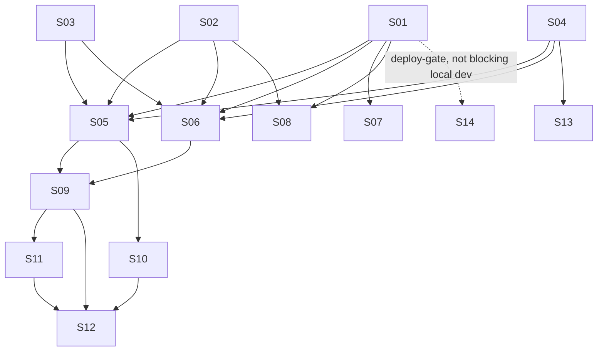

# M19 — Hotsite Chatbot

**Phase:** Local Development
**Goal:** Add an LLM-backed FAQ chatbot widget to the public hotsite, scoped to each tenant's own business data — informational only (never confirms/creates/modifies a booking, never accesses customer/staff/booking records), with a ten-layer cost/abuse-prevention design and a swappable multi-provider LLM adapter (OpenRouter primary + Anthropic + OpenAI).
**Depends on:** M12 (Hotsite Frontend — module rendering/manifest pattern), M13 (Dashboard Frontend — per-module config panel pattern, tenant settings form pattern), M15/M17 (GCP Infrastructure — Secret Manager + Cloud Scheduler modules, reused not rebuilt)
**Blocks:** none yet
**Design rationale:** `docs/discovery/CHATBOT/CHATBOT.md` (promoted via `/discovery-to-milestone` on 2026-08-08) — kept as the permanent *why*; this file and the canonical docs it cites (`docs/04-USE_CASES.md` UC-033–UC-036 + UC-026/UC-027 extensions, `docs/02-DOMAIN_MODEL.md`, `docs/05-BOUNDED_CONTEXTS.md`, `docs/13-DATABASE_SCHEMA.md`, `docs/14-API_CONTRACTS.md`, `docs/15-HOTSITE_DYNAMIC_ARCHITECTURE.md`, `docs/21-TENANTS_SETTINGS_SCHEMA.md` §7) are the source of truth for implementation — nothing below should require opening the discovery doc to understand.

**Non-Goals (explicitly deferred or dropped — not gaps in this plan):**
- A "spend by tenant" dashboard — MVP visibility is a periodic query against `chatbot_messages`, not new pipeline infrastructure (`CHATBOT.md` §8; avoids the premature-metrics-infra failure mode `docs/ENGINEERING_RULES.md` already documents an incident about)
- RAG/vector retrieval, availability-aware answers, booking actions from chat, multi-turn memory across sessions, self-hosted open-weight models — all explicitly out of scope per `CHATBOT.md` §11
- A recurring adversarial-eval cadence — no owner/schedule decided; tracked as an ops follow-up outside this milestone, not a story (`CHATBOT.md` §10.9)
- Vertex AI as a fourth LLM adapter — dropped from scope entirely during promotion, not deferred (`CHATBOT.md` §3 correction, 2026-08-08)
- `ChatbotDailyCapReached` tenant-admin notification email — replaced by S12's module-config-screen banner; the event itself is not built

---

## Build order

| Story | Theme |
|---|---|
| M19-S01 | Chatbot domain aggregates + database migration |
| M19-S02 | `ILlmProvider` port + registry + OpenRouter adapter |
| M19-S03 | Anthropic + OpenAI adapters |
| M19-S04 | `chatbot` tenant-settings category |
| M19-S05 | Send-chat-message use case + cap enforcement (UC-033) |
| M19-S06 | Chatbot availability status use case (UC-034) |
| M19-S07 | Retention-purge cron (UC-035) |
| M19-S08 | Balance-poll cron (UC-036) |
| M19-S09 | Chatbot public BFF endpoints + context/mapper |
| M19-S10 | Chatbot cap-status admin BFF endpoint (UC-027 A5) |
| M19-S11 | `CHATBOT` module type + widget component + `page.tsx` registration |
| M19-S12 | Chatbot module config panel |
| M19-S13 | Tenant settings form — Chatbot section |
| M19-S14 | Infra: secrets, env vars, scheduler jobs (devops) |

**Wave 0** (S01–S04): backend foundation, no risky backfill — pure additive schema/config.
**Wave 1** (S05–S08): backend use cases and cron jobs, depend on Wave 0.
**Wave 2** (S09–S10): BFF orchestration, depend on Wave 1.
**Wave 3** (S11–S13): frontend, depend on Wave 2 (S13 only depends on S04).
**S14**: infra provisioning — sequenced independently; not a functional dependency for local development (which uses local env vars + the manual `POST /cron/...` trigger endpoints, same as every existing cron job), but required before real staging/prod traffic. Mirrors this repo's own precedent: `M11-NOTIFICATIONS-CRON.md` shipped its cron/secret-consuming code in Local Development phase before the SendGrid secret was actually provisioned in `M15`.

---

### M19-S01 — Chatbot domain aggregates + database migration ✅ Done

**Agent:** `backend-ts`
**Complexity:** M
**Docs to load:** `docs/02-DOMAIN_MODEL.md` § Platform Context (ChatbotSession/ChatbotMessage/ChatbotProviderBalance), `docs/13-DATABASE_SCHEMA.md` § `platform.chatbot_sessions`/`chatbot_messages`/`chatbot_provider_balance`, `docs/04-USE_CASES.md` UC-033/UC-034

**Description:**
Create three new domain entities as thin persistence records — same treatment as `NotificationLog`: a plain repository, no rich cross-field invariants — in `apps/backend/src/contexts/platform/domain/`: `ChatbotSession`, `ChatbotMessage`, `ChatbotProviderBalance`, matching `docs/02-DOMAIN_MODEL.md`'s exact field lists and methods (`ChatbotSession.create()`/`recordMessage()`/`markCapped()`/`close()`; `ChatbotMessage.create()`; `ChatbotProviderBalance.upsert()`). Each gets a matching `IChatbotXxxRepository` port in `apps/backend/src/contexts/platform/application/ports/` and a `TypeOrmChatbotXxxRepository` adapter in `apps/backend/src/contexts/platform/infrastructure/repositories/`, registered with `useClass` (never `useExisting`).

**Port scope for this story is deliberately minimal** — `IChatbotSessionRepository`: `findById(id, tenantId)` + `save()`; `IChatbotMessageRepository`: `save()` plus whatever read method the round-trip integration test needs (e.g. `findById`); `IChatbotProviderBalanceRepository`: `save()`/upsert keyed by `provider`. The COUNT-based cap-query methods S05's cap enforcement needs (daily/IP/concurrency counts against `chatbot_sessions`, message counts against `chatbot_messages`) are out of scope here — S05 extends these ports itself when it lands.

`ChatbotProviderBalance` has no `tenant_id` column — platform-wide, single row per provider. This is a documented exemption (`docs/06-TENANT_ISOLATION_STRATEGY.md` § Documented exemption: platform-operator data), not an oversight: it's Ikaro's own vendor balance, not tenant business data, and stays in `platform` schema/context since every reader/writer of it (S05, S06, S08) is already a Platform Context use case.

Migration: `apps/backend/src/contexts/platform/infrastructure/migrations/<timestamp>-CreateChatbotTables.ts` — pick a 13-digit epoch-ms timestamp greater than the current highest across all contexts (`1748400000009` as of this writing; migration timestamps are global, not per-context — verify the current highest again at implementation time). Creates all three tables per `docs/13-DATABASE_SCHEMA.md`'s exact column/index/FK spec, including the composite FK `(tenant_id, session_id) → chatbot_sessions(tenant_id, id)` on `chatbot_messages` and the required index on `chatbot_messages.created_at` (needed by S05's global spend query — without it, that query full-table-scans on every session-start request platform-wide as the table grows). Pure `CREATE TABLE` — no existing table touched, no backfill, no migration-safety risk.

**Acceptance Criteria:**
- [ ] Migration creates exactly the 3 tables/columns/indexes/FKs `docs/13-DATABASE_SCHEMA.md` specifies
- [ ] Migration runs cleanly against a fresh DB and the existing seeded dev DB; `down()` drops all 3 tables cleanly
- [ ] Domain classes match `docs/02-DOMAIN_MODEL.md`'s field lists and methods exactly, including `ChatbotSession.messageCount` as `SmallInt`
- [ ] Each repository registered with `useClass`
- [ ] Unit tests for each aggregate's methods
- [ ] Integration test proving a round-trip save/read for each table against the real test DB, registered in `integration-global-setup.ts`
- [ ] Integration test proves the composite FK on `chatbot_messages` rejects a cross-tenant reference — inserting a message whose `session_id` belongs to a different tenant's session fails at the DB level
- [ ] Coverage ≥80% on changed code; `tsc --noEmit`, lint, full test suite green

**Dependencies:** None — first story in the milestone.

---

### M19-S02 — `ILlmProvider` port + registry + OpenRouter adapter

**Agent:** `backend-ts`
**Complexity:** M
**Docs to load:** `docs/discovery/CHATBOT/CHATBOT.md` § 3 (Model Sourcing & Cost), § 4 (Architecture), `docs/AGENT_PATTERNS.md` Pattern #1 (port+adapter)

**Description:**
Create `ILlmProvider` port (`apps/backend/src/contexts/platform/application/ports/llm-provider.port.ts`) per `CHATBOT.md` §4's exact interface: `ChatTurn { role, content }`, `ChatCompletionRequest { systemPrompt, history, userMessage, maxOutputTokens }`, `ChatCompletionResult { text, inputTokens, outputTokens, modelId }`, `ILlmProvider.complete(request): Promise<ChatCompletionResult>`.

Create `LlmProviderRegistry` — a `Map<string, ILlmProvider>` keyed by provider name — resolving `tenant.settings.chatbot?.llmProvider ?? process.env.CHATBOT_LLM_PROVIDER ?? 'openrouter'`.

Build `openrouter-llm.adapter.ts` (`apps/backend/src/contexts/platform/infrastructure/llm/`) — the primary/default adapter, model `deepseek/deepseek-v4-flash-0731`. **Implementation trap, empirically confirmed, not theoretical:** must always explicitly send `reasoning: { effort: "none" }` on every request. The API defaults to `high` if unset, and reasoning tokens bill as output tokens whether or not they're returned — an adapter that forgets this silently bills every message at the expensive tier with no error to surface it. A second, worse trap the real eval caught: even `effort: "low"` isn't safe — reasoning-token usage scales with prompt complexity and `max_tokens` caps reasoning + the visible answer combined, so `low` effort consumed the entire response budget on 8 of 19 real test questions in `CHATBOT/eval/`, returning `null` with `finish_reason: "length"`. Only `"none"` (0 reasoning tokens, confirmed) avoids this failure mode.

Register via `useClass` (never `useExisting` — tests need to swap in a fake `ILlmProvider`).

**Acceptance Criteria:**
- [ ] `ILlmProvider` port matches `CHATBOT.md` §4's interface exactly
- [ ] `openrouter-llm.adapter.ts` always sends `reasoning: { effort: "none" }` — a regression test that would fail if the field were ever omitted or defaulted
- [ ] `LlmProviderRegistry` resolves `tenant.settings.chatbot?.llmProvider ?? CHATBOT_LLM_PROVIDER ?? 'openrouter'` correctly, including the all-unset case
- [ ] Adapter maps OpenRouter's response (`usage.prompt_tokens`, `usage.completion_tokens`) into `ChatCompletionResult` correctly
- [ ] Adapter registered with `useClass`; a `FakeLlmProviderBuilder` (class + `withResponse()`/`withTokenUsage()`/`build()`, this repo's builder convention — never a plain factory) exists for use-case tests
- [ ] Never a real network call in any automated test — stub the HTTP layer
- [ ] Coverage ≥80%; `tsc --noEmit`, lint, tests green

**Dependencies:** None (parallel to S01, S03, S04).
**New env var:** `CHATBOT_LLM_PROVIDER` (default `openrouter`). **New secret:** `OPENROUTER_API_KEY` — provisioned by S14, use a placeholder/local env var for development until then.

---

### M19-S03 — Anthropic + OpenAI adapters

**Agent:** `backend-ts`
**Complexity:** S
**Docs to load:** `docs/discovery/CHATBOT/CHATBOT.md` § 4

**Description:**
Build `anthropic-llm.adapter.ts` and `openai-llm.adapter.ts` against the same `ILlmProvider` port S02 established, in the same `infrastructure/llm/` folder. Each maps its own provider's response shape into `ChatCompletionResult` (`inputTokens`/`outputTokens`/`modelId`). Both registered in `LlmProviderRegistry` alongside `openrouter`. This is the actual point of the port earning its keep — zero interface change to add either.

**Acceptance Criteria:**
- [ ] Both adapters implement `ILlmProvider` correctly, registered with `useClass`
- [ ] `LlmProviderRegistry` offers all 3 providers (`'openrouter'`, `'anthropic'`, `'openai'`) once this story ships — a `tenant.settings.chatbot.llmProvider` override to any of the 3 resolves to a real adapter instance
- [ ] Unit tests per adapter, stubbed HTTP layer, no real network calls
- [ ] Coverage ≥80%; `tsc --noEmit`, lint, tests green

**Dependencies:** S02.
**New secrets:** `ANTHROPIC_API_KEY`, `OPENAI_API_KEY` — provisioned by S14.

---

### M19-S04 — `chatbot` tenant-settings category

**Agent:** `backend-ts` + `bff-ts`
**Complexity:** S
**Docs to load:** `docs/21-TENANTS_SETTINGS_SCHEMA.md` § 7, `docs/14-API_CONTRACTS.md` § Tenant Settings

**Description:**
Add `chatbot` as a new category to `TenantSettings` VO (`apps/backend/src/contexts/platform/domain/value-objects/tenant-settings.vo.ts`). **Deliberate deviation from every other category's pattern** (already documented in `docs/21` §7, apply it exactly): `TenantSettings.default()` writes only `knowledgeText: ""` — the 8 caps + `llmProvider`/`llmModel` are never written into any tenant's row by default, resolved instead as `tenant.settings.chatbot?.X ?? DEFAULT_X` at read time, where `DEFAULT_X` lives in a new `contexts/platform/chatbot.constants.ts` (the 8 cap defaults from `CHATBOT.md` §8, plus a `MODEL_PRICING` lookup stub consumed by S05).

Add `chatbot` to the fixed category-key list in both `UpdateTenantSettingsSchema` (backend DTO, `.strict()`) and `UpdateTenantSettingsBodySchema` (BFF, `.strict()`). Within the `chatbot` category, accept **only** `knowledgeText` — a request setting any cap/provider field is rejected `400`, not silently stripped (an explicit, deliberate choice, not left ambiguous).

**Acceptance Criteria:**
- [ ] `TenantSettings.default()` writes `chatbot: { knowledgeText: "" }` only — no caps/provider fields
- [ ] `contexts/platform/chatbot.constants.ts` holds the 8 cap defaults (`maxConversationsPerDay=30`, `maxConversationsPerIpPerDay=5`, `maxConcurrentConversations=5`, `maxMessagesPerConversation=20`, `maxMessageLengthChars=1000`, `maxHistoryMessagesSentToLlm=10`, `maxOutputTokensPerResponse=300`, `maxKnowledgeTextLength=4000`) — consumed by S05/S06
- [ ] `PATCH /v1/tenants/settings` accepts `settings.chatbot.knowledgeText` (max 4000 chars, `400` if exceeded), rejects any other `chatbot.*` key with `400`
- [ ] `GET /v1/tenants/settings` returns the `chatbot` category for every tenant (empty `knowledgeText` for tenants that never set it)
- [ ] New error code `PLATFORM_CHATBOT_KNOWLEDGE_TEXT_TOO_LONG` added to `packages/types/src/error-codes.ts` + both `pt-BR`/`en` locale files in the same commit — exhaustiveness test passes
- [ ] Unit + integration tests for the VO default/validation and the `PATCH`/`GET` endpoints
- [ ] Coverage ≥80%; `tsc --noEmit`, lint, tests green

**Dependencies:** None (parallel to S01–S03).
**New error code:** `PLATFORM_CHATBOT_KNOWLEDGE_TEXT_TOO_LONG` (both locale files).

---

### M19-S05 — Send-chat-message use case + cap enforcement (UC-033)

**Agent:** `backend-ts`
**Complexity:** L
**Docs to load:** `docs/04-USE_CASES.md` UC-033, `docs/discovery/CHATBOT/CHATBOT.md` § 8 (Cost Controls & Abuse Prevention), `docs/13-DATABASE_SCHEMA.md` § chatbot tables, `docs/ENGINEERING_RULES.md` § Transactions (PR #267 precedent)

**Description:**
The core use case — `SendChatMessageUseCase` in `apps/backend/src/contexts/platform/application/use-cases/`. Implements every cap layer from `CHATBOT.md` §8 exactly:
- **Volume caps (1–3, new-session only):** `maxConversationsPerDay`, `maxConversationsPerIpPerDay`, `maxConcurrentConversations` — all `COUNT`-based against `chatbot_sessions`, queried directly against Postgres, **never a per-instance `CachePort` cache** (would undercount independently on each Cloud Run replica, silently turning a platform-wide/tenant-wide limit into limit × replica count).
- **`maxMessagesPerConversation` (4, existing-session):** `COUNT` of all `chatbot_messages` rows for the session, both roles.
- **`maxMessageLengthChars` (5):** already rejected upstream at the BFF DTO layer (S09) — not re-validated here, but don't assume it either; this use case must not be reachable with an oversized message from any caller.
- **`maxOutputTokensPerResponse` (6):** passed as a hard ceiling on `ILlmProvider.complete()`.
- **History-window shaping (8, not a reject):** truncate to `maxHistoryMessagesSentToLlm` (last 5 exchanges) before assembling `ChatCompletionRequest.history` — this is what keeps per-call cost flat regardless of conversation length; `chatbot_messages` still stores the full conversation up to cap 4's limit.
- **Platform-wide backstops (9–10):** global daily spend circuit breaker (`SUM` grouped by `model_id` over today's `chatbot_messages`, each model's rate from `MODEL_PRICING`, compared against `CHATBOT_GLOBAL_DAILY_SPEND_LIMIT_USD`) and provider-balance floor (read `chatbot_provider_balance` for the tenant's resolved provider, compare against `CHATBOT_MIN_PROVIDER_BALANCE_USD`) — both direct Postgres queries, same undercounting-risk reasoning as caps 1–3.

Resolves the tenant's LLM provider via `LlmProviderRegistry` (S02/S03). Persists both `USER` and `ASSISTANT` `chatbot_messages` rows with real `input_tokens`/`output_tokens`/`model_id` from the adapter's result.

**Critical:** the LLM call is cross-service network I/O — per the PR #267 precedent, it must never sit inside `txManager.run()`, not before and not as a post-commit step. The natural-looking implementation ("create session, call LLM, save message, all in one transaction") is exactly the shape that precedent exists to prevent.

**Acceptance Criteria:**
- [ ] All cap layers enforced exactly per `CHATBOT.md` §8, using S04's constants (tenant-overridable via `tenant.settings.chatbot?.X ?? DEFAULT_X`)
- [ ] Global spend breaker and balance floor computed via direct Postgres queries, never `CachePort` — a code-review-verifiable fact, not just a test
- [ ] History truncated to `maxHistoryMessagesSentToLlm` before every LLM call — a test proving message N+1 of a long conversation sends a bounded history size, not the full conversation
- [ ] LLM call is never inside `txManager.run()`
- [ ] A trace span wraps the LLM call and cap-check (`packages/observability`, `startActiveSpan()`), attributes: `tenant.id`, `correlation.id`, `chatbot.session_id`, `chatbot.model_id`, `chatbot.provider`, `chatbot.input_tokens`, `chatbot.output_tokens`, `chatbot.cap_rejected`
- [ ] Structured log on every cap rejection (`AppLogger` pattern, same as `AppThrottlerGuard`'s own logging)
- [ ] New error code per cap-rejection reason, both locale files (e.g. `PLATFORM_CHATBOT_DAILY_CAP_REACHED`, `PLATFORM_CHATBOT_CONCURRENCY_CAP_REACHED`, `PLATFORM_CHATBOT_MESSAGE_CAP_REACHED`, `PLATFORM_CHATBOT_GLOBAL_SPEND_LIMIT_REACHED`, `PLATFORM_CHATBOT_PROVIDER_BALANCE_LOW`)
- [ ] `FakeLlmProvider`-based unit tests for the use case — deterministic, no real LLM call ever in CI
- [ ] Integration test against the real test DB proving the common case: sequential requests correctly rejected once at cap (not the accepted race-window itself — a known, tolerated gap per `CHATBOT.md` §8, not a bug to chase)
- [ ] Coverage ≥80%; `tsc --noEmit`, lint, tests green

**Dependencies:** S01, S02, S03, S04.
**New env var:** `CHATBOT_GLOBAL_DAILY_SPEND_LIMIT_USD` (default `25`).
**New error codes:** 5 listed above, both locale files.

---

### M19-S06 — Chatbot availability status use case (UC-034)

**Agent:** `backend-ts`
**Complexity:** M
**Docs to load:** `docs/04-USE_CASES.md` UC-034, `docs/discovery/CHATBOT/CHATBOT.md` § 7 (Widget States), § 8.10 (balance floor)

**Description:**
`GetChatbotStatusUseCase` evaluating the 5 "not available" conditions per UC-034, for the tenant resolved from the request: tenant daily cap already exhausted, tenant concurrency cap already exhausted, resolved LLM provider (`tenant override ?? platform default`) failing a health check, global daily spend breaker already tripped, resolved provider's balance floor already tripped (`chatbot_provider_balance`, a local lookup — never a live external call in this path, per S08's periodic poll). Pure read, no writes.

**Open design detail, deliberately not resolved here** — the exact provider health-check mechanism (a lightweight cached "last successful call" timestamp updated by S05, vs. a dedicated cheap ping) isn't specified in `CHATBOT.md` at this level of detail. Resolve at `/story-discovery` time, not by guessing here.

**Acceptance Criteria:**
- [ ] All 5 conditions independently tested — each has its own test case proving it correctly flips `available: false`
- [ ] Resolves the tenant's actual provider (`tenant override ?? platform default`) before checking the balance floor — a tenant overridden to Anthropic isn't blocked by OpenRouter running low
- [ ] Pure read, no writes, no side effects
- [ ] Coverage ≥80%; `tsc --noEmit`, lint, tests green

**Dependencies:** S01, S02, S03, S04.
**New env var:** `CHATBOT_MIN_PROVIDER_BALANCE_USD` (default `2`, confirmed value — not a placeholder).

---

### M19-S07 — Retention-purge cron (UC-035)

**Agent:** `backend-ts` + `devops`
**Complexity:** S
**Docs to load:** `docs/04-USE_CASES.md` UC-035, `docs/13-DATABASE_SCHEMA.md` § chatbot tables, `docs/14-API_CONTRACTS.md` § `POST /cron/chatbot-retention-purge`

**Description:**
Mirrors the loyalty-expiry cron pattern exactly (`docs/04-USE_CASES.md` UC-016b, `apps/backend/src/contexts/loyalty/infrastructure/controllers/cron-loyalty.controller.ts`): a new trigger handler subscribed via `ITriggerBus`, dispatched through the same `GcpPubSubEventBusAdapter` mechanism the loyalty cron already uses. `POST /cron/chatbot-retention-purge` (`InternalApiGuard`-protected) for local/manual triggering. Job: deletes `chatbot_messages` rows where `created_at < now() - interval '180 days'`, then deletes any now-orphaned `chatbot_sessions` rows (zero remaining messages) past the same window — never a session that still has messages.

**Devops half:** new `google_pubsub_topic` (`ikaro-cron-chatbot-retention-purge`) + `google_cloud_scheduler_job` (daily, `0 3 * * *`) via the existing `modules/scheduler` Terraform module — same shape as the existing `loyalty_expire_points` resource. This is provisioning, not new infra capability; fold into S14 if sequencing it separately is preferred, or land alongside this story — implementer's call, not a hard dependency either way since local dev uses the manual `POST` trigger.

**Acceptance Criteria:**
- [ ] Job deletes `chatbot_messages` rows past 180 days, across all tenants in one pass
- [ ] Job deletes now-orphaned `chatbot_sessions` rows (past the same window AND zero remaining messages) — never deletes a session that still has messages
- [ ] Idempotent — safe to run twice in a row with no error and no unintended deletion
- [ ] `POST /cron/chatbot-retention-purge` protected by `InternalApiGuard`, returns `{ ok: true }` once the trigger is published
- [ ] **Dispatched through the same trigger mechanism the loyalty-expiry cron uses, and verified (not assumed) to inherit its existing tracing span** — this codebase has a documented precedent (M17-S34) of a sibling cron-dispatch branch silently missing a tracing span; this story's own test/review must confirm the new branch is not the same gap repeated
- [ ] Terraform: `google_pubsub_topic` + `google_cloud_scheduler_job` per `docs/14-API_CONTRACTS.md`'s spec (or deferred to S14 — team's call)
- [ ] Integration test against the real test DB proving both deletion behaviors
- [ ] Coverage ≥80%; `tsc --noEmit`, lint, tests green

**Dependencies:** S01.

---

### M19-S08 — Balance-poll cron (UC-036)

**Agent:** `backend-ts` + `devops`
**Complexity:** S
**Docs to load:** `docs/04-USE_CASES.md` UC-036, `docs/discovery/CHATBOT/CHATBOT.md` § 8.10, `docs/14-API_CONTRACTS.md` § `POST /cron/chatbot-balance-poll`

**Description:**
Same cron pattern as S07. `POST /cron/chatbot-balance-poll`, Cloud Scheduler every 15 minutes, new Pub/Sub topic `ikaro-cron-chatbot-balance-poll`. Job calls OpenRouter's `GET /api/v1/credits` (reuse S02's adapter's HTTP client, or a small dedicated client — implementer's choice) and upserts `chatbot_provider_balance` (`provider='openrouter'`, `remaining_usd`, `checked_at=now()`). On API failure: log a warning, leave the existing row unchanged — never throw or crash the job (staleness in either direction is safe at this cost scale, per `CHATBOT.md` §8.10).

**Acceptance Criteria:**
- [ ] Job calls OpenRouter's real credits API in production; fully stubbed in all automated tests
- [ ] Upserts (never appends) the single `chatbot_provider_balance` row for `provider='openrouter'`
- [ ] API failure logs a warning and leaves the existing row unchanged — verified by a test simulating a failed call
- [ ] **Same tracing-inheritance verification as S07** — confirm this new trigger branch isn't a repeat of the documented sibling-dispatch-branch gap (M17-S34 precedent)
- [ ] Terraform: `google_pubsub_topic` + `google_cloud_scheduler_job` (`*/15 * * * *`) per `docs/14-API_CONTRACTS.md`'s spec (or deferred to S14)
- [ ] Coverage ≥80%; `tsc --noEmit`, lint, tests green

**Dependencies:** S01, S02.

---

### M19-S09 — Chatbot public BFF endpoints + context/mapper

**Agent:** `bff-ts`
**Complexity:** M
**Docs to load:** `docs/14-API_CONTRACTS.md` § Chatbot Widget, `docs/24-BFF_ARCHITECTURE.md` § Module & Controller Naming Conventions, `docs/discovery/CHATBOT/CHATBOT.md` § 6

**Description:**
New `apps/bff/src/features/platform/chatbot/public/chatbot.public.controller.ts` (`public/` prefix — per the `.public.controller.ts` naming convention, M13-S05 precedent) exposing `GET /public/platform/chatbot/status` and `POST /public/platform/chatbot/messages`. Neither forwards actor headers (guest-only route, no actor exists).

New `apps/bff/src/features/platform/chatbot/chatbot-context.ts`: `getServicesContext(tenantId)` (calls `BackendHttpService.getForPublic('/services', tenantId)` — the exact call `SERVICE_LIST` already makes, no new cross-context machinery), `getBusinessInfoContext(tenantId)`, `getKnowledgeTextContext(tenantId)` (both via the backend's existing tenant-settings read path, which itself uses `CachingTenantRepository` — not a fresh raw query assembled ad hoc here).

New `chatbot.mapper.ts`: `buildSystemPrompt({ businessInfo, services, knowledgeText, locale })` — a sectioned prompt (`## Informações do negócio`, `## Serviços`, `## Observações adicionais`, `## Regras do assistente`), and `buildAssistantRules(locale)` — **the hardcoded guardrail text, security-critical, never tenant-editable, never sourced from `tenants.settings.chatbot` or any admin-editable field.** Use the exact wording empirically validated in `CHATBOT/eval/` (2026-08-07, 7/7 adversarial attempts held) — changing this text requires re-running that eval before shipping, not a casual edit.

System prompt rebuilt fresh on every message (not frozen at session start) — forwards `{ systemPrompt, sessionId, userMessage }` to S05's backend endpoint.

**Acceptance Criteria:**
- [ ] Both routes under the `public/` prefix; a test verifies neither forwards actor headers
- [ ] `buildSystemPrompt()` unit tested exhaustively as a pure function: empty `knowledgeText`, missing business fields, services-list formatting, locale substitution
- [ ] `buildAssistantRules()` text matches `CHATBOT.md` §6's exact validated wording
- [ ] System prompt rebuilt fresh on every message — a price edited mid-conversation shows up correctly in the bot's next answer (test)
- [ ] Tenant settings read via the backend's existing settings-read path, not a fresh raw query
- [ ] `400`/`429`/`503` responses mapped per `docs/14-API_CONTRACTS.md`'s spec
- [ ] Unit tests for `ChatbotController` with `BackendHttpService` mocked
- [ ] Coverage ≥80%; `tsc --noEmit`, lint, tests green

**Dependencies:** S05, S06.

---

### M19-S10 — Chatbot cap-status admin BFF endpoint (UC-027 A5)

**Agent:** `bff-ts`
**Complexity:** S
**Docs to load:** `docs/14-API_CONTRACTS.md` § Chatbot Cap Status

**Description:**
`GET /v1/tenants/chatbot/cap-status` (`MANAGER`-only, matching Hotsite Admin Management's all-`MANAGER` convention since this reads out inside `/dashboard/hotsite`) → `{ dailyCapReachedToday: boolean }`. Reuses the identical per-tenant daily-cap `COUNT` query S05's cap enforcement already runs against `chatbot_sessions` — not a new counting mechanism.

**Acceptance Criteria:**
- [ ] `MANAGER`-only; `STAFF` gets `403`
- [ ] Correctly reflects today's cap status using the same `COUNT` query/threshold as S05's enforcement — a test proving both agree at the boundary
- [ ] Coverage ≥80%; `tsc --noEmit`, lint, tests green

**Dependencies:** S05.

---

### M19-S11 — `CHATBOT` module type + widget component + `page.tsx` registration

**Agent:** `frontend-ts`
**Complexity:** L
**Docs to load:** `docs/15-HOTSITE_DYNAMIC_ARCHITECTURE.md` § CHATBOT, `docs/04-USE_CASES.md` UC-033/UC-034, `docs/14-API_CONTRACTS.md` § Chatbot Widget
**Prototype references:** `plan/journey/guest/prototypes/ask-chatbot/` (`00-hotsite.html`, `01-active-chat.html`, `01b-interrupted.html`, `01c-not-available.html`, `01d-inline-variant.html`, `dev-notes.md`)

**Description:**
Add `'CHATBOT'` to `HotsiteModuleType` union (`packages/types/src/hotsite.ts`) and the `ChatbotModuleData` interface (`variant?: 'bubble' | 'inline'`, `accentColor?: 'primary' | 'secondary'`, `botName?: string`, `welcomeMessage?: string`).

Build `ChatbotWidget.tsx` (`apps/web/shells/hotsite/components/`) covering all 3 states from the prototype: **not available** (renders nothing — pre-flight `GET /public/platform/chatbot/status` on mount), **active chat** (bubble + inline variants), **interrupted** (cap/error mid-conversation — input disables, tenant's phone/WhatsApp offered as fallback contact, already resolved onto the manifest per `docs/15` §4 CONTACT). A visitor never sees a chat button that then fails when clicked.

Add the `CHATBOT` branch to the if/else-if chain in `apps/web/app/[slug]/page.tsx` (per `docs/15`'s corrected description — a direct component-import branch, not a `MODULE_MAP` lookup).

Widget header reads `"{tenant name} — Assistente IA"` / `"— AI Assistant"` per locale — doubles as the AI disclosure, no separate disclaimer banner needed.

`sessionId` held in `sessionStorage`, sent on every subsequent message.

**Acceptance Criteria:**
- [ ] All 3 states implemented, matching the prototype's visual treatment
- [ ] Both `variant: 'bubble'` and `'inline'` render correctly
- [ ] Widget never shows a chat button that then fails when clicked
- [ ] `sessionId` held in `sessionStorage`, sent on every subsequent message
- [ ] Widget title includes `"— Assistente IA"`/`"— AI Assistant"` per locale
- [ ] `.spec.tsx` ships in the same commit (`jsdom` + `@testing-library/react`), covering all 3 states as distinct rendering branches
- [ ] New locale keys (placeholder text, interrupted message, not-available fallback) in both `pt-BR` and `en` in the same commit
- [ ] At minimum one Playwright E2E flow exercising a real conversation against a fake/stubbed LLM response end to end (widget → BFF → backend → adapter) — never a real billed model call in CI
- [ ] Coverage ≥80%; `tsc --noEmit`, lint, tests green

**Dependencies:** S09.

---

### M19-S12 — Chatbot module config panel

**Agent:** `frontend-ts`
**Complexity:** M
**Docs to load:** `docs/15-HOTSITE_DYNAMIC_ARCHITECTURE.md` § CHATBOT, `docs/04-USE_CASES.md` UC-027 A5, `docs/14-API_CONTRACTS.md` § Chatbot Cap Status
**Prototype references:** `plan/journey/manager/prototypes/hotsite/01e-module-config-chatbot.html`

**Description:**
`ChatbotConfigPanel.tsx` (`apps/web/features/platform/components/hotsite/modules/`), same drill-down pattern as the other 8 module panels (M13-S36 precedent). Fields: `variant` (bubble/inline pill-toggle), `accentColor` (primary/secondary), `botName`, `welcomeMessage`. Standing (non-dismissible) info note about the AI-provider-credit dependency. Conditional red banner — queries S10's `GET /v1/tenants/chatbot/cap-status` on mount, shown only when `dailyCapReachedToday` is `true`.

**Acceptance Criteria:**
- [ ] Panel matches the prototype's field set and standing disclosure note
- [ ] Red banner appears only when the cap-status endpoint returns `{ dailyCapReachedToday: true }`; absent otherwise
- [ ] Registered as the `CHATBOT` module's config panel via the same drill-down registration mechanism as the other 8 panels
- [ ] New locale keys (panel labels, disclosure text, banner text) in both `pt-BR` and `en` in the same commit
- [ ] `.spec.tsx` covering both banner states (shown/hidden) and field editing/persistence
- [ ] Coverage ≥80%; `tsc --noEmit`, lint, tests green

**Dependencies:** S09, S10, S11.

---

### M19-S13 — Tenant settings form — Chatbot section

**Agent:** `frontend-ts`
**Complexity:** S
**Docs to load:** `docs/21-TENANTS_SETTINGS_SCHEMA.md` § 7, `docs/14-API_CONTRACTS.md` § Tenant Settings
**Prototype references:** `plan/journey/manager/prototypes/configuracoes/01d-chatbot-section.html`

**Description:**
Add a "Chatbot" section to `SettingsForm.tsx` (`apps/web/features/platform/components/`) — a single `knowledgeText` textarea, `maxlength=4000`, matching the prototype exactly. No caps shown, deliberately (per `docs/21` §7). Wired into the existing `PATCH /v1/tenants/settings` save flow, same as every other settings section — no new endpoint.

**Acceptance Criteria:**
- [ ] Chatbot section renders with only the `knowledgeText` field; `maxlength` enforced client-side, `400` from server as backstop
- [ ] Saves via the existing settings `PATCH` flow
- [ ] New locale keys (section label, field label, help text) in both `pt-BR` and `en` in the same commit
- [ ] `.spec.tsx` covering the field's render/edit/save/validation-error states
- [ ] Coverage ≥80%; `tsc --noEmit`, lint, tests green

**Dependencies:** S04.

---

### M19-S14 — Infra: secrets, env vars, scheduler jobs

**Agent:** `devops`
**Complexity:** S
**Docs to load:** `infra/terraform/README.md`, the existing `modules/secret-manager` and `modules/scheduler` Terraform modules, `docs/14-API_CONTRACTS.md` § Chatbot Widget / cron entries

**Description:**
Not new infra capability — the Secret Manager and Cloud Scheduler modules already exist (`M15-S06`, `M15-S10`/`M17-S21`). This story adds new instances via those existing modules, mirroring the exact shape of the existing `loyalty_expire_points` scheduler resource and existing secret entries:

- **3 new secrets** in Secret Manager: `OPENROUTER_API_KEY`, `ANTHROPIC_API_KEY`, `OPENAI_API_KEY` — wired as Cloud Run secret-env bindings on the backend service (consumed by S02/S03's adapters)
- **3 new plain env vars** on the backend Cloud Run service: `CHATBOT_LLM_PROVIDER` (default `openrouter`), `CHATBOT_GLOBAL_DAILY_SPEND_LIMIT_USD` (default `25`), `CHATBOT_MIN_PROVIDER_BALANCE_USD` (default `2`)
- **2 new Pub/Sub topics + 2 new Cloud Scheduler jobs**: `ikaro-cron-chatbot-retention-purge` (daily, `0 3 * * *`) and `ikaro-cron-chatbot-balance-poll` (every 15 min, `*/15 * * * *`) — if not already added directly in S07/S08 (implementer's call on sequencing; not a hard dependency either way)

Not a functional blocker for local development, which uses local `.env` values + the manual `POST /cron/...` trigger endpoints, same as every existing cron job. Required before real staging/prod traffic — mirrors `M11`→`M15`'s precedent (SendGrid's secret was provisioned in a later, separate infra pass, not blocking `M11`'s own app-code stories).

**Acceptance Criteria:**
- [ ] 3 secrets provisioned in Secret Manager, bound to the backend Cloud Run service, never logged or exposed
- [ ] 3 env vars set on the backend Cloud Run service with the documented defaults
- [ ] 2 Pub/Sub topics + 2 Cloud Scheduler jobs provisioned via the existing `modules/scheduler`, matching the real `loyalty_expire_points` resource's shape
- [ ] Terraform plan/apply verified in a real (staging) environment, not just `terraform validate`
- [ ] No secret value committed anywhere in the repo (Gitleaks-clean)

**Dependencies:** None (can run in parallel with any wave). Required before staging/prod activation of S02, S03, S07, S08.

---

**Status:** Drafted — ready for `/story-discovery M19-S01`, the first story in Wave 0.
