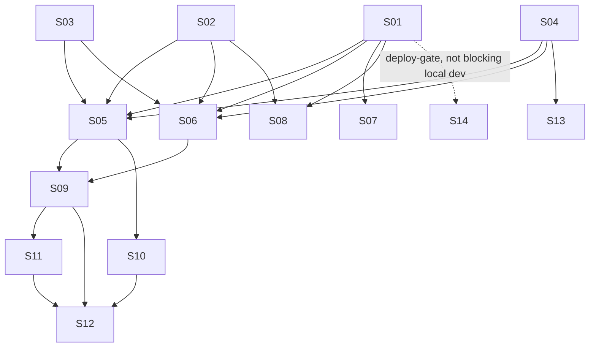

# M19 — Hotsite Chatbot

**Phase:** Local Development
**Goal:** Add an LLM-backed FAQ chatbot widget to the public hotsite, scoped to each tenant's own business data — informational only (never confirms/creates/modifies a booking, never accesses customer/staff/booking records), with a ten-layer cost/abuse-prevention design and a swappable multi-provider LLM adapter (OpenRouter primary + Anthropic + OpenAI).
**Depends on:** M12 (Hotsite Frontend — module rendering/manifest pattern), M13 (Dashboard Frontend — per-module config panel pattern, tenant settings form pattern), M15/M17 (GCP Infrastructure — Secret Manager + Cloud Scheduler modules, reused not rebuilt)
**Blocks:** none yet
**Design rationale:** `docs/discovery/CHATBOT/CHATBOT.md` (promoted via `/discovery-to-milestone` on 2026-08-08) — kept as the permanent *why*; this file and the canonical docs it cites (`docs/04-USE_CASES.md` UC-033–UC-036 + UC-026/UC-027 extensions, `docs/02-DOMAIN_MODEL.md`, `docs/05-BOUNDED_CONTEXTS.md`, `docs/13-DATABASE_SCHEMA.md`, `docs/14-API_CONTRACTS.md`, `docs/15-HOTSITE_DYNAMIC_ARCHITECTURE.md`, `docs/21-TENANTS_SETTINGS_SCHEMA.md` §7) are the source of truth for implementation — nothing below should require opening the discovery doc to understand.

**Non-Goals (explicitly deferred or dropped — not gaps in this plan):**
- A "spend by tenant" dashboard — MVP visibility is a periodic query against `chatbot_messages`, not new pipeline infrastructure (`CHATBOT.md` §8; avoids the premature-metrics-infra failure mode `docs/ENGINEERING_RULES.md` already documents an incident about)
- RAG/vector retrieval, availability-aware answers, booking actions from chat, multi-turn memory across sessions, self-hosted open-weight models — all explicitly out of scope per `CHATBOT.md` §11
- A recurring adversarial-eval cadence — no owner/schedule decided; tracked as an ops follow-up outside this milestone, not a story (`CHATBOT.md` §10.9)
- Vertex AI as a fourth LLM adapter — dropped from scope entirely during promotion, not deferred (`CHATBOT.md` §3 correction, 2026-08-08)
- `ChatbotDailyCapReached` tenant-admin notification email — replaced by S12's module-config-screen banner; the event itself is not built

---

## Build order

| Story | Theme |
|---|---|
| M19-S01 | Chatbot domain aggregates + database migration |
| M19-S02 | `ILlmProvider` port + registry + OpenRouter adapter |
| M19-S03 | Anthropic + OpenAI adapters |
| M19-S04 | `chatbot` tenant-settings category |
| M19-S05 | Send-chat-message use case + cap enforcement (UC-033) |
| M19-S06 | Chatbot availability status use case (UC-034) |
| M19-S07 | Retention-purge cron (UC-035) |
| M19-S08 | Balance-poll cron (UC-036) |
| M19-S09 | Chatbot public BFF endpoints + context/mapper |
| M19-S10 | Chatbot cap-status admin BFF endpoint (UC-027 A5) |
| M19-S11 | `CHATBOT` module type + widget component + `page.tsx` registration |
| M19-S12 | Chatbot module config panel |
| M19-S13 | Tenant settings form — Chatbot section |
| M19-S14 | Infra: secrets, env vars, scheduler jobs (devops) |

**Wave 0** (S01–S04): backend foundation, no risky backfill — pure additive schema/config.
**Wave 1** (S05–S08): backend use cases and cron jobs, depend on Wave 0.
**Wave 2** (S09–S10): BFF orchestration, depend on Wave 1.
**Wave 3** (S11–S13): frontend, depend on Wave 2 (S13 only depends on S04).
**S14**: infra provisioning — sequenced independently; not a functional dependency for local development (which uses local env vars + the manual `POST /cron/...` trigger endpoints, same as every existing cron job), but required before real staging/prod traffic. Mirrors this repo's own precedent: `M11-NOTIFICATIONS-CRON.md` shipped its cron/secret-consuming code in Local Development phase before the SendGrid secret was actually provisioned in `M15`.

---

### M19-S01 — Chatbot domain aggregates + database migration ✅ Done

**Agent:** `backend-ts`
**Complexity:** M
**Docs to load:** `docs/02-DOMAIN_MODEL.md` § Platform Context (ChatbotSession/ChatbotMessage/ChatbotProviderBalance), `docs/13-DATABASE_SCHEMA.md` § `platform.chatbot_sessions`/`chatbot_messages`/`chatbot_provider_balance`, `docs/04-USE_CASES.md` UC-033/UC-034

**Description:**
Create three new domain entities as thin persistence records — same treatment as `NotificationLog`: a plain repository, no rich cross-field invariants — in `apps/backend/src/contexts/platform/domain/`: `ChatbotSession`, `ChatbotMessage`, `ChatbotProviderBalance`, matching `docs/02-DOMAIN_MODEL.md`'s exact field lists and methods (`ChatbotSession.create()`/`recordMessage()`/`markCapped()`/`close()`; `ChatbotMessage.create()`; `ChatbotProviderBalance.upsert()`). Each gets a matching `IChatbotXxxRepository` port in `apps/backend/src/contexts/platform/application/ports/` and a `TypeOrmChatbotXxxRepository` adapter in `apps/backend/src/contexts/platform/infrastructure/repositories/`, registered with `useClass` (never `useExisting`).

**Port scope for this story is deliberately minimal** — `IChatbotSessionRepository`: `findById(id, tenantId)` + `save()`; `IChatbotMessageRepository`: `save()` plus whatever read method the round-trip integration test needs (e.g. `findById`); `IChatbotProviderBalanceRepository`: `save()`/upsert keyed by `provider`. The COUNT-based cap-query methods S05's cap enforcement needs (daily/IP/concurrency counts against `chatbot_sessions`, message counts against `chatbot_messages`) are out of scope here — S05 extends these ports itself when it lands.

`ChatbotProviderBalance` has no `tenant_id` column — platform-wide, single row per provider. This is a documented exemption (`docs/06-TENANT_ISOLATION_STRATEGY.md` § Documented exemption: platform-operator data), not an oversight: it's Ikaro's own vendor balance, not tenant business data, and stays in `platform` schema/context since every reader/writer of it (S05, S06, S08) is already a Platform Context use case.

Migration: `apps/backend/src/contexts/platform/infrastructure/migrations/<timestamp>-CreateChatbotTables.ts` — pick a 13-digit epoch-ms timestamp greater than the current highest across all contexts (`1748400000009` as of this writing; migration timestamps are global, not per-context — verify the current highest again at implementation time). Creates all three tables per `docs/13-DATABASE_SCHEMA.md`'s exact column/index/FK spec, including the composite FK `(tenant_id, session_id) → chatbot_sessions(tenant_id, id)` on `chatbot_messages` and the required index on `chatbot_messages.created_at` (needed by S05's global spend query — without it, that query full-table-scans on every session-start request platform-wide as the table grows). Pure `CREATE TABLE` — no existing table touched, no backfill, no migration-safety risk.

**Acceptance Criteria:**
- [ ] Migration creates exactly the 3 tables/columns/indexes/FKs `docs/13-DATABASE_SCHEMA.md` specifies
- [ ] Migration runs cleanly against a fresh DB and the existing seeded dev DB; `down()` drops all 3 tables cleanly
- [ ] Domain classes match `docs/02-DOMAIN_MODEL.md`'s field lists and methods exactly, including `ChatbotSession.messageCount` as `SmallInt`
- [ ] Each repository registered with `useClass`
- [ ] Unit tests for each aggregate's methods
- [ ] Integration test proving a round-trip save/read for each table against the real test DB, registered in `integration-global-setup.ts`
- [ ] Integration test proves the composite FK on `chatbot_messages` rejects a cross-tenant reference — inserting a message whose `session_id` belongs to a different tenant's session fails at the DB level
- [ ] Coverage ≥80% on changed code; `tsc --noEmit`, lint, full test suite green

**Dependencies:** None — first story in the milestone.

**Follow-up (M19-S04 story-discovery, 2026-08-11):** a second migration, `1748400000011-AddCostUsdToChatbotMessages.ts`, adds `chatbot_messages.cost_usd` (`NUMERIC(12,8) NOT NULL DEFAULT 0`) — a new column, not a squash into this story's original migration, since `1748400000010` had already shipped to staging by the time the need was discovered. See S02/S03/S05's own follow-up notes for the full redesign this is part of: cost is now computed once, at send-time, by whichever adapter produced the message, and stored directly — never reconstructed later from `input_tokens`/`output_tokens`. `docs/02-DOMAIN_MODEL.md` and `docs/13-DATABASE_SCHEMA.md` updated to match.

---

### M19-S02 — `ILlmProvider` port + registry + OpenRouter adapter ✅ Done

**Agent:** `backend-ts`
**Complexity:** M
**Docs to load:** `docs/discovery/CHATBOT/CHATBOT.md` § 3 (Model Sourcing & Cost), § 4 (Architecture), `docs/AGENT_PATTERNS.md` Pattern #1 (port+adapter)

**Description:**
Create `ILlmProvider` port (`apps/backend/src/contexts/platform/application/ports/llm-provider.port.ts`) per `CHATBOT.md` §4's exact interface: `ChatTurn { role, content }`, `ChatCompletionRequest { systemPrompt, history, userMessage, maxOutputTokens }`, `ChatCompletionResult { text, inputTokens, outputTokens, modelId }`, `ILlmProvider.complete(request): Promise<ChatCompletionResult>`.

**Follow-up (M19-S04 story-discovery, 2026-08-11): `ChatCompletionResult` gains a required `costUsd: Decimal` field.** Originally this story planned a shared `MODEL_PRICING` lookup (`contexts/platform/chatbot.constants.ts`, consumed later by S05's spend query) — dropped in favor of each adapter reporting its own cost directly, since verifying the real APIs live during S04's discovery found OpenRouter's response already includes an authoritative `usage.cost` field (confirmed always present, no opt-in needed) that the original design was silently discarding in favor of a self-computed estimate. Anthropic and OpenAI never return cost in their responses, so their adapters (S03) still compute it, but from a private per-adapter constant, not a shared table. Uses `decimal.js`, matching the precedent already set by `ChatbotProviderBalance.remainingUsd` — never a plain `number`, to avoid float precision loss on dollar amounts.

Create `LlmProviderRegistry` — a `Map<string, ILlmProvider>` keyed by provider name — resolving `tenant.settings.chatbot?.llmProvider ?? process.env.CHATBOT_LLM_PROVIDER ?? 'openrouter'`.

Build `openrouter-llm.adapter.ts` (`apps/backend/src/contexts/platform/infrastructure/llm/`) — the primary/default adapter, model `deepseek/deepseek-v4-flash-0731`. **Implementation trap, empirically confirmed, not theoretical:** must always explicitly send `reasoning: { effort: "none" }` on every request. The API defaults to `high` if unset, and reasoning tokens bill as output tokens whether or not they're returned — an adapter that forgets this silently bills every message at the expensive tier with no error to surface it. A second, worse trap the real eval caught: even `effort: "low"` isn't safe — reasoning-token usage scales with prompt complexity and `max_tokens` caps reasoning + the visible answer combined, so `low` effort consumed the entire response budget on 8 of 19 real test questions in `CHATBOT/eval/`, returning `null` with `finish_reason: "length"`. Only `"none"` (0 reasoning tokens, confirmed) avoids this failure mode.

Register via `useClass` (never `useExisting` — tests need to swap in a fake `ILlmProvider`).

**Acceptance Criteria:**
- [ ] `ILlmProvider` port matches `CHATBOT.md` §4's interface exactly
- [ ] `openrouter-llm.adapter.ts` always sends `reasoning: { effort: "none" }` — a regression test that would fail if the field were ever omitted or defaulted
- [ ] `LlmProviderRegistry` resolves `tenant.settings.chatbot?.llmProvider ?? CHATBOT_LLM_PROVIDER ?? 'openrouter'` correctly, including the all-unset case
- [ ] Adapter maps OpenRouter's response (`usage.prompt_tokens`, `usage.completion_tokens`, `usage.cost`) into `ChatCompletionResult` correctly, including `costUsd` read directly from `usage.cost` (required, non-nullable in the response schema — an unexpected missing/null cost fails as a controlled "malformed response" error, the same principle already applied to a missing `usage` object, rather than silently defaulting to zero)
- [ ] Adapter registered with `useClass`; a `FakeLlmProviderBuilder` (class + `withText()`/`withInputTokens()`/`withOutputTokens()`/`withCostUsd()`/`build()`, this repo's builder convention — never a plain factory) exists for use-case tests. Renamed from the originally-drafted `withResponse()`/`withTokenUsage()` during implementation — the pre-pr script's BE-7 check (S2933) expects an exact `with<FieldName>()` match per private field, which `withTokenUsage()` setting two fields at once didn't satisfy.
- [ ] Never a real network call in any automated test — stub the HTTP layer
- [ ] Coverage ≥80%; `tsc --noEmit`, lint, tests green

**Dependencies:** None (parallel to S01, S03, S04).
**New env var:** `CHATBOT_LLM_PROVIDER` (default `openrouter`), wired into Terraform (`envs/staging` + `envs/prod` `cloudrun_backend`) as part of this story — not deferred to S14.
**New secrets — provisioned by this story, not S14 (scope moved during `/story-discovery`, 2026-08-10):** `OPENROUTER_API_KEY`, `ANTHROPIC_API_KEY`, `OPENAI_API_KEY` — all 3 Secret Manager containers + the backend SA's Foundation-owned accessor grant + `secret_env_vars` wiring on `cloudrun_backend` land in this story, even though only the OpenRouter adapter itself is built here (S03 builds the other two adapters against secrets that already exist by then). Real key values populated out-of-band via `gcloud secrets versions add`, same mechanism as every other secret in this codebase — not via Terraform.

---

### M19-S03 — Anthropic + OpenAI adapters ✅ Done

**Agent:** `backend-ts`
**Complexity:** S
**Docs to load:** `docs/discovery/CHATBOT/CHATBOT.md` § 4

**Description:**
Build `anthropic-llm.adapter.ts` and `openai-llm.adapter.ts` against the same `ILlmProvider` port S02 established, in the same `infrastructure/llm/` folder. Each maps its own provider's response shape into `ChatCompletionResult` (`inputTokens`/`outputTokens`/`modelId`/`costUsd`). Both registered in `LlmProviderRegistry` alongside `openrouter`. This is the actual point of the port earning its keep — zero interface change to add either.

**Follow-up (M19-S04 story-discovery, 2026-08-11): each adapter also computes `costUsd`, since neither Anthropic's nor OpenAI's API returns cost in its response** (confirmed against both providers' live docs — unlike OpenRouter's `usage.cost`, both only report token counts). Each adapter holds its own private pricing constant (`ANTHROPIC_PRICING`/`OPENAI_PRICING`, `{ inputPerMillionTokensUsd, outputPerMillionTokensUsd }`) and a `computeCostUsd(inputTokens, outputTokens): Decimal` helper, priced for that adapter's own `DEFAULT_*_MODEL` only — a tenant `llmModel` override to a different tier isn't priced correctly, the same already-documented gap as the `thinking`-by-default trap below. No shared `MODEL_PRICING` table — see S02's follow-up note for why.

**Default models (decided during `/story-discovery`, 2026-08-11 — neither was specified anywhere before this):**
- `anthropic-llm.adapter.ts` defaults to `claude-haiku-4-5` — Anthropic's cost/speed tier, matching the role DeepSeek V4 Flash fills for OpenRouter (§3's "deliberately-not-smart, cost-dominant FAQ bot" framing). Calls the Messages API (`https://api.anthropic.com/v1/messages`) with `x-api-key` + `anthropic-version: 2023-06-01` headers — **not** Bearer auth like the other two adapters. The system prompt is Anthropic's own top-level `system` field, never injected into `messages` as a `role: "system"` turn (Anthropic's `messages` array only accepts `user`/`assistant`, which maps directly onto `ChatTurn`). **Deliberately leave the `thinking` parameter unset** — Haiku 4.5 does not think unless explicitly enabled, avoiding the newer-model trap where Opus 5/Opus 4.8/Sonnet 5/Fable 5 all run adaptive thinking *on* by default when `thinking` is omitted, sharing the same `max_tokens` budget as the visible answer (the same class of silent-cost/truncation bug S02 fixed for OpenRouter via `reasoning: {effort:"none"}`). If a tenant's `llmModel` override ever points at one of those thinking-by-default models, this adapter as designed does **not** protect against that failure mode — out of scope here, flagged for whoever builds tenant-facing model selection later.
- `openai-llm.adapter.ts` defaults to `gpt-5.6-luna` — OpenAI's cheapest current flagship tier ($0.20/$1.20 per 1M input/output tokens, confirmed against the live OpenAI pricing page 2026-08-11, not training memory). Calls the Chat Completions API (`https://api.openai.com/v1/chat/completions`), Bearer auth, `choices[0].message.content` / `usage.prompt_tokens` / `usage.completion_tokens` — the same shape family `openrouter-llm.adapter.ts` already mirrors.

**Acceptance Criteria:**
- [ ] Both adapters implement `ILlmProvider` correctly, registered with `useClass`
- [ ] `LlmProviderRegistry` offers all 3 providers (`'openrouter'`, `'anthropic'`, `'openai'`) once this story ships — a `tenant.settings.chatbot.llmProvider` override to any of the 3 resolves to a real adapter instance
- [ ] Each adapter's `costUsd` is computed from its own private pricing constant against real `inputTokens`/`outputTokens` — a test asserting the exact `Decimal` value for a known token count
- [ ] Unit tests per adapter, stubbed HTTP layer, no real network calls
- [ ] Coverage ≥80%; `tsc --noEmit`, lint, tests green

**Dependencies:** S02.
**Secrets:** `ANTHROPIC_API_KEY`, `OPENAI_API_KEY` — containers + IAM + Terraform wiring already provisioned by S02 (scope moved during `/story-discovery`, 2026-08-10); this story only needs real key values populated (out-of-band, `gcloud secrets versions add`) before its adapters can be exercised against the real APIs.

---

### M19-S04 — `chatbot` tenant-settings category ✅ Done

**Agent:** `backend-ts` + `bff-ts`
**Complexity:** S
**Docs to load:** `docs/21-TENANTS_SETTINGS_SCHEMA.md` § 7, `docs/14-API_CONTRACTS.md` § Tenant Settings

**Description:**
Add `chatbot` as a new category to `TenantSettings` VO (`apps/backend/src/contexts/platform/domain/value-objects/tenant-settings.vo.ts`). **Deliberate deviation from every other category's pattern** (already documented in `docs/21` §7, apply it exactly): `TenantSettings.default()` writes only `knowledgeText: ""` — the 8 caps + `llmProvider`/`llmModel` are never written into any tenant's row by default, resolved instead as `tenant.settings.chatbot?.X ?? DEFAULT_X` at read time, where `DEFAULT_X` lives in a new `contexts/platform/chatbot.constants.ts` (the 8 cap defaults from `CHATBOT.md` §8). No `MODEL_PRICING` lookup here — originally planned as a stub in this file, removed during this same story-discovery session once live API verification found a cleaner design; see S02's follow-up note for the full reasoning.

Add `chatbot` to the fixed category-key list in both `UpdateTenantSettingsSchema` (backend DTO, `.strict()`) and `UpdateTenantSettingsBodySchema` (BFF, `.strict()`). Within the `chatbot` category, accept **only** `knowledgeText` — a request setting any cap/provider field is rejected `400`, not silently stripped (an explicit, deliberate choice, not left ambiguous).

**3 decisions made during `/story-discovery`, 2026-08-11:**
1. **Error code renamed** from the originally-drafted `PLATFORM_CHATBOT_KNOWLEDGE_TEXT_TOO_LONG` to `PLATFORM_SETTINGS_CHATBOT_KNOWLEDGE_TEXT_TOO_LONG` — matches the `PLATFORM_SETTINGS_<CATEGORY>_<FIELD>_<REASON>` convention every other `PlatformErrorCode.SETTINGS_*` entry already follows (e.g. `SETTINGS_LOYALTY_EXPIRY_DAYS_INVALID`); the original name was the only one of ~24 settings error codes that dropped `SETTINGS`.
2. **`knowledgeText` gets no hardcoded length bound at the Zod layer** (BFF `UpdateTenantSettingsBodySchema` and backend `UpdateTenantSettingsSchema` both validate it as a plain `z.string()`). `docs/21-TENANTS_SETTINGS_SCHEMA.md` §7 defines the cap as the *resolved* `maxKnowledgeTextLength` (default 4000, or a tenant's own Ikaro-granted override) — a static Zod `.max(4000)` would silently make any override above 4000 unenforceable, since Zod would reject the request before the domain layer (which knows the real per-tenant value) ever runs. This also follows `docs/ENGINEERING_RULES.md` § "Single source of truth for a validation rule's code": this rule is VO-backed (`ChatbotSettingsValidator`), so Zod must not mint its own bound/code for it. The domain validator alone throws `PLATFORM_SETTINGS_CHATBOT_KNOWLEDGE_TEXT_TOO_LONG`, resolving `props.chatbot?.maxKnowledgeTextLength ?? DEFAULT_MAX_KNOWLEDGE_TEXT_LENGTH` from `chatbot.constants.ts`.
3. **`packages/types/src/tenant.dto.ts` is in scope for this story** (not originally named in this story's docs-to-load) — its `TenantSettings` and `UpdateTenantSettingsRequest` interfaces need a `chatbot` field for BFF/web type safety on this story's own `GET`/`PATCH` endpoints; without it the backend would return `chatbot` in the JSON body untyped.

**Acceptance Criteria:**
- [ ] `TenantSettings.default()` writes `chatbot: { knowledgeText: "" }` only — no caps/provider fields
- [ ] `contexts/platform/chatbot.constants.ts` holds the 8 cap defaults (`maxConversationsPerDay=30`, `maxConversationsPerIpPerDay=5`, `maxConcurrentConversations=5`, `maxMessagesPerConversation=20`, `maxMessageLengthChars=1000`, `maxHistoryMessagesSentToLlm=10`, `maxOutputTokensPerResponse=300`, `maxKnowledgeTextLength=4000`) — consumed by S05/S06 and by this story's own `ChatbotSettingsValidator`
- [ ] `PATCH /v1/tenants/settings` accepts `settings.chatbot.knowledgeText` as a string with no hardcoded length bound at the Zod layer (BFF + backend) — the resolved `maxKnowledgeTextLength` cap is enforced solely by `ChatbotSettingsValidator` in the domain layer, `400 PLATFORM_SETTINGS_CHATBOT_KNOWLEDGE_TEXT_TOO_LONG` if exceeded; rejects any other `chatbot.*` key with `400` at the Zod `.strict()` layer
- [ ] `GET /v1/tenants/settings` returns the `chatbot` category for every tenant (empty `knowledgeText` for tenants that never set it)
- [ ] New error code `PLATFORM_SETTINGS_CHATBOT_KNOWLEDGE_TEXT_TOO_LONG` added to `packages/types/src/error-codes.ts` + both `pt-BR`/`en` locale files in the same commit — exhaustiveness test passes
- [ ] `packages/types/src/tenant.dto.ts`'s `TenantSettings` and `UpdateTenantSettingsRequest` interfaces gain a `chatbot` field (`TenantChatbotSettings { knowledgeText: string }`, and `Partial<TenantChatbotSettings>` on the update request), matching the existing `TenantNotificationSettings` pattern
- [ ] Unit + integration tests for the VO default/validation and the `PATCH`/`GET` endpoints
- [ ] Coverage ≥80%; `tsc --noEmit`, lint, tests green

**Dependencies:** None (parallel to S01–S03).
**New error code:** `PLATFORM_SETTINGS_CHATBOT_KNOWLEDGE_TEXT_TOO_LONG` (both locale files).

---

### M19-S05 — Send-chat-message use case + cap enforcement (UC-033) ✅ Done

**Agent:** `backend-ts`
**Complexity:** L
**Docs to load:** `docs/04-USE_CASES.md` UC-033, `docs/discovery/CHATBOT/CHATBOT.md` § 8 (Cost Controls & Abuse Prevention), `docs/13-DATABASE_SCHEMA.md` § chatbot tables, `docs/ENGINEERING_RULES.md` § Transactions (PR #267 precedent)

**Description:**
The core use case — `SendChatMessageUseCase` in `apps/backend/src/contexts/platform/application/use-cases/`. Implements every cap layer from `CHATBOT.md` §8 exactly:
- **Volume caps (1–3, new-session only):** `maxConversationsPerDay`, `maxConversationsPerIpPerDay`, `maxConcurrentConversations` — all `COUNT`-based against `chatbot_sessions`, queried directly against Postgres, **never a per-instance `CachePort` cache** (would undercount independently on each Cloud Run replica, silently turning a platform-wide/tenant-wide limit into limit × replica count).
- **`maxMessagesPerConversation` (4, existing-session):** `COUNT` of all `chatbot_messages` rows for the session, both roles.
- **`maxMessageLengthChars` (5):** rejected upstream at the BFF DTO layer (S09) for the real UX-facing error, **and** re-enforced here against the same tenant-resolved value (PR #360 review — a generous static Zod ceiling at the backend DTO layer alone left the tenant's real, often-smaller cap unenforced for any caller reaching this endpoint directly, bypassing the BFF's check).
- **`maxOutputTokensPerResponse` (6):** passed as a hard ceiling on `ILlmProvider.complete()`.
- **History-window shaping (8, not a reject):** truncate to `maxHistoryMessagesSentToLlm` (last 5 exchanges) before assembling `ChatCompletionRequest.history` — this is what keeps per-call cost flat regardless of conversation length; `chatbot_messages` still stores the full conversation up to cap 4's limit.
- **Platform-wide backstops (9–10):** global daily spend circuit breaker (`SUM(cost_usd)` over today's `chatbot_messages`, compared against `CHATBOT_GLOBAL_DAILY_SPEND_LIMIT_USD`) and provider-balance floor (read `chatbot_provider_balance` for the tenant's resolved provider, compare against `CHATBOT_MIN_PROVIDER_BALANCE_USD`) — both direct Postgres queries, same undercounting-risk reasoning as caps 1–3.

**Follow-up (M19-S04 story-discovery, 2026-08-11): the spend breaker sums `cost_usd`, not tokens × a rate table.** Originally specced as `SUM` grouped by `model_id`, multiplied by each model's rate from a shared `MODEL_PRICING` lookup — replaced because `cost_usd` is now stored per-message at send-time (S02/S03's follow-up notes), computed once by whichever adapter produced that message. This also fixes a correctness gap the original design had: reconstructing cost from tokens at query time meant a mid-day `MODEL_PRICING` change would retroactively re-price every message sent earlier that same day under the old rate — storing cost at send-time avoids that.

Resolves the tenant's LLM provider **and model** via `LlmProviderRegistry` (S02/S03): `tenant.settings.chatbot?.llmProvider` picks the adapter, `tenant.settings.chatbot?.llmModel` is forwarded as `ChatCompletionRequest.model` (already a supported override slot on all 3 adapters — `request.model ?? DEFAULT_X_MODEL` — since S02/S03; this story is what actually wires a tenant's resolved value into it for the first time). Persists both `USER` and `ASSISTANT` `chatbot_messages` rows with real `input_tokens`/`output_tokens`/`model_id`/`cost_usd` from the adapter's result. Only the `ASSISTANT` row's `costUsd` reflects a real LLM call (input tokens billed + output tokens generated) — the `USER` row's `costUsd` is effectively zero/negligible since sending a user message alone doesn't independently invoke the provider; store whatever the adapter's single `complete()` call reports for the whole turn on the `ASSISTANT` row, and `0` on the `USER` row (implementer's call on the exact split — flagged here so it isn't silently improvised).

**Critical:** the LLM call is cross-service network I/O — per the PR #267 precedent, it must never sit inside `txManager.run()`, not before and not as a post-commit step. The natural-looking implementation ("create session, call LLM, save message, all in one transaction") is exactly the shape that precedent exists to prevent.

**This story's scope also includes the backend HTTP endpoint, not just the use case class** (gap found during M19-S05 story-discovery, 2026-08-12 — see the follow-up note below). A controller (e.g. `ChatbotController`, `apps/backend/src/contexts/platform/infrastructure/controllers/`) exposing the route S09's BFF calls via `BackendHttpService.postForPublic(...)`, plus its Zod-validated DTO and `mapPlatformError` wiring for the 5 new error codes. Follows the existing bare-route + `RequestContext` pattern already used for every other guest-reachable backend route in this codebase — `ServiceController` (`apps/backend/src/contexts/booking/infrastructure/controllers/service.controller.ts`) and `TenantSettingsController` are the two precedents to mirror: **no** `/public/` prefix on the backend side (that convention is BFF-only, `.public.controller.ts`), `tenantId`/`settings.chatbot` read from the injected `RequestContext` (already eager-loaded per-request, no extra tenant-settings query needed), forwarded to the use case as explicit DTO fields. Exact route path is this story's own call — not dictated here.

**Acceptance Criteria:**
- [ ] All cap layers enforced exactly per `CHATBOT.md` §8, using S04's constants (tenant-overridable via `tenant.settings.chatbot?.X ?? DEFAULT_X`)
- [ ] Global spend breaker and balance floor computed via direct Postgres queries, never `CachePort` — a code-review-verifiable fact, not just a test
- [ ] History truncated to `maxHistoryMessagesSentToLlm` before every LLM call — a test proving message N+1 of a long conversation sends a bounded history size, not the full conversation
- [ ] LLM call is never inside `txManager.run()`
- [ ] `tenant.settings.chatbot?.llmModel` is resolved and forwarded as `ChatCompletionRequest.model` alongside `llmProvider` — a test proving a tenant's model override actually reaches the adapter, not just the provider override
- [ ] The LLM call/cap-check is enriched onto the ambient request span via `setActiveSpanAttributes()` (`packages/observability`) — **not** `startActiveSpan()`, which would open a new manual business span inside a use case, explicitly deferred by M17-S33/TD28's own Non-Goals (`ITracingPort.startActiveSpan()`'s own JSDoc scopes it to transport-layer dispatch boundaries only). The outbound LLM HTTP call already gets its own auto-instrumented span for free (`@opentelemetry/instrumentation-undici`, bundled and enabled by default in this repo's `getNodeAutoInstrumentations` config) — no manual span is needed for the network call either. Attributes: `chatbot.session_id`, `chatbot.model_id`, `chatbot.provider`, `chatbot.input_tokens`, `chatbot.output_tokens`, `chatbot.cap_rejected` (alongside the `tenant.id`/`correlation.id` already set on that span by `RequestInterceptor`)
- [ ] Structured log on every cap rejection (`AppLogger` pattern, same as `AppThrottlerGuard`'s own logging)
- [ ] New error code per cap-rejection reason, both locale files (e.g. `PLATFORM_CHATBOT_DAILY_CAP_REACHED`, `PLATFORM_CHATBOT_CONCURRENCY_CAP_REACHED`, `PLATFORM_CHATBOT_MESSAGE_CAP_REACHED`, `PLATFORM_CHATBOT_GLOBAL_SPEND_LIMIT_REACHED`, `PLATFORM_CHATBOT_PROVIDER_BALANCE_LOW`) — all 5 map to HTTP `429` in `platform-error.mapper.ts` (decided during story-discovery, 2026-08-12: one status for every "try again later" case, including the 2 platform-wide backstops, not just the 4 per-tenant volume caps)
- [ ] Backend controller + DTO + route for `SendChatMessageUseCase` exists (this story's own scope — see Description), wired through `mapPlatformError`
- [ ] `FakeLlmProvider`-based unit tests for the use case — deterministic, no real LLM call ever in CI
- [ ] Integration test against the real test DB proving the common case: sequential requests correctly rejected once at cap (not the accepted race-window itself — a known, tolerated gap per `CHATBOT.md` §8, not a bug to chase)
- [ ] Coverage ≥80%; `tsc --noEmit`, lint, tests green

**Dependencies:** S01, S02, S03, S04.
**New env var:** `CHATBOT_GLOBAL_DAILY_SPEND_LIMIT_USD` (default `25`).
**New error codes:** 5 listed above, both locale files, all mapped to `429`.

**Follow-up (M19-S05 story-discovery, 2026-08-12) — 4 gaps found and resolved before implementation:**
1. **Backend HTTP controller was entirely unspecified.** The story as originally drafted named only the use-case class; nothing in this milestone's plan ever specified the backend endpoint S09's BFF needs to call. Resolved: in scope for this story (see Description) — `ServiceController`/`TenantSettingsController` are the precedent.
2. **`tenant.settings.chatbot?.llmModel` was never mentioned**, despite `docs/21-TENANTS_SETTINGS_SCHEMA.md` §7 documenting it and all 3 adapters already supporting a `request.model` override since S02/S03. Resolved: wired alongside `llmProvider`.
3. **`startActiveSpan()` conflicted with M17-S33/TD28's documented deferral of manual business spans inside use cases**, and — checked during this discovery — would have been redundant with it anyway, since the outbound LLM call already gets an auto-instrumented span via undici instrumentation. Resolved: `setActiveSpanAttributes()` on the ambient span instead; no new span, no adapter/port changes.
4. **HTTP status for the 2 platform-wide backstops (layers 9-10) was undefined** — `docs/14-API_CONTRACTS.md` only defined `429`/`503` for the 4 per-tenant caps and the LLM-failure case respectively. Resolved: `429` for all 5 new error codes, including the platform-wide ones (`docs/14-API_CONTRACTS.md` and `docs/04-USE_CASES.md` UC-033 A6 updated to match).

**Follow-up (PR #360 cross-tool review, Codex, 2026-08-12) — 5 findings, all fixed before merge:**
1. **Concurrency-cap race was wider than the accepted one.** The new session wasn't persisted until *after* the LLM call returned, so `countActiveSince()` couldn't see any in-flight request for the full LLM-latency window (seconds), not the narrow DB-round-trip window `CHATBOT.md` §8 accepts for layers 1-2. Fixed: the session (and, for an existing session, its updated `messageCount`) is now persisted via its own `txManager.run()` immediately after cap checks pass, *before* calling the LLM — narrows the race back to the same accepted window.
2. **Message-cap (layer 4) had a real deterministic overshoot, not just a race.** `messages.length >= maxMessages` only rejected once already at/over cap, so an odd `maxMessagesPerConversation` override could overshoot by 1 (a bug I'd found and merely commented on, not fixed, before this review). Fixed: checks `session.messageCount + 2 > maxMessages` — an exact ceiling for any configured value — and switched from counting live `chatbot_messages` rows to the already-maintained `session.messageCount`, avoiding a full-conversation read on every turn as a side benefit.
3. **`maxMessageLengthChars` (layer 5) was a bypassable defense-in-depth-only check**, not real enforcement — see the Description bullet above.
4. **Platform-wide backstops (layers 9-10) were checked on every message, contradicting `CHATBOT.md` §8.9's own text** ("already-open conversations remain bounded by their own per-session caps regardless") — a misreading of UC-033 A6 during this story's own discovery. Fixed: reverted to new-session-only, matching the canonical doc; `docs/04-USE_CASES.md` UC-033 A6 clarified to prevent the same misreading again.
5. **503 responses embedded the raw upstream provider error text** (`ChatbotProviderUnavailableError`'s `cause` param) directly in the public Problem Details `detail` field — a real info-disclosure gap once a real adapter's error message could include vendor-specific diagnostic details. Fixed: the public error message is now a fixed, generic string; the real cause is logged server-side only, via `AppLogger`, before the error is thrown.

Also added, incidental to fix #2: `IChatbotMessageRepository.findRecentBySession()` — a SQL-level `LIMIT`, not "fetch the whole conversation and slice in JS" (the previous `findBySession()`-based history assembly) — closing a real performance finding from the same review pass.

---

### M19-S06 — Chatbot availability status use case (UC-034) ✅ Done

**Agent:** `backend-ts`
**Complexity:** L (bumped from M during story-discovery, 2026-08-12 — see Resolved note below)
**Docs to load:** `docs/04-USE_CASES.md` UC-034, `docs/discovery/CHATBOT/CHATBOT.md` § 7 (Widget States), § 8.10 (balance floor), `docs/13-DATABASE_SCHEMA.md` § `platform.chatbot_provider_balance`, `docs/02-DOMAIN_MODEL.md` § `ChatbotProviderBalance`

**Description:**
`GetChatbotStatusUseCase` evaluating the 5 "not available" conditions per UC-034, for the tenant resolved from the request: tenant daily cap already exhausted, tenant concurrency cap already exhausted, resolved LLM provider (`tenant override ?? platform default`) failing a health check, global daily spend breaker already tripped, resolved provider's balance floor already tripped (`chatbot_provider_balance`, a local lookup — never a live external call in this path, per S08's periodic poll). Pure read, no writes of its own.

Backend controller: extend the existing `ChatbotController` (`platform/chatbot`, built in S05) with `GET status` — same bare-route, no-`/public/`-prefix, `RequestContext`-sourced-`tenantId`/`settings.chatbot` pattern S05 already established. No new controller class.

**Resolved (M19-S06 story-discovery, 2026-08-12) — the provider health-check mechanism (condition c), the one open design detail this story started with:**

A dedicated live ping was ruled out — it would add real external latency/cost to every hotsite page load platform-wide (every widget mount, not just real chats), the exact hot-path cost `CHATBOT.md` §8.10 already explicitly avoids for the balance-floor check one condition over. Instead: extend `chatbot_provider_balance` (already read for condition e) with `last_success_at`/`last_failure_at`, written by `SendChatMessageUseCase` (S05, already merged — this story adds two write calls to its existing single success path and existing single `catch` block around `provider.complete()`) as a passive side effect of real chat traffic. `GetChatbotStatusUseCase` reads the same row already fetched for the balance-floor check — one query serves both conditions.

**Availability rule — a half-open/circuit-breaker cooldown, not a plain "last event wins" comparison:** unhealthy only if `last_failure_at` is more recent than `last_success_at` **and** within `CHATBOT_PROVIDER_HEALTH_COOLDOWN_MINUTES` (new env var, default `5`) of now. A plain "most recent event wins" rule was considered and rejected during discovery: since `available: false` means the widget never renders at all (UC-034 A1), a single transient failure with no cooldown would permanently lock the widget dark — no visitor could ever attempt the message that would produce the success needed to clear it. The cooldown gives the next real visitor's attempt, after the window elapses, the chance to either confirm recovery (fresh `last_success_at`) or restart the wait (fresh `last_failure_at`). Contrast with the other 4 conditions, which all self-heal on a clock with no visitor dependency: (a)/(b) are rolling time-windowed `COUNT`s, (d) resets at UTC midnight, (e) recovers via S08's independently-scheduled poll (or the manual `POST /cron/chatbot-balance-poll` trigger) regardless of widget state — (c) is the only condition with no independent signal source, which is why it alone needed this cooldown.

**Critical correctness requirement, not implementation detail:** the health write must happen **only** inside the `provider.complete()` `catch` block already in `SendChatMessageUseCase` — never in any of the cap-rejection paths (`rejectAndThrow()` for daily/IP/concurrency/message/length caps, global spend breaker, balance floor), all of which already throw earlier in that method, before the `try`/`catch` around the LLM call is ever reached. One tenant hitting its own daily cap must never flip every tenant's widget dark. See `docs/13-DATABASE_SCHEMA.md`'s updated `chatbot_provider_balance` section for the full write-discipline note (partial-column upsert only, e.g. TypeORM `repository.upsert(entityLike, ['provider'])` — never `Repository.save()` on a fully-populated entity, which would let S08's independent balance-poll writer or S06/S05's health writer silently clobber the other's columns).

Migration: `apps/backend/src/contexts/platform/infrastructure/migrations/<timestamp>-AddHealthColumnsToChatbotProviderBalance.ts` (next timestamp after the current highest, `1748400000011` as of this writing — verify again at implementation time) — `ALTER COLUMN remaining_usd DROP NOT NULL`, `ALTER COLUMN checked_at DROP NOT NULL`, `ADD COLUMN last_success_at TIMESTAMPTZ NULL`, `ADD COLUMN last_failure_at TIMESTAMPTZ NULL`. Pure additive/relaxing change — no backfill, no data loss risk (S08 isn't built yet, so no real poll data exists in any environment to migrate).

**Note (found during M19-S05 story-discovery, 2026-08-12; corrected 2026-08-12 per CodeRabbit review on PR #360):** like S05, this story's own text originally named only a use-case class with no backend HTTP controller/route — the same gap S05 had. Resolved above (extend S05's existing `ChatbotController`).

**Acceptance Criteria:**
- [x] All 5 conditions independently tested — each has its own test case proving it correctly flips `available: false`
- [x] Resolves the tenant's actual provider (`tenant override ?? platform default`) before checking the balance floor and health — a tenant overridden to Anthropic isn't blocked by OpenRouter running low or erroring
- [x] Health rule test: `last_failure_at` more recent than `last_success_at` but outside the cooldown window → available (cooldown elapsed, half-open retry allowed)
- [x] Health rule test: `last_failure_at` more recent than `last_success_at` and within the cooldown window → unavailable
- [x] Health rule test: `last_success_at` more recent than `last_failure_at` (of any age) → available
- [x] Negative test: a cap/volume rejection (any of daily/IP/concurrency/message/length/global-spend/balance-floor) in `SendChatMessageUseCase` does **not** write `last_failure_at` — only a genuine `provider.complete()` failure does
- [x] `SendChatMessageUseCase`'s two new write call sites (success, failure) use a partial-column upsert — a test or code-review-verifiable fact that a balance-only write (S08, when built) and a health-only write can never clobber each other's columns
- [x] Migration creates the 2 new nullable columns and relaxes `remaining_usd`/`checked_at` to nullable; runs cleanly against a fresh DB and the existing seeded dev DB; registered in `integration-global-setup.ts`
- [x] `docs/13-DATABASE_SCHEMA.md`'s `chatbot_provider_balance` table already updated to match (done during this story's discovery — verify still accurate at implementation time)
- [x] Pure read in `GetChatbotStatusUseCase` itself — no writes, no side effects (the two new writes live in `SendChatMessageUseCase`, not here)
- [x] Coverage ≥80%; `tsc --noEmit`, lint, tests green

**Dependencies:** S01, S02, S03, S04.
**New env var:** `CHATBOT_PROVIDER_HEALTH_COOLDOWN_MINUTES` (default `5`). Correction: `CHATBOT_MIN_PROVIDER_BALANCE_USD` was previously listed here as this story's new env var, but it already exists — S05 added it in anticipation of this story (`.env.example:112`, already read by `SendChatMessageUseCase`'s own balance-floor check). Nothing to add for it.

---

### M19-S07 — Retention-purge cron (UC-035) ✅ Done

**Agent:** `backend-ts` + `devops`
**Complexity:** S
**Docs to load:** `docs/04-USE_CASES.md` UC-035, `docs/13-DATABASE_SCHEMA.md` § chatbot tables, `docs/14-API_CONTRACTS.md` § `POST /cron/chatbot-retention-purge`

**Description:**
Mirrors the loyalty-expiry cron pattern exactly (`docs/04-USE_CASES.md` UC-016b, `apps/backend/src/contexts/loyalty/infrastructure/controllers/cron-loyalty.controller.ts`): a new trigger handler subscribed via `ITriggerBus`, dispatched through the same `GcpPubSubEventBusAdapter` mechanism the loyalty cron already uses. `POST /cron/chatbot-retention-purge` (`InternalApiGuard`-protected) for local/manual triggering. Job: deletes `chatbot_messages` rows where `created_at < now() - interval '180 days'`, then deletes any now-orphaned `chatbot_sessions` rows (zero remaining messages) past the same window — never a session that still has messages.

**Devops half (resolved during M19-S07 story-discovery, 2026-08-13; corrected during PR #365 review, 2026-08-13; foundation grant landed via TD39 follow-up, 2026-08-13):** the `google_pubsub_topic` (`ikaro-cron-chatbot-retention-purge`) is auto-provisioned by `modules/pubsub` from `infra/terraform/pubsub-catalog.json`, regenerated by `pnpm --filter @ikaro/infra-scripts run pubsub-catalog` and diff-checked in CI (`pr-quality.yml`) — a mandatory, automatic consequence of the code change (the new `registerTrigger()` call site). The `google_cloud_scheduler_job` itself (daily, `0 3 * * *`, `modules/scheduler/main.tf`'s `locals.jobs` + `variables.tf`'s validation) is **implemented in this story**, not deferred — story-discovery had proposed deferring it to S14, but `variables.tf`'s own validation requires every `cron-*` catalog topic to have a matching `locals.jobs` entry, so deferring the job while the (mandatory) catalog regeneration already registers the topic was never actually viable; caught by the Terraform plan CI check turning red on PR #365. The `scheduler_publisher_cron-chatbot-retention-purge` IAM grant in `infra/terraform/foundation/envs/{staging,prod}/main.tf` was genuinely deferred at merge time — `foundation`'s `google_pubsub_topic_iam_member` does a live read of the target topic's IAM policy even at plan time, which 404s until the topic exists in the real project, and that topic is created by the separate `envs/*` root/state — but merging PR #365 with the grant deferred turned into a live deploy deadlock between `foundation`'s and `envs/*`'s state, resolved same-day and documented in full as TD39. The grant is now live in both staging and prod (TD39's follow-up PR). Local dev is unaffected either way, since it uses the manual `POST /cron/chatbot-retention-purge` trigger.

**Acceptance Criteria:**
- [x] Job deletes `chatbot_messages` rows past 180 days, across all tenants in one pass
- [x] Job deletes now-orphaned `chatbot_sessions` rows (`started_at` AND `last_message_at` past the same 180-day window AND zero remaining messages) — never deletes a session that still has messages
- [x] Idempotent — safe to run twice in a row with no error and no unintended deletion
- [x] `POST /cron/chatbot-retention-purge` protected by `InternalApiGuard`, returns `{ ok: true }` once the trigger is published
- [x] **Dispatched through the same trigger mechanism the loyalty-expiry cron uses, and verified (not assumed) to inherit its existing tracing span** — this codebase has a documented precedent (M17-S34) of a sibling cron-dispatch branch silently missing a tracing span; this story's own test/review must confirm the new branch is not the same gap repeated
- [x] `infra/terraform/pubsub-catalog.json` regenerated (`pnpm --filter @ikaro/infra-scripts run pubsub-catalog`) and committed in this story, so the new trigger's topic auto-provisions via `modules/pubsub` — CI diff-checks this file, so a missed regeneration fails `pr-quality.yml`, not just leaves an unprovisioned topic
- [x] `google_cloud_scheduler_job` implemented in this story (see Devops half above) — the `foundation` IAM grant, initially deferred to a follow-up, has since landed too (TD39, 2026-08-13)
- [x] Integration test against the real test DB proving both deletion behaviors
- [x] Coverage ≥80%; `tsc --noEmit`, lint, tests green

**Dependencies:** S01.

---

### M19-S08 — Balance-poll cron (UC-036)

**Agent:** `backend-ts` + `devops`
**Complexity:** S
**Docs to load:** `docs/04-USE_CASES.md` UC-036, `docs/discovery/CHATBOT/CHATBOT.md` § 8.10, `docs/14-API_CONTRACTS.md` § `POST /cron/chatbot-balance-poll`

**Description:**
Same cron pattern as S07. `POST /cron/chatbot-balance-poll`, Cloud Scheduler every 15 minutes, new Pub/Sub topic `ikaro-cron-chatbot-balance-poll`. Job calls OpenRouter's `GET /api/v1/credits` (reuse S02's adapter's HTTP client, or a small dedicated client — implementer's choice) and upserts `chatbot_provider_balance` (`provider='openrouter'`, `remaining_usd`, `checked_at=now()`). On API failure: log a warning, leave the existing row unchanged — never throw or crash the job (staleness in either direction is safe at this cost scale, per `CHATBOT.md` §8.10).

**Write discipline (S06 precedent, added during M19-S06 story-discovery, 2026-08-12):** by the time this story is implemented, `chatbot_provider_balance` also carries `last_success_at`/`last_failure_at` (S06's provider-health columns, written by `SendChatMessageUseCase` on every real chat message). This job's write must use a partial-column upsert touching only `remaining_usd`/`checked_at` (e.g. TypeORM `repository.upsert({ provider, remainingUsd, checkedAt }, ['provider'])`) — never `Repository.save()` on a fully-populated entity object, which would null out the health columns on every 15-minute poll. See `docs/13-DATABASE_SCHEMA.md`'s `chatbot_provider_balance` section for the full rationale.

**Acceptance Criteria:**
- [ ] Job calls OpenRouter's real credits API in production; fully stubbed in all automated tests
- [ ] Upserts (never appends) the single `chatbot_provider_balance` row for `provider='openrouter'`, via a partial-column upsert that never touches `last_success_at`/`last_failure_at` (S06's health columns) — a test proving an existing row's health columns survive a balance poll unchanged
- [ ] API failure logs a warning and leaves the existing row unchanged — verified by a test simulating a failed call
- [ ] **Same tracing-inheritance verification as S07** — confirm this new trigger branch isn't a repeat of the documented sibling-dispatch-branch gap (M17-S34 precedent)
- [ ] Terraform: `google_pubsub_topic` + `google_cloud_scheduler_job` (`*/15 * * * *`) per `docs/14-API_CONTRACTS.md`'s spec (or deferred to S14)
- [ ] Coverage ≥80%; `tsc --noEmit`, lint, tests green

**Dependencies:** S01, S02.

---

### M19-S09 — Chatbot public BFF endpoints + context/mapper

**Agent:** `bff-ts`
**Complexity:** M
**Docs to load:** `docs/14-API_CONTRACTS.md` § Chatbot Widget, `docs/24-BFF_ARCHITECTURE.md` § Module & Controller Naming Conventions, `docs/discovery/CHATBOT/CHATBOT.md` § 6

**Description:**
New `apps/bff/src/features/platform/chatbot/public/chatbot.public.controller.ts` (`public/` prefix — per the `.public.controller.ts` naming convention, M13-S05 precedent) exposing `GET /public/platform/chatbot/status` and `POST /public/platform/chatbot/messages`. Neither forwards actor headers (guest-only route, no actor exists).

New `apps/bff/src/features/platform/chatbot/chatbot-context.ts`: `getServicesContext(tenantId)` (calls `BackendHttpService.getForPublic('/services', tenantId)` — the exact call `SERVICE_LIST` already makes, no new cross-context machinery), `getBusinessInfoContext(tenantId)`, `getKnowledgeTextContext(tenantId)` (both via the backend's existing tenant-settings read path, which itself uses `CachingTenantRepository` — not a fresh raw query assembled ad hoc here).

New `chatbot.mapper.ts`: `buildSystemPrompt({ businessInfo, services, knowledgeText, locale })` — a sectioned prompt (`## Informações do negócio`, `## Serviços`, `## Observações adicionais`, `## Regras do assistente`), and `buildAssistantRules(locale)` — **the hardcoded guardrail text, security-critical, never tenant-editable, never sourced from `tenants.settings.chatbot` or any admin-editable field.** Use the exact wording empirically validated in `CHATBOT/eval/` (2026-08-07, 7/7 adversarial attempts held) — changing this text requires re-running that eval before shipping, not a casual edit.

System prompt rebuilt fresh on every message (not frozen at session start) — forwards `{ systemPrompt, sessionId, userMessage }` to S05's backend endpoint.

**Acceptance Criteria:**
- [ ] Both routes under the `public/` prefix; a test verifies neither forwards actor headers
- [ ] `buildSystemPrompt()` unit tested exhaustively as a pure function: empty `knowledgeText`, missing business fields, services-list formatting, locale substitution
- [ ] `buildAssistantRules()` text matches `CHATBOT.md` §6's exact validated wording
- [ ] System prompt rebuilt fresh on every message — a price edited mid-conversation shows up correctly in the bot's next answer (test)
- [ ] Tenant settings read via the backend's existing settings-read path, not a fresh raw query
- [ ] `400`/`429`/`503` responses mapped per `docs/14-API_CONTRACTS.md`'s spec
- [ ] Unit tests for `ChatbotController` with `BackendHttpService` mocked
- [ ] Coverage ≥80%; `tsc --noEmit`, lint, tests green

**Dependencies:** S05, S06.

---

### M19-S10 — Chatbot cap-status admin BFF endpoint (UC-027 A5)

**Agent:** `bff-ts`
**Complexity:** S
**Docs to load:** `docs/14-API_CONTRACTS.md` § Chatbot Cap Status

**Description:**
`GET /v1/tenants/chatbot/cap-status` (`MANAGER`-only, matching Hotsite Admin Management's all-`MANAGER` convention since this reads out inside `/dashboard/hotsite`) → `{ dailyCapReachedToday: boolean }`. Reuses the identical per-tenant daily-cap `COUNT` query S05's cap enforcement already runs against `chatbot_sessions` — not a new counting mechanism.

**Acceptance Criteria:**
- [ ] `MANAGER`-only; `STAFF` gets `403`
- [ ] Correctly reflects today's cap status using the same `COUNT` query/threshold as S05's enforcement — a test proving both agree at the boundary
- [ ] Coverage ≥80%; `tsc --noEmit`, lint, tests green

**Dependencies:** S05.

---

### M19-S11 — `CHATBOT` module type + widget component + `page.tsx` registration

**Agent:** `frontend-ts`
**Complexity:** L
**Docs to load:** `docs/15-HOTSITE_DYNAMIC_ARCHITECTURE.md` § CHATBOT, `docs/04-USE_CASES.md` UC-033/UC-034, `docs/14-API_CONTRACTS.md` § Chatbot Widget
**Prototype references:** `plan/journey/guest/prototypes/ask-chatbot/` (`00-hotsite.html`, `01-active-chat.html`, `01b-interrupted.html`, `01c-not-available.html`, `01d-inline-variant.html`, `dev-notes.md`)

**Description:**
Add `'CHATBOT'` to `HotsiteModuleType` union (`packages/types/src/hotsite.ts`) and the `ChatbotModuleData` interface (`variant?: 'bubble' | 'inline'`, `accentColor?: 'primary' | 'secondary'`, `botName?: string`, `welcomeMessage?: string`).

Build `ChatbotWidget.tsx` (`apps/web/shells/hotsite/components/`) covering all 3 states from the prototype: **not available** (renders nothing — pre-flight `GET /public/platform/chatbot/status` on mount), **active chat** (bubble + inline variants), **interrupted** (cap/error mid-conversation — input disables, tenant's phone/WhatsApp offered as fallback contact, already resolved onto the manifest per `docs/15` §4 CONTACT). A visitor never sees a chat button that then fails when clicked.

Add the `CHATBOT` branch to the if/else-if chain in `apps/web/app/[slug]/page.tsx` (per `docs/15`'s corrected description — a direct component-import branch, not a `MODULE_MAP` lookup).

Widget header reads `"{tenant name} — Assistente IA"` / `"— AI Assistant"` per locale — doubles as the AI disclosure, no separate disclaimer banner needed.

`sessionId` held in `sessionStorage`, sent on every subsequent message.

**Acceptance Criteria:**
- [ ] All 3 states implemented, matching the prototype's visual treatment
- [ ] Both `variant: 'bubble'` and `'inline'` render correctly
- [ ] Widget never shows a chat button that then fails when clicked
- [ ] `sessionId` held in `sessionStorage`, sent on every subsequent message
- [ ] Widget title includes `"— Assistente IA"`/`"— AI Assistant"` per locale
- [ ] `.spec.tsx` ships in the same commit (`jsdom` + `@testing-library/react`), covering all 3 states as distinct rendering branches
- [ ] New locale keys (placeholder text, interrupted message, not-available fallback) in both `pt-BR` and `en` in the same commit
- [ ] At minimum one Playwright E2E flow exercising a real conversation against a fake/stubbed LLM response end to end (widget → BFF → backend → adapter) — never a real billed model call in CI
- [ ] Coverage ≥80%; `tsc --noEmit`, lint, tests green

**Dependencies:** S09.

---

### M19-S12 — Chatbot module config panel

**Agent:** `frontend-ts`
**Complexity:** M
**Docs to load:** `docs/15-HOTSITE_DYNAMIC_ARCHITECTURE.md` § CHATBOT, `docs/04-USE_CASES.md` UC-027 A5, `docs/14-API_CONTRACTS.md` § Chatbot Cap Status
**Prototype references:** `plan/journey/manager/prototypes/hotsite/01e-module-config-chatbot.html`

**Description:**
`ChatbotConfigPanel.tsx` (`apps/web/features/platform/components/hotsite/modules/`), same drill-down pattern as the other 8 module panels (M13-S36 precedent). Fields: `variant` (bubble/inline pill-toggle), `accentColor` (primary/secondary), `botName`, `welcomeMessage`. Standing (non-dismissible) info note about the AI-provider-credit dependency. Conditional red banner — queries S10's `GET /v1/tenants/chatbot/cap-status` on mount, shown only when `dailyCapReachedToday` is `true`.

**Acceptance Criteria:**
- [ ] Panel matches the prototype's field set and standing disclosure note
- [ ] Red banner appears only when the cap-status endpoint returns `{ dailyCapReachedToday: true }`; absent otherwise
- [ ] Registered as the `CHATBOT` module's config panel via the same drill-down registration mechanism as the other 8 panels
- [ ] New locale keys (panel labels, disclosure text, banner text) in both `pt-BR` and `en` in the same commit
- [ ] `.spec.tsx` covering both banner states (shown/hidden) and field editing/persistence
- [ ] Coverage ≥80%; `tsc --noEmit`, lint, tests green

**Dependencies:** S09, S10, S11.

---

### M19-S13 — Tenant settings form — Chatbot section

**Agent:** `frontend-ts`
**Complexity:** S
**Docs to load:** `docs/21-TENANTS_SETTINGS_SCHEMA.md` § 7, `docs/14-API_CONTRACTS.md` § Tenant Settings
**Prototype references:** `plan/journey/manager/prototypes/configuracoes/01d-chatbot-section.html`

**Description:**
Add a "Chatbot" section to `SettingsForm.tsx` (`apps/web/features/platform/components/`) — a single `knowledgeText` textarea, matching the prototype exactly. No caps shown, deliberately (per `docs/21` §7). Wired into the existing `PATCH /v1/tenants/settings` save flow, same as every other settings section — no new endpoint.

**Follow-up (M19-S04 story-discovery, 2026-08-11, re-flagged by PR #358 review, 2026-08-11): no client-side `maxlength` on this textarea.** `docs/21` §7 deliberately made `maxKnowledgeTextLength` a per-tenant resolved override (`tenant.settings.chatbot?.maxKnowledgeTextLength ?? DEFAULT_MAX_KNOWLEDGE_TEXT_LENGTH`) with no static Zod-level bound, specifically so a tenant Ikaro grants a higher limit isn't blocked at the request layer. A hardcoded client `maxlength` (originally planned as `4000`, the default) would silently reintroduce that exact static bound one layer up — the form itself would refuse to let an above-4000 tenant type past 4000 chars, even though the backend would accept it. The response never exposes the resolved limit to the frontend (it's an Ikaro-only override field, filtered out of `GET /v1/tenants/settings` — `docs/21` §7), so there's no value to bind a dynamic `maxlength` to either; the server's `400 PLATFORM_SETTINGS_CHATBOT_KNOWLEDGE_TEXT_TOO_LONG` is the only correct backstop, same principle already applied at the Zod layer.

**Acceptance Criteria:**
- [ ] Chatbot section renders with only the `knowledgeText` field; no client-side length cap — the server's `400 PLATFORM_SETTINGS_CHATBOT_KNOWLEDGE_TEXT_TOO_LONG` is the sole backstop, surfaced as a form validation error
- [ ] Saves via the existing settings `PATCH` flow
- [ ] New locale keys (section label, field label, help text) in both `pt-BR` and `en` in the same commit
- [ ] `.spec.tsx` covering the field's render/edit/save/validation-error states
- [ ] Coverage ≥80%; `tsc --noEmit`, lint, tests green

**Dependencies:** S04.

---

### M19-S14 — Infra: secrets, env vars, scheduler jobs

**Agent:** `devops`
**Complexity:** S
**Docs to load:** `infra/terraform/README.md`, the existing `modules/secret-manager` and `modules/scheduler` Terraform modules, `docs/14-API_CONTRACTS.md` § Chatbot Widget / cron entries

**Description:**
Not new infra capability — the Secret Manager and Cloud Scheduler modules already exist (`M15-S06`, `M15-S10`/`M17-S21`). This story adds new instances via those existing modules, mirroring the exact shape of the existing `loyalty_expire_points` scheduler resource and existing secret entries.

**Note (scope moved during `/story-discovery`, 2026-08-10):** the 3 LLM provider secrets (`OPENROUTER_API_KEY`/`ANTHROPIC_API_KEY`/`OPENAI_API_KEY`) and the `CHATBOT_LLM_PROVIDER` env var were pulled forward into S02 instead of waiting for this story — S02 needed the Terraform pattern established immediately rather than deferred, and building it once for all 3 providers avoided repeating the same Terraform PR shape across S02/S03/S14. This story's remaining scope:

- **2 new plain env vars** on the backend Cloud Run service: `CHATBOT_GLOBAL_DAILY_SPEND_LIMIT_USD` (default `25`), `CHATBOT_MIN_PROVIDER_BALANCE_USD` (default `2`)
- **2 new Pub/Sub topics + 2 new Cloud Scheduler jobs**: `ikaro-cron-chatbot-retention-purge` (daily, `0 3 * * *`) and `ikaro-cron-chatbot-balance-poll` (every 15 min, `*/15 * * * *`) — if not already added directly in S07/S08 (implementer's call on sequencing; not a hard dependency either way)

Not a functional blocker for local development, which uses local `.env` values + the manual `POST /cron/...` trigger endpoints, same as every existing cron job. Required before real staging/prod traffic — mirrors `M11`→`M15`'s precedent (SendGrid's secret was provisioned in a later, separate infra pass, not blocking `M11`'s own app-code stories).

**Acceptance Criteria:**
- [ ] 2 env vars set on the backend Cloud Run service with the documented defaults
- [ ] 2 Pub/Sub topics + 2 Cloud Scheduler jobs provisioned via the existing `modules/scheduler`, matching the real `loyalty_expire_points` resource's shape
- [ ] Terraform plan/apply verified in a real (staging) environment, not just `terraform validate`
- [ ] No secret value committed anywhere in the repo (Gitleaks-clean)

**Dependencies:** None (can run in parallel with any wave). Required before staging/prod activation of S07, S08.

---

**Status:** Drafted — ready for `/story-discovery M19-S01`, the first story in Wave 0.
