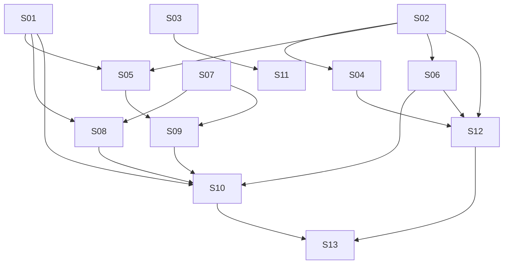

# M20 — Lead Form Hotsite Module

**Phase:** Local Development
**Goal:** Add a `LEAD_FORM` hotsite module that lets a manager configure up to 20 custom questions which guests and/or logged-in customers answer on a dedicated page — a genuine lead-capture tool (name/email/phone mandatory on every submission, protected by Cloudflare Turnstile + per-IP/per-tenant rate limits), reviewed on its own dashboard screen, retained for a tenant-configurable window (default 6 months, max 24).
**Depends on:** M12 (Hotsite Frontend — module rendering/manifest pattern), M13 (Dashboard Frontend — per-module config panel pattern, tenant settings form pattern), M19 (Hotsite Chatbot — direct precedent for the rate-limit-cap pattern, the tenant-settings deviation pattern, and the public/private BFF controller split this milestone reuses throughout)
**Blocks:** none yet
**Design rationale:** `docs/discovery/lead-form-module/lead-form-module.md` (promoted via `/discovery-to-milestone` on 2026-08-23) — kept as the permanent *why*; this file and the canonical docs it cites (`docs/04-USE_CASES.md` UC-037–UC-043, `docs/02-DOMAIN_MODEL.md`, `docs/03-DOMAIN_EVENTS.md`, `docs/05-BOUNDED_CONTEXTS.md`, `docs/13-DATABASE_SCHEMA.md`, `docs/14-API_CONTRACTS.md`, `docs/15-HOTSITE_DYNAMIC_ARCHITECTURE.md`, `docs/21-TENANTS_SETTINGS_SCHEMA.md` §8) are the source of truth for implementation — nothing below should require opening the discovery doc to understand.

**Non-Goals (explicitly deferred or dropped — not gaps in this plan):**
- **CSV export.** Removed from this milestone's scope entirely — not merely deferred behind a smaller replacement. The discovery's original CAND-06 was assessed during promotion (at current volume caps, max ~3,100 rows/tenant/month, a synchronous buffer-and-return export would fully satisfy the requirement with zero new infrastructure), but the decision made during this redesign pass is to not build even that for M20: a generic async report/export module (queued job, status tracking, GCS-backed file, a "my reports" screen) is a legitimate future initiative once a second real export need exists (bookings, loyalty, etc.) to design the abstraction against — not something to build speculatively for one low-volume consumer now. The Leads search added by S12/S13 (basic search, advanced AND-filters, date range) is the accepted MVP replacement for "find a lead," not a stand-in for bulk export. **Accepted risk, stated explicitly, not an oversight:** UC-043's daily retention purge is unconditional and permanent — a manager who wants to preserve a lead's data beyond its retention window has no path to do so today besides the read-only detail view, one submission at a time. This trade-off is knowingly accepted for M20 and should be revisited if real usage shows managers actually hitting it.
- **LGPD erasure-before-expiry.** Raised during discovery — a customer asking to have their submission erased before the retention window naturally expires has no path today. Explicitly deferred at the user's direction, not an oversight — worth a deliberate look before this ships broadly.
- **Per-submission email/webhook notification to the manager.** MVP is the dashboard list + read-only detail only. Obvious fast-follow, not built now — `LeadFormSubmissionReceived` is published specifically to make this easy later.
- **Manual edit or delete of an individual submission.** View only; the only deletion path is the retention cron (S04).
- **Plan-tier gating.** Available to every tenant, like every other hotsite module — confirmed explicitly during discovery.

---

## Build order

| Story | Theme |
|---|---|
| M20-S01 | `LeadFormConfig` aggregate + consolidated admin config endpoint + status endpoint |
| M20-S02 | `LeadFormSubmission` aggregate + submission use case + per-tenant rate-limit caps |
| M20-S03 | Tenant-settings `leadForm.{retentionMonths,maxSubmissionsPerDay,maxSubmissionsPerIpPerDay}` |
| M20-S04 | Retention-purge cron (UC-043) |
| M20-S05 | Public lead-form BFF endpoints + Cloudflare Turnstile |
| M20-S06 | Admin submissions read (list + detail) |
| M20-S07 | `LEAD_FORM` module type + teaser component + `page.tsx` registration (UC-038) |
| M20-S08 | Manager config panel — single atomic save (UC-037) |
| M20-S09 | Public `/[slug]/lead-form` page — guest + customer (UC-039, UC-040) |
| M20-S10 | Admin Leads list/detail + gated sidebar nav (UC-041) |
| M20-S11 | Tenant settings form — Lead Form section, all 3 fields (UC-042) |
| M20-S12 | Leads search — schema + backend + BFF (UC-041, added post-promotion 2026-08-23) |
| M20-S13 | Leads search — frontend UI (UC-041, added post-promotion 2026-08-23) |

**Wave 0:** none — purely additive schema (new tables only; `tenants.settings` gains a new JSONB category via the existing generic mechanism, no column/migration on `tenants` itself).
**Wave 1** (S01–S06, S12): backend domain + BFF, no risky backfill.
**Wave 2** (S07–S11, S13): frontend, each depending only on the specific Wave-1 story(ies) it actually reads/writes through.

**S12/S13 provenance:** added 2026-08-23, after the initial promotion/draft above, once a real replacement for the deferred CSV export (Non-Goals) was worked through — a manager needs *some* way to find a specific lead without export, and a search box is a small, self-contained addition (no new infrastructure, unlike the export module itself) rather than a reason to reconsider that deferral.

**Post-review redesign, 2026-08-24 (PM/UX/Engineer three-lens review of S01–S13 above):** four product/architecture decisions were revisited and are reflected throughout the stories below, not just noted here — (1) CSV export dropped entirely, not deferred (Non-Goals, above); (2) the "Leads" sidebar item is now gated on the module's `enabled` state (S01 gains a `GET .../lead-form/status` endpoint, S10 consumes it, new S01→S10 edge above); (3) the manager's config save collapses from two independent REST calls (teaser via `PATCH /v1/tenants/hotsite`, audience+questions via S01's own endpoint) into one atomic transaction across both aggregates, still exposed as a single `PATCH /v1/tenants/lead-form/config` call (S01, S08); (4) `maxSubmissionsPerDay`/`maxSubmissionsPerIpPerDay` stop being an Ikaro-only platform-wide constant (that pattern was copied from Chatbot's caps by surface resemblance, without the reasoning underneath — Chatbot's caps protect Ikaro's own LLM cost exposure, a real shared financial cost; Lead Form submissions cost Ikaro nothing per-row, so there's no equivalent justification for keeping them out of tenant control) and become normal per-tenant settings, editable via UC-042/S03/S11 like `retentionMonths` already was. The same review also found and fixed a real schema bug (S12's `lead_form_answers` FK needs `lead_form_submissions` to have a `UNIQUE (tenant_id, id)` it never had — added to S02) and a real cascading-delete bug (S04's retention purge will start throwing FK violations once S12's child table exists unless S04 is extended to delete child rows first — noted in S04, scoped into S12).

---

### M20-S01 — `LeadFormConfig` aggregate + consolidated admin config endpoint + status endpoint

**Agent:** `backend-ts`
**Complexity:** M
**Docs to load:** `docs/02-DOMAIN_MODEL.md` § Platform Context (`LeadFormConfig`, "Cross-aggregate save, one transaction"), `docs/13-DATABASE_SCHEMA.md` § `platform.lead_form_configs`, `docs/14-API_CONTRACTS.md` § Lead Form Admin Config + § Lead Form Status, `docs/04-USE_CASES.md` UC-037, UC-041 (Trigger — status endpoint consumer), `docs/AGENT_PATTERNS.md` Pattern #1 (port+adapter), `docs/24-BFF_ARCHITECTURE.md` § Module & Controller Naming Conventions

**Description:**
Create the `LeadFormConfig` aggregate in `apps/backend/src/contexts/platform/domain/lead-form-config.aggregate.ts` — one row per tenant, per `docs/02-DOMAIN_MODEL.md`'s exact field list (`tenantId`, `audienceMode: 'GUEST_AND_CUSTOMER' | 'CUSTOMER_ONLY'`, `questions: LeadFormQuestion[]`, `updatedAt`). `LeadFormQuestion` is a plain nested shape (`id`, `label`, `type: 'TEXT'|'SINGLE_CHOICE'|'MULTIPLE_CHOICE'`, `required`, `options?`, `order`), stored as a single JSONB column — never a child table (the whole array is always read/written atomically by one actor, same justification `hotsite_configs.layout` already uses).

`updateQuestions(questions)` validates the whole array on every call: ≤20 entries (`400 PLATFORM_LEAD_FORM_QUESTION_LIMIT_REACHED`), each non-empty `label` (`400 GENERIC_FIELD_REQUIRED`, `field: questions[n].label` — a plain required-string rule with no VO behind it), and every `SINGLE_CHOICE`/`MULTIPLE_CHOICE` question has 2-10 `options` (`400 PLATFORM_LEAD_FORM_QUESTION_OPTIONS_INVALID`). Add these three codes to `packages/types/src/error-codes.ts`'s `PlatformErrorCode` (following the exact `PLATFORM_HOTSITE_*`/`PLATFORM_CHATBOT_*` naming precedent already in that file) plus translation entries in both `packages/i18n/locales/pt-BR/errors.json` and `.../en/errors.json` — CI's exhaustiveness test fails otherwise.

**Backend-local module-type registration (scoped correction during implementation, 2026-08-24 — S01's own `PATCH` needs `'LEAD_FORM'` to already be a valid module type or it cannot write a `layout[]` entry for it):** add `'LEAD_FORM'` to the **backend-local** `apps/backend/src/contexts/platform/domain/hotsite-config.types.ts`'s own `HotsiteModuleType` type alias (a parallel mirror of `packages/types/src/enums.ts`'s union, not the same declaration — see that file's own header comment) and add a matching `LeadFormModuleData` interface there (mirrors that file's own `ChatbotModuleData`'s "mirrors packages/types" convention — `{ title: string; subtitle?: string; eyebrow?: string; ctaLabel: string; variant?: 'centered' | 'left-aligned'; backgroundImageUrl?: string | null; backgroundImagePosition?: 'left' | 'center' | 'right'; bgStyle?: 'primary' | 'background' }`), adding it to that file's own `HotsiteModuleData` union. Add `'LEAD_FORM'` to `hotsite-config.aggregate.ts`'s `MODULE_TYPES` Set — no entry needed in `MODULE_DATA_VALIDATORS`, since the teaser data carries no special business rule of its own (unlike `BOOKING_CTA`'s `carouselDays` check). **Deliberately does NOT touch `packages/types/src/enums.ts`'s shared `HotsiteModuleType`** — an earlier draft of this note moved that shared-package addition into S01 too, but that union is exhaustively consumed by several `apps/web` `Record<HotsiteModuleType, ...>` maps (the hotsite editor's lazy-loaded config-panel map, `module-schemas.ts`'s Zod-schema map) that don't have a real `LeadFormConfigPanel`/`LeadFormModuleDataSchema` yet — adding the member there breaks `apps/web`'s own type-check for code entirely outside S01's scope. The shared package addition + both web-side exhaustive maps stay S07's own atomic change, exactly as originally scoped (see S07 below, unchanged from its original text) — S01 and S07 each maintain their own independent copy of this type until S07 lands.

**A third, independent copy also needed fixing (found during PR review, 2026-08-24):** `packages/validation/src/hotsite.ts`'s `HotsiteModuleSchema.type` — the Zod schema backing the existing generic `PATCH /v1/tenants/hotsite` endpoint's `layout[]` validation (consumed by both `apps/backend`'s `update-hotsite-content.dto.ts` and `apps/bff`'s `hotsite-admin.schemas.ts`) — is its own separate enum literal list, also missing `'LEAD_FORM'`. Without it, the module's `enabled` toggle (explicitly designed to go through this same generic endpoint, not S01's own consolidated one) would be rejected with a 400 before ever reaching `HotsiteConfig.validateLayout()`. Verified via grep that this schema has zero `apps/web` consumers, so — unlike `packages/types/src/enums.ts` — adding it here is safe and squarely S01's own scope, not S07's.

**Layout-entry default/upsert (business-rule decision locked in during story-discovery, 2026-08-24):** `HotsiteConfig.layout[]` has no `LEAD_FORM` entry for any tenant until this endpoint's first successful `PATCH` — there is no server-side "materialize on read" mechanism (`materializeLayout()`, `apps/web/features/platform/hotsite/default-layout.ts`, is a web-only, client-side helper that never persists). `GET /v1/tenants/lead-form/config` returns `{ title: '', ctaLabel: '' }` for the teaser fields (every other optional field omitted) when no `LEAD_FORM` entry exists yet — mirrors `BOOKING_CTA`'s own minimal default, since `LeadFormModuleData` is the same shape family. `PATCH` upserts: if no entry exists, `UpdateLeadFormModuleUseCase` creates one (`enabled: false` — untouched by this endpoint, owned entirely by the Layout tab's own toggle) merging in whatever teaser fields the request body supplies; if one already exists, it's updated in place, preserving its current `enabled` value.

Repository: `ILeadFormConfigRepository` port (`application/ports/lead-form-config-repository.port.ts`) with `findByTenantId`/`save` (upsert semantics — one row per tenant), `TypeOrmLeadFormConfigRepository` adapter (`infrastructure/repositories/`), registered with `useClass` (never `useExisting`). Entity: `infrastructure/entities/lead-form-config.entity.ts`.

Migration: new timestamped file in `apps/backend/src/contexts/platform/infrastructure/migrations/` creating `platform.lead_form_configs` exactly per `docs/13-DATABASE_SCHEMA.md` (PK `tenant_id`, FK → `platform.tenants(id)`, `audience_mode` default `'GUEST_AND_CUSTOMER'`, `questions` JSONB default `'[]'`). Migration timestamps are global — verify the current highest across all contexts at implementation time, don't reuse a value from this doc.

**Consolidated save, one transaction (replaces an earlier two-call draft — see `docs/02-DOMAIN_MODEL.md` § `LeadFormConfig` "Cross-aggregate save"):** `PATCH /v1/tenants/lead-form/config` accepts teaser fields (`title`, `subtitle?`, `eyebrow?`, `ctaLabel`, `variant?`, `backgroundImageUrl?`, `backgroundImagePosition?`, `bgStyle?` — same shape every other module's teaser data uses) **together with** `audienceMode`/`questions` in a single request body. `UpdateLeadFormModuleUseCase` writes both `HotsiteConfig`'s `layout[]` entry for this module (teaser fields, via `IHotsiteConfigRepository`, already exists) and `LeadFormConfig` (`audienceMode`/`questions`, via this story's new repository) inside one `txManager.run()` block — a deliberate, scoped exception to "one aggregate per transaction," justified because both aggregates live in the same bounded context (Platform) and one real manager action needs them to save atomically; not a precedent for spanning transactions across contexts. The module's `enabled` flag stays **outside** this use case entirely — it's toggled inline on the hotsite editor's Layout tab via the existing generic `PATCH /v1/tenants/hotsite`, exactly like every other module's `enabled` flag, and is not part of this request body.

**New: `GET /v1/tenants/lead-form/status` — nav-gating endpoint (UC-041 Trigger):** `{ enabled: boolean }`, `STAFF`\|`MANAGER`, reads `HotsiteConfig`'s `layout[]` for this module's `enabled` flag (same source of truth `PATCH /v1/tenants/hotsite` already writes — this is a thin read, not a new state). Consumed server-side by S10's dashboard layout to decide whether the "Leads" sidebar item renders at all.

Backend controller: `infrastructure/controllers/lead-form.controller.ts` — `GET`/`PATCH /v1/tenants/lead-form/config` (`MANAGER`-only for both — this is config-editing surface, matching UC-037's actor, which is `MANAGER` only, no `STAFF` path), `GET /v1/tenants/lead-form/status` (`STAFF`\|`MANAGER` — a thin nav-gating read, not config access); wire into the existing single `PlatformModule` (`platform.module.ts`) — no new NestJS module, following the Chatbot precedent (no per-feature module split exists anywhere in `contexts/platform/`).

BFF: new `apps/bff/src/features/platform/lead-form.controller.ts` + `lead-form.schemas.ts` forwarding to the backend via `BackendHttpService`, matching the same guard split. This file also grows in S06 (submissions list/detail) — same feature, one controller file, per the "extract to a mapper once a second use needs it" convention rather than one controller per endpoint.

**Acceptance Criteria:**
- [ ] `LeadFormConfig.updateQuestions()` enforces all three bounds with the exact codes above; each has its own unit test including the boundary values (20 questions passes, 21 rejected; 2 options passes, 1 rejected; 10 passes, 11 rejected)
- [ ] `LeadFormConfig.updateQuestions()` also rejects two questions sharing the same client-assigned `id` (`400 PLATFORM_LEAD_FORM_QUESTION_DUPLICATE_ID`) — a defensive integrity check added post-review, 2026-08-24: the frontend assigns each question's `id` client-side (no per-question backend round-trip while editing a not-yet-saved question), and the `id` has no security/lookup significance downstream (`docs/13-DATABASE_SCHEMA.md`'s `lead_form_answers.question_id` is explicitly "informational; matching is by `question_label`, not this")
- [ ] `GET /v1/tenants/lead-form/config` returns a default `{ audienceMode: 'GUEST_AND_CUSTOMER', questions: [] }` shape for a tenant with no row yet (never a 404) — matches how other per-tenant-singleton config reads behave
- [ ] `PATCH /v1/tenants/lead-form/config` writes both `HotsiteConfig`'s layout entry and `LeadFormConfig` in the same DB transaction — an integration test proves a forced failure on the second write (e.g. an invalid `questions` array) leaves the first write's effect rolled back too, not half-applied; `STAFF` gets `403`
- [ ] `GET /v1/tenants/lead-form/status` returns `{ enabled: false }` for a tenant that has never enabled the module, and `{ enabled: true }` after the flag is set via `PATCH /v1/tenants/hotsite` — both roles (`STAFF`, `MANAGER`) can read it
- [ ] `'LEAD_FORM'` registered in the **backend-local** `HotsiteModuleType` (`hotsite-config.types.ts`), its `HotsiteModuleData` union, and `MODULE_TYPES` (`hotsite-config.aggregate.ts`) — a `HotsiteModule` literal with `type: 'LEAD_FORM'` type-checks and passes `validateLayout()` without throwing `HotsiteModuleTypeInvalidError`. Deliberately does NOT touch the shared `packages/types/src/enums.ts` copy — that stays S07's scope (see this story's own "Backend-local module-type registration" note above for why)
- [ ] `GET` returns `{ title: '', ctaLabel: '' }` for the teaser fields when a tenant's layout has no `LEAD_FORM` entry yet; `PATCH` creates the entry (`enabled: false`) on first save and updates it in place thereafter, preserving `enabled` — a test proves both paths
- [ ] Repository registered with `useClass`; a `LeadFormConfigBuilder` (class + `withXxx()`/`build()`) exists for tests
- [ ] Integration test proves a real DB round-trip, registered in `integration-global-setup.ts`
- [ ] `.http` request blocks: `apps/backend/http/platform/lead-form.http`, `apps/bff/http/platform/lead-form.http` (config + status)
- [ ] New error codes added to `error-codes.ts` + both locale files in this same commit
- [ ] Coverage ≥80% on changed code; `tsc --noEmit`, lint, full test suite green

**Dependencies:** None (parallel to S02, S03).
**New migration:** yes — `platform.lead_form_configs`.

---

### M20-S02 — `LeadFormSubmission` aggregate + submission use case + rate-limit caps ✅ Done

**Agent:** `backend-ts`
**Complexity:** L
**Docs to load:** `docs/02-DOMAIN_MODEL.md` § Platform Context (`LeadFormSubmission`), `docs/13-DATABASE_SCHEMA.md` § `platform.lead_form_submissions`, `docs/03-DOMAIN_EVENTS.md` § `LeadFormSubmissionReceived`, `td/TD24-OUTBOX-INBOX-PATTERN.md`, `docs/ENGINEERING_RULES.md` (VO `create()`/`reconstitute()` convention), `docs/21-TENANTS_SETTINGS_SCHEMA.md` § 8 (Lead Form Settings — this story adds the minimal typed stub S03 later formalizes, see below), the real precedent: `apps/backend/src/contexts/platform/application/use-cases/chatbot-session-resolution.helpers.ts`'s `checkNewSessionVolumeCaps()`

**Description:**
Create the `LeadFormSubmission` aggregate (`domain/lead-form-submission.aggregate.ts`) per `docs/02-DOMAIN_MODEL.md`'s exact field list: `id` (UUID v7 — bare `id`, matching the real, universal codebase convention every aggregate root actually uses — `Booking`, `ChatbotSession`, `ChatbotMessage`, `NotificationLog`, `NotificationTemplate` all use bare `id`. An earlier draft of this story instead specified `submissionId`, citing `ChatbotSession.sessionId`/`ChatbotMessage.messageId` as the precedent — verified directly against both aggregates' actual code, that precedent doesn't exist: both use bare `id` too. `docs/02-DOMAIN_MODEL.md`'s own `sessionId`/`messageId` listing for those two aggregates is itself stale relative to the shipped code — unrelated, pre-existing drift, out of scope to fix here. `docs/13-DATABASE_SCHEMA.md`'s `lead_form_submissions.id` column was already correctly named `id`, matching this resolution.), `tenantId`, `customerId: UUID | null`, `name`, `email: Email`, `phone: PhoneNumber`, `answers: LeadFormAnswer[]` (full snapshot — `{questionId, questionLabel, questionType, answerValue}`, never a live lookup), `submittedAt`, `expiresAt`, `ipAddress`. The `submissionId` name lives only at the event-payload/API-response DTO boundary (below, and `docs/03-DOMAIN_EVENTS.md`/`docs/14-API_CONTRACTS.md`) — mapped from `aggregate.id` at construction time, a one-line rename, not a second internal property.

**Root-cause fix, in scope for this story:** `PhoneNumber` (`apps/backend/src/shared/value-objects/phone-number.vo.ts`) currently has `create()` but no `reconstitute()` — a real gap versus this codebase's own stated convention (`create()` validates, `reconstitute()` skips validation for DB-loaded values). Add `PhoneNumber.reconstitute()`, mirroring `Email`'s existing shape exactly. Use it in this story's own `TypeOrmLeadFormSubmissionRepository` mapper. Do **not** touch the existing `PhoneNumber.create()` call-sites in `typeorm-customer.repository.ts`/`typeorm-booking.mapper.ts` — that's pre-existing drift outside this story's scope, not something to opportunistically refactor here.

`LeadFormSubmission.create()`: validates `name` (`GENERIC_FIELD_REQUIRED`), `email`/`phone` via their VOs (reuses `EmailErrorCode.FORMAT_INVALID`/`PhoneErrorCode.FORMAT_INVALID` — never a bespoke code for the identical rule), snapshots each answer, computes `expiresAt` from the tenant's *current* `retentionMonths` (read via the existing tenant-settings port) at insert time only — never recomputed later. Publishes `LeadFormSubmissionReceived` (`{submissionId, customerId}` in `data` — `submissionId` sourced from the aggregate's own `id`).

**Rate-limit enforcement — mirrors Chatbot's pattern mechanically, but the caps themselves are a normal per-tenant setting, not an Ikaro-only constant (see UC-042/S03/S11 — corrected during the post-review redesign; the original draft copied Chatbot's platform-wide-override pattern by surface resemblance, but Chatbot's caps exist to protect Ikaro's own LLM cost exposure, a real shared financial risk this feature has no equivalent of — a Lead Form submission costs Ikaro nothing per-row, so there's no reason to keep the cap out of tenant control):** before creating the row, `CreateLeadFormSubmissionUseCase` checks `maxSubmissionsPerDay`/`maxSubmissionsPerIpPerDay` (resolved `tenant.settings.leadForm?.X ?? DEFAULT_X` — the `?? DEFAULT_X` fallback exists for tenants provisioned before S03 backfilled these fields, not because the value is meant to stay fixed). **Since S03 (which formally owns this settings category) isn't a hard dependency of this story and may not have landed yet, this story also adds the minimal `LeadFormSettings` interface (`{ retentionMonths?: number; maxSubmissionsPerDay?: number; maxSubmissionsPerIpPerDay?: number }`) plus an optional `leadForm?: LeadFormSettings` field to `apps/backend/src/shared/value-objects/tenant-settings-data.ts` itself — just enough for this optional-chained read to type-check standalone. S03, whenever it runs, finds the field already declared and layers the validator, DTO wiring, and `TenantSettings.default()` entry on top (all three fields becoming required there, per S03's own scope) — expected sequential handoff between two stories touching the same shared file, not a conflict.** This check is done via two repository count queries — `countByTenantAndDate(tenantId, date)` against the `(tenant_id, submitted_at DESC)` index, `countByTenantIpAndDate(tenantId, ip, date)` against the `(tenant_id, ip_address, submitted_at)` index — throwing **one** typed error, `LeadFormDailyCapReachedError` / `PLATFORM_LEAD_FORM_DAILY_CAP_REACHED`, for either layer (matches `CHATBOT_DAILY_CAP_REACHED` covering both its own layers — the same "come back tomorrow" outcome from the submitter's perspective). This check lives in the **backend**, never the BFF. A manager who wants a higher `maxSubmissionsPerIpPerDay` (e.g. a tenant with heavy CGNAT-shared mobile traffic falsely tripping the per-IP cap) raises it themselves via UC-042 — no support ticket to Ikaro needed.

**Outbox wiring — this is a 4th aggregate joining the transactional-outbox pattern, not automatic.** Only `Booking`/`Staff`/`Tenant` repositories currently drain `clearDomainEvents()` into `shared.outbox` inside the same transaction as the write (TD24-S02). Wire `TypeOrmLeadFormSubmissionRepository.save()` into the identical pattern — grep `TypeOrmTenantRepository`'s own `save()` for the exact mechanism to copy, don't reinvent it.

Migration: `platform.lead_form_submissions` exactly per `docs/13-DATABASE_SCHEMA.md` — all three indexes (`(tenant_id, submitted_at DESC)`, `(tenant_id, ip_address, submitted_at)`, `(tenant_id, expires_at)`), **plus `UNIQUE (tenant_id, id)`** (added during the post-review redesign — a real bug found by engineering review: S12's `lead_form_answers` child table needs a composite FK back to `(tenant_id, id)` on this table, and Postgres requires a `UNIQUE` constraint/index on exactly the referenced columns for that FK to even be creatable; without it, S12's migration as originally drafted could not have been applied). Same migration-timestamp discipline as S01 (verify current highest at implementation time; if S01 hasn't landed yet, coordinate the two timestamps so neither collides).

No HTTP surface in this story — `CreateLeadFormSubmissionUseCase` is consumed by S05 (public submit endpoint); read use cases are S06's own scope, not this one's.

**Acceptance Criteria:**
- [ ] `PhoneNumber.reconstitute()` added, mirrors `Email.reconstitute()`'s exact shape; unit test proves it skips validation the way `create()` doesn't
- [ ] `LeadFormSubmission.create()` validates name/email/phone with the exact codes above, snapshots answers, computes `expiresAt` from the tenant's settings at call time (a unit test proves changing `retentionMonths` between two calls produces two different `expiresAt` values, each correct for its own call)
- [ ] `countByTenantAndDate`/`countByTenantIpAndDate` both implemented and both actually used by the use case *before* the row is created — a test proves the row is never created when either cap is already at its limit
- [ ] Both count queries are correctly tenant-scoped — a fixture with Tenant A and Tenant B each at their own per-day (and per-IP) cap independently proves Tenant B's submissions never count against Tenant A's cap, and vice versa (CLAUDE.md §2 invariant 2)
- [ ] One `LeadFormDailyCapReachedError` covers both layers — no second code invented
- [ ] `LeadFormSubmission`'s repository actually drains into `shared.outbox` in the same transaction as the insert — an integration test proves a row lands in `shared.outbox` after `save()`, in the same DB transaction (rollback the outer transaction → outbox row also gone)
- [ ] Migration creates `UNIQUE (tenant_id, id)` on `lead_form_submissions` (verify with a real constraint-creation test, not just a code-review read — this is the FK target S12's `lead_form_answers` table needs later)
- [ ] New `LeadFormSubmissionEntity` registered in `apps/backend/src/test/integration-global-setup.ts` in the same commit — missing registration causes silent integration-test failures (`docs/DEFINITION_OF_DONE.md`)
- [ ] Repository registered with `useClass`; a `LeadFormSubmissionBuilder` exists for tests
- [ ] Coverage ≥80% on changed code; `tsc --noEmit`, lint, full test suite green

**Dependencies:** None (parallel to S01, S03).
**New migration:** yes — `platform.lead_form_submissions`.
**New error code:** `PLATFORM_LEAD_FORM_DAILY_CAP_REACHED` (+ both locale files).

---

### M20-S03 — Tenant-settings `leadForm.{retentionMonths,maxSubmissionsPerDay,maxSubmissionsPerIpPerDay}` ✅ Done

**Agent:** `backend-ts`
**Complexity:** S
**Docs to load:** `docs/21-TENANTS_SETTINGS_SCHEMA.md` § 8 (Lead Form Settings), `docs/14-API_CONTRACTS.md` § Tenant Settings (leadForm addition), the real precedent: `apps/backend/src/contexts/platform/domain/value-objects/validators/booking-settings.validator.ts`

**Description:**
Add `LeadFormSettingsValidator` (`domain/value-objects/validators/lead-form-settings.validator.ts`), mirroring `BookingSettingsValidator`'s exact shape — one static `validate()` method, **three** dedicated codes, one per field: `retentionMonths` integer 1-24 (`400 PLATFORM_SETTINGS_LEAD_FORM_RETENTION_MONTHS_INVALID`), `maxSubmissionsPerDay` integer 1-1000 (`400 PLATFORM_SETTINGS_LEAD_FORM_MAX_SUBMISSIONS_PER_DAY_INVALID`), `maxSubmissionsPerIpPerDay` integer 1-100 (`400 PLATFORM_SETTINGS_LEAD_FORM_MAX_SUBMISSIONS_PER_IP_PER_DAY_INVALID`). Add `LeadFormSettings` interface (`{ retentionMonths: number; maxSubmissionsPerDay: number; maxSubmissionsPerIpPerDay: number }`, all required — not `?`, unlike the earlier Ikaro-only-override draft) to `apps/backend/src/shared/value-objects/tenant-settings-data.ts`, alongside the existing category interfaces.

**All three fields are normal, tenant-editable settings — not a chatbot-style Ikaro-only deviation.** Extend `update-tenant-settings.dto.ts` and `UpdateTenantSettingsUseCase` with the `leadForm` category accepting all three fields (any subset, partial update — same shape every other settings category already supports). Extend the BFF's `UpdateTenantSettingsBodySchema` (`apps/bff/src/features/platform/tenant-settings.schemas.ts`) with the same three-field addition. Add `leadForm: { retentionMonths: 6, maxSubmissionsPerDay: 100, maxSubmissionsPerIpPerDay: 3 }` to `TenantSettings.default()` (`apps/backend/src/contexts/platform/domain/value-objects/tenant-settings.vo.ts`), alongside the existing `chatbot: DEFAULT_CHATBOT_SETTINGS` (imported from `tenant-settings-defaults.ts` — add a matching `DEFAULT_LEAD_FORM_SETTINGS` there) — this factory is what `Tenant.create()` calls, invoked by `ProvisionTenantUseCase` at tenant creation. S02's `CreateLeadFormSubmissionUseCase` still reads `tenant.settings.leadForm?.X ?? DEFAULT_X` as a defensive fallback for tenants provisioned before this story shipped, not because the value is meant to stay fixed thereafter.

No new endpoint — this extends the existing `PATCH`/`GET /v1/tenants/settings`.

**Acceptance Criteria:**
- [ ] `LeadFormSettingsValidator` rejects each field's out-of-bounds values (0 and 25 for `retentionMonths`; 0 and 1001 for `maxSubmissionsPerDay`; 0 and 101 for `maxSubmissionsPerIpPerDay`) and accepts each field's boundary values (1 and 24; 1 and 1000; 1 and 100)
- [ ] `PATCH /v1/tenants/settings` with any single one of the three fields (partial update) saves correctly without requiring the other two
  - ⚠️ Out-of-range request-boundary values still map to generic `VALUE_OUT_OF_RANGE` instead of field-specific lead-form error codes — tracked in M20-S04, 2026-08-24.
- [ ] A newly-provisioned tenant's row has `settings.leadForm === { retentionMonths: 6, maxSubmissionsPerDay: 100, maxSubmissionsPerIpPerDay: 3 }`
- [ ] `GET /v1/tenants/settings` includes all three `leadForm` fields in its response shape
- [ ] Coverage ≥80% on changed code; `tsc --noEmit`, lint, full test suite green

**Dependencies:** None (parallel to S01, S02).
**New error codes:** `PLATFORM_SETTINGS_LEAD_FORM_RETENTION_MONTHS_INVALID`, `PLATFORM_SETTINGS_LEAD_FORM_MAX_SUBMISSIONS_PER_DAY_INVALID`, `PLATFORM_SETTINGS_LEAD_FORM_MAX_SUBMISSIONS_PER_IP_PER_DAY_INVALID` (+ both locale files, all three).

---

### M20-S04 — Retention-purge cron (UC-043)

**Agent:** `backend-ts`
**Complexity:** S
**Docs to load:** `docs/04-USE_CASES.md` UC-043, `docs/14-API_CONTRACTS.md` § `POST /cron/lead-form-retention`, the real precedent: `apps/backend/src/contexts/platform/application/jobs/chatbot-retention-purge.job.ts` + `apps/backend/src/contexts/platform/infrastructure/controllers/cron-chatbot.controller.ts`

**Description:**
Create `LeadFormRetentionPurgeJob` (`application/jobs/lead-form-retention-purge.job.ts`), mirroring `ChatbotRetentionPurgeJob`'s shape exactly: `run(now: Date = new Date())` deletes every `platform.lead_form_submissions` row where `expires_at < now`, using the `(tenant_id, expires_at)` index — cross-tenant scan, no per-tenant loop needed (matches how `ExpirePointsJob`/`ChatbotRetentionPurgeJob` both already work). No-op, idempotent when nothing is expired.

**Carry-over from M20-S03:** While extending the tenant-settings validation coverage for this story, ensure out-of-range `leadForm` values sent through `PATCH /v1/tenants/settings` preserve the documented field-specific error codes (`PLATFORM_SETTINGS_LEAD_FORM_*_INVALID`) instead of the generic `VALUE_OUT_OF_RANGE` produced by native shared-schema range checks.

**Forward-looking coupling note (no action needed in this story — S12 lands after this one and depends on it):** S12 introduces a `platform.lead_form_answers` child table FK'd to this table with no `ON DELETE CASCADE` (deliberately, matching this same job's own no-cascade precedent). Once S12 merges, **this job must be extended** (in S12's own scope, not retroactively here) to delete the corresponding `lead_form_answers` rows before (or atomically with) deleting their parent `lead_form_submissions` rows — otherwise every purge run after S12 lands will throw FK-violation errors on the first expired row that still has child answers. This story ships correctly on its own; the gap only exists once S12's table exists, and S12 is responsible for closing it.

Create `CronLeadFormController` (`infrastructure/controllers/cron-lead-form.controller.ts`) — `POST /cron/lead-form-retention`, `InternalApiGuard`-protected, `X-Internal-Key` header, publishes the `CRON_LEAD_FORM_RETENTION_TRIGGER` name (add to `cron-trigger-names.constants.ts` alongside the existing trigger names) and returns `{ ok: true }` once published, not once the job finishes — same convention as every other cron endpoint.

Terraform: add `google_cloud_scheduler_job.lead_form_retention` to `infra/terraform/modules/scheduler/main.tf`, `schedule = "0 3 * * *"` (matches `chatbot_retention_purge`'s own slot — same "delete expired rows" job shape, not `loyalty-expiry`'s different `0 2 * * *` slot). The Pub/Sub topic itself is **not** hand-added: `infra/terraform/pubsub-catalog.json` is auto-generated by `pnpm --filter @ikaro/infra-scripts run pubsub-catalog` (scans `registerTrigger()`/`subscribe()` call sites) and CI fails on drift — the `cron-lead-form-retention` entry appears automatically once `CRON_LEAD_FORM_RETENTION_TRIGGER` is registered in code; Terraform's `pubsub` module then prefixes it to `ikaro-cron-lead-form-retention`. Run the catalog-generation script and commit its output as part of this story, don't hand-edit the JSON.

**Acceptance Criteria:**
- [ ] Job deletes exactly the expired rows, across every tenant, in one pass; a fixture with rows both before and after the cutoff proves only the expired ones are removed
- [ ] Job is a genuine no-op (no error, no side effect) when nothing is expired
- [ ] Lead-form tenant-settings range failures return the documented field-specific error codes at the request boundary, with regression coverage for all three fields
- [ ] `POST /cron/lead-form-retention` requires `X-Internal-Key`; missing/wrong key → `401`/`403`
- [ ] `.http` block for the cron endpoint
- [ ] Terraform `terraform plan` clean against the modified `scheduler` module (live-verification gate — this story touches Pub/Sub + Cloud Scheduler, per CLAUDE.md §7's cross-layer deployment invariants)
- [ ] Coverage ≥80% on changed code; `tsc --noEmit`, lint, full test suite green

**Dependencies:** S02 (needs `platform.lead_form_submissions` to exist).
**New env var:** none. **New Pub/Sub topic:** `ikaro-cron-lead-form-retention` (auto-generated into `pubsub-catalog.json` from the code-registered trigger — not hand-added).

---

### M20-S05 — Public lead-form BFF endpoints + Cloudflare Turnstile

**Agent:** `bff-ts`
**Complexity:** M
**Docs to load:** `docs/14-API_CONTRACTS.md` § Lead Form Widget (Public), `docs/24-BFF_ARCHITECTURE.md` § Web → BFF Transport Layer + Module & Controller Naming Conventions, `td/TD08-AUDIT-REMEDIATION-BACKLOG.md` AUD-040, `docs/22-TECH_STACK_DECISIONS.md`, `apps/web/shared/lib/runtime-env/public-env.ts`, `td/TD29-WEB-RUNTIME-PUBLIC-CONFIG.md`

**Description:**
Extend the existing `apps/bff/src/features/platform/platform.public.controller.ts` (already serves `GET /public/platform/manifest/:slug`, `GET /public/platform/chatbot/status`, etc. — extend this file, never create a second public controller for the same feature area) with:
- `GET /public/platform/lead-form/:slug` — `X-Tenant-Slug` header, forwards to the backend's `GET` (a to-be-added public-read variant, or S01's existing endpoint via an internal actor context — confirm the exact backend call shape against `platform.public.controller.ts`'s existing manifest-fetch pattern at implementation time), returns `{ audienceMode, questions }`. `404` if the tenant slug doesn't resolve or the `LEAD_FORM` module isn't `enabled` in the tenant's hotsite layout.
- `POST /public/platform/lead-form/:slug/submissions` — verifies `turnstileToken` via Cloudflare's `siteverify` API (`https://challenges.cloudflare.com/turnstile/v0/siteverify`) **before** forwarding anything to the backend; on verification failure, `400` (folded into the same bucket as other validation failures, matching the Chatbot Widget section's single-grouped-bullet-per-status convention — never a second, separate `400` bullet for the same status). On success, forwards `{ name, email, phone, answers, ipAddress (from request) }` to the backend's `CreateLeadFormSubmissionUseCase` via S02. Maps the backend's `LeadFormDailyCapReachedError` to `429`.

**First Cloudflare Turnstile integration in this codebase** — no prior pattern to copy. New env vars: `TURNSTILE_SECRET_KEY` (BFF-only, server-side `siteverify` call) and `NEXT_PUBLIC_TURNSTILE_SITE_KEY`. The site key is **not** a raw build-time `NEXT_PUBLIC_*` read — this repo's real convention (confirmed during discovery promotion, contradicting the original discovery doc's assumption) is `apps/web/shared/lib/runtime-env/public-env.ts`'s `PUBLIC_ENV_KEYS` allowlist, runtime-injected via `PublicEnvScript.tsx` and read through `getPublicEnv()`, because a build artifact is shared across environments and a baked-in value would go stale. Add `NEXT_PUBLIC_TURNSTILE_SITE_KEY` to `PUBLIC_ENV_KEYS` in this story.

Also close `TD08` AUD-040 in spirit (not formally, since AUD-040 targets guest booking specifically) — this is the first real Turnstile wiring, meant to be reused for guest booking's own CAPTCHA gap later, not duplicated.

**Turnstile test-key strategy (for this story's own tests and for S09/S10's E2E specs downstream):** Cloudflare publishes dedicated, permanently-valid dummy keys for automated testing — a sitekey that always renders a visible, always-passing challenge (`1x00000000000000000000AA`) and a matching secret that always returns `success: true` from `siteverify` (`1x0000000000000000000000000000000AA`), plus an always-fail pair for the negative case (`2x00000000000000000000AB` sitekey / `2x0000000000000000000000000000000AA` secret). Use the always-pass pair for `TURNSTILE_SECRET_KEY`/`NEXT_PUBLIC_TURNSTILE_SITE_KEY` in test/CI environments (never a real site's production keys in CI) and the always-fail secret for this story's own "verification failure" unit test — no live network call to Cloudflare needed in either case, `siteverify` itself is Cloudflare's real endpoint but these dummy tokens are documented to work against it directly.

**Acceptance Criteria:**
- [ ] `GET .../lead-form/:slug` returns the correct shape; `404` for a nonexistent slug or a disabled/absent `LEAD_FORM` module
- [ ] `POST .../submissions` calls `siteverify` before any backend call — a test proves the backend use case is never invoked when Turnstile verification fails (using Cloudflare's always-fail test secret, not a mocked HTTP response)
- [ ] `429` mapping for `LeadFormDailyCapReachedError` is correct and distinct from Turnstile's `400`
- [ ] `NEXT_PUBLIC_TURNSTILE_SITE_KEY` added to `PUBLIC_ENV_KEYS`, read via `getPublicEnv()` — never a direct `process.env.NEXT_PUBLIC_TURNSTILE_SITE_KEY` reference in client code
- [ ] `.http` blocks for both endpoints
- [ ] Coverage ≥80% on changed code; `tsc --noEmit`, lint, full test suite green

**Dependencies:** S01 (config read), S02 (submission use case).
**New env vars:** `TURNSTILE_SECRET_KEY` (backend/BFF secret), `NEXT_PUBLIC_TURNSTILE_SITE_KEY` (public).

---

### M20-S06 — Admin submissions read (list + detail)

**Agent:** `backend-ts`
**Complexity:** S
**Docs to load:** `docs/14-API_CONTRACTS.md` § Leads Submissions (Admin), `docs/04-USE_CASES.md` UC-041

**Description:**
Backend: `ListLeadFormSubmissionsUseCase` (paginated, `ORDER BY submitted_at DESC`, using the `(tenant_id, submitted_at DESC)` index) and `GetLeadFormSubmissionUseCase` (`404` if the ID doesn't belong to this tenant), both added to S01's `lead-form.controller.ts` — `GET /v1/tenants/lead-form/submissions?page=&pageSize=` and `GET .../submissions/:id`, `STAFF`\|`MANAGER`.

BFF: same two endpoints added to S01's `lead-form.controller.ts` (BFF side), `STAFF`\|`MANAGER` guard.

**Acceptance Criteria:**
- [ ] List is correctly paginated and ordered; a fixture with >1 page proves `page`/`pageSize`/`total` are all correct
- [ ] Detail returns the full `answers` array with `questionLabel`/`questionType`/`answerValue` from the submission's own snapshot — a test proves this renders correctly even after the *config's* question catalog has since changed (no live lookup against `lead_form_configs`)
- [ ] `STAFF` can read both endpoints (not `403`) — this is a read, not a config edit
- [ ] `.http` blocks for both endpoints
- [ ] Coverage ≥80% on changed code; `tsc --noEmit`, lint, full test suite green

**Dependencies:** S02 (needs `LeadFormSubmission` + its repository).

---

### M20-S07 — `LEAD_FORM` module type + teaser component + `page.tsx` registration (UC-038) ✅ Done

**Agent:** `frontend-ts`
**Complexity:** S
**Docs to load:** `docs/15-HOTSITE_DYNAMIC_ARCHITECTURE.md` § 3 (Module Library), § LEAD_FORM, § 7 (Adding a New Module checklist), `docs/04-USE_CASES.md` UC-038
**Prototype reference:** `plan/journey/guest/prototypes/lead-form/` (teaser shown in context on `plan/journey/shared/hotsite.html`)

**Description:**
Follow `docs/15-HOTSITE_DYNAMIC_ARCHITECTURE.md` § 7's checklist exactly, for the 10th module type:
1. `packages/types/src/enums.ts` — add `'LEAD_FORM'` to `HotsiteModuleType` (the **shared** package copy — S01 added only a backend-local mirror to `apps/backend/.../hotsite-config.types.ts`, deliberately not this file, since adding it here forces every `apps/web` `Record<HotsiteModuleType, ...>` map to gain a real entry in the same change — see S01's own note on this). `packages/types/src/hotsite.ts` — add `LeadFormModuleData` (`title`, `subtitle?`, `eyebrow?`, `ctaLabel`, `variant?`, `backgroundImageUrl?`, `backgroundImagePosition?`, `bgStyle?` — same shape family as `BookingCtaModuleData`, deliberately excluding `audienceMode`/`questions`, which live behind S01's own endpoints, not the cached manifest; must match S01's backend-local interface shape exactly).
2. `apps/web/shells/hotsite/components/LeadFormModule.tsx` — server component, mirrors `BookingCtaModule.tsx` exactly (title/subtitle/CTA linking to `/[slug]/lead-form`, `var(--ba-*)` only, `mx-auto max-w-7xl` content-width convention).
3. `apps/web/features/platform/hotsite/module-schemas.ts` — add `LeadFormModuleDataSchema`, register in `MODULE_DATA_SCHEMAS`.
4. `apps/web/app/[slug]/page.tsx` — add the `else if (parsed.type === 'LEAD_FORM')` branch to the existing if/else-if chain.
5. (Admin config form is S08's scope, not this story's.)
6. `default-layout.ts` — add `'LEAD_FORM'` to `MODULE_ORDER`. For `DEFAULT_MODULE_DATA`, mirror `'BOOKING_CTA'`'s entry (`{ title: '', ctaLabel: '' }`), **not** `'CHATBOT'`'s (`{}`) — `LeadFormModuleData` has two required fields (`title`, `ctaLabel`), same as `BookingCtaModuleData`, unlike `ChatbotModuleData` where every field is optional; `{}` would fail `LeadFormModuleDataSchema` validation. Without this step, the Layout tab never materializes a row for it.
7. `docs/15-HOTSITE_DYNAMIC_ARCHITECTURE.md` is already updated (Phase A of this milestone's own promotion) — no further doc edit needed here.

**Backend HTTP surface:** none new — the teaser renders purely from the existing cached manifest (`GET /public/platform/manifest/:slug`, already returns `layout[]` including this module's `data`); no live call from `LeadFormModule.tsx` itself.

**Acceptance Criteria:**
- [ ] `LeadFormModule.tsx` renders correctly with `enabled: true`/`false` (module list filtering already works generically via `buildHotsiteModuleRenderPlan`)
- [ ] `isValidModuleData('LEAD_FORM', data)` correctly validates/rejects per the new Zod schema
- [ ] A newly-provisioned tenant's manifest can include a `LEAD_FORM` module row without the Manifesto tab rejecting it
- [ ] Component + Vitest unit test + React Testing Library test (`jsdom`)
- [ ] Localization-ready — no hardcoded copy beyond what's genuinely tenant-authored (title/subtitle/CTA are tenant content, not UI chrome, so no `useTranslations()` needed for those specifically — confirm against `BookingCtaModule.tsx`'s own precedent)
- [ ] `plan/journey/guest/submit-lead-form.md`'s "Pages referenced" table — the "Hotsite teaser section" row's Story column set to `M20-S07` and Status flipped from `❌ Gap` to `✅ Done`, in the same commit that ships `LeadFormModule.tsx`
- [ ] Coverage ≥80% on changed code; `tsc --noEmit`, lint, full test suite green

**Dependencies:** None (frontend-only, no backend read needed for the teaser).

---

### M20-S08 — Manager config panel — single atomic save (UC-037)

**Agent:** `frontend-ts`
**Complexity:** M
**Docs to load:** `docs/04-USE_CASES.md` UC-037, `docs/14-API_CONTRACTS.md` § Lead Form Admin Config, `docs/16-DASHBOARD_FRONTEND_ARCHITECTURE.md`
**Prototype reference:** `plan/journey/manager/prototypes/lead-form/` (`01-config.html`, `01b-config-max-questions.html`, `01c-config-validation-error.html`)

**Description:**
`apps/web/features/platform/components/hotsite/modules/LeadFormConfigPanel.tsx` — same `ModuleConfigPanelProps` contract every other module panel (Hero, Chatbot, ...) already implements. Clicking "Aplicar" fires **one** request: S01's consolidated `PATCH /v1/tenants/lead-form/config`, carrying teaser fields (title/subtitle/ctaLabel/variant/bgStyle) **and** `audienceMode`/`questions[]` together in a single body, saved atomically in one backend transaction (see `docs/02-DOMAIN_MODEL.md` § `LeadFormConfig` "Cross-aggregate save"). This is not client-side orchestration of two calls — an earlier draft of this panel made two independent, unsynchronized REST calls (teaser via `PATCH /v1/tenants/hotsite`, audience/questions via S01's endpoint), which could leave the manager's edit half-applied on a partial failure; that design was replaced before implementation. The module's `enabled` toggle is a separate, pre-existing control (the same inline toggle every other module's Layout-tab row already has) that still goes through `PATCH /v1/tenants/hotsite` on its own — it's not part of this panel's "Aplicar" action.

Inline question builder: expandable `
` cards, add/edit/remove entirely on the same page (no per-question navigation), per the prototype exactly — including the 20-question-cap disabled state and the per-question options-count validation error, both already fully designed in `01b`/`01c`.

New route: `apps/web/app/dashboard/hotsite/lead-form/page.tsx`, reached from the hotsite editor's Layout tab (already updated in the prototype; the real `HotsiteEditor`'s Layout tab component needs the equivalent real-code row — grep the component `01-hotsite-editor.html`'s real counterpart maps to).

**Backend HTTP surface:** none new — reuses S01's consolidated `GET`/`PATCH /v1/tenants/lead-form/config` and the existing `PATCH /v1/tenants/hotsite` (only for the separate `enabled` toggle).

**Acceptance Criteria:**
- [ ] Manager can set `audienceMode`, edit teaser fields, and add/edit/remove up to 20 questions, then save all of it with one "Aplicar" click — one network request, not two
- [ ] The `enabled` toggle saves independently of "Aplicar" and does not require the rest of the form to be valid
- [ ] 20-question cap disables "Adicionar pergunta" with the inline explainer from the prototype
- [ ] A choice-type question with <2 or >10 options blocks save with the inline error from the prototype, expanded `
` card, every other question shown normally
- [ ] Removing a question that already has submissions shows the confirmation dialog explaining the snapshot behavior — test fixture seeds a real submission (via the shared `LeadFormSubmissionBuilder` from S02, referencing the question being removed) so this is a genuine behavioral assertion, not just a static render of the dialog copy
- [ ] Every visible string localized (`useTranslations()`, both `pt-BR` and `en` keys added in this commit)
- [ ] Component + Vitest unit test + React Testing Library test
- [ ] Coverage ≥80% on changed code; `tsc --noEmit`, lint, full test suite green

**Dependencies:** S01 (consolidated config endpoint), S07 (module type registration this panel's props depend on).

---

### M20-S09 — Public `/[slug]/lead-form` page — guest + customer (UC-039, UC-040)

**Agent:** `frontend-ts`
**Complexity:** L
**Docs to load:** `docs/04-USE_CASES.md` UC-039, UC-040, `docs/14-API_CONTRACTS.md` § Lead Form Widget (Public)
**Prototype reference:** `plan/journey/guest/prototypes/lead-form/` (`01-form.html` + all lettered variants) + `plan/journey/customer/prototypes/lead-form/` (`01-form-prefilled.html`)

**Description:**
`apps/web/app/[slug]/lead-form/page.tsx` — one shared page/component for both guest and authenticated-customer, matching the prototype's own explicit design (not two components). Server-side: resolves the manifest's `layout` array for a `LEAD_FORM` module with `enabled: true`, rendering the existing `<Unavailable/>` component when absent/disabled — **new logic**, since no prior hotsite module had a dedicated page checking its own `enabled` flag this way (the closest analog, `/[slug]/booking`, only checks `manifest.isPublished`). If the request is authenticated, also resolves `GET /customers/me` server-side to pre-fill name/email/phone (visible, editable autofill).

Client-side: fetches the question catalog via S05's `GET`, renders name/email/phone + up to 20 questions, mounts the Turnstile widget (`NEXT_PUBLIC_TURNSTILE_SITE_KEY` via `getPublicEnv()`), submits via S05's `POST`. States: `idle → loading → filled → submitting → validation-error / captcha-error / rate-limited / success`, matching the prototype's dev-notes.md exactly. This page's manifest lookup needs the `LEAD_FORM` module type/schema S07 registers — read that story's `docs/15-HOTSITE_DYNAMIC_ARCHITECTURE.md` § 7 checklist entries before starting this one.

**Turnstile in E2E:** this story's Playwright spec uses Cloudflare's always-pass test sitekey (`NEXT_PUBLIC_TURNSTILE_SITE_KEY` pointed at `1x00000000000000000000AA` in the E2E env) — see S05's "Turnstile test-key strategy" note for the full pair. Do not attempt to mock or stub the Turnstile widget itself; the real widget script runs against the real dummy sitekey and always renders a passable challenge.

**`CUSTOMER_ONLY` + unauthenticated branch (UC-040 A1):** redirect to a login-required gate screen (new component, per the prototype's `01g-login-required.html`) linking into the existing customer login flow; after login, the customer returns to this same page, which then resolves as the prefilled path.

**Backend HTTP surface:** none new — reuses S05's `GET`/`POST /public/platform/lead-form/:slug[/submissions]` and the existing `GET /customers/me`.

**Acceptance Criteria:**
- [ ] Guest sees the unauthenticated happy path exactly per `01-form.html`; authenticated customer sees the prefilled variant per `01-form-prefilled.html`, same underlying component
- [ ] `audienceMode === 'CUSTOMER_ONLY'` + unauthenticated → login-required gate, not the form
- [ ] Every alternate state (loading, validation error, captcha error, rate-limited, success) matches its prototype screen
- [ ] Disabled/absent module → `<Unavailable/>`, both for a module toggled off before load and one disabled between teaser render and page load
- [ ] E2E (Playwright): guest submits successfully end-to-end against a real (test) BFF/backend
- [ ] Every visible string localized
- [ ] Coverage ≥80% on changed code; `tsc --noEmit`, lint, full test suite green

**Dependencies:** S05 (public BFF endpoints), S07 (`LEAD_FORM` module type/schema this page's manifest lookup depends on).

---

### M20-S10 — Admin Leads list/detail + gated sidebar nav (UC-041)

**Agent:** `frontend-ts`
**Complexity:** M
**Docs to load:** `docs/04-USE_CASES.md` UC-041 (Trigger — gating), `docs/14-API_CONTRACTS.md` § Leads Submissions (Admin) + § Lead Form Status, `docs/16-DASHBOARD_FRONTEND_ARCHITECTURE.md`
**Prototype reference:** `plan/journey/manager/prototypes/leads/` (`01-submissions-list.html`, `01b-submissions-empty.html`, `02-submission-detail.html`)

**Description:**
`apps/web/app/dashboard/leads/page.tsx` (paginated list, name/email/phone/submittedAt) and `.../[id]/page.tsx` (read-only detail — full contact info + every question/answer pair in order, plus `submittedAt`).

**Gated nav, not unconditional:** the "Leads" sidebar item is conditionally rendered, not simply added to `MAIN_NAV_KEYS`'s static list. `apps/web/app/dashboard/layout.tsx` (the real server component resolving session/JWT data — `Sidebar.tsx`/`DashboardShell.tsx` are both `'use client'` and receive props only, no data-fetch of their own) fetches S01's `GET /v1/tenants/lead-form/status` server-side alongside its existing session resolution, and passes a new `leadFormEnabled: boolean` prop down through `DashboardShell` to `Sidebar`. `Sidebar.tsx` renders the "Leads" item only when `leadFormEnabled` is `true` — both STAFF and MANAGER see it when shown (still `MAIN_NAV_KEYS`, not the manager-only section), but a tenant that has never enabled the `LEAD_FORM` module never sees it at all, since it would otherwise point at a permanently-empty screen (unlike Agenda/Loyalty, which are core capabilities every tenant uses and stay unconditional). The mobile bottom-nav's own density question (5 icons + "Mais" vs. an overflow) is this story's own UI call, not pre-decided by the prototype, but must apply the same conditional rendering.

Empty state (`01b-submissions-empty.html`) links back to S08's config panel when the module isn't configured yet — this is a different case from the nav being hidden entirely (module disabled) vs. the nav being shown but the list being empty (module enabled, zero submissions yet, or a search/filter yielding zero results per S13).

**This story owns the milestone's spanning golden-path E2E test:** manager configures the module (S08) → guest submits (S09) → manager sees it in the list → manager opens the detail and sees every answer correctly. Write this as one Playwright spec spanning all four steps, not four isolated specs — it's the only place in this milestone that actually exercises the full loop. Reuse S09's Turnstile test-key setup for the guest-submits step.

**Backend HTTP surface:** none new — reuses S06's `GET /v1/tenants/lead-form/submissions[/:id]` and S01's `GET /v1/tenants/lead-form/status`.

**Acceptance Criteria:**
- [ ] List paginates correctly; empty state shown when `total === 0`
- [ ] Detail renders every `answers[]` entry using the submission's own snapshot (label/type/value), in the stored order
- [ ] "Leads" is absent from the sidebar (desktop and mobile) for a tenant fixture with the module disabled, for both STAFF and MANAGER — a test proves this, not just that it renders correctly when enabled
- [ ] "Leads" appears in the sidebar for both STAFF and MANAGER test fixtures once the module is enabled, not gated behind the manager-only section
- [ ] Spanning golden-path E2E passes: config (module gets enabled) → submit → list → detail, and the nav item's visibility flips from absent to present as part of the same flow
- [ ] Every visible string localized
- [ ] Coverage ≥80% on changed code; `tsc --noEmit`, lint, full test suite green

**Dependencies:** S06 (admin read endpoints), S01 (status endpoint), S08 (config save — golden-path E2E's first step), S09 (public submission — golden-path E2E's second step).

---

### M20-S11 — Tenant settings form — Lead Form section, all 3 fields (UC-042)

**Agent:** `frontend-ts`
**Complexity:** S
**Docs to load:** `docs/04-USE_CASES.md` UC-042, `docs/21-TENANTS_SETTINGS_SCHEMA.md` § 8
**Prototype reference:** `plan/journey/manager/prototypes/configuracoes/01e-lead-form-section.html`

**Description:**
Add a "Formulário de contato" section to the existing `apps/web/features/platform/components/settings/SettingsForm.tsx` — three fields, same visual treatment the Chatbot section's fields got: `retentionMonths` (integer 1-24, default 6, suffix "meses"), `maxSubmissionsPerDay` (integer 1-1000, default 100, "limite de envios por dia"), `maxSubmissionsPerIpPerDay` (integer 1-100, default 3, "limite por visitante por dia" — with a short inline hint that a tenant seeing false-positive blocks from legitimate shared-IP traffic, e.g. mobile carriers, should raise this). No client-side length/complexity beyond each field's own numeric bound; the server's three dedicated error codes are the real backstop.

**Backend HTTP surface:** none new — reuses the existing `GET`/`PATCH /v1/tenants/settings`, extended by S03.

**Acceptance Criteria:**
- [ ] All three fields render with their current values (or defaults 6/100/3 for a tenant with no override), each saves correctly via the existing `PATCH /v1/tenants/settings` (partial update — saving one field doesn't require the other two to be valid/present)
- [ ] Each field's out-of-range value shows its own inline error, matching the prototype and its own dedicated error code from S03
- [ ] Every visible string localized
- [ ] Coverage ≥80% on changed code; `tsc --noEmit`, lint, full test suite green

**Dependencies:** S03 (backend/BFF settings extension).

---

### M20-S12 — Leads search: schema + backend + BFF (UC-041)

**Agent:** `backend-ts`
**Complexity:** L (bumped from an earlier S/M draft — this story's scope grew during the post-review redesign to also amend S04's retention job, see below)
**Docs to load:** `docs/13-DATABASE_SCHEMA.md` § `platform.lead_form_answers`, `docs/14-API_CONTRACTS.md` § Leads Submissions (Admin), `docs/04-USE_CASES.md` UC-041 (main flow steps 3-5, A3-A5), `apps/backend/src/shared/utils/calendar-date.ts` (`localDateTimeToUTCIso`/`utcDateToLocalDate` — the real tenant-timezone conversion utility, already used by Chatbot's `conversationDate` bucketing), `apps/backend/src/contexts/platform/application/jobs/lead-form-retention-purge.job.ts` (S04 — this story amends it, see "Retention-purge coupling" below)

**Description:**
Add a `platform.lead_form_answers` child table — one row per question per submission, derived from `answers[]` at write time (`MULTIPLE_CHOICE`'s `string[]` flattened to one row per selected option). `TypeOrmLeadFormSubmissionRepository.save()` writes both `lead_form_submissions` (unchanged — still the sole source for the detail view) and `lead_form_answers` (search-only, never rendered) in the same transaction. This is **not** a second aggregate — `LeadFormSubmission` still owns exactly one aggregate root; the child rows have no independent identity or lifecycle, purely a repository-maintained denormalization.

**Why a child table, not a flattened single-text column (the originally-drafted design for this story):** a flattened blob can tell you terms appear *somewhere* in a submission, but can't attribute a match to a *specific* question — so it can't correctly AND two question-scoped filters ("estado civil = casado" AND "mora = São Paulo") without false positives from unrelated fields. A child table with `(question_label, answer_value)` per row supports this directly via one `EXISTS` per filter, ANDed. This also isn't reversing the discovery's own "JSONB, not a child table" call for `LeadFormConfig.questions` — that reasoning was about the *config catalog* (one atomic write, no query pattern), never about a submission's answers.

**Migration:** if S02's own migration (`platform.lead_form_submissions`) hasn't yet merged to `main`, add `lead_form_answers`'s `CREATE TABLE` to the same migration file rather than a second one for tables that have never existed in any shared environment (matches this repo's pre-production migration-squash preference). `CREATE EXTENSION IF NOT EXISTS pg_trgm` (repo precedent: `btree_gist` in the booking migration).

`ListLeadFormSubmissionsUseCase` (S06) gains two optional, **mutually exclusive** parameters (both `EXISTS` subqueries below are correlated on `tenant_id` too, not just `submission_id` — `a.tenant_id = s.tenant_id AND a.submission_id = s.submission_id`, matching this repo's own multi-tenancy invariant that every query filters `tenant_id` first, per `CLAUDE.md` §2):
- `search?: string` (basic) — `name ILIKE OR email ILIKE OR EXISTS(... a.tenant_id = s.tenant_id AND a.submission_id = s.submission_id AND (question_label ILIKE OR answer_value ILIKE) ...)`.
- `filters?: { questionLabel: string; value: string }[]` (advanced, max 5) — one `EXISTS(... a.tenant_id = s.tenant_id AND a.submission_id = s.submission_id AND question_label = :label AND answer_value ILIKE '%'||:value||'%' ...)` per entry, ANDed. `question_label` matches by **exact equality** (dropdown-sourced, never free-typed — use the plain `(tenant_id, question_label)` B-tree index, not trigram, for this side).

Both `search` and any filter's `value` enforce a **3-character minimum** — reject shorter with `400 GENERIC_VALUE_TOO_SHORT` at the BFF, before the query ever runs. This isn't arbitrary: a `pg_trgm` GIN index only accelerates a pattern with at least one extractable trigram (3+ characters) — verified against PostgreSQL's own `pgtrgm` documentation ("a pattern with no extractable trigrams will degenerate to a full scan"), not assumed. A shorter term would silently force a full scan on every request.

**New index:** `(tenant_id, question_label)` B-tree on `lead_form_answers`, added by this story's migration alongside the trigram GIN index — backs the advanced-filter `EXISTS`'s exact-match branch and the `filter-options` query below; distinct from the GIN trigram index, which only helps the `ILIKE` branches.

New endpoint: `GET /v1/tenants/lead-form/submissions/filter-options` → `{ questionLabels: string[] }` — `SELECT DISTINCT question_label FROM lead_form_answers WHERE tenant_id = ? ORDER BY question_label`, using the new `(tenant_id, question_label)` index, powers S13's advanced-filter dropdown. Deliberately includes labels from questions since edited/removed from the live `LeadFormConfig` (explicit design decision — the filter matches a submission's own snapshot, not the current config, so a manager can still find old leads by an old question).

**Retention-purge coupling (extends S04's job — real bug found by engineering review, fixed here, not in S04):** `platform.lead_form_answers` has no `ON DELETE CASCADE` back to `lead_form_submissions` (deliberately, matching `ChatbotRetentionPurgeJob`'s own no-cascade precedent). Once this story's table exists, `LeadFormRetentionPurgeJob.run()` (S04) will throw an FK-violation error on the very first purge that hits an expired submission with existing answer rows, unless it's extended. **In this story's scope:** amend `LeadFormRetentionPurgeJob` to delete the corresponding `lead_form_answers` rows for each expiring `submission_id` before (or atomically with, in the same transaction as) deleting the parent `lead_form_submissions` rows. Add S04 to this story's own Dependencies (below) — not a forward reference, since S04 (lower story number) is built first and this story amends it afterward.

**Date range (`submittedFrom`/`submittedTo`, added alongside search/filters):** two more optional `ListLeadFormSubmissionsUseCase` parameters, each `YYYY-MM-DD`, **orthogonal to `search`/`filters`** — combines with either via `AND`, not a third mutually-exclusive mode. Resolve using the tenant's `settings.businessHours.timezone` and `localDateTimeToUTCIso(date, '00:00', timezone)` (`apps/backend/src/shared/utils/calendar-date.ts`) — **not** `startOfDayUTC()`/`todayUTC()` from the same file, which are UTC-naive and exist only for the platform-wide Chatbot spend breaker (not tenant-scoped, so timezone-blind is correct there — it would be wrong here). `submittedFrom` resolves to that tenant-local day's UTC midnight (inclusive lower bound); `submittedTo` resolves to the *following* tenant-local day's UTC midnight (exclusive upper bound) — half-open interval, `WHERE submitted_at >= :fromUtc AND submitted_at < :toUtc`, same shape the discovery's own (deferred) CSV-export design already specified for its month range. `submittedFrom > submittedTo` (both given) → `400 GENERIC_VALUE_OUT_OF_RANGE` before the query runs. Uses the existing `(tenant_id, submitted_at DESC)` index directly — no new index.

**Acceptance Criteria:**
- [ ] `lead_form_answers` gets exactly one row per selected option for `MULTIPLE_CHOICE` — a unit/integration test with a 2-option answer proves 2 rows, both queryable independently
- [ ] Basic `search` matches partially/case-insensitively against name, email, a question label, and an answer value — four separate integration-test cases
- [ ] Advanced `filters` with 2 entries returns only submissions matching **both** — a fixture with a submission matching only one of the two filters proves it's correctly excluded (the false-positive case the flattened-blob design couldn't avoid)
- [ ] A `search` or filter `value` under 3 characters is rejected `400 GENERIC_VALUE_TOO_SHORT`, query never runs
- [ ] More than 5 `filters` entries rejected `400 GENERIC_VALUE_OUT_OF_RANGE`
- [ ] `submittedFrom`/`submittedTo` correctly resolves tenant-local calendar-day boundaries to UTC, for a tenant whose timezone differs from UTC (e.g. `America/Sao_Paulo`, UTC-3) — a test with a submission timestamped just before/after the UTC-naive boundary but within/outside the correct tenant-local boundary proves the timezone conversion is actually applied, not skipped
- [ ] `submittedFrom` after `submittedTo` rejected `400 GENERIC_VALUE_OUT_OF_RANGE`
- [ ] Date range combines correctly with `search` (AND) and with `filters` (AND) — one integration test per combination
- [ ] Omitting `search`/`filters`/`submittedFrom`/`submittedTo` returns exactly the same result set/order as before this story (regression test against S06's existing pagination test)
- [ ] Zero matches returns `200 { items: [], total: 0 }`, never `404`
- [ ] `filter-options` includes a question-label from a submission whose question was since removed from the live config — proves it isn't sourced from `LeadFormConfig`, and correctly uses the new `(tenant_id, question_label)` index
- [ ] The `(tenant_id, question_label)` B-tree index exists on `lead_form_answers` (verify via the migration/schema, not just a code read) and the advanced-filter exact-match branch and `filter-options` both query through it
- [ ] GIN trigram index existence is verified structurally (the migration creates it, `pg_indexes` confirms it), not by asserting an `EXPLAIN` plan against a tiny test fixture — Postgres's planner is free to prefer a sequential scan below its own cost threshold regardless of an available index, so a plan-shape assertion on a handful of fixture rows would be flaky, not meaningful. If a genuine plan-shape assertion is wanted, seed a dedicated integration test with enough synthetic rows (order of 1,000+) that the planner actually prefers the index, and note in the test why that volume was chosen
- [ ] `LeadFormRetentionPurgeJob` (S04), once amended by this story, deletes a submission's `lead_form_answers` rows before/atomically-with its `lead_form_submissions` row — a fixture with an expired submission that has answer rows proves the purge no longer throws an FK-violation error, and that both the parent and child rows are gone afterward
- [ ] `.http` blocks updated: `search=`, `filters=`, `submittedFrom=`/`submittedTo=`, and the new `filter-options` endpoint
- [ ] Coverage ≥80% on changed code; `tsc --noEmit`, lint, full test suite green

**Dependencies:** S02 (extends its migration), S04 (amends its retention-purge job for the cascade-delete fix above), S06 (extends its use case + endpoint, adds `filter-options`).
**New migration:** amends S02's (or a new one — verify real state at implementation time). **New Postgres extension:** `pg_trgm`.

---

### M20-S13 — Leads search: frontend UI (UC-041)

**Agent:** `frontend-ts`
**Complexity:** S
**Docs to load:** `docs/04-USE_CASES.md` UC-041 (steps 3-5, A3-A5), `docs/14-API_CONTRACTS.md` § Leads Submissions (Admin)
**Prototype reference:** `plan/journey/manager/prototypes/leads/` (`01-submissions-list.html` updated with a search box + date range, `01d-advanced-filters.html`, `01c-search-no-results.html`)

**Description:**
Add a debounced **basic** search input above the list on `apps/web/app/dashboard/leads/page.tsx`, wired to S12's `?search=`. Add an **"+ Adicionar filtro"** affordance that reveals structured filter rows — each a [pergunta ▾] (populated from `GET .../submissions/filter-options`) + [valor] pair, repeatable, wired to `?filters=` as a JSON-encoded array. Basic search and advanced filters are alternative modes (switching to one clears the other, matching S12's mutually-exclusive backend contract) — don't let both be active at once. Enforce the 3-character minimum client-side too (disable/no-op the request below 3 chars, matching S12's backend rejection so the UI never round-trips a request it knows will `400`).

**Date range:** add a "De" / "Até" date-range control, wired to `?submittedFrom=&submittedTo=` — orthogonal to search/filters, stays active alongside either mode or standalone (never cleared by switching basic/advanced). **Prototype uses a native `<input type="date">` pair** (matching this repo's own existing prototype convention, e.g. `staff/prototypes/horarios/01-closure-form.html`) since no range-calendar mockup exists to copy — **the real implementation must use shadcn/ui's `Calendar` (range mode, e.g. via `Popover` + `Calendar`), not a native date input**, per this codebase's own "prefer shadcn/ui primitives" convention (`CLAUDE.md` § Web styling boundary). `submittedTo` before `submittedFrom` is prevented client-side (disable the invalid range or clamp), matching S12's own `400` rejection as a backstop, not the primary UX.

Distinct empty state when search/filters/date-range yield zero matches (UC-041 A3 — "nenhum resultado para esta busca") vs. S10's existing "nenhum envio ainda" (zero submissions ever) — different copy, different next action ("limpar busca," not "configurar o formulário").

**Backend HTTP surface:** none new — reuses S12's extended `GET /v1/tenants/lead-form/submissions?search=|filters=&submittedFrom=&submittedTo=` and the new `GET .../submissions/filter-options`.

**Acceptance Criteria:**
- [ ] Basic search box: debounced (not one request per keystroke), ≥3 chars before firing
- [ ] Advanced filters: add/remove rows, each a question dropdown + value input; submitting sends the correctly-shaped `filters` JSON array
- [ ] Date range: setting "De"/"Até" filters the list (paginated identically to every other mode); works standalone with no search/filters active, and combined with either
- [ ] Switching between basic and advanced search modes clears the other's active query (never sends both `search` and `filters`), but never clears an active date range
- [ ] Clearing search/filters/date-range returns to the unfiltered list
- [ ] Zero-match state shows `01c-search-no-results.html`'s distinct copy, not S10's "no submissions" state
- [ ] Every visible string localized
- [ ] Coverage ≥80% on changed code; `tsc --noEmit`, lint, full test suite green

**Dependencies:** S10 (extends its list page), S12 (needs `search`/`filters`/`filter-options`/date-range params).

---

## Definition of Done (applies to every story above)

Full checklist: `docs/DEFINITION_OF_DONE.md`. Every story runs the full `/story-discovery` → implementation → `/pre-pr` → PR chain per `CLAUDE.md` §9 — this file provides the pre-decided architecture/pattern/test-strategy inputs that skill's Step 4q otherwise has to derive from scratch; it does not replace that discovery pass.
