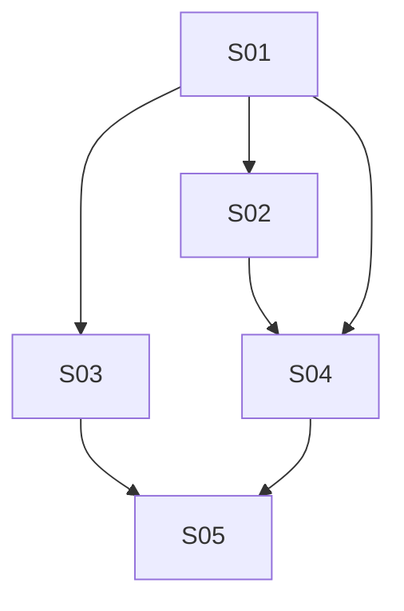

# M21 — Multi-Vertical Scheduling: Foundation

**Phase:** Local Development
**Goal:** Introduce the `Resource` aggregate — the generic bookable unit (`LOCATION`/`STAFF`/`ROOM`/`EQUIPMENT`) that every subsequent Multi-Vertical Scheduling milestone builds on — plus resource-scoped schedule closures/openings, giving a manager the first piece of the domain model needed to represent a business as something other than "the whole tenant is the resource."
**Depends on:** none (first milestone of the Multi-Vertical Scheduling sequence)
**Blocks:** M22 (Service Extensions & Availability Engine), M23 (Appointment Booking & Extensions), M24 (Classes & Sessions) — all three depend on `Resource` existing.
**Design rationale:** `docs/discovery/multivertical-booking/multivertical-booking.md` §3, §9 items 1/6/9/11 (promoted via `/discovery-to-milestone` on 2026-08-31) — kept as the permanent *why*; this file and the canonical docs it cites (`docs/04-USE_CASES.md` UC-044–049, UC-010e/f, `docs/02-DOMAIN_MODEL.md` § Booking Context, `docs/03-DOMAIN_EVENTS.md`, `docs/05-BOUNDED_CONTEXTS.md`, `docs/13-DATABASE_SCHEMA.md`, `docs/14-API_CONTRACTS.md`) are the source of truth for implementation — nothing below should require opening the discovery doc to understand.

## Non-Goals

- **Every other Cluster 1–4 concept** (`Service.resourceRequirements`/`legs`, the `resource_occupancy` exclusivity engine, class templates/sessions, recurring reservations, contracts) — deferred to M22/M23/M24. This milestone's own `Resource` aggregate is deliberately inert beyond scheduling itself: nothing yet references it from a `Service`.
- **Multi-location resourcing** — one tenant remains one physical unit in this phase (ties to `CLAUDE.md` §12's open decision; the `Resource` model leaves room for a location dimension later without attempting to resolve §12 here).
- **The manager multi-resource day grid (UC-057)** — promoted as part of Cluster 2, not this milestone; it depends on the availability engine's resource-scoped query, not merely on `Resource` existing.

## Build order

| Wave | Story | Theme |
|---|---|---|
| 1 | M21-S01 | `Resource` aggregate — backend CRUD (create/edit/deactivate/reactivate/list) + BFF endpoints + `StaffDeactivated` cascade consumer (UC-044–049) |
| 2 | M21-S02 | LOCATION backfill migration + going-forward `TenantProvisioned` handler |
| 2 | M21-S03 | Resource-scoped schedule closures/openings — backend + BFF (UC-010e, UC-010f) |
| 3 | M21-S04 | Manager "Recursos" frontend — list/create/edit-hours/deactivate/reactivate |
| 4 | M21-S05 | Staff/Manager "Horários" resource-scoped extension frontend — resource picker + scoped calendar |

**Wave note (corrected during this milestone's own self-dry-run):** S05 was originally proposed as Wave 3, parallel with S04. The mechanical supplying-endpoint check found `ResourcePicker` (S05) needs S04's `useResources()` hook to populate its dropdown — nothing else in this milestone supplies a resource-list read for the frontend. S05 is therefore **Wave 4**, sequential after S04, not parallel with it.

**Likely-independent stories (preview — not authoritative):** S02 and S03 share no files (S02 touches only a new migration + backfill script scoped to `resources`/`service_resource_requirements`* seams; S03 touches `schedule_closures`/`schedule_openings` entities, repositories, controllers, and their `.http` files) and have no `Dependencies:` edge between them — a candidate `/run-batch` pair once S01 lands. `/run-batch` re-derives this live at run time; this is a courtesy preview, not a green light.

---

### M21-S01 — `Resource` aggregate + backend CRUD + BFF endpoints + `StaffDeactivated` cascade consumer ✅ Done

**Agent:** `backend-ts` + `bff-ts`
**Complexity:** L
**Docs to load:** `docs/02-DOMAIN_MODEL.md` § Booking Context (`Resource` aggregate), `docs/13-DATABASE_SCHEMA.md` § `booking.resources`, `docs/14-API_CONTRACTS.md` § Resource Management, `docs/04-USE_CASES.md` UC-044–049, `docs/05-BOUNDED_CONTEXTS.md` § Booking Context / Staff Context (`StaffDeactivated` consumer), `docs/AGENT_PATTERNS.md` Pattern #1 (port+adapter), `docs/24-BFF_ARCHITECTURE.md` § Module & Controller Naming Conventions, `docs/ENGINEERING_RULES.md` § RequestContext (tenant business hours: controller reads `RequestContext.settings.businessHours`, forwards as an explicit DTO field — `IBookingPlatformPort`/`AvailabilityService` do NOT carry a tenant-hours lookup, corrected during story discovery 2026-09-01)
**Dependencies:** none
**Pattern:** Repository + Adapter (`IResourceRepository` port, `TypeOrmResourceRepository` adapter) — matches every other Booking-context aggregate; no new named pattern.

**Description:**
Create the `Resource` aggregate in `apps/backend/src/contexts/booking/domain/resource.aggregate.ts` — one row per bookable unit, per `docs/02-DOMAIN_MODEL.md`'s exact field list: `resourceId`, `tenantId`, `type: 'LOCATION'|'STAFF'|'ROOM'|'EQUIPMENT'`, `refId: StaffId | null` (set only when `type='STAFF'`), `name`, `workingHours: BusinessHours | null` (`null` = inherits tenant hours), `turnoverMinutes` (default 0), `maxCapacity: int | null`, `isActive`, `createdAt`, `updatedAt`.

**Aggregate invariants (enforced in `Resource.create()`, not just the DB):**
- `(type === 'STAFF') === (refId !== null)` — a staff wrapper must reference a Staff ID; every other type must not.
- Every `workingHours` window (when set) must be a subset of the tenant's recurring `businessHours` window. **Corrected during story discovery (2026-09-01):** `IBookingPlatformPort` has no tenant-hours method and `AvailabilityService` does not use it — it receives `businessHours` as a plain input. Per `docs/ENGINEERING_RULES.md` § RequestContext, the correct source is the controller: `resource.controller.ts` extracts `settings.businessHours` from the injected `RequestContext` and forwards it as an explicit `tenantBusinessHours` DTO field into `CreateResourceUseCase`/`UpdateResourceUseCase`, which pass it into `Resource.create()`/`Resource.update()`. Use cases must never inject `RequestContext` directly. **Broadened during bot review (PR #457, round 9+):** `PATCH /resources/:id` was originally scoped to `workingHours` only (`UpdateResourceWorkingHoursUseCase`); per user decision, every field is now independently editable — see UC-046 and `docs/02-DOMAIN_MODEL.md` § Resource's `update()` method.
- `maxCapacity`, when set, must be `> 0`.
- `LOCATION` is never created through this use case — `POST /resources` with `type: 'LOCATION'` is rejected (`422`); every tenant's one `LOCATION` resource comes from S02's backfill migration only.

**Backend use case steps:**
1. **`CreateResourceUseCase`** (UC-045): validates the `STAFF`⟺`refId` invariant, validates the referenced `Staff` row exists/is active/belongs to the tenant via a narrow lookup adapter (new `infrastructure/cross-context/booking-staff.adapter.ts` — grep `infrastructure/cross-context/` first per `CLAUDE.md` §8; none exists yet for Booking→Staff, so this is a genuinely new adapter, not a duplicate), validates working-hours-within-tenant-hours, persists via `IResourceRepository.save()`. `409 BOOKING_RESOURCE_STAFF_ALREADY_WRAPPED` if that staff member already has a `Resource` row (UC-045 A1); `422 BOOKING_RESOURCE_NO_WORKING_HOURS` if no hours are set and the tenant has none either (UC-045 A2).
2. **`UpdateResourceUseCase`** (UC-046): loads by `(tenantId, id)`, merges any sent fields (`name`/`type`/`refId`/`workingHours`/`turnoverMinutes`/`maxCapacity`) over the resource's current values, re-runs `create()`'s own invariants against the resolved state via `Resource.update()`, saves. Re-validates the staff-wrap check (via the shared `StaffWrapValidationService`, excluding the resource being updated from the "already wrapped" check) when `type` is changing to `STAFF`. Rejects (`409`) a `type` change to/from `LOCATION`. `404` if not found/cross-tenant.
3. **`DeactivateResourceUseCase`** (UC-047): sets `isActive = false`. Does **not** cancel or demote anything else — this milestone has no bookings/sessions referencing `Resource` yet, so the "resolution worklist" UC-047 describes is a no-op list (empty) until M22+ exists; still call the same method so M22+ can extend it without changing this use case's own shape.
4. **`ReactivateResourceUseCase`** (UC-049): sets `isActive = true`. No event published — descoped during story discovery (2026-09-01): `ResourceReactivated` has no consumer yet, and an event drained into the outbox with zero subscribers gets no Pub/Sub topic from the auto-generated catalog (M20-S16 precedent, `docs/ENGINEERING_RULES.md` § Aggregate domain events → outbox); config-only, same as steps 1–3. `409` if already active.
5. **`ListResourcesUseCase`** (UC-044): `findByTenant(tenantId, { type?, isActive? })`, returns the list.
6. **`CascadeStaffDeactivationUseCase`** (UC-048): looks up the `Resource` row by `(tenantId, refId=staffId)`; no-op if none exists (A1); otherwise calls the exact same deactivation path as step 3.

**Backend HTTP surface:** new controller `infrastructure/controllers/resource.controller.ts` — `GET /resources`, `POST /resources`, `PATCH /resources/:id`, `DELETE /resources/:id`, `POST /resources/:id/reactivate`. `MANAGER`-only on every route (`@UseGuards(ManagerRoleGuard)` — the real backend convention; `@Roles(...)` is a BFF-only decorator, verified via `docs-audit` that it has zero backend usages) — a deliberate, self-consistent restriction distinct from every other Booking-context admin surface (`docs/14-API_CONTRACTS.md` § Resource Management explains why). Register in `booking.module.ts` alongside the existing `ScheduleClosureController`/`ScheduleOpeningController`.

**Event consumer (UC-048):** new `infrastructure/events/staff-deactivated.handler.ts` in the Booking context, following the exact shape of `apps/backend/src/contexts/loyalty/infrastructure/events/booking-completed.handler.ts` (the real, existing cross-context consumer precedent) — `OnModuleInit` subscribes to `StaffDeactivated` (imported from `../../../staff/domain/events/staff-deactivated.event.ts`), `handle()` calls exactly `CascadeStaffDeactivationUseCase.execute()` and rethrows on failure, passes `event.correlationId` into the DTO, zero domain logic in the handler itself. This is `StaffDeactivated`'s first real consumer — no existing subscription to build on.

**BFF endpoint spec:** new `apps/bff/src/features/booking/resource.controller.ts` + `resource.schemas.ts` + `resource.types.ts`, forwarding to the backend via `BackendHttpService`, same `MANAGER`-only guard. Register in the existing `apps/bff/src/features/booking/` module (extend, not a new NestJS module — mirrors how `schedule.module.ts` already hosts multiple related controllers).

**New migration / i18n keys / env vars / feature flags:** new migration `apps/backend/src/contexts/booking/infrastructure/migrations/<next-timestamp>-CreateBookingResources.ts` creating `booking.resources` exactly per `docs/13-DATABASE_SCHEMA.md` (all listed columns, both partial unique indexes, the `(type='STAFF') = (ref_id IS NOT NULL)` CHECK). Migration timestamps are global — verify the current highest across all contexts at implementation time (`1748500000006` is the latest as of this milestone's drafting; don't reuse it).

**Files to create/modify:**
- `apps/backend/src/contexts/booking/domain/resource.aggregate.ts` (new)
- `apps/backend/src/contexts/booking/domain/resource.spec.ts` (new)
- `apps/backend/src/contexts/booking/domain/resource.types.ts` (new — `ResourceType` enum, `BusinessHours` reuse)
- `apps/backend/src/contexts/booking/domain/errors/resource-*.error.ts` (new — one per new error code)
- `apps/backend/src/contexts/booking/application/ports/resource-repository.port.ts` (new)
- `apps/backend/src/contexts/booking/application/use-cases/create-resource.use-case.ts` (+ `.spec.ts`) (new)
- `apps/backend/src/contexts/booking/application/use-cases/update-resource.use-case.ts` (+ `.spec.ts`) (new — renamed from `update-resource-working-hours.use-case.ts` when the endpoint's scope broadened, PR #457 round 9+)
- `apps/backend/src/contexts/booking/application/services/staff-wrap-validation.service.ts` (+ `.spec.ts`) (new — extracted from `CreateResourceUseCase`'s private `assertStaffWrappable()` once `UpdateResourceUseCase` needed the identical check, PR #457 round 9+)
- `apps/backend/src/contexts/booking/application/use-cases/deactivate-resource.use-case.ts` (+ `.spec.ts`) (new)
- `apps/backend/src/contexts/booking/application/use-cases/reactivate-resource.use-case.ts` (+ `.spec.ts`) (new)
- `apps/backend/src/contexts/booking/application/use-cases/list-resources.use-case.ts` (+ `.spec.ts`) (new)
- `apps/backend/src/contexts/booking/application/use-cases/cascade-staff-deactivation.use-case.ts` (+ `.spec.ts`) (new)
- `apps/backend/src/contexts/booking/infrastructure/entities/resource.entity.ts` (new)
- `apps/backend/src/contexts/booking/infrastructure/repositories/typeorm-resource.repository.ts` (+ `.spec.ts`) (new)
- `apps/backend/src/contexts/booking/infrastructure/controllers/resource.controller.ts` (+ `.spec.ts`, `.integration.spec.ts`) (new)
- `apps/backend/src/contexts/booking/infrastructure/events/staff-deactivated.handler.ts` (+ `.spec.ts`, `.integration.spec.ts`) (new)
- `apps/backend/src/contexts/booking/infrastructure/cross-context/booking-staff.adapter.ts` (+ `.spec.ts`) (new — narrow Staff lookup: same-tenant/existing/active; depends on the Staff context's existing `GetStaffByIdUseCase` per `docs/ENGINEERING_RULES.md` § Backend read use cases for cross-context access, not a new query service. "Schedulable" clarified during story discovery (2026-09-01) to mean `isActive` only — no separate role restriction; both `STAFF` and `MANAGER` roles can be wrapped)
- `apps/backend/src/contexts/booking/infrastructure/migrations/<timestamp>-CreateBookingResources.ts` (new)
- `apps/backend/src/contexts/booking/booking.module.ts` (modify — register controller, use cases, repository provider with `useClass`, entity, event handler)
- `apps/backend/src/test/integration-global-setup.ts` (modify — register `ResourceEntity`, matching the existing `ScheduleClosureEntity` registration; missing registration causes silent integration-test failures)
- `apps/backend/http/booking/resources.http` (new)
- `packages/types/src/error-codes.ts` (modify — add `BOOKING_RESOURCE_STAFF_ALREADY_WRAPPED`, `BOOKING_RESOURCE_NO_WORKING_HOURS`, `BOOKING_RESOURCE_ALREADY_ACTIVE`, `BOOKING_RESOURCE_NOT_FOUND` to `BookingErrorCode`)
- `packages/i18n/locales/pt-BR/errors.json` + `.../en/errors.json` (modify — translation entries for all 4 new codes)
- `apps/bff/src/features/booking/resource.controller.ts` (+ `.spec.ts`, `.component.spec.ts`) (new)
- `apps/bff/src/features/booking/resource.schemas.ts` (new)
- `apps/bff/src/features/booking/resource.types.ts` (new)
- `apps/bff/http/booking/resources.http` (new)

**Acceptance criteria — product:**
- [ ] Manager can create a `STAFF`/`ROOM`/`EQUIPMENT` resource, list all resources filtered by type/active state, edit any field of an existing resource (including correcting a mistaken `type`/`refId`), deactivate, and reactivate it.
- [ ] Manager cannot create a `LOCATION` resource directly, nor change any resource's `type` to/from `LOCATION` — only S02's backfill produces or corrects one.
- [ ] Deactivating the `Staff` row behind a `STAFF`-type resource (existing UC-029) automatically deactivates that resource too, with no manual step.
- [ ] STAFF-role users get `403` on every Resource Management endpoint (MANAGER-only, by design).

**Acceptance criteria — technical:**
- Unit:
  - [ ] `Resource.create()` rejects `type='STAFF'` with no `refId` and vice versa
  - [ ] `Resource.create()` rejects a `workingHours` window outside the tenant's business hours
  - [ ] `CreateResourceUseCase` throws `BOOKING_RESOURCE_STAFF_ALREADY_WRAPPED` on a duplicate staff wrap
  - [ ] `CreateResourceUseCase` throws `BOOKING_RESOURCE_NO_WORKING_HOURS` when neither the resource nor the tenant has hours
  - [ ] `ReactivateResourceUseCase` throws on an already-active resource
  - [ ] `StaffDeactivatedHandler.handle()` calls `CascadeStaffDeactivationUseCase.execute()` exactly once and rethrows on failure
  - [ ] `CascadeStaffDeactivationUseCase` no-ops when no `Resource` wraps the deactivated staff member
- Integration:
  - [ ] `POST /resources` persists a real row and is retrievable via `GET /resources`
  - [ ] `StaffDeactivatedHandler` integration test: deactivate a real `Staff` row via `UC-029`'s use case, assert the wrapping `Resource.isActive` flips to `false` end-to-end through the real event bus
  - [ ] `TypeOrmResourceRepository` round-trips all fields including the two partial unique indexes (one `LOCATION` per tenant, one `Resource` per staff member)
- Tenant isolation:
  - [ ] `GET /resources` for tenant A never returns tenant B's resources
  - [ ] `PATCH /resources/:id` / `DELETE /resources/:id` for a cross-tenant `id` returns `404`, not the other tenant's data
- E2E:
  - [ ] none — covered by unit/integration; the frontend E2E lands with S04/S05
- [ ] Coverage ≥80% on changed code
- [ ] `tsc --noEmit` clean, lint clean

---

### M21-S02 — LOCATION backfill migration + going-forward TenantProvisioned handler ✅ Done

**Agent:** `backend-ts`
**Complexity:** M (raised from S — see "Locked in during story discovery, part 2" below)
**Docs to load:** `docs/13-DATABASE_SCHEMA.md` § `booking.resources`, `docs/discovery/multivertical-booking/multivertical-booking_DATA_MODEL.md` §4 (migration ordering — Cluster 1 scope only: create the `LOCATION` row, nothing about `service_resource_requirements`, which is M22's own migration), `docs/03-DOMAIN_EVENTS.md` § TenantProvisioned (added part 2 — new consumer)
**Dependencies:** M21-S01 (needs `booking.resources` to exist)
**Pattern:** plain composition for the migration; **event-consumer pattern for the handler** (added part 2), mirroring Staff context's existing `TenantProvisionedHandler`/`CreateInitialManagerUseCase` exactly — same business-key + inbox `eventId` double idempotency check, same transaction shape.

**Description:**
Two parts, closing the same invariant ("every tenant always has exactly one active `LOCATION` resource") for both existing and future tenants:

1. **Historical backfill (migration):** a pure-data migration (no schema change — S01's migration already created the table) that inserts one active `LOCATION` resource per existing tenant: `{ type: 'LOCATION', refId: null, name: <locale-aware — see below>, workingHours: null (inherits tenant hours), turnoverMinutes: 0, maxCapacity: null, isActive: true }`. Idempotent — safe to re-run (skip a tenant that already has an active `LOCATION` row, so this migration can be re-applied without violating the `UNIQUE (tenant_id) WHERE type='LOCATION' AND is_active` constraint). Runs as a normal migration in the same CI job as every other migration (`CLAUDE.md` §1 — "migrations via separate CI job, never auto at startup"), not a one-off script.
2. **Going-forward (event consumer, added during story discovery part 2, 2026-09-02):** a new Booking-context `TenantProvisionedBookingHandler` subscribes to the existing `TenantProvisioned` event (`docs/03-DOMAIN_EVENTS.md`) and creates the tenant's `LOCATION` resource asynchronously at provisioning time — mirrors Staff context's existing `TenantProvisionedHandler`/`CreateInitialManagerUseCase` (`apps/backend/src/contexts/staff/infrastructure/events/tenant-provisioned.handler.ts`) exactly, same file shape, same idempotency discipline. **Overrides the earlier "confirmed accepted as out of scope" decision below** (part 1 of discovery) — re-discussed with the user, who confirmed this gap must close now, not deferred to M22+/UC-075's bootstrap flow, since UC-075's preset-driven resourcing is a separate, later concern and shouldn't be a precondition for every tenant having its one default resource.

**Locked in during story discovery, part 1 (2026-09-02):**
- Backfill applies to **every** tenant regardless of `is_active` — no active-only filter.
- ~~A tenant created after this migration deploys... confirmed accepted as out of scope for this story/milestone.~~ **Superseded by part 2 below** — closed via the new handler instead.
- **Corrected during implementation (part 1):** `jest.config.ts`'s `integration` project has `testPathIgnorePatterns: ['/migrations/']` — any spec placed inside `infrastructure/migrations/` is silently never discovered by Jest (this is *why* zero migration test files existed anywhere in this codebase before this story). The spec file lives at `infrastructure/backfill-location-resources.integration.spec.ts` (one level up, sibling to `migrations/`), not co-located inside `migrations/` as originally planned.
- **Lint (part 1):** every migration file needs an explicit entry in `apps/backend/eslint.config.js`'s `PERSISTENCE_BYPASS_IGNORES` array (TD37-S02's `QueryRunner`-import ban has no directory-wide `migrations/**` exemption, only a per-file allowlist) — added `1748500000008-BackfillLocationResources.ts` alongside the S01 entry.
- **Test builder (part 1):** `apps/backend/src/test/builders/platform/tenant-entity.builder.ts` gained `withName()`, matching the existing `withSlug()`/`withIsActive()` pattern — needed to assert generated resource names against distinct, non-default tenant fixtures in the migration test.
- **Test strategy (migration):** `backfill-location-resources.integration.spec.ts` uses `createBookingIntegrationApp()` (already registers both `TenantEntity` and `ResourceEntity` against the shared test DataSource) — seed N tenants via `TenantEntityBuilder`/direct entity save, invoke the migration's exported `up(queryRunner)` directly via `ds.createQueryRunner()` (not `dataSource.runMigrations()`, since the global integration setup already runs every migration up front against an empty `tenants` table), assert resulting `ResourceEntity` rows, then call `up()` again to verify idempotency. Supplement with a manual run against the local docker-compose dev DB to sanity-check against real current tenant data before opening the PR — not a CI-enforced step.
- **`down()`:** unconditionally `DELETE FROM booking.resources WHERE type = 'LOCATION'` — every `LOCATION` row can only ever originate from this migration or the new handler (S01's `CreateResourceUseCase` rejects `POST`/type-change to `LOCATION`), so no per-tenant-history qualifier is needed.

**Locked in during story discovery, part 2 (2026-09-02) — the handler design:**
- **Locale-aware default name** (both the migration's SQL and the handler use the same two literal strings, no tenant-name prefix — supersedes the original `<tenant.name> (unidade única)` design): `"Localização Principal"` when `tenants.settings.localization.language != 'en'` (pt-BR default), `"Main Location"` when `= 'en'`. Verified via `apps/backend/src/shared/database/seed.ts`: tenants are genuinely multi-locale today (`tenantIkaro` is `language: 'en'`; `tenantA`/`tenantB` are `pt-BR`) — a single hardcoded Portuguese string would be wrong for an English-locale tenant. Renamable by the manager any time via `PATCH /resources/:id`, so this is just a sane default, not a hard requirement.
- **Zero new cross-context ports needed.** `IBookingPlatformPort`/`BookingPlatformAdapter` (`apps/backend/src/contexts/booking/infrastructure/cross-context/booking-platform.adapter.ts`) already injects `GetTenantByIdUseCase`, which already returns both `locale` and `settings.businessHours` — add one new port method `getBusinessHoursAndLocale(tenantId): Promise<{ businessHours: BusinessHours; locale: string }>` that calls the already-injected use case and extracts those two fields. No `TenantProvisioned` event-payload change needed (the handler looks the data up post-commit, same as `revalidatePublicPages()`'s existing lookup pattern in the same adapter) — confirmed `Tenant.create()` → `TenantSettings.default(timezone, countryCode)` always sets real, non-empty default business hours (`buildDefaultBusinessHours(timezone)`), so `Resource.create()`'s `BOOKING_RESOURCE_NO_WORKING_HOURS` check can never fire for a freshly-provisioned tenant.
- **`Resource.create()` already permits `type: LOCATION` at the domain layer** — the `422` rejection lives only in `CreateResourceUseCase` (the public API's use case), not the aggregate. The new use case calls `Resource.create()` directly, bypassing that use case entirely — this is not a workaround, it's the aggregate's own domain-layer entry point being used by a different, legitimate application-layer caller (the same relationship the migration's raw SQL already has to the aggregate, one layer further down).
- **Idempotency (mirrors `CreateInitialManagerUseCase` exactly):** business-key check first (`IResourceRepository.findByTenant(tenantId, { type: LOCATION, isActive: true })` — return early if any exist), then an inbox `eventId` dedup check (`IInboxRepository.hasBeenProcessed`/`markProcessed`, consumer name `create-tenant-location-resource`) as the eventId-based backstop, both the `Resource` save and the inbox mark in the same transaction.
- **New use case:** `CreateTenantLocationResourceUseCase` — input `{ tenantId, eventId, correlationId }`, no result. Calls `Resource.create({ tenantId, type: ResourceType.LOCATION, name, tenantBusinessHours: businessHours, workingHours: null, turnoverMinutes: 0, maxCapacity: null })`, saves via `IResourceRepository.save()`. No domain event published (matches S01's `ReactivateResourceUseCase`'s own "config-only, no consumer yet" precedent) — a `LOCATION` resource appearing has no current subscriber.
- **New handler:** `TenantProvisionedBookingHandler` (Booking context) — `CONSUMER_NAME = 'booking'` (the Pub/Sub-level subscription name, distinct from Staff context's own `'staff'` — both subscribe to the same `TenantProvisioned` topic independently, exact same fan-out shape already established), `onModuleInit()` subscribes, `handle()` calls `CreateTenantLocationResourceUseCase.execute()` and rethrows on failure (nack-for-retry, matching Staff's handler verbatim).
- **Corrected during implementation (part 2):** the class can't be named bare `TenantProvisionedHandler` like Staff's — `packages/infra-scripts/src/pubsub-catalog.ts`'s generator keys every `static readonly` prop it collects by `"${className}.${propName}"` with no file/module qualifier (a deliberate simplification, not a full `ts.Program`/checker), so a second class of that exact name with a different `CONSUMER_NAME` value throws `pubsub-catalog: conflicting values for "TenantProvisionedHandler.CONSUMER_NAME"` at CI's Pub/Sub catalog generation step. Notification context's own `tenant-provisioned.handler.ts` already solves this the same way: same file name, but the class itself is qualified — `TenantProvisionedNotificationHandler`. Booking's follows that exact precedent: `TenantProvisionedBookingHandler`.

**Files to create/modify:**
- `apps/backend/src/contexts/booking/infrastructure/migrations/1748500000008-BackfillLocationResources.ts` (new — data migration, `up()` inserts with the locale-aware `CASE WHEN t."settings"->'localization'->>'language' = 'en' THEN 'Main Location' ELSE 'Localização Principal' END` name, `down()` unconditionally deletes every `type='LOCATION'` row)
- `apps/backend/src/contexts/booking/infrastructure/backfill-location-resources.integration.spec.ts` (new — see Test strategy above; lives outside `migrations/` per the part-1 jest-config correction above, not co-located inside `migrations/`)
- `apps/backend/eslint.config.js` (modify — add the new migration file to `PERSISTENCE_BYPASS_IGNORES`, per the part-1 lint note above)
- `apps/backend/src/test/builders/platform/tenant-entity.builder.ts` (modify — add `withName()`, per the part-1 test-builder note above)
- `apps/backend/src/test/integration-global-setup.ts` (modify — register the new migration class in the `migrations: [...]` array, per `docs/08-TESTING_STRATEGY.md`'s MANDATORY checklist; S01's `CreateBookingResources1748500000007` is already there as the precedent to follow)
- `apps/backend/src/contexts/booking/application/use-cases/create-tenant-location-resource.use-case.ts` (+ `.spec.ts`) (new — see part 2 design above)
- `apps/backend/src/contexts/booking/infrastructure/events/tenant-provisioned.handler.ts` (+ `.spec.ts`, `.integration.spec.ts`) (new — mirrors `apps/backend/src/contexts/staff/infrastructure/events/tenant-provisioned.handler.ts` exactly)
- `apps/backend/src/contexts/booking/application/ports/booking-platform.port.ts` (modify — add `getBusinessHoursAndLocale(tenantId): Promise<{ businessHours: BusinessHours; locale: string }>` to `IBookingPlatformPort`)
- `apps/backend/src/contexts/booking/infrastructure/cross-context/booking-platform.adapter.ts` (+ `.spec.ts`) (modify — implement the new port method using the already-injected `GetTenantByIdUseCase`)
- `apps/backend/src/contexts/booking/booking.module.ts` (modify — register `CreateTenantLocationResourceUseCase`, `TenantProvisionedBookingHandler`)
- `apps/backend/src/shared/database/seed.ts` (modify — local-dev seed tenants are created via raw SQL, not `ProvisionTenantUseCase`, so neither the migration (runs before seeding) nor the new handler (no event published) backfills them; add a `seedResources()` function inserting one locale-aware `LOCATION` resource per seeded tenant (`tenantIkaro`→"Main Location", `tenantA`/`tenantB`→"Localização Principal"), mirroring `seedServices()`'s shape, plus 3 new fixed UUIDs in the `IDS` map)

**Acceptance criteria — product:**
- [ ] Every tenant that existed before this migration ran has exactly one active `LOCATION` resource after it, named "Localização Principal" or "Main Location" per the tenant's locale.
- [ ] No existing booking, service, or schedule closure/opening is altered by this migration — it only inserts new `resources` rows.
- [ ] A tenant provisioned via `POST /internal/tenants` (UC-024) *after* this story ships automatically has exactly one active `LOCATION` resource within normal event-processing latency — no manual step, no gap.

**Acceptance criteria — technical:**
- Unit:
  - [ ] `CreateTenantLocationResourceUseCase` creates a `LOCATION` resource with the locale-aware name and `tenantBusinessHours` from the platform port
  - [ ] `CreateTenantLocationResourceUseCase` no-ops (no save, no inbox write) when an active `LOCATION` resource already exists for the tenant
  - [ ] `CreateTenantLocationResourceUseCase` throws a data-inconsistency error when the inbox says already-processed but no `LOCATION` resource exists (mirrors `CreateInitialManagerUseCase`'s exact same guard)
  - [ ] `TenantProvisionedBookingHandler.handle()` calls `CreateTenantLocationResourceUseCase.execute()` exactly once and rethrows on failure
  - [ ] `BookingPlatformAdapter.getBusinessHoursAndLocale()` returns the tenant's `settings.businessHours` + `locale` via `GetTenantByIdUseCase`
- Integration:
  - [ ] Migration test seeds N tenants (including one with zero resources and, defensively, one that somehow already has an active `LOCATION` row) via `TenantEntityBuilder`, invokes the migration's `up(queryRunner)` directly, and asserts exactly one active `LOCATION` resource exists per tenant after running (with the correct locale-aware name), and that re-running `up()` is a no-op (idempotency)
  - [ ] `TenantProvisionedBookingHandler` integration test: provision a real `Tenant` via `ProvisionTenantUseCase`, assert a `LOCATION` `Resource` row exists end-to-end through the real event bus, with the correct locale-aware name for both a pt-BR and an en tenant
- Tenant isolation:
  - [ ] Each backfilled/handler-created `LOCATION` resource's `tenant_id` matches the tenant it was generated for — no cross-tenant row
- E2E: none — covered by unit/integration; the frontend E2E lands with S04/S05
- [ ] Coverage ≥80% on changed code
- [ ] `tsc --noEmit` clean, lint clean

---

### M21-S03 — Resource-scoped schedule closures/openings — backend + BFF ✅ Done

**Agent:** `backend-ts` + `bff-ts`
**Complexity:** M
**Docs to load:** `docs/02-DOMAIN_MODEL.md` § Booking Context (`ScheduleClosure`/`ScheduleOpening`, resourceId), `docs/13-DATABASE_SCHEMA.md` § `booking.schedule_closures`/`booking.schedule_openings` (M21 Cluster 1 modifications), `docs/14-API_CONTRACTS.md` § Schedule Closures/Schedule Openings, `docs/04-USE_CASES.md` UC-010e, UC-010f
**Dependencies:** M21-S01 (needs `Resource` to exist as a validatable reference)
**Pattern:** plain composition — extends the existing `ScheduleClosure`/`ScheduleOpening` aggregates and their existing use cases; no new pattern.

**Description:**
Add an optional `resourceId: string | null` to both `ScheduleClosure` and `ScheduleOpening` (`null` = tenant-wide, today's exact unchanged behavior — the "everything" sentinel; plain string, not a VO — no `ResourceId` value-object class exists in the codebase, confirmed during story discovery). Extend the existing `close-schedule.use-case.ts`/`open-schedule.use-case.ts` to accept and validate it (resource exists, belongs to the tenant, `404` otherwise), and extend the overlap-check queries in `list-closures`/`list-openings` use cases to scope by `(tenantId, resourceId, date)` instead of just `(tenantId, date)` when `resourceId` is set. `remove-closure`/`remove-schedule-opening` need no query changes — see "Backend use case steps" below.

**Constraint fix (required in the same migration, not a follow-up):** `booking.schedule_openings`' current `UNIQUE(tenant_id, date)` silently stops enforcing "one opening per date" the moment `resource_id` becomes nullable (Postgres treats `NULL ≠ NULL`). Replace with the two partial unique indexes from `docs/13-DATABASE_SCHEMA.md`: `UNIQUE(tenant_id, date) WHERE resource_id IS NULL` and `UNIQUE(tenant_id, resource_id, date) WHERE resource_id IS NOT NULL`. The constraint being dropped is named `UQ_booking_schedule_openings_tenant_date` (from `CreateBookingScheduleOpenings1748000000013`).

**Entity decorator note (found during story discovery 2026-09-03):** `ScheduleOpeningEntity`'s current `@Unique(['tenantId', 'date'])` decorator cannot express the two partial unique indexes (TypeORM has no WHERE-clause decorator) — remove it and rely on the migration alone for the real constraint, matching `ResourceEntity`'s existing precedent (its own partial unique indexes are migration-only, undeclared on the entity class).

**Auth exception:** a request body with `resourceId` set requires `MANAGER` specifically (not `STAFF`) — matches the Resource Management restriction from S01. The existing tenant-wide case (`resourceId` omitted) stays `STAFF|MANAGER`, unchanged. Add this as a guard check inside the existing controller actions (role from `RequestContext`, branch on whether `resourceId` is present in the body), not a second route. **DELETE stays STAFF|MANAGER unconditionally regardless of whether the target closure/opening is resource-scoped** (confirmed during story discovery 2026-09-03 — not symmetric with create's MANAGER-only restriction; DELETE requests carry no `resourceId`, and expanding delete authorization is out of scope for UC-010e/f, which only describe creation).

**Backend use case steps:**
1. **`CloseScheduleUseCase`** (extend, UC-010e — story originally misnamed this `CreateScheduleClosureUseCase`; the real class/file already matches the Files list below): accept optional `resourceId`; if set, validate via `IResourceRepository.findById(resourceId, tenantId)` — **note argument order: `id` first, `tenantId` second** (the story originally had this reversed) — throw the existing `ResourceNotFoundError` on `null` (already mapped to `404` in `booking-error.mapper.ts`, no new error code needed). Require `MANAGER` via an in-`create()`-method check on `this.ctx.actorRole`, mirroring `service.controller.ts`'s existing `const { actorRole } = this.tenantContext` pattern, throwing `throwProblemDetail(HttpStatus.FORBIDDEN, ...)` (mirrors `manager-role.guard.ts`). **The BFF needs no duplicate guard** — `BackendHttpService.call()` already forwards the backend's exact status/body verbatim on error, confirmed during discovery. Scope the overlap check (`closureRepo.findByTenantAndDate`) to `(tenantId, resourceId, date)`.
2. **`OpenScheduleUseCase`** (extend, UC-010f — story originally misnamed this `CreateScheduleOpeningUseCase`): same shape as above; `openingRepo.findByTenantAndDate` gains a `resourceId` parameter, plus the two-partial-index migration described above.
3. `ListClosuresUseCase`/`ListOpeningsUseCase`: extend their query methods with an optional `resourceId` filter (`docs/14-API_CONTRACTS.md`'s `GET .../closures?...&resourceId=` / `.../openings?...&resourceId=`).
4. `RemoveClosureUseCase`/`RemoveScheduleOpeningUseCase`: **no code change needed** (corrected during story discovery 2026-09-03 — the story originally claimed these needed "overlap-check queries" extended; confirmed both are pure `findById(id, tenantId) → delete(id, tenantId)` with no date/overlap query at all). `resourceId` travels with the loaded aggregate automatically once the entity/aggregate mapping is extended.

**Backend HTTP surface:** reuses the existing `POST /schedule/closures`, `DELETE /schedule/closures/:id`, `GET /schedule/closures`, and the equivalent `/schedule/openings` routes — `resourceId` is a new optional body/query field on each, not a new route.

**BFF endpoint spec:** extend the existing `apps/bff/src/features/booking/schedule.controller.ts`/`schedule-opening.controller.ts` and their `.schemas.ts` files to pass through the new optional `resourceId` field — same routes, same `@Roles('MANAGER', 'STAFF')` guard as today, **no additional BFF-side role branching** (confirmed during story discovery 2026-09-03: `BackendHttpService.call()` already forwards the backend's exact status/body verbatim, including its `403`, so the MANAGER-only-when-`resourceId`-present enforcement lives entirely in the backend controller).

**New migration / i18n keys / env vars / feature flags:** new migration adding `resource_id UUID NULLABLE` (composite FK `(tenant_id, resource_id)` → `resources`) to both tables, plus the two-partial-index replacement on `schedule_openings`.

**Files to create/modify:**
- `apps/backend/src/contexts/booking/domain/schedule-closure.aggregate.ts` (modify — add `resourceId`)
- `apps/backend/src/contexts/booking/domain/schedule-closure.spec.ts` (modify)
- `apps/backend/src/contexts/booking/domain/schedule-opening.aggregate.ts` (modify — add `resourceId`)
- `apps/backend/src/contexts/booking/domain/schedule-opening.spec.ts` (modify)
- `apps/backend/src/contexts/booking/application/ports/schedule-closure-repository.port.ts` (modify — resourceId-aware query signature)
- `apps/backend/src/contexts/booking/application/ports/schedule-opening-repository.port.ts` (modify)
- `apps/backend/src/contexts/booking/application/use-cases/close-schedule.use-case.ts` (+ `.spec.ts`) (modify)
- `apps/backend/src/contexts/booking/application/use-cases/open-schedule.use-case.ts` (+ `.spec.ts`) (modify)
- `apps/backend/src/contexts/booking/application/use-cases/list-closures.use-case.ts` (+ `.spec.ts`) (modify)
- `apps/backend/src/contexts/booking/application/use-cases/list-openings.use-case.ts` (+ `.spec.ts`) (modify)
- `apps/backend/src/contexts/booking/infrastructure/entities/schedule-closure.entity.ts` (modify)
- `apps/backend/src/contexts/booking/infrastructure/entities/schedule-opening.entity.ts` (modify)
- `apps/backend/src/contexts/booking/infrastructure/repositories/typeorm-schedule-closure.repository.ts` (+ `.spec.ts`) (modify)
- `apps/backend/src/contexts/booking/infrastructure/repositories/typeorm-schedule-opening.repository.ts` (+ `.spec.ts`) (modify)
- `apps/backend/src/contexts/booking/infrastructure/controllers/schedule-closure.controller.ts` (+ `.spec.ts`, `.integration.spec.ts`) (modify)
- `apps/backend/src/contexts/booking/infrastructure/controllers/schedule-opening.controller.ts` (+ `.spec.ts`, `.integration.spec.ts`) (modify)
- `apps/backend/src/contexts/booking/infrastructure/migrations/<timestamp>-AddResourceIdToScheduleClosuresAndOpenings.ts` (new)
- `apps/backend/src/test/integration-global-setup.ts` (modify — register the new migration class; `ScheduleClosureEntity`/`ScheduleOpeningEntity` are already registered. **Added during story discovery 2026-09-03**, missing from the original file list — mandatory per `docs/ENGINEERING_RULES.md` § Migration/entity registration)
- `apps/backend/src/test/builders/booking/schedule-closure.builder.ts` (modify — **added during story discovery 2026-09-03**: `build()` calls `ScheduleClosure.close(...)` positionally; the documented factory inserts `resourceId` before `startTime`, so this call must be updated in the same commit or `startTime` silently shifts into the `resourceId` slot — both are `string | undefined`, `tsc` won't catch it)
- `apps/backend/src/test/builders/booking/schedule-opening.builder.ts` (modify — same risk as above; `notes` would shift into `resourceId`)
- `apps/backend/src/test/builders/booking/schedule-closure-entity.builder.ts` (modify — add `withResourceId()`; named-field assignment, additive/safe)
- `apps/backend/src/test/builders/booking/schedule-opening-entity.builder.ts` (modify — same, additive/safe)
- `apps/backend/http/booking/schedule-closures.http` (modify — add resourceId examples)
- `apps/backend/http/booking/schedule-openings.http` (modify)
- `apps/bff/src/features/booking/schedule.controller.ts` (+ `.spec.ts`, `.component.spec.ts`) (modify)
- `apps/bff/src/features/booking/schedule.schemas.ts` (modify)
- `apps/bff/src/features/booking/schedule-opening.controller.ts` (+ `.spec.ts`, `.component.spec.ts`) (modify)
- `apps/bff/src/features/booking/schedule-opening.schemas.ts` (modify)
- `apps/bff/http/schedule/schedule-closures.http` (modify — **corrected during story discovery 2026-09-03**: actual directory is `apps/bff/http/schedule/`, not `apps/bff/http/booking/`)
- `apps/bff/http/schedule/schedule-openings.http` (new — **corrected during story discovery 2026-09-03**: this file does not exist yet, confirmed; it's a net-new file, not a modify)

**Acceptance criteria — product:**
- [ ] Manager can create a closure/opening scoped to a specific resource; that resource's calendar reflects it, other resources at the same tenant are unaffected.
- [ ] Leaving `resourceId` unset behaves byte-identically to today (UC-010a–d, unchanged) — **explicit non-regression AC**, not assumed: an existing STAFF|MANAGER tenant-wide closure/opening flow produces the same result before and after this story.
- [ ] STAFF users can still create tenant-wide closures/openings (unchanged) and gets `403` only when `resourceId` is present in the `POST` body. STAFF can still remove *any* closure/opening (resource-scoped or tenant-wide) — `DELETE` carries no `resourceId` and its authorization is unconditionally unchanged (confirmed during story discovery 2026-09-03: not symmetric with create's MANAGER-only restriction, out of scope for UC-010e/f).
- [ ] A tenant-wide opening and a resource-scoped opening for the same date never collide with each other; two tenant-wide (or two resource-scoped, same resource) openings for the same date still collide as before.

**Acceptance criteria — technical:**
- Unit:
  - [ ] `ScheduleClosure`/`ScheduleOpening` validate `resourceId` presence doesn't change any other existing invariant
  - [ ] `CloseScheduleUseCase`/`OpenScheduleUseCase` reject a `resourceId` that doesn't belong to the tenant
  - [ ] The controller layer rejects `resourceId` set by a STAFF-role actor with `403` (in-controller check, not use-case level — see "Backend use case steps")
- Integration:
  - [ ] A resource-scoped closure and a tenant-wide closure for the same date coexist without a false-positive overlap rejection
  - [ ] The two-partial-index migration: insert a tenant-wide opening and a resource-scoped opening for the same date successfully; insert a second tenant-wide opening for that date and assert it's rejected; insert a second resource-scoped opening for the same resource/date and assert it's rejected
- Tenant isolation:
  - [ ] A `resourceId` belonging to another tenant is rejected with `404`, never silently scoped to the wrong tenant's resource
- E2E: none — covered by unit/integration; the frontend E2E lands with S05
- [ ] Coverage ≥80% on changed code
- [ ] `tsc --noEmit` clean, lint clean

---

### M21-S04 — Manager "Recursos" frontend ✅ Done

**Agent:** `frontend-ts`
**Complexity:** M
**Docs to load:** `docs/16-DASHBOARD_FRONTEND_ARCHITECTURE.md`, `docs/24-BFF_ARCHITECTURE.md` § Web → BFF Transport Layer, `docs/14-API_CONTRACTS.md` § Resource Management
**Dependencies:** M21-S01 (BFF endpoints), M21-S02 (LOCATION backfill — the list screen's `LOCATION` row must already exist to review against)
**Pattern:** plain composition — matches the existing `team`/`services` dashboard feature shape exactly; no new pattern.
**Prototype references:** `plan/journey/manager/resources.md`, `plan/journey/manager/prototypes/resources/` (01-resources-list.html, 02-criar-recurso.html, 02b-criar-recurso-erro.html)

**Description:**
Build the Resource Management dashboard pages from the already-relocated, discovery-validated prototype (`plan/journey/manager/prototypes/resources/`), following the exact structural precedent `apps/web/features/staff/components/team/` already establishes for a MANAGER-only list/create/deactivate/reactivate flow. Add a new MANAGER-only sidebar item ("Recursos") to `apps/web/shells/dashboard/model/team-route.ts`-equivalent nav config (`Sidebar.tsx`'s `MANAGER_NAV_KEYS` array), same tier as Equipe/Configurações/Hotsite.

Working-hours edit (UC-046), deactivate confirmation (UC-047), and reactivate confirmation (UC-049) have **no discovery-stage prototype** — per `plan/journey/manager/prototypes/resources/dev-notes.md`'s own flagged gap, design these from `apps/web/features/platform/components/settings/SettingsHoursSection.tsx`'s existing per-weekday hours editor (the tenant `businessHours` editor — same shape as `Resource.workingHours` minus the timezone key; **corrected during story discovery 2026-09-02** — `staff/prototypes/horarios/` has no built or prototyped weekday-hours editor to mirror, it's schedule-closure/opening screens) and `manager/prototypes/equipe/03-deactivate-confirm.html` (for the deactivate/reactivate confirmation shape), not from scratch.

**Found during implementation (2026-09-02):** Resource Management shipped in S01 with no `GET /resources/:id` single-item read — every other admin CRUD surface in this codebase (Staff, Services) has one, S01 simply missed it. The edit page needs it to pre-fill the form, so a small backend+BFF addition (`GetResourceByIdUseCase`, `GET /resources/:id` on both the backend controller and the BFF controller, mirroring `service.controller.ts`'s/`staff.controller.ts`'s existing `getOne()`/`getById()` shape exactly) is included in this story despite the `frontend-ts` tag — confirmed with the user rather than worked around with a full-list-refetch in the frontend. `docs/14-API_CONTRACTS.md` § Resource Management and `plan/journey/manager/resources.md`'s BFF calls table updated to match.

**Files to create/modify:**
- `apps/backend/src/contexts/booking/application/use-cases/get-resource-by-id.use-case.ts` (+ `.spec.ts`) (new — see "Found during implementation" above)
- `apps/backend/src/contexts/booking/infrastructure/controllers/resource.controller.ts` (+ `.spec.ts`, `.integration.spec.ts`) (modify — add `GET :id`)
- `apps/backend/src/contexts/booking/booking.module.ts` (modify — register `GetResourceByIdUseCase`)
- `apps/backend/http/booking/resources.http` (modify — add `GET /resources/:id` example)
- `apps/bff/src/features/booking/resource.controller.ts` (+ `.spec.ts`, `.component.spec.ts`) (modify — add `GET :id` passthrough)
- `apps/bff/http/resources/resources.http` (modify — add `GET /v1/resources/:id` example)
- `apps/web/app/dashboard/resources/layout.tsx` (new — mounts `DashboardShell` + locale/formatting/tenant providers, matching `team/layout.tsx`/`settings/layout.tsx`'s precedent; every `app/dashboard/<section>/` needs exactly one, applied to all nested routes automatically per `docs/16-DASHBOARD_FRONTEND_ARCHITECTURE.md` §5 — **added during story discovery 2026-09-02**, missing from the original file list)
- `apps/web/app/dashboard/resources/page.tsx` (new)
- `apps/web/app/dashboard/resources/new/page.tsx` (new)
- `apps/web/app/dashboard/resources/[id]/page.tsx` (new — working-hours edit)
- `apps/web/app/dashboard/resources/[id]/deactivate/page.tsx` (new — dedicated page, not a modal, matching `team/[id]/deactivate/page.tsx`'s precedent)
- `apps/web/features/booking/components/dashboard/resources/ResourceListPage.tsx` (+ `.spec.tsx`) (new)
- `apps/web/features/booking/components/dashboard/resources/ResourceCreateForm.tsx` (+ `.spec.tsx`) (new)
- `apps/web/features/booking/components/dashboard/resources/ResourceEditForm.tsx` (+ `.spec.tsx`) (new)
- `apps/web/features/booking/components/dashboard/resources/ResourceDeactivateConfirm.tsx` (+ `.spec.tsx`) (new)
- ~~`apps/web/features/booking/components/dashboard/resources/ResourceReactivateConfirm.tsx` (+ `.spec.tsx`) (new)~~ — **corrected during live manual testing, 2026-09-02:** deleted. Reactivation shipped as a one-click row action on `ResourceListPage` instead of a confirmation screen, mirroring `manager/equipe.md`'s own "Ativar" precedent — see the corrected files list below.
- `packages/types/src/resource.dto.ts` (new — `Resource`/`ResourceType`/`ResourceWorkingHours`/`ResourceListResponse`/`CreateResourceRequest`/`UpdateResourceRequest`, mirroring `apps/bff/src/features/booking/resource.types.ts`'s shape; exported via `packages/types/src/index.ts`, matching `schedule.dto.ts`/`staff.dto.ts`'s existing precedent for a shared booking-context response type. **Corrected during story discovery 2026-09-02** — the original plan proposed a local, CI-drift-detector-blind `apps/web/features/booking/types/resource.ts`; `@ikaro/types` had zero `Resource`-related exports at discovery time, an inconsistency with every sibling booking type)
- `apps/web/features/booking/api/resources.ts` (new — `bffClient`-based fetcher functions only: `listResources`, `createResource`, `updateResource`, `deactivateResource`, `reactivateResource`, importing request/response types from `@ikaro/types`, matching `features/staff/api/staff.ts`'s / `features/booking/api/schedule.ts`'s existing split-file precedent)
- `apps/web/features/booking/hooks/useResources.ts` (+ `.spec.tsx`) (new — React Query hooks: `useResources`, `useCreateResource`, `useUpdateResource` (renamed from `useUpdateResourceWorkingHours` — PATCH now edits every field, PR #457 round 9+), `useDeactivateResource`, `useReactivateResource`, wrapping `api/resources.ts`'s fetchers, matching `features/staff/hooks/useStaff.ts`'s precedent. **Corrected during story discovery 2026-09-02** — the original plan combined fetchers and hooks into one `api/resources.ts` file, deviating from the codebase's established split)
- `apps/web/shells/dashboard/components/Sidebar.tsx` (modify — add "Recursos" to `MANAGER_NAV_KEYS`)
- `apps/web/shells/dashboard/components/BottomNav.tsx` + `MoreSheet.tsx` (modify, if Resources needs a bottom-nav/MoreSheet entry on mobile — verify against both files' existing `MANAGER_SHEET_ITEM_KEYS`/MANAGER-item pattern at implementation time)
- `packages/i18n/locales/pt-BR/web.json` + `.../en/web.json` (modify — dashboard UI copy lives under the top-level `"dashboard"` key in `web.json`, not a separate `dashboard.json`, confirmed against `dashboard.nav`/`dashboard.teamPage`'s real shape at implementation time; add a `dashboard.nav.resources` key alongside the existing `dashboard.nav` entries and a new `dashboard.resourcesPage` namespace mirroring `dashboard.teamPage`'s shape — no hardcoded visible text per `CLAUDE.md` §7 Testing)
- `apps/web/proxy.ts` (+ `.spec.ts`) (modify — **found during implementation**: `/dashboard/resources` was missing from `MANAGER_ONLY_ROUTES`, the same server-side redirect gate `/dashboard/settings`/`/dashboard/team`/`/dashboard/hotsite` already get; without it, a STAFF user hitting the route directly would render the page shell — sidebar-hidden only — with API calls failing 403 client-side, inconsistent with every other manager-only section's soft-redirect-to-`/dashboard` behavior)

**Additional implementation-time files (2026-09-02), not in the original list but needed to satisfy it:**
- `apps/web/shells/dashboard/model/resource-route.ts` (+ `.spec.ts`) (new — mirrors `team-route.ts`; needed by `BottomNav.tsx`'s existing hide-on-drill-down-route logic, which already has a `matchTeamRoute`/`matchServiceRoute` equivalent for every other section)
- `apps/web/features/booking/components/dashboard/resources/ResourceWorkingHoursEditor.tsx` (new — the per-weekday working-hours editor shared by create/edit forms)
- `apps/web/features/booking/components/dashboard/resources/ResourceIdentityFields.tsx` (new — the type-picker + staff-picker-or-name-field block shared by create/edit forms, extracted to satisfy this repo's `max-lines-per-function`/`max-lines` ESLint rules)
- `apps/web/features/booking/components/dashboard/resources/ResourceEditFormFields.tsx` (new — the inner edit-form component `ResourceEditForm.tsx` renders once `useResource()` resolves, keyed by `resourceId` so local form state initializes directly from the loaded resource instead of syncing via a `useEffect`, per `react-hooks/set-state-in-effect`)
- ~~`apps/web/features/booking/components/dashboard/resources/ResourceDeactivateOrReactivate.tsx`~~ — **corrected during live manual testing, 2026-09-02** (user feedback: "I want [reactivate] to be really simple as we have in staff screen — we only do it on the grid"): replaced with `ResourceDeactivatePage.tsx` (deactivate-only; redirects away if the resource is already inactive) and a new `ResourceRow.tsx` (extracted from `ResourceListPage.tsx` to stay under the `max-lines` limit once it grew a `ReactivateResourceAction` inline mutation, mirroring `MemberRow.tsx`'s own established row-component split). `ResourceDeactivateOrReactivate`/`ResourceReactivateConfirm` and their spec files were deleted.
- `apps/web/shared/components/ui/week-day-row.tsx` (+ `.spec.tsx`) (new — `DayRow` extracted from `apps/web/features/platform/components/settings/SettingsFormAdvancedFields.tsx` into `shared/` once a second domain slice (`booking`, this story) needed the identical per-weekday editor; per `CLAUDE.md` §11's domain-slice rule, a component used by more than one slice belongs in `shared/`, not cross-imported from whichever slice built it first. `SettingsFormAdvancedFields.tsx`/`SettingsHoursSection.tsx` updated to import from the new location; `DayRow`'s own test block moved to `week-day-row.spec.tsx`)
- `apps/backend/src/contexts/booking/application/use-cases/get-resource-by-id.use-case.ts` (+ `.spec.ts`) (new), `apps/backend/src/contexts/booking/infrastructure/controllers/resource.controller.ts` (+ `.spec.ts`, `.integration.spec.ts`) (modify), `apps/backend/src/contexts/booking/booking.module.ts` (modify), `apps/backend/http/booking/resources.http` (modify), `apps/bff/src/features/booking/resource.controller.ts` (+ `.spec.ts`, `.component.spec.ts`) (modify), `apps/bff/http/resources/resources.http` (modify), `docs/14-API_CONTRACTS.md` § Resource Management (modify), `plan/journey/manager/resources.md` (modify) — the `GET /resources/:id` addition covered above under "Missing endpoint" (backend+BFF, mirrors Staff's/Services' existing `GET /:id`)

**Acceptance criteria — product:**
- [x] Manager sees "Recursos" in the sidebar (MANAGER-only — STAFF never sees it).
- [x] Manager can list resources grouped by type, create a new STAFF/ROOM/EQUIPMENT resource, edit working hours, deactivate, and reactivate — matching the prototype's flows.
- [x] The `LOCATION` resource row never offers a "Desativar" action (S02 backfills exactly one; a tenant must always retain an always-active default).
- [x] The `LOCATION` resource's working-hours editor is locked (no customize toggle) — it always inherits the tenant's own business hours, enforced at both UI and backend (`ResourceLocationWorkingHoursImmutableError`, 409). Added post-hoc during live review, 2026-09-02: nothing in the original discovery flagged that letting `LOCATION` diverge from the tenant's Settings-configured hours would create a second, silently-conflicting source of truth for "when are we open."
- [x] All new UI copy is localized in both pt-BR and en in this same commit.

**Acceptance criteria — technical:**
- Unit:
  - [x] `ResourceListPage` renders grouped-by-type with correct Ativo/Inativo badges (jsdom + Testing Library)
  - [x] `ResourceCreateForm` type-switcher swaps STAFF-picker ↔ name field, matches prototype interactivity
  - [x] `ResourceCreateForm` surfaces the 409/422 error states inline
- Integration: n/a — no `.integration.spec.ts` tier for `apps/web` (Vitest jsdom/node only)
- Tenant isolation: n/a — no tenant-data-shaping logic lives client-side beyond what `useTenant()` already scopes
- E2E:
  - [x] Playwright: manager creates a STAFF resource, sees it in the list, deactivates it, reactivates it — full round trip against the real BFF/backend (`apps/web/e2e/resources-manage.spec.ts`, ran and passed in CI as of PR #459 round 5)
  - [x] Playwright: STAFF-role user does not see "Recursos" in the sidebar and is redirected away if the route is hit directly — **corrected during PR #459 bot review (round 4):** "forbidden response" was imprecise; every other manager-only route (`/dashboard/settings`, `/dashboard/team`, `/dashboard/hotsite`) already redirects via `proxy.ts`'s shared `MANAGER_ONLY_ROUTES` guard rather than returning an HTTP 403, and Resources deliberately reuses that exact same mechanism for consistency
- [x] Coverage ≥80% on changed code (86.1% new-code coverage, SonarCloud)
- [x] `tsc --noEmit` clean, lint clean

---

### M21-S05 — Staff/Manager "Horários" resource-scoped extension frontend

**Agent:** `frontend-ts`
**Complexity:** M
**Docs to load:** `docs/16-DASHBOARD_FRONTEND_ARCHITECTURE.md`, `docs/14-API_CONTRACTS.md` § Schedule Closures/Openings (M21 Cluster 1 extension), `docs/08-TESTING_STRATEGY.md`
**Dependencies:** M21-S03 (BFF `resourceId` support), M21-S04 (`ResourcePicker` reuses `useResources()` to populate its dropdown — the hook lives in `apps/web/features/booking/hooks/useResources.ts`, not `api/resources.ts` — `api/resources.ts` holds the plain fetch functions only; corrected during story discovery 2026-09-04. Found via this milestone's own mechanical supplying-endpoint check: nothing else in this milestone supplies a resource-list read for the frontend)
**Pattern:** plain composition — extends the existing, shipped `SchedulePage` component tree; no new pattern. One shared-provider extension (`TenantProvider`) is part of this story — see Description.
**Prototype references:** `plan/journey/staff/horarios.md` (M21 Cluster 1 extension section), `plan/journey/staff/prototypes/horarios/07-horarios-recurso.html`, `dev-notes.md`'s own ❓ GAP section. **`07-horarios-recurso.html` is explicitly self-labeled "DISCOVERY PROTOTYPE — illustrative only, NOT a plan/journey/ prototype"** and depicts a separate drill-down page reached from the Resources list — this is *not* what this story builds. The canonical, promoted spec (`horarios.md`'s own mermaid flow and Pages table, `dev-notes.md`'s GAP section) is authoritative and consistently describes one in-page picker on the existing `/dashboard/schedule` route — confirmed with the user during discovery.

**Description:**
Extend the existing, shipped `SchedulePage` (`apps/web/features/booking/components/dashboard/schedule/SchedulePage.tsx`, `M13-S21`, since decomposed into ~15 files by `TD37-S5A`) with a new `ResourcePicker` at the top — selecting a resource re-scopes every BFF call (`GET`/`POST /schedule/closures`, `.../openings`) to include `resourceId`, and re-renders the same calendar UI (block, unblock, open a closed day, remove an opening — all of it, unchanged mechanics) against that resource's own occupied windows instead of the tenant-wide view. Leaving the picker on "Todo o negócio" (default) preserves today's exact behavior. This is an additive extension of an already-well-tested, already-decomposed component tree, not a rewrite — but the actual file surface is wider than a single-component change; see the corrected file list below (the original draft undercounted it against an older, pre-`TD37-S5A` mental model of `SchedulePage`).

**Decisions locked in during story discovery (2026-09-04):**
1. **In-page picker, same screen, confirmed** (not a separate route) — user: "we would reuse same screen, to block and unblock."
2. **Role sourced via an extended `TenantProvider`, not prop-drilled through the controller chain.** No client component in this feature currently knows the actor's role — every prior role restriction was either whole-route gating (`apps/web/proxy.ts`) or shell-chrome-only (`DashboardShell`'s nav). Grepping confirmed `<TenantProvider>` is instantiated at exactly 4 call sites (`schedule/layout.tsx`, `loyalty/layout.tsx`, `bookings/layout.tsx`, `shells/dashboard/components/DashboardLayoutShell.tsx` — the last one shared by `resources/`, `team/`, `settings/`, `hotsite/`, `services/`), and **every one of them already computes `shell.role` for `DashboardShell`** without passing it into `TenantProvider`. Extend `TenantState`/`TenantProviderProps` (`apps/web/providers/tenant-provider.tsx`) with `role: 'STAFF' | 'MANAGER'`, sourced from `shell.role` at all 4 sites — a trivial, mechanical addition that also makes `role` available to every other dashboard section for free, not just this feature.
3. **`ResourcePicker`'s options exclude the tenant's `LOCATION` resource** — user: "location should not be shown in picker." `resourceId = null` ("Todo o negócio") already represents the tenant/LOCATION scope; fetch `useResources({ isActive: true })` and filter out `type === 'LOCATION'` client-side (no server-side "exclude type" filter exists).
4. **`ResourcePicker` (and any `resourceId`-scoped write action) is rendered only for `role === 'MANAGER'` — hidden entirely for STAFF, not merely disabled.** `GET /resources` and every `resourceId`-set write are MANAGER-only at the backend for *every* resource type today (M21-S03) — raised and explicitly kept as-is during discovery (a resource-type-based STAFF exception, e.g. letting STAFF block an EQUIPMENT resource, was considered and deferred to a possible future TD; out of scope here, no backend/BFF change in this story).
5. **Generic error-code mapping already covers every new 404/409/422** (`BOOKING_TENANT_OPENING_REQUIRED`, `BOOKING_OPENING_EXCEEDS_TENANT_WINDOW`, `BOOKING_RESOURCE_NOT_FOUND`, etc.) — already translated in `packages/i18n/locales/{pt-BR,en}/errors.json`; `ClosureFormSheet`/`OpeningFormSheet` already route through the generic `resolveErrorMessageFromApiError()` helper via the shared `ScheduleDateTimeRangeSheet`. No new error-handling code needed beyond passing `resourceId` through the request body.
6. **Mutation hooks (`useCreateClosure`/`useCreateOpening`) need zero signature changes** — `resourceId` flows transparently through the typed `CreateClosureRequest`/`CreateOpeningRequest` body once it's added to `@ikaro/types`. Only the **list/query** side needs explicit `resourceId` threading (GET query param, not a body): `useScheduleClosures`/`useScheduleOpenings` (`useSchedule.ts`) and everything that calls them.

**Files to create/modify:**
- `apps/web/providers/tenant-provider.tsx` (modify — add `role: 'STAFF' | 'MANAGER'` to `TenantState`/`TenantProviderProps`, extend the `useMemo` value, update `useTenant()`'s return type)
- `apps/web/providers/tenant-provider.spec.tsx` (modify)
- `apps/web/app/dashboard/schedule/layout.tsx` (modify — pass `role={shell.role}` to `<TenantProvider>`)
- `apps/web/app/dashboard/loyalty/layout.tsx` (modify — same; incidental fix, `shell.role` already computed there)
- `apps/web/app/dashboard/bookings/layout.tsx` (modify — same)
- `apps/web/shells/dashboard/components/DashboardLayoutShell.tsx` (modify — same; benefits `resources/`, `team/`, `settings/`, `hotsite/`, `services/` too)
- `apps/web/features/booking/components/dashboard/schedule/SchedulePage.tsx` (modify — render `ResourcePicker` gated on `role === 'MANAGER'` from `useTenant()`, wire selected `resourceId` through the controller)
- `apps/web/features/booking/components/dashboard/schedule/ResourcePicker.tsx` (+ `.spec.tsx`) (new)
- `apps/web/features/booking/components/dashboard/schedule/ClosureFormSheet.tsx` (modify — accept `resourceId`, pass into `buildRequest`)
- `apps/web/features/booking/components/dashboard/schedule/OpeningFormSheet.tsx` (modify — same)
- `apps/web/features/booking/schedule/schedule-page-ui-state.ts` (modify — add `selectedResourceId`/`setSelectedResourceId` state, same home as the sheet-open/selected-date state already living here)
- `apps/web/features/booking/schedule/schedule-page-query-data.ts` (modify — thread `resourceId` into the `useScheduleClosures`/`useScheduleOpenings` calls; gate the SSR `initialData` fallback on `resourceId` being unset — the server-fetched initial week data is always tenant-wide, so it must not be used as a stale fallback once a resource is selected)
- `apps/web/features/booking/schedule/schedule-page-core-data.ts` (modify — pass `resourceId` through to `useScheduleQueryData`)
- `apps/web/features/booking/schedule/useSchedulePageController.ts` (modify — thread `resourceId` state/setter into the controller result)
- `apps/web/features/booking/schedule/useSchedule.ts` (modify — add optional `resourceId` param to `useScheduleClosures`/`useScheduleOpenings`, include in their query keys; no change to the mutation hooks)
- `apps/web/features/booking/api/schedule.ts` (modify — add optional `resourceId` param to `listClosures`/`listOpenings`; no change to `createClosure`/`createOpening`)
- `packages/types/src/schedule.dto.ts` (modify — add `resourceId: string | null` to `ScheduleClosure`/`ScheduleOpening`; `resourceId?: string` to `CreateClosureRequest`/`CreateOpeningRequest`. Found missing during discovery — the BFF-internal types already had it (M21-S03), the web-consumed `@ikaro/types` package didn't, per the "check `@ikaro/types` first" anti-pattern, CLAUDE.md §8)
- `packages/i18n/locales/pt-BR/web.json` + `.../en/web.json` (modify — `ResourcePicker` copy under `dashboard.schedule`, same file as S04's `dashboard.nav`/`dashboard.resourcesPage` additions, not a separate `dashboard.json`)
- `plan/journey/staff/horarios.md` (modify — flip the ❓ GAP status once shipped: status line, mermaid, Pages table row, BFF-calls table rows, the "M21 Cluster 1 extension" section)
- `plan/journey/staff/prototypes/horarios/dev-notes.md` (modify — flip the ❓ GAP section once shipped)

**Not needed (confirmed during discovery, no change):** `apps/web/app/dashboard/schedule/page.tsx` (SSR always prefetches tenant-wide only — `resourceId` is pure client-side selection, not URL/SSR-driven, matching the non-regression AC), `apps/web/features/booking/api/schedule.server.ts`, `apps/web/features/booking/schedule/schedule-page-mutation-handlers.ts` (resourceId flows via the typed body already), `apps/web/features/booking/schedule/schedule-page-controller-types.ts` (role now comes from `useTenant()`, not a prop), `apps/web/features/booking/components/dashboard/schedule/ScheduleDateTimeRangeSheet.tsx` (already generic over the caller's body type).

**Acceptance criteria — product:**
- [ ] Manager can pick a resource from a new selector on the Horários page; the calendar and closure/opening/removal actions then scope to that resource — same screen, same mechanics as the tenant-wide view.
- [ ] The picker's resource list excludes the tenant's `LOCATION` resource — only `STAFF`/`ROOM`/`EQUIPMENT` active resources are selectable, alongside the "Todo o negócio" default.
- [ ] Leaving the picker on the default ("Todo o negócio") produces byte-identical behavior to before this story — explicit non-regression AC, matching S03's own backend-side requirement.
- [ ] STAFF users can still use the tenant-wide view unchanged; `ResourcePicker` and every `resourceId`-scoped write action are not rendered at all for STAFF (hidden, not disabled) — matches the backend's MANAGER-only-when-`resourceId`-is-set restriction, uniform across every resource type.

**Acceptance criteria — technical:**
- Unit:
  - [ ] `ResourcePicker` renders the tenant's active `STAFF`/`ROOM`/`EQUIPMENT` resources plus a "Todo o negócio" default option; excludes `LOCATION`
  - [ ] `ResourcePicker` is not rendered when `role !== 'MANAGER'`
  - [ ] `SchedulePage` passes the selected `resourceId` through to closure/opening creation and list queries
  - [ ] `useScheduleClosures`/`useScheduleOpenings` include `resourceId` in their query key and omit it from the outgoing request when unset (regression guard for the "byte-identical default behavior" AC)
  - [ ] `useTenant()` returns the decoded `role`
- Integration: n/a — no `.integration.spec.ts` tier for `apps/web`
- Tenant isolation: n/a — client-side; server-side isolation already covered by S03
- E2E:
  - [ ] Playwright: manager selects a resource, creates a resource-scoped closure, sees it reflected only on that resource's calendar, not the tenant-wide one
  - [ ] Playwright: default "Todo o negócio" view still creates a tenant-wide closure exactly as before this story (regression guard)
- [ ] Coverage ≥80% on changed code
- [ ] `tsc --noEmit` clean, lint clean

---

### M21-S06 — Close the staff-wrap-vs-StaffDeactivated race with a tenant-staff advisory lock ✅ Done

**Agent:** `backend-ts`
**Complexity:** S
**Docs to load:** `docs/ENGINEERING_RULES.md` § Choosing a race-condition primitive, and where its lock port should live; `docs/ENGINEERING_RULES.md` § Transactions (Scope rule); `docs/02-DOMAIN_MODEL.md` § Resource (Cross-context note); `docs/04-USE_CASES.md` UC-045/UC-046/UC-048/UC-049
**Dependencies:** M21-S01 (closes a known-accepted-risk gap left open in that story)
**Pattern:** reuses the existing `ITenantLockPort` advisory-lock pattern (no new named pattern) — mirrors `OpenScheduleUseCase`'s established fast-pre-check-outside / authoritative-re-check-under-lock-inside structure (M21-S03, PR #460 round 7 precedent).

**Discovered:** 2026-09-04, in conversation following M21-S03's own race-condition work — the user recalled a known-accepted race from M21-S01 and asked whether it could now be closed using the same lock-port pattern.
**Root cause:** `CreateResourceUseCase` (`create-resource.use-case.ts:58-64`) and `UpdateResourceUseCase` (`update-resource.use-case.ts:55-68`) both validate a `STAFF`-type resource's `refId` via `StaffWrapValidationService.assertWrappable()` **before** `txManager.run()` opens — a plain, non-transactional read. `ReactivateResourceUseCase` (`reactivate-resource.use-case.ts:36-50`) has the identical shape: it validates the wrapped staff member is still active via `staffPort.findActiveById()` before `txManager.run()` opens, then mutates the resource in-memory (`resource.reactivate()`) and saves inside the transaction. `CascadeStaffDeactivationUseCase` (`cascade-staff-deactivation.use-case.ts:39-44`) similarly performs its `resourceRepo.findByRefId()` lookup before its own `txManager.run()` block (which currently wraps only the final `save()`/`markProcessed()`). If a staff member is deactivated in the narrow window between one side's check and its write, the two sides can interleave so that a `Resource` gets created, updated, or reactivated to wrap that staff member as active, with `CascadeStaffDeactivationUseCase` having already run and found nothing to deactivate. All three existing call sites already carry an identical inline comment accepting this as a documented limitation, citing Codex round-6/8 findings on PR #457: "accepted as a documented limitation rather than built out." This story closes it instead, now that the exact primitive is already proven and available (`ITenantLockPort`, M21-S03). **Widened during story-discovery (2026-09-04):** the story as originally drafted named only the create/update/cascade sites — `ReactivateResourceUseCase`'s identical accepted-race comment, introduced in the same M21-S01 story, was found via a live grep during discovery and folded in before implementation rather than left as an undocumented 4th gap.

**Description:**
Add `lockTenantStaff(tenantId: string, staffId: string): Promise<void>` to `ITenantLockPort`, implemented in `TypeOrmTenantLockAdapter` identically to the existing `lockTenantDay` (a `pg_advisory_xact_lock(hashtextextended($1::text, 0::bigint))` call, requiring an active transaction). `lockTenantStaff`'s hashed key string gets an explicit namespace prefix — `tenantstaff:${tenantId}:${staffId}` — since it's a brand-new key with no prior deployed version to be incompatible with. **`lockTenantDay`'s key format was originally also going to gain a `tenantday:` prefix in this same change (for the identical "can never theoretically collide" reasoning) — reverted during bot review (Codex, PR #461 round 1): renaming a key already live in production would desynchronize an old and a new instance during a rolling/blue-green Cloud Run deploy (each hashing a different key for the same `(tenantId, date)`), silently reopening the M21-S03 race for the deploy window. `lockTenantDay`'s key stays byte-for-byte unchanged; only the new key is namespaced.**

`ITenantLockPort` stays booking-local — no `shared/` promotion. All four racing call sites (`CreateResourceUseCase`, `UpdateResourceUseCase`, `ReactivateResourceUseCase`, `CascadeStaffDeactivationUseCase`) already live in the Booking context; the Staff Context's own `Staff.deactivate()` write (UC-029) never needs to know this lock exists, preserving the existing event-driven boundary untouched (`docs/ENGINEERING_RULES.md` § Choosing a race-condition primitive — promote to `shared/` only once a *different context* needs the same primitive, which is not the case here).

**Closing the race requires moving the authoritative check inside the transaction for all four use cases — adding the lock call alone, without relocating what it protects, would not close anything:**

- `CreateResourceUseCase`: keep the existing `assertWrappable()` call outside `txManager.run()` as a fast, non-authoritative pre-check (unchanged, same UX as today — fails fast on the common case). Inside `txManager.run()`, before `resourceRepo.save()`: acquire `lockTenantStaff(tenantId, refId)`, then re-run `assertWrappable(refId, tenantId)` authoritatively. Only when `type === STAFF && refId` — a tenant-wide/non-STAFF create is unaffected, same conditional shape the existing pre-check already uses.
- `UpdateResourceUseCase`: identical restructuring for the `refId`-changing sub-case, gated the same way the existing check already is — `type === STAFF && refId && refId !== resource.refId`. **Widened during bot review (CodeRabbit, PR #461 round 1):** an edit that leaves an *existing* STAFF wrap's `refId` unchanged (e.g. a `turnoverMinutes`-only PATCH) also needs the lock — without it, a concurrent `CascadeStaffDeactivationUseCase` commit for that same staff member can be silently undone by this call's own blind `save()`, since `Resource.update()` never touches `isActive`. The `refId`-*changing* sub-case doesn't need this treatment — once `refId` moves to a different staff, the resource stops representing the old one, so a cascade racing on the old `refId` becomes moot regardless of commit order. Mechanically: the use case now re-reads the resource fresh via `findById()` *after* acquiring the lock (whenever one is acquired), so `save()` always operates on an object whose `isActive` reflects the latest committed state — the lock alone, without a re-read behind it, would not have closed the race (mirrors the "a lock only orders callers who both acquire it — it does not bypass an independent [stale] read" principle already documented in `docs/ENGINEERING_RULES.md`, generalized here from a cache to a same-request stale read).
- `ReactivateResourceUseCase`: same restructuring. Keep the existing `staffPort.findActiveById()` call outside `txManager.run()` as a fast pre-check (unchanged), and keep `resource.reactivate()`'s in-memory mutation there too — it doesn't depend on the staff-active fact, only on the resource's own current state, the same "domain mutation before the transaction opens" shape `UpdateResourceUseCase` already uses. Inside `txManager.run()`, before `resourceRepo.save()`: acquire `lockTenantStaff(tenantId, resource.refId)`, then re-run the active-staff check authoritatively, throwing `ResourceStaffNotFoundError` (rolling back the transaction — nothing persists) if it now fails. Only when `resource.type === STAFF && resource.refId` — same conditional shape the existing pre-check already uses.
- `CascadeStaffDeactivationUseCase`: widen the existing `txManager.run()` block to also contain the `resourceRepo.findByRefId()` lookup, with `lockTenantStaff(tenantId, staffId)` acquired first, inside that same block. The `isAlreadyProcessed()` idempotency check stays as an early return before the transaction opens (a separate, already-correct concern — unrelated to this race). This removes the current duplicated `markProcessed()` helper call in favor of one inline call per branch, now that both branches live inside the same transaction.

`StaffWrapValidationService`'s cross-context read (`IBookingStaffPort.findActiveById()` → `BookingStaffAdapter` → `GetStaffByIdUseCase`, verified same-process, no network I/O) is safe to run inside `txManager.run()` — it doesn't violate the "no cross-service network I/O inside the block" rule, since Staff Context lives in the same NestJS process.

**Out of scope:** the "same staff member wrapped by two different `Resource` rows" race is already closed at the DB level by the existing partial unique index on `(tenant_id, ref_id)` (`docs/13-DATABASE_SCHEMA.md` § `booking.resources`) — the strongest available primitive (exclusion/uniqueness constraint) already applies there. This story's lock only needs to protect the "staff active" fact, not resource-uniqueness, which needs no new work.

**New migration / i18n keys / env vars / feature flags:** none.
**Backend HTTP surface:** none — no new route; existing `POST /resources` and `PATCH /resources/:id` are unchanged at the HTTP layer.

**Files to create/modify:**
- `apps/backend/src/contexts/booking/application/ports/tenant-lock.port.ts` (modify — add `lockTenantStaff`)
- `apps/backend/src/contexts/booking/infrastructure/repositories/typeorm-tenant-lock.adapter.ts` (modify — implement `lockTenantStaff` with a `tenantstaff:` namespace prefix; `lockTenantDay`'s existing key format is left unchanged — see Description's bot-review note)
- `apps/backend/src/contexts/booking/infrastructure/repositories/typeorm-tenant-lock.adapter.spec.ts` (modify)
- `apps/backend/src/test/infrastructure/in-memory-tenant-lock.ts` (modify — add no-op `lockTenantStaff`)
- `apps/backend/src/contexts/booking/application/use-cases/create-resource.use-case.ts` (modify)
- `apps/backend/src/contexts/booking/application/use-cases/create-resource.use-case.spec.ts` (modify)
- `apps/backend/src/contexts/booking/application/use-cases/update-resource.use-case.ts` (modify)
- `apps/backend/src/contexts/booking/application/use-cases/update-resource.use-case.spec.ts` (modify)
- `apps/backend/src/contexts/booking/application/use-cases/reactivate-resource.use-case.ts` (modify)
- `apps/backend/src/contexts/booking/application/use-cases/reactivate-resource.use-case.spec.ts` (modify)
- `apps/backend/src/contexts/booking/application/use-cases/cascade-staff-deactivation.use-case.ts` (modify)
- `apps/backend/src/contexts/booking/application/use-cases/cascade-staff-deactivation.use-case.spec.ts` (modify)
- `docs/02-DOMAIN_MODEL.md` (modify — § Resource's Cross-context note, documenting the closed race)
- `docs/13-DATABASE_SCHEMA.md` (modify — add a "Race closed via advisory lock" note under `booking.resources`, mirroring the existing `schedule_openings`/`schedule_closures` precedent bullets)

**Acceptance criteria — product:**
- [ ] Deactivating a staff member concurrently with an in-flight `POST /resources`/`PATCH /resources/:id`/`POST /resources/:id/reactivate` wrapping that same staff member never leaves an active `Resource` un-cascaded — one of the two operations always loses the race cleanly (either the create/update/reactivate is rejected with `ResourceStaffNotFoundError`, or the cascade correctly finds and deactivates the just-created/updated/reactivated resource).
- [ ] No behavior change for the non-STAFF-wrap path, or for a STAFF-wrap create/update where no concurrent deactivation occurs — byte-identical to today.

**Acceptance criteria — technical:**
- Unit:
  - [ ] `CreateResourceUseCase` acquires `lockTenantStaff(tenantId, refId)` before its in-transaction re-check, only when `type === STAFF && refId`
  - [ ] `CreateResourceUseCase` does not acquire the lock for a non-STAFF create
  - [ ] `UpdateResourceUseCase` acquires the lock when `refId` is actually changing to a STAFF wrap, or when an existing STAFF wrap's `refId` stays unchanged (any other field edit) — not for a non-STAFF resource
  - [ ] `UpdateResourceUseCase` re-reads the resource fresh under the lock and does not clobber a concurrently-committed cascade deactivation with a stale `isActive` value
  - [ ] `CreateResourceUseCase`/`UpdateResourceUseCase`/`ReactivateResourceUseCase` each reject the operation (nothing persisted) when the staff member is deactivated exactly at lock-acquisition time, proving the re-check under the lock is genuinely authoritative and not merely present
  - [ ] `ReactivateResourceUseCase` acquires `lockTenantStaff(tenantId, resource.refId)` before its in-transaction re-check, only when the resource being reactivated is `type === STAFF` with a `refId`
  - [ ] `ReactivateResourceUseCase` does not acquire the lock when reactivating a non-STAFF resource
  - [ ] `CascadeStaffDeactivationUseCase` acquires `lockTenantStaff(tenantId, staffId)` before its `findByRefId()` lookup, inside the same transaction as the eventual save/no-op
  - [ ] `CascadeStaffDeactivationUseCase`'s existing idempotency-skip and no-wrapping-resource no-op tests still pass against the restructured method
  - [ ] `TypeOrmTenantLockAdapter.lockTenantStaff()` calls `pg_advisory_xact_lock` with the `tenantstaff:` namespaced key
  - [ ] `TypeOrmTenantLockAdapter.lockTenantDay()`'s existing test continues to assert the unprefixed `tenantId:date` key (unchanged, for deploy-rollout compatibility — see Description's bot-review note)
- Integration: none beyond the existing `.integration.spec.ts` suites' continued passing — this codebase's established precedent for advisory-lock races (`lockTenantDay`) verifies lock acquisition and ordering via unit-level spy assertions, not a literal two-connection interleaving integration test; this story follows the same, already-established rigor.
- Tenant isolation: n/a — no new tenant-scoped query; `lockTenantStaff`'s key already includes `tenantId`.
- E2E: none — covered by unit tests; no frontend/BFF surface changes.
- [ ] Coverage ≥80% on changed code
- [ ] `tsc --noEmit` clean, lint clean

---
