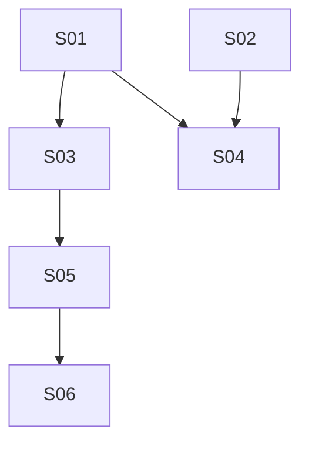

# M22 — Multi-Vertical Scheduling: Service Extensions & Availability Engine

**Phase:** Local Development
**Goal:** Extend `Service` with resource requirements, legs, buffer overrides, booking-intake schemas, and full booking policy; then build the shared `booking.resource_occupancy` exclusivity engine that both the extended `Service` configuration and every future booking flow depend on, plus the manager's combined multi-resource day grid.
**Depends on:** M21 (Multi-Vertical Scheduling: Foundation) — needs the `Resource` aggregate and resource-scoped schedule closures/openings.
**Blocks:** M23 (Appointment Booking & Extensions), M24 (Classes/Sessions) — both need `Service`'s resource/availability model to exist before a customer can actually book against it.
**Design rationale:** `docs/discovery/multivertical-booking/multivertical-booking.md` §3, §6b, §9 (promoted via `/discovery-to-milestone` on 2026-08-31) — kept as the permanent *why*; this file and the canonical docs it cites (`docs/04-USE_CASES.md` UC-050–060, `docs/02-DOMAIN_MODEL.md` § Booking Context `Service` aggregate + `IBookingAvailabilityPort`, `docs/13-DATABASE_SCHEMA.md`, `docs/14-API_CONTRACTS.md`) are the source of truth for implementation — nothing below should require opening the discovery doc to understand.

## Non-Goals

- **Every Cluster 3–4 concept** (recurring private reservations, availability alerts, future-commitment exceptions, no-show, tenant-onboarding bootstrap, class templates/sessions, contracts) — deferred to M23/M24. This milestone's `Service.classResourceSlots` field and UC-056's SESSION branch are schema-only: nothing consumes them until M24 ships `ClassScheduleTemplate`.
- **Actually booking a resource-scoped/bundled/legged appointment** (UC-061–068) — that's M23. This milestone only makes the *configuration* and *availability computation* possible; no customer-facing booking flow changes.
- **Cross-family exclusivity between an APPOINTMENT booking and a SESSION class** (UC-060's "Cross-Family from Cluster 4" case) — `booking.resource_occupancy`'s `CLASS_SESSION` source type is created inert in this milestone (the `class_session_id` FK target table doesn't exist until M24); only the `BOOKING_LINE` source type is reachable and testable now.
- **Per-tenant staged rollout of the `resource_occupancy` migration's contract phase** — `docs/13-DATABASE_SCHEMA.md`'s own migration-ordering note is explicit that this platform is pre-production with no per-tenant feature-flag mechanism, so the contract step (dropping `EX_booking_bookings_approved_slot`) applies to every tenant at once. **The implementing story must re-verify "no live tenants yet" immediately before executing that step, not just at drafting time.**

## Build order

| Wave | Story | Theme |
|---|---|---|
| 1 | M22-S01 | `Service` resource requirements/bundles/legs/buffer + booking-model-at-creation — backend + BFF (UC-050, 051, 052, 053, 056) |
| 1 | M22-S02 | `Service` booking-intake schema + booking policy — backend + BFF (UC-054, 055) |
| 2 | M22-S03 | `booking.resource_occupancy` exclusivity engine — availability port extension + expand/backfill/dual-write/validate/contract migration (UC-058, 059, 060) |
| 2 | M22-S04 | Manager "Serviços" resource-config extension frontend — resource requirements/bundles/legs/buffer panels |
| 3 | M22-S05 | Manager combined multi-resource day grid — backend + BFF (UC-057) |
| 4 | M22-S06 | Manager "Horários" day-grid frontend extension |

**Wave note:** M22-S04 (frontend) depends on both S01 and S02 (it needs the resource-requirement/legs/buffer endpoints from S01 *and* the intake-schema/booking-policy endpoints from S02 to build the full Servicos extension panel set per `plan/journey/staff/servicos.md`'s Cluster 2 section) — it is **not** gated on S03, since S03 is a pure backend/availability capability the Servicos config UI never calls directly. S04 is placed in Wave 2, in parallel with S03, not Wave 3.

**Likely-independent stories (preview — not authoritative):** S01 and S02 touch the same `service.aggregate.ts`/`service.entity.ts` files (different methods, no shared transaction) but have no `Dependencies:` edge between them and both depend only on M21 — a candidate `/run-batch` pair, accepting the file-overlap risk a batch normally excludes, since the two use-case sets never touch the same lines. S03 and S04 share no files (S03 touches availability/migration internals; S04 touches web dashboard components) and have no edge between them — also a candidate pair. `/run-batch` re-derives all of this live at run time; this is a courtesy preview, not a green light.

---

### M22-S01 — `Service` resource requirements/bundles/legs/buffer + booking-model-at-creation

**Agent:** `backend-ts` + `bff-ts`
**Complexity:** L
**Docs to load:** `docs/02-DOMAIN_MODEL.md` § Booking Context (`Service` aggregate extensions, `ResourceRequirement`/`ServiceLeg` VOs), `docs/13-DATABASE_SCHEMA.md` § `booking.services` (modified), `service_resource_requirements`/`service_resource_requirement_pool`, `service_legs`/`service_leg_resource_requirements`/`service_leg_resource_requirement_pool`, `service_class_resource_pool`, `docs/14-API_CONTRACTS.md` § Service Extensions — M21 Cluster 2, `docs/04-USE_CASES.md` UC-050, 051, 052, 053, 056
**Dependencies:** M21-S01 (`Resource` aggregate — `resourceRequirements`/pool entries reference `resources`), M21-S02 (LOCATION backfill — every existing service's degenerate default requirement references the backfilled `LOCATION` resource)
**Pattern:** plain composition — extends the existing `Service` aggregate and its existing use cases (`update-service.use-case.ts`, `create-service.use-case.ts`); no new named pattern.

**Description:**
Extend the existing `Service` aggregate (`apps/backend/src/contexts/booking/domain/service.aggregate.ts`) with `bookingModel: 'APPOINTMENT'|'SESSION'` (default `APPOINTMENT`, immutable once the service has bookings), `resourceRequirements: ResourceRequirement[]`, `bufferAfterMinutes: int|null`, `legs: ServiceLeg[]|null`, and `classResourceSlots: ClassResourceSlot[]|null` (this milestone only stores the field via UC-056's SESSION branch — nothing reads it until M24). Add the three new value objects (`ResourceRequirement`, `ServiceLeg`, `ClassResourceSlot`) to `apps/backend/src/contexts/booking/domain/` per `docs/02-DOMAIN_MODEL.md`'s exact shape.

**Aggregate invariants (enforced in `Service`'s own methods, not just the DB):**
- `bookingModel` is immutable once the service has any booking history (UC-056 A1) — the same "compare against current value, skip validation when unchanged" discipline `CLAUDE.md` §8's anti-pattern table already documents for other never-changing-once-set fields.
- `resourceRequirements`/`legs`/`classResourceSlots` are mutually exclusive: setting one clears the other two in the same save (UC-052 step 3's "system clears `resourceRequirements`/`bufferAfterMinutes`" applies symmetrically — setting `resourceRequirements` clears `legs`, setting `classResourceSlots` clears both).
- A bundle (`resourceRequirements.length > 1`) requires every listed resource type to have at least one active `Resource` (UC-051's own precondition, generalizing UC-050 A1's single-type error mechanism to the bundle case) — validated via `IResourceRepository.findByTenant(tenantId, { type, isActive: true })` (M21-S01), not a new lookup path.
- Fewer than 2 legs on a `PUT .../legs` call is rejected (UC-052 A1) — a single leg is just the flat model.
- `bufferAfterMinutes` is forced to `null` whenever `legs` is set (UC-053 A1) — legs use per-leg `transitionGapAfterMinutes` instead.

**Backend use case steps:**
1. **`UpdateServiceResourceRequirementsUseCase`** (UC-050, UC-051): loads service by `(tenantId, id)`, validates `bookingModel = APPOINTMENT` and the bundle-resource-existence invariant, replaces `resourceRequirements` wholesale (not a diff/patch), clears `legs`. `409 BOOKING_SERVICE_HAS_LEGS` if `legs` is currently set (UC-050 A2).
2. **`UpdateServiceLegsUseCase`** (UC-052): loads service, validates `legs.length >= 2` (`422 BOOKING_SERVICE_LEGS_TOO_FEW`), computes and returns the total span (`sum(durations) + sum(transitionGaps)`), clears `resourceRequirements`/`bufferAfterMinutes`.
3. **`UpdateServiceUseCase`** (extend, UC-053): existing use case gains `bufferAfterMinutes` as an updatable field; rejects the update with `409 BOOKING_SERVICE_HAS_LEGS` if `legs` is set (UC-053 A1) — field is meaningless there.
4. **`CreateServiceUseCase`** (extend, UC-056): existing use case gains `bookingModel` (default `APPOINTMENT`) and, when `SESSION`, `classResourceSlots` from the request body — no further validation beyond VO shape, since nothing consumes `classResourceSlots` until M24.
5. **`UpdateServiceUseCase`** (extend, UC-056 A1): reject a `bookingModel` change with `409 BOOKING_SERVICE_BOOKING_MODEL_IMMUTABLE` once the service has any booking history — check via the existing `IBookingRepository.existsByServiceId(tenantId, serviceId)`-shaped query (grep first; add the narrow existence method if it doesn't already exist rather than fetching full rows).

**Backend HTTP surface:** `PATCH /services/:id/resource-requirements` (new), `PUT /services/:id/legs` (new), `PATCH /services/:id` (existing, extended with `bufferAfterMinutes`), `POST /services` (existing, extended with `bookingModel`/`classResourceSlots`). Auth stays `STAFF|MANAGER` on every route per `docs/14-API_CONTRACTS.md`'s explicit note that Service management is not the MANAGER-only Resource Management restriction M21 introduced. Register new controller actions in the existing `apps/backend/src/contexts/booking/infrastructure/controllers/` service controller (grep for its exact current filename before adding — the use-case list above shows `service.aggregate.ts` and `*-service.use-case.ts` naming but the controller file itself wasn't independently re-verified at drafting time; confirm at implementation time).

**BFF endpoint spec:** extend `apps/bff/src/features/booking/services.controller.ts` + `services.schemas.ts` + `services.types.ts` with the two new actions and the two extended bodies, forwarding via `BackendHttpService`, same `STAFF|MANAGER` guard as every existing action in that controller. No new BFF module — `BookingServicesModule` (`apps/bff/src/features/booking/services.module.ts`) already hosts `ServicesController`.

**New migration / i18n keys / env vars / feature flags:** new migration `apps/backend/src/contexts/booking/infrastructure/migrations/<next-timestamp>-AddServiceResourceRequirementsAndLegs.ts` creating `services`' new columns (`booking_model`, `buffer_after_minutes`, `duration_policy`/`pricing_policy`-family columns are S02's own migration, not this one — see S02), `service_resource_requirements`+pool, `service_legs`+`service_leg_resource_requirements`+pool, `service_class_resource_pool`, all per `docs/13-DATABASE_SCHEMA.md`. Includes the backfill step: insert `{ resource_type: 'LOCATION', selection_mode: 'NONE' }` into `service_resource_requirements` for every existing APPOINTMENT service, referencing the M21-S02-backfilled `LOCATION` resource (`docs/13-DATABASE_SCHEMA.md`'s Cluster 2 migration-ordering step 2 — this story owns that backfill since it's the story that creates the target table; S03 owns the *rest* of the 5-phase ordering, which concerns `resource_occupancy`/`booking_line_resource_assignments`, not this table). Migration timestamps are global — the ceiling verified at this milestone's drafting is `1748500000006` (per M21-S01's own migration note); re-verify at implementation time since M21 may have landed its own migrations by then.

**Files to create/modify:**
- `apps/backend/src/contexts/booking/domain/service.aggregate.ts` (modify — new fields + invariants)
- `apps/backend/src/contexts/booking/domain/service.spec.ts` (modify)
- `apps/backend/src/contexts/booking/domain/resource-requirement.ts` (new — VO, `create()`/`reconstitute()`)
- `apps/backend/src/contexts/booking/domain/service-leg.ts` (new — VO)
- `apps/backend/src/contexts/booking/domain/class-resource-slot.ts` (new — VO, inert this milestone)
- `apps/backend/src/contexts/booking/domain/errors/booking-service.error.ts` (modify — add `BOOKING_SERVICE_HAS_LEGS`, `BOOKING_SERVICE_LEGS_TOO_FEW`, `BOOKING_SERVICE_BOOKING_MODEL_IMMUTABLE`, `BOOKING_SERVICE_RESOURCE_TYPE_UNAVAILABLE`)
- `apps/backend/src/contexts/booking/application/use-cases/update-service-resource-requirements.use-case.ts` (+ `.spec.ts`) (new)
- `apps/backend/src/contexts/booking/application/use-cases/update-service-legs.use-case.ts` (+ `.spec.ts`) (new)
- `apps/backend/src/contexts/booking/application/use-cases/update-service.use-case.ts` (+ `.spec.ts`) (modify — `bufferAfterMinutes`, `bookingModel` immutability check)
- `apps/backend/src/contexts/booking/application/use-cases/create-service.use-case.ts` (+ `.spec.ts`) (modify — `bookingModel`, `classResourceSlots`)
- `apps/backend/src/contexts/booking/infrastructure/entities/service.entity.ts` (modify — new columns, new child entity relations)
- `apps/backend/src/contexts/booking/infrastructure/entities/service-resource-requirement.entity.ts` (+ pool) (new)
- `apps/backend/src/contexts/booking/infrastructure/entities/service-leg.entity.ts` (+ requirement + pool) (new)
- `apps/backend/src/contexts/booking/infrastructure/entities/service-class-resource-pool.entity.ts` (new)
- `apps/backend/src/contexts/booking/infrastructure/repositories/typeorm-service.repository.ts` (+ `.spec.ts`) (modify — persist/hydrate new child tables in the same transaction as the parent save)
- `apps/backend/src/contexts/booking/infrastructure/controllers/*service*.controller.ts` (+ `.spec.ts`, `.integration.spec.ts`) (modify — exact filename verified at implementation time; grep `apps/backend/src/contexts/booking/infrastructure/controllers/` for the current service controller)
- `apps/backend/src/contexts/booking/infrastructure/migrations/<timestamp>-AddServiceResourceRequirementsAndLegs.ts` (new)
- `apps/backend/http/booking/services.http` (modify — add resource-requirements/legs examples)
- `packages/types/src/error-codes.ts` (modify — add the 4 new codes to `BookingErrorCode`)
- `packages/i18n/locales/pt-BR/errors.json` + `.../en/errors.json` (modify — translation entries for all 4)
- `apps/bff/src/features/booking/services.controller.ts` (+ `.spec.ts`, `.component.spec.ts`) (modify)
- `apps/bff/src/features/booking/services.schemas.ts` (modify — 2 new body schemas, 2 extended)
- `apps/bff/src/features/booking/services.types.ts` (modify)
- `apps/bff/http/booking/services.http` (modify, if it exists as a separate BFF-side file — verify at implementation time)

**Acceptance criteria — product:**
- [ ] Admin can set a flat resource requirement (single type + selection mode), a bundle (2+ types), or switch to legs — each replaces the others.
- [ ] Admin cannot save a bundle referencing a resource type with zero active resources.
- [ ] Admin cannot save fewer than 2 legs via the legs endpoint.
- [ ] Admin can set/override the service's buffer minutes; the field is disabled/rejected once the service has legs.
- [ ] Admin can create a service as `APPOINTMENT` (default, unchanged from today) or `SESSION`; cannot change `bookingModel` once the service has any booking.
- [ ] Every pre-existing service defaults to `{ resourceRequirements: [{ type: LOCATION, selectionMode: NONE }] }` after this story's migration — today's car-wash behavior is byte-identical (explicit non-regression AC).

**Acceptance criteria — technical:**
- Unit:
  - [ ] `Service` rejects a bundle referencing a resource type with no active resources
  - [ ] `Service` clears `legs` when `resourceRequirements` is set and vice versa
  - [ ] `UpdateServiceLegsUseCase` rejects fewer than 2 legs
  - [ ] `UpdateServiceUseCase` rejects a `bufferAfterMinutes` update when the service has `legs`
  - [ ] `UpdateServiceUseCase`/`CreateServiceUseCase` reject a `bookingModel` change once the service has booking history, but allow an unchanged resubmission of the same value (compare-before-validate, per `CLAUDE.md` §8)
- Integration:
  - [ ] `PATCH /services/:id/resource-requirements` persists the requirement + pool rows and is retrievable via `GET /services/:id`
  - [ ] `PUT /services/:id/legs` persists ordered legs with their own nested resource requirements
  - [ ] The migration's backfill: every pre-existing APPOINTMENT service has exactly one `service_resource_requirements` row (`LOCATION`/`NONE`) referencing the M21 backfilled `LOCATION` resource after this migration runs
- Tenant isolation:
  - [ ] A `resourcePoolIds` entry belonging to another tenant is rejected, never silently accepted
  - [ ] `PATCH .../resource-requirements` / `PUT .../legs` for a cross-tenant service id returns `404`
- E2E: none — covered by unit/integration; the frontend E2E lands with S04
- [ ] Coverage ≥80% on changed code
- [ ] `tsc --noEmit` clean, lint clean

---

### M22-S02 — `Service` booking-intake schema + booking policy

**Agent:** `backend-ts` + `bff-ts`
**Complexity:** M
**Docs to load:** `docs/02-DOMAIN_MODEL.md` § Booking Context (`Service` policy fields, `durationPolicy`/`pricingPolicy`), `docs/13-DATABASE_SCHEMA.md` § `booking.services` (modified — policy columns), `service_booking_intake_schema`/`booking_attendees`, `docs/14-API_CONTRACTS.md` § Service Extensions — M21 Cluster 2, `docs/04-USE_CASES.md` UC-054, 055, `docs/21-TENANTS_SETTINGS_SCHEMA.md` (booking policy defaults this story's `null` fields inherit from)
**Dependencies:** M21-S01 (`Resource` aggregate — not directly referenced by this story's fields, but the `Service` aggregate this story extends is the same one M22-S01 also extends, so both stories require M21 to have landed first)
**Pattern:** plain composition — extends the existing `Service` aggregate and `update-service.use-case.ts`; new `service_booking_intake_schema` is append-only/versioned, matching the platform's existing versioned-config precedent (e.g. `HotsiteConfig` history), no new named pattern.

**Description:**
Extend `Service` with the booking-policy fields (`defaultApprovalMode`, `manualHoldMinutes`, `cancellationWindowHoursOverride`, `rescheduleWindowHoursOverride`, `minBookingAdvanceHoursOverride`, `maxBookingAdvanceDaysOverride`, `recurrenceEligible`, `availabilityAlertEligible`) and the variable-duration fields (`durationPolicy`, `durationMinMinutes`, `durationMaxMinutes`, `durationIncrementMinutes`, `pricingPolicy`, `pricingIncrementMinutes`, `pricePerIncrementAmount`, `minimumChargeAmount`) per `docs/02-DOMAIN_MODEL.md`. Add the versioned `service_booking_intake_schema` (+ `booking_attendees` child, reachable once a booking actually submits attendees in M23) as a new small aggregate or value-object-backed entity owned by `Service`'s bounded context, following this platform's existing "new version supersedes, never edits" convention.

**Open item for the implementing story (found while drafting, not resolved here):** `docs/02-DOMAIN_MODEL.md` documents `defaultApprovalMode: null` as inheriting the tenant's `autoApproveEnabled` setting, but `docs/21-TENANTS_SETTINGS_SCHEMA.md` currently documents `autoApproveEnabled` as **"Reserved — post-MVP only. Currently ignored."** The implementing story must resolve this directly with the user/story-discovery before writing the inheritance logic — either `autoApproveEnabled` is being activated as a real setting by this story (a scope addition beyond what Cluster 2's own UC-055 text states), or `defaultApprovalMode: null` needs a different, currently-real fallback (e.g. always `MANUAL_APPROVAL` until `autoApproveEnabled` itself is activated in a later milestone). Do not silently pick one.

**Aggregate invariants:**
- `durationPolicy = CUSTOMER_SELECTED` requires a non-null, non-`FIXED` `pricingPolicy` in the same save (UC-055 A2) — `422 BOOKING_SERVICE_DURATION_POLICY_REQUIRES_PRICING`.
- A policy-field edit never retroactively affects an in-flight booking (UC-055 A1) — enforced structurally by having bookings snapshot the effective value at submission time (M23's concern to consume; this story's concern is only to persist the policy correctly).

**Backend use case steps:**
1. **`UpdateServiceBookingPolicyUseCase`** (UC-055): loads service, validates the duration/pricing-policy pairing invariant, saves all policy fields atomically. `422 BOOKING_SERVICE_DURATION_POLICY_REQUIRES_PRICING` on violation.
2. **`PublishServiceIntakeSchemaUseCase`** (UC-054): loads service, validates `bookingModel = APPOINTMENT`, sets the currently-active schema version's `is_active = false` (if one exists) and inserts a new row with `version = previousVersion + 1`, `is_active = true`, in the same transaction. Also sets `services.requires_pickup_address = true` in the same transaction when a `PICKUP_ADDRESS`-typed question is present (UC-054 A2) — reuses the existing `requires_pickup_address` column, no new duplicate flag.

**Backend HTTP surface:** `PATCH /services/:id/booking-policy` (new), `POST /services/:id/intake-schema` (new). Same controller as S01, same `STAFF|MANAGER` guard.

**BFF endpoint spec:** extend `apps/bff/src/features/booking/services.controller.ts` + `services.schemas.ts` with the two new actions, same forwarding pattern as S01.

**New migration / i18n keys / env vars / feature flags:** new migration `apps/backend/src/contexts/booking/infrastructure/migrations/<next-timestamp>-AddServiceBookingPolicyAndIntakeSchema.ts` — every `services` policy/duration/pricing column from `docs/13-DATABASE_SCHEMA.md`'s table, `service_booking_intake_schema`, `booking_attendees`, and the two new `bookings` columns pairs (`intake_schema_version`/`intake_answers`, `participant_count`/`consent_accepted_at`/`consent_version` — these `bookings` columns are added by this story since they belong to the same schema-versioning concept, even though nothing writes them until M23's booking flow exists). Sequenced after S01's migration (both modify `services`, applied in wave order). Verify the current migration ceiling at implementation time.

**Files to create/modify:**
- `apps/backend/src/contexts/booking/domain/service.aggregate.ts` (modify — policy + duration/pricing fields)
- `apps/backend/src/contexts/booking/domain/service.spec.ts` (modify)
- `apps/backend/src/contexts/booking/domain/service-booking-intake-schema.ts` (new — small versioned entity/VO)
- `apps/backend/src/contexts/booking/domain/errors/booking-service.error.ts` (modify — add `BOOKING_SERVICE_DURATION_POLICY_REQUIRES_PRICING`)
- `apps/backend/src/contexts/booking/application/use-cases/update-service-booking-policy.use-case.ts` (+ `.spec.ts`) (new)
- `apps/backend/src/contexts/booking/application/use-cases/publish-service-intake-schema.use-case.ts` (+ `.spec.ts`) (new)
- `apps/backend/src/contexts/booking/application/ports/service-intake-schema-repository.port.ts` (new)
- `apps/backend/src/contexts/booking/infrastructure/entities/service.entity.ts` (modify — new columns)
- `apps/backend/src/contexts/booking/infrastructure/entities/service-booking-intake-schema.entity.ts` (+ `booking-attendee.entity.ts`) (new)
- `apps/backend/src/contexts/booking/infrastructure/entities/booking.entity.ts` (modify — new nullable columns)
- `apps/backend/src/contexts/booking/infrastructure/repositories/typeorm-service-intake-schema.repository.ts` (+ `.spec.ts`) (new)
- `apps/backend/src/contexts/booking/infrastructure/controllers/*service*.controller.ts` (+ `.spec.ts`, `.integration.spec.ts`) (modify — same file as S01, sequence the two stories' edits or coordinate if run in parallel per the Wave-note preview)
- `apps/backend/src/contexts/booking/infrastructure/migrations/<timestamp>-AddServiceBookingPolicyAndIntakeSchema.ts` (new)
- `apps/backend/http/booking/services.http` (modify)
- `packages/types/src/error-codes.ts` (modify — add `BOOKING_SERVICE_DURATION_POLICY_REQUIRES_PRICING`)
- `packages/i18n/locales/pt-BR/errors.json` + `.../en/errors.json` (modify)
- `apps/bff/src/features/booking/services.controller.ts` (+ `.spec.ts`, `.component.spec.ts`) (modify)
- `apps/bff/src/features/booking/services.schemas.ts` (modify)
- `apps/bff/src/features/booking/services.types.ts` (modify)

**Acceptance criteria — product:**
- [ ] Admin can set approval mode, cancellation/reschedule/advance-booking windows, and recurrence/alert eligibility toggles; leaving a field blank inherits the current tenant default.
- [ ] Admin cannot save `durationPolicy = CUSTOMER_SELECTED` without a non-`FIXED` `pricingPolicy`.
- [ ] Admin can publish a new intake-schema version; the previous version is preserved, not overwritten.
- [ ] A `PICKUP_ADDRESS`-typed intake question automatically sets the service's existing pickup-address flag.

**Acceptance criteria — technical:**
- Unit:
  - [ ] `Service` rejects `durationPolicy = CUSTOMER_SELECTED` with `pricingPolicy = FIXED` or null
  - [ ] `PublishServiceIntakeSchemaUseCase` deactivates the previous version and activates the new one atomically
  - [ ] `PublishServiceIntakeSchemaUseCase` sets `requires_pickup_address = true` when a `PICKUP_ADDRESS` question is included
- Integration:
  - [ ] `PATCH /services/:id/booking-policy` persists all fields and round-trips via `GET /services/:id`
  - [ ] `POST /services/:id/intake-schema` twice in sequence: second call deactivates the first version, both remain queryable by version
- Tenant isolation:
  - [ ] Booking-policy and intake-schema endpoints for a cross-tenant service id return `404`
- E2E: none — covered by unit/integration; the frontend E2E lands with S04
- [ ] Coverage ≥80% on changed code
- [ ] `tsc --noEmit` clean, lint clean

---

### M22-S03 — `booking.resource_occupancy` exclusivity engine

**Agent:** `backend-ts`
**Complexity:** L
**Docs to load:** `docs/02-DOMAIN_MODEL.md` § `IBookingAvailabilityPort` (Changed by M21 Cluster 2), UC-058/059/060 algorithm notes, `docs/13-DATABASE_SCHEMA.md` § `booking.booking_line_resource_assignments` and `booking.resource_occupancy` (full GIST exclusion DDL + 5-phase migration ordering), `docs/04-USE_CASES.md` UC-058, 059, 060
**Dependencies:** M22-S01 (needs `service_resource_requirements`/`service_legs` to exist — this story's backfill/dual-write logic reads them; also needs the `Service` aggregate's new fields to know which resources a booking's service requires)
**Pattern:** Port + Adapter, extending the existing `IBookingAvailabilityPort`/`TypeOrmBookingAvailabilityAdapter` pair — no new named pattern, but this is the single largest schema change in the milestone (a shared GIST exclusion constraint plus a 5-phase expand/backfill/dual-write/validate/contract migration, per `docs/13-DATABASE_SCHEMA.md`).

**Description:**
Replace `IBookingAvailabilityPort`'s current tenant-wide, `bookings`-querying shape (`findApprovedByTenantAndDate`/`findApprovedByTenantAndDateRange` returning `BookedSlot[]`) with the resource-scoped shape `docs/02-DOMAIN_MODEL.md` specifies: `findOccupancyByTenantAndResource(tenantId, resourceIds, from, to): Promise<ResourceOccupiedSlot[]>`, backed by a new `booking.resource_occupancy` table with a shared GIST exclusion constraint spanning both the `BOOKING_LINE` source type (reachable now) and `CLASS_SESSION` (inert until M24). `bookings`/`booking_lines` remain the source of truth for the booking itself; `resource_occupancy` is a short-lived, garbage-collectable locking projection.

Create `booking.booking_line_resource_assignments` (the immutable audit record for a booking line's resolved resource(s)) alongside it. `AvailabilityService`/`get-availability.use-case.ts` and `get-availability-summary.use-case.ts` are updated to call the new port method for any service whose `resourceRequirements`/`legs` reference something other than the `LOCATION`/`NONE` degenerate default, implementing UC-058's intersection (bundle)/union (fungible pool) algorithm and UC-059's turnover/transition-gap arithmetic. `EX_booking_bookings_approved_slot` (today's whole-tenant exclusion constraint) is retired only in the migration's final contract phase.

**Migration ordering (execute as separate, sequenced migration files within this story — mirrors `docs/13-DATABASE_SCHEMA.md`'s own expand/backfill/dual-write/validate/contract phases exactly, not collapsed into one migration):**
1. **Expand:** create `booking_line_resource_assignments`, `resource_occupancy` (with the GIST exclusion constraint), `UNIQUE(tenant_id, line_id)` on `booking_lines`. Do not drop `EX_booking_bookings_approved_slot` yet.
2. **Backfill:** for every existing `APPROVED` booking, insert a `booking_line_resource_assignments` row (against the `LOCATION` resource, `leg_index = null`) and a matching `COMMITTED` `resource_occupancy` row.
3. **Dual-read/write:** new booking creation/approval writes populate `resource_occupancy` in the same transaction as today's write; availability reads switch to the new port method. The old exclusion constraint stays live through this window as a safety net.
4. **Validate:** an integration test (and, per the doc's own instruction, a manual pre-deploy check) confirms every `APPROVED` booking has exactly one matching `resource_occupancy` row and no cross-tenant row exists.
5. **Contract:** drop `EX_booking_bookings_approved_slot` only after step 4 passes. **Re-verify "no live tenants yet" immediately before this step, per this milestone's Non-Goals section** — do not treat the drafting-time assumption as still true at implementation time without checking.

**Backend use case steps:**
1. **`TypeOrmBookingAvailabilityAdapter`** (extend/replace): implement `findOccupancyByTenantAndResource` against `resource_occupancy`; keep the two existing tenant-wide methods only as long as any caller still needs them (expected: none, once `AvailabilityService` is fully migrated — confirm and remove dead code in this same story, don't leave an unused method behind).
2. **`AvailabilityService`** (`domain/services/availability.service.ts`, extend): branch on whether the queried service has non-default `resourceRequirements`/`legs`; if so, compute per-resource occupancy via the new port method and apply UC-058's intersection/union algorithm and UC-059's `max(bufferAfterMinutes, turnoverMinutes)` / per-leg-transition-gap arithmetic; otherwise, unchanged behavior (today's whole-tenant path, now backed by the `LOCATION`-resource-scoped occupancy instead of raw `bookings`, but producing byte-identical results for the degenerate case).
3. **Booking creation/approval path** (`create-booking.use-case.ts`/`approve-booking.use-case.ts` or equivalent — grep for the exact current use-case names before citing): extend to resolve the service's resource requirement(s) into concrete `resourceId`(s) (using `IResourceRepository.findByTenant` + the selection-mode algorithm), insert `booking_line_resource_assignments` + `resource_occupancy` (`HOLD` for a manual-approval booking pending approval, `COMMITTED` for `AUTO_CONFIRM` or on approval) in the same transaction as the booking write. **Per `CLAUDE.md` §7's transaction invariant, this stays entirely inside `txManager.run()` as ordinary DB writes — no cross-service network I/O is introduced here.**

**Backend HTTP surface:** none new — `GET /schedule/availability` (UC-011) and `GET /schedule/availability-summary` are unchanged in request/response shape; only their internal implementation changes, per `docs/14-API_CONTRACTS.md`'s explicit note.

**BFF endpoint spec:** none — no BFF-visible contract change.

**New migration / i18n keys / env vars / feature flags:** the 5 migration files described above. No new i18n/env/flags.

**Files to create/modify:**
- `apps/backend/src/contexts/booking/application/ports/booking-availability.port.ts` (modify — new method signature; remove old ones once confirmed unused)
- `apps/backend/src/contexts/booking/domain/booked-slot.ts` (modify or replace with `resource-occupied-slot.ts` per the doc's renamed shape — verify at implementation time whether to rename or add alongside)
- `apps/backend/src/contexts/booking/domain/services/availability.service.ts` (+ `.spec.ts`) (modify — resource-scoped algorithm)
- `apps/backend/src/contexts/booking/infrastructure/cross-context/typeorm-booking-availability.adapter.ts` (+ `.spec.ts`) (modify)
- `apps/backend/src/contexts/booking/infrastructure/entities/booking-line-resource-assignment.entity.ts` (new)
- `apps/backend/src/contexts/booking/infrastructure/entities/resource-occupancy.entity.ts` (new)
- `apps/backend/src/contexts/booking/infrastructure/entities/booking-line.entity.ts` (modify — `UNIQUE(tenant_id, line_id)`)
- `apps/backend/src/contexts/booking/infrastructure/repositories/typeorm-resource-occupancy.repository.ts` (+ `.spec.ts`) (new)
- `apps/backend/src/contexts/booking/application/use-cases/*booking*.use-case.ts` (modify — whichever create/approve booking use cases exist; verify exact filenames at implementation time)
- `apps/backend/src/contexts/booking/infrastructure/migrations/<timestamp>-01-CreateResourceOccupancy.ts` (new — expand phase)
- `apps/backend/src/contexts/booking/infrastructure/migrations/<timestamp>-02-BackfillResourceOccupancy.ts` (new — backfill phase)
- `apps/backend/src/contexts/booking/infrastructure/migrations/<timestamp>-03-DropTenantWideExclusion.ts` (new — contract phase; guarded, per the description above, by a manual re-verification step documented in the migration's own comment)

**Acceptance criteria — product:**
- [ ] Two different APPOINTMENT services sharing the same `STAFF`/`ROOM`/`EQUIPMENT` resource cannot be double-booked for overlapping windows (UC-060, same-family).
- [ ] A service with a fungible resource pool shows availability whenever *any* pool member is free; a bundled service shows availability only when *every* required resource is free.
- [ ] Existing car-wash-style tenant-wide behavior is byte-identical after this migration completes (explicit non-regression AC — the whole point of the dual-write/validate/contract sequence).

**Acceptance criteria — technical:**
- Unit:
  - [ ] `AvailabilityService` computes intersection availability correctly for a 2-resource bundle
  - [ ] `AvailabilityService` computes union availability correctly for a fungible pool
  - [ ] `AvailabilityService` applies `max(bufferAfterMinutes, turnoverMinutes)` for a flat service and per-leg turnover + `transitionGapAfterMinutes` for a legged service
- Integration:
  - [ ] The GIST exclusion constraint rejects a genuinely overlapping `resource_occupancy` insert at the DB level (not just at the query layer) — a real concurrent-insert test, not just a query-time check
  - [ ] Backfill migration: every pre-existing `APPROVED` booking has exactly one `booking_line_resource_assignments` + `COMMITTED resource_occupancy` row after running
  - [ ] Adjacent (non-overlapping, touching) windows on the same resource do not conflict (UC-060 A1)
  - [ ] A booking being edited never conflicts with its own existing commitment (UC-060 A2)
- Tenant isolation:
  - [ ] The exclusion constraint is scoped by `tenant_id` — two different tenants' bookings on what would otherwise look like "the same resource id" (impossible by FK, but verify the constraint's own column list includes `tenant_id`) never conflict
- E2E: none — covered by unit/integration; no direct frontend surface
- [ ] Coverage ≥80% on changed code
- [ ] `tsc --noEmit` clean, lint clean

---

### M22-S04 — Manager "Serviços" resource-config extension frontend

**Agent:** `frontend-ts`
**Complexity:** M
**Docs to load:** `docs/16-DASHBOARD_FRONTEND_ARCHITECTURE.md`, `docs/24-BFF_ARCHITECTURE.md` § Web → BFF Transport Layer, `docs/14-API_CONTRACTS.md` § Service Extensions — M21 Cluster 2
**Dependencies:** M22-S01 (resource-requirements/legs/buffer endpoints), M22-S02 (intake-schema/booking-policy endpoints)
**Pattern:** plain composition — extends the existing, shipped Servicos edit page (`ServiceEditPage.tsx`/`ServiceEditPanels.tsx`); no new pattern.
**Prototype references:** `plan/journey/staff/servicos.md` (M21 Cluster 2 extension section), `plan/journey/staff/prototypes/servicos/04-service-resource-config.html`, `05-service-booking-policies.html`, `05b-service-booking-policies-erro.html`, `dev-notes.md`'s own ❓ GAP section (flags UC-054/intake-schema as having no dedicated prototype screen)

**Description:**
Extend the existing Servicos edit flow — `apps/web/features/booking/components/dashboard/services/ServiceEditPage.tsx` and its section components in `ServiceEditPanels.tsx` (which already exports discrete section components like `ServiceEditStatusSection`, not one monolithic panel) — with new sections for resource requirements/bundles/legs/buffer (from `04-service-resource-config.html`) and booking policy (from `05-service-booking-policies.html`/`05b-...-erro.html`). Data fetching in this feature is server-rendered-props-based, not client React Query hooks (`ServiceListPage`/`ServiceEditPage` receive services as props from their `page.tsx`, fetched via `apps/web/features/booking/api/services.ts`'s plain async functions) — follow that existing convention, don't introduce a new client-fetching pattern for this one feature.

The booking-intake schema (UC-054) has no discovery-stage prototype (flagged in `dev-notes.md`) — design its editor from the resource-config panel's own question-list-builder interaction shape (`04-service-resource-config.html`'s pool-picker pattern generalizes reasonably to an ordered question list), not from scratch, and confirm the exact layout with the user/story-discovery before building it since it's genuinely new UI, not a straight prototype-to-code port like the other two panels.

**Files to create/modify:**
- `apps/web/features/booking/api/services.ts` (modify — add `updateServiceResourceRequirements`, `updateServiceLegs`, `updateServiceBookingPolicy`, `publishServiceIntakeSchema` functions, matching the existing plain-async-function shape)
- `apps/web/features/booking/components/dashboard/services/ServiceResourceRequirementsPanel.tsx` (+ `.spec.tsx`) (new)
- `apps/web/features/booking/components/dashboard/services/ServiceLegsPanel.tsx` (+ `.spec.tsx`) (new)
- `apps/web/features/booking/components/dashboard/services/ServiceBookingPolicyPanel.tsx` (+ `.spec.tsx`) (new)
- `apps/web/features/booking/components/dashboard/services/ServiceIntakeSchemaPanel.tsx` (+ `.spec.tsx`) (new — design confirmed with user before building, per Description)
- `apps/web/features/booking/components/dashboard/services/ServiceEditPage.tsx` (+ `.spec.tsx`) (modify — compose the new panels)
- `apps/web/features/booking/types/service.ts` (modify or new — grep `@ikaro/types` first per `CLAUDE.md` §8's anti-pattern table before inventing a duplicate shape)
- `packages/i18n/locales/pt-BR/web.json` + `.../en/web.json` (modify — new keys under the existing `dashboard.servicesPage` namespace, confirmed against `ServiceEditPanels.tsx`'s real `useTranslations('dashboard.servicesPage')` usage; no hardcoded visible text per `CLAUDE.md` §7 Testing)

**Acceptance criteria — product:**
- [ ] Admin can configure a flat resource requirement, a bundle, or switch to legs from the service edit page, matching the prototype's flows.
- [ ] Admin can set the service's buffer minutes when not legged; the field is visibly disabled once legs are set.
- [ ] Admin can set booking policy fields, with clear inline validation for the variable-duration-without-pricing error case (`05b-service-booking-policies-erro.html`).
- [ ] Admin can publish a new intake-schema version and see the previous version preserved as history.
- [ ] All new UI copy is localized in both pt-BR and en in this same commit.

**Acceptance criteria — technical:**
- Unit:
  - [ ] `ServiceResourceRequirementsPanel` type/selection-mode switcher matches prototype interactivity
  - [ ] `ServiceLegsPanel` computes and displays the total span client-side matching the backend's own formula
  - [ ] `ServiceBookingPolicyPanel` surfaces the 422 variable-duration-without-pricing error inline
- Integration: n/a — no `.integration.spec.ts` tier for `apps/web`
- Tenant isolation: n/a — no tenant-data-shaping logic lives client-side
- E2E:
  - [ ] Playwright: admin configures a bundled resource requirement, saves, reloads, sees it persisted
  - [ ] Playwright: admin switches a service to legs, adds 2 legs, sees the computed total span
  - [ ] Playwright: admin publishes a new intake-schema version, sees the previous version in history
- [ ] Coverage ≥80% on changed code
- [ ] `tsc --noEmit` clean, lint clean

---

### M22-S05 — Manager combined multi-resource day grid — backend + BFF

**Agent:** `backend-ts` + `bff-ts`
**Complexity:** M
**Docs to load:** `docs/04-USE_CASES.md` UC-057, `docs/14-API_CONTRACTS.md` § `GET /schedule/day-grid`, `docs/02-DOMAIN_MODEL.md` § Booking Context (`Resource`, `booking_line_resource_assignments`)
**Dependencies:** M22-S03 (`booking_line_resource_assignments` — the day grid needs to know which resource each existing booking is assigned to; without S03's backfill, no pre-existing booking has a resource assignment to display)
**Pattern:** plain composition — a new read-only query use case, following the shape of the existing `get-availability-summary.use-case.ts`; no new pattern.

**Description:**
Add `GET /schedule/day-grid?date=` (MANAGER only): for every active `Resource` (any type), return a column with `{ resourceId, name, type, blocks: [{ startsAt, endsAt, kind: 'BOOKING'|'CLASS_SESSION', refId }] }`. In this milestone, `kind` is always `'BOOKING'` — `'CLASS_SESSION'` becomes reachable once M24 ships `class_sessions`, but the response shape includes it now so M24 doesn't need a breaking contract change later. Query `booking_line_resource_assignments` joined to `bookings`/`booking_lines` for the requested date, grouped by `resource_id`.

**Backend use case steps:**
1. **`GetScheduleDayGridUseCase`** (UC-057): `findActiveResources(tenantId)` (M21-S01's `IResourceRepository`), then for each, query assigned bookings for the date via a new repository method on `IBookingLineResourceAssignmentRepository` (or extend the existing booking repository — verify the least-duplicative option at implementation time), assemble the grid response.

**Backend HTTP surface:** new controller action `GET /schedule/day-grid` — `MANAGER`-only (`@Roles('MANAGER')`), matching UC-057's explicit manager-only restriction (same tier as Resource Management, distinct from the `STAFF|MANAGER` Service management surface). Register in the existing schedule controller (grep `apps/backend/src/contexts/booking/infrastructure/controllers/` for the current schedule-availability controller shape and add alongside it, or create a new `schedule-day-grid.controller.ts` matching that file's own one-action-per-file convention — verify the real convention at implementation time before choosing).

**BFF endpoint spec:** new action on `apps/bff/src/features/booking/schedule.controller.ts` (or a new `schedule-day-grid.controller.ts` mirroring the BFF's existing `schedule-availability.controller.ts`/`schedule-availability-summary.controller.ts` one-action-per-file split — match whichever convention the backend side settles on), `MANAGER`-only guard, forwarding via `BackendHttpService`.

**New migration / i18n keys / env vars / feature flags:** none — read-only, no schema change.

**Files to create/modify:**
- `apps/backend/src/contexts/booking/application/use-cases/get-schedule-day-grid.use-case.ts` (+ `.spec.ts`) (new)
- `apps/backend/src/contexts/booking/application/dtos/get-schedule-day-grid.dto.ts` (new)
- `apps/backend/src/contexts/booking/infrastructure/controllers/schedule-day-grid.controller.ts` (+ `.spec.ts`, `.integration.spec.ts`) (new — or extend an existing schedule controller; verify convention at implementation time)
- `apps/bff/src/features/booking/schedule-day-grid.controller.ts` (+ `.spec.ts`, `.component.spec.ts`) (new — or extend `schedule.controller.ts`; verify convention at implementation time)
- `apps/bff/src/features/booking/schedule-day-grid.schemas.ts` (new)
- `apps/bff/http/booking/schedule-day-grid.http` (new)
- `apps/backend/http/booking/schedule-day-grid.http` (new)

**Acceptance criteria — product:**
- [ ] Manager sees a grid with one column per active resource and correctly placed occupied blocks for the selected day.
- [ ] STAFF-role users get `403` on this endpoint (MANAGER-only, matching UC-057's explicit restriction).
- [ ] A tenant with fewer than 2 active resources still returns a valid (single- or zero-column) response, not an error.

**Acceptance criteria — technical:**
- Unit:
  - [ ] `GetScheduleDayGridUseCase` assembles one column per active resource, empty `blocks` for an unoccupied resource
- Integration:
  - [ ] `GET /schedule/day-grid?date=` returns real booking blocks for resources with assigned bookings on that date
- Tenant isolation:
  - [ ] Day grid for tenant A never includes tenant B's resources or bookings
- E2E: none — covered by unit/integration; the frontend E2E lands with S06
- [ ] Coverage ≥80% on changed code
- [ ] `tsc --noEmit` clean, lint clean

---

### M22-S06 — Manager "Horários" day-grid frontend extension

**Agent:** `frontend-ts`
**Complexity:** M
**Docs to load:** `docs/16-DASHBOARD_FRONTEND_ARCHITECTURE.md`, `docs/14-API_CONTRACTS.md` § `GET /schedule/day-grid`, `docs/08-TESTING_STRATEGY.md`
**Dependencies:** M22-S05 (day-grid BFF endpoint)
**Pattern:** plain composition — "Horários" is role-adaptive per `plan/journey/staff/horarios.md`'s own note (a STAFF viewer gets the resource-scoped timeline from M21-S05; a MANAGER viewer gets this grid instead, same nav entry); no new pattern.
**Prototype references:** `plan/journey/staff/horarios.md` (M21 Cluster 2 addition section), `plan/journey/staff/prototypes/horarios/08-visao-geral-manager.html`, `dev-notes.md`

**Description:**
Add the manager-only day-grid view to the existing "Horários" page (`apps/web/features/booking/components/dashboard/schedule/SchedulePage.tsx`, extended by M21-S05 with a `ResourcePicker`). A `MANAGER`-role viewer sees the combined grid (this story) instead of M21-S05's single-resource-scoped timeline; a `STAFF`-role viewer is unaffected. Per `plan/journey/staff/horarios.md`'s own open item, the implementing story decides whether the grid and the M21-S05 single-resource timeline share one route with a role-based internal toggle or are fully separate routes — resolve this with story-discovery, don't assume either silently.

**Files to create/modify:**
- `apps/web/features/booking/components/dashboard/schedule/DayGridPage.tsx` (+ `.spec.tsx`) (new)
- `apps/web/features/booking/components/dashboard/schedule/SchedulePage.tsx` (modify — role-based branch to `DayGridPage` for MANAGER, per the routing decision above)
- `apps/web/features/booking/api/schedule.ts` (modify — add `getScheduleDayGrid` function; verify this file's exact name/location per M21-S05's own note)
- `packages/i18n/locales/pt-BR/web.json` + `.../en/web.json` (modify — day-grid copy under `dashboard.schedule`, same namespace M21-S05/S04 already extended)

**Acceptance criteria — product:**
- [ ] Manager opening "Horários" sees the combined multi-resource grid for the selected day.
- [ ] Manager can click any occupied block to drill into that booking's detail.
- [ ] Staff opening "Horários" is unaffected — still sees M21-S05's resource-scoped timeline.
- [ ] A tenant-type filter (Profissionais/Salas/Equipamentos) narrows visible columns when there are too many resources to fit (UC-057 A1).

**Acceptance criteria — technical:**
- Unit:
  - [ ] `DayGridPage` renders one column per resource with correctly positioned blocks
  - [ ] The resource-type filter hides/shows columns correctly
- Integration: n/a — no `.integration.spec.ts` tier for `apps/web`
- Tenant isolation: n/a — client-side; server-side isolation already covered by S05
- E2E:
  - [ ] Playwright: manager opens Horários, sees the grid, clicks a block, is taken to the booking detail
  - [ ] Playwright: staff opens Horários, sees the resource-scoped timeline (M21-S05), not the grid
- [ ] Coverage ≥80% on changed code
- [ ] `tsc --noEmit` clean, lint clean
