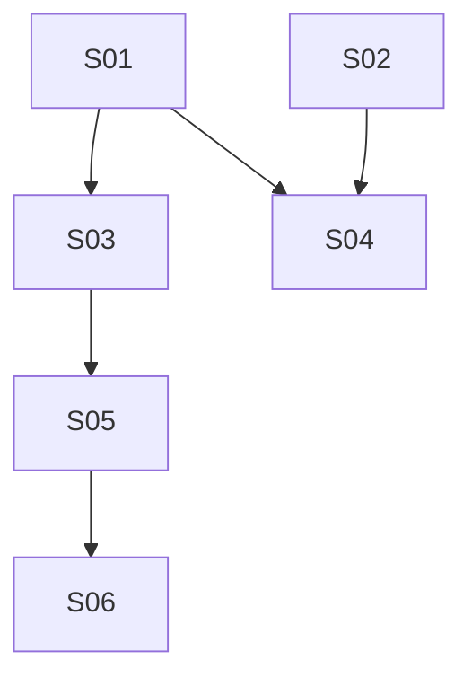

# M22 — Multi-Vertical Scheduling: Service Extensions & Availability Engine

**Phase:** Local Development
**Goal:** Extend `Service` with resource requirements, legs, buffer overrides, booking-intake schemas, and full booking policy; then build the shared `booking.resource_occupancy` exclusivity engine that both the extended `Service` configuration and every future booking flow depend on, plus the manager's combined multi-resource day grid.
**Depends on:** M21 (Multi-Vertical Scheduling: Foundation) — needs the `Resource` aggregate and resource-scoped schedule closures/openings.
**Blocks:** M23 (Appointment Booking & Extensions), M24 (Classes/Sessions) — both need `Service`'s resource/availability model to exist before a customer can actually book against it.
**Design rationale:** `docs/discovery/multivertical-booking/multivertical-booking.md` §3, §6b, §9 (promoted via `/discovery-to-milestone` on 2026-08-31) — kept as the permanent *why*; this file and the canonical docs it cites (`docs/04-USE_CASES.md` UC-050–060, `docs/02-DOMAIN_MODEL.md` § Booking Context `Service` aggregate + `IBookingAvailabilityPort`, `docs/13-DATABASE_SCHEMA.md`, `docs/14-API_CONTRACTS.md`) are the source of truth for implementation — nothing below should require opening the discovery doc to understand.

## Non-Goals

- **Every Cluster 3–4 concept** (recurring private reservations, availability alerts, future-commitment exceptions, no-show, tenant-onboarding bootstrap, class templates/sessions, contracts) — deferred to M23/M24. This milestone's `Service.classResourceSlots` field and UC-056's SESSION branch are schema-only: nothing consumes them until M24 ships `ClassScheduleTemplate`.
- **Actually booking a resource-scoped/bundled/legged appointment** (UC-061–068) — that's M23. This milestone only makes the *configuration* and *availability computation* possible; no customer-facing booking flow changes.
- **Cross-family exclusivity between an APPOINTMENT booking and a SESSION class** (UC-060's "Cross-Family from Cluster 4" case) — `booking.resource_occupancy`'s `CLASS_SESSION` source type is created inert in this milestone (the `class_session_id` FK target table doesn't exist until M24); only the `BOOKING_LINE` source type is reachable and testable now.
- **Per-tenant staged rollout of the `resource_occupancy` migration's contract phase** — `docs/13-DATABASE_SCHEMA.md`'s own migration-ordering note is explicit that this platform is pre-production with no per-tenant feature-flag mechanism, so the contract step (dropping `EX_booking_bookings_approved_slot`) applies to every tenant at once. **The implementing story must re-verify "no live tenants yet" immediately before executing that step, not just at drafting time.**

## Build order

| Wave | Story | Theme |
|---|---|---|
| 1 | M22-S01 | `Service` resource requirements/bundles/legs/buffer + booking-model-at-creation — backend + BFF (UC-050, 051, 052, 053, 056) |
| 1 | M22-S02 | `Service` booking-intake schema + booking policy — backend + BFF (UC-054, 055) |
| 2 | M22-S03 | `booking.resource_occupancy` exclusivity engine — availability port extension + expand/backfill/dual-write/validate/contract migration (UC-058, 059, 060) |
| 2 | M22-S04 | Manager "Serviços" resource-config extension frontend — resource requirements/bundles/legs/buffer panels |
| 3 | M22-S05 | Manager combined multi-resource day grid — backend + BFF (UC-057) |
| 4 | M22-S06 | Manager "Horários" day-grid frontend extension |

**Wave note:** M22-S04 (frontend) depends on both S01 and S02 (it needs the resource-requirement/legs/buffer endpoints from S01 *and* the intake-schema/booking-policy endpoints from S02 to build the full Servicos extension panel set per `plan/journey/staff/servicos.md`'s Cluster 2 section) — it is **not** gated on S03, since S03 is a pure backend/availability capability the Servicos config UI never calls directly. S04 is placed in Wave 2, in parallel with S03, not Wave 3.

**Likely-independent stories (preview — not authoritative):** S01 and S02 touch the same `service.aggregate.ts`/`service.entity.ts` files (different methods, no shared transaction) but have no `Dependencies:` edge between them and both depend only on M21 — a candidate `/run-batch` pair, accepting the file-overlap risk a batch normally excludes, since the two use-case sets never touch the same lines. S03 and S04 share no files (S03 touches availability/migration internals; S04 touches web dashboard components) and have no edge between them — also a candidate pair. `/run-batch` re-derives all of this live at run time; this is a courtesy preview, not a green light.

---

### M22-S01 — `Service` resource requirements/bundles/legs/buffer + booking-model-at-creation ✅ Done

**Agent:** `backend-ts` + `bff-ts`
**Complexity:** L
**Docs to load:** `docs/02-DOMAIN_MODEL.md` § Booking Context (`Service` aggregate extensions, `ResourceRequirement`/`ServiceLeg` VOs), `docs/13-DATABASE_SCHEMA.md` § `booking.services` (modified), `service_resource_requirements`/`service_resource_requirement_pool`, `service_legs`/`service_leg_resource_requirements`/`service_leg_resource_requirement_pool`, `service_class_resource_pool`, `docs/14-API_CONTRACTS.md` § Service Extensions — M22 Cluster 2, `docs/04-USE_CASES.md` UC-050, 051, 052, 053, 056
**Dependencies:** M21-S01 (`Resource` aggregate — `resourceRequirements`/pool entries reference `resources`), M21-S02 (LOCATION backfill — every existing service's degenerate default requirement references the backfilled `LOCATION` resource)
**Pattern:** plain composition — extends the existing `Service` aggregate and its existing use cases (`update-service.use-case.ts`, `create-service.use-case.ts`); no new named pattern.

**Description:**
Extend the existing `Service` aggregate (`apps/backend/src/contexts/booking/domain/service.aggregate.ts`) with `bookingModel: 'APPOINTMENT'|'SESSION'` (default `APPOINTMENT`, immutable once the service has bookings), `resourceRequirements: ResourceRequirement[]`, `bufferAfterMinutes: int|null`, `legs: ServiceLeg[]|null`, and `classResourceSlots: ClassResourceSlot[]|null` (this milestone only stores the field via UC-056's SESSION branch — nothing reads it until M24). Add the three new value objects (`ResourceRequirement`, `ServiceLeg`, `ClassResourceSlot`) to `apps/backend/src/contexts/booking/domain/` per `docs/02-DOMAIN_MODEL.md`'s exact shape.

**Aggregate invariants (enforced in `Service`'s own methods, not just the DB):**
- `bookingModel` is immutable once the service has any booking history (UC-056 A1) — the same "compare against current value, skip validation when unchanged" discipline `CLAUDE.md` §8's anti-pattern table already documents for other never-changing-once-set fields.
- `resourceRequirements`/`legs`/`classResourceSlots` are mutually exclusive: setting one clears the other two in the same save (UC-052 step 3's "system clears `resourceRequirements`/`bufferAfterMinutes`" applies symmetrically — setting `resourceRequirements` clears `legs`, setting `classResourceSlots` clears both).
- Every listed resource type in `resourceRequirements` — whether a single entry (UC-050 A1) or a bundle of ≥2 (UC-051's own precondition) — requires at least one active `Resource` of that type; this is one invariant covering both shapes, not a bundle-only rule, since `resourceRequirements` has no pre-M22 mechanism to generalize from — validated via `IResourceRepository.findByTenant(tenantId, { type, isActive: true })` (M21-S01), not a new lookup path.
- Fewer than 2 legs on a `PUT .../legs` call is rejected (UC-052 A1) — a single leg is just the flat model.
- `bufferAfterMinutes` is forced to `null` whenever `legs` is set (UC-053 A1) — legs use per-leg `transitionGapAfterMinutes` instead.

**Backend use case steps:**
1. **`UpdateServiceResourceRequirementsUseCase`** (UC-050, UC-051): loads service by `(tenantId, id)`, validates `bookingModel = APPOINTMENT` and the bundle-resource-existence invariant, replaces `resourceRequirements` wholesale (not a diff/patch), clears `legs`. `409 BOOKING_SERVICE_HAS_LEGS` if `legs` is currently set (UC-050 A2).
2. **`UpdateServiceLegsUseCase`** (UC-052): loads service, validates `legs.length >= 2` (`422 BOOKING_SERVICE_LEGS_TOO_FEW`), computes and returns the total span (`sum(durations) + sum(transitionGaps)`), clears `resourceRequirements`/`bufferAfterMinutes`.
3. **`UpdateServiceUseCase`** (extend, UC-053): existing use case gains `bufferAfterMinutes` as an updatable field; rejects the update with `409 BOOKING_SERVICE_HAS_LEGS` if `legs` is set (UC-053 A1) — field is meaningless there.
4. **`CreateServiceUseCase`** (extend, UC-056): existing use case gains `bookingModel` (default `APPOINTMENT`) and, when `SESSION`, `classResourceSlots` from the request body — no further validation beyond VO shape, since nothing consumes `classResourceSlots` until M24. **Resolved during story-discovery (2026-09-14):** for a flat/non-legged `APPOINTMENT` service, also snapshot `bufferAfterMinutes` from the tenant's current `settings.serviceBufferMinutes` at creation time (UC-053 step 1) — a concrete persisted value, not left `null` with fallback logic deferred to S03. `bufferAfterMinutes` stays `null` for `SESSION`/legged services, matching the schema's own `NULLABLE — null on legged or SESSION services` note.
5. **`UpdateServiceUseCase`** (extend, UC-056 A1): reject a `bookingModel` change with `409 BOOKING_SERVICE_BOOKING_MODEL_IMMUTABLE` once the service has any booking history — check via the existing `IBookingRepository.existsByServiceId(tenantId, serviceId)`-shaped query (grep first; add the narrow existence method if it doesn't already exist rather than fetching full rows).

**Backend HTTP surface:** `PATCH /services/:id/resource-requirements` (new), `PUT /services/:id/legs` (new), `PATCH /services/:id` (existing, extended with `bufferAfterMinutes`), `POST /services` (existing, extended with `bookingModel`/`classResourceSlots`). Auth stays `STAFF|MANAGER` on every route per `docs/14-API_CONTRACTS.md`'s explicit note that Service management is not the MANAGER-only Resource Management restriction M21 introduced. Register new controller actions in the existing `apps/backend/src/contexts/booking/infrastructure/controllers/` service controller (grep for its exact current filename before adding — the use-case list above shows `service.aggregate.ts` and `*-service.use-case.ts` naming but the controller file itself wasn't independently re-verified at drafting time; confirm at implementation time).

**BFF endpoint spec:** extend `apps/bff/src/features/booking/services.controller.ts` + `services.schemas.ts` + `services.types.ts` with the two new actions and the two extended bodies, forwarding via `BackendHttpService`, same `STAFF|MANAGER` guard as every existing action in that controller. No new BFF module — `BookingServicesModule` (`apps/bff/src/features/booking/services.module.ts`) already hosts `ServicesController`.

**New migration / i18n keys / env vars / feature flags:** new migration `apps/backend/src/contexts/booking/infrastructure/migrations/<next-timestamp>-AddServiceResourceRequirementsAndLegs.ts` creating `services`' new columns (`booking_model`, `buffer_after_minutes`, `duration_policy`/`pricing_policy`-family columns are S02's own migration, not this one — see S02), `service_resource_requirements`+pool, `service_legs`+`service_leg_resource_requirements`+pool, `service_class_resource_pool`, all per `docs/13-DATABASE_SCHEMA.md`. Includes the backfill step: insert `{ resource_type: 'LOCATION', selection_mode: 'NONE' }` into `service_resource_requirements` for every existing APPOINTMENT service, referencing the M21-S02-backfilled `LOCATION` resource (`docs/13-DATABASE_SCHEMA.md`'s Cluster 2 migration-ordering step 2 — this story owns that backfill since it's the story that creates the target table; S03 owns the *rest* of the 5-phase ordering, which concerns `resource_occupancy`/`booking_line_resource_assignments`, not this table). **Resolved during story-discovery (2026-09-14):** the same backfill step also sets `buffer_after_minutes` to each tenant's current `settings.serviceBufferMinutes` for every existing (necessarily flat, non-legged) service — same snapshot-at-creation rationale as `CreateServiceUseCase`'s step above, kept consistent so no pre-existing service is left with a null buffer once S03 reads it. Migration timestamps are global — the ceiling verified during this milestone's `/docs-audit` pass (2026-09-14) is `1748500000009` (`AddResourceIdToScheduleClosuresAndOpenings.ts`, M21-S05); re-verify at implementation time in case a later story has landed its own migrations since.

**Files to create/modify:**
- `apps/backend/src/contexts/booking/domain/service.aggregate.ts` (modify — new fields + invariants)
- `apps/backend/src/contexts/booking/domain/service.spec.ts` (modify)
- `apps/backend/src/contexts/booking/domain/resource-requirement.ts` (new — VO, `create()`/`reconstitute()`)
- `apps/backend/src/contexts/booking/domain/service-leg.ts` (new — VO)
- `apps/backend/src/contexts/booking/domain/class-resource-slot.ts` (new — VO, inert this milestone)
- `apps/backend/src/contexts/booking/domain/errors/booking-service.error.ts` (modify — add `BOOKING_SERVICE_HAS_LEGS`, `BOOKING_SERVICE_LEGS_TOO_FEW`, `BOOKING_SERVICE_BOOKING_MODEL_IMMUTABLE`, `BOOKING_SERVICE_RESOURCE_TYPE_UNAVAILABLE`)
- `apps/backend/src/contexts/booking/infrastructure/http/booking-error.mapper.ts` (+ `.spec.ts`) (modify — **added during story-discovery, 2026-09-14**: the 4 new domain error classes need explicit entries in `STATUS_BY_ERROR_GROUP`/the import list — `BookingServiceHasLegsError`/`BookingServiceBookingModelImmutableError` → `409`, `BookingServiceLegsTooFewError`/`BookingServiceResourceTypeUnavailableError` → `422`, per `docs/14-API_CONTRACTS.md`'s status codes for UC-050/052/056. An error class left out falls through to a generic `400` instead.)
- `apps/backend/src/contexts/booking/application/use-cases/update-service-resource-requirements.use-case.ts` (+ `.spec.ts`) (new)
- `apps/backend/src/contexts/booking/application/use-cases/update-service-legs.use-case.ts` (+ `.spec.ts`) (new)
- `apps/backend/src/contexts/booking/application/use-cases/update-service.use-case.ts` (+ `.spec.ts`) (modify — `bufferAfterMinutes`, `bookingModel` immutability check)
- `apps/backend/src/contexts/booking/application/use-cases/create-service.use-case.ts` (+ `.spec.ts`) (modify — `bookingModel`, `classResourceSlots`)
- `apps/backend/src/contexts/booking/infrastructure/entities/service.entity.ts` (modify — new columns, new child entity relations)
- `apps/backend/src/contexts/booking/infrastructure/entities/service-resource-requirement.entity.ts` (+ pool) (new)
- `apps/backend/src/contexts/booking/infrastructure/entities/service-leg.entity.ts` (+ requirement + pool) (new)
- `apps/backend/src/contexts/booking/infrastructure/entities/service-class-resource-pool.entity.ts` (new)
- `apps/backend/src/test/builders/booking/` — **added during story-discovery, 2026-09-14**: a matching `{EntityName}Builder` for every new `@Entity()`-decorated class this story introduces (up to 6: `ServiceResourceRequirement`[+pool], `ServiceLeg`[+requirement[+pool]], `ServiceClassResourcePool` — exact file split follows whatever the entity files above resolve to at implementation time), same `resource-entity.builder.ts`/`service-entity.builder.ts` pattern already in that directory. CI-enforced by `test-builder-coverage` (`packages/architecture-check`).
- `apps/backend/src/test/integration-global-setup.ts` (modify — **added during story-discovery, 2026-09-14**: register the new migration in the `migrations:` array and every new entity class in the `entities:` array, same registration point `ResourceEntity`/`CreateBookingResources1748500000007` already use — missing registration causes silent integration-test failures, not a compile error)
- `apps/backend/src/contexts/booking/infrastructure/repositories/typeorm-service.repository.ts` (+ `.spec.ts`) (modify — persist/hydrate new child tables in the same transaction as the parent save)
- `apps/backend/src/contexts/booking/infrastructure/controllers/*service*.controller.ts` (+ `.spec.ts`, `.integration.spec.ts`) (modify — exact filename verified at implementation time; grep `apps/backend/src/contexts/booking/infrastructure/controllers/` for the current service controller)
- `apps/backend/src/contexts/booking/infrastructure/migrations/<timestamp>-AddServiceResourceRequirementsAndLegs.ts` (new)
- `apps/backend/http/booking/services.http` (modify — add resource-requirements/legs examples)
- `packages/types/src/error-codes.ts` (modify — add the 4 new codes to `BookingErrorCode`)
- `packages/i18n/locales/pt-BR/errors.json` + `.../en/errors.json` (modify — translation entries for all 4)
- `apps/bff/src/features/booking/services.controller.ts` (+ `.spec.ts`, `.component.spec.ts`) (modify)
- `apps/bff/src/features/booking/services.schemas.ts` (modify — 2 new body schemas, 2 extended)
- `apps/bff/src/features/booking/services.types.ts` (modify)
- `apps/bff/http/services/services.http` (modify — add resource-requirements/legs examples; real path confirmed during `/docs-audit`, no `apps/bff/http/booking/` directory exists)

**Acceptance criteria — product:**
- [ ] Admin can set a flat resource requirement (single type + selection mode), a bundle (2+ types), or switch to legs — each replaces the others.
- [ ] Admin cannot save a single resource requirement referencing a type with zero active resources (UC-050 A1).
- [ ] Admin cannot save a bundle referencing a resource type with zero active resources (UC-051).
- [ ] Admin cannot save fewer than 2 legs via the legs endpoint.
- [ ] Admin can set/override the service's buffer minutes; the field is disabled/rejected once the service has legs.
- [ ] Admin can create a service as `APPOINTMENT` (default, unchanged from today) or `SESSION`; cannot change `bookingModel` once the service has any booking.
- [ ] Every pre-existing service defaults to `{ resourceRequirements: [{ type: LOCATION, selectionMode: NONE }] }` after this story's migration — today's car-wash behavior is byte-identical (explicit non-regression AC).
- [ ] A newly created flat/non-legged service's `bufferAfterMinutes` is snapshotted from the tenant's current `settings.serviceBufferMinutes` at creation time (not left `null`); every pre-existing service gets the same snapshot via the migration backfill (UC-053 step 1 — resolved during story-discovery, 2026-09-14).

**Acceptance criteria — technical:**
- Unit:
  - [ ] `Service` rejects a single resource requirement referencing a type with no active resources (UC-050 A1)
  - [ ] `Service` rejects a bundle referencing a resource type with no active resources (UC-051)
  - [ ] `Service` clears `legs` when `resourceRequirements` is set and vice versa
  - [ ] `UpdateServiceLegsUseCase` rejects fewer than 2 legs
  - [ ] `UpdateServiceUseCase` rejects a `bufferAfterMinutes` update when the service has `legs`
  - [ ] `UpdateServiceUseCase`/`CreateServiceUseCase` reject a `bookingModel` change once the service has booking history, but allow an unchanged resubmission of the same value (compare-before-validate, per `CLAUDE.md` §8)
- Integration:
  - [ ] `PATCH /services/:id/resource-requirements` persists the requirement + pool rows and is retrievable via `GET /services/:id`
  - [ ] `PUT /services/:id/legs` persists ordered legs with their own nested resource requirements
  - [ ] The migration's backfill: every pre-existing APPOINTMENT service has exactly one `service_resource_requirements` row (`LOCATION`/`NONE`) referencing the M21 backfilled `LOCATION` resource after this migration runs
- Tenant isolation:
  - [ ] A `resourcePoolIds` entry belonging to another tenant is rejected, never silently accepted
  - [ ] `PATCH .../resource-requirements` / `PUT .../legs` for a cross-tenant service id returns `404`
- E2E: none — covered by unit/integration; the frontend E2E lands with S04
- [ ] Coverage ≥80% on changed code
- [ ] `tsc --noEmit` clean, lint clean

---

### M22-S02 — `Service` booking-intake schema + booking policy ✅ Done

**Agent:** `backend-ts` + `bff-ts`
**Complexity:** M
**Docs to load:** `docs/02-DOMAIN_MODEL.md` § Booking Context (`Service` policy fields, `durationPolicy`/`pricingPolicy`), `docs/13-DATABASE_SCHEMA.md` § `booking.services` (modified — policy columns), `service_booking_intake_schema`/`booking_attendees`, `docs/14-API_CONTRACTS.md` § Service Extensions — M22 Cluster 2, `docs/04-USE_CASES.md` UC-054, 055, `docs/21-TENANTS_SETTINGS_SCHEMA.md` (booking policy defaults this story's `null` fields inherit from)
**Dependencies:** M21-S01 (`Resource` aggregate — not directly referenced by this story's fields, but the `Service` aggregate this story extends is the same one M22-S01 also extends, so both stories require M21 to have landed first)
**Pattern:** `ServiceBookingIntakeSchema` is a genuinely new pattern for this codebase, not a reuse of an existing one — **resolved during story-discovery (2026-09-15):** an independent aggregate root with its own port/repository (`IServiceIntakeSchemaRepository` + `TypeOrmServiceIntakeSchemaRepository`), matching the file list below. `PublishServiceIntakeSchemaUseCase` loads both `Service` (for the bookingModel guard + the `requires_pickup_address` side-effect) and the intake-schema repository, and writes both inside one `txManager.run()`. (Correction: `HotsiteConfig`'s "version" is a plain optimistic-lock integer on one mutable row, not an append-only multi-row/`is_active`-flip table — there was no real precedent for this shape before now.) Booking-policy fields, by contrast, are plain columns on `Service` itself — extend `update-service.use-case.ts`'s shape directly via a new `Service.setBookingPolicy()` method, no new pattern there.

**Description:**
Extend `Service` with the booking-policy fields (`defaultApprovalMode`, `manualHoldMinutes`, `cancellationWindowHoursOverride`, `rescheduleWindowHoursOverride`, `minBookingAdvanceHoursOverride`, `maxBookingAdvanceDaysOverride`, `recurrenceEligible`, `availabilityAlertEligible`) and the variable-duration fields (`durationPolicy`, `durationMinMinutes`, `durationMaxMinutes`, `durationIncrementMinutes`, `pricingPolicy`, `pricingIncrementMinutes`, `pricePerIncrementAmount`, `minimumChargeAmount`) per `docs/02-DOMAIN_MODEL.md`. Add the versioned `service_booking_intake_schema` (+ `booking_attendees` child, reachable once a booking actually submits attendees in M23) as a new small independent aggregate owned by `Service`'s bounded context, following the "new version supersedes, never edits" convention this story establishes.

**Resolved during story-discovery (2026-09-15):** `autoApproveEnabled` is activated as a real, consumed setting by this story — `defaultApprovalMode: null` inherits the tenant's `settings.booking.autoApproveEnabled` value at the time each booking-policy is read/snapshotted. `docs/21-TENANTS_SETTINGS_SCHEMA.md`'s status line is updated in the same doc-update pass to drop "Reserved/ignored." No other flow changes — the dashboard toggle already exists and is already editable; this story is its first real consumer.

**Aggregate invariants:**
- `durationPolicy = CUSTOMER_SELECTED` requires a non-null, non-`FIXED` `pricingPolicy` in the same save (UC-055 A2) — `422 BOOKING_SERVICE_DURATION_POLICY_REQUIRES_PRICING`.
- A policy-field edit never retroactively affects an in-flight booking (UC-055 A1) — enforced structurally by having bookings snapshot the effective value at submission time (M23's concern to consume; this story's concern is only to persist the policy correctly).
- `PATCH /services/:id/booking-policy` and `POST /services/:id/intake-schema` both require `bookingModel = APPOINTMENT` (UC-054/055 precondition) — violated by a SESSION service → `409 BOOKING_SERVICE_BOOKING_CONFIG_MODEL_MISMATCH` (new, shared code — distinct from S01's `SERVICE_BOOKING_MODEL_MISMATCH`, whose i18n text is specific to resource-requirements/legs/buffer and would be misleading here). `Service.setBookingPolicy()` throws it inline, matching S01's setter-guard pattern; `PublishServiceIntakeSchemaUseCase` checks it explicitly against the loaded `Service` before calling the intake-schema repository, since `ServiceBookingIntakeSchema` itself has no `bookingModel` of its own to guard with.

**Backend use case steps:**
1. **`UpdateServiceBookingPolicyUseCase`** (UC-055): loads service, validates the duration/pricing-policy pairing invariant, saves all policy fields atomically. `422 BOOKING_SERVICE_DURATION_POLICY_REQUIRES_PRICING` on violation.
2. **`PublishServiceIntakeSchemaUseCase`** (UC-054): loads service, validates `bookingModel = APPOINTMENT`, sets the currently-active schema version's `is_active = false` (if one exists) and inserts a new row with `version = previousVersion + 1`, `is_active = true`, in the same transaction. (M22-S04, 2026-09-19: the `PICKUP_ADDRESS`/`NAMED_ATTENDEES` typed markers and the pickup-flag side effect were removed — question types are `FREE_TEXT`/`BOOLEAN` only; pickup address stays a Service Details toggle.)

**Backend HTTP surface:** `PATCH /services/:id/booking-policy` (new), `POST /services/:id/intake-schema` (new). Same controller as S01, same `STAFF|MANAGER` guard.

**BFF endpoint spec:** extend `apps/bff/src/features/booking/services.controller.ts` + `services.schemas.ts` with the two new actions, same forwarding pattern as S01.

**New migration / i18n keys / env vars / feature flags:** new migration `apps/backend/src/contexts/booking/infrastructure/migrations/<next-timestamp>-AddServiceBookingPolicyAndIntakeSchema.ts` — every `services` policy/duration/pricing column from `docs/13-DATABASE_SCHEMA.md`'s table, `service_booking_intake_schema`, `booking_attendees`, and the two new `bookings` columns pairs (`intake_schema_version`/`intake_answers`, `participant_count`/`consent_accepted_at`/`consent_version` — these `bookings` columns are added by this story since they belong to the same schema-versioning concept, even though nothing writes them until M23's booking flow exists). Sequenced after S01's migration (both modify `services`, applied in wave order). Verify the current migration ceiling at implementation time.

**Files to create/modify:**
- `apps/backend/src/contexts/booking/domain/service.aggregate.ts` (modify — policy + duration/pricing fields)
- `apps/backend/src/contexts/booking/domain/service.spec.ts` (modify)
- `apps/backend/src/contexts/booking/domain/service-booking-intake-schema.ts` (new — small versioned entity/VO)
- `apps/backend/src/contexts/booking/domain/errors/booking-service.error.ts` (modify — add `BOOKING_SERVICE_DURATION_POLICY_REQUIRES_PRICING` and `BOOKING_SERVICE_BOOKING_CONFIG_MODEL_MISMATCH`)
- `apps/backend/src/contexts/booking/application/use-cases/update-service-booking-policy.use-case.ts` (+ `.spec.ts`) (new)
- `apps/backend/src/contexts/booking/application/use-cases/publish-service-intake-schema.use-case.ts` (+ `.spec.ts`) (new)
- `apps/backend/src/contexts/booking/application/ports/service-intake-schema-repository.port.ts` (new)
- `apps/backend/src/contexts/booking/infrastructure/entities/service.entity.ts` (modify — new columns)
- `apps/backend/src/contexts/booking/infrastructure/entities/service-booking-intake-schema.entity.ts` (+ `booking-attendee.entity.ts`) (new)
- `apps/backend/src/contexts/booking/infrastructure/entities/booking.entity.ts` (modify — new nullable columns)
- `apps/backend/src/contexts/booking/infrastructure/repositories/typeorm-service-intake-schema.repository.ts` (+ `.spec.ts`) (new)
- `apps/backend/src/test/builders/booking/service-booking-intake-schema-entity.builder.ts` (new)
- `apps/backend/src/test/builders/booking/booking-attendee-entity.builder.ts` (new)
- `apps/backend/src/test/integration-global-setup.ts` (modify — register the new entities + this story's new migration)
- `apps/backend/src/contexts/booking/infrastructure/controllers/*service*.controller.ts` (+ `.spec.ts`, `.integration.spec.ts`) (modify — same file as S01, sequence the two stories' edits or coordinate if run in parallel per the Wave-note preview)
- `apps/backend/src/contexts/booking/infrastructure/migrations/<timestamp>-AddServiceBookingPolicyAndIntakeSchema.ts` (new)
- `apps/backend/http/booking/services.http` (modify)
- `packages/types/src/error-codes.ts` (modify — add `BOOKING_SERVICE_DURATION_POLICY_REQUIRES_PRICING`)
- `packages/i18n/locales/pt-BR/errors.json` + `.../en/errors.json` (modify)
- `apps/bff/src/features/booking/services.controller.ts` (+ `.spec.ts`, `.component.spec.ts`) (modify)
- `apps/bff/src/features/booking/services.schemas.ts` (modify)
- `apps/bff/src/features/booking/services.types.ts` (modify)

**Acceptance criteria — product:**
- [ ] Admin can set approval mode, cancellation/reschedule/advance-booking windows, and recurrence/alert eligibility toggles; leaving a field blank inherits the current tenant default.
- [ ] Admin cannot save `durationPolicy = CUSTOMER_SELECTED` without a non-`FIXED` `pricingPolicy`.
- [ ] Admin can publish a new intake-schema version; the previous version is preserved, not overwritten.

**Acceptance criteria — technical:**
- Unit:
  - [ ] `Service` rejects `durationPolicy = CUSTOMER_SELECTED` with `pricingPolicy = FIXED` or null
  - [ ] `PublishServiceIntakeSchemaUseCase` deactivates the previous version and activates the new one atomically
  - [ ] `PATCH /services/:id/booking-policy` and `POST /services/:id/intake-schema` on a SESSION service both return `409 BOOKING_SERVICE_BOOKING_CONFIG_MODEL_MISMATCH`
- Integration:
  - [ ] `PATCH /services/:id/booking-policy` persists all fields and round-trips via `GET /services/:id`
  - [ ] `POST /services/:id/intake-schema` twice in sequence: second call deactivates the first version, both remain queryable by version
- Tenant isolation:
  - [ ] Booking-policy and intake-schema endpoints for a cross-tenant service id return `404`
- E2E: none — covered by unit/integration; the frontend E2E lands with S04
- [ ] Coverage ≥80% on changed code
- [ ] `tsc --noEmit` clean, lint clean

---

### M22-S03 — `booking.resource_occupancy` exclusivity engine ✅ Done

**Agent:** `backend-ts`
**Complexity:** L
**Docs to load:** `docs/02-DOMAIN_MODEL.md` § `IBookingAvailabilityPort` (Changed by M22 Cluster 2), UC-058/059/060 algorithm notes, `docs/13-DATABASE_SCHEMA.md` § `booking.booking_line_resource_assignments` and `booking.resource_occupancy` (full GIST exclusion DDL + 5-phase migration ordering), `docs/04-USE_CASES.md` UC-058, 059, 060
**Dependencies:** M22-S01 (needs `service_resource_requirements`/`service_legs` to exist — this story's backfill/dual-write logic reads them; also needs the `Service` aggregate's new fields to know which resources a booking's service requires)
**Pattern:** Port + Adapter, extending the existing `IBookingAvailabilityPort`/`TypeOrmBookingAvailabilityAdapter` pair — no new named pattern, but this is the single largest schema change in the milestone (a shared GIST exclusion constraint plus a 5-phase expand/backfill/dual-write/validate/contract migration, per `docs/13-DATABASE_SCHEMA.md`). Additionally extends `ITenantLockPort` (booking-local, `docs/ENGINEERING_RULES_BACKEND.md` § Choosing a race-condition primitive) with a new resource-scoped advisory-lock method — same primitive-3 shape as the existing `lockTenantDay`/`lockTenantStaff` methods on that port, just keyed on `(tenantId, resourceIds)` instead.

**Description:**
Replace `IBookingAvailabilityPort`'s current tenant-wide, `bookings`-querying shape (`findApprovedByTenantAndDate`/`findApprovedByTenantAndDateRange` returning `BookedSlot[]`) with the resource-scoped shape `docs/02-DOMAIN_MODEL.md` specifies: `findOccupancyByTenantAndResource(tenantId, resourceIds, from, to): Promise<ResourceOccupiedSlot[]>`, backed by a new `booking.resource_occupancy` table with a shared GIST exclusion constraint spanning both the `BOOKING_LINE` source type (reachable now) and `CLASS_SESSION` (inert until M24). `bookings`/`booking_lines` remain the source of truth for the booking itself; `resource_occupancy` is a short-lived, garbage-collectable locking projection.

Create `booking.booking_line_resource_assignments` (the immutable audit record for a booking line's resolved resource(s)) alongside it. `AvailabilityService`/`get-availability.use-case.ts` and `get-availability-summary.use-case.ts` are updated to call the new port method for any service whose `resourceRequirements`/`legs` reference something other than the `LOCATION`/`NONE` degenerate default, implementing UC-058's intersection (bundle)/union (fungible pool) algorithm and UC-059's turnover/transition-gap arithmetic. `EX_booking_bookings_approved_slot` (today's whole-tenant exclusion constraint) is retired only in the migration's final contract phase.

**Full write-path lifecycle migration — resolved during story-discovery (2026-09-15):** `BookingSlotConflictService.assertSlotFree()` (`application/services/booking-slot-conflict.service.ts`) is a real, active consumer of the two old `IBookingAvailabilityPort` methods and `ITenantLockPort.lockTenantDay()` — it's the actual write-path double-booking guard, invoked from inside `txManager.run()` by `request-booking`, `request-authenticated-booking`, `approve-booking`, and `reschedule-booking.use-case.ts`. The Contract phase (dropping `EX_booking_bookings_approved_slot`) is only safe once this guard, and every terminal-transition use case that must release a `resource_occupancy` row, are migrated in this same story — deferring any of it would mean the Contract phase drops the last DB-level guarantee protecting real booking writes. Scope now explicitly includes:
- `BookingSlotConflictService.assertSlotFree()` rewritten to resolve the booking's service → concrete `resourceId`(s) (same resolution helper the creation/approval path uses), acquire the new resource-scoped advisory lock (canonical `resourceId` order, mirroring the `lockBookingModels()` batched-lock precedent), query `resource_occupancy` for conflicts on those resources, and only then allow the caller to proceed to its `resource_occupancy` insert — the DB's GIST constraint remains the authoritative backstop, per `docs/ENGINEERING_RULES_BACKEND.md`'s "companion to the DB constraint, not a replacement" rule.
- `reschedule-booking.use-case.ts` updated to move the affected `booking_line_resource_assignments`/`resource_occupancy` row(s) to the new window (re-running the same conflict check) instead of leaving them pointing at the old `starts_at`/`ends_at`.
- `reject-booking.use-case.ts`, `cancel-booking-as-customer.use-case.ts`, `cancel-booking-as-admin.use-case.ts` updated to release (delete) the booking's `resource_occupancy` row(s) on their respective terminal transition, so a rejected/cancelled booking doesn't falsely occupy its resource until the 90-day GC sweep.
- `resource_occupancy.hold_expires_at` stays unenforced by any worker in this story — a `HOLD` row only clears via approval (→ `COMMITTED`), rejection/cancellation (→ released, per above), or the 90-day GC. Active hold-expiry enforcement is real M23 booking-flow scope, not this story's.

**Migration ordering (execute as separate, sequenced migration files within this story — mirrors `docs/13-DATABASE_SCHEMA.md`'s own expand/backfill/dual-write/validate/contract phases exactly, not collapsed into one migration):**
1. **Expand:** create `booking_line_resource_assignments`, `resource_occupancy` (with the GIST exclusion constraint), `UNIQUE(tenant_id, line_id)` on `booking_lines` (plain `ADD CONSTRAINT`, no `CONCURRENTLY` staging — pre-production, no real load, per story-discovery 2026-09-15). Do not drop `EX_booking_bookings_approved_slot` yet.
2. **Backfill:** for every existing `APPROVED` booking, insert a `booking_line_resource_assignments` row (against the `LOCATION` resource, `leg_index = null`) and a matching `COMMITTED` `resource_occupancy` row.
3. **Dual-read/write:** new booking creation/approval writes populate `resource_occupancy` in the same transaction as today's write; availability reads switch to the new port method; the write-path conflict guard (`BookingSlotConflictService`) switches to the resource-scoped check per the lifecycle-migration section above. The old exclusion constraint stays live through this window as a safety net.
4. **Validate:** an integration test (and, per the doc's own instruction, a manual pre-deploy check) confirms every `APPROVED` booking has exactly one matching `resource_occupancy` row and no cross-tenant row exists.
5. **Contract:** drop `EX_booking_bookings_approved_slot` only after step 4 passes. **Re-verify "no live tenants yet" immediately before this step, per this milestone's Non-Goals section** — do not treat the drafting-time assumption as still true at implementation time without checking.

**Backend use case steps:**
1. **`TypeOrmBookingAvailabilityAdapter`** (extend/replace): implement `findOccupancyByTenantAndResource` against `resource_occupancy`; remove the two old tenant-wide methods from the port once `AvailabilityService` **and** `BookingSlotConflictService` are both migrated — confirmed during story-discovery (2026-09-15) that `BookingSlotConflictService` is a real caller of the old methods, not dead code, so its migration (step 4 below) is a prerequisite for actually deleting them.
2. **`AvailabilityService`** (`domain/services/availability.service.ts`, extend): branch on whether the queried service has non-default `resourceRequirements`/`legs`; if so, compute per-resource occupancy via the new port method and apply UC-058's intersection/union algorithm and UC-059's `max(bufferAfterMinutes, turnoverMinutes)` / per-leg-transition-gap arithmetic; otherwise, unchanged behavior (today's whole-tenant path, now backed by the `LOCATION`-resource-scoped occupancy instead of raw `bookings`, but producing byte-identical results for the degenerate case).
3. **Booking creation/approval path** (`request-booking.use-case.ts`, `request-authenticated-booking.use-case.ts`, `approve-booking.use-case.ts` — see Files list for the exact real filenames): extend to resolve the service's resource requirement(s) into concrete `resourceId`(s) (using `IResourceRepository.findByTenant` + the selection-mode algorithm), insert `booking_line_resource_assignments` + `resource_occupancy` (`HOLD` for a manual-approval booking pending approval, `COMMITTED` for `AUTO_CONFIRM` or on approval) in the same transaction as the booking write. **Per `CLAUDE.md` §7's transaction invariant, this stays entirely inside `txManager.run()` as ordinary DB writes — no cross-service network I/O is introduced here.**
4. **`BookingSlotConflictService.assertSlotFree()`** (rewrite): resolve resourceId(s) via the same helper as step 3, replace `lockTenantDay` with the new resource-scoped advisory lock (`ITenantLockPort`, canonical `resourceId` order), replace the `findApprovedByTenantAndDate` query with a `resource_occupancy` conflict query scoped to those resourceId(s). Callers (`request-booking`, `request-authenticated-booking`, `approve-booking`, `reschedule-booking`) are unaffected at the call-site level — only this service's internals change.
5. **`reschedule-booking.use-case.ts`** (modify): after re-validating slot availability via step 4's updated `assertSlotFree`, update the existing `booking_line_resource_assignments`/`resource_occupancy` row(s) for this booking's line(s) to the new `starts_at`/`ends_at`, inside the same transaction as the booking's own `scheduledAt` update.
6. **`reject-booking.use-case.ts`, `cancel-booking-as-customer.use-case.ts`, `cancel-booking-as-admin.use-case.ts`** (modify): inside each use case's existing `txManager.run()` block, delete the booking's `resource_occupancy` row(s) (via the new `IResourceOccupancyRepository`) alongside the existing booking-status save.

**Backend HTTP surface:** none new — `GET /schedule/availability` (UC-011) and `GET /schedule/availability/summary` are unchanged in request/response shape; only their internal implementation changes, per `docs/14-API_CONTRACTS.md`'s explicit note.

**BFF endpoint spec:** none — no BFF-visible contract change.

**New migration / i18n keys / env vars / feature flags:** the 3 migration files described below. No new i18n/env/flags.

**Files to create/modify:**
- `apps/backend/src/contexts/booking/application/ports/booking-availability.port.ts` (modify — new method signature; remove old ones once `AvailabilityService` and `BookingSlotConflictService` are both migrated)
- `apps/backend/src/contexts/booking/application/ports/tenant-lock.port.ts` (modify — add the new resource-scoped advisory-lock method) + its TypeORM adapter (+ `.spec.ts`)
- `apps/backend/src/contexts/booking/domain/booked-slot.ts` (modify or replace with `resource-occupied-slot.ts` per the doc's renamed shape — verify at implementation time whether to rename or add alongside)
- `apps/backend/src/contexts/booking/domain/services/availability.service.ts` (+ `.spec.ts`) (modify — resource-scoped algorithm)
- `apps/backend/src/contexts/booking/infrastructure/cross-context/typeorm-booking-availability.adapter.ts` (+ `.spec.ts`) (modify)
- `apps/backend/src/contexts/booking/infrastructure/entities/booking-line-resource-assignment.entity.ts` (new)
- `apps/backend/src/contexts/booking/infrastructure/entities/resource-occupancy.entity.ts` (new)
- `apps/backend/src/contexts/booking/infrastructure/entities/booking-line.entity.ts` (modify — `UNIQUE(tenant_id, line_id)`)
- `apps/backend/src/contexts/booking/infrastructure/repositories/typeorm-resource-occupancy.repository.ts` (+ `.spec.ts`) (new — includes the delete-on-release method used by step 6)
- `apps/backend/src/contexts/booking/application/services/booking-slot-conflict.service.ts` (+ `.spec.ts`) (modify — resource-scoped rewrite, per lifecycle-migration section above)
- `apps/backend/src/contexts/booking/application/use-cases/request-booking.use-case.ts`, `request-authenticated-booking.use-case.ts`, `submit-guest-booking-info.use-case.ts`, `approve-booking.use-case.ts` (modify — real filenames confirmed during `/docs-audit`; no `create-booking.use-case.ts` exists)
- `apps/backend/src/contexts/booking/application/use-cases/reschedule-booking.use-case.ts` (+ `.spec.ts`) (modify — moves the resource_occupancy row on reschedule; identified during story-discovery 2026-09-15, not originally in scope)
- `apps/backend/src/contexts/booking/application/use-cases/reject-booking.use-case.ts` (+ `.spec.ts`) (modify — releases resource_occupancy row(s); identified during story-discovery 2026-09-15, not originally in scope)
- `apps/backend/src/contexts/booking/application/use-cases/cancel-booking-as-customer.use-case.ts`, `cancel-booking-as-admin.use-case.ts` (+ `.spec.ts`) (modify — releases resource_occupancy row(s); identified during story-discovery 2026-09-15, not originally in scope)
- `apps/backend/src/contexts/booking/infrastructure/migrations/1748500000012-CreateResourceOccupancy.ts` (new — expand phase; distinct incrementing timestamp, continuing the ceiling from `1748500000011` — matches this codebase's real convention, corrected during story-discovery 2026-09-15 from an earlier `<timestamp>-01-...` shared-timestamp draft)
- `apps/backend/src/contexts/booking/infrastructure/migrations/1748500000013-BackfillResourceOccupancy.ts` (new — backfill phase)
- `apps/backend/src/contexts/booking/infrastructure/migrations/1748500000014-DropTenantWideExclusion.ts` (new — contract phase; guarded, per the description above, by a manual re-verification step documented in the migration's own comment)

**Acceptance criteria — product:**
- [ ] Two different APPOINTMENT services sharing the same `STAFF`/`ROOM`/`EQUIPMENT` resource cannot be double-booked for overlapping windows (UC-060, same-family).
- [ ] A service with a fungible resource pool shows availability whenever *any* pool member is free; a bundled service shows availability only when *every* required resource is free.
- [ ] Existing car-wash-style tenant-wide behavior is byte-identical after this migration completes (explicit non-regression AC — the whole point of the dual-write/validate/contract sequence).
- [ ] Rejecting or cancelling a booking releases its `resource_occupancy` row(s) immediately — the freed resource/window is available again right away, not just after the original scheduled end time.
- [ ] Rescheduling an approved booking moves its `resource_occupancy` row(s) to the new window and is itself still subject to the same conflict check as a fresh booking.

**Acceptance criteria — technical:**
- Unit:
  - [ ] `AvailabilityService` computes intersection availability correctly for a 2-resource bundle
  - [ ] `AvailabilityService` computes union availability correctly for a fungible pool
  - [ ] `AvailabilityService` applies `max(bufferAfterMinutes, turnoverMinutes)` for a flat service and per-leg turnover + `transitionGapAfterMinutes` for a legged service
  - [ ] `BookingSlotConflictService.assertSlotFree()` acquires the resource-scoped lock in canonical `resourceId` order and queries `resource_occupancy` (not the old tenant-wide port method) for conflicts
- Integration:
  - [ ] The GIST exclusion constraint rejects a genuinely overlapping `resource_occupancy` insert at the DB level (not just at the query layer) — a real concurrent-insert test, not just a query-time check
  - [ ] Backfill migration: every pre-existing `APPROVED` booking has exactly one `booking_line_resource_assignments` + `COMMITTED resource_occupancy` row after running
  - [ ] Adjacent (non-overlapping, touching) windows on the same resource do not conflict (UC-060 A1)
  - [ ] A booking being edited never conflicts with its own existing commitment (UC-060 A2)
  - [ ] Rejecting a `PENDING` booking deletes its `resource_occupancy` row(s); the freed resource/window immediately shows as available
  - [ ] Cancelling an `APPROVED` booking (as customer and as admin) deletes its `resource_occupancy` row(s)
  - [ ] Rescheduling an `APPROVED` booking updates its `resource_occupancy` row(s) to the new window; the old window is no longer occupied and the new window is
- Tenant isolation:
  - [ ] The exclusion constraint is scoped by `tenant_id` — two different tenants' bookings on what would otherwise look like "the same resource id" (impossible by FK, but verify the constraint's own column list includes `tenant_id`) never conflict
- E2E: none — covered by unit/integration; no direct frontend surface
- [ ] Coverage ≥80% on changed code
- [ ] `tsc --noEmit` clean, lint clean

---

### M22-S04 — Manager "Serviços" resource-config extension frontend ✅ Done

**Agent:** `frontend-ts` + `backend-ts` + `bff-ts`
**Complexity:** M
**Docs to load:** `docs/16-DASHBOARD_FRONTEND_ARCHITECTURE.md`, `docs/24-BFF_ARCHITECTURE.md` § Web → BFF Transport Layer, `docs/14-API_CONTRACTS.md` § Service Extensions — M22 Cluster 2, `docs/02-DOMAIN_MODEL.md` § Aggregate: ServiceBookingIntakeSchema
**Dependencies:** M22-S01 (resource-requirements/legs/buffer endpoints), M22-S02 (intake-schema/booking-policy endpoints)
**Pattern:** tabbed single-page edit form — reuses the Hotsite editor's tab pattern verbatim (`manager/prototypes/hotsite/01-hotsite-editor.html`'s Branding/Layout/SEO `.editor-tabs`/`.editor-tab`/`.editor-panel`, already coded in `HotsiteEditorMainView.tsx` as `role="tablist"`/`role="tab"`/`role="tabpanel"` + `activeTab` state in `HotsiteEditor.tsx`) — not the plain stacked-panel composition originally planned; **redesigned 2026-09-17** (see prototype references below) specifically to give the previously-homeless intake-schema editor (UC-054) a real tab instead of 2 checkboxes squeezed onto the policy screen, and to stop navigating away from Recursos to a separate Políticas page.
**Prototype references:** `plan/journey/staff/servicos.md` (M22 Cluster 2 extension section), `plan/journey/staff/prototypes/servicos/03-service-edit.html` (all 4 tabs: Detalhes/Recursos/Políticas de reserva/Formulário de reserva, incl. per-tab dirty-tracking + in-place save), `03d-service-edit-policy-error.html` (UC-055 A2 error state), `03e-service-edit-intake-error.html` (UC-054 error state — 0 questions + empty consent text), `02-service-create.html`'s "Modelo de agendamento" section (UC-056), `02c-service-create-success.html` (post-create redirect target, empty/default-state tabs), `03c-service-edit-inactive.html` (inactive service, same 4 tabs), `01-servicos-list.html` (Turma badge), `dev-notes.md`'s "✅ Shipped — M22 Cluster 2 extension" section (the former ❓ GAP section, flipped when this story shipped)

**Description:**
Rebuild `apps/web/features/booking/components/dashboard/services/ServiceEditPage.tsx` around a tab bar (Detalhes / Recursos / Políticas de reserva / Formulário de reserva) instead of stacked `ServiceEditPanels.tsx` sections — Detalhes keeps today's shipped fields (`ServiceEditStatusSection` etc.), the other 3 tabs are new. Also extend `ServiceCreatePage.tsx` with the booking-model picker (UC-056 main flow, Agendamento/Turma) per `02-service-create.html` — the backend/BFF side of UC-056 already shipped in M22-S01 (`POST /services` accepts `bookingModel`), but no frontend control for it existed anywhere until this prototype pass; folded into this story rather than left as a silent gap, since it's a small addition to a Serviços page this story is already touching. Data fetching stays server-rendered-props-based, not client React Query hooks (`ServiceListPage`/`ServiceEditPage` receive services as props from their `page.tsx`, fetched via `apps/web/features/booking/api/services.server.ts`'s plain async functions — `fetchStaffServices`/`fetchStaffService`, `'server-only'`, using `bffServerFetch`; corrected during `/docs-audit`, `services.ts` is the sibling client-only `bffClient`-based file used by this feature's React Query mutation hooks) — follow that existing convention, don't introduce a new client-fetching pattern for this one feature.

**Redirect-target change (user-proposed, 2026-09-17):** `ServiceCreatePage`'s submit handler currently does `router.push('/dashboard/services')` on `201` (shipped M13 behavior) — change this to `router.push('/dashboard/services/${result.serviceId}/edit')` so creating a service lands directly on its edit page (Detalhes tab, inline success banner) instead of bouncing back to the list. This is in scope for this story since it's touching both pages anyway. See `02c-service-create-success.html` for the exact landing state — it's also the first prototype to show Recursos/Políticas de reserva/Formulário de reserva in their **empty/default state** (no resource requirements, policy fields inheriting tenant defaults, no intake schema published), which `03-service-edit.html`'s fully-configured Massagem Relaxante example never modeled.

**Field-completeness note (found via `/docs-audit` 2026-09-17):** the Recursos and Políticas de reserva tab designs were checked field-by-field against `ResourceRequirementSchema`/`UpdateServiceBookingPolicySchema` (`packages/validation/src/booking.ts`) — the prototype originally missed `requiredQuantity` (per resource-type row) entirely, and collapsed `durationPolicy`/`pricingPolicy`'s 7 combined detail fields (`durationMinMinutes`/`Max`/`IncrementMinutes`, `pricingIncrementMinutes`, `pricePerIncrementAmount`, `minimumChargeAmount`) plus `minBookingAdvanceHoursOverride`/`maxBookingAdvanceDaysOverride` into one disabled `<select>` and 2 missing fields. Both are now fixed in `03-service-edit.html`/`03d-service-edit-policy-error.html` — build against the current prototype state, not an earlier read of it. `ServiceBookingPolicyPanel`'s request body must include all 16 fields listed in `dev-notes.md`'s "Field-complete request bodies" note, not a subset.

**Read-path gap — resolved at `/story-discovery M22-S04`, 2026-09-18:** there was no `GET` endpoint anywhere (backend or BFF) to read a service's active intake schema or its version history — only `POST /services/:id/intake-schema` (publish) existed. Decision: fold a small backend+BFF read-endpoint addition into this story's scope rather than splitting it into a preceding story (hence the `Agent:` line above now spans all three layers).

**New endpoint:** `GET /services/:id/intake-schema` (STAFF | MANAGER) → `{ active: ServiceIntakeSchemaResponse | null, history: ServiceIntakeSchemaResponse[] }`, `404` for a missing/cross-tenant service id. Backed by one new `GetServiceIntakeSchemaUseCase` that makes one bounded read, `IServiceIntakeSchemaRepository.findLatestByServiceId(…, SERVICE_INTAKE_HISTORY_LIMIT + 1)`, and partitions the result by `isActive` — `history` is capped at the 5 most recent previous versions (decided in PR review: the schema is append-only, so an uncapped read grows the edit-page payload with every publish; older versions stay stored but are not listed). No second per-version endpoint. `ServiceIntakeSchemaResponse` mirrors `ServiceBookingIntakeSchema`'s full shape (`version`, `questions[]`, `consentText`, `consentVersion`, `requiresNamedAttendees`, `participantCountRequired`, `createdAt`) — genuinely new `@ikaro/types` types, since no intake-schema types exist there yet (confirmed via code search, unlike the resource-requirement/policy/leg types this story also touches, which already exist in `@ikaro/types` and must not be redefined in `apps/web/features/booking/types/service.ts`).

**Files to create/modify:**
- `apps/backend/src/contexts/booking/application/use-cases/get-service-intake-schema.use-case.ts` (+ `.spec.ts`) (new — `GetServiceIntakeSchemaUseCase`, input/output named `GetServiceIntakeSchemaUseCaseInput`/`GetServiceIntakeSchemaUseCaseResult` — `{ClassName}Input`/`{ClassName}Result` with the full class name, per the `use-case-naming` architecture-check detector; calls `IServiceIntakeSchemaRepository.findLatestByServiceId()` with `SERVICE_INTAKE_HISTORY_LIMIT + 1`, partitions by `isActive`)
- `apps/backend/src/contexts/booking/infrastructure/controllers/service.controller.ts` (modify — add `@Get(':id/intake-schema')`)
- `apps/bff/src/features/booking/services.controller.ts` (modify — add `@Get(':id/intake-schema')`)
- `apps/bff/src/features/booking/services.mapper.ts` (modify — add the response mapper for the new endpoint)
- `packages/types/src/service.dto.ts` (modify — add `ServiceIntakeSchemaResponse`/`ServiceIntakeQuestionResponse`-shaped types; genuinely new, no existing intake-schema types to reuse)
- `apps/web/features/booking/api/services.ts` (modify — add `updateServiceResourceRequirements`, `updateServiceLegs`, `updateServiceBookingPolicy`, `publishServiceIntakeSchema` functions, matching the existing plain-async-function shape)
- `apps/web/features/booking/api/services.server.ts` (modify — add `fetchServiceIntakeSchema`, matching the existing `fetchStaffService`-style server-rendered-props convention)
- `apps/web/features/booking/components/dashboard/services/ServiceResourceRequirementsPanel.tsx` (+ `.spec.tsx`) (new — Recursos tab)
- `apps/web/features/booking/components/dashboard/services/ServiceLegsPanel.tsx` (+ `.spec.tsx`) (new — Recursos tab, legs mode)
- `apps/web/features/booking/components/dashboard/services/ServiceBookingPolicyPanel.tsx` (+ `.spec.tsx`) (new — Políticas de reserva tab)
- `apps/web/features/booking/components/dashboard/services/ServiceIntakeSchemaPanel.tsx` (+ `.spec.tsx`) (new — Formulário de reserva tab; question-list builder, consent text, participant/attendee toggles, version history; design confirmed with user during `/story-discovery`, it's genuinely new UI)
- `apps/web/features/booking/components/dashboard/services/ServiceEditPage.tsx` (+ `.spec.tsx`) (modify — tab bar + compose the 4 panels, replacing the stacked-`ServiceEditPanels.tsx` composition)
- `apps/web/features/booking/components/dashboard/services/ServiceCreatePage.tsx` (+ `.spec.tsx`) (modify — add the booking-model picker section per `02-service-create.html`, UC-056)
- `apps/web/features/booking/types/service.ts` (new — intake-schema-specific frontend types only; `ResourceRequirementItem`/`ServiceLegItem`/`ServiceBookingPolicyItem`/`ServiceBookingModel` already exist in `@ikaro/types` and `StaffServiceResponse` already carries `bookingModel`/`resourceRequirements`/`legs`/`classResourceSlots`/`bookingPolicy` — confirmed via code search at `/story-discovery`, 2026-09-18; this file must not redefine any of them)
- `packages/i18n/locales/pt-BR/web.json` + `.../en/web.json` (modify — new keys under the existing `dashboard.servicesPage` namespace, confirmed against `ServiceEditPanels.tsx`'s real `useTranslations('dashboard.servicesPage')` usage; no hardcoded visible text per `CLAUDE.md` §7 Testing)

**Acceptance criteria — product:**
- [ ] Admin can configure a flat resource requirement, a bundle, or switch to legs from the Recursos tab, matching the prototype's flows.
- [ ] Admin can set the service's buffer minutes when not legged; the field is visibly disabled once legs are set.
- [ ] Admin can set booking policy fields on the Políticas de reserva tab, with clear inline validation for the variable-duration-without-pricing error case (`03d-service-edit-policy-error.html`).
- [ ] Admin can add/reorder/remove intake-schema questions (free text or yes/no boolean — the `PICKUP_ADDRESS`/`NAMED_ATTENDEES` typed markers were removed as redundant with the Details-tab pickup toggle and the Participantes card, decided at story-discovery) on the Formulário de reserva tab, each marked required/optional, and publish a new version; the previous version stays visible as history, backed by the new `GET /services/:id/intake-schema` endpoint.
- [ ] Admin can choose the booking model (Agendamento/Turma) when creating a new service; the field is absent/disabled on the edit page once the service has bookings (UC-056 A1).
- [ ] Admin can set a resource requirement's `requiredQuantity` (e.g. "needs 2 treadmills"), not just its type/selection-mode/pool.
- [ ] Admin can set minimum-notice and maximum-advance overrides, and the full duration/pricing-policy detail fields (increment/min/max/minimum-charge), on the Políticas de reserva tab — not just approval mode and cancellation windows.
- [ ] Creating a service redirects to its edit page (Detalhes tab, success banner), not the service list.
- [ ] Each tab saves independently and stays on the edit page (no redirect to the list) — a manager can configure Recursos, save, then continue straight to Políticas without re-opening the service. Every tab with pending, unsaved edits is visibly marked (a dot on its tab label); navigating away via the Topbar back button or the in-page "Voltar à lista" link with any tab still unsaved shows a "leave without saving?" confirmation, as does a hard reload/tab-close (`beforeunload`). Sidebar and `BottomNav` navigation are **not** guarded — no existing precedent in this codebase intercepts shell-level navigation for one page's dirty state, and extending it there is out of scope for this story (decided at `/story-discovery`, 2026-09-18); this is a documented, accepted limitation, not a gap to silently work around.
- [ ] The service list shows a "Turma" badge for `bookingModel = SESSION` services (absent for the default Agendamento case, matching the existing pickup badge's convention).
- [ ] An inactive service's edit page still exposes all 4 tabs (deactivating clears no resource/policy/intake-schema configuration).
- [ ] All new UI copy is localized in both pt-BR and en in this same commit.
- [ ] `plan/journey/staff/servicos.md`'s ❓ GAP markers (the UC-050–056 status line, the `03-service-edit.html` row, and the `03d`/`03e` rows) are flipped to ✅ in this story's own commit once the corresponding tabs/flows ship.

**Acceptance criteria — technical:**
- Unit:
  - [ ] `GetServiceIntakeSchemaUseCase` returns `{ active, history }` correctly partitioned from `findLatestByServiceId()`, with `history` capped at the 5 most recent previous versions and `active: null` when no version has ever been published
  - [ ] `GET /services/:id/intake-schema` for a cross-tenant/missing service id returns `404` (backend + BFF)
  - [ ] `ServiceResourceRequirementsPanel` type/selection-mode switcher matches prototype interactivity; unlike the prototype, all 4 `selectionMode` options (`NONE`/`CUSTOMER_CHOICE`/`AUTO_ANY`/`AUTO_FUNGIBLE_POOL`) are offered uniformly for every resource type (Profissional/Sala/Equipamento) — neither `docs/02-DOMAIN_MODEL.md` nor UC-050 scopes `selectionMode` by resource type, so the prototype's Profissional-only `CUSTOMER_CHOICE` restriction is a mockup artifact, not a real rule (decided at `/story-discovery`, 2026-09-18)
  - [ ] `ServiceResourceRequirementsPanel`/`ServiceLegsPanel` present a single "Sistema atribui automaticamente" option for the AUTO case (no separate `AUTO_ANY`/`AUTO_FUNGIBLE_POOL` radio); on submit, derive `selectionMode: 'AUTO_ANY'` when `requiredQuantity === 1` and `'AUTO_FUNGIBLE_POOL'` when `requiredQuantity > 1` — `docs/27-BUSINESS_LOGIC_REFERENCE.md` confirms this distinction is a UX signal tied to quantity, not independently branched-on resolution logic (decided at `/story-discovery`, 2026-09-18)
  - [ ] `ServiceLegsPanel` computes and displays the total span client-side matching the backend's own formula
  - [ ] `ServiceBookingPolicyPanel` surfaces the 422 variable-duration-without-pricing error inline
  - [ ] `ServiceIntakeSchemaPanel`'s question builder enforces the same shape `PublishServiceIntakeSchemaSchema` validates (1-50 questions, unique `fieldKey`, `label` ≤ 500 chars, `consentText` ≤ 5000 chars)
  - [ ] `ServiceIntakeSchemaPanel` surfaces a duplicate-`fieldKey` 422 inline (server-side uniqueness check via `PublishServiceIntakeSchemaSchema`; no client-side pre-check needed since `fieldKey` is only ever auto-derived, not admin-typed)
  - [ ] `ServiceIntakeSchemaPanel` supports add/remove/reorder on the live question list (not read-only cards) — found via user testing, 2026-09-17: the initial prototype pass had "+ Adicionar pergunta" and each question's remove/move controls as static, non-functional markup everywhere, including `02c`'s Formulário de reserva tab having no builder at all (just a link to look at an example elsewhere)
  - [ ] `ServiceIntakeSchemaPanel` shows a read-only preview (a simple dialog is sufficient) of any non-active intake-schema version on click, sourced from `GET /services/:id/intake-schema`'s `history` array — found via user testing: *"there is no way to see older versions?"*
  - [ ] `ServiceCreatePage`'s booking-model picker defaults to `APPOINTMENT` and submits `bookingModel` on create
  - [ ] `ServiceCreatePage` hides (and forces off) the "Coleta e entrega"/`requiresPickupAddress` toggle when `bookingModel = SESSION` — found via user review of the prototype, 2026-09-17: nothing in the SESSION/class-booking domain (`ClassSessionBooking`/`ClassSessionAttendee`) ever reads `requiresPickupAddress`, since it exists purely for a private `Booking.pickupAddress` snapshot; a Turma happens at a fixed location with no per-reservation pickup/delivery concept
  - [ ] `ServiceResourceRequirementsPanel`/`ServiceLegsPanel` submit `requiredQuantity` per requirement (default 1)
  - [ ] `ServiceBookingPolicyPanel` submits all 16 `UpdateServiceBookingPolicySchema` fields, not a subset — see the field-completeness note above
  - [ ] `ServiceCreatePage`'s create-success handler navigates to the new service's edit route, not the list route
  - [ ] Each tab's save mutation resolves without navigating away from `ServiceEditPage`; a shared dirty-state signal (`useState<Record<TabKey, boolean>>` owned by `ServiceEditPage`, no new state library — grep confirmed zero existing dirty-tracking precedent in this codebase, so this is a plain lifted-state shape, not a store) drives both the tab-label dot and the unsaved-changes guard (Topbar back button via `onBackOverride`, the in-page "Voltar à lista" link's `onClick`, and `beforeunload`) — found via UX review, 2026-09-17: every tab PATCHes a different endpoint with no shared "have I saved this" signal in the old design, which also had every save redirect to the list (would have forced re-opening the service after each tab)
  - [ ] `ServiceListPage` renders a Turma badge iff `bookingModel === 'SESSION'`
- Integration: n/a — no `.integration.spec.ts` tier for `apps/web`
- Tenant isolation: n/a — no tenant-data-shaping logic lives client-side
- E2E:
  - [ ] Playwright: admin configures a bundled resource requirement, saves, reloads, sees it persisted
  - [ ] Playwright: admin switches a service to legs, adds 2 legs, sees the computed total span
  - [ ] Playwright: admin publishes a new intake-schema version, sees the previous version in history
  - [ ] Playwright: admin sets booking-policy fields on Políticas de reserva, saves, reloads, sees them persisted
  - [ ] Playwright: admin creates a new service, picks a booking model, sees it persisted
  - [ ] Playwright: admin creates a new service, lands on its edit page with the success banner and all 4 tabs visible (not the list)
  - [ ] Playwright: admin edits Recursos, switches to Políticas without saving Recursos first, then tries to navigate away — sees the unsaved-changes prompt
  - [ ] Playwright: admin opens an inactive service, sees all 4 tabs (not just Detalhes)
- [ ] Coverage ≥80% on changed code
- [ ] `tsc --noEmit` clean, lint clean

---

### M22-S05 — Manager combined multi-resource day grid — backend + BFF ✅ Done

**Agent:** `backend-ts` + `bff-ts`
**Complexity:** M
**Docs to load:** `docs/04-USE_CASES.md` UC-057, `docs/14-API_CONTRACTS.md` § `GET /schedule/day-grid`, `docs/02-DOMAIN_MODEL.md` § Booking Context (`Resource`, `booking_line_resource_assignments`)
**Dependencies:** M22-S03 (`booking_line_resource_assignments` — the day grid needs to know which resource each existing booking is assigned to; without S03's backfill, no pre-existing booking has a resource assignment to display)
**Pattern:** plain composition — a new read-only query use case, following the shape of the existing `get-availability-summary.use-case.ts`; no new pattern. Data source resolved during story-discovery (2026-09-20): extend the existing cross-context `IBookingAvailabilityPort`/`TypeOrmBookingAvailabilityAdapter` (`infrastructure/cross-context/typeorm-booking-availability.adapter.ts`) with a new method, rather than inventing a new `IBookingLineResourceAssignmentRepository` port or joining `bookings`/`booking_lines` directly — see rationale below.

**Description:**
Add `GET /schedule/day-grid?date=` (MANAGER only): for every active `Resource` (any type), return a column with `{ resourceId, name, type, blocks: [{ startsAt, endsAt, kind: 'BOOKING'|'CLASS_SESSION', refId }] }`. In this milestone, `kind` is always `'BOOKING'` — `'CLASS_SESSION'` becomes reachable once M24 ships `class_sessions`, but the response shape includes it now so M24 doesn't need a breaking contract change later.

**Data source (corrected during story-discovery — do not query `bookings`/`booking_lines` directly):** `booking.resource_occupancy` (built by M22-S03) is the correct source — it already stores the per-resource-assignment window (critical once legged services exist, M23+, since a booking's whole `scheduledAt`/`scheduledEndAt` differs from each leg's own resource window; `bookings`/`booking_lines` would give the wrong window for a legged booking). It's also already the exact table `docs/13-DATABASE_SCHEMA.md`'s own `EXCLUDE USING gist` note ties `REQUESTED`-state rows to ("they exist for M22-S05's day-grid dependency, not for exclusivity") — confirmed by grep that no other code path reads `REQUESTED` rows today.

- Add a new method to `IBookingAvailabilityPort`/`TypeOrmBookingAvailabilityAdapter` (do not modify `findOccupancyByTenantAndResource` — it's used elsewhere for availability computation and deliberately excludes `REQUESTED`). The new method queries `resource_occupancy` for the tenant + given `resourceIds` + date, with **`lock_state IN ('REQUESTED', 'HOLD', 'COMMITTED')`** (all three — pending car-wash-style requests and manual-approval holds show on the manager's grid indistinguishably from confirmed bookings; no separate pending/confirmed styling, matching the prototype).
- For each matched row, resolve `refId`: when `source_type = 'BOOKING_LINE'`, join `booking_line_resource_assignment_id` → `booking_line_resource_assignments.id` → `booking_line_id` → `booking_lines.booking_id` (two hops) to get the booking id the frontend drills into; when `source_type = 'CLASS_SESSION'` (inert until M24), `refId = class_session_id` directly (no join needed). Map `source_type` → `kind` 1:1 (`'BOOKING_LINE'` → `'BOOKING'`, `'CLASS_SESSION'` → `'CLASS_SESSION'`).

**Backend use case steps:**
1. **`GetScheduleDayGridUseCase`** (UC-057): `findActiveResources(tenantId)` (M21-S01's `IResourceRepository`, no `type` filter — every active resource of any type), then call the new `IBookingAvailabilityPort` method with the full resource-id list + requested date + tenant's `businessHours.timezone` (same `localDateRangeBoundsUTC(date, date, timezone)` pattern `TypeOrmBookingAvailabilityAdapter` already uses), group returned blocks by `resourceId`, assemble the grid response (empty `blocks: []` for an unoccupied resource).

**Backend HTTP surface:** new controller action `GET /schedule/day-grid` — `MANAGER`-only (`@Roles('MANAGER')`), matching UC-057's explicit manager-only restriction (same tier as Resource Management, distinct from the `STAFF|MANAGER` Service management surface). Convention confirmed during `/docs-audit`: `schedule-availability.controller.ts` and `schedule-availability-summary.controller.ts` are separate one-action-per-file controllers with no generic aggregator — create a new `schedule-day-grid.controller.ts` alongside them, don't extend either.

**BFF endpoint spec:** new `schedule-day-grid.controller.ts` mirroring the BFF's existing `schedule-availability.controller.ts`/`schedule-availability-summary.controller.ts` one-action-per-file split — resolved during `/docs-audit`: `apps/bff/src/features/booking/schedule.controller.ts` is not a generic schedule controller (it's specifically `@Controller('schedule/closures')`), so extending it is not an option; register the new controller in `schedule.module.ts`. `MANAGER`-only guard, forwarding via `BackendHttpService`.

**New migration / i18n keys / env vars / feature flags:** none — read-only, no schema change.

**Files to create/modify:**
- `apps/backend/src/contexts/booking/application/ports/booking-availability.port.ts` (modify — add the new day-grid method to `IBookingAvailabilityPort`; extend `ResourceOccupiedSlot`-adjacent return shape or add a new sibling interface, e.g. `DayGridOccupancyBlock { resourceId, startsAt, endsAt, sourceType, refId }` — verify least-duplicative shape at implementation time)
- `apps/backend/src/contexts/booking/infrastructure/cross-context/typeorm-booking-availability.adapter.ts` (+ `.spec.ts`) (modify — implement the new method per the Data source section above)
- `apps/backend/src/contexts/booking/application/use-cases/get-schedule-day-grid.use-case.ts` (+ `.spec.ts`) (new)
- `apps/backend/src/contexts/booking/application/dtos/get-schedule-day-grid.dto.ts` (new)
- `apps/backend/src/contexts/booking/infrastructure/controllers/schedule-day-grid.controller.ts` (+ `.spec.ts`, `.integration.spec.ts`) (new — matches the confirmed one-action-per-file convention, no generic schedule aggregator controller exists on the backend)
- `apps/bff/src/features/booking/schedule-day-grid.controller.ts` (+ `.spec.ts`, `.component.spec.ts`) (new — registered in `schedule.module.ts`; `schedule.controller.ts` is `@Controller('schedule/closures')` specifically and is not extended)
- `apps/bff/src/features/booking/schedule-day-grid.schemas.ts` (new)
- `apps/bff/src/features/booking/schedule.types.ts` (modify — add `DayGridResponse`, sibling to the existing `AvailabilitySummaryResponse` in this same file; never inline the response interface in the controller, per the BFF anti-pattern rule)
- `apps/bff/http/schedule/schedule-day-grid.http` (new — real BFF `.http` convention confirmed during `/docs-audit`, no `apps/bff/http/booking/` directory exists)
- `apps/backend/http/booking/schedule-day-grid.http` (new)

**Acceptance criteria — product:**
- [ ] Manager sees a grid with one column per active resource and correctly placed occupied blocks for the selected day.
- [ ] STAFF-role users get `403` on this endpoint (MANAGER-only, matching UC-057's explicit restriction).
- [ ] A tenant with fewer than 2 active resources still returns a valid (single- or zero-column) response, not an error.

**Acceptance criteria — technical:**
- Unit:
  - [ ] `GetScheduleDayGridUseCase` assembles one column per active resource, empty `blocks` for an unoccupied resource
  - [ ] `TypeOrmBookingAvailabilityAdapter`'s new method includes `REQUESTED`, `HOLD`, and `COMMITTED` rows and excludes rows outside the requested date's window
- Integration:
  - [ ] `GET /schedule/day-grid?date=` returns real booking blocks for resources with assigned bookings on that date, including a `REQUESTED`-state (degenerate/PENDING) booking's block
  - [ ] `refId` on a `BOOKING`-kind block resolves to the booking id (not the booking line id)
- Tenant isolation:
  - [ ] Day grid for tenant A never includes tenant B's resources or bookings
- E2E: none — covered by unit/integration; the frontend E2E lands with S06
- [ ] Coverage ≥80% on changed code
- [ ] `tsc --noEmit` clean, lint clean

---

### M22-S06 — Manager "Horários" bounded multi-resource column view frontend extension ✅ Done

**Agent:** `frontend-ts`
**Complexity:** M
**Docs to load:** `docs/16-DASHBOARD_FRONTEND_ARCHITECTURE.md`, `docs/14-API_CONTRACTS.md` § `GET /schedule/day-grid`, `docs/08-TESTING_STRATEGY.md`
**Dependencies:** M22-S05 (day-grid BFF endpoint — ✅ Done, no changes needed by this story)
**Pattern:** plain composition — the columns board is a thin layout wrapper rendering multiple *unmodified* `ScheduleTimelineBoard` instances (one per checked resource), each fed its own resource-scoped `TimelineDayData` via the existing `buildTimelineDayData`. No new block-rendering code, no new route, no new pattern.

**Description — redesigned 2026-09-24, before implementation started (see `plan/journey/staff/prototypes/horarios/dev-notes.md`'s Cluster 2 section and `08-visao-geral-manager.html` for the full rationale; refined further during this story's own `/story-discovery`):**

The original framing of this story (and of UC-057 as currently worded in `docs/04-USE_CASES.md`) was a standalone grid with **one column per every active resource**. That was dropped before implementation: a column-per-resource layout doesn't scale past a handful of resources — a tenant with dozens of staff/rooms/equipment can't fit that many columns on any screen, and UC-057 A1's proposed mitigation (a Profissionais/Salas/Equipamentos type-tab filter) only narrows to sub-groups still too large to render side by side. No layout can show *every* resource "at a glance" — the only workable shape is a manager curating a small subset, which is exactly what M21-S05's `ResourceFilterMenu` floating checkbox filter already does.

**Resolved design:** no new page/route, no `DayGridPage`. Extend the existing `SchedulePage.tsx`, **Day view only** (`scheduleViewMode === 'day'`):
- **Zero resources checked** in `ResourceFilterMenu` (today's default) → unchanged single merged timeline (`ScheduleTimelineBoard`) — explicit non-regression requirement, byte-identical to today.
- **One or more resources checked** → render those checked resources as real side-by-side columns for the selected day.
- **Week view (`Semana`) is completely untouched and out of scope for this story** — it already reflects the resource filter today (its per-day mini cards are driven by the same resource-scoped closures/openings data Day view uses), and nothing about the Dia/Semana toggle itself changes. The columns board only ever replaces Day view's content; it never needs to force or disable the toggle. (Resolved during story-discovery — the toggle stays exactly as-is.)

**Column data — day-grid used purely as a `resourceId → booking-id set` lookup, no separate rendering path:**
- Call `GET /schedule/day-grid?date=` (M22-S05, already done) once for the selected day.
- For each checked resource, take its `blocks` of `kind: 'BOOKING'` and collect their `refId`s into a set of booking ids. (`kind: 'CLASS_SESSION'` needs no handling this story — unreachable before M24, since nothing generates `class_sessions` rows yet; a defensive no-op/ignore is enough.)
- Filter the already-fetched, unscoped week-bookings list (`useWeekBookings` — fetches every approved booking regardless of resource filter, unchanged) down to that resource's booking-id set.
- Feed that filtered booking list, plus that resource's own closures/openings (existing `resourceId`-scoped fetch, `useScheduleClosures`/`useScheduleOpenings`, unchanged) **plus every tenant-wide closure** (a tenant-wide closure blocks every resource, so it renders inside *every* checked resource's column — resolved during story-discovery), straight into the existing `buildTimelineDayData` — the exact same function the single timeline already uses. The result renders through an unmodified `<ScheduleTimelineBoard>` per column.
- **No new backend/BFF work required.** An optional `resourceIds` server-side filter on the day-grid endpoint is a possible later efficiency follow-up (today's call always returns every active resource's blocks; this story discards the unchecked ones client-side), not required to ship this.
- **Fallback:** if a `BOOKING` block's `refId` has no match in the locally-fetched week-bookings list (shouldn't normally happen), render a generic "Ocupado" placeholder block instead of crashing — still a clickable link through to `/dashboard/bookings/[refId]`.
- A STAFF-role viewer is completely unaffected — `ResourceFilterMenu` was always MANAGER-only, never shown to STAFF, so STAFF never has resources checked and always sees the unchanged single timeline.

**Styling reminder:** the journey prototype (`08-visao-geral-manager.html`) uses `--ba-*` CSS variables, correct for a journey prototype but **never** valid in `apps/web` dashboard code — the real columns board must use Tailwind/shadcn only, per `docs/16-DASHBOARD_FRONTEND_ARCHITECTURE.md` §2.

A rejected alternative, recorded so it doesn't get re-proposed: badging each block in the existing merged timeline with a resource-name label (reusing `ResourceNameBadge`, already used for closures/openings) instead of building columns. Rejected because it needs new backend plumbing (`StaffBookingCardResponse` has no resource field — bookings aren't resource-scoped in that DTO today) for a weaker result than the booking-id-set approach above.

**New i18n keys (`packages/i18n/locales/{pt-BR,en}/web.json`, under `dashboard.schedule`, both locales in the same commit) — implemented:** `dayGridEmptyColumn` (a checked resource with zero blocks that day), `dayGridFetchError` (day-grid fetch failed — reuses the existing `scheduleFetchError` banner pattern already in `SchedulePage.tsx`), `dayGridPlaceholderBooking` ("Ocupado" fallback label). Follows the existing `resourceFilter<Suffix>` naming convention already used in this same namespace. `dayGridColumnsSummary` (a "N recursos marcados..." helper caption) was planned but dropped during implementation — no caption line was added above the columns; the checked-resource state is already visible via each column's own header and the `ResourceFilterMenu` popover itself, so a redundant caption wasn't built.

**Doc reconciliation — done:** `docs/04-USE_CASES.md` UC-057's Main Flow and A1 were reworded during this story's implementation to match the bounded/checked-subset behavior above (no longer "columns = active resources" + type-tab narrowing).

**Prototype references:** `plan/journey/staff/horarios.md` (M22 Cluster 2 addition section), `plan/journey/staff/prototypes/horarios/08-visao-geral-manager.html`, `dev-notes.md`.

**Files to create/modify:**
- `apps/web/features/booking/components/dashboard/schedule/SchedulePage.tsx` (modify — in the Day-view branch only, render the columns board instead of `ScheduleTimelineBoard` when `resourceFilter.selectedResourceIdSet.size > 0`; Week-view branch untouched)
- `apps/web/features/booking/components/dashboard/schedule/ScheduleResourceColumnsBoard.tsx` (+ `.spec.tsx`) (new — exact name TBD at implementation time; thin layout wrapper rendering one `<ScheduleTimelineBoard>` per checked resource, no new block-rendering markup)
- `apps/web/features/booking/schedule/useSchedule.ts` (modify — add a day-grid query hook, gated on `resourceIds.length > 0`; single-date query, no fan-out needed since the endpoint takes one `date` and returns every resource in one call)
- `apps/web/features/booking/api/schedule.ts` (modify — add `getScheduleDayGrid` function; confirmed exact path, no change needed to the sibling `schedule.server.ts` — day-grid is client-fetched only, never SSR-prefetched)
- `apps/web/features/booking/schedule/schedule-timeline-events.ts` or `schedule-page-core-data.ts` (modify — the booking-id-set filter + tenant-wide-closure merge described above; exact file TBD at implementation time, whichever already owns the closest adjacent logic)
- `packages/i18n/locales/pt-BR/web.json` + `.../en/web.json` (modify — the 4 keys named above, under `dashboard.schedule`)

**Acceptance criteria — product:**
- [ ] Manager with zero resources checked in "Filtrar recurso" sees the unchanged single tenant-wide timeline (non-regression).
- [ ] Manager who checks one or more resources, in Day view, sees those resources rendered as side-by-side columns for the selected day, each showing that resource's bookings, its own closures/openings, and every tenant-wide closure.
- [ ] Manager can click any occupied block (booking, closure, or opening) to drill into its detail, same as today's single timeline.
- [ ] Manager switching to Week view sees the unchanged week grid regardless of how many resources are checked — the Dia/Semana toggle itself is untouched by this story.
- [ ] A checked resource with no bookings/closures/openings that day shows an explicit empty-column state, not a blank column indistinguishable from a loading state.
- [ ] A day-grid fetch failure surfaces the same inline error banner pattern the existing `scheduleFetchError` already uses, not a silently empty columns board.
- [ ] Staff opening "Horários" is unaffected — `ResourceFilterMenu` remains MANAGER-only, never shown to STAFF.

**Acceptance criteria — technical:**
- Unit:
  - [ ] The columns board renders exactly one column per checked resource, no column for an unchecked resource despite it being present in the day-grid response
  - [ ] Zero checked resources renders `ScheduleTimelineBoard`, not the columns board
  - [ ] A checked resource's own closures/openings render inside its own column; a tenant-wide closure renders inside every checked resource's column
  - [ ] A day-grid `BOOKING` block whose `refId` has no match in the week-bookings list renders the "Ocupado" placeholder, not a crash
  - [ ] A `CLASS_SESSION` block is ignored without error
  - [ ] Day-grid fetch error renders the `dayGridFetchError` banner
- Integration: n/a — no `.integration.spec.ts` tier for `apps/web`
- Tenant isolation: n/a — client-side; server-side isolation already covered by S05
- E2E:
  - [ ] Playwright: manager checks 2 resources in "Filtrar recurso", sees 2 columns, clicks a block, is taken to the booking detail
  - [ ] Playwright: manager checks 1 resource, switches to Semana, sees the unchanged week grid (not a columns board), switches back to Dia, sees the column again
  - [ ] Playwright: staff opens Horários, sees the tenant-wide timeline unchanged (no `ResourceFilterMenu`), not a columns board
- [ ] Coverage ≥80% on changed code
- [ ] `tsc --noEmit` clean, lint clean
