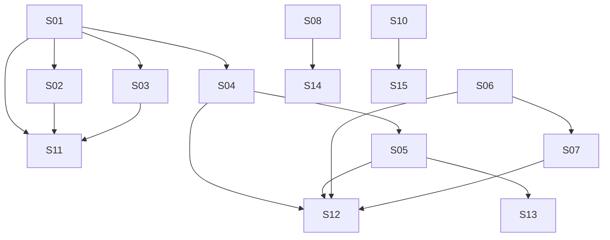

# M23 — Multi-Vertical Scheduling: Appointment Booking & Extensions

**Phase:** Local Development
**Goal:** Let customers and guests actually book against the resource model M21/M22 introduced — chosen-staff, fungible-pool, auto-any, bundled, and multi-leg resolution; variable-duration reservations; versioned intake/attendees — and give the appointment family its three standing-commitment extensions: recurring private reservations, availability alerts, and future-commitment exceptions, plus the no-show terminal state and tenant onboarding bootstrap.
**Depends on:** M21 (`Resource` aggregate), M22 (`Service.resourceRequirements`/`legs`, the resource-scoped availability engine, `resource_occupancy`)
**Blocks:** M24 (Classes & Sessions) — reuses this milestone's recurring-schedule generation pattern, `booking_quote_revisions`, and the resource-resolution precedent for the session family's own resource pool.
**Design rationale:** `docs/discovery/multivertical-booking/multivertical-booking.md` (promoted via `/discovery-to-milestone` on 2026-09-01) — kept as the permanent *why*; this file and the canonical docs it cites (`docs/04-USE_CASES.md` UC-061–077, `docs/02-DOMAIN_MODEL.md` § `RecurringBookingSchedule`/`AvailabilityAlert`/`FutureCommitmentException`, `docs/03-DOMAIN_EVENTS.md`, `docs/13-DATABASE_SCHEMA.md`, `docs/14-API_CONTRACTS.md`) are the source of truth for implementation — nothing below should require opening the discovery doc to understand.

## Non-Goals

- **Everything Cluster 4** (`ClassScheduleTemplate`/`ClassSession`/`ClassSessionBooking`/`RecurringEnrollment`/`ClassAccessContract`) — deferred to M24. UC-075's SESSION-preset branch (Presets D/E/F) stays inert until then; this milestone completes onboarding only for Presets A/B/C/G.
- **Cross-family resource exclusivity proof** (an APPOINTMENT service and a SESSION template sharing a resource) — `resource_occupancy`'s shared exclusion constraint already protects it structurally (M22), but it isn't testable end-to-end until M24 exists alongside this milestone.
- **Manual admin loyalty adjustments, payment processing** — unrelated to this cluster, no change here.

## Build order

| Wave | Story | Theme |
|---|---|---|
| 1 | M23-S01 | Resource resolution for booking creation — chosen/pool/auto-any/bundle/leg (UC-061–066) |
| 1 | M23-S06 | `AvailabilityAlert` aggregate — backend CRUD + BFF (UC-072 create, UC-076 manage) |
| 1 | M23-S08 | `FutureCommitmentException` aggregate — raise + resolve/dismiss, backend + BFF (UC-073, UC-077) |
| 1 | M23-S09 | Appointment no-show terminal status + correction (UC-074) |
| 1 | M23-S10 | Tenant onboarding bootstrap from preset — Presets A/B/C/G (UC-075) |
| 2 | M23-S02 | Variable-duration reservations + versioned intake/attendees (UC-067, UC-068) |
| 2 | M23-S03 | Reschedule extension — resource/bundle/leg-aware, quote revisions (UC-069) |
| 2 | M23-S04 | `RecurringBookingSchedule` aggregate — create/skip/reschedule/pause/end, backend + BFF (UC-070, minus approval/generation) |
| 2 | M23-S07 | Availability-alert matching worker (UC-072 step 3) |
| 2 | M23-S14 | Manager "Exceções de Agenda" worklist frontend (UC-073/077) |
| 2 | M23-S15 | Manager onboarding wizard frontend (UC-075) |
| 3 | M23-S05 | Recurring-schedule approval + rolling-horizon generation worker (UC-071) |
| 3 | M23-S11 | Guest/customer booking flow frontend — resource picker, bundle/leg, variable-duration, intake screens |
| 4 | M23-S12 | Customer "Minha Conta" extension — recurring reservations + availability alerts management |
| 4 | M23-S13 | Staff Agenda extension — recurring-schedule approval queue (UC-071 UI) |

**Wave note (self-dry-run, corrected during `/docs-audit`):** S02 and S03 both call S01's `ResourceResolutionService` in their own description text (S02 for a variable-duration window, S03 for a reschedule's replacement window) — an audit found neither declared that as a `Dependencies:` edge, and both sat in Wave 1 alongside S01 itself. Fixed: both now depend on M23-S01 and sit in **Wave 2**. This cascades: S11 (guest/customer booking flow frontend) depends on S01, S02, **and** S03 — its floor is now `max(S01=1, S02=2, S03=2) + 1` = **Wave 3**, not Wave 2. S12 (Minha Conta extension) needs both S04 (recurring CRUD) and S05 (approval + generation) BFF endpoints, plus S06/S07 (alerts CRUD + matching) — its dependency floor is `max(S04, S05, S06, S07)`'s wave, i.e. Wave 3 (S05) + 1 = **Wave 4**. S13 (staff approval-queue UI) only needs S05, so it's `Wave 3 + 1 = Wave 4` too, not Wave 3 in parallel with S05 itself.

**Likely-independent stories (preview — not authoritative):** S06, S08, S09, and S10 share no files with each other or with S01 (four independent new/small aggregates, all Wave 1) — a candidate `/run-batch` group. S02 and S03 touch different methods of the same booking-creation/reschedule use cases (`RequestBookingUseCase`/`RequestAuthenticatedBookingUseCase` for S02, `RescheduleBookingUseCase` for S03) and share no files with each other, but **both now have a real `Dependencies:` edge to S01** — not independent of S01, only of each other. `/run-batch` re-derives this live; this is a courtesy preview.

---

### M23-S01 — Resource resolution for booking creation (chosen staff, fungible pool, auto-any, bundle, multi-leg) ✅ Done

**Agent:** `backend-ts` + `bff-ts`
**Complexity:** L
**Docs to load:** `docs/04-USE_CASES.md` UC-061–066, `docs/02-DOMAIN_MODEL.md` § `Service.resourceRequirements`/`legs` (M22), § availability engine (UC-058 algorithm), `docs/13-DATABASE_SCHEMA.md` § `resource_occupancy`, `booking_line_resource_assignments` (M22), `docs/14-API_CONTRACTS.md` § Booking Requests
**Dependencies:** M21-S01 (`Resource`), M22 (`Service.resourceRequirements`, availability engine — exact story ID not yet fixed at this milestone's drafting time; depend on the milestone as a whole)
**Pattern:** Extend existing helpers in-place — `docs/AGENT_PATTERNS.md` documents no "Strategy" pattern (verified during story-discovery, zero matches) and this codebase's established convention for this exact concern is a plain-function `*.helpers.ts` module with a deps bag (`resource-occupancy.helpers.ts`, `booking-request.helpers.ts`, `availability-window-resolution.helpers.ts`). A code-quality review during story-discovery (2026-09-25) confirmed `resource-occupancy.helpers.ts` is well-decomposed (single-responsibility pure functions, clean `ResolutionContext` deps object, no leaked state) and does not benefit from a class-based Strategy hierarchy for the ~4-branch `selectionMode` addition this story needs — that would fragment cohesive logic across files for no real gain. No resolution logic belongs in the `Service`/`Booking` aggregates: resolution requires `IResourceRepository`/`AvailabilityService` I/O, and this codebase's domain layer is zero-framework/I/O-free.

**Baseline already shipped by M22-S03 (✅ Done, PR #483) — do not re-build:** `resolveBookingLinesResourceCandidates()`/`resolveFlatLineCandidates()`/`resolveLeggedLineCandidates()`/`resolveRequirementResources()` in `resource-occupancy.helpers.ts` already resolve every flat/bundle/leg requirement into concrete resources (handling `requiredQuantity`, `resourcePoolIds`, per-leg turnover/transition gaps) and are already wired into `persistRequestedBooking()`, called by both `RequestBookingUseCase` and `RequestAuthenticatedBookingUseCase`. `AvailabilityService` already computes bundle intersection / pool union. `GetAvailabilityUseCase`, `schedule-availability.controller.ts`, and the BFF `schedule-availability.schemas.ts` already accept and honor `resourceId` end-to-end — **UC-066 is already fully implemented**, not new work for this story (its AC below is a non-regression confirmation, not a new build). Atomic bundle/leg locking (one `assertSlotFree()` call across all candidates in one transaction) already exists.

**Description — what this story actually adds:**
1. **`selectionMode` branching** (UC-061/062/063): `resolveCandidateIds()` currently ignores `selectionMode` entirely — it always picks the first N active resources regardless of mode. Add real branching: `CUSTOMER_CHOICE` uses a caller-supplied resource id (validated active/eligible/tenant-scoped via the existing `lookupResource()`); `AUTO_ANY` sorts eligible candidates by least already-locked workload on the tenant-local day (new `IResourceOccupancyRepository` method — none exists today — then `resourceId` as stable secondary sort, UC-063 A1); `AUTO_FUNGIBLE_POOL`/`NONE` keep today's deterministic-first-active behavior (still correct — no identity reveal, no tie-break rule specified for pool).
2. **Request body — structured customer choices, not a bare `resourceId`** (UC-061, UC-064, UC-065): `resourceSelections?: Array<{ serviceId: string; legIndex?: number; resourceType: ResourceType; resourceId: string }>` on both `RequestBookingSchema` and `RequestAuthenticatedBookingSchema` — one entry per customer choice; `serviceId` addresses the line (supports the existing up-to-20-service basket); `legIndex` set only for a legged service's per-leg choice; `resourceType` disambiguates within a bundle. Threaded down through `resolveBookingLinesResourceCandidates` → `resolveFlatLineCandidates`/`resolveLeggedLineCandidates` → `resolveRequirementResources` → `resolveCandidateIds`. Chosen over a bare singular `resourceId` — insufficient for bundle/leg `CUSTOMER_CHOICE` (UC-064/UC-065's own main flows require per-requirement/per-leg choices) — and matches M23-S03's own forward-reference to a `resourceSelections` body field for reschedule, keeping the shape consistent across the milestone.
3. **Response identity fields** (UC-062, UC-063, UC-065): no response path reveals resource identity today (`toBookingResult()`/BFF `bookings.mapper.ts` verified clean). Add optional `assignedResourceName` (flat services) and `itinerary: [{legIndex, resourceName, startsAt, endsAt}]` (legged services) to `BookingRequestResult`, threaded through the BFF mapper. Populated only for `AUTO_ANY` (name revealed, UC-063) and legs (full itinerary, UC-065); omitted for `AUTO_FUNGIBLE_POOL` (identity must stay hidden, UC-062) and `CUSTOMER_CHOICE` (customer already knows their own choice).
4. **Error granularity** (UC-064 A2, UC-065 A1): today every resolution failure throws one generic `BookingSlotUnavailableError`/`BookingServiceResourceTypeUnavailableError`. Add `BOOKING_BUNDLE_PARTIALLY_UNAVAILABLE` (a bundle — `resourceRequirements.length > 1` — has one or more but not all requirements unavailable) and `BOOKING_LEG_UNAVAILABLE` (any leg's requirement fails), with each call site in `resolveFlatLineCandidates`/`resolveLeggedLineCandidates` passing enough context to pick the right one; the existing generic error stays for the true single-resource, non-bundle/non-leg case. Bundle/leg resolution re-validates atomically at submit time via the existing single `assertSlotFree()` call across all candidates — never a partial lock.

**Backend HTTP surface:** existing `POST /bookings` (guest) and its authenticated-customer equivalent — request body gains optional `resourceSelections` (shape above) with no other shape change.

**BFF endpoint spec:** extend `apps/bff/src/features/booking/bookings.controller.ts` + `bookings-guest.controller.ts` + `bookings.schemas.ts` — pass through the new optional `resourceSelections` field; extend `bookings.mapper.ts` to surface `assignedResourceName` (UC-063) / `itinerary` (UC-065) when present.

**Files to create/modify (updated post-implementation to match what actually shipped):**
- `apps/backend/src/contexts/booking/application/use-cases/resource-occupancy.helpers.ts` (+ `.spec.ts`) (modify — trimmed to the per-line orchestrator + `deriveResourceSelectionsFromAssignments()`; the flat/legged candidate-building and per-requirement `selectionMode` algorithm were split out below, both for docs/CODE_STANDARDS.md's file-length limit)
- `apps/backend/src/contexts/booking/application/use-cases/resource-resolution-context.helpers.ts` (new — shared `ResolutionContext`/`selectionKey()`, kept in its own file specifically so the two files below don't import each other in a cycle)
- `apps/backend/src/contexts/booking/application/use-cases/resource-occupancy-candidate-builders.helpers.ts` (new — flat/legged candidate building, moved out of `resource-occupancy.helpers.ts`)
- `apps/backend/src/contexts/booking/application/use-cases/resource-requirement-resolution.helpers.ts` (new — the `selectionMode` branching algorithm itself, moved out of `resource-occupancy.helpers.ts`)
- `apps/backend/src/contexts/booking/application/dtos/request-booking.dto.ts`, `request-authenticated-booking.dto.ts` (modify — `resourceSelections` field, via a new shared `ResourceSelectionSchema` in `packages/validation/src/booking.ts`)
- `apps/backend/src/contexts/booking/application/use-cases/booking-request.helpers.ts` (+ `.spec.ts`) (modify — thread `resourceSelections`/`timezone` through `persistRequestedBooking`, return `candidatesByLine`, extend `toBookingResult()` with the new response fields, add `toResourceSelections()` DTO bridge)
- `apps/backend/src/contexts/booking/application/use-cases/request-booking.use-case.ts` (+ `.spec.ts`) (modify — pass `resourceSelections`/`timezone` through)
- `apps/backend/src/contexts/booking/application/use-cases/request-authenticated-booking.use-case.ts` (+ `.spec.ts`) (modify — pass `resourceSelections`/`timezone` through)
- `apps/backend/src/contexts/booking/application/use-cases/approve-booking.use-case.ts` (modify — not in the original list; the signature change to `resolveBookingLinesResourceCandidates()` requires it. Derives `resourceSelections` from the booking's already-persisted `booking_line_resource_assignments` via `deriveResourceSelectionsFromAssignments()`, so a `CUSTOMER_CHOICE` pick survives re-resolution at approval time — locked in during implementation, see the story's own design-decision record above)
- `apps/backend/src/contexts/booking/application/use-cases/reschedule-booking.use-case.ts` (modify — same reason and same fix as `approve-booking.use-case.ts` above; not in the original list)
- `apps/backend/src/contexts/booking/application/services/booking-slot-conflict.service.ts` (+ `.spec.ts`) (modify — widened `assertSlotFree()`'s param type to `ResourceOccupancyCandidate[]`, classifies bundle/leg/single conflicts)
- `apps/backend/src/contexts/booking/application/ports/resource-occupancy-repository.port.ts` (modify — `countActiveByResource()` for the `AUTO_ANY` tie-break, `findAssignmentsByBookingLines()` for the approval/reschedule replay above)
- `apps/backend/src/contexts/booking/infrastructure/repositories/typeorm-resource-occupancy.repository.ts` (+ `.spec.ts`, `.integration.spec.ts`) (modify — implements both new port methods)
- `apps/backend/src/contexts/booking/infrastructure/repositories/typeorm-resource-occupancy.write-queries.ts` (new — not in the original list; the write-path upsert/insert logic split out of the repository class, also for the file-length limit; named to match the folder's own `.mapper.ts`/`.persistence-errors.ts` split-file convention rather than a generic `.helpers.ts` suffix)
- `apps/backend/eslint.config.js` (modify — added the new write-queries file to the existing TypeORM-import allowlist, same treatment as its sibling repository file)
- `apps/backend/src/test/repositories/booking/in-memory-resource-occupancy.repository.ts` (modify — the two new port methods, for unit tests)
- `apps/backend/src/contexts/booking/domain/errors/booking-service.error.ts` (modify — `BookingResourceSelectionRequiredError`)
- `apps/backend/src/contexts/booking/domain/errors/booking-lifecycle.error.ts` (modify — `BookingBundlePartiallyUnavailableError`, `BookingLegUnavailableError`)
- `apps/backend/src/contexts/booking/infrastructure/http/booking-error.mapper.ts` (modify — map the three new errors)
- `apps/backend/src/contexts/booking/infrastructure/controllers/booking.controller.integration.spec.ts` (modify — not in the original list; end-to-end `POST /bookings` coverage for `CUSTOMER_CHOICE`/`AUTO_ANY`/`AUTO_FUNGIBLE_POOL`/legged resolution against a real Postgres)
- `packages/types/src/error-codes.ts` (modify — `BOOKING_RESOURCE_SELECTION_REQUIRED`, `BOOKING_BUNDLE_PARTIALLY_UNAVAILABLE`, `BOOKING_LEG_UNAVAILABLE`)
- `packages/validation/src/booking.ts` (modify — new shared `ResourceSelectionSchema`, not in the original list; reused by both the backend DTOs and the BFF schema below)
- `packages/i18n/locales/{pt-BR,en}/errors.json` (modify — all three new codes)
- `apps/bff/src/features/booking/bookings.schemas.ts` (modify — `resourceSelections` on both request schemas, importing the shared `ResourceSelectionSchema`)
- `apps/bff/src/features/booking/bookings.types.ts` (modify — not in the original list; `assignedResourceName`/`itinerary` on `BookingLineResponse`, new `BookingLineItineraryLegResponse`). `bookings.controller.ts`/`bookings-guest.controller.ts`/`bookings.mapper.ts` needed **no code change** — booking creation is a pure `body`/response passthrough, already covered by the schema/type changes.
- `apps/backend/http/booking/bookings.http` (modify — new `resourceSelections` example)
- `docs/27-BUSINESS_LOGIC_REFERENCE.md` § Booking — Resource-Scoped Scheduling & Availability (modify — new "selectionMode resolution algorithm (M23-S01)" subsection, plus fixed two claims the M22 baseline text had made that M23-S01 supersedes)
- `docs/04-USE_CASES.md` UC-066 (modify — fix stale `Endpoint:` line; already applied during story-discovery)

**Already correctly implemented by M22-S03 — no changes needed:** ~~`resource-resolution.service.ts`~~ (never built this — see Pattern above), `get-availability.use-case.ts`, `availability.service.ts`, `typeorm-booking-availability.adapter.ts`, `schedule-availability.controller.ts`.

**Acceptance criteria — product:**
- [x] Customer/guest booking a `CUSTOMER_CHOICE` service picks a staff member and sees only that resource's slots.
- [x] Booking an `AUTO_FUNGIBLE_POOL` service (e.g. a court) shows union availability and never reveals which specific unit was assigned.
- [x] Booking an `AUTO_ANY` service shows the assigned staff member's name on confirmation.
- [x] Booking a bundled or multi-leg service either fully succeeds or fully fails — never a partial lock.
- [x] A service with no `resourceRequirements` behaves exactly as before this story (explicit non-regression AC).
- [x] UC-066 (browse a specific staff member's calendar via `GET /v1/schedule/availability?...&resourceId=`) still works — non-regression confirmation only, already shipped by M22-S03.

**Acceptance criteria — technical:**
- Unit:
  - [x] `resolveCandidateIds()` correctly branches per `selectionMode` (`CUSTOMER_CHOICE` uses the caller-supplied id, `AUTO_ANY`/`AUTO_FUNGIBLE_POOL`/`NONE` behave per the Description above), given a fixture resource set
  - [x] Bundle resolution rejects with `BOOKING_BUNDLE_PARTIALLY_UNAVAILABLE` (`409`) when any one required resource is unavailable
  - [x] Leg-chain resolution rejects with `BOOKING_LEG_UNAVAILABLE` (`409`) when any leg's requirement is unavailable, and computes correct per-leg sub-windows including transition gaps
  - [x] `AUTO_ANY` tie-break picks the least-loaded resource, `resourceId` as stable secondary sort
  - [x] A `resourceSelections` entry for another tenant's resource is rejected
- Integration:
  - [x] `POST /bookings` for a `CUSTOMER_CHOICE` service (via `resourceSelections`) persists a resolved `resource_occupancy` row
  - [x] Booking response for `AUTO_ANY` includes `assignedResourceName`; for `AUTO_FUNGIBLE_POOL` never includes any resource identity; for a legged service includes the full `itinerary`
  - [x] A bundle/leg race (two concurrent submits contending for the same resource) — the DB's shared GIST exclusion constraint rejects the loser, `409` (verified generically — a true simultaneous-commit race always throws the generic `BookingSlotUnavailableError` via `rethrowOccupancyInsertError`, regardless of candidate count; the new bundle/leg-specific codes apply to the far more common pre-check-detects-an-existing-conflict path, which is separately unit-tested)
- Tenant isolation:
  - [x] A `resourceSelections` entry naming another tenant's resource is rejected, never silently scoped in
- E2E: none — covered by S11's frontend E2E
- [x] Coverage ≥80% on changed code (backend unit: 3230/3230 passing; booking-context integration: 271/271 passing; BFF unit: 647/647, component: 434/434 — all passing, no regressions)
- [x] `tsc --noEmit` clean, lint clean

---

### M23-S02 — Variable-duration reservations + versioned booking intake/attendees

**Agent:** `backend-ts` + `bff-ts`
**Complexity:** M
**Docs to load:** `docs/04-USE_CASES.md` UC-067, UC-068, `docs/02-DOMAIN_MODEL.md` § `Service.durationPolicy`/`pricingPolicy` (M22), § `service_booking_intake_schema` (M22), `docs/13-DATABASE_SCHEMA.md` § `booking_attendees` (M22)
**Dependencies:** M21-S01, M22 (`durationPolicy`, intake schema — same milestone-level dependency note as S01), M23-S01 (calls its resource-resolution helpers — `resource-requirement-resolution.helpers.ts`'s `resolveRequirementResources()`, orchestrated via `resource-occupancy.helpers.ts` — to resolve the variable-duration window's resource(s), doesn't duplicate resolution logic)
**Pattern:** plain composition — additive request fields on the existing booking-creation use cases; no new pattern.

**Description:**
Two independently-triggerable, additive extensions of `POST /bookings`, bundled in one story because both are conditional branches inside the same request-validation step (not the resource-resolution logic S01 owns):
1. **UC-067 variable duration:** when the service has `durationPolicy = CUSTOMER_SELECTED`, request body carries `startsAt`/`durationMinutes`/`participantCount`; validate against the service's min/max/increment/participant-limit rules, quote the per-increment price (round-up rule per `docs/13-DATABASE_SCHEMA.md`), resolve the required resource(s) for that exact interval (calls S01's resolver with the computed window, doesn't duplicate resolution logic).
2. **UC-068 intake/attendees:** when the service declares an active `service_booking_intake_schema`, request body carries `intakeSchemaVersion`/`intakeAnswers`/optional named attendees; validate required answers against the **displayed** schema version (never silently re-validate against a version that changed mid-flow, UC-068 A1), snapshot version+answers+consent on the booking.

**Design decisions locked in during discovery (2026-09-25):**
- **Basket scope (UC-067 A4 / UC-068 A4):** `serviceIds` is a multi-line basket where duplicates are allowed (`docs/14-API_CONTRACTS.md`), and M23-S01 already established a per-line addressing convention (`resourceSelections`, keyed by `serviceId`+`legIndex`) for exactly this ambiguity. Rather than extend that same per-line pattern to `durationMinutes`/`participantCount`/intake fields, the request body keeps them as flat, request-root fields as UC-067/068 literally describe — but a request may contain **at most one** service that is `durationPolicy = CUSTOMER_SELECTED` and/or intake-bearing; more than one → `422 invalid-multiple-variable-services` (new error code, added to the list below). Matches the discovery doc's "multi-service bookings are business-configured bundles/journeys, not arbitrary carts" framing; avoids inventing a second per-line addressing scheme for a case that's realistically single-service in practice.
- **Missing `durationMinutes` fallback:** no fallback to `Service.durationMinutes` — that field is not authoritative once `durationPolicy = CUSTOMER_SELECTED` (`docs/02-DOMAIN_MODEL.md`, updated). Omitting it on such a service is `422 BOOKING_DURATION_OUT_OF_RANGE`.
- **`participantCount` vs. `ResourceRequirement.requiredQuantity`:** independent. `participantCount` is a customer-supplied capacity/attendee-count input only; it never dynamically overrides `requiredQuantity`, which stays the service's static configured value (UC-067 A3, updated).
- **Intake submitted with no active schema:** silently ignored (not persisted, not an error) — added as UC-068 A5.
- **No new migration or entity files needed** — verified against the actual codebase at story-discovery: `booking.entity.ts` already has `intakeSchemaVersion`/`intakeAnswers`/`participantCount`/`consentAcceptedAt`/`consentVersion` (added by M22-S02's `1748500000011-AddServiceBookingPolicyAndIntakeSchema.ts`), `booking-attendee.entity.ts`/`booking_attendees` already exist with a test builder (also M22-S02, explicitly built "schema-only... reachable once a booking actually submits attendees in M23"), and `booking_lines.duration_mins_at_booking` already exists as a generic per-line duration snapshot — reused directly for the customer-selected duration (`docs/13-DATABASE_SCHEMA.md`, updated), no new `durationMinutes` column anywhere. What actually needs wiring, and was missing from this story's original file list: `booking.aggregate.ts` (zero references to any of these fields today, verified by grep) and `typeorm-booking.repository.ts` (needs `BookingAttendeeEntity` persisted the same way it already persists `BookingLineEntity` — same file, same transaction, no new port).
- **`GET /services/:id/intake-schema` route collision:** that exact path already exists, built by M22-S04 for the staff edit page (`StaffOrManagerRoleGuard`-gated, returns `{active, history[]}`). A second handler can't share the same path. New path: `GET /services/:id/intake-schema/public` (no guard), reusing `GetServiceIntakeSchemaUseCase` but returning only `{ active }` — never `history`, which a customer has no reason to see. Precedent for guest/authenticated path splits already exists in this same controller family (`POST /bookings` vs. `POST /bookings/authenticated`).

**Backend use case steps:**
1. Extend `RequestBookingUseCase`/`RequestAuthenticatedBookingUseCase` validation step: reject if more than one service in the basket is `CUSTOMER_SELECTED`/intake-bearing (`422 invalid-multiple-variable-services`). If `durationPolicy = CUSTOMER_SELECTED`, require and validate interval/participants, compute quote; else use the service's fixed `durationMinutes` (unchanged).
2. Same use cases: if an active intake schema exists, validate `intakeSchemaVersion` matches the currently-active one *or* an explicitly-passed prior version the client displayed (never reject solely for "not the latest"), validate required answers/consent (`422` naming missing fields, UC-068 A3), persist snapshot + attendees (via `booking.aggregate.ts` + `typeorm-booking.repository.ts`, see decisions above). Intake fields submitted for a service with no active schema are ignored, not validated.
3. New read endpoint `GET /services/:id/intake-schema/public` (UC-068 step 1) — reuses `GetServiceIntakeSchemaUseCase`, returns `{ active }` only.

**Backend HTTP surface:** `POST /bookings` (guest+authenticated) body gains optional `durationMinutes`/`participantCount`, `intakeSchemaVersion`/`intakeAnswers`/`attendees`. New `GET /services/:id/intake-schema/public`.

**BFF endpoint spec:** extend `bookings.schemas.ts` for the new optional fields; new route on the existing `apps/bff/src/features/booking/services.public.controller.ts` (already exists — currently only has the services-list route) for `GET /services/:id/intake-schema/public`.

**Files to create/modify:**
- `apps/backend/src/contexts/booking/application/use-cases/request-booking.use-case.ts` / `request-authenticated-booking.use-case.ts` (+ specs) (modify)
- `apps/backend/src/contexts/booking/application/services/booking-quote.service.ts` (+ `.spec.ts`) (new — per-increment price + minimum-charge rounding, isolated from the resolver so S01 doesn't need to know about pricing)
- `apps/backend/src/contexts/booking/domain/booking.aggregate.ts` (+ `.spec.ts`) (modify — carry `intakeSchemaVersion`/`intakeAnswers`/`participantCount`/`consentAcceptedAt`/`consentVersion`/`attendees: BookingAttendee[]` through `requestBooking()`; not in the original list, found at story-discovery — see decisions above)
- `apps/backend/src/contexts/booking/infrastructure/repositories/typeorm-booking.repository.ts` (+ `.spec.ts`) (modify — persist `BookingAttendeeEntity` rows the same way `BookingLineEntity` rows are already persisted, same transaction; not in the original list)
- `apps/backend/src/contexts/booking/application/use-cases/get-service-intake-schema.use-case.ts` — **no change needed**, already exists (M22-S04); reused as-is by the new public route below
- `apps/backend/src/contexts/booking/infrastructure/controllers/service.controller.ts` (+ `.spec.ts`, `.integration.spec.ts`) (modify — new `@Get(':id/intake-schema/public')` route, no guard, returns `{ active }` only)
- `packages/types/src/error-codes.ts` (modify — `BOOKING_INTAKE_ANSWER_MISSING`, `BOOKING_DURATION_OUT_OF_RANGE`, `BOOKING_INVALID_MULTIPLE_VARIABLE_SERVICES`)
- `packages/i18n/locales/{pt-BR,en}/errors.json` (modify — all three new codes)
- `apps/bff/src/features/booking/bookings.schemas.ts` (modify — new optional fields), `services.public.controller.ts` (+ specs) (modify — already exists, add the new route)
- `apps/backend/http/booking/services.http` (modify — new `/intake-schema/public` request)

~~`apps/backend/src/contexts/booking/infrastructure/entities/booking.entity.ts`~~ / ~~`booking-attendee.entity.ts`~~ — struck from the original file list; both already fully exist (M22-S02), no changes needed (see decisions above).

**Acceptance criteria — product:**
- [ ] Customer booking a variable-duration service picks start+duration within the configured rules and sees the correct quoted price.
- [ ] Customer booking a service with an active intake schema completes the required questions/consent before submitting.
- [ ] A service form change mid-flow never silently rewrites an already-completed answer (UC-068 A1).
- [ ] A request combining more than one `CUSTOMER_SELECTED`/intake-bearing service in the same basket is rejected, not silently applied to just one of them (UC-067 A4/UC-068 A4).

**Acceptance criteria — technical:**
- Unit:
  - [ ] Quote service rounds up to the correct increment, applies minimum charge when set
  - [ ] Intake validation rejects a missing required answer/consent with the exact field named
  - [ ] Duration validation rejects an interval outside min/max/increment, and rejects a `CUSTOMER_SELECTED` service booked with no `durationMinutes` at all (no fallback to `Service.durationMinutes`)
  - [ ] `participantCount` never changes how many resources `resolveRequirementResources()` locks — only `ResourceRequirement.requiredQuantity` does
  - [ ] `intakeAnswers`/`attendees` submitted for a service with no active intake schema are ignored — no validation error, nothing persisted
  - [ ] A basket with two `CUSTOMER_SELECTED`/intake-bearing services (or the same one twice) is rejected with `BOOKING_INVALID_MULTIPLE_VARIABLE_SERVICES`
- Integration:
  - [ ] `POST /bookings` with a variable-duration interval persists the correct quote and locks the resource for the exact computed window
  - [ ] `POST /bookings` snapshots intake answers immutably even after the service's schema is later updated
  - [ ] `GET /services/:id/intake-schema/public` returns only `{ active }` (no `history`) and requires no auth; `404` for a missing/cross-tenant/inactive service id
- Tenant isolation: n/a beyond S01's existing resource-tenant checks
- E2E: none — covered by S11
- [ ] Coverage ≥80% on changed code
- [ ] `tsc --noEmit` clean, lint clean

---

### M23-S03 — Reschedule extension: resource/bundle/leg-aware, quote revisions

**Agent:** `backend-ts` + `bff-ts`
**Complexity:** M
**Docs to load:** `docs/04-USE_CASES.md` UC-069, `docs/14-API_CONTRACTS.md` § Reschedule (extended), `docs/13-DATABASE_SCHEMA.md` § `booking_quote_revisions`
**Dependencies:** M21-S01, M22, M23-S01 (reuses its resource-resolution helpers — `resource-requirement-resolution.helpers.ts`'s `resolveRequirementResources()`, orchestrated via `resource-occupancy.helpers.ts` — to resolve the replacement resource(s)/window, doesn't duplicate resolution logic)
**Pattern:** plain composition — extends the existing `RescheduleBookingUseCase`; no new pattern.

**Description:**
Extend `RescheduleBookingUseCase` (`apps/backend/src/contexts/booking/application/use-cases/reschedule-booking.use-case.ts`) to accept the customer-initiated body shape (`resourceSelections`, `durationMinutes`) alongside the existing staff-only shape, lock the replacement resource(s)/span **before** releasing the original (never leaves a customer holding neither), re-run S01's resolver for the new window, and record a `booking_quote_revisions` row when the price changes (variable-duration reschedule). A bundle/leg reschedule re-validates the whole chain atomically (UC-069 A2); a staff-initiated override records reason+actor but never bypasses capacity/verification/exclusivity (UC-069 A3).

**Backend use case steps:**
1. Resolve the replacement resource(s)/window via S01's resolution helpers (`resource-requirement-resolution.helpers.ts`, orchestrated via `resource-occupancy.helpers.ts`; reuse, don't duplicate).
2. Lock replacement inside the same transaction that releases the original `resource_occupancy` row(s) — lock-then-release ordering, not release-then-lock, so a losing race never leaves the customer with nothing (UC-069 A1: on failure, original remains fully intact).
3. If price changed (variable-duration or leg composition changed): insert a `booking_quote_revisions` row (`revision_no` = next for this `booking_id`), include it in the response.
4. Publish `BookingRescheduled` with the extended scope already documented in `docs/03-DOMAIN_EVENTS.md`.

**Backend HTTP surface:** existing `PATCH /bookings/:id/reschedule` — body gains `resourceSelections`/`durationMinutes` for the customer-initiated case.

**BFF endpoint spec:** extend `apps/bff/src/features/booking/bookings.controller.ts`'s reschedule route + `bookings.schemas.ts` for the new optional fields + response shape (`quoteRevision`).

**Files to create/modify:**
- `apps/backend/src/contexts/booking/application/use-cases/reschedule-booking.use-case.ts` (+ `.spec.ts`) (modify)
- `apps/backend/src/contexts/booking/application/dtos/reschedule-booking.dto.ts` (modify)
- `apps/backend/src/contexts/booking/infrastructure/controllers/booking-completion.controller.ts` (+ specs) (modify — hosts the real `:id/reschedule` route per its own header comment, not a `bookings.controller.ts`)
- `apps/backend/src/contexts/booking/infrastructure/entities/booking-quote-revision.entity.ts` (new)
- `apps/backend/src/contexts/booking/infrastructure/repositories/typeorm-booking-quote-revision.repository.ts` (+ `.spec.ts`) (new)
- `apps/backend/src/contexts/booking/application/ports/booking-quote-revision-repository.port.ts` (new)
- `apps/backend/src/contexts/booking/infrastructure/migrations/<timestamp>-CreateBookingQuoteRevisions.ts` (new — per `docs/13-DATABASE_SCHEMA.md`'s source-exclusive CHECK; `class_session_booking_id` FK stays unreachable until M24)
- `apps/bff/src/features/booking/bookings.controller.ts` (+ specs), `bookings.schemas.ts` (modify)
- `apps/backend/http/booking/bookings.http` (modify)

**Acceptance criteria — product:**
- [ ] Customer rescheduling a resource-scoped/bundle/leg/variable-duration booking sees the recomputed quote before confirming.
- [ ] A failed reschedule (replacement unavailable) leaves the original booking fully intact — customer never loses their slot.
- [ ] Staff override reschedule records actor+reason without bypassing any capacity/exclusivity check.

**Acceptance criteria — technical:**
- Unit:
  - [ ] Reschedule rejects with `409` when replacement is unavailable, original booking state unchanged
  - [ ] `booking_quote_revisions.revision_no` increments correctly per booking
- Integration:
  - [ ] Reschedule of a bundle/leg booking is atomic — a mid-chain conflict rolls back the whole attempt
  - [ ] Lock-then-release ordering verified: a losing concurrent reschedule never leaves the original resource unlocked
- Tenant isolation: n/a beyond existing booking tenant scoping
- E2E: none — covered by S11/S12
- [ ] Coverage ≥80% on changed code
- [ ] `tsc --noEmit` clean, lint clean

---

### M23-S06 — `AvailabilityAlert` aggregate — backend CRUD + BFF

**Agent:** `backend-ts` + `bff-ts`
**Complexity:** M
**Docs to load:** `docs/04-USE_CASES.md` UC-072, UC-076, `docs/02-DOMAIN_MODEL.md` § `AvailabilityAlert`, `docs/13-DATABASE_SCHEMA.md` § `availability_alerts`/`availability_alert_notification_attempts`, `docs/14-API_CONTRACTS.md` § Availability Alerts, `docs/03-DOMAIN_EVENTS.md` § `AvailabilityAlert*`
**Dependencies:** M21-S01, M22
**Pattern:** Repository + Adapter (`IAvailabilityAlertRepository` port, `TypeOrmAvailabilityAlertRepository` adapter) — matches every other Booking-context aggregate; no new pattern.

**Description:**
Create the `AvailabilityAlert` aggregate exactly per `docs/02-DOMAIN_MODEL.md`'s field list. Authenticated-customer-only (UC-072 A1 redirects an unauthenticated visitor to login, preserving chosen criteria through the redirect — a **frontend** concern, handled in S12). This story covers create/list/edit/cancel and the expiry worker; the *matching* worker (step 3, "when a slot releases, notify") is S07, a separate async trigger.

**Backend use case steps:**
1. **`CreateAvailabilityAlertUseCase`** (UC-072): validates exactly one criteria representation set (`ONE_TIME_RANGE` xor `WEEKLY_PREFERENCE`), persists, publishes `AvailabilityAlertCreated`.
2. **`ListAvailabilityAlertsUseCase`** (UC-076): `findByCustomer(tenantId, customerId)`.
3. **`UpdateAvailabilityAlertUseCase`** (UC-076): re-validates criteria shape, rejects edit on an already-`NOTIFIED`/`EXPIRED` alert (UC-076 A1).
4. **`CancelAvailabilityAlertUseCase`** (UC-072 A2 / UC-076): sets `status = CANCELLED`, publishes `AvailabilityAlertCancelled`.
5. **`ExpireAvailabilityAlertsJob`** (scheduled, same shape as the existing loyalty-expiry cron): finds `ACTIVE` alerts past `expiresAt`, transitions to `EXPIRED`, publishes `AvailabilityAlertExpired` per alert.

**Backend HTTP surface:** new controller — `POST /availability-alerts`, `GET /availability-alerts`, `PATCH /availability-alerts/:id`, `DELETE /availability-alerts/:id`. JWT + Customer only (`403` for STAFF/MANAGER/guest).

**BFF endpoint spec:** new `apps/bff/src/features/booking/availability-alerts.controller.ts` + `.schemas.ts` + `.types.ts`, register in the existing `apps/bff/src/features/booking/` module.

**Files to create/modify:**
- `apps/backend/src/contexts/booking/domain/availability-alert.aggregate.ts` (+ `.spec.ts`) (new)
- `apps/backend/src/contexts/booking/domain/errors/availability-alert-*.error.ts` (new)
- `apps/backend/src/contexts/booking/application/ports/availability-alert-repository.port.ts` (new)
- `apps/backend/src/contexts/booking/application/use-cases/{create,list,update,cancel}-availability-alert.use-case.ts` (+ specs) (new)
- `apps/backend/src/contexts/booking/application/jobs/expire-availability-alerts.job.ts` (+ `.spec.ts`, `.integration.spec.ts`) (new — mirror the existing loyalty-expiry cron's controller+publisher shape)
- `apps/backend/src/contexts/booking/infrastructure/entities/availability-alert.entity.ts` (new)
- `apps/backend/src/contexts/booking/infrastructure/repositories/typeorm-availability-alert.repository.ts` (+ `.spec.ts`) (new)
- `apps/backend/src/contexts/booking/infrastructure/controllers/availability-alert.controller.ts` (+ specs) (new)
- `apps/backend/src/contexts/booking/infrastructure/migrations/<timestamp>-CreateAvailabilityAlerts.ts` (new)
- `packages/types/src/error-codes.ts` + both locale `errors.json` (modify — `BOOKING_ALERT_CRITERIA_INVALID`, `BOOKING_ALERT_NOT_EDITABLE`)
- `apps/bff/src/features/booking/availability-alerts.controller.ts` (+ `.schemas.ts`, `.types.ts`, specs) (new)
- `apps/backend/http/booking/availability-alerts.http` (new)

**Acceptance criteria — product:**
- [ ] Authenticated customer creates an alert with either a one-time range or weekly preference (never both).
- [ ] Customer views, edits, and cancels their own active alerts; an already-notified/expired alert is read-only history.
- [ ] Expired alerts stop counting as active without any manual step.

**Acceptance criteria — technical:**
- Unit:
  - [ ] Aggregate rejects both/neither criteria representation set
  - [ ] Update rejects when `status` is `NOTIFIED`/`EXPIRED`
  - [ ] Expiry job transitions only past-`expiresAt` `ACTIVE` alerts
- Integration:
  - [ ] `POST /availability-alerts` persists and is retrievable via `GET`
  - [ ] Expiry job integration test against real seeded rows
- Tenant isolation:
  - [ ] `GET/PATCH/DELETE /availability-alerts/:id` never crosses tenant or customer boundary
- E2E: none — covered by S12
- [ ] Coverage ≥80% on changed code
- [ ] `tsc --noEmit` clean, lint clean

---

### M23-S07 — Availability-alert matching worker

**Agent:** `backend-ts`
**Complexity:** M
**Docs to load:** `docs/04-USE_CASES.md` UC-072 step 3, `docs/02-DOMAIN_MODEL.md` § `AvailabilityAlert.recordNotificationAttempt`, `docs/13-DATABASE_SCHEMA.md` § `availability_alert_notification_attempts`, `docs/03-DOMAIN_EVENTS.md` § `AvailabilityAlertMatched`
**Dependencies:** M23-S06 (`AvailabilityAlert` aggregate must exist)
**Pattern:** Event-driven consumer — subscribes to whatever already publishes "a resource/window became free" (a booking cancellation/rejection, a schedule-closure removal) and cross-checks against `ACTIVE` alerts.

**Description:**
Every capacity-releasing event in the Booking context (booking cancelled/rejected, closure removed) triggers a match check: does any `ACTIVE` `AvailabilityAlert` for the affected `serviceId` (and, if set, `preferredResourceId`) match the newly-freed window against its criteria (`ONE_TIME_RANGE` overlap or `WEEKLY_PREFERENCE` weekday+local-time match)? On a match, record one deduplicated `availability_alert_notification_attempts` row (`UNIQUE (tenant_id, alert_id, matching_window, channel)`), transition the alert to `NOTIFIED`, publish `AvailabilityAlertMatched`. An alert is never auto-cancelled just because a different channel met the same need (UC-076's own postcondition) — this worker only ever adds notification history, never cancels.

**Backend use case steps:**
1. **`MatchAvailabilityAlertsUseCase`**: given `(tenantId, serviceId, freedWindow, resourceId?)`, queries `ACTIVE` alerts for that service, filters by criteria match, for each match calls `recordNotificationAttempt` + transitions to `NOTIFIED`.
2. New consumer(s) in the Booking context subscribing to whichever existing cancellation/rejection events already fire — grep `apps/backend/src/contexts/booking/infrastructure/events/` first for the real existing shape before adding a new subscription; call the use case, zero domain logic in the handler, rethrow on failure (`docs/ENGINEERING_RULES_BACKEND.md` § Event Handlers).

**Files to create/modify:**
- `apps/backend/src/contexts/booking/application/use-cases/match-availability-alerts.use-case.ts` (+ `.spec.ts`) (new)
- `apps/backend/src/contexts/booking/infrastructure/events/<existing-cancellation-event>.handler.ts` (modify — add the alert-matching call; verify the real existing handler file name at implementation time, don't guess)
- `apps/backend/src/contexts/booking/infrastructure/repositories/typeorm-availability-alert.repository.ts` (+ `.spec.ts`) (modify — matching query)

**Acceptance criteria — product:**
- [ ] Customer with a matching alert receives exactly one notification when a matching slot frees up.
- [ ] An alert already notified for a given window is never notified twice for the same window/channel.

**Acceptance criteria — technical:**
- Unit:
  - [ ] `ONE_TIME_RANGE` overlap match logic; `WEEKLY_PREFERENCE` weekday+local-time match logic (including timezone conversion)
  - [ ] Deduplication: a second match on the same `(alertId, matchingWindow, channel)` is a no-op
- Integration:
  - [ ] End-to-end: cancel a booking that frees a slot matching a real seeded alert, assert `AvailabilityAlertMatched` fires and the notification row is recorded
- Tenant isolation:
  - [ ] Matching never crosses tenant boundary (query scoped by `tenantId` throughout)
- E2E: none — background worker, no UI surface
- [ ] Coverage ≥80% on changed code
- [ ] `tsc --noEmit` clean, lint clean

---

### M23-S08 — `FutureCommitmentException` aggregate — raise + resolve/dismiss, backend + BFF

**Agent:** `backend-ts` + `bff-ts`
**Complexity:** M
**Docs to load:** `docs/04-USE_CASES.md` UC-073, UC-077, `docs/02-DOMAIN_MODEL.md` § `FutureCommitmentException`, `docs/13-DATABASE_SCHEMA.md` § `future_commitment_exceptions`, `docs/14-API_CONTRACTS.md` § Future Commitment Exceptions, `docs/03-DOMAIN_EVENTS.md` § `FutureCommitmentException*`
**Dependencies:** M21-S01 (this story modifies M21-S01's `DeactivateResourceUseCase` to raise an exception when the deactivated resource has future commitments)
**Pattern:** Repository + Adapter, matching every other Booking-context aggregate. Raise (UC-073) and resolve/dismiss (UC-077) are bundled in one story: they're the same aggregate's full lifecycle, and the idempotent-open-entry invariant (`UNIQUE ... WHERE status = 'OPEN'`) is meaningless to implement without both sides present together.

**Description:**
Create `FutureCommitmentException` per `docs/02-DOMAIN_MODEL.md`. `raise()` is called from **other** use cases when they affect a future commitment nobody explicitly reviewed per-session — in this milestone's actual reachable scope, that's specifically `DeactivateResourceUseCase` (M21-S01) when the resource being deactivated has future `APPROVED` bookings or an `ACTIVE` `RecurringBookingSchedule` (S04) referencing it. (An hours-reduction trigger and a schedule-closure trigger are real per the UC text but have no wired caller in this milestone — resource deactivation is the one concrete trigger available at this point in the sequence; note this gap explicitly rather than fabricate the others.)

**Backend use case steps:**
1. **`RaiseFutureCommitmentExceptionUseCase`** (UC-073): idempotent — `findOpenByImpact(tenantId, sourceType, sourceId, affectedType, affectedId)` first; update existing open row (A1) or create new, publishes `FutureCommitmentExceptionRaised`.
2. **Modify `DeactivateResourceUseCase`** (M21-S01): after deactivation, query future `APPROVED` bookings/active recurring schedules referencing the resource; call step 1's use case once per affected commitment, with computed alternatives (a same-type active resource free for the same window, or none — A2).
3. **`ListOpenFutureCommitmentExceptionsUseCase`** (UC-077 step 1): `findByTenant(tenantId, { status: 'OPEN' })`.
4. **`ResolveFutureCommitmentExceptionUseCase`** (UC-077): validates `status = OPEN`, applies the chosen resolution (`KEEP` = no-op booking-side, `REASSIGN`/`RESCHEDULE` = re-runs S03's reschedule logic against the alternative, `CANCEL` = the existing cancellation use case), records decision, publishes `FutureCommitmentExceptionResolved`. A1: re-validates the alternative at commit time; if now unavailable, worklist stays open.
5. **`DismissFutureCommitmentExceptionUseCase`** (UC-077 A2): sets `status = DISMISSED`, publishes `FutureCommitmentExceptionDismissed`.

**Backend HTTP surface:** new controller — `GET /scheduling-exceptions?status=OPEN`, `POST /scheduling-exceptions/:id/resolve`, `POST /scheduling-exceptions/:id/dismiss`. `MANAGER`-only.

**BFF endpoint spec:** new `apps/bff/src/features/booking/scheduling-exceptions.controller.ts` + `.schemas.ts` + `.types.ts`.

**Files to create/modify:**
- `apps/backend/src/contexts/booking/domain/future-commitment-exception.aggregate.ts` (+ `.spec.ts`) (new)
- `apps/backend/src/contexts/booking/application/ports/future-commitment-exception-repository.port.ts` (new)
- `apps/backend/src/contexts/booking/application/use-cases/{raise,list,resolve,dismiss}-future-commitment-exception.use-case.ts` (+ specs) (new)
- `apps/backend/src/contexts/booking/application/use-cases/deactivate-resource.use-case.ts` (+ `.spec.ts`) (modify — calls raise, per step 2 above)
- `apps/backend/src/contexts/booking/infrastructure/entities/future-commitment-exception.entity.ts` (new)
- `apps/backend/src/contexts/booking/infrastructure/repositories/typeorm-future-commitment-exception.repository.ts` (+ `.spec.ts`) (new)
- `apps/backend/src/contexts/booking/infrastructure/controllers/scheduling-exception.controller.ts` (+ specs) (new)
- `apps/backend/src/contexts/booking/infrastructure/migrations/<timestamp>-CreateFutureCommitmentExceptions.ts` (new)
- `packages/types/src/error-codes.ts` + both `errors.json` (modify — `BOOKING_EXCEPTION_NOT_FOUND`, `BOOKING_EXCEPTION_ALREADY_RESOLVED`)
- `apps/bff/src/features/booking/scheduling-exceptions.controller.ts` (+ `.schemas.ts`, `.types.ts`, specs) (new)
- `apps/backend/http/booking/scheduling-exceptions.http` (new)

**Acceptance criteria — product:**
- [ ] Deactivating a resource with future approved bookings creates one worklist entry per affected booking, visible to the manager.
- [ ] Manager resolves an entry via keep/reassign/reschedule/cancel, or dismisses it with a reason; no commitment is ever silently moved.
- [ ] A repeated trigger for the same unresolved impact never duplicates the worklist entry.

**Acceptance criteria — technical:**
- Unit:
  - [ ] Idempotent raise: a second raise for the same open impact updates, doesn't duplicate
  - [ ] Resolve rejects on a non-`OPEN` entry
- Integration:
  - [ ] Deactivating a resource with a real future approved booking creates a real worklist row end-to-end
  - [ ] Resolve re-validates the alternative at commit time; a race leaves the item open (A1)
- Tenant isolation:
  - [ ] Worklist queries/actions never cross tenant boundary
- E2E: none — covered by S14
- [ ] Coverage ≥80% on changed code
- [ ] `tsc --noEmit` clean, lint clean

---

### M23-S09 — Appointment no-show terminal status + correction

**Agent:** `backend-ts` + `bff-ts`
**Complexity:** S
**Docs to load:** `docs/04-USE_CASES.md` UC-074, `docs/02-DOMAIN_MODEL.md` § `Booking` (Cluster 3 modification, `NO_SHOW`), both `BookingStatus` diagram locations (§ Booking Context's modification note **and** the separate "Value Objects Reference" section further down the same file — a past M21 audit found the second one gets missed when only the first is checked), `.copilot/context.md` §5, `docs/13-DATABASE_SCHEMA.md` § `bookings` modified, `docs/03-DOMAIN_EVENTS.md` § `BookingNoShow`
**Dependencies:** M21-S01, M22 (milestone-level only — this story doesn't actually need either; listed for consistency with the cluster's stated dependency floor)
**Pattern:** plain composition — extends the existing `Booking` aggregate's state machine; no new pattern.

**Description:**
Add `NO_SHOW` as a new terminal status reachable from `APPROVED` (`APPROVED → NO_SHOW`), per the already-updated `CLAUDE.md` §5 and both `docs/02-DOMAIN_MODEL.md` `BookingStatus` locations. No loyalty points are awarded for this transition. A manager may correct a mistaken no-show via an append-only audit transition (mirroring `class_session_booking_transitions`' pattern from M24, applied here to `bookings` directly since that table doesn't exist yet at this milestone) — loyalty is awarded only if the corrected resulting status is `COMPLETED`.

**Backend use case steps:**
1. **`MarkBookingNoShowUseCase`** (UC-074): validates scheduled end time has passed (`422` A1) and booking isn't already terminal (`409` A2), transitions to `NO_SHOW`, appends an audit transition row, publishes `BookingNoShow`.
2. **`CorrectBookingNoShowUseCase`** (UC-074 A3): validates current status is `NO_SHOW`, transitions to the corrected status, appends a correction audit transition (actor, reason, timestamp), publishes the resulting event (only `COMPLETED` triggers loyalty).

**Backend HTTP surface:** new `POST /bookings/:id/no-show` (STAFF|MANAGER), `POST /bookings/:id/no-show/correct` (body: `{ correctedStatus, reason }`).

**BFF endpoint spec:** extend `apps/bff/src/features/booking/bookings.controller.ts` with the two new routes + `bookings.schemas.ts`.

**Files to create/modify:**
- `apps/backend/src/contexts/booking/domain/booking.aggregate.ts` (+ `.spec.ts`) (modify — `NO_SHOW` transition, correction method)
- `apps/backend/src/contexts/booking/application/use-cases/mark-booking-no-show.use-case.ts` (+ `.spec.ts`) (new)
- `apps/backend/src/contexts/booking/application/use-cases/correct-booking-no-show.use-case.ts` (+ `.spec.ts`) (new)
- `apps/backend/src/contexts/booking/infrastructure/entities/booking-status-transition.entity.ts` (new — audit row, one per no-show/correction transition)
- `apps/backend/src/contexts/booking/infrastructure/migrations/<timestamp>-AddNoShowToBookings.ts` (new — status CHECK gains `NO_SHOW`, new transitions table)
- `apps/backend/src/contexts/booking/infrastructure/controllers/booking-completion.controller.ts` (+ specs) (modify — the real file hosting cancel/reschedule/complete outcome endpoints per its own header comment; add the two no-show routes here unless it's already at `docs/CODE_STANDARDS.md`'s file-length limit, in which case split into a new `booking-no-show.controller.ts` — verify at implementation time, don't guess which)
- `packages/types/src/error-codes.ts` + both `errors.json` (modify — `BOOKING_NOT_YET_ENDED`, `BOOKING_ALREADY_TERMINAL`)
- `apps/bff/src/features/booking/bookings.controller.ts` (+ specs), `bookings.schemas.ts` (modify)
- `apps/backend/http/booking/bookings.http` (modify)

**Acceptance criteria — product:**
- [ ] Staff/manager marks a past-due appointment as no-show; no loyalty points awarded.
- [ ] Manager corrects a mistaken no-show to `COMPLETED`; loyalty points awarded exactly then, not on the original no-show.

**Acceptance criteria — technical:**
- Unit:
  - [ ] Rejects no-show before scheduled end time (`422`)
  - [ ] Rejects no-show on an already-terminal booking (`409`)
  - [ ] Correction publishes the resulting event, not `BookingNoShow` again
- Integration:
  - [ ] Correction to `COMPLETED` triggers the existing loyalty-award path end-to-end
- Tenant isolation: n/a beyond existing booking tenant scoping
- E2E: none — small state-machine extension, covered by unit/integration
- [ ] Coverage ≥80% on changed code
- [ ] `tsc --noEmit` clean, lint clean

---

### M23-S10 — Tenant onboarding bootstrap from preset (Presets A/B/C/G)

**Agent:** `backend-ts` + `bff-ts`
**Complexity:** L
**Docs to load:** `docs/04-USE_CASES.md` UC-075, `docs/discovery/multivertical-booking/multivertical-booking_ONBOARDING_PRESETS.md` (preset taxonomy, minimum-answer shape per preset), `docs/14-API_CONTRACTS.md` § Tenant Onboarding Bootstrap, `docs/03-DOMAIN_EVENTS.md` § `TenantSchedulingBootstrapped`, `docs/02-DOMAIN_MODEL.md` § `Resource` (M21), `Service` extensions (M22)
**Dependencies:** M21-S01 (`Resource`), M22 (`Service` extensions)
**Pattern:** Orchestration use case — one transaction creating a `Resource`/`Service` graph in dependency order; no new named pattern, but this is the first use case in the Booking context to orchestrate two aggregate types' creation atomically, so verify the transaction-manager usage against `docs/ENGINEERING_RULES_BACKEND.md` § Transactions closely (cross-aggregate writes, single `txManager.run()`).

**Description:**
`BootstrapTenantSchedulingUseCase` takes a `presetId` (A/B/C/G only — a SESSION preset D/E/F is accepted at the API layer per the contract but this story's implementation only completes the appointment-only presets; a SESSION preset's session-half stays inert exactly as UC-075 A1 describes, real work deferred to M24) and per-preset minimum answers, and creates: the tenant's `Resource` graph (staff/room/equipment wrappers, skipping the `LOCATION` row if M21-S02's backfill already ran — check first, never duplicate), the `Service` graph (with `resourceRequirements`/booking policy pre-filled per the preset), and working hours, all in one transaction. Failure at any point rolls back the whole configuration (UC-075 A3) — no partially-configured tenant is ever published.

**Backend use case steps:**
1. Validate the preset's minimum answers (`422` on invalid, A2, returns to the relevant wizard step).
2. Inside one `txManager.run()`: create/verify the `LOCATION` resource, create additional resources per the preset's answers (e.g. named staff for a salon preset), create services with pre-filled `resourceRequirements`/policy per the preset's technical mapping, set working hours.
3. Publish `TenantSchedulingBootstrapped` after commit.
4. Return the generated configuration as an editable review (a read projection of what was just created, not a new aggregate).

**Backend HTTP surface:** new `POST /onboarding/bootstrap`. `MANAGER`-only. Body/response exactly per `docs/14-API_CONTRACTS.md`.

**BFF endpoint spec:** new `apps/bff/src/features/booking/onboarding.controller.ts` + `.schemas.ts` + `.types.ts` — the per-preset minimum-answer shape needs its own Zod union, one variant per preset; don't collapse into a loose `Record<string, unknown>` (violates the schema-level-enforcement rule in `CLAUDE.md` §7's critical invariants list for a similar per-type-data shape).

**Files to create/modify:**
- `apps/backend/src/contexts/booking/domain/services/preset-configuration.service.ts` (+ `.spec.ts`) (new — pure mapping from preset+answers to the concrete `Resource`/`Service` graph; kept separate from the use case so the mapping table is unit-testable in isolation)
- `apps/backend/src/contexts/booking/application/use-cases/bootstrap-tenant-scheduling.use-case.ts` (+ `.spec.ts`, `.integration.spec.ts`) (new)
- `apps/backend/src/contexts/booking/application/dtos/bootstrap-tenant-scheduling.dto.ts` (new — one variant per preset A/B/C/G)
- `apps/backend/src/contexts/booking/infrastructure/controllers/onboarding.controller.ts` (+ specs) (new)
- `packages/types/src/error-codes.ts` + both `errors.json` (modify — `BOOKING_ONBOARDING_ANSWERS_INVALID`, `BOOKING_ONBOARDING_ALREADY_CONFIGURED`)
- `apps/bff/src/features/booking/onboarding.controller.ts` (+ `.schemas.ts`, `.types.ts`, specs) (new)
- `apps/backend/http/booking/onboarding.http` (new)

**Acceptance criteria — product:**
- [ ] Manager completing Preset A/B/C/G's minimum-answer wizard gets a fully working scheduling configuration in one action.
- [ ] Invalid minimum answers return to the relevant wizard step, never a generic error.
- [ ] A failure partway through never leaves a half-configured tenant.
- [ ] A SESSION preset (D/E/F) bootstraps its appointment half correctly; the session half is visibly inert, not broken or silently dropped.

**Acceptance criteria — technical:**
- Unit:
  - [ ] Preset-configuration mapping produces the exact expected `Resource`/`Service` graph per preset (one test per preset A/B/C/G)
  - [ ] Rejects invalid minimum answers per preset with a field-level error
- Integration:
  - [ ] Full bootstrap for each of A/B/C/G persists real `resources`/`services` rows in one transaction
  - [ ] A forced mid-transaction failure leaves zero rows (rollback verified)
  - [ ] Re-running bootstrap on an already-configured tenant is rejected (`BOOKING_ONBOARDING_ALREADY_CONFIGURED`), not silently duplicated
- Tenant isolation:
  - [ ] Bootstrap only ever writes rows for the calling tenant
- E2E: none — covered by S15
- [ ] Coverage ≥80% on changed code
- [ ] `tsc --noEmit` clean, lint clean

---

### M23-S04 — `RecurringBookingSchedule` aggregate — create/skip/reschedule/pause/end, backend + BFF

**Agent:** `backend-ts` + `bff-ts`
**Complexity:** L
**Docs to load:** `docs/04-USE_CASES.md` UC-070 (create/manage side only — approval is S05), `docs/02-DOMAIN_MODEL.md` § `RecurringBookingSchedule` (+2 children), `docs/13-DATABASE_SCHEMA.md` § `recurring_booking_schedules`/assignments/exceptions, `docs/14-API_CONTRACTS.md` § Recurring Private Reservation Schedules, `docs/03-DOMAIN_EVENTS.md` § `RecurringBookingSchedule{Created,ApprovalRequested,Paused,Ended}`
**Dependencies:** M23-S01 (reuses `ResourceResolutionService` for `RESOLVE_PER_OCCURRENCE`'s conflict-checking)
**Pattern:** Repository + Adapter, matching every other Booking-context aggregate.

**Description:**
Create `RecurringBookingSchedule` (+ `RecurringBookingScheduleResourceAssignment`, `RecurringBookingScheduleException` children) per `docs/02-DOMAIN_MODEL.md`. This story covers request/create (branching `ACTIVE` vs `PENDING_APPROVAL` per the service's effective approval mode), skip/reschedule-one-occurrence, pause, end. It does **not** cover approval decisions or the rolling-horizon generation worker (S05) — an `ACTIVE` schedule created here by an `AUTO_CONFIRM` service has zero materialized occurrences until S05's worker's next run picks it up (documented limitation of sequencing S04 before S05, acceptable since S05 lands in the very next wave).

**Aggregate invariants (enforced in `RecurringBookingSchedule.request()`, not just the DB):**
- Guest bookings never eligible — customer-only, or staff on the customer's behalf (`createdByStaffId`).
- A future pattern conflict at creation blocks the whole request, atomically, before either status branch (A1) — resource-conflict-checked the same way S01's resolver checks a one-off booking, just against the recurrence pattern's implied windows.
- At most 50 active `FIXED_ASSIGNMENT` schedules per resource / 50 active `RESOLVE_PER_OCCURRENCE` schedules per service (A4) — app-enforced.

**Backend use case steps:**
1. **`RequestRecurringBookingScheduleUseCase`** (UC-070 steps 1–2): resource-conflict-checks the pattern (`FIXED_ASSIGNMENT` via `resourceIds`, `RESOLVE_PER_OCCURRENCE` via S01's resolver against the recurrence's implied windows), branches on the service's effective approval mode — `AUTO_CONFIRM` → `ACTIVE` directly (generation deferred to S05); `MANUAL_APPROVAL` → `PENDING_APPROVAL` with snapshotted `approvalHoldExpiresAt`, publishes `RecurringBookingScheduleApprovalRequested`.
2. **`SkipOrRescheduleOccurrenceUseCase`** (UC-070 A2, only on `ACTIVE`): creates a `RecurringBookingScheduleException` row, cancels/replaces the linked `Booking` as appropriate.
3. **`PauseRecurringBookingScheduleUseCase`** / **`EndRecurringBookingScheduleUseCase`**: status transitions, `end()` also cancels future materialized occurrences (release `resource_occupancy`).

**Backend HTTP surface:** `POST /recurring-booking-schedules`, `GET /recurring-booking-schedules` (caller's own for Customer, all for STAFF|MANAGER), `PATCH /recurring-booking-schedules/:id/occurrences/:occurrenceStart`, `POST /recurring-booking-schedules/:id/pause`, `POST /recurring-booking-schedules/:id/end`.

**BFF endpoint spec:** new `apps/bff/src/features/booking/recurring-booking-schedules.controller.ts` + `.schemas.ts` + `.types.ts`.

**Files to create/modify:**
- `apps/backend/src/contexts/booking/domain/recurring-booking-schedule.aggregate.ts` (+ `.spec.ts`) (new)
- `apps/backend/src/contexts/booking/domain/errors/recurring-booking-schedule-*.error.ts` (new)
- `apps/backend/src/contexts/booking/application/ports/recurring-booking-schedule-repository.port.ts` (new)
- `apps/backend/src/contexts/booking/application/use-cases/{request,skip-or-reschedule-occurrence,pause,end}-recurring-booking-schedule.use-case.ts` (+ specs) (new)
- `apps/backend/src/contexts/booking/infrastructure/entities/recurring-booking-schedule.entity.ts` (+ resource-assignment, exception child entities) (new)
- `apps/backend/src/contexts/booking/infrastructure/repositories/typeorm-recurring-booking-schedule.repository.ts` (+ `.spec.ts`) (new)
- `apps/backend/src/contexts/booking/infrastructure/controllers/recurring-booking-schedule.controller.ts` (+ specs) (new)
- `apps/backend/src/contexts/booking/infrastructure/entities/booking.entity.ts` (modify — `recurringScheduleId` column, per `docs/13-DATABASE_SCHEMA.md`)
- `apps/backend/src/contexts/booking/infrastructure/migrations/<timestamp>-CreateRecurringBookingSchedules.ts` (new)
- `packages/types/src/error-codes.ts` + both `errors.json` (modify — `BOOKING_RECURRING_SCHEDULE_CONFLICT`, `BOOKING_RECURRING_SCHEDULE_CAP_REACHED`, `BOOKING_RECURRING_SCHEDULE_NOT_ACTIVE`)
- `apps/bff/src/features/booking/recurring-booking-schedules.controller.ts` (+ `.schemas.ts`, `.types.ts`, specs) (new)
- `apps/backend/http/booking/recurring-booking-schedules.http` (new)

**Acceptance criteria — product:**
- [ ] Customer requests a recurring schedule; `AUTO_CONFIRM` services activate it immediately, `MANUAL_APPROVAL` services queue it for staff review.
- [ ] Customer skips or reschedules a single occurrence without disturbing the standing schedule.
- [ ] Customer pauses/ends a schedule; ending releases every future occurrence's resource lock.

**Acceptance criteria — technical:**
- Unit:
  - [ ] Request rejects a conflicting future pattern before either status branch commits
  - [ ] Request rejects past the 50-per-resource/service cap
  - [ ] Skip/reschedule/pause/end reject on a non-`ACTIVE` schedule where applicable
- Integration:
  - [ ] `POST /recurring-booking-schedules` on an `AUTO_CONFIRM` service persists `ACTIVE` with zero occurrences (documented — S05 generates them)
  - [ ] `POST /recurring-booking-schedules` on a `MANUAL_APPROVAL` service persists `PENDING_APPROVAL`, no `resource_occupancy` rows written
- Tenant isolation:
  - [ ] Schedule CRUD never crosses tenant/customer boundary
- E2E: none — covered by S12
- [ ] Coverage ≥80% on changed code
- [ ] `tsc --noEmit` clean, lint clean

---

### M23-S05 — Recurring-schedule approval + rolling-horizon generation worker

**Agent:** `backend-ts` + `bff-ts`
**Complexity:** L
**Docs to load:** `docs/04-USE_CASES.md` UC-071, UC-070 step 2/A5 (generation + hold-expiry), `docs/02-DOMAIN_MODEL.md` § `RecurringBookingSchedule.approve`/`reject`, `docs/14-API_CONTRACTS.md` § Recurring Private Reservation Schedules (approve/reject routes)
**Dependencies:** M23-S04 (`RecurringBookingSchedule` aggregate + create/manage use cases)
**Pattern:** the generation worker mirrors M24's own `ClassSession` generation job shape (same idempotent rolling-horizon design, applied one milestone earlier here for the appointment family) — same shape as the existing loyalty-expiry cron for the scheduled-job wiring itself.

**Description:**
Two coupled pieces, bundled because the generation algorithm is shared by both triggers (an `AUTO_CONFIRM` schedule needs it immediately; an approved `MANUAL_APPROVAL` schedule needs it starting at approval): the staff approval decision (UC-071) and the rolling-horizon `Booking` generation worker (UC-070 step 2's actual materialization, deferred from S04).

**Backend use case steps:**
1. **`ApproveRecurringBookingScheduleUseCase`** / **`RejectRecurringBookingScheduleUseCase`** (UC-071): validates `status = PENDING_APPROVAL` (A1: already-resolved by a race → shown as resolved, no-op), on approval transitions to `ACTIVE` + sets `approvedByStaffId`/`approvedAt`, on rejection transitions to `CANCELLED` with `cancellationReason = APPROVAL_REJECTED`.
2. **`ExpireRecurringBookingScheduleApprovalsJob`** (UC-070 A5, scheduled): finds `PENDING_APPROVAL` past `approvalHoldExpiresAt`, auto-cancels with `cancellationReason = APPROVAL_EXPIRED` — same mechanic as an expired manual-approval appointment hold; A2 in UC-071 means this job wins the race if it runs before a staff decision.
3. **`GenerateRecurringBookingOccurrencesJob`** (scheduled, every 15 min like UC-081's class-session equivalent): for each `ACTIVE` schedule, computes next occurrence(s) within the horizon (90-day default, service-configurable) not yet materialized, creates a `Booking` per occurrence with `recurringScheduleId` set, idempotency via the `(tenantId, recurringScheduleId, occurrenceStart)` unique key, resolves resources via S01's resolver (`FIXED_ASSIGNMENT` uses the durable assignment, `RESOLVE_PER_OCCURRENCE` re-resolves fresh each time), every generated occurrence auto-confirms `APPROVED` regardless of the service's own `defaultApprovalMode` (the standing schedule was already vetted once). Skips a resource/hours-conflicted occurrence (same failure mode as UC-081 A2/A3), records an operational metric on skip.

**Backend HTTP surface:** `POST /recurring-booking-schedules/:id/approve`, `POST /recurring-booking-schedules/:id/reject`. `STAFF|MANAGER` only.

**BFF endpoint spec:** extend `recurring-booking-schedules.controller.ts` (S04) with the two new routes.

**Files to create/modify:**
- `apps/backend/src/contexts/booking/application/use-cases/{approve,reject}-recurring-booking-schedule.use-case.ts` (+ specs) (new)
- `apps/backend/src/contexts/booking/application/jobs/expire-recurring-schedule-approvals.job.ts` (+ `.spec.ts`, `.integration.spec.ts`) (new)
- `apps/backend/src/contexts/booking/application/jobs/generate-recurring-booking-occurrences.job.ts` (+ `.spec.ts`, `.integration.spec.ts`) (new)
- `apps/backend/src/contexts/booking/infrastructure/controllers/recurring-booking-schedule.controller.ts` (+ specs) (modify)
- `apps/bff/src/features/booking/recurring-booking-schedules.controller.ts` (+ specs) (modify)

**Acceptance criteria — product:**
- [ ] Staff approves a pending recurring schedule; occurrences begin appearing on the calendar within the next generation cycle.
- [ ] Staff rejects a pending schedule; no occurrences are ever generated.
- [ ] An unresolved pending request past its hold deadline auto-cancels, customer notified.

**Acceptance criteria — technical:**
- Unit:
  - [ ] Approve/reject reject a non-`PENDING_APPROVAL` schedule; race-safe (A1)
  - [ ] Generation job idempotency: re-running against an already-generated occurrence key is a no-op
  - [ ] Generated occurrences are always `APPROVED` regardless of the service's `defaultApprovalMode`
- Integration:
  - [ ] Full flow: `PENDING_APPROVAL` → approve → next generation run creates real `Booking` rows with correct `recurringScheduleId`
  - [ ] A resource-conflicted occurrence is skipped, not created, and doesn't block generating the next one
  - [ ] Expiry job auto-cancels a real seeded past-deadline row
- Tenant isolation:
  - [ ] Generation/approval never cross tenant boundary
- E2E: none — covered by S13
- [ ] Coverage ≥80% on changed code
- [ ] `tsc --noEmit` clean, lint clean

---

### M23-S11 — Guest/customer booking flow frontend — resource picker, bundle/leg, variable-duration, intake screens

**Agent:** `frontend-ts`
**Complexity:** L
**Docs to load:** `docs/16-DASHBOARD_FRONTEND_ARCHITECTURE.md` (hotsite equivalent conventions), `docs/15-HOTSITE_DYNAMIC_ARCHITECTURE.md`, `docs/24-BFF_ARCHITECTURE.md` § Web → BFF Transport Layer, `docs/14-API_CONTRACTS.md` § Booking Requests (extended)
**Dependencies:** M23-S01, M23-S02, M23-S03 (BFF endpoints)
**Pattern:** plain composition — extends the existing, shipped guest/customer booking flow (`apps/web/features/booking/components/public/`); no new pattern.
**Prototype references:** `plan/journey/guest/book-a-service.md` (M23 Cluster 3 extension section) + `plan/journey/guest/prototypes/book-a-service/05-staff-picker.html` through `16-service-type-selector.html`, `dev-notes.md`

**Description:**
Extend the existing Step 1 ("Select Services") to branch on the selected service's `bookingModel`/`resourceRequirements`/`legs`/`durationPolicy` before reaching the existing Step 2 calendar (`AvailabilityCarousel`/`SlotPicker`), per the already-promoted journey's own flow diagram. New screens per the relocated prototype: staff picker (05), auto-staff confirmation (06), fungible-resource booking (07), staff-scoped calendar (08), bundle booking + error (09/09b), multi-leg itinerary + error (10/10b), appointment-availability variant (11), variable-duration reservation + error (12/12b), intake/confirmation + error (13/13b), pending-approval (14), login-required (15), service-type selector (16).

**Files to create/modify:**
- `apps/web/features/booking/components/public/ServiceSelectionStep.tsx` (+ spec) (modify — branch per `bookingModel`/`resourceRequirements`)
- `apps/web/features/booking/components/public/ResourcePicker.tsx` (+ spec) (new — staff/pool/bundle selection; unrelated to S05's dashboard-side `ResourceFilterMenu`/`ResourceSelectField` despite the similar area — this is a public hotsite booking-flow component, hotsite-styled per `--ba-*` tokens, not dashboard Tailwind)
- `apps/web/features/booking/components/public/LegItineraryStep.tsx` (+ spec) (new)
- `apps/web/features/booking/components/public/VariableDurationStep.tsx` (+ spec) (new)
- `apps/web/features/booking/components/public/IntakeAnswersStep.tsx` (+ spec) (new)
- `apps/web/features/booking/components/public/PendingApprovalView.tsx` (+ spec) (new)
- `apps/web/features/booking/api/bookings.ts` (modify — pass through `resourceId`/`durationMinutes`/`intakeAnswers`; verify exact current file name/location at implementation time)
- `packages/i18n/locales/{pt-BR,en}/web.json` (modify — new hotsite booking-flow copy keys, exact namespace verified against the file's real current hotsite-booking section at implementation time)

**Acceptance criteria — product:**
- [ ] Guest/customer booking a `CUSTOMER_CHOICE`/pool/auto-any/bundle/leg service completes the correct branch of the flow end-to-end.
- [ ] Variable-duration and intake-schema services show their respective extra steps only when the service actually requires them.
- [ ] Every new screen paints `--ba-background`/`--ba-text` per the hotsite full-page-component invariant (`docs/ENGINEERING_RULES_FRONTEND.md`).

**Acceptance criteria — technical:**
- Unit:
  - [ ] Each new step component renders and submits correctly in isolation (jsdom + Testing Library)
  - [ ] `ServiceSelectionStep` branches to the correct next step per service configuration fixture
- Integration: n/a — no `.integration.spec.ts` tier for `apps/web`
- Tenant isolation: n/a — hotsite already tenant-scoped by slug
- E2E:
  - [ ] Playwright: full booking through each resolution mode (chosen-staff, pool, auto-any, bundle, leg) against the real BFF/backend
  - [ ] Playwright: variable-duration and intake flows end-to-end
- [ ] Coverage ≥80% on changed code
- [ ] `tsc --noEmit` clean, lint clean

---

### M23-S14 — Manager "Exceções de Agenda" worklist frontend

**Agent:** `frontend-ts`
**Complexity:** M
**Docs to load:** `docs/16-DASHBOARD_FRONTEND_ARCHITECTURE.md`, `docs/24-BFF_ARCHITECTURE.md` § Web → BFF Transport Layer, `docs/14-API_CONTRACTS.md` § Future Commitment Exceptions
**Dependencies:** M23-S08 (BFF endpoints)
**Pattern:** plain composition — matches the existing dashboard worklist/queue shape (e.g. the manual-approval-appointment queue); no new pattern.
**Prototype references:** `plan/journey/manager/scheduling-exceptions.md`, `plan/journey/manager/prototypes/scheduling-exceptions/01-exception-worklist.html`, `dev-notes.md`

**Description:**
Build the manager worklist page from the relocated prototype — list open exceptions, drill into impact + alternatives, choose keep/reassign/reschedule/cancel or dismiss. Add a new MANAGER-only sidebar item ("Exceções") alongside Recursos/Equipe/Configurações.

**Files to create/modify:**
- `apps/web/app/dashboard/scheduling-exceptions/page.tsx` (new)
- `apps/web/app/dashboard/scheduling-exceptions/[id]/page.tsx` (new — resolution detail)
- `apps/web/features/booking/components/dashboard/scheduling-exceptions/SchedulingExceptionWorklist.tsx` (+ spec) (new)
- `apps/web/features/booking/components/dashboard/scheduling-exceptions/SchedulingExceptionResolveForm.tsx` (+ spec) (new)
- `apps/web/features/booking/api/scheduling-exceptions.ts` (new — React Query hooks)
- `apps/web/shells/dashboard/components/Sidebar.tsx` (modify — add "Exceções" to `MANAGER_NAV_KEYS`)
- `packages/i18n/locales/{pt-BR,en}/web.json` (modify — `dashboard.nav.schedulingExceptions` + a new `dashboard.schedulingExceptionsPage` namespace, verified against the real file structure at implementation time, same pattern M21-S04 already established)

**Acceptance criteria — product:**
- [ ] Manager sees "Exceções" in the sidebar and the open worklist matching the prototype's flow.
- [ ] Manager resolves or dismisses an entry; the list updates without a full page reload.

**Acceptance criteria — technical:**
- Unit:
  - [ ] Worklist renders open entries with impact/alternatives per fixture
  - [ ] Resolve form submits the correct resolution type
- Integration: n/a
- Tenant isolation: n/a — client-side
- E2E:
  - [ ] Playwright: manager resolves a real seeded exception end-to-end
- [ ] Coverage ≥80% on changed code
- [ ] `tsc --noEmit` clean, lint clean

---

### M23-S15 — Manager onboarding wizard frontend

**Agent:** `frontend-ts`
**Complexity:** L
**Docs to load:** `docs/16-DASHBOARD_FRONTEND_ARCHITECTURE.md`, `docs/24-BFF_ARCHITECTURE.md` § Web → BFF Transport Layer, `docs/14-API_CONTRACTS.md` § Tenant Onboarding Bootstrap, `docs/discovery/multivertical-booking/multivertical-booking_ONBOARDING_PRESETS.md`
**Dependencies:** M23-S10 (BFF endpoints)
**Pattern:** plain composition — a new multi-step wizard; no existing precedent to extend, but follows the same step-form conventions as the hotsite booking flow.
**Prototype references:** `plan/journey/manager/onboarding.md`, `plan/journey/manager/prototypes/onboarding/01-onboarding-preset.html`, `01b-onboarding-preset-erro.html`, `dev-notes.md`

**Description:**
Build the preset-selection + minimum-answer wizard from the relocated prototype, ending in the "generated configuration as editable review" screen. Surfaces per-preset validation errors inline (422 → wizard step, per UC-075 A2).

**Files to create/modify:**
- `apps/web/app/dashboard/onboarding/page.tsx` (new)
- `apps/web/features/booking/components/dashboard/onboarding/OnboardingPresetPicker.tsx` (+ spec) (new)
- `apps/web/features/booking/components/dashboard/onboarding/OnboardingAnswersForm.tsx` (+ spec) (new — one variant per preset A/B/C/G, plus D/E/F showing the appointment-half-only caveat)
- `apps/web/features/booking/components/dashboard/onboarding/OnboardingReview.tsx` (+ spec) (new)
- `apps/web/features/booking/api/onboarding.ts` (new)
- `packages/i18n/locales/{pt-BR,en}/web.json` (modify — `dashboard.onboardingPage` namespace)

**Acceptance criteria — product:**
- [ ] Manager completes the wizard for any of Presets A/B/C/G and reviews the generated configuration.
- [ ] Invalid answers surface inline at the relevant step, not a generic error page.

**Acceptance criteria — technical:**
- Unit:
  - [ ] Preset picker + per-preset answer form render/validate correctly per fixture
- Integration: n/a
- Tenant isolation: n/a — client-side
- E2E:
  - [ ] Playwright: full bootstrap wizard for at least one preset end-to-end against the real BFF/backend
- [ ] Coverage ≥80% on changed code
- [ ] `tsc --noEmit` clean, lint clean

---

### M23-S12 — Customer "Minha Conta" extension: recurring reservations + availability alerts management

**Agent:** `frontend-ts`
**Complexity:** M
**Docs to load:** `docs/16-DASHBOARD_FRONTEND_ARCHITECTURE.md` (hotsite-account equivalent), `docs/24-BFF_ARCHITECTURE.md` § Web → BFF Transport Layer, `docs/14-API_CONTRACTS.md` § Recurring Private Reservation Schedules, § Availability Alerts
**Dependencies:** M23-S04, M23-S05 (recurring schedules BFF), M23-S06, M23-S07 (alerts BFF)
**Pattern:** plain composition — extends the existing, shipped "Minha Conta" pages. **Verification note (real-precedent check, not `CLAUDE.md` §11's stated aspirational rule):** the existing Customer-facing booking components (`BookingsList.tsx`, `CancelAction.tsx`, etc.) live under `apps/web/features/customer/components/my-account/`, not `apps/web/features/booking/`, despite §11's stated actor-scoped-view convention — verify at implementation time whether that's still the live precedent or has since been migrated (per TD31 Story 11's stated intent) before picking a location for these new components; match whichever is actually true at implementation time, don't assume the doc over the code.
**Prototype references:** `plan/journey/customer/minha-conta.md` (M23 Cluster 3 extension section) + `plan/journey/customer/prototypes/minha-conta/06-reserva-recorrente.html`, `06b-reserva-recorrente-erro.html`, `06c-recorrente-em-analise.html`, `07-availability-alert.html`, `dev-notes.md`

**Description:**
Add "Meus agendamentos recorrentes" (list/skip/reschedule-occurrence/pause/end a `RecurringBookingSchedule`, with a distinct "em análise" state for `PENDING_APPROVAL`) and "Meus avisos" (list/edit/cancel an `AvailabilityAlert`) to the customer account area, per the relocated prototype. The alert-creation entry point itself (UC-072 A1's unauthenticated-redirect-preserving-criteria behavior) is part of S11's booking-flow "no availability" state, not this story — this story is the **management** surface only.

**Files to create/modify:**
- `apps/web/app/[slug]/my-account/recurring-schedules/page.tsx` (new)
- `apps/web/app/[slug]/my-account/alerts/page.tsx` (new)
- `apps/web/features/customer/components/my-account/RecurringScheduleList.tsx` (+ spec) (new — location per this story's own verification note above)
- `apps/web/features/customer/components/my-account/RecurringScheduleOccurrenceActions.tsx` (+ spec) (new)
- `apps/web/features/customer/components/my-account/AvailabilityAlertList.tsx` (+ spec) (new)
- `apps/web/features/customer/components/my-account/AvailabilityAlertEditForm.tsx` (+ spec) (new)
- `apps/web/features/customer/hooks/useRecurringSchedules.ts` (+ `useAvailabilityAlerts.ts`) (new)
- `packages/i18n/locales/{pt-BR,en}/web.json` (modify — `myAccount.recurringSchedules`/`myAccount.alerts` namespaces, verified against the real existing `myAccount.*` shape at implementation time)

**Acceptance criteria — product:**
- [ ] Customer sees their recurring schedules with correct status (`ACTIVE`/`PENDING_APPROVAL`/`PAUSED`), can skip/reschedule an occurrence, pause, or end.
- [ ] Customer sees their availability alerts, can edit or cancel an active one; a notified/expired alert shows as read-only history.

**Acceptance criteria — technical:**
- Unit:
  - [ ] List components render each status correctly per fixture
  - [ ] Occurrence-action component submits skip vs. reschedule correctly
- Integration: n/a
- Tenant isolation: n/a — client-side; server-side isolation already covered by S04/S06
- E2E:
  - [ ] Playwright: customer pauses/ends a real seeded recurring schedule
  - [ ] Playwright: customer edits/cancels a real seeded alert
- [ ] Coverage ≥80% on changed code
- [ ] `tsc --noEmit` clean, lint clean

---

### M23-S13 — Staff Agenda extension: recurring-schedule approval queue

**Agent:** `frontend-ts`
**Complexity:** S
**Docs to load:** `docs/16-DASHBOARD_FRONTEND_ARCHITECTURE.md`, `docs/24-BFF_ARCHITECTURE.md` § Web → BFF Transport Layer, `docs/14-API_CONTRACTS.md` § Recurring Private Reservation Schedules (approve/reject)
**Dependencies:** M23-S05 (BFF approve/reject endpoints)
**Pattern:** plain composition — extends the existing Agenda queue (same surface pattern as the manual-approval-appointment queue); no new pattern.
**Prototype references:** `plan/journey/staff/agenda.md` (M23 Cluster 3 extension section) + `plan/journey/staff/prototypes/agenda/08-recurring-schedule-approval.html`, `dev-notes.md`

**Description:**
Add a "Solicitações recorrentes" tab/filter to the existing Agenda queue surfacing `PENDING_APPROVAL` recurring schedules, with approve/reject actions, per the relocated prototype.

**Files to create/modify:**
- `apps/web/features/booking/components/dashboard/agenda/RecurringScheduleApprovalQueue.tsx` (+ spec) (new)
- `apps/web/features/booking/components/dashboard/agenda/AgendaPage.tsx` (modify — new tab/filter; verify the exact current component name at implementation time)
- `apps/web/features/booking/api/recurring-booking-schedules.ts` (modify — approve/reject hooks)
- `packages/i18n/locales/{pt-BR,en}/web.json` (modify — Agenda's existing namespace gains the new tab copy)

**Acceptance criteria — product:**
- [ ] Staff sees pending recurring-schedule requests in the Agenda queue and can approve/reject each.

**Acceptance criteria — technical:**
- Unit:
  - [ ] Approval queue renders pending requests and submits the correct action
- Integration: n/a
- Tenant isolation: n/a — client-side
- E2E:
  - [ ] Playwright: staff approves a real seeded pending schedule, sees it become active
- [ ] Coverage ≥80% on changed code
- [ ] `tsc --noEmit` clean, lint clean
