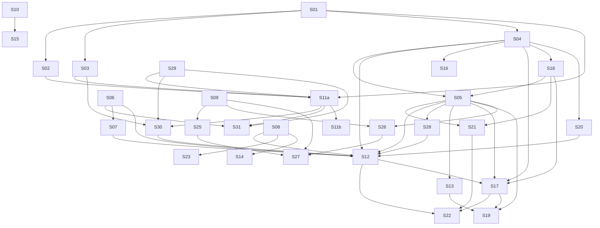

# M23 — Multi-Vertical Scheduling: Appointment Booking & Extensions

**Phase:** Local Development
**Goal:** Let customers and guests actually book against the resource model M21/M22 introduced — chosen-staff, fungible-pool, auto-any, bundled, and multi-leg resolution; variable-duration reservations; versioned intake/attendees — and give the appointment family its three standing-commitment extensions: recurring private reservations, availability alerts, and future-commitment exceptions, plus the no-show terminal state and tenant onboarding bootstrap.
**Depends on:** M21 (`Resource` aggregate), M22 (`Service.resourceRequirements`/`legs`, the resource-scoped availability engine, `resource_occupancy`)
**Blocks:** M24 (Classes & Sessions) — reuses this milestone's `booking_quote_revisions` and resource-resolution precedent for the session family's own resource pool. (M23's recurring schedules are fixed-term and materialized once, so there is no generation pattern to reuse — M24 owns its own `ClassSession` rolling worker.)
**Design rationale:** `docs/discovery/multivertical-booking/multivertical-booking.md` (promoted via `/discovery-to-milestone` on 2026-09-01) — kept as the permanent *why*; this file and the canonical docs it cites (`docs/04-USE_CASES.md` UC-061–077, `docs/02-DOMAIN_MODEL.md` § `RecurringBookingSchedule`/`AvailabilityAlert`/`FutureCommitmentException`, `docs/03-DOMAIN_EVENTS.md`, `docs/13-DATABASE_SCHEMA.md`, `docs/14-API_CONTRACTS.md`) are the source of truth for implementation — nothing below should require opening the discovery doc to understand.

## Non-Goals

- **Everything Cluster 4** (`ClassScheduleTemplate`/`ClassSession`/`ClassSessionBooking`/`RecurringEnrollment`/`ClassAccessContract`) — deferred to M24. UC-075's SESSION-preset branch (Presets D/E/F) stays inert until then; this milestone completes onboarding only for Presets A/B/C/G.
- **Cross-family resource exclusivity proof** (an APPOINTMENT service and a SESSION template sharing a resource) — `resource_occupancy`'s shared exclusion constraint already protects it structurally (M22), but it isn't testable end-to-end until M24 exists alongside this milestone.
- **Manual admin loyalty adjustments, payment processing** — unrelated to this cluster, no change here.

## Build order

| Wave | Story | Theme |
|---|---|---|
| 1 | M23-S01 | Resource resolution for booking creation — chosen/pool/auto-any/bundle/leg (UC-061–066) |
| 1 | M23-S06 | `AvailabilityAlert` aggregate — backend CRUD + BFF (UC-072 create, UC-076 manage) |
| 1 | M23-S08 | Future-commitment worklist — raise (from resource and staff deactivation), resolve one or many (bulk reassign), dismiss; removes the S04 occurrence-exception path (UC-047, UC-048, UC-070 A2, UC-073, UC-077), backend + BFF |
| 1 | M23-S09 | Appointment no-show terminal status + correction (UC-074) |
| 1 | M23-S10 | Tenant onboarding bootstrap from preset — Presets A/B/C/G (UC-075) |
| 2 | M23-S02 | Variable-duration reservations + versioned intake/attendees (UC-067, UC-068) |
| 2 | M23-S03 | Reschedule extension — resource/bundle/leg-aware, quote revisions (UC-069) |
| 2 | M23-S04 | `RecurringBookingSchedule` aggregate — create/skip/reschedule/end, backend + BFF (UC-070, minus approval/generation; Pause shipped here and was removed by M23-S20) |
| 2 | M23-S07 | Availability-alert matching — capacity-release handlers (cancel, reject, reschedule) and a daily sweep on `cron-reminders` that notifies when a date becomes selectable (UC-072 step 3) |
| 2 | M23-S29 | Public booking-flow read APIs for the frontend — resource options, duration quote, requirement-aware availability, public service shape |
| 2 | M23-S23 | Notifications for the future-commitment worklist — manager alert on a raised entry, customer message on a reassign (UC-073, UC-077) |
| 2 | M23-S24 | Drop the retired `recurring_booking_schedule_exceptions` table — the contract step of S08's removal, after S08 is deployed everywhere |
| 2 | M23-S25 | Customer email on a no-show — `BookingNoShow` → Notification (UC-074 step 3) |
| 2 | M23-S26 | Append every booking status transition to `booking_status_transitions` (no backfill) |
| 3 | M23-S27 | Staff no-show and manager correction UI — action, sheets, status history and the customer no-show detail (UC-074) |
| 2 | M23-S14 | Manager "Exceções de Agenda" worklist frontend (UC-073/077) |
| 2 | M23-S15 | Manager onboarding wizard frontend (UC-075) |
| 3 | M23-S11a | Guest/customer booking flow frontend, part 1 — step engine, intake, service cards, one resource picker and the booking-details success box (depends on S29) |
| 4 | M23-S11b | Guest/customer booking flow frontend, part 2 — bundle/journey confirmation and variable duration (depends on S11a) |
| 3 | M23-S16 | Surface `recurringHorizonDays` in the Service booking-policy dashboard panel |
| 3 | M23-S18 | Recurring-schedule fixed term (`endsOn` required and capped), hours-and-closures check and one conflict payload (UC-070) |
| 3 | M23-S20 | Remove recurring-schedule Pause (shipped pause endpoint, event and `PAUSED` status) — lands before S05 and S12 |
| 4 | M23-S05 | Recurring-schedule approval (atomic, `409` conflicts list) + one-shot occurrence materialization + approval-expiry/`ENDED` job; removes the S04 overlap layer (UC-071) |
| 4 | M23-S30 | Customer reschedules a booking — "Reagendar" screen in Minha Conta, date and time only (UC-069; needs a prototype-driven discovery of the kept-picks read) |
| 4 | M23-S31 | Availability-alert creation — "Avise-me quando abrir" button on the booking flow's calendar step and the alert page in the booking flow (UC-072; prototyped) |
| 2 | M23-S32 | Fungible-pool booking assigns a free unit, not the first eligible one (UC-062); backend-only |
| 3 | M23-S33 | Enforce the booking window on the backend — min/max advance on booking, reschedule and availability, and honour the per-service override |
| 3 | M23-S34 | Reject an availability alert on a customer-selected-duration service when no valid duration is chosen (create and update, backend-only) |
| 5 | M23-S12 | Customer "Minha Conta" extension — recurring reservations + availability alerts management |
| 5 | M23-S13 | Staff Agenda extension — recurring-schedule approval queue (UC-071 UI) |
| 5 | M23-S21 | Renewal reminder email for an ending recurring schedule (UC-070) |
| 5 | M23-S28 | Customer and staff emails for the recurring-schedule lifecycle — `Created`/`ApprovalRequested`/`Rejected`/`Ended` → Notification (UC-070, UC-071); lands before S12 |
| 6 | M23-S17 | Customer creates a recurring private reservation — pattern builder, review and outcome screens (UC-070) |
| 7 | M23-S22 | Customer renews an ending recurring schedule — "Renovar" pre-filled form (UC-070) |
| 7 | M23-S19 | Staff creates a recurring private reservation on a customer's behalf (UC-070) |

```mermaid
graph TD
  S01 --> S02
  S01 --> S03
  S01 --> S04
  S01 --> S11a
  S02 --> S11a
  S03 --> S11a
  S29 --> S11a
  S03 --> S30
  S29 --> S30
  S11a --> S30
  S06 --> S31
  S11a --> S31
  S29 --> S31
  S30 --> S12
  S11a --> S11b
  S04 --> S05
  S04 --> S12
  S04 --> S16
  S04 --> S17
  S04 --> S18
  S18 --> S05
  S04 --> S20
  S20 --> S12
  S05 --> S21
  S18 --> S21
  S21 --> S22
  S17 --> S22
  S12 --> S22
  S08 --> S12
  S08 --> S23
  S18 --> S17
  S05 --> S12
  S05 --> S28
  S28 --> S12
  S05 --> S13
  S05 --> S17
  S12 --> S17
  S05 --> S19
  S13 --> S19
  S17 --> S19
  S06 --> S07
  S06 --> S12
  S07 --> S12
  S08 --> S14
  S10 --> S15
  S09 --> S25
  S09 --> S26
  S05 --> S26
  S09 --> S27
  S25 --> S27
  S26 --> S27
```

**Wave note (self-dry-run, corrected during `/docs-audit`):** S02 and S03 both call S01's `ResourceResolutionService` in their own description text (S02 for a variable-duration window, S03 for a reschedule's replacement window) — an audit found neither declared that as a `Dependencies:` edge, and both sat in Wave 1 alongside S01 itself. Fixed: both now depend on M23-S01 and sit in **Wave 2**. This cascades: S11 (guest/customer booking flow frontend; later split into S11a — wave 3 — and S11b — wave 4, 2026-10-03) depends on S01, S02, **and** S03 — its floor is now `max(S01=1, S02=2, S03=2) + 1` = **Wave 3**, not Wave 2. S12 (Minha Conta extension) needs both S04 (recurring CRUD) and S05 (approval + generation) BFF endpoints, plus S06/S07 (alerts CRUD + matching) — its dependency floor is `max(S04, S05, S06, S07)`'s wave, i.e. Wave 3 (S05) + 1 = **Wave 4**. S13 (staff approval-queue UI) only needs S05, so it's `Wave 3 + 1 = Wave 4` too, not Wave 3 in parallel with S05 itself.

**Update (2026-09-29, M23-S17/S18/S19 added):** M23-S18 now comes **before** S05. S05's generation step is planned to skip hours-conflicted occurrences, but the resolver it reuses checks occupancy only, and occurrences beyond the creation-time horizon can only ever be evaluated at generation — so S05 needs S18's shared hours-and-closures check. S18 depends only on S04 (and TD45-S0), so it sits in **Wave 3**, S05 moves to **Wave 4**, and everything that floors on S05 shifts one wave: S12 and S13 to **Wave 5**, S17 (needs S12 and S18) to **Wave 6**, S19 (needs S17 and S13) to **Wave 7**. S17 also depends on S18 because S18 owns the single conflict payload it renders. S19 is the only one of the three that M23's goal does not need, and none of the three blocks M24.

**Update (2026-09-29, fixed-term recurrence — decided in M23-S18's `/story-discovery`):** a recurring schedule is no longer open-ended and there is no rolling generation. `endsOn` is required and may not be later than `startsOn` + the service's maximum term (`recurringHorizonDays`, 90 days by default); every occurrence of the term is checked at creation (working hours and closures, then occupancy) and materialized as a linked booking once — in the creation transaction for `AUTO_CONFIRM`, at approval for `MANUAL_APPROVAL`. A customer who wants to continue creates a new schedule, so a forgotten schedule cannot hold slots indefinitely. Consequences: M23-S05 loses `GenerateRecurringBookingOccurrencesJob` (approve/reject, the expiry job and one-shot materialization remain); M23-S18 owns the term validation, the hours-and-closures check and the one `409` occurrence payload; M23-S16 relabels the setting as the maximum term; M23-S17 adds an end-date field. Two consequences found by the follow-up `/docs-audit` (2026-09-29): a schedule whose term is over is moved to a new `ENDED` status by a second step of M23-S05's approval-expiry job (so the `status = 'ACTIVE'` cap, overlap and list queries never count an expired schedule), and Pause is removed (with every occurrence already a booking it has no effect and nothing can resume it) by **M23-S20** (Wave 3, before S05 and S12). The renewal path is **M23-S21** (the reminder email, Wave 5) and **M23-S22** (the "Renovar" pre-filled form, Wave 7, which needs a journey/prototype pass first). Wave placement of the existing stories is unchanged.

**Likely-independent stories (preview — not authoritative):** S06, S08, S09, and S10 share no files with each other or with S01 (four independent new/small aggregates, all Wave 1) — a candidate `/run-batch` group. S02 and S03 touch different methods of the same booking-creation/reschedule use cases (`RequestBookingUseCase`/`RequestAuthenticatedBookingUseCase` for S02, `RescheduleBookingUseCase` for S03) and share no files with each other, but **both now have a real `Dependencies:` edge to S01** — not independent of S01, only of each other. `/run-batch` re-derives this live; this is a courtesy preview.

---

### M23-S01 — Resource resolution for booking creation (chosen staff, fungible pool, auto-any, bundle, multi-leg) ✅ Done

**Agent:** `backend-ts` + `bff-ts`
**Complexity:** L
**Docs to load:** `docs/04-USE_CASES.md` UC-061–066, `docs/02-DOMAIN_MODEL.md` § `Service.resourceRequirements`/`legs` (M22), § availability engine (UC-058 algorithm), `docs/13-DATABASE_SCHEMA.md` § `resource_occupancy`, `booking_line_resource_assignments` (M22), `docs/14-API_CONTRACTS.md` § Booking Requests
**Dependencies:** M21-S01 (`Resource`), M22 (`Service.resourceRequirements`, availability engine — exact story ID not yet fixed at this milestone's drafting time; depend on the milestone as a whole)
**Pattern:** Extend existing helpers in-place — `docs/AGENT_PATTERNS.md` documents no "Strategy" pattern (verified during story-discovery, zero matches) and this codebase's established convention for this exact concern is a plain-function `*.helpers.ts` module with a deps bag (`resource-occupancy.helpers.ts`, `booking-request.helpers.ts`, `availability-window-resolution.helpers.ts`). A code-quality review during story-discovery (2026-09-25) confirmed `resource-occupancy.helpers.ts` is well-decomposed (single-responsibility pure functions, clean `ResolutionContext` deps object, no leaked state) and does not benefit from a class-based Strategy hierarchy for the ~4-branch `selectionMode` addition this story needs — that would fragment cohesive logic across files for no real gain. No resolution logic belongs in the `Service`/`Booking` aggregates: resolution requires `IResourceRepository`/`AvailabilityService` I/O, and this codebase's domain layer is zero-framework/I/O-free.

**Baseline already shipped by M22-S03 (✅ Done, PR #483) — do not re-build:** `resolveBookingLinesResourceCandidates()`/`resolveFlatLineCandidates()`/`resolveLeggedLineCandidates()`/`resolveRequirementResources()` in `resource-occupancy.helpers.ts` already resolve every flat/bundle/leg requirement into concrete resources (handling `requiredQuantity`, `resourcePoolIds`, per-leg turnover/transition gaps) and are already wired into `persistRequestedBooking()`, called by both `RequestBookingUseCase` and `RequestAuthenticatedBookingUseCase`. `AvailabilityService` already computes bundle intersection / pool union. `GetAvailabilityUseCase`, `schedule-availability.controller.ts`, and the BFF `schedule-availability.schemas.ts` already accept and honor `resourceId` end-to-end — **UC-066 is already fully implemented**, not new work for this story (its AC below is a non-regression confirmation, not a new build). Atomic bundle/leg locking (one `assertSlotFree()` call across all candidates in one transaction) already exists.

**Description — what this story actually adds:**
1. **`selectionMode` branching** (UC-061/062/063): `resolveCandidateIds()` currently ignores `selectionMode` entirely — it always picks the first N active resources regardless of mode. Add real branching: `CUSTOMER_CHOICE` uses a caller-supplied resource id (validated active/eligible/tenant-scoped via the existing `lookupResource()`); `AUTO_ANY` sorts eligible candidates by least already-locked workload on the tenant-local day (new `IResourceOccupancyRepository` method — none exists today — then `resourceId` as stable secondary sort, UC-063 A1); `AUTO_FUNGIBLE_POOL`/`NONE` keep today's deterministic-first-active behavior (still correct — no identity reveal, no tie-break rule specified for pool).
2. **Request body — structured customer choices, not a bare `resourceId`** (UC-061, UC-064, UC-065): `resourceSelections?: Array<{ serviceId: string; legIndex?: number; resourceType: ResourceType; resourceId: string }>` on both `RequestBookingSchema` and `RequestAuthenticatedBookingSchema` — one entry per customer choice; `serviceId` addresses the line (supports the existing up-to-20-service basket); `legIndex` set only for a legged service's per-leg choice; `resourceType` disambiguates within a bundle. Threaded down through `resolveBookingLinesResourceCandidates` → `resolveFlatLineCandidates`/`resolveLeggedLineCandidates` → `resolveRequirementResources` → `resolveCandidateIds`. Chosen over a bare singular `resourceId` — insufficient for bundle/leg `CUSTOMER_CHOICE` (UC-064/UC-065's own main flows require per-requirement/per-leg choices) — and matches M23-S03's own forward-reference to a `resourceSelections` body field for reschedule, keeping the shape consistent across the milestone.
3. **Response identity fields** (UC-062, UC-063, UC-065): no response path reveals resource identity today (`toBookingResult()`/BFF `bookings.mapper.ts` verified clean). Add optional `assignedResourceName` (flat services) and `itinerary: [{legIndex, resourceName, startsAt, endsAt}]` (legged services) to `BookingRequestResult`, threaded through the BFF mapper. Populated only for `AUTO_ANY` (name revealed, UC-063) and legs (full itinerary, UC-065); omitted for `AUTO_FUNGIBLE_POOL` (identity must stay hidden, UC-062) and `CUSTOMER_CHOICE` (customer already knows their own choice).
4. **Error granularity** (UC-064 A2, UC-065 A1): today every resolution failure throws one generic `BookingSlotUnavailableError`/`BookingServiceResourceTypeUnavailableError`. Add `BOOKING_BUNDLE_PARTIALLY_UNAVAILABLE` (a bundle — `resourceRequirements.length > 1` — has one or more but not all requirements unavailable) and `BOOKING_LEG_UNAVAILABLE` (any leg's requirement fails), with each call site in `resolveFlatLineCandidates`/`resolveLeggedLineCandidates` passing enough context to pick the right one; the existing generic error stays for the true single-resource, non-bundle/non-leg case. Bundle/leg resolution re-validates atomically at submit time via the existing single `assertSlotFree()` call across all candidates — never a partial lock.

**Backend HTTP surface:** existing `POST /bookings` (guest) and its authenticated-customer equivalent — request body gains optional `resourceSelections` (shape above) with no other shape change.

**BFF endpoint spec:** extend `apps/bff/src/features/booking/bookings.controller.ts` + `bookings-guest.controller.ts` + `bookings.schemas.ts` — pass through the new optional `resourceSelections` field; extend `bookings.mapper.ts` to surface `assignedResourceName` (UC-063) / `itinerary` (UC-065) when present.

**Files to create/modify (updated post-implementation to match what actually shipped):**
- `apps/backend/src/contexts/booking/application/use-cases/resource-occupancy.helpers.ts` (+ `.spec.ts`) (modify — trimmed to the per-line orchestrator + `deriveResourceSelectionsFromAssignments()`; the flat/legged candidate-building and per-requirement `selectionMode` algorithm were split out below, both for docs/CODE_STANDARDS.md's file-length limit)
- `apps/backend/src/contexts/booking/application/use-cases/resource-resolution-context.helpers.ts` (new — shared `ResolutionContext`/`selectionKey()`, kept in its own file specifically so the two files below don't import each other in a cycle)
- `apps/backend/src/contexts/booking/application/use-cases/resource-occupancy-candidate-builders.helpers.ts` (new — flat/legged candidate building, moved out of `resource-occupancy.helpers.ts`)
- `apps/backend/src/contexts/booking/application/use-cases/resource-requirement-resolution.helpers.ts` (new — the `selectionMode` branching algorithm itself, moved out of `resource-occupancy.helpers.ts`)
- `apps/backend/src/contexts/booking/application/dtos/request-booking.dto.ts`, `request-authenticated-booking.dto.ts` (modify — `resourceSelections` field, via a new shared `ResourceSelectionSchema` in `packages/validation/src/booking.ts`)
- `apps/backend/src/contexts/booking/application/use-cases/booking-request.helpers.ts` (+ `.spec.ts`) (modify — thread `resourceSelections`/`timezone` through `persistRequestedBooking`, return `candidatesByLine`, extend `toBookingResult()` with the new response fields, add `toResourceSelections()` DTO bridge)
- `apps/backend/src/contexts/booking/application/use-cases/request-booking.use-case.ts` (+ `.spec.ts`) (modify — pass `resourceSelections`/`timezone` through)
- `apps/backend/src/contexts/booking/application/use-cases/request-authenticated-booking.use-case.ts` (+ `.spec.ts`) (modify — pass `resourceSelections`/`timezone` through)
- `apps/backend/src/contexts/booking/application/use-cases/approve-booking.use-case.ts` (modify — not in the original list; the signature change to `resolveBookingLinesResourceCandidates()` requires it. Derives `resourceSelections` from the booking's already-persisted `booking_line_resource_assignments` via `deriveResourceSelectionsFromAssignments()`, so a `CUSTOMER_CHOICE` pick survives re-resolution at approval time — locked in during implementation, see the story's own design-decision record above)
- `apps/backend/src/contexts/booking/application/use-cases/reschedule-booking.use-case.ts` (modify — same reason and same fix as `approve-booking.use-case.ts` above; not in the original list)
- `apps/backend/src/contexts/booking/application/services/booking-slot-conflict.service.ts` (+ `.spec.ts`) (modify — widened `assertSlotFree()`'s param type to `ResourceOccupancyCandidate[]`, classifies bundle/leg/single conflicts)
- `apps/backend/src/contexts/booking/application/ports/resource-occupancy-repository.port.ts` (modify — `countActiveByResource()` for the `AUTO_ANY` tie-break, `findAssignmentsByBookingLines()` for the approval/reschedule replay above)
- `apps/backend/src/contexts/booking/infrastructure/repositories/typeorm-resource-occupancy.repository.ts` (+ `.spec.ts`, `.integration.spec.ts`) (modify — implements both new port methods)
- `apps/backend/src/contexts/booking/infrastructure/repositories/typeorm-resource-occupancy.write-queries.ts` (new — not in the original list; the write-path upsert/insert logic split out of the repository class, also for the file-length limit; named to match the folder's own `.mapper.ts`/`.persistence-errors.ts` split-file convention rather than a generic `.helpers.ts` suffix)
- `apps/backend/eslint.config.js` (modify — added the new write-queries file to the existing TypeORM-import allowlist, same treatment as its sibling repository file)
- `apps/backend/src/test/repositories/booking/in-memory-resource-occupancy.repository.ts` (modify — the two new port methods, for unit tests)
- `apps/backend/src/contexts/booking/domain/errors/booking-service.error.ts` (modify — `BookingResourceSelectionRequiredError`)
- `apps/backend/src/contexts/booking/domain/errors/booking-lifecycle.error.ts` (modify — `BookingBundlePartiallyUnavailableError`, `BookingLegUnavailableError`)
- `apps/backend/src/contexts/booking/infrastructure/http/booking-error.mapper.ts` (modify — map the three new errors)
- `apps/backend/src/contexts/booking/infrastructure/controllers/booking.controller.integration.spec.ts` (modify — not in the original list; end-to-end `POST /bookings` coverage for `CUSTOMER_CHOICE`/`AUTO_ANY`/`AUTO_FUNGIBLE_POOL`/legged resolution against a real Postgres)
- `packages/types/src/error-codes.ts` (modify — `BOOKING_RESOURCE_SELECTION_REQUIRED`, `BOOKING_BUNDLE_PARTIALLY_UNAVAILABLE`, `BOOKING_LEG_UNAVAILABLE`)
- `packages/validation/src/booking.ts` (modify — new shared `ResourceSelectionSchema`, not in the original list; reused by both the backend DTOs and the BFF schema below)
- `packages/i18n/locales/{pt-BR,en}/errors.json` (modify — all three new codes)
- `apps/bff/src/features/booking/bookings.schemas.ts` (modify — `resourceSelections` on both request schemas, importing the shared `ResourceSelectionSchema`)
- `apps/bff/src/features/booking/bookings.types.ts` (modify — not in the original list; `assignedResourceName`/`itinerary` on `BookingLineResponse`, new `BookingLineItineraryLegResponse`). `bookings.controller.ts`/`bookings-guest.controller.ts`/`bookings.mapper.ts` needed **no code change** — booking creation is a pure `body`/response passthrough, already covered by the schema/type changes.
- `apps/backend/http/booking/bookings.http` (modify — new `resourceSelections` example)
- `docs/27-BUSINESS_LOGIC_REFERENCE.md` § Booking — Resource-Scoped Scheduling & Availability (modify — new "selectionMode resolution algorithm (M23-S01)" subsection, plus fixed two claims the M22 baseline text had made that M23-S01 supersedes)
- `docs/04-USE_CASES.md` UC-066 (modify — fix stale `Endpoint:` line; already applied during story-discovery)

**Already correctly implemented by M22-S03 — no changes needed:** ~~`resource-resolution.service.ts`~~ (never built this — see Pattern above), `get-availability.use-case.ts`, `availability.service.ts`, `typeorm-booking-availability.adapter.ts`, `schedule-availability.controller.ts`.

**Acceptance criteria — product:**
- [x] Customer/guest booking a `CUSTOMER_CHOICE` service picks a staff member and sees only that resource's slots.
- [x] Booking an `AUTO_FUNGIBLE_POOL` service (e.g. a court) shows union availability and never reveals which specific unit was assigned.
- [x] Booking an `AUTO_ANY` service shows the assigned staff member's name on confirmation.
- [x] Booking a bundled or multi-leg service either fully succeeds or fully fails — never a partial lock.
- [x] A service with no `resourceRequirements` behaves exactly as before this story (explicit non-regression AC).
- [x] UC-066 (browse a specific staff member's calendar via `GET /v1/schedule/availability?...&resourceId=`) still works — non-regression confirmation only, already shipped by M22-S03.

**Acceptance criteria — technical:**
- Unit:
  - [x] `resolveCandidateIds()` correctly branches per `selectionMode` (`CUSTOMER_CHOICE` uses the caller-supplied id, `AUTO_ANY`/`AUTO_FUNGIBLE_POOL`/`NONE` behave per the Description above), given a fixture resource set
  - [x] Bundle resolution rejects with `BOOKING_BUNDLE_PARTIALLY_UNAVAILABLE` (`409`) when any one required resource is unavailable
  - [x] Leg-chain resolution rejects with `BOOKING_LEG_UNAVAILABLE` (`409`) when any leg's requirement is unavailable, and computes correct per-leg sub-windows including transition gaps
  - [x] `AUTO_ANY` tie-break picks the least-loaded resource, `resourceId` as stable secondary sort
  - [x] A `resourceSelections` entry for another tenant's resource is rejected
- Integration:
  - [x] `POST /bookings` for a `CUSTOMER_CHOICE` service (via `resourceSelections`) persists a resolved `resource_occupancy` row
  - [x] Booking response for `AUTO_ANY` includes `assignedResourceName`; for `AUTO_FUNGIBLE_POOL` never includes any resource identity; for a legged service includes the full `itinerary`
  - [x] A bundle/leg race (two concurrent submits contending for the same resource) — the DB's shared GIST exclusion constraint rejects the loser, `409` (verified generically — a true simultaneous-commit race always throws the generic `BookingSlotUnavailableError` via `rethrowOccupancyInsertError`, regardless of candidate count; the new bundle/leg-specific codes apply to the far more common pre-check-detects-an-existing-conflict path, which is separately unit-tested)
- Tenant isolation:
  - [x] A `resourceSelections` entry naming another tenant's resource is rejected, never silently scoped in
- E2E: none — covered by S11a/S11b's frontend E2E
- [x] Coverage ≥80% on changed code (backend unit: 3230/3230 passing; booking-context integration: 271/271 passing; BFF unit: 647/647, component: 434/434 — all passing, no regressions)
- [x] `tsc --noEmit` clean, lint clean

---

### M23-S02 — Variable-duration reservations + versioned booking intake/attendees ✅ Done

**Agent:** `backend-ts` + `bff-ts`
**Complexity:** M
**Docs to load:** `docs/04-USE_CASES.md` UC-067, UC-068, `docs/02-DOMAIN_MODEL.md` § `Service.durationPolicy`/`pricingPolicy` (M22), § `service_booking_intake_schema` (M22), `docs/13-DATABASE_SCHEMA.md` § `booking_attendees` (M22)
**Dependencies:** M21-S01, M22 (`durationPolicy`, intake schema — same milestone-level dependency note as S01), M23-S01 (calls its resource-resolution helpers — `resource-requirement-resolution.helpers.ts`'s `resolveRequirementResources()`, orchestrated via `resource-occupancy.helpers.ts` — to resolve the variable-duration window's resource(s), doesn't duplicate resolution logic)
**Pattern:** plain composition — additive request fields on the existing booking-creation use cases; no new pattern.

**Description:**
Two independently-triggerable, additive extensions of `POST /bookings`, bundled in one story because both are conditional branches inside the same request-validation step (not the resource-resolution logic S01 owns):
1. **UC-067 variable duration:** when the service has `durationPolicy = CUSTOMER_SELECTED`, request body carries `startsAt`/`durationMinutes`/`participantCount`; validate against the service's min/max/increment/participant-limit rules, quote the per-increment price (round-up rule per `docs/13-DATABASE_SCHEMA.md`), resolve the required resource(s) for that exact interval (calls S01's resolver with the computed window, doesn't duplicate resolution logic).
2. **UC-068 intake/attendees:** when the service declares an active `service_booking_intake_schema`, request body carries `intakeSchemaVersion`/`intakeAnswers`/optional named attendees; validate required answers against the **displayed** schema version (never silently re-validate against a version that changed mid-flow, UC-068 A1), snapshot version+answers+consent on the booking.

**Design decisions locked in during discovery (2026-09-25):**
- **Basket scope (UC-067 A4 / UC-068 A4):** `serviceIds` is a multi-line basket where duplicates are allowed (`docs/14-API_CONTRACTS.md`), and M23-S01 already established a per-line addressing convention (`resourceSelections`, keyed by `serviceId`+`legIndex`) for exactly this ambiguity. Rather than extend that same per-line pattern to `durationMinutes`/`participantCount`/intake fields, the request body keeps them as flat, request-root fields as UC-067/068 literally describe — but a request may contain **at most one** service that is `durationPolicy = CUSTOMER_SELECTED` and/or intake-bearing; more than one → `422 invalid-multiple-variable-services` (new error code, added to the list below). Matches the discovery doc's "multi-service bookings are business-configured bundles/journeys, not arbitrary carts" framing; avoids inventing a second per-line addressing scheme for a case that's realistically single-service in practice.
- **Missing `durationMinutes` fallback:** no fallback to `Service.durationMinutes` — that field is not authoritative once `durationPolicy = CUSTOMER_SELECTED` (`docs/02-DOMAIN_MODEL.md`, updated). Omitting it on such a service is `422 BOOKING_DURATION_OUT_OF_RANGE`.
- **`participantCount` vs. `ResourceRequirement.requiredQuantity`:** independent. `participantCount` is a customer-supplied capacity/attendee-count input only; it never dynamically overrides `requiredQuantity`, which stays the service's static configured value (UC-067 A3, updated).
- **Intake submitted with no active schema:** silently ignored (not persisted, not an error) — added as UC-068 A5.
- **No new migration or entity files needed** — verified against the actual codebase at story-discovery: `booking.entity.ts` already has `intakeSchemaVersion`/`intakeAnswers`/`participantCount`/`consentAcceptedAt`/`consentVersion` (added by M22-S02's `1748500000011-AddServiceBookingPolicyAndIntakeSchema.ts`), `booking-attendee.entity.ts`/`booking_attendees` already exist with a test builder (also M22-S02, explicitly built "schema-only... reachable once a booking actually submits attendees in M23"), and `booking_lines.duration_mins_at_booking` already exists as a generic per-line duration snapshot — reused directly for the customer-selected duration (`docs/13-DATABASE_SCHEMA.md`, updated), no new `durationMinutes` column anywhere. What actually needs wiring, and was missing from this story's original file list: `booking.aggregate.ts` (zero references to any of these fields today, verified by grep) and `typeorm-booking.repository.ts` (needs `BookingAttendeeEntity` persisted the same way it already persists `BookingLineEntity` — same file, same transaction, no new port).
- **`GET /services/:id/intake-schema` route collision:** that exact path already exists, built by M22-S04 for the staff edit page (`StaffOrManagerRoleGuard`-gated, returns `{active, history[]}`). A second handler can't share the same path. New path: `GET /services/:id/intake-schema/public` (no guard), reusing `GetServiceIntakeSchemaUseCase` but returning only `{ active }` — never `history`, which a customer has no reason to see. Precedent for guest/authenticated path splits already exists in this same controller family (`POST /bookings` vs. `POST /bookings/authenticated`).

**Backend use case steps:**
1. Extend `RequestBookingUseCase`/`RequestAuthenticatedBookingUseCase` validation step: reject if more than one service in the basket is `CUSTOMER_SELECTED`/intake-bearing (`422 invalid-multiple-variable-services`). If `durationPolicy = CUSTOMER_SELECTED`, require and validate interval/participants, compute quote; else use the service's fixed `durationMinutes` (unchanged).
2. Same use cases: if an active intake schema exists, validate `intakeSchemaVersion` matches the currently-active one *or* an explicitly-passed prior version the client displayed (never reject solely for "not the latest"), validate required answers/consent (`422` naming missing fields, UC-068 A3), persist snapshot + attendees (via `booking.aggregate.ts` + `typeorm-booking.repository.ts`, see decisions above). Intake fields submitted for a service with no active schema are ignored, not validated.
3. New read endpoint `GET /services/:id/intake-schema/public` (UC-068 step 1) — reuses `GetServiceIntakeSchemaUseCase`, returns `{ active }` only.

**Backend HTTP surface:** `POST /bookings` (guest+authenticated) body gains optional `durationMinutes`/`participantCount`, `intakeSchemaVersion`/`intakeAnswers`/`consentAccepted`/`attendees`. New `GET /services/:id/intake-schema/public`.

**BFF endpoint spec:** extend `bookings.schemas.ts` for the new optional fields; new route on the existing `apps/bff/src/features/booking/services.public.controller.ts` (already exists — currently only has the services-list route) for `GET /services/:id/intake-schema/public`.

**Files to create/modify:**
- `apps/backend/src/contexts/booking/application/use-cases/request-booking.use-case.ts` / `request-authenticated-booking.use-case.ts` (+ specs) (modify)
- `apps/backend/src/contexts/booking/application/services/booking-quote.service.ts` (+ `.spec.ts`) (new — per-increment price + minimum-charge rounding, isolated from the resolver so S01 doesn't need to know about pricing)
- `apps/backend/src/contexts/booking/domain/booking.aggregate.ts` (+ `.spec.ts`) (modify — carry `intakeSchemaVersion`/`intakeAnswers`/`participantCount`/`consentAcceptedAt`/`consentVersion`/`attendees: BookingAttendee[]` through `requestBooking()`; not in the original list, found at story-discovery — see decisions above)
- `apps/backend/src/contexts/booking/infrastructure/repositories/typeorm-booking.repository.ts` (+ `.spec.ts`) (modify — persist `BookingAttendeeEntity` rows the same way `BookingLineEntity` rows are already persisted, same transaction; not in the original list)
- `apps/backend/src/contexts/booking/application/use-cases/get-service-intake-schema.use-case.ts` — **no change needed**, already exists (M22-S04); reused as-is by the new public route below
- `apps/backend/src/contexts/booking/infrastructure/controllers/service.controller.ts` (+ `.spec.ts`, `.integration.spec.ts`) (modify — new `@Get(':id/intake-schema/public')` route, no guard, returns `{ active }` only)
- `packages/types/src/error-codes.ts` (modify — `BOOKING_INTAKE_ANSWER_MISSING`, `BOOKING_DURATION_OUT_OF_RANGE`, `BOOKING_INVALID_MULTIPLE_VARIABLE_SERVICES`)
- `packages/i18n/locales/{pt-BR,en}/errors.json` (modify — all three new codes)
- `apps/bff/src/features/booking/bookings.schemas.ts` (modify — new optional fields), `services.public.controller.ts` (+ specs) (modify — already exists, add the new route)
- `apps/backend/http/booking/services.http` (modify — new `/intake-schema/public` request)

~~`apps/backend/src/contexts/booking/infrastructure/entities/booking.entity.ts`~~ / ~~`booking-attendee.entity.ts`~~ — struck from the original file list; both already fully exist (M22-S02), no changes needed (see decisions above).

**Acceptance criteria — product:**
- [x] Customer booking a variable-duration service picks start+duration within the configured rules and sees the correct quoted price.
- [x] Customer booking a service with an active intake schema completes the required questions/consent before submitting.
- [x] A service form change mid-flow never silently rewrites an already-completed answer (UC-068 A1).
- [x] A request combining more than one `CUSTOMER_SELECTED`/intake-bearing service in the same basket is rejected, not silently applied to just one of them (UC-067 A4/UC-068 A4).

**Acceptance criteria — technical:**
- Unit:
  - [x] Quote service rounds up to the correct increment, applies minimum charge when set
  - [x] Intake validation rejects a missing required answer/consent with the exact field named
  - [x] Duration validation rejects an interval outside min/max/increment, and rejects a `CUSTOMER_SELECTED` service booked with no `durationMinutes` at all (no fallback to `Service.durationMinutes`)
  - [x] `participantCount` never changes how many resources `resolveRequirementResources()` locks — only `ResourceRequirement.requiredQuantity` does (verified by code review — `participantCount` is never passed into the resource-resolution path; M23-S01's own tests already cover `requiredQuantity` governing resolution)
  - [x] `intakeAnswers`/`attendees` submitted for a service with no active intake schema are ignored — no validation error, nothing persisted
  - [x] A basket with two `CUSTOMER_SELECTED`/intake-bearing services (or the same one twice) is rejected with `BOOKING_INVALID_MULTIPLE_VARIABLE_SERVICES`
- Integration:
  - [x] `POST /bookings` with a variable-duration interval persists the correct quote and locks the resource for the exact computed window
  - [x] `POST /bookings` snapshots intake answers immutably even after the service's schema is later updated
  - [x] `GET /services/:id/intake-schema/public` returns only `{ active }` (no `history`) and requires no auth; `404` for a missing/cross-tenant service id; `{ active: null }` (not `404`) for an inactive service with no published schema, or its last-published schema if one exists — no active-only existence check exists at the repository level, matching UC-068's actual precondition
- Tenant isolation: n/a beyond S01's existing resource-tenant checks
- E2E: none — covered by S11a/S11b
- [x] Coverage ≥80% on changed code (backend unit: 3280/3280 passing; booking-context integration: 279/279 passing; full backend integration: 662/662 passing; BFF unit: 653/653, component: 437/437 — all passing, no regressions; `architecture-check`: 0 violations)
- [x] `tsc --noEmit` clean, lint clean

---

### M23-S03 — Reschedule extension: resource/bundle/leg-aware, quote revisions ✅ Done

**Agent:** `backend-ts` + `bff-ts`
**Complexity:** M/L (raised from M during story-discovery, 2026-09-26 — see decisions below)
**Docs to load:** `docs/04-USE_CASES.md` UC-069, `docs/14-API_CONTRACTS.md` § Reschedule (extended), § Cancel (UC-007/UC-008, for the role-dispatch precedent), `docs/13-DATABASE_SCHEMA.md` § `booking_quote_revisions`, `docs/03-DOMAIN_EVENTS.md` § BookingRescheduled/BookingCancelled, `docs/27-BUSINESS_LOGIC_REFERENCE.md` § selectionMode resolution algorithm
**Dependencies:** M21-S01, M22, M23-S01 (reuses its resource-resolution helpers — `resource-requirement-resolution.helpers.ts`'s `resolveRequirementResources()`, orchestrated via `resource-occupancy.helpers.ts` — to resolve the replacement resource(s)/window, doesn't duplicate resolution logic)
**Pattern:** customer/admin actor split, mirroring `PATCH /bookings/:id/cancel`'s existing `cancel-customer`/`cancel-admin` BFF-role-dispatch precedent — **not** "plain composition" as originally scoped. Story-discovery (2026-09-26) found the existing `RescheduleBookingUseCase` is staff-only today (hardcoded `staffId`, `StaffOrManagerRoleGuard`), with no customer path at all; UC-069's actor is "Customer, or audited staff acting for the customer," the same actor shape Cancel already solved. Reuse that shape rather than inventing a new one.

**Design decisions locked in during discovery (2026-09-26):**
- **Actor split:** new `RescheduleBookingAsCustomerUseCase` (+ dto + route `reschedule-customer`) for the customer path; the existing `RescheduleBookingUseCase` becomes the staff/admin path, exposed at `reschedule-admin` (renamed route, same class). BFF's single public `PATCH /bookings/:id/reschedule` dispatches by JWT role, exactly like `cancel`/`cancel-customer`/`cancel-admin`.
- **Release-then-assign ordering confirmed already correct — no reorder needed.** Initial discovery flagged `resource-occupancy-assignment.helpers.ts`'s `moveBookingLinesOccupancy()` (release-then-assign) as violating UC-069 A1. Re-examined while implementing: `release()` and `assign()` both run inside the *same* `txManager.run()` transaction as `booking.reschedule()`/`save()` — if `assign()` fails (a concurrent booking wins the replacement resource), the **entire transaction rolls back**, so the `release()` DELETE never actually commits and the original `resource_occupancy` row(s) are restored exactly as before. Postgres's exclusion constraint also blocks (rather than silently races) a concurrent overlapping insert until the first inserter's transaction resolves. Net: UC-069 A1 already holds today, no code change to this helper. Reordering to insert-then-delete would additionally have *broken* a same-resource duration-extension reschedule (new window overlapping the still-present old row on the same resource would hit the exclusion constraint against itself) unless the constraint were also made `DEFERRABLE` — disproportionate machinery for a bug that doesn't exist. Left as-is; only a new integration test proving the rollback behavior is added (see AC below).
- **Reschedule-window eligibility, implemented now:** add `Booking.isEligibleForReschedule(rescheduleWindowHours: number)` (mirrors the existing `isEligibleForCancellation()`), a new `RescheduleWindowExpiredError` (`BOOKING_RESCHEDULE_WINDOW_EXPIRED` in `packages/types/src/error-codes.ts`, mapped to `422` alongside `CancellationWindowExpiredError` in `booking-error.mapper.ts`), and both locale files. The effective window resolves `service.rescheduleWindowHoursOverride ?? tenant cancellationWindowHours default` from the `serviceMap` `RescheduleBookingUseCase` already loads — not the flat tenant-only value the existing Cancel flow uses (a known, separate, out-of-scope gap in Cancel — not fixed here). **Customer path only** — the admin path never runs this check (A3, mirrors the existing cancellation-window staff override).
- **Full UC-069 scope, not time-only:** `durationMinutes` (customer body) re-quotes via M23-S02's `BookingQuoteService`, updating line durations/`totalDurationMins`/price before the `booking_quote_revisions` row is written. `resourceSelections` (customer body), when present, overrides the default `deriveResourceSelectionsFromAssignments()` replay for the matching `CUSTOMER_CHOICE` requirement — same `(serviceId, legIndex, resourceType)`-keyed precedence `POST /bookings` already uses (`docs/27-BUSINESS_LOGIC_REFERENCE.md`); an entry with no match is unused, never an error (same safety property that section documents). `AUTO_ANY`/`AUTO_FUNGIBLE_POOL` requirements always ignore any submitted entry and re-derive fresh, unchanged from today.
- **`BookingRescheduledData` gains `isBusiness: boolean`**, mirroring `BookingCancelledData`'s existing `cancelledBy`/`isBusiness` shape (`docs/03-DOMAIN_EVENTS.md`, already updated) — `rescheduledBy` now holds either actor's id, no longer always a staff id.
- **`docs/27-BUSINESS_LOGIC_REFERENCE.md`'s § selectionMode resolution algorithm** already documents the approve/reschedule replay mechanic (written ahead of this story, during M23-S01) — update its reschedule-related bullets once implemented to reflect the resourceSelections-override addition; don't leave it describing only the pre-S03 behavior.

**Backend use case steps (customer path, `RescheduleBookingAsCustomerUseCase`):**
1. Load booking + ownership check (`booking.customerId !== customerId` → `BookingForbiddenError`, mirrors `CancelBookingAsCustomerUseCase`).
2. Check `booking.isEligibleForReschedule(effectiveRescheduleWindowHours)` → `422 RescheduleWindowExpiredError` if not.
3. If `durationMinutes` present: re-quote via `BookingQuoteService`, update line durations/price.
4. Resolve the replacement resource(s)/window via S01's resolution helpers, merging any body `resourceSelections` over the default replay (see decisions above).
5. Inside `txManager.run()`: `assertSlotFree()` + `moveBookingLinesOccupancy()` (release-then-assign, unchanged — already safe, see decisions above).
6. If price changed: insert a `booking_quote_revisions` row (`revision_no` = next for this `booking_id`), include it in the response.
7. `booking.reschedule(customerId, newScheduledAt, correlationId, undefined, isBusiness: false)`; publish `BookingRescheduled`.

**Backend use case steps (admin path, existing `RescheduleBookingUseCase`, renamed route only):** same resource-resolution/occupancy-move/quote-revision steps as above, minus the eligibility check (A3), actor is `staffId`, `isBusiness: true`, `adminNotes` optional.

A bundle/leg reschedule re-validates the whole chain atomically on both paths (UC-069 A2) — this already works today via the existing `assertSlotFree()`/`resolveBookingLinesResourceCandidates()` wiring, no new logic needed.

**Backend HTTP surface:** existing `PATCH /bookings/:id/reschedule` route splits into `PATCH /bookings/:id/reschedule-customer` (new) and `PATCH /bookings/:id/reschedule-admin` (renamed from `:id/reschedule`) on `booking-completion.controller.ts`, mirroring `:id/cancel-customer`/`:id/cancel-admin` on the same controller.

**BFF endpoint spec:** `apps/bff/src/features/booking/bookings.controller.ts`'s single `PATCH /bookings/:id/reschedule` route dispatches to `reschedule-customer`/`reschedule-admin` by JWT role (mirrors its existing cancel dispatch); `bookings.schemas.ts` gains the customer body schema (`resourceSelections`/`durationMinutes`/`scheduledAt`) alongside the existing admin one, plus the `quoteRevision` response field.

**Files to create/modify:**
- `apps/backend/src/contexts/booking/application/use-cases/reschedule-booking-as-customer.use-case.ts` (+ `.spec.ts`) (new)
- `apps/backend/src/contexts/booking/application/dtos/reschedule-booking-as-customer.dto.ts` (new)
- `apps/backend/src/contexts/booking/application/use-cases/reschedule-booking.use-case.ts` (+ `.spec.ts`) (modify — admin path: resourceSelections/durationMinutes support, `isBusiness: true`)
- `apps/backend/src/contexts/booking/application/dtos/reschedule-booking.dto.ts` (modify — gains optional `resourceSelections`/`durationMinutes`)
- `apps/backend/src/contexts/booking/domain/booking.aggregate.ts` (+ `.spec.ts`) (modify — `isEligibleForReschedule()`, duration/price update on reschedule, `isBusiness` param)
- `apps/backend/src/contexts/booking/domain/events/booking-rescheduled.event.ts` (modify — `isBusiness: boolean`)
- `apps/backend/src/contexts/booking/domain/errors/booking-lifecycle.error.ts` (+ `.spec.ts`) (modify — new `RescheduleWindowExpiredError`)
- `apps/backend/src/contexts/booking/infrastructure/http/booking-error.mapper.ts` (modify — map `RescheduleWindowExpiredError` to `422`)
- `apps/backend/src/contexts/booking/infrastructure/controllers/booking-completion.controller.ts` (+ specs) (modify — `:id/reschedule-customer` new route, `:id/reschedule` renamed to `:id/reschedule-admin`)
- `apps/backend/src/contexts/booking/infrastructure/entities/booking-quote-revision.entity.ts` (new)
- `apps/backend/src/contexts/booking/infrastructure/repositories/typeorm-booking-quote-revision.repository.ts` (+ `.spec.ts`) (new)
- `apps/backend/src/contexts/booking/application/ports/booking-quote-revision-repository.port.ts` (new)
- `apps/backend/src/contexts/booking/infrastructure/migrations/<timestamp>-CreateBookingQuoteRevisions.ts` (new — per `docs/13-DATABASE_SCHEMA.md`'s source-exclusive CHECK; `class_session_booking_id` FK stays unreachable until M24)
- `apps/backend/src/test/infrastructure/integration-global-setup.ts` (modify — register `BookingQuoteRevisionEntity`)
- `apps/backend/src/test/builders/booking/` — new `booking-quote-revision.builder.ts` (+ entity builder), following existing per-aggregate builder conventions
- `packages/types/src/error-codes.ts` (modify — `RESCHEDULE_WINDOW_EXPIRED: 'BOOKING_RESCHEDULE_WINDOW_EXPIRED'`)
- `packages/i18n/locales/{pt-BR,en}/errors.json` (modify — new error code entry, both locales, same commit)
- `apps/bff/src/features/booking/bookings.controller.ts` (+ specs), `bookings.schemas.ts` (modify — role dispatch, new customer schema, `quoteRevision` response field)
- `apps/backend/http/booking/bookings.http` (modify — customer + admin reschedule examples, including the new `422 reschedule-window-expired` case)
- `docs/27-BUSINESS_LOGIC_REFERENCE.md` § selectionMode resolution algorithm (modify — reflect the resourceSelections-override addition, per decisions above)

**Acceptance criteria — product:**
- [ ] ~~Customer rescheduling a resource-scoped/bundle/leg/variable-duration booking sees the recomputed quote before confirming.~~ **Resolved by decision (2026-10-03):** the customer reschedule screen (**M23-S30**) keeps the booking's duration and picks, so a customer reschedule can never change the price and there is no quote to preview; the preview item is dropped, not deferred. (Original note — Codex round-1 review, PR #519: this story returns the authoritative quote only as part of the committing `PATCH` response — there is no way today for a frontend to preview a price/duration change before the customer confirms it, since no dry-run capability exists. This story is backend/BFF-only; whether a real pre-commit preview needs a new non-mutating endpoint, or a client-side estimate is sufficient, was a UX decision left for when the customer reschedule UI was designed; that design now exists and makes it moot.)
- [x] A failed reschedule (replacement unavailable) leaves the original booking fully intact — customer never loses their slot.
- [x] A customer reschedule request outside the effective reschedule window is rejected with a clear error; the original booking is untouched.
- [x] Staff override reschedule records actor+reason without bypassing any capacity/exclusivity check, and is never subject to the reschedule-window check.

**Acceptance criteria — technical:**
- Unit:
  - [x] Reschedule rejects with `409` when replacement is unavailable, original booking state unchanged
  - [x] Customer reschedule rejects with `422 reschedule-window-expired` when outside `service.rescheduleWindowHoursOverride ?? tenant default`; admin reschedule never runs this check
  - [x] `booking_quote_revisions.revision_no` increments correctly per booking
  - [x] A body-supplied `resourceSelections` entry overrides the replayed pick for its matching `CUSTOMER_CHOICE` requirement; an unmatched entry is ignored, not an error (verified at the `mergeResourceSelections()` unit level, the exact function both use cases call)
  - [x] `durationMinutes` on a variable-duration reschedule re-quotes via `BookingQuoteService` and updates line durations/`totalDurationMins`
  - [x] `BookingForbiddenError` when a customer reschedules a booking they don't own
- Integration:
  - [x] Reschedule of a bundle/leg booking is atomic — a mid-chain conflict rolls back the whole attempt (`resolveRescheduleCandidates()` delegates unchanged to S01's own `resolveBookingLinesResourceCandidates()`/`assertSlotFree()`, already covered by that module's own bundle/leg tests; the sequential 409-conflict integration test added for this story exercises the same reschedule code path end-to-end)
  - [x] A losing *concurrent* reschedule (two real HTTP requests fired concurrently at the same target slot via `Promise.all`, not a sequential pre-existing-conflict case) rolls back cleanly — exactly one of the two succeeds, and the loser's booking keeps its original `scheduledAt` (CodeRabbit round-1 review, PR #519: this repo's own `.coderabbit.yaml` path-instructions mandate a concurrency integration test for any PR touching slot-approval/occupancy logic — mirrors the existing `ApproveBookingUseCase` "serializes concurrent approvals" integration test exactly, no raw-connection transaction orchestration needed). The initial discovery-time assessment that this would need fragile two-raw-connection orchestration was wrong — a plain concurrent-HTTP-request test was sufficient, same as the pre-existing approval test already proved.
  - [x] Stale-aggregate-save concurrency (two saves loading the same booking version, one must fail `BookingConcurrentModificationError`) is not re-tested per-use-case here — already covered generically, independent of which use case calls `save()`, by `booking.repository.integration.spec.ts`'s existing "throws BookingConcurrentModificationError when saving a stale loaded aggregate" test; reschedule uses the identical `bookingRepo.save()` path (CodeRabbit round-1 review, declined as already-covered rather than fixed).
- Tenant isolation: n/a beyond existing booking tenant scoping
- E2E: none — covered by S11a/S11b/S12
- [x] Coverage ≥80% on changed code
- [x] `tsc --noEmit` clean, lint clean

---

### M23-S06 — `AvailabilityAlert` aggregate — backend CRUD + BFF ✅ Done

**Agent:** `backend-ts` + `bff-ts`
**Complexity:** M
**Docs to load:** `docs/04-USE_CASES.md` UC-072, UC-076, `docs/02-DOMAIN_MODEL.md` § `AvailabilityAlert`, `docs/13-DATABASE_SCHEMA.md` § `availability_alerts`/`availability_alert_notification_attempts`, `docs/14-API_CONTRACTS.md` § Availability Alerts, `docs/03-DOMAIN_EVENTS.md` § `AvailabilityAlert*`
**Dependencies:** M21-S01, M22
**Pattern:** Repository + Adapter (`IAvailabilityAlertRepository` port, `TypeOrmAvailabilityAlertRepository` adapter) — matches every other Booking-context aggregate; no new pattern.

**Description:**
Create the `AvailabilityAlert` aggregate exactly per `docs/02-DOMAIN_MODEL.md`'s field list. Authenticated-customer-only (UC-072 A1 sends an unauthenticated visitor to login and then to the alert page — a **frontend** concern, handled in S31). This story covers create/list/edit/cancel and the expiry worker; the *matching* worker (step 3, "when a slot releases, notify") is S07, a separate async trigger.

**Decisions locked at `/story-discovery` (2026-10-05):**
- **Eligibility:** create rejects a service whose `availabilityAlertEligible` is `false` — `422` `BOOKING_ALERT_INELIGIBLE_SERVICE` (UC-072 precondition; mirrors `BOOKING_RECURRING_SCHEDULE_INELIGIBLE_SERVICE`).
- **`expiresAt`:** optional on create and PATCH. Default = creation time + 30 days; a client-set value may be at most 90 days after creation (raised to 365 by M23-S07); for `ONE_TIME_RANGE` it is clamped to `acceptableEndAt` (an alert for a range that has passed is pointless). Past or beyond-cap values → `422` `BOOKING_ALERT_CRITERIA_INVALID`.
- **Timezone:** never client-supplied. The alert's `timezone` is always the tenant's timezone from the request context, so `WEEKLY_PREFERENCE` local times are unambiguous.
- **Cap:** at most 10 `ACTIVE` alerts per customer per tenant — `409` `BOOKING_ALERT_CAP_REACHED`. No duplicate-criteria check.
- **`preferredResourceId`:** when set, must exist in the tenant, be active, and be eligible for the service (an alert that can never match is rejected) — `422` `BOOKING_ALERT_CRITERIA_INVALID`.
- **Edit:** PATCH may change `criteriaType`, as long as exactly one criteria set remains afterward. `durationMinutes` / `participantCount` are validated only as positive (the booking flow re-validates against the service later).
- **Schema:** the migration creates **both** `availability_alerts` and `availability_alert_notification_attempts` exactly as `docs/13-DATABASE_SCHEMA.md` documents them. The child entity, repository and `recordNotificationAttempt` are written in S07.
- **Events need a consumer:** the four events S06 publishes (`Created`, `Updated`, `Cancelled`, `Expired`) each get a thin audit-log-only subscriber — `docs/ANTI_PATTERNS.md` § A domain event is drained. Copy `recurring-booking-schedule-events.handler.ts` + `log-recurring-booking-schedule-event.use-case.ts`.
- **Pattern:** Repository + Adapter, no new named pattern.

**Backend use case steps:**
1. **`CreateAvailabilityAlertUseCase`** (UC-072): validates exactly one criteria representation set (`ONE_TIME_RANGE` xor `WEEKLY_PREFERENCE`), persists, publishes `AvailabilityAlertCreated`.
2. **`ListAvailabilityAlertsUseCase`** (UC-076): `findByCustomer(tenantId, customerId)`.
3. **`UpdateAvailabilityAlertUseCase`** (UC-076): re-validates criteria shape, rejects edit on an already-`NOTIFIED`/`EXPIRED` alert (UC-076 A1).
4. **`CancelAvailabilityAlertUseCase`** (UC-072 A2 / UC-076): sets `status = CANCELLED`, publishes `AvailabilityAlertCancelled`. Idempotent on an already-`CANCELLED` alert; `409` `BOOKING_ALERT_NOT_EDITABLE` on `NOTIFIED`/`EXPIRED` (a state conflict, like `BOOKING_RECURRING_SCHEDULE_NOT_ACTIVE`).
5. **`ExpireAvailabilityAlertsJob`** (scheduled; shape of `ExpireRecurringBookingScheduleApprovalsJob`): one pass over active tenants, each alert in its own transaction with failures logged and retried next run, "now" taken against `expiresAt` (a UTC instant). Finds `ACTIVE` alerts past `expiresAt`, transitions to `EXPIRED`, publishes `AvailabilityAlertExpired` per alert. Triggered by a new `ExpireAvailabilityAlertsTriggerHandler` registered on the existing `CRON_REMINDERS_TRIGGER` — **no new Cloud Scheduler job**. **Retention purge (added at the PR review, 2026-10-05, decided with the product owner):** after the expiry step, the same pass hard-deletes the tenant's finished alerts (`EXPIRED`/`CANCELLED`/`NOTIFIED`, never `ACTIVE`) whose `expiresAt` is more than **90 days** old (`AVAILABILITY_ALERT_RETENTION_DAYS`), together with their `availability_alert_notification_attempts` rows, in one transaction (`IAvailabilityAlertRepository.deleteFinishedExpiredBefore`). A cancelled alert keeps its original `expiresAt`, so it lingers until then plus 90 days (at most 180 days after creation). A purge failure is logged and retried on the next run and never blocks other tenants; no event is published.
6. **`LogAvailabilityAlertEventUseCase`** + `availability-alert-events.handler.ts`: audit-log-only subscriber for the four events. `UpdateAvailabilityAlertUseCase` publishes `AvailabilityAlertUpdated`.

**Backend HTTP surface:** new controller — `POST /availability-alerts`, `GET /availability-alerts`, `PATCH /availability-alerts/:id`, `DELETE /availability-alerts/:id`. JWT + Customer only (`403` for STAFF/MANAGER/guest).

**BFF endpoint spec:** new `apps/bff/src/features/booking/availability-alerts.controller.ts` + `.schemas.ts` + `.types.ts`, register in the existing `apps/bff/src/features/booking/` module.

**Files to create/modify:**
- `apps/backend/src/contexts/booking/domain/availability-alert.aggregate.ts` (+ `.spec.ts`) (new)
- `apps/backend/src/contexts/booking/domain/errors/availability-alert-*.error.ts` (new)
- `apps/backend/src/contexts/booking/application/ports/availability-alert-repository.port.ts` (new)
- `apps/backend/src/contexts/booking/application/use-cases/{create,list,update,cancel}-availability-alert.use-case.ts` (+ specs) (new)
- `apps/backend/src/contexts/booking/application/jobs/expire-availability-alerts.job.ts` (+ `.spec.ts`, `.integration.spec.ts`) (new — mirror the existing loyalty-expiry cron's controller+publisher shape)
- `apps/backend/src/contexts/booking/infrastructure/entities/availability-alert.entity.ts` (new)
- `apps/backend/src/contexts/booking/infrastructure/repositories/typeorm-availability-alert.repository.ts` (+ `.spec.ts`) (new)
- `apps/backend/src/contexts/booking/infrastructure/controllers/availability-alert.controller.ts` (+ specs) (new)
- `apps/backend/src/contexts/booking/infrastructure/migrations/<timestamp>-CreateAvailabilityAlerts.ts` (new — both tables; update `docs/13-DATABASE_SCHEMA.md` in the same commit if anything differs)
- `apps/backend/src/test/builders/booking/availability-alert-entity.builder.ts` (new — required by the `test-builder-coverage` / `entity-builder-pk-default` detectors; `uuidv7()` default id)
- `apps/backend/src/test/integration-global-setup.ts` (modify — register the new entities)
- `apps/backend/src/contexts/booking/infrastructure/events/expire-availability-alerts-trigger.handler.ts` (+ `.spec.ts`) (new)
- `apps/backend/src/contexts/booking/infrastructure/events/availability-alert-events.handler.ts` (+ `.spec.ts`) and `application/use-cases/log-availability-alert-event.use-case.ts` (+ `.spec.ts`) (new)
- `apps/backend/src/contexts/booking/booking.module-providers.ts` (modify — register the use cases, job, handlers, repository token)
- `infra/terraform/pubsub-catalog.json` (regenerate: `pnpm --filter @ikaro/infra-scripts run pubsub-catalog`)
- `docs/03-DOMAIN_EVENTS.md`, `docs/13-DATABASE_SCHEMA.md`, `docs/14-API_CONTRACTS.md` (modify — drop the "planned" status for alerts)
- `packages/types/src/error-codes.ts` + both locale `errors.json` (modify — `BOOKING_ALERT_CRITERIA_INVALID`, `BOOKING_ALERT_NOT_EDITABLE`, `BOOKING_ALERT_INELIGIBLE_SERVICE`, `BOOKING_ALERT_CAP_REACHED`, plus a not-found code for an unknown/foreign alert id)
- `apps/bff/src/features/booking/availability-alerts.controller.ts` (+ `.schemas.ts`, `.types.ts`, specs) (new)
- `apps/backend/http/booking/availability-alerts.http` (new)

**Acceptance criteria — product:**
- [ ] Authenticated customer creates an alert with either a one-time range or weekly preference (never both).
- [ ] Customer views, edits, and cancels their own active alerts; an already-notified/expired alert is read-only history.
- [ ] Expired alerts stop counting as active without any manual step.
- [ ] Finished alerts older than the 90-day retention window are deleted automatically, with their notification attempts; an `ACTIVE` alert and a finished one still inside the window are never touched.
- [ ] A service that does not permit alerts cannot get one (`422`); a customer cannot hold more than 10 active alerts (`409`).

**Acceptance criteria — technical:**
- Unit:
  - [ ] Aggregate rejects both/neither criteria representation set
  - [ ] Update rejects when `status` is `NOTIFIED`/`EXPIRED`
  - [ ] Expiry job transitions only past-`expiresAt` `ACTIVE` alerts, and one failing row does not block the rest
  - [ ] Retention purge: each finished status past the cutoff is deleted and counted, one inside the window is kept, the cutoff is `now − 90 days`, each tenant is purged on its own, and a failing purge is logged without blocking the other tenants
  - [ ] Range start before end; weekly set has ≥ 1 weekday and local start before local end; `expiresAt` default 30 days, max 90, clamped to `acceptableEndAt`
  - [ ] Update may switch `criteriaType` but never leaves both or neither set; Update publishes `AvailabilityAlertUpdated`; cancel is idempotent on `CANCELLED`
  - [ ] Create rejects an ineligible service, an inactive/foreign/ineligible `preferredResourceId`, and the 11th active alert
- Integration:
  - [ ] `POST /availability-alerts` persists and is retrievable via `GET`
  - [ ] Purge against real rows: finished alerts past the window go with their attempts rows, other tenants' and in-window and `ACTIVE` rows stay
  - [ ] Expiry job integration test against real seeded rows
- Tenant isolation:
  - [ ] `GET/PATCH/DELETE /availability-alerts/:id` never crosses tenant or customer boundary — another tenant's alert **and** another customer's alert in the same tenant both return `404`
  - [ ] STAFF, MANAGER and unauthenticated callers get `403`/`401` on every route
- BFF: controller component test + `.schemas.spec.ts` (create, PATCH and the passthrough of every error code)
- E2E: none — covered by S12 (management) and S31 (creation entry point)
- [ ] Coverage ≥80% on changed code
- [ ] `tsc --noEmit` clean, lint clean

**Devops half (PR sequence — `infra/terraform/README.md` § New-resource PR-sequencing playbook, row "new Pub/Sub topic"):** the four events are new topics (a first `subscribe()` call site each). **1 PR + 1 Foundation apply.**
1. The one PR carries the app code, the regenerated `pubsub-catalog.json`, and the `infra-app-mix-ok` label with a PR-body note (the subscribe call sites and the topics they provision are the same change; precedent M19-S07/#365, M19-S08/#370). No cron job entry is needed — the expiry job reuses `cron-reminders`.
2. After it merges and the `envs/*` apply finishes: **apply Foundation** — dispatch `foundation-deploy.yml` with `apply=true` from `main`, review the two plans, approve the `staging-foundation` and `production-foundation` Environments, then confirm `gcloud pubsub topics get-iam-policy` on each new topic shows the expected publisher binding in both projects. No code, no PR. Nothing in CI fails if skipped (M23-S04 precedent).

---

### M23-S07 — Availability-alert matching: capacity-release handlers and a daily sweep ✅ Done

**Agent:** `backend-ts`
**Complexity:** L
**Docs to load:** `docs/04-USE_CASES.md` UC-072 step 3, `docs/02-DOMAIN_MODEL.md` § `AvailabilityAlert.recordNotificationAttempt`, `docs/13-DATABASE_SCHEMA.md` § `availability_alert_notification_attempts`, `docs/03-DOMAIN_EVENTS.md` § `AvailabilityAlertMatched`, `docs/21-TENANTS_SETTINGS_SCHEMA.md` § Booking Settings (`maxBookingAdvanceDays`), `docs/ENGINEERING_RULES_BACKEND.md` § Event Handlers and § Choosing a race-condition primitive, `infra/terraform/README.md` § New-resource PR-sequencing playbook
**Dependencies:** M23-S06 (✅ Done — the `AvailabilityAlert` aggregate, its repository and the expiry job this story's sweep sits beside)
**Pattern:** plain composition. One use case, `MatchAvailabilityAlertsUseCase`, fed by two kinds of trigger: event handlers for a freed booking window (the fast path) and a cron-driven sweep (the slow path). Neither trigger holds domain logic.

**Description:**
An alert exists so a customer can be told when a slot they want becomes **bookable**. A slot becomes bookable in two ways, and this story covers both:

1. **A booking releases it** — a booking is cancelled, rejected, or rescheduled away from the window. Handled by event handlers, immediately.
2. **It enters what the customer can select** — the booking window rolls forward a day, or a manager extends hours, adds an opening or adds/reactivates a resource. No booking event fires for any of these, so a daily sweep re-checks every `ACTIVE` alert.

On a match the use case records one deduplicated `availability_alert_notification_attempts` row (`UNIQUE (tenant_id, alert_id, matching_window, channel)`), moves the alert `ACTIVE → NOTIFIED`, and publishes `AvailabilityAlertMatched`, all in one transaction. A `NOTIFIED` alert is never matched again, so a customer gets **one** notification per alert; a second need means a new alert. The worker never cancels an alert (UC-076's postcondition) and never holds capacity.

**Added at M23-S06's `/story-discovery` (2026-10-05):** S06 creates both tables but writes only the alert entity and repository. This story owns the `AvailabilityAlertNotificationAttempt` entity (+ builder, `integration-global-setup.ts` registration), its repository methods and `recordNotificationAttempt`. It also adds the audit-log subscriber for `AvailabilityAlertMatched` — `docs/ANTI_PATTERNS.md` § A domain event is drained: no event ships without a real consumer (extend S06's `availability-alert-events.handler.ts`). The Notification-context consumer that sends the email is a separate, later story.

**Decisions locked at this story's `/story-discovery` (2026-10-05):**

1. **Triggers.** New Booking-context handlers for `BookingCancelled`, `BookingRejected` and `BookingRescheduled` (the booking's *previous* start for a reschedule). Today each of these topics has only the `notification` consumer, so these are **new handlers and new subscriptions**, not modifications of an existing handler. Each handler class name must be unique across the codebase (the Pub/Sub generator keys by bare class name). **The events do not carry a freed window** (`BookingRejected` has no time or service at all; `BookingCancelled` only a start), so a handler never matches against a window: it re-checks the affected **tenant-local day** for the booking's services against the real availability read (found at implementation, 2026-10-05); the rejection handler resolves the booking first (`MatchAvailabilityAlertsForBookingUseCase`). **Closure-removed is dropped as a trigger:** no such event exists, and the sweep covers it.
2. **The sweep.** A new trigger handler, consumer name `availability-alert-sweep`, subscribes to the existing `cron-reminders` trigger (a fifth consumer beside `availability-alert-expiry`, `booking-admin-schedule-reminder`, `booking-reminder` and `recurring-schedule-approval-expiry`) — no new topic and no new Cloud Scheduler job. The trigger fires every 30 minutes, so the job gates itself to a local morning window of **06:30–06:59 in each tenant's timezone** (after `booking-reminder`'s 06:00–06:29 window, which is the precedent to copy), giving one run per tenant per day. It iterates active tenants (the date window starts on the UTC date, the availability read's own contract), loads each tenant's `ACTIVE` alerts through the `(tenant_id, service_id, status)` index, **groups them by service, computes availability once per service over the look-ahead horizon**, and matches in memory. It never runs one availability query per alert.
3. **The look-ahead horizon is what the customer can actually select, not what the booking rules allow.** In carousel mode it is `min(carouselDays, maxBookingAdvanceDays)`; in calendar mode it is `maxBookingAdvanceDays`. The public booking page defaults to `datePickerType = 'carousel'` and `carouselDays = 14` when the hotsite module sets neither (`app/[slug]/booking/page.tsx`); the sweep applies the same defaults. A slot the customer cannot pick on the screen must never trigger an email. The values are read through a **new method on the existing `IBookingPlatformPort`** (`booking-platform.adapter.ts`) — no new cross-context port. The platform already validates `carouselDays ≤ maxBookingAdvanceDays` when the hotsite is saved. The event handlers apply the same horizon to a freed window: a window beyond it is skipped now and picked up by the sweep when it enters the horizon.
4. **The per-service `maxBookingAdvanceDaysOverride` is not used.** It is stored and editable in the dashboard but no availability or booking code reads it, so the tenant value is the real limit today. A follow-up story (`/create-story`) records that gap; it is out of scope here.
5. **Match rules.** What is bookable comes from the **real availability engine** (`GetAvailabilityUseCase`: hours, closures, openings, occupancy, resource rules), for the service (at the alert's chosen duration for a `CUSTOMER_SELECTED` service); the alert's `preferredResourceId` is only a **further filter** — the slot must also be free for that resource — never a replacement for the service-level read, which applies every requirement (the explicit-resource read ignores the other requirements of a bundle); a slot that has already started is dropped. An alert matches when a bookable slot's **start** is inside its acceptable window — `ONE_TIME_RANGE`: `acceptableStartAt <= start < acceptableEndAt`; `WEEKLY_PREFERENCE`: the weekday and local start time (tenant timezone) fall inside the preference — because the customer states when they can start and the engine's slot end includes the service buffer. The earliest matching slot is recorded as the `matching_window`. `participantCount` is not matched (the availability engine has no participant model). (Revised at implementation, 2026-10-05, from "freed window fits the criteria, overlap".)
6. **Channel and outcome.** `EMAIL` only (the `CHECK` also allows `IN_APP`, unused here). The attempt row is written with a *pending* outcome (`outcome` is `VARCHAR(20)` with no `CHECK`; the exact value is fixed at implementation and documented in `docs/13`), so a later Notification story can update it once the email is really sent. `NOTIFIED` therefore means "a match was found and handed off", not "an email was delivered".
7. **Concurrency.** Two triggers matching the same alert are serialized by the aggregate's **optimistic version check**, exactly as `ExpireAvailabilityAlertsJob` already does for this aggregate: each alert is matched in its own transaction, the loser gets `BookingConcurrentModificationError` and is treated as "already handled". No `findByIdForUpdate()` row lock is added (revised at implementation, 2026-10-05, from the first proposal — the version column already gives the same outcome with no new repository method). The attempt insert is `ON CONFLICT (tenant_id, alert_id, matching_window, channel) DO NOTHING`, never check-then-insert.
8. **Alert lifetime cap raised from 90 to 365 days.** `ALERT_MAX_EXPIRY_DAYS` (`availability-alert-criteria.helpers.ts`) is only the validation ceiling in `resolveExpiry` for a requested `expiresAt`; it has no part in expiry or deletion (S06's expiry job owns those). It is raised to 365 — the highest value `maxBookingAdvanceDays` can take — so an alert for a date outside a short booking window can outlive the wait. `ALERT_DEFAULT_EXPIRY_DAYS` stays 30, and a `ONE_TIME_RANGE` alert still expires at its range end. S06's retention job is unchanged.

**Backend use case steps:**
1. **`MatchAvailabilityAlertsUseCase`**: input `(tenantId, correlationId, serviceIds | null, around | null, now?)` — `serviceIds = null` means every service with an `ACTIVE` alert (the sweep), `around = null` means the whole selectable window, otherwise the tenant-local day of that instant. It reads the tenant context through `IBookingPlatformPort.getAvailabilityAlertContext()`, loads each service's `ACTIVE`, unexpired alerts (tenant-scoped), groups them by preferred resource + duration, reads availability once per group per day, and for each match — in the alert's own `txManager.run()` — calls `recordNotificationAttempt`, saves the alert (version-checked, attempt row in the same transaction) and publishes `AvailabilityAlertMatched` through the outbox. `MatchAvailabilityAlertsForBookingUseCase` resolves a rejected booking's services and day, then delegates.
2. **Event handlers** (`BookingCancelledAvailabilityAlertHandler`, `BookingRejectedAvailabilityAlertHandler`, `BookingRescheduledAvailabilityAlertHandler`; consumer name `availability-alert-matching`): `handle()` calls exactly one use case, passes `event.correlationId`, rethrows on failure, zero domain logic (`docs/ENGINEERING_RULES_BACKEND.md` § Event Handlers).
3. **`AvailabilityAlertSweepJob`** + trigger handler on `cron-reminders`: per tenant, applies the morning-window gate, reads the horizon through `IBookingPlatformPort`, computes availability per service with the existing availability helpers (`GetAvailabilitySummaryUseCase`'s `buildAvailabilityLines`/summary helpers — reuse, do not re-implement slot generation), and calls the use case for each service's bookable windows. A failure for one tenant does not stop the others; after the last tenant the job throws if any failed, so the trigger handler nacks and the subscription redelivers while the tenant's window is still open.

**Files to create/modify (as built):**
- `apps/backend/src/contexts/booking/application/use-cases/match-availability-alerts.use-case.ts` and `match-availability-alerts-for-booking.use-case.ts` (+ specs, + an integration spec for the first) (new)
- `apps/backend/src/contexts/booking/application/jobs/availability-alert-sweep.job.ts` (+ spec) and `infrastructure/events/availability-alert-sweep-trigger.handler.ts` (+ spec) (new)
- `apps/backend/src/contexts/booking/infrastructure/events/booking-{cancelled,rejected,rescheduled}-availability-alert.handler.ts` (+ specs) (new)
- `apps/backend/src/contexts/booking/infrastructure/events/availability-alert-events.handler.ts` (+ spec) and `application/use-cases/log-availability-alert-event.use-case.ts` (modify — audit-log subscriber for `AvailabilityAlertMatched`)
- `apps/backend/src/contexts/booking/domain/events/availability-alert-matched.event.ts`, `domain/availability-alert-matching.helpers.ts` (+ spec) (new); `domain/availability-alert.aggregate.ts`, `availability-alert.types.ts`, `availability-alert-criteria.helpers.ts` (+ specs) (modify — `recordNotificationAttempt()`, `takePendingAttempt()`, `ALERT_MAX_EXPIRY_DAYS = 365`)
- `apps/backend/src/contexts/booking/infrastructure/entities/availability-alert-notification-attempt.entity.ts` (new) and its registration in `booking.module.ts`, `src/test/integration-global-setup.ts`, `src/test/test-datasource.ts`, `src/test/utils/booking-integration-app.ts` (+ `architecture-policy.json`'s `testDataHarnessRegistrations`)
- `apps/backend/src/contexts/booking/application/ports/availability-alert-repository.port.ts` and `infrastructure/repositories/typeorm-availability-alert.repository.ts` (modify — `findActiveByService`, `findServiceIdsWithActiveAlerts`, the attempt insert inside `save()`)
- `apps/backend/src/contexts/booking/application/ports/booking-platform.port.ts` and `infrastructure/cross-context/booking-platform.adapter.ts` (+ spec) (modify — `getAvailabilityAlertContext()`); `apps/backend/src/contexts/platform/application/use-cases/get-hotsite-booking-picker.use-case.ts` (+ spec) (new — a narrow read of the hotsite's `BOOKING_CTA` picker, no image resolution) and `platform-settings.module.ts` (provide and export it, with a read-only `HOTSITE_CONFIG_REPOSITORY` — the slim module `BookingModule` already imports); `packages/architecture-check/architecture-policy.json` (the adapter's permitted platform edge)
- `apps/backend/src/contexts/booking/availability-alert-matching.module-providers.ts` (new, split out of `booking.module-providers.ts`, which is at the file-size limit)
- Test support: builders for the attempt entity and the `AvailabilityAlertMatched` event, `withScheduledAt`/`withServiceId` on the cancelled-event builder, and the in-memory platform port and alert repository doubles
- `infra/terraform/pubsub-catalog.json` (regenerated)
- `docs/02-DOMAIN_MODEL.md`, `docs/03-DOMAIN_EVENTS.md`, `docs/04-USE_CASES.md`, `docs/13-DATABASE_SCHEMA.md`, `docs/14-API_CONTRACTS.md`, `docs/27-BUSINESS_LOGIC_REFERENCE.md` (modify)

**Infra / PR sequencing (`infra/terraform/README.md` § New-resource PR-sequencing playbook — the "new Pub/Sub topic" row, 1 PR + 1 Foundation apply):** **one new topic and four new subscriptions** (corrected at implementation, 2026-10-05 — the first draft said "no new topic" but `AvailabilityAlertMatched` itself is published for the first time here): the new topic `ikaro-AvailabilityAlertMatched` with its `audit-log` subscription, and a new `availability-alert-matching` consumer on each of `BookingCancelled`, `BookingRejected` and `BookingRescheduled`, plus the `availability-alert-sweep` consumer on the existing `cron-reminders` topic (no new scheduler job). `pubsub-catalog.json` is regenerated in the code PR (`pnpm --filter @ikaro/infra-scripts run pubsub-catalog`; `infra-app-mix-ok` label and a PR-body note, since the catalog sits under `infra/terraform/**` beside app code). After it merges, **apply Foundation — a manual human step**: dispatch `foundation-deploy.yml` with `apply=true` from `main`, review the two plans, approve the `staging-foundation` and `production-foundation` Environments, then confirm `gcloud pubsub topics get-iam-policy` on `ikaro-AvailabilityAlertMatched` shows the expected publisher binding in both projects. Nothing in CI fails if this step is skipped, and until it runs the first `AvailabilityAlertMatched` cannot be published.

**Out of scope:** the email itself (a later Notification story), any UI, auto-cancelling an alert, enforcing the per-service booking-window override (follow-up story), and the customer-facing alert-creation page and its booking-flow button (M23-S31 — which must account for a carousel-mode customer being unable to pick a date past `carouselDays`).

**Acceptance criteria — product:**
- [ ] A customer with a matching alert receives exactly one notification when a matching slot is freed by a cancellation, rejection or reschedule.
- [ ] A customer with an alert for a date beyond the booking window is notified when that date enters what they can select (not before), and a carousel-mode customer is never notified about a date the carousel cannot show.
- [ ] A notified alert is never notified again, for the same or any later window.

**Acceptance criteria — technical:**
- Unit:
  - [ ] `ONE_TIME_RANGE` (start inside the range, range start included, range end excluded) and `WEEKLY_PREFERENCE` (weekday + local start time, derived in the alert's timezone, never the UTC date) matching
  - [ ] Real availability: a fully booked day never matches; a slot that has already started never matches; a preferred resource that is busy blocks the match; a deactivated service or resource is skipped without failing the run
  - [ ] Horizon: carousel mode uses `min(carouselDays, maxBookingAdvanceDays)`, calendar mode uses `maxBookingAdvanceDays`, unset values fall back to carousel/14; a window beyond the horizon is skipped
  - [ ] Dedup: a second match on the same `(alertId, matchingWindow, channel)` is a no-op
  - [ ] Sweep morning-window gate: runs only 06:30–06:59 tenant-local, across two timezones
  - [ ] `ALERT_MAX_EXPIRY_DAYS = 365` accepted, 366 rejected with `expires-beyond-max`
- Integration:
  - [ ] Cancel a booking that frees a slot matching a real seeded alert: `AvailabilityAlertMatched` fires, the attempt row is recorded, the alert is `NOTIFIED`
  - [ ] The same for a rejected booking and for a reschedule (old window)
  - [ ] Sweep: a seeded alert for a date just outside the horizon is not matched; moving the clock/horizon so the date is inside matches it exactly once
  - [ ] Event handler and sweep racing on the same alert produce exactly one attempt row and one event
  - [ ] Re-running the sweep and replaying the cancellation event are both no-ops after the first match
- Tenant isolation:
  - [ ] An event for Tenant A never matches Tenant B's alerts; the sweep never reads another tenant's alerts or availability (every query scoped by `tenantId`)
- E2E: none — background worker, no UI surface
- [ ] Coverage ≥80% on changed code
- [ ] `tsc --noEmit` clean, lint clean

**Docs to update in the same PR:** `docs/03-DOMAIN_EVENTS.md` (`AvailabilityAlertMatched` triggers and consumers), `docs/13-DATABASE_SCHEMA.md` (attempt `outcome` values; the 365-day cap), `docs/27-BUSINESS_LOGIC_REFERENCE.md` (a Booking section for the matching algorithm: the two triggers, the horizon rule and the single-notification rule, with a diagram), and any journey/use-case text that states the 90-day alert limit (grep `docs/`, `plan/journey/` and `plan/M23-*.md` for it).

---

### M23-S08 — Future-commitment worklist (raise, resolve, bulk reassign) and removal of the occurrence-exception path, backend + BFF ✅ Done

**Agent:** `backend-ts` + `bff-ts`
**Complexity:** L
**Docs to load:** `docs/04-USE_CASES.md` UC-047, UC-048, UC-070 A2, UC-073, UC-077, `docs/02-DOMAIN_MODEL.md` § `FutureCommitmentException` and § `RecurringBookingSchedule`, `docs/13-DATABASE_SCHEMA.md` § `future_commitment_exceptions` and § `recurring_booking_schedule_exceptions`, `docs/14-API_CONTRACTS.md` § Future Commitment Exceptions and § Recurring Private Reservation Schedules, `docs/03-DOMAIN_EVENTS.md` § `FutureCommitmentException*`, `docs/ENGINEERING_RULES_BACKEND.md` § Transactions, § Choosing a race-condition primitive, § A wholesale-replaced child collection, § Event Handlers
**Dependencies:** M21-S01, M23-S04 (✅ Done — the occurrence path it shipped is removed here), M23-S20 (✅ Done). M23-S14 depends on this story. (M23-S05 no longer does: an approval that can't be honored in full is refused, not raised into this worklist — see M23-S05 decision A.)
**Pattern:** Repository + Adapter for the new aggregate; plain composition for the shared raise step, called by both deactivation triggers; a per-item transaction ("best-effort batch") for the bulk resolve, so one conflict never blocks the rest. No other named pattern applies.

**Description:**
Three coupled parts, bundled because part C removes the S04 occurrence path that part B replaces.

*A. The worklist (UC-073, UC-077).* `FutureCommitmentException` is a manager-owned entry that never changes a booking by itself. It is raised whenever a resource is deactivated, from **both** places that do it: `DeactivateResourceUseCase` (UC-047) and `CascadeStaffDeactivationUseCase` (UC-048 — `StaffDeactivated`, which calls `resource.deactivate()` itself and never goes through the first). One entry is raised per affected booking, where "affected" means a `resource_occupancy` row (`sourceType = BOOKING_LINE`, lock state `HOLD` or `COMMITTED`, so a `REQUESTED` degenerate row is never a real commitment) on the resource whose window ends in the future, whatever the booking's status (`PENDING`, `INFO_REQUESTED`, `APPROVED`). Recurring schedules get **no entry of their own**: once M23-S05 materializes every occurrence, each occurrence is a booking and is covered here (before S05 a schedule has no occurrence bookings, so it produces nothing). Class sessions are out of scope (M24). The hours-reduction and closure triggers named in UC-073 have no wired caller in this milestone — that gap is stated, not faked. `ownerStaffId` stays `null` (any manager can act).

*B. Resolution, one entry or many at once.* The manager resolves an entry with KEEP, REASSIGN, RESCHEDULE or CANCEL, or dismisses it with a reason. **REASSIGN** moves the booking to another resource at the *same window* (the booking's time, price and status are untouched, and no `BookingRescheduled` is emitted); **RESCHEDULE** moves it to a manager-chosen new time, applied immediately (the customer is told by the existing `BookingRescheduled` event) — it needs an `APPROVED` booking (`Booking.reschedule()` refuses any other status) and works on one entry at a time. REASSIGN, CANCEL, KEEP and dismiss accept a list of entries, so the manager can resolve one or many at once. REASSIGN takes either an explicit target resource or `AUTO` (each booking gets the least-loaded free active resource of the same type — the `AUTO_ANY` tie-break). The bulk is **best-effort per booking**: each booking is its own transaction, an alternative that became unavailable leaves its entry `OPEN` and is reported back (UC-077 A1), and the rest are still resolved. **Not in this story:** any message to the customer for a reassign, and the manager alert on `Raised` — both are M23-S23.

*C. One way to change an occurrence.* An occurrence is its linked booking. The S04 occurrence path — `PATCH /recurring-booking-schedules/:id/occurrences/:occurrenceStart`, `SkipOrRescheduleOccurrenceUseCase`, the aggregate's `skipOccurrence`/`rescheduleOccurrence`, and the `RecurringBookingScheduleException` child and its entity — is **removed** (the table itself stays until M23-S24 drops it, see step 8): it existed because occurrences were once generated lazily, and since M23-S18 fixed the term and M23-S05 materializes every occurrence, a schedule-side exception record is a second source of truth for something the booking already says. Skipping is the ordinary cancel and rescheduling is `RescheduleBookingUseCase`. Two consequences, both deliberate: (1) a customer skipping an occurrence is now subject to the tenant's cancellation window like any one-off booking (S04's skip had no window check); staff have no window. (2) `GET /bookings` gains a `recurringScheduleId` filter so a schedule's occurrence bookings can be listed (M23-S12 uses it; a staff list item already carries `assignedResources`, the customer item does not — see S12). A `FIXED_ASSIGNMENT` schedule keeps its assignment row as the record of what was requested; it is swapped to the new resource only when a REASSIGN leaves no future active occurrence on the old one.

**Backend use case steps:**
1. **`raiseFutureCommitmentException()`** (UC-073, a helper in `future-commitment-exception-raise.helpers.ts`, not a use case — every caller already holds a `txManager.run()`, and a nested `run()` would open a second, independent transaction): idempotent — `findOpenByImpact(tenantId, sourceType, sourceId, affectedType, affectedId)` first; update the open row's alternatives (A1, announcing nothing) or create one and publish `FutureCommitmentExceptionRaised`. `sourceType` and `affectedType` are closed value sets defined once (`RESOURCE_DEACTIVATION` / `BOOKING` today), so M23-S05 and later stories raise with the same set instead of inventing strings.
2. **`RaiseFutureCommitmentExceptionsForResourceUseCase`** (the shared step): acquires `lockResources([resourceId])`, reads the affected bookings from `IResourceOccupancyRepository.findFutureBookingImpactsByResource(tenantId, resourceId, after)` (new), computes each booking's alternatives (active, same type, inside the requirement's pool, free at its exact window — one batched `findConflictingWindows`), and calls step 1 per booking (alternatives in `future-commitment-alternatives.helpers.ts`). Called **inside the transaction** of both `DeactivateResourceUseCase` and `CascadeStaffDeactivationUseCase`, after the resource is saved (the cascade's inbox dedup already makes the whole step idempotent).
3. **`ListFutureCommitmentExceptionsUseCase`**: `findByTenant(tenantId, { status })`. Each item carries a booking summary read inside the Booking context (the booking's own `contactName`, `scheduledAt`, duration, service names, status, current resource name) — no Customer-context call; needs `IBookingRepository.findByIds()` (new).
4. **`ResolveFutureCommitmentExceptionsUseCase`**: input `exceptionIds[]` (1–100), `resolutionType`, `reason?`, `target?` (`{ resourceId }` or `{ mode: 'AUTO' }`, REASSIGN only), `scheduledAt?` (RESCHEDULE only). Per item, in its **own** `txManager.run()`: reject a non-`OPEN` entry (`BOOKING_EXCEPTION_ALREADY_RESOLVED`), apply the choice, record decision/actor/reason, publish `FutureCommitmentExceptionResolved`. Result: `{ results: [{ exceptionId, outcome: 'RESOLVED' | 'STILL_OPEN', errorCode? }] }`, HTTP 200. `RESCHEDULE` refuses more than one id and a non-`APPROVED` booking.
   - KEEP: no booking change.
   - REASSIGN: the targeted move (step 5).
   - RESCHEDULE: `RescheduleBookingUseCase`'s write sequence (its resolver, occupancy move and quote revision), extracted into `rescheduleBookingInTransaction()` (`reschedule-booking-in-transaction.helpers.ts`, which never opens a transaction) and called by both, so the exception update and the booking change commit together. The resource is re-resolved fresh at the new time, so a `CUSTOMER_CHOICE` booking whose chosen resource is the deactivated one cannot re-resolve and stays `OPEN` (REASSIGN or CANCEL it instead).
   - CANCEL: the same staff cancellation `CancelBookingAsAdminUseCase` performs — `Booking.cancel()` as staff, `save()` textually inside this use case's `run()` callback (architecture-check's `transactional-save` detector), then the existing `releaseBookingOccupancy()`. `CancelBookingAsAdminUseCase` itself is unchanged: both already share those two building blocks, so there is nothing further to extract.
5. **Targeted move** (a helper beside `moveBookingLinesOccupancy`): for the booking lines whose assignment is on the source resource, read the booking's live rows (`findOccupancyByBookingLines`), then validate the target — active, same type, inside the requirement's pool, free at the exact window excluding the booking's own lines (`lockResources`, then `findConflictingWindows`) — then release and re-assign occupancy at the same window on the target. Lines on other resources of a bundle are untouched. `AUTO` picks the least-loaded free candidate (`countActiveByResource`); no free candidate is a `STILL_OPEN` outcome, not an error.
6. **`RecurringBookingSchedule.reassignResource(from, to)`** (dirty flag on the wholesale-replaced assignments child): after a REASSIGN batch, called for each `FIXED_ASSIGNMENT` schedule whose bookings moved, and only when no future non-terminal linked booking is left on `from`. It stays as-is otherwise, since the schedule's assignment is only the record of what was requested. The swap also requires every moved occurrence of the schedule to have landed on the same new resource (an `AUTO` batch can scatter them; one assignment cannot describe that), and it is best-effort, in `future-commitment-schedule-sync.helpers.ts`, after the reassigns have committed — a failure is logged, never turned into a failed resolve.
7. **`DismissFutureCommitmentExceptionsUseCase`**: `exceptionIds[]`, `reason` required → `DISMISSED`, publish `FutureCommitmentExceptionDismissed`; same per-item best-effort shape.
8. **Removal (part C):** delete the occurrence use case, aggregate methods, exception entity/builder/mapper branches and the route in backend and BFF; stop reading or writing the `recurring_booking_schedule_exceptions` table but **leave it in place** — the migration runs in a separate job before the deploy, so the previous revision still loads that child table for a while, and a one-step drop would break it; the drop ships in M23-S24 once this story is deployed everywhere; delete `RecurringBookingScheduleExceptionAlreadyExistsError` and its code `BOOKING_RECURRING_SCHEDULE_EXCEPTION_ALREADY_EXISTS` (types + both `errors.json`); add the `recurringScheduleId` filter to `GET /bookings` (backend port/adapter/schema, BFF schema).

**Backend HTTP surface:** new `scheduling-exception.controller.ts`, `@Controller('scheduling-exceptions')`, `@UseGuards(ManagerRoleGuard)` (same as `resource.controller.ts`): `GET /scheduling-exceptions?status=OPEN`, `POST /scheduling-exceptions/resolve`, `POST /scheduling-exceptions/dismiss`. The documented per-id routes (`POST /:id/resolve`, `POST /:id/dismiss`) are replaced by these bulk-only routes — a single entry is a list of one, and nothing consumes the old contract yet. `GET /bookings` gains `?recurringScheduleId=`. **Removed:** `PATCH /recurring-booking-schedules/:id/occurrences/:occurrenceStart`.

**BFF endpoint spec:** `apps/bff/src/features/booking/scheduling-exceptions.controller.ts` + `.schemas.ts` + `.types.ts`, the same three routes, MANAGER only, a pure pass-through with no mapper (the Booking-context summary already comes from the backend, so there is nothing to shape). The occurrence route and its schemas leave `recurring-booking-schedules.controller.ts`. The body/param schemas live once in `packages/validation` and are shared by backend and BFF.

**Events:** `FutureCommitmentExceptionRaised`, `Resolved`, `Dismissed`, each drained through the outbox with one audit-log consumer (`FutureCommitmentExceptionEventsHandler` + `LogFutureCommitmentExceptionEventUseCase`, the same shape as `RecurringBookingScheduleEventsHandler`); Notification consumers are M23-S23.

**New migration / i18n keys / env vars / feature flags:**
- Migrations: `…020-CreateFutureCommitmentExceptions` (the documented table plus `alternatives JSONB NOT NULL DEFAULT '[]'` and `created_at TIMESTAMPTZ NOT NULL DEFAULT now()`, neither in `docs/13` today). (The drop of `recurring_booking_schedule_exceptions` is M23-S24, not this story.) `integration-global-setup.ts`, `test-datasource.ts` and the entity builders are updated in the same commit.
- Error codes (`packages/types/src/error-codes.ts` + both `errors.json`): add `BOOKING_EXCEPTION_NOT_FOUND`, `BOOKING_EXCEPTION_ALREADY_RESOLVED`, `BOOKING_EXCEPTION_REASSIGN_TARGET_INVALID`; remove `BOOKING_RECURRING_SCHEDULE_EXCEPTION_ALREADY_EXISTS`.
- Env vars / feature flags: none.
- **Devops (`infra/terraform/README.md` playbook, "new Pub/Sub topic" row):** the three events each get an audit consumer, so their topics are new — **1 PR + 1 Foundation apply**. PR1 (`infra-app-mix-ok` label + a PR-body note): the handler's `subscribe()` call sites, `pubsub-catalog.json` regenerated (`pnpm --filter @ikaro/infra-scripts run pubsub-catalog`). After PR1 merges and its `envs/*` apply runs: **apply Foundation** — dispatch `foundation-deploy.yml` with `apply=true` from `main`, review both plans, approve the `staging-foundation` and `production-foundation` Environments, then confirm `gcloud pubsub topics get-iam-policy` on each new topic shows the expected publisher binding in both projects (no code, no PR; nothing in CI fails if this is skipped).

**Known limitation:** a booking whose resolver read the resource as active just before its deactivation commits, and which then locks and inserts afterwards, is not caught by the raise step — `lockResources` narrows the window but the resolver reads `isActive` before it. Documented here, not widened into this story.

**Files to create/modify:**
- `apps/backend/src/contexts/booking/domain/future-commitment-exception.aggregate.ts` (+ `.spec.ts`), `domain/future-commitment-exception.types.ts`, `domain/errors/future-commitment-exception.error.ts`, `domain/events/future-commitment-exception-{raised,resolved,dismissed}.event.ts` (new)
- `apps/backend/src/contexts/booking/application/ports/future-commitment-exception-repository.port.ts` (new)
- `apps/backend/src/contexts/booking/application/use-cases/{raise-future-commitment-exceptions-for-resource,list-future-commitment-exceptions,resolve-future-commitment-exceptions,dismiss-future-commitment-exceptions,log-future-commitment-exception-event}.use-case.ts` (+ specs) (new)
- `apps/backend/src/contexts/booking/application/use-cases/{future-commitment-exception-raise,future-commitment-alternatives,future-commitment-schedule-sync,resource-reassignment,reschedule-booking-in-transaction}.helpers.ts` (+ specs, except the last, covered by `reschedule-booking.use-case.spec.ts`) (new — the idempotent raise, the alternatives computation, the post-reassign schedule sync, the targeted move and its target validation, and the extracted staff-reschedule write sequence); `reschedule-booking.use-case.ts` (modify — calls the extracted sequence)
- `apps/backend/src/contexts/booking/application/use-cases/deactivate-resource.use-case.ts`, `cascade-staff-deactivation.use-case.ts` (+ specs) (modify — call the shared raise step)
- `apps/backend/src/contexts/booking/application/ports/resource-occupancy-repository.port.ts`, `infrastructure/repositories/typeorm-resource-occupancy.repository.ts`, `src/test/repositories/booking/in-memory-resource-occupancy.repository.ts` (+ specs) (modify — `findFutureBookingImpactsByResource` and `findOccupancyByBookingLines`, the latter feeding the targeted move; the row queries live in the new `typeorm-resource-occupancy.read-queries.ts`, which also takes `findAssignmentsByBookingLines` out of the class to stay under the file-length cap)
- `apps/backend/src/contexts/booking/application/ports/booking-repository.port.ts`, `infrastructure/repositories/typeorm-booking.repository.ts`, `src/test/repositories/booking/in-memory-booking.repository.ts` (+ specs) (modify — `findByIds`, the `recurringScheduleId` list filter)
- `apps/backend/src/contexts/booking/infrastructure/entities/future-commitment-exception.entity.ts` (new)
- `apps/backend/src/contexts/booking/infrastructure/repositories/typeorm-future-commitment-exception.repository.ts` (+ `.spec.ts`, `.integration.spec.ts`) (new); `src/test/repositories/booking/in-memory-future-commitment-exception.repository.ts` (new)
- `apps/backend/src/contexts/booking/infrastructure/controllers/scheduling-exception.controller.ts` (+ specs, `.integration.spec.ts`) (new)
- `apps/backend/src/contexts/booking/infrastructure/events/future-commitment-exception-events.handler.ts` (+ spec) (new)
- `apps/backend/src/contexts/booking/infrastructure/migrations/1748500000020-CreateFutureCommitmentExceptions.ts` (new)
- `apps/backend/src/contexts/booking/domain/recurring-booking-schedule.aggregate.ts`, `recurring-booking-schedule.types.ts` (+ specs) (modify — remove the exception child and `skipOccurrence`/`rescheduleOccurrence`, add `reassignResource`)
- `apps/backend/src/contexts/booking/application/ports/recurring-booking-schedule-repository.port.ts`, `infrastructure/repositories/typeorm-recurring-booking-schedule.repository.ts`, `typeorm-recurring-booking-schedule.mapper.ts`, `src/test/repositories/booking/in-memory-recurring-booking-schedule.repository.ts` (+ specs) (modify)
- `apps/backend/src/contexts/booking/infrastructure/controllers/recurring-booking-schedule.controller.ts` (+ specs) (modify — remove the route); `application/dtos/request-recurring-booking-schedule.dto.ts` (modify — drop the re-exports)
- `apps/backend/src/contexts/booking/application/use-cases/skip-or-reschedule-occurrence.use-case.ts` (+ spec), `infrastructure/entities/recurring-booking-schedule-exception.entity.ts`, `src/test/builders/booking/recurring-booking-schedule-exception-entity.builder.ts` (delete); `src/test/builders/booking/index.ts`, `src/test/test-datasource.ts`, `src/test/integration-global-setup.ts` (modify)
- `apps/backend/src/contexts/booking/domain/errors/recurring-booking-schedule.error.ts`, `infrastructure/http/booking-error.mapper.ts` (+ specs) (modify — remove the exception-already-exists error, add the new codes' errors)
- `apps/backend/src/contexts/booking/booking.module.ts`, `booking.module-providers.ts` (modify)
- `packages/types/src/error-codes.ts`, `packages/i18n/locales/{pt-BR,en}/errors.json` (modify)
- `packages/validation/src/booking.ts` (modify — drop the two occurrence schemas, add the `recurringScheduleId` list filter); `packages/validation/src/scheduling-exception.ts` (+ spec), `index.ts` (new / modify)
- `apps/bff/src/features/booking/scheduling-exceptions.controller.ts`, `.schemas.ts`, `.types.ts` (+ specs) (new); `bookings.module.ts` (modify); `recurring-booking-schedules.controller.ts`, `.schemas.ts`, `.types.ts` (+ specs) (modify — remove the route); `bookings.schemas.ts` (modify — the new list filter)
- `apps/backend/http/booking/scheduling-exceptions.http`, `apps/bff/http/bookings/scheduling-exceptions.http` (new); `apps/backend/http/booking/recurring-booking-schedules.http` (modify — remove the route)
- `infra/terraform/pubsub-catalog.json` (regenerated)
- **Stale-reference sweep (docs only):** `docs/27-BUSINESS_LOGIC_REFERENCE.md` (fix the `skipOccurrence()`/`rescheduleOccurrence()` mention in § Optimistic concurrency on mutation, and add a "Booking — Future-Commitment Worklist" section: raise, alternatives, best-effort bulk, the `reassignResource` rule); `plan/journey/customer/prototypes/minha-conta/06-reserva-recorrente.html`, `06e-pular-fora-do-prazo.html`, `06f-reagendar-fora-do-prazo.html` (replace the removed `PATCH …/occurrences/:occurrenceStart` line with skip = `PATCH /bookings/:id/cancel`, reschedule = the booking reschedule route, occurrences listed via `GET /bookings?recurringScheduleId=`); `docs/discovery/multivertical-booking/multivertical-booking_DATA_MODEL.md` (mark the exceptions table as removed).

**Acceptance criteria — product:**
- [ ] Deactivating a resource — or the staff member behind it — with future bookings creates one worklist entry per affected booking, visible to the manager.
- [ ] A repeated trigger for the same unresolved impact never duplicates an entry.
- [ ] A manager can resolve one or many entries at once (reassign, cancel, keep) and dismiss them with a reason; a booking is never moved without an explicit choice.
- [ ] A reassign keeps the booking's time; a bulk reassign reports which bookings moved and which stayed open, and resolves the rest.
- [ ] A recurring occurrence is handled exactly like any other booking: the customer skips it by cancelling it (subject to the cancellation window) and reschedules it like any booking.

**Acceptance criteria — technical:**
- Unit:
  - [ ] Aggregate: an idempotent raise updates, never duplicates; resolve and dismiss reject a non-`OPEN` entry
  - [ ] Raise-for-resource: one entry per affected booking; `PENDING`, `INFO_REQUESTED` and `APPROVED` are included, terminal, past and `REQUESTED`-lock rows are not; alternatives are computed
  - [ ] Resolve: per-item outcomes; a race on the alternative leaves the entry `OPEN`; `RESCHEDULE` refuses a non-`APPROVED` booking and more than one id
  - [ ] Targeted move: rejects an inactive, wrong-type, out-of-pool or occupied target; `AUTO` picks the least-loaded free one; a bundle's other resources are untouched
  - [ ] `reassignResource` swaps the assignment only when no future active occurrence is left on the old resource
  - [ ] Both triggers (`DeactivateResourceUseCase`, `CascadeStaffDeactivationUseCase`) call the shared raise step
  - [ ] Deactivating a resource with no future bookings raises nothing and succeeds
- Integration:
  - [ ] Both triggers create real worklist rows end to end
  - [ ] A bulk reassign of N real bookings keeps their times and changes the resource; one seeded conflict stays `OPEN` and the others are resolved
  - [ ] CANCEL and RESCHEDULE resolutions release / move the real occupancy rows
  - [ ] A bundle booking with only one of its resources deactivated raises an entry, and the other resource's line is untouched
  - [ ] A repeated raise updates the open row and never duplicates it, checked against the real partial unique index
  - [ ] `AUTO` reassign picks the least-loaded free resource among real rows
  - [ ] Nothing in code references the removed route, use case, error code or exception entity; the `recurring_booking_schedule_exceptions` table is left in place for M23-S24
  - [ ] `GET /bookings?recurringScheduleId=` returns only that schedule's bookings
- Tenant isolation:
  - [ ] Worklist queries and actions never cross tenant boundaries (Tenant A entry, Tenant B caller → 404)
- E2E: none — covered by S14
- [ ] Coverage ≥80% on changed code
- [ ] `tsc --noEmit` clean, lint clean

---

### M23-S09 — Appointment no-show terminal status + correction ✅ Done

**Agent:** `backend-ts` + `bff-ts`
**Complexity:** M
**Docs to load:** `docs/04-USE_CASES.md` UC-074, `docs/02-DOMAIN_MODEL.md` § `Booking` (Cluster 3 modification, `NO_SHOW`), both `BookingStatus` diagram locations (§ Booking Context's modification note **and** the separate "Value Objects Reference" section further down the same file — a past M21 audit found the second one gets missed when only the first is checked), `.copilot/context.md` §5, `docs/13-DATABASE_SCHEMA.md` § `booking_status_transitions`, `docs/03-DOMAIN_EVENTS.md` § `BookingNoShow`, `docs/ENGINEERING_RULES_BACKEND.md` § Event Handlers, `infra/terraform/README.md` § New-resource PR-sequencing playbook
**Dependencies:** M21-S01, M22 (milestone-level only — this story doesn't actually need either; listed for consistency with the cluster's stated dependency floor)
**Pattern:** plain composition — extends the existing `Booking` aggregate's state machine; no new pattern. The audit row is written by the use case inside the same `txManager.run()` as `bookingRepo.save()`, through a new `IBookingStatusTransitionRepository` port (no raw SQL or `Repository<T>` in the use case). **[Superseded by M23-S26 (2026-10-06): the `Booking` aggregate records every transition, `TypeOrmBookingRepository.save()` persists it through the port's `saveAll`, and the two no-show use cases no longer touch the port.]**

**Decided in `/story-discovery` (2026-09-30) — not left open:**
1. **Roles.** Marking a no-show is `STAFF|MANAGER`; correcting one is `MANAGER` only (`ManagerRoleGuard`).
2. **Correction target.** `correctedStatus` accepts **`COMPLETED` only**. The correction runs the aggregate's completion path with every line's actual price defaulting to its `priceAtBooking`, no photos, no admin notes and no points discount, so the resulting `BookingCompleted` payload is valid for the existing Loyalty consumer and loyalty is awarded exactly once, at the correction.
3. **Mark body.** Optional `reason` (max 500 chars), stored on the audit row and carried in `BookingNoShow.data.reason`.
4. **Error precedence (mark).** `404` unknown booking → `409 BOOKING_ALREADY_TERMINAL` (`COMPLETED`, `CANCELLED`, `REJECTED`, `NO_SHOW`) → `422 BOOKING_INVALID_TRANSITION` (`PENDING`, `INFO_REQUESTED`) → `422 BOOKING_NOT_YET_ENDED` (`APPROVED` but `scheduledAt + totalDurationMins` still in the future). Correct: `404` unknown booking → `422 BOOKING_INVALID_TRANSITION` when the current status is not `NO_SHOW` (reuses the existing invalid-transition error).
5. **No database CHECK change on `bookings`.** `bookings.status` is an unconstrained `varchar(30)`; no status CHECK exists in any migration (earlier docs claimed one — corrected in `docs/13`). The only migration is the new audit table.
6. **Audit table is generic but partially filled.** `booking.booking_status_transitions` has `from_status`/`to_status` so it can hold every transition, but in this story only the no-show and its correction write to it; M23-S26 makes every other transition append to it. Until S26 ships the table is documented as partial.
7. **No partitioning now.** The primary key is `(tenant_id, id)` with a UUIDv7 `id` and the read index is `(tenant_id, booking_id, occurred_at)`, so the table is partition-ready; real partitioning is a TD to open if the table passes ~100M rows (`docs/13`).
8. **No occupancy change.** Completing a booking does not release `resource_occupancy` and a no-show only happens after the end time, so this story does not touch occupancy.
9. **`BookingNoShow` gets an audit-log-only consumer** (`eventBus.subscribe()` in `booking-no-show-events.handler.ts`, same shape as `RecurringBookingScheduleEventsHandler`) so the topic is provisioned (`docs/ANTI_PATTERNS.md` § A domain event is drained). The customer email is **M23-S25**; the audit of every other transition is **M23-S26**; the no-show and correction **UI** is **M23-S27** (the prototype screens were added afterwards in PR #542).

**Description:**
Add `NO_SHOW` as a new terminal status reachable from `APPROVED` (`APPROVED → NO_SHOW`), per the already-updated `CLAUDE.md` §5 and both `docs/02-DOMAIN_MODEL.md` `BookingStatus` locations. No loyalty points are awarded for this transition. A manager may correct a mistaken no-show to `COMPLETED` through an append-only audit transition (`booking.booking_status_transitions`, modelled on M24's `class_session_booking_transitions`) — loyalty is awarded only by the `BookingCompleted` the correction emits.

**Backend use case steps:**
1. **`MarkBookingNoShowUseCase`** (UC-074): loads the booking by `(id, tenantId)`, applies decision 4's error precedence, transitions to `NO_SHOW`, and — in one `txManager.run()` — saves the booking and appends an audit row (`APPROVED → NO_SHOW`, actor, reason, `correlationId`); the aggregate's `BookingNoShow` event drains through the outbox.
2. **`CorrectBookingNoShowUseCase`** (UC-074 A3): requires current status `NO_SHOW`, runs the completion path per decision 2, and in one `txManager.run()` saves the booking and appends a correction audit row (`NO_SHOW → COMPLETED`, actor, reason, timestamp). It publishes `BookingCompleted` (not `BookingNoShow` again); Loyalty's existing `BookingCompletedHandler` awards the points.

**Backend HTTP surface:** `POST /bookings/:id/no-show` (`STAFF|MANAGER`, optional body `{ reason? }`), `POST /bookings/:id/no-show/correct` (`MANAGER`, body `{ correctedStatus: 'COMPLETED', reason }`, `reason` required).

**BFF endpoint spec:** extend `apps/bff/src/features/booking/bookings.controller.ts` with the two routes (`@Roles('STAFF','MANAGER')` and `@Roles('MANAGER')`) + `bookings.schemas.ts`; forward the actor headers.

**New migration / i18n keys / env vars / feature flags:** one migration (the next free timestamp after the highest on `main` at implementation time — M23-S05 takes `…022`) creating `booking.booking_status_transitions`; error-code entries in both `errors.json`; web status label keys in both `web.json` locales (see the minimal web item below); no env vars, no feature flag.

**Infra sequence (`infra/terraform/README.md` § New-resource PR-sequencing playbook, row "A new Pub/Sub topic"):** `BookingNoShow` is a new topic, so after the code PR merges: regenerate `pubsub-catalog.json` (not hand-edited), merge and apply the `envs/*` change, then **apply Foundation** — dispatch `foundation-deploy.yml` with `apply=true` from `main`, review the two plans, approve `staging-foundation` and `production-foundation`, and confirm `gcloud pubsub topics get-iam-policy` on the new topic shows the expected publisher binding in both projects (M23-S04 precedent: skipped, its topics stayed ungranted).

**Shared closed-enum copies — update all together:** `BOOKING_STATUS` in `packages/types/src/enums.ts`; the backend `BookingStatus` enum in `booking.types.ts`; the `list-bookings.dto.ts` whitelist; the BFF `BOOKING_STATUS_RE` in `bookings.schemas.ts`; and the web exhaustive `Record<BookingStatus, …>` maps (`features/booking/model/booking-status.ts`, `features/customer/components/my-account/BookingStatusIcon.tsx` ×3, `features/booking/schedule/schedule-page-controller-result.ts`). Adding the shared member without the web maps breaks `tsc`, so a **minimal web status display** (label, colour, icon, pt-BR + en keys) is part of this story — it renders an existing booking's status and is not a new screen, so it needs no prototype. `tsc --noEmit` on `apps/web` is the completeness check for the exhaustive maps only. **Non-exhaustive consumers `tsc` cannot catch** (found in discovery, 2026-09-30 — a `NO_SHOW` booking would silently disappear or render blank without them): `apps/web/features/customer/booking-sections.ts` (`HISTORY_STATUSES` is a plain set — add `NO_SHOW` so the booking appears in the customer's history), `apps/web/features/booking/model/booking-status.ts` (`SCHEDULE_BOOKING_STATUS_DEFAULT` / `_OPTIONS` status lists — add `NO_SHOW` so the schedule still shows and can filter it), `BookingDetailAsideCard.tsx` and `BookingDetailMainBanner.tsx` (status branches — a read-only `NO_SHOW` banner and no action rail, without the new buttons), and the customer `BookingDetailPage.tsx` / `BookingDetailMain.tsx` (a neutral read-only `NO_SHOW` detail, no actions). The buttons, sheets and the history card are the UI story (M23-S27), not this one.

**Files to create/modify:**
- `apps/backend/src/contexts/booking/domain/booking.aggregate.ts` (+ `.spec.ts`) (modify — `markNoShow()`, the correction method, `NO_SHOW` in `booking.types.ts`'s `BookingStatus`)
- `apps/backend/src/contexts/booking/domain/events/booking-no-show.event.ts` (new — `{ bookingId, actorId, reason, occurredAt }`)
- `apps/backend/src/contexts/booking/application/use-cases/mark-booking-no-show.use-case.ts` (+ `.spec.ts`) (new)
- `apps/backend/src/contexts/booking/application/use-cases/correct-booking-no-show.use-case.ts` (+ `.spec.ts`) (new)
- `apps/backend/src/contexts/booking/application/use-cases/log-booking-no-show-event.use-case.ts` (+ `.spec.ts`) and `infrastructure/events/booking-no-show-events.handler.ts` (+ `.spec.ts`) (new — audit-log-only consumer)
- `apps/backend/src/contexts/booking/application/ports/booking-status-transition-repository.port.ts` (new), `infrastructure/repositories/typeorm-booking-status-transition.repository.ts` (+ spec, + `.integration.spec.ts`) (new), `apps/backend/src/test/repositories/booking/in-memory-booking-status-transition.repository.ts` (new)
- `apps/backend/src/contexts/booking/infrastructure/entities/booking-status-transition.entity.ts` (new), its test builder in `apps/backend/src/test/builders/booking/` (new, default `id` = `uuidv7()`), and `apps/backend/src/test/integration-global-setup.ts` (modify — register the entity)
- `apps/backend/src/contexts/booking/infrastructure/migrations/<next-timestamp>-CreateBookingStatusTransitions.ts` (new)
- `apps/backend/src/contexts/booking/infrastructure/controllers/booking-completion.controller.ts` (+ specs, + `.integration.spec.ts`) (modify — add the two routes unless it's already at `docs/CODE_STANDARDS.md`'s file-length limit, in which case split into a new `booking-no-show.controller.ts` — verify at implementation time, don't guess which), `http/booking-error.mapper.ts` (modify — `BOOKING_ALREADY_TERMINAL` → `409`, `BOOKING_NOT_YET_ENDED` → `422`), `domain/errors/booking-domain.error.ts` (modify — the two typed errors), `booking.module.ts` / `booking.module-providers.ts` (modify — providers)
- `packages/types/src/enums.ts`, `packages/types/src/error-codes.ts` + both `packages/i18n/locales/{pt-BR,en}/errors.json` (modify — `BOOKING_NOT_YET_ENDED`, `BOOKING_ALREADY_TERMINAL`)
- `apps/backend/src/contexts/booking/application/dtos/list-bookings.dto.ts` (modify — whitelist)
- `apps/bff/src/features/booking/bookings.controller.ts` (+ specs), `bookings.schemas.ts` (modify — routes, `BOOKING_STATUS_RE`)
- `apps/web/features/booking/model/booking-status.ts`, `apps/web/features/customer/components/my-account/BookingStatusIcon.tsx`, `apps/web/features/booking/schedule/schedule-page-controller-result.ts`, `apps/web/features/customer/booking-sections.ts`, `apps/web/features/booking/components/dashboard/bookings/BookingDetailAsideCard.tsx`, `BookingDetailMainBanner.tsx`, `apps/web/features/customer/components/my-account/BookingDetailPage.tsx`, `BookingDetailMain.tsx` (+ their specs) and `packages/i18n/locales/{pt-BR,en}/web.json` (modify — minimal read-only `NO_SHOW` status display; no new actions)
- `apps/backend/http/booking/bookings.http` and `apps/bff/http/booking/bookings.http` (modify)
- `infra/terraform/pubsub-catalog.json` (regenerated, not hand-edited)
- `docs/13-DATABASE_SCHEMA.md`, `docs/03-DOMAIN_EVENTS.md`, `docs/05-BOUNDED_CONTEXTS.md` (modify — already done in discovery; re-check at implementation), `.copilot/context.md` §5 (modify — drop the "not live until M23 ships" wording once merged)

**Out of scope, with owners:** the customer email on `BookingNoShow` → **M23-S25**; appending every other booking status transition to the audit table (no backfill) → **M23-S26**; the "Marcar não comparecimento" button and the correction action on the staff booking detail → **M23-S27** (the prototype screens `03`–`03g` and the customer `02f` were merged in PR #542).

**Acceptance criteria — product:**
- [ ] Staff or manager marks a past-due `APPROVED` appointment as no-show (optionally with a reason); no loyalty points are awarded.
- [ ] Only a manager can correct a no-show to `COMPLETED`; loyalty points are awarded exactly then, not on the original no-show.
- [ ] Both transitions leave a row in `booking_status_transitions` with from/to status, actor, reason and time.
- [ ] A booking in `NO_SHOW` appears in the customer's Minha Conta history with a "Não compareceu" badge, opens a read-only detail with no actions, and shows in the staff schedule and booking detail as a read-only "Não compareceu" booking (no buttons yet — M23-S27).

**Acceptance criteria — technical:**
- Unit:
  - [ ] Aggregate: `APPROVED → NO_SHOW` succeeds; every other source status is rejected; the correction is accepted only from `NO_SHOW`
  - [ ] Mark use case: `404` unknown booking; `409 BOOKING_ALREADY_TERMINAL` for each terminal status; `422 BOOKING_INVALID_TRANSITION` for `PENDING`/`INFO_REQUESTED`; `422 BOOKING_NOT_YET_ENDED` before `scheduledAt + totalDurationMins`
  - [ ] Correct use case publishes `BookingCompleted`, not `BookingNoShow` again, with each line's actual price equal to its `priceAtBooking`
  - [ ] Controllers: `StaffOrManagerRoleGuard` on mark, `ManagerRoleGuard` on correct (a `STAFF` caller gets `403` on correct); BFF `@Roles` match
  - [ ] Web (Vitest): `splitBookingSections` puts a `NO_SHOW` booking in `history`; the status maps/labels/icon render it in both locales; the dashboard aside/banner and the customer detail render the read-only `NO_SHOW` state without actions
- Integration:
  - [ ] Correction to `COMPLETED` triggers the existing loyalty-award path end-to-end, and marking a no-show awards nothing
  - [ ] Transition repository persists and reads back rows scoped by `(tenant_id, booking_id)`
- Tenant isolation:
  - [ ] Tenant A's booking with a Tenant B caller → `404` on both routes
- E2E: none — backend/BFF state-machine extension with no UI in this story, covered by unit/integration
- [ ] Coverage ≥80% on changed code
- [ ] `tsc --noEmit` clean (backend, BFF and web), lint clean

---

### M23-S10 — Tenant onboarding bootstrap from preset (Presets A/B/C/G)

**Agent:** `backend-ts` + `bff-ts`
**Complexity:** L
**Docs to load:** `docs/04-USE_CASES.md` UC-075, `docs/discovery/multivertical-booking/multivertical-booking_ONBOARDING_PRESETS.md` (preset taxonomy, minimum-answer shape per preset), `docs/14-API_CONTRACTS.md` § Tenant Onboarding Bootstrap, `docs/03-DOMAIN_EVENTS.md` § `TenantSchedulingBootstrapped`, `docs/02-DOMAIN_MODEL.md` § `Resource` (M21), `Service` extensions (M22)
**Dependencies:** M21-S01 (`Resource`), M22 (`Service` extensions)
**Pattern:** Orchestration use case — one transaction creating a `Resource`/`Service` graph in dependency order; no new named pattern, but this is the first use case in the Booking context to orchestrate two aggregate types' creation atomically, so verify the transaction-manager usage against `docs/ENGINEERING_RULES_BACKEND.md` § Transactions closely (cross-aggregate writes, single `txManager.run()`).

**Description:**
`BootstrapTenantSchedulingUseCase` takes a `presetId` (A/B/C/G only — a SESSION preset D/E/F is accepted at the API layer per the contract but this story's implementation only completes the appointment-only presets; a SESSION preset's session-half stays inert exactly as UC-075 A1 describes, real work deferred to M24) and per-preset minimum answers, and creates: the tenant's `Resource` graph (staff/room/equipment wrappers, skipping the `LOCATION` row if M21-S02's backfill already ran — check first, never duplicate), the `Service` graph (with `resourceRequirements`/booking policy pre-filled per the preset), and working hours, all in one transaction. Failure at any point rolls back the whole configuration (UC-075 A3) — no partially-configured tenant is ever published.

**Backend use case steps:**
1. Validate the preset's minimum answers (`422` on invalid, A2, returns to the relevant wizard step).
2. Inside one `txManager.run()`: create/verify the `LOCATION` resource, create additional resources per the preset's answers (e.g. named staff for a salon preset), create services with pre-filled `resourceRequirements`/policy per the preset's technical mapping, set working hours.
3. Publish `TenantSchedulingBootstrapped` after commit.
4. Return the generated configuration as an editable review (a read projection of what was just created, not a new aggregate).

**Backend HTTP surface:** new `POST /onboarding/bootstrap`. `MANAGER`-only. Body/response exactly per `docs/14-API_CONTRACTS.md`.

**BFF endpoint spec:** new `apps/bff/src/features/booking/onboarding.controller.ts` + `.schemas.ts` + `.types.ts` — the per-preset minimum-answer shape needs its own Zod union, one variant per preset; don't collapse into a loose `Record<string, unknown>` (violates the schema-level-enforcement rule in `CLAUDE.md` §7's critical invariants list for a similar per-type-data shape).

**Files to create/modify:**
- `apps/backend/src/contexts/booking/domain/services/preset-configuration.service.ts` (+ `.spec.ts`) (new — pure mapping from preset+answers to the concrete `Resource`/`Service` graph; kept separate from the use case so the mapping table is unit-testable in isolation)
- `apps/backend/src/contexts/booking/application/use-cases/bootstrap-tenant-scheduling.use-case.ts` (+ `.spec.ts`, `.integration.spec.ts`) (new)
- `apps/backend/src/contexts/booking/application/dtos/bootstrap-tenant-scheduling.dto.ts` (new — one variant per preset A/B/C/G)
- `apps/backend/src/contexts/booking/infrastructure/controllers/onboarding.controller.ts` (+ specs) (new)
- `packages/types/src/error-codes.ts` + both `errors.json` (modify — `BOOKING_ONBOARDING_ANSWERS_INVALID`, `BOOKING_ONBOARDING_ALREADY_CONFIGURED`)
- `apps/bff/src/features/booking/onboarding.controller.ts` (+ `.schemas.ts`, `.types.ts`, specs) (new)
- `apps/backend/http/booking/onboarding.http` (new)

**Acceptance criteria — product:**
- [ ] Manager completing Preset A/B/C/G's minimum-answer wizard gets a fully working scheduling configuration in one action.
- [ ] Invalid minimum answers return to the relevant wizard step, never a generic error.
- [ ] A failure partway through never leaves a half-configured tenant.
- [ ] A SESSION preset (D/E/F) bootstraps its appointment half correctly; the session half is visibly inert, not broken or silently dropped.

**Acceptance criteria — technical:**
- Unit:
  - [ ] Preset-configuration mapping produces the exact expected `Resource`/`Service` graph per preset (one test per preset A/B/C/G)
  - [ ] Rejects invalid minimum answers per preset with a field-level error
- Integration:
  - [ ] Full bootstrap for each of A/B/C/G persists real `resources`/`services` rows in one transaction
  - [ ] A forced mid-transaction failure leaves zero rows (rollback verified)
  - [ ] Re-running bootstrap on an already-configured tenant is rejected (`BOOKING_ONBOARDING_ALREADY_CONFIGURED`), not silently duplicated
- Tenant isolation:
  - [ ] Bootstrap only ever writes rows for the calling tenant
- E2E: none — covered by S15
- [ ] Coverage ≥80% on changed code
- [ ] `tsc --noEmit` clean, lint clean

---

### M23-S04 — `RecurringBookingSchedule` aggregate — create/skip/reschedule/pause/end, backend + BFF ✅ Done

> **Historical text — Pause was removed by M23-S20 (✅ shipped with it).** Every mention of pause below (`PauseRecurringBookingScheduleUseCase`, `POST …/pause`, the `PAUSED` status, `RecurringBookingSchedulePaused`) describes what this story originally shipped; none of it exists any more. Do not re-introduce it.

**Agent:** `backend-ts` + `bff-ts`
**Complexity:** L
**Docs to load:** `docs/04-USE_CASES.md` UC-070 (create/manage side only — approval is S05), `docs/02-DOMAIN_MODEL.md` § `RecurringBookingSchedule` (+2 children), `docs/13-DATABASE_SCHEMA.md` § `recurring_booking_schedules`/assignments/exceptions, `docs/14-API_CONTRACTS.md` § Recurring Private Reservation Schedules, `docs/03-DOMAIN_EVENTS.md` § `RecurringBookingSchedule{Created,ApprovalRequested,Paused,Ended}`
**Dependencies:** M23-S01 (reuses `resolveBookingLinesResourceCandidates()` (`resource-occupancy.helpers.ts`) + `BookingSlotConflictService.assertSlotFree()` for `RESOLVE_PER_OCCURRENCE`'s per-occurrence conflict-checking — corrected during story-discovery, 2026-09-27: the story previously named a `ResourceResolutionService` class that was never actually built; S01 shipped these functions instead)
**Pattern:** Repository + Adapter, matching every other Booking-context aggregate.

**Description:**
Create `RecurringBookingSchedule` (+ `RecurringBookingScheduleResourceAssignment`, `RecurringBookingScheduleException` children) per `docs/02-DOMAIN_MODEL.md`. This story covers request/create (branching `ACTIVE` vs `PENDING_APPROVAL` per the service's effective approval mode), skip/reschedule-one-occurrence, pause, end. It does **not** cover approval decisions or the rolling-horizon generation worker (S05) — an `ACTIVE` schedule created here by an `AUTO_CONFIRM` service has zero materialized occurrences until S05's worker's next run picks it up (documented limitation of sequencing S04 before S05, acceptable since S05 lands in the very next wave). **Superseded (2026-09-29, M23-S18 discovery):** open-ended schedules (`endsOn = null`) and the rolling-horizon worker no longer exist in the design — see the fixed-term update in the wave note; M23-S18 makes `endsOn` required and capped, and M23-S05 materializes the whole term once.

**Aggregate invariants (enforced in `RecurringBookingSchedule.request()`, not just the DB):**
- Guest bookings never eligible — customer-only, or staff on the customer's behalf (`createdByStaffId`).
- A future pattern conflict at creation blocks the whole request, atomically, before either status branch (A1) — resource-conflict-checked the same way S01's resolver checks a one-off booking, just against the recurrence pattern's implied windows.
- At most 50 active `FIXED_ASSIGNMENT` schedules per resource / 50 active `RESOLVE_PER_OCCURRENCE` schedules per service (A4) — app-enforced.
- **Recurrence shape is WEEKLY-only for MVP** (locked in during story-discovery, 2026-09-27): `recurrence = { frequency: 'WEEKLY', daysOfWeek: Weekday[], startTime: 'HH:mm', durationMinutes: int }` — one shared time-of-day across every listed weekday, no per-day override, no other frequency value. See `docs/02-DOMAIN_MODEL.md` § `RecurringBookingSchedule`.
- **Eligible only for a flat, single-resource-requirement service** (`bookingModel = APPOINTMENT`, no `legs`, no multi-resource bundle) — a bundle/multi-leg service is rejected at request time. Bundle/leg recurrence is out of scope for this story.
- **Shared horizon with S05:** both the creation-time conflict check (this story) and (until the 2026-09-29 fixed-term decision) the rolling-horizon generation job (S05) used `Service.bookingPolicy.recurringHorizonDays` (new nullable field, null inherits a 90-day platform default `DEFAULT_RECURRING_HORIZON_DAYS`) and the exact same window-enumeration function — new `apps/backend/src/contexts/booking/domain/recurrence-rule.helpers.ts` (domain-layer pure function, zero framework deps). S04 builds this file; S05 imports it unchanged. Writing the enumeration twice risks the two stories silently disagreeing on what "conflict-free" means.
- **Locking:** `FIXED_ASSIGNMENT` acquires `pg_advisory_xact_lock` on every entry of `resourceIds`, in canonical order, per `docs/13-DATABASE_SCHEMA.md`'s existing not-yet-materialized-pattern protocol. `RESOLVE_PER_OCCURRENCE` acquires it on `serviceId` instead, since no resource id is known before per-occurrence resolution. Either lock covers both the `MAX_ACTIVE_*` cap check and the future-pattern conflict check atomically in one critical section.

**Backend use case steps:**
1. **`RequestRecurringBookingScheduleUseCase`** (UC-070 steps 1–2): resource-conflict-checks the pattern (`FIXED_ASSIGNMENT` via `resourceIds`, `RESOLVE_PER_OCCURRENCE` via S01's resolver against the recurrence's implied windows), branches on the service's effective approval mode — `AUTO_CONFIRM` → `ACTIVE` directly (generation deferred to S05); `MANUAL_APPROVAL` → `PENDING_APPROVAL` with snapshotted `approvalHoldExpiresAt`, publishes `RecurringBookingScheduleApprovalRequested`.
2. **`SkipOrRescheduleOccurrenceUseCase`** (UC-070 A2, only on `ACTIVE`): creates a `RecurringBookingScheduleException` row, cancels/replaces the linked `Booking` as appropriate. *(Removed by M23-S08 — an occurrence is its linked booking, so skip is the ordinary cancel and reschedule is `RescheduleBookingUseCase`.)*
3. **`PauseRecurringBookingScheduleUseCase`** / **`EndRecurringBookingScheduleUseCase`**: status transitions, `end()` also cancels future materialized occurrences (release `resource_occupancy`).

**Backend HTTP surface:** `POST /recurring-booking-schedules`, `GET /recurring-booking-schedules` (caller's own for Customer, all for STAFF|MANAGER), `PATCH /recurring-booking-schedules/:id/occurrences/:occurrenceStart`, `POST /recurring-booking-schedules/:id/pause`, `POST /recurring-booking-schedules/:id/end`.

**BFF endpoint spec:** new `apps/bff/src/features/booking/recurring-booking-schedules.controller.ts` + `.schemas.ts` + `.types.ts`.

**Files to create/modify:**
- `apps/backend/src/contexts/booking/domain/recurring-booking-schedule.aggregate.ts` (+ `.spec.ts`) (new)
- `apps/backend/src/contexts/booking/domain/recurrence-rule.helpers.ts` (+ `.spec.ts`) (new — shared WEEKLY-pattern window-enumeration function; also imported by M23-S05's materialization step)
- `apps/backend/src/contexts/booking/domain/errors/recurring-booking-schedule-*.error.ts` (new)
- `apps/backend/src/contexts/booking/application/ports/recurring-booking-schedule-repository.port.ts` (new)
- `apps/backend/src/contexts/booking/application/use-cases/{request,skip-or-reschedule-occurrence,pause,end}-recurring-booking-schedule.use-case.ts` (+ specs) (new)
- `apps/backend/src/contexts/booking/domain/service.types.ts` (modify — add `recurringHorizonDays: number | null` to `ServiceBookingPolicyProps`)
- `apps/backend/src/contexts/booking/infrastructure/entities/service.entity.ts` (modify — `recurring_horizon_days` column)
- `apps/backend/src/contexts/booking/infrastructure/entities/recurring-booking-schedule.entity.ts` (+ resource-assignment, exception child entities) (new)
- `apps/backend/src/contexts/booking/infrastructure/repositories/typeorm-recurring-booking-schedule.repository.ts` (+ `.spec.ts`) (new)
- `apps/backend/src/contexts/booking/infrastructure/controllers/recurring-booking-schedule.controller.ts` (+ specs) (new)
- `apps/backend/src/contexts/booking/infrastructure/entities/booking.entity.ts` (modify — `recurringScheduleId` column, per `docs/13-DATABASE_SCHEMA.md`)
- `apps/backend/src/contexts/booking/infrastructure/migrations/<timestamp>-CreateRecurringBookingSchedules.ts` (new — creates the 3 new tables, adds `bookings.recurring_schedule_id`, and adds `services.recurring_horizon_days`)
- `packages/types/src/error-codes.ts` + both `errors.json` (modify — `BOOKING_RECURRING_SCHEDULE_CONFLICT`, `BOOKING_RECURRING_SCHEDULE_CAP_REACHED`, `BOOKING_RECURRING_SCHEDULE_NOT_ACTIVE`)
- `apps/bff/src/features/booking/recurring-booking-schedules.controller.ts` (+ `.schemas.ts`, `.types.ts`, specs) (new)
- `apps/backend/http/booking/recurring-booking-schedules.http` (new)

**Acceptance criteria — product:**
- [ ] Customer requests a recurring schedule; `AUTO_CONFIRM` services activate it immediately, `MANUAL_APPROVAL` services queue it for staff review.
- [ ] Customer skips or reschedules a single occurrence without disturbing the standing schedule.
- [ ] Customer pauses/ends a schedule; ending releases every future occurrence's resource lock.

**Acceptance criteria — technical:**
- Unit:
  - [ ] Request rejects a conflicting future pattern before either status branch commits
  - [ ] Request rejects past the 50-per-resource/service cap
  - [ ] Request rejects a bundle/multi-leg service (recurrence is single-resource-only for this story)
  - [ ] Skip/reschedule/pause/end reject on a non-`ACTIVE` schedule where applicable
  - [ ] `recurrence-rule.helpers.spec.ts`: weekly pattern across multiple `daysOfWeek`, horizon boundary (`recurringHorizonDays` null vs. set), `endsOn` interaction with the horizon
- Integration:
  - [ ] `POST /recurring-booking-schedules` on an `AUTO_CONFIRM` service persists `ACTIVE` with zero occurrences (documented — S05 generates them)
  - [ ] `POST /recurring-booking-schedules` on a `MANUAL_APPROVAL` service persists `PENDING_APPROVAL`, no `resource_occupancy` rows written
  - [ ] Two concurrent `RESOLVE_PER_OCCURRENCE` requests for the same service, both under the 50 cap individually, serialize correctly via the `serviceId` advisory lock — only one over-cap request is rejected, not both accepted
- Tenant isolation:
  - [ ] Schedule CRUD never crosses tenant/customer boundary
- E2E: none — covered by S12
- [ ] Coverage ≥80% on changed code
- [ ] `tsc --noEmit` clean, lint clean

---

### M23-S05 — Recurring-schedule approval + one-shot occurrence materialization ✅ Done

**Agent:** `backend-ts` + `bff-ts`
**Complexity:** L
**Docs to load:** `docs/04-USE_CASES.md` UC-071, UC-070 steps 1–4 and A5 (materialization + hold-expiry), `docs/02-DOMAIN_MODEL.md` § `RecurringBookingSchedule.approve`/`reject` and § `Booking`, `docs/14-API_CONTRACTS.md` § Recurring Private Reservation Schedules (approve/reject routes), `docs/27-BUSINESS_LOGIC_REFERENCE.md` § Booking — Recurring Reservations, `docs/13-DATABASE_SCHEMA.md` § `recurring_booking_schedules`, `infra/terraform/README.md` § New-resource PR-sequencing playbook
**Dependencies:** M23-S04 (`RecurringBookingSchedule` aggregate + create/manage use cases), M23-S18 (the term validation and the shared working-hours and closures check this story runs again at approval)
**Pattern:** plain composition — one `MaterializeRecurringScheduleOccurrences` step called by both triggers (the `AUTO_CONFIRM` creation path and approval), with the existing cron-handler shape only for the expiry job's scheduled-job wiring. There is no generation worker: a schedule has a fixed, already-validated term (M23-S18), so its occurrences are created once.

**Decided in `/story-discovery` (2026-09-30) — not left open:**
- **A. Approval is atomic, exactly like creation.** M23-S08's `FutureCommitmentException` can only point at an existing `Booking` (`affectedType = 'BOOKING'`), so an occurrence that was never created cannot be put on the worklist. At approval the working-hours-and-closures and occupancy checks run again over the whole term; if any occurrence no longer passes, approval is refused with `409 BOOKING_RECURRING_SCHEDULE_CONFLICT` carrying the same `conflicts` list M23-S18 returns, **nothing is created, and the schedule stays `PENDING_APPROVAL`** (staff rejects it, or it expires). No exception is raised and M23-S08's value sets are not extended. This replaces the earlier "raises a UC-073 exception" text.
- **B. Occurrence bookings are created directly `APPROVED`**, through a new `Booking` factory (`Booking.materializeRecurringOccurrence()`), never `PENDING` then `approve()`. The factory sets `recurringScheduleId`, takes the lines from the service snapshot and the contact snapshot from the customer, and **emits no `BookingRequested` and no `BookingApproved`** — the notification context turns each of those into a per-booking email, so a 90-day term would otherwise send up to N×2 emails for one schedule. `approvedBy` is the approving staff member on the approval path and `null` for `AUTO_CONFIRM`. This is a new entry state for `Booking` (`APPROVED` without passing `PENDING`), recorded in `docs/02-DOMAIN_MODEL.md` (both `BookingStatus` locations) — not in `.copilot/context.md` §5, which is already at its size budget and whose CI guard (`agent-context-file`) refuses any addition. Consumers that must still see the bookings (the reminder jobs read `APPROVED` bookings by status) are unaffected.
- **C. Schedule-level emails are not part of this story.** `RecurringBookingScheduleRejected` ships with an audit-log consumer only (the M23-S04 precedent, `RecurringBookingScheduleEventsHandler`), which is what satisfies `docs/ANTI_PATTERNS.md` § A domain event is drained. The customer emails for created/approved, rejected and expired requests are a separate story (see the follow-up story in this milestone); the product criterion below is reworded accordingly.
- **D. The S04 active-schedule overlap layer is removed.** `assertNoActiveScheduleOverlap()` and `schedulesOverlap()` existed only because an `ACTIVE` schedule had zero occupancy rows until this story. Once every `ACTIVE` schedule holds its occurrences, `assertPatternConflictFree()` alone catches a `FIXED_ASSIGNMENT` collision — and reports it in the `conflicts` list, which the overlap layer never did (its `409` carried no `conflicts`). Remove the method, the helper, their specs and the integration spec that covers them; `docs/27`'s "two independent layers" paragraph is rewritten in the same change. M23-S17's decision G (two kinds of `409`) loses its second kind — see that story.
- **E. Expiry and end-of-term run on the existing cron.** A third trigger handler registers on `CRON_REMINDERS_TRIGGER` (`cron-reminders`, every 30 minutes — the topic `BookingReminderTriggerHandler` and `AdminScheduleReminderTriggerHandler` already use), so there is no new Cloud Scheduler entry and no cron topic. Correctness does not depend on the 30-minute granularity: approve itself refuses a request whose `approvalHoldExpiresAt` has passed, so the cron only delays the cleanup. The job iterates active tenants and queries each tenant-scoped (the existing `(tenant_id, status, approval_hold_expires_at)` index is enough — no standalone cross-tenant index), which also gives the `ENDED` step each tenant's own timezone for "today".
- **F. Small defaults.** `reject` takes no body and no free-text reason (the column holds only the `cancellationReason` enum), so the domain signature is `reject()`. An already-resolved request returns `409 BOOKING_RECURRING_SCHEDULE_NOT_PENDING_APPROVAL` (the API contract, not UC-071 A1's earlier "no-op" wording). A customer with no phone makes materialization fail with the existing `CustomerPhoneNotSetError` (`422`); on the creation path nothing is created. Materialization is a batch, not a loop: the conflict check that accepts the term also returns the resource of each occurrence (`planOccurrenceResources()` — chosen resource, first eligible, or the least-loaded resource of the day among those open and free at that window, from the state before any write, since occurrences fall on different days), and persistence is `IBookingRepository.insertMany()` plus `IResourceOccupancyRepository.assignMany()` — a fixed number of statements however long the term is, where the first design resolved and saved one occurrence at a time (N queries). The plan reads the stored assignment rows for `FIXED_ASSIGNMENT`, not one resource id hard-wired per schedule (`td/TD49-RECURRING-SCHEDULE-BUNDLED-SERVICES.md` extends this later).

**Description:**
Two coupled pieces, bundled because the materialization step is shared by both triggers (an `AUTO_CONFIRM` schedule needs it at creation, in the same transaction; a `MANUAL_APPROVAL` schedule needs it at approval): the staff approval decision (UC-071) and the one-shot creation of one linked `Booking` per occurrence of the term (UC-070 step 3, deferred from S04).

**Backend use case steps:**
1. **`ApproveRecurringBookingScheduleUseCase`** / **`RejectRecurringBookingScheduleUseCase`** (UC-071): inside one transaction, lock as the request path does (`lockResources()` for `FIXED_ASSIGNMENT`, `lockService()` for `RESOLVE_PER_OCCURRENCE`), then re-read the schedule and require `status = PENDING_APPROVAL` and, for approval, `approvalHoldExpiresAt` still in the future — otherwise `409 BOOKING_RECURRING_SCHEDULE_NOT_PENDING_APPROVAL`. The schedule's own `version` check makes the loser of an approve/expire/reject race fail with `BookingConcurrentModificationError` (`409`). On approval: re-run M23-S18's working-hours-and-closures pass and the occupancy check for the whole term (decision A), then `approve(staffId)` (status `ACTIVE`, `approvedByStaffId`/`approvedAt` set, `approvalHoldExpiresAt` cleared, `RecurringBookingScheduleCreated` raised) and materialize. On rejection: `reject()` — `CANCELLED`, `cancellationReason = APPROVAL_REJECTED`, `approvalHoldExpiresAt` cleared, `RecurringBookingScheduleRejected` raised. `CHK_booking_rbs_approval_hold` requires `approval_hold_expires_at` to be null once the status leaves `PENDING_APPROVAL`, so approve, reject and expire must all clear it.
2. **`ExpireRecurringBookingScheduleApprovalsJob`** (UC-070 A5, scheduled): per active tenant, finds `PENDING_APPROVAL` past `approvalHoldExpiresAt` and calls `expire()` — `CANCELLED`, `cancellationReason = APPROVAL_EXPIRED`, the hold cleared, `RecurringBookingScheduleRejected` raised (its `reason` is `APPROVAL_EXPIRED`); one transaction per schedule so one failure never blocks the rest. A2 in UC-071 means this job wins the race if it runs before a staff decision. **Second step of the same job — ending finished schedules:** per tenant, moves every `ACTIVE` schedule whose `endsOn` is before today's date in that tenant's timezone to the new `ENDED` status (`markEnded()`), so the caps and the list filter (`status = 'ACTIVE'`) never count an expired schedule. No event is raised and no booking is touched. Both steps are run by one trigger handler registered on `CRON_REMINDERS_TRIGGER` (decision E). The `ENDED` status needs its migration (status CHECK), the aggregate and entity status type, `packages/validation/src/booking.ts`'s list-query enum and the BFF status unions; `docs/13-DATABASE_SCHEMA.md`'s `status` row changes in the same commit.
3. **`MaterializeRecurringScheduleOccurrences`** (a shared application step, not a job): for the schedule's term (`enumerateRecurrenceOccurrences()`, the same function the creation checks use), creates a `Booking` per occurrence with `recurringScheduleId` set (decision B), in the same transaction as the status change and the schedule's save; idempotency via the existing `(tenantId, recurringScheduleId, scheduledAt)` unique index; resources taken from the plan the conflict check returned (decision F), inserted with `insertMany()` and `assignMany()` (occupancy `COMMITTED`); every occurrence is `APPROVED` regardless of the service's own `defaultApprovalMode` (the schedule was already vetted once). Called from `RequestRecurringBookingScheduleUseCase`'s `AUTO_CONFIRM` branch (a modification to S04's use case) and from the approval use case. `architecture-check`'s `transactional-save` detector scans only `*.use-case.ts` files, so the step is a plain `*.helpers.ts` function that receives the repositories and is called from inside each caller's own `txManager.run()` callback, never opening its own: `TypeOrmTransactionManager.run()` always opens a new, independent transaction (verified), so a nested `run()` would not join the caller's and would break the "one transaction with the status change" guarantee.

**Backend HTTP surface:** `POST /recurring-booking-schedules/:id/approve`, `POST /recurring-booking-schedules/:id/reject`, no request body. `STAFF|MANAGER` only. Errors: `404` unknown schedule, `409 BOOKING_RECURRING_SCHEDULE_NOT_PENDING_APPROVAL` (already resolved or past its hold), `409 BOOKING_RECURRING_SCHEDULE_CONFLICT` with `conflicts` (approve only, decision A), `422` `BOOKING_CUSTOMER_PHONE_NOT_SET`. Add both routes to `apps/backend/http/booking/recurring-booking-schedules.http`.

**BFF endpoint spec:** extend `recurring-booking-schedules.controller.ts` (S04) with the two new routes, `@Roles('STAFF','MANAGER')`, proxying to the backend and forwarding the actor headers; add both to `apps/bff/http/booking/recurring-booking-schedules.http`.

**New migration / i18n keys / env vars / feature flags:** one migration (`…022`) — `CHK_booking_rbs_status` gains `ENDED` (DROP, then ADD … NOT VALID, then VALIDATE, the shape of migration `…019`). New error code `BOOKING_RECURRING_SCHEDULE_NOT_PENDING_APPROVAL` in `packages/types/src/error-codes.ts`, with entries in both `packages/i18n/locales/pt-BR/errors.json` and `.../en/errors.json` in the same commit. No env var, no feature flag.

**Infra sequence (`infra/terraform/README.md` § New-resource PR-sequencing playbook, row "A new Pub/Sub topic"):** the new `RecurringBookingScheduleRejected` event with its audit-log `subscribe()` is a new topic. **PR1** (label `infra-app-mix-ok`, PR-body note as in M19-S07/PR #365): the app code plus `pubsub-catalog.json` regenerated with `pnpm --filter @ikaro/infra-scripts run pubsub-catalog`; the topic auto-provisions. **Then apply Foundation — no code, no second PR:** dispatch `foundation-deploy.yml` with `apply=true` from `main`, review the two plans, approve the `staging-foundation` and `production-foundation` Environments, and confirm `gcloud pubsub topics get-iam-policy` on the new topic shows the publisher binding in both projects. That same apply also grants the three M23-S04 topics (`RecurringBookingScheduleCreated`, `…ApprovalRequested`, `…Ended`) that README § Gotchas records as never having been granted. No scheduler entry and no new cron topic (decision E); the new trigger handler adds one **subscription** (`recurring-schedule-approval-expiry`) to the existing `cron-reminders` topic, which `pubsub-catalog.json` and the same Foundation apply cover. **Live-verification check:** the IAM-policy read above on all four recurring-schedule topics in both projects — a failed or un-runnable check is a stuck condition (CLAUDE.md §9 Step 5 item 6).

**Files to create/modify:**
- `apps/backend/src/contexts/booking/domain/recurring-booking-schedule.aggregate.ts` (+ spec) (modify — `approve(staffId)`, `reject()`, `expire()`, `markEnded()`; each of the first three clears `approvalHoldExpiresAt`) and `recurring-booking-schedule.types.ts` (`RecurringBookingScheduleStatus` gains `'ENDED'`)
- `apps/backend/src/contexts/booking/domain/events/recurring-booking-schedule-rejected.event.ts` (new) and `apps/backend/src/contexts/booking/infrastructure/events/recurring-booking-schedule-events.handler.ts` (+ spec) (modify — subscribe it, audit-log only) and `apps/backend/src/test/builders/booking/` (a matching event builder, beside `recurring-booking-schedule-ended-event.builder.ts`)
- `apps/backend/src/contexts/booking/domain/booking.aggregate.ts` (+ spec) (modify — `materializeRecurringOccurrence()`, decision B) and the `Booking` test builder if it needs a `withRecurringScheduleId()`
- `apps/backend/src/contexts/booking/application/use-cases/{approve,reject}-recurring-booking-schedule.use-case.ts` (+ specs) (new)
- `apps/backend/src/contexts/booking/application/use-cases/materialize-recurring-schedule-occurrences.helpers.ts` (+ spec) (new — the shared step; it awaits ports but joins the caller's transaction, so it follows `recurring-booking-schedule-request.helpers.ts`'s precedent)
- `apps/backend/src/contexts/booking/application/use-cases/request-recurring-booking-schedule.use-case.ts` (+ spec) (modify — the `AUTO_CONFIRM` branch calls the shared step; `assertNoActiveScheduleOverlap()` removed, decision D) and `apps/backend/src/contexts/booking/domain/recurrence-rule.helpers.ts` (+ spec) (modify — `schedulesOverlap()` removed)
- `apps/backend/src/contexts/booking/application/ports/recurring-booking-schedule-repository.port.ts`, `infrastructure/repositories/typeorm-recurring-booking-schedule.repository.ts` (+ specs), `apps/backend/src/test/repositories/` in-memory double (modify — the two finders the job needs, per tenant: `PENDING_APPROVAL` past its hold, and `ACTIVE` with `endsOn` before a date; `findActiveByResource` stays only if another caller still uses it)
- The batch (see decision F): `apps/backend/src/contexts/booking/application/use-cases/recurring-occurrence-resource-plan.helpers.ts` (+ spec) and `recurring-occurrence-occupancy.helpers.ts` (new — the per-occurrence resource plan, and the occupancy half of the whole-term check moved out of `recurring-booking-schedule-request.helpers.ts`, whose `assertPatternConflictFree()` now returns the plan); `IBookingRepository.insertMany()` (port, `typeorm-booking.repository.ts`, new `typeorm-booking-bulk-insert.helpers.ts`, in-memory double, integration spec); `IResourceOccupancyRepository.assignMany()` and `findActiveWindows()` (port, `typeorm-resource-occupancy.{repository,write-queries,read-queries}.ts`, in-memory double, integration spec); `apps/backend/eslint.config.js` (modify — the new helper joins the persistence-allowlist beside `typeorm-booking-line-sync.helpers.ts`)
- `apps/backend/src/contexts/booking/application/jobs/expire-recurring-schedule-approvals.job.ts` (+ `.spec.ts`, `.integration.spec.ts`) (new — approval expiry plus the `ENDED` step)
- `apps/backend/src/contexts/booking/infrastructure/events/expire-recurring-schedule-approvals-trigger.handler.ts` (+ spec) (new — registers on `CRON_REMINDERS_TRIGGER`, same shape as `booking-reminder-trigger.handler.ts`) and `apps/backend/src/contexts/booking/booking.module-providers.ts` (modify — register the job and handler)
- `apps/backend/src/contexts/booking/infrastructure/migrations/1748500000022-AddEndedToRecurringBookingScheduleStatus.ts` (new)
- `apps/backend/src/contexts/booking/infrastructure/controllers/recurring-booking-schedule.controller.ts` (+ specs, + `.integration.spec.ts`) (modify — the two routes), `apps/backend/src/contexts/booking/domain/errors/recurring-booking-schedule.error.ts` and its problem mapper (modify — the not-pending-approval error)
- `apps/backend/http/booking/recurring-booking-schedules.http`, `apps/bff/http/booking/recurring-booking-schedules.http` (modify — the two routes)
- `apps/bff/src/features/booking/recurring-booking-schedules.controller.ts` (+ specs) (modify — the two routes) and `recurring-booking-schedules.types.ts` (status unions gain `'ENDED'`)
- `packages/validation/src/booking.ts` (list-query `status` enum gains `'ENDED'`), `packages/types/src/error-codes.ts`, `packages/i18n/locales/{pt-BR,en}/errors.json` (modify)
- `infra/terraform/pubsub-catalog.json` (regenerated, not hand-edited)
- Docs, same commit: `docs/02-DOMAIN_MODEL.md`, `docs/03-DOMAIN_EVENTS.md`, `docs/04-USE_CASES.md`, `docs/13-DATABASE_SCHEMA.md`, `docs/14-API_CONTRACTS.md`, `docs/27-BUSINESS_LOGIC_REFERENCE.md` (new materialization/approval/`ENDED` section, and the creation-time-checks section loses its second layer)
- There is no `@ikaro/types` status union and no `apps/web` mirror of the schedule status today (the S04 web side does not exist yet); the first web consumer, M23-S12, adds its own.

**Acceptance criteria — product:**
- [ ] A recurring schedule on an `AUTO_CONFIRM` service shows every occurrence of its term on the calendar as soon as it is created.
- [ ] Staff approves a pending recurring schedule; every occurrence of its term appears on the calendar immediately.
- [ ] Staff rejects a pending schedule; no occurrences are ever created.
- [ ] Staff cannot approve a pending schedule that can no longer be honored in full (a closure was added, or a slot was taken, while it waited): the approval is refused with the list of affected dates, nothing is created, and the request stays pending for staff to reject or let expire.
- [ ] An unresolved pending request past its hold deadline is cancelled automatically and can no longer be approved. (The customer email for this is the follow-up story's, not this one's.)
- [ ] A recurring schedule whose end date has passed is marked ended ("Encerrada") and stops counting against the tenant's limits.
- [ ] Materializing a term sends no per-occurrence booking emails.

**Acceptance criteria — technical:**
- Unit:
  - [ ] Aggregate `approve`/`reject`/`expire` reject a non-`PENDING_APPROVAL` schedule and clear `approvalHoldExpiresAt`; `markEnded` requires `ACTIVE`; `approve` raises `RecurringBookingScheduleCreated`, `reject` and `expire` raise `RecurringBookingScheduleRejected` with the matching reason
  - [ ] Approve refuses a request past its `approvalHoldExpiresAt` and an already-resolved one (`BOOKING_RECURRING_SCHEDULE_NOT_PENDING_APPROVAL`); reject refuses an already-resolved one
  - [ ] `Booking.materializeRecurringOccurrence()` creates an `APPROVED` booking with `recurringScheduleId`, the service's line snapshot and the customer's contact snapshot, `approvedBy` set or `null`, and raises no `BookingRequested`/`BookingApproved`
  - [ ] A rerun cannot duplicate occurrences: approving an already-`ACTIVE` schedule is refused (`…NOT_PENDING_APPROVAL`) before anything is created, and the `(tenant_id, recurring_schedule_id, scheduled_at)` unique index is the database-level backstop (integration)
  - [ ] Created occurrences are always `APPROVED` regardless of the service's `defaultApprovalMode`
  - [ ] A customer with no phone fails materialization with `CustomerPhoneNotSetError`
  - [ ] The request use case no longer has an active-schedule overlap step (its spec loses those cases)
- Integration:
  - [ ] Full flow: `PENDING_APPROVAL` → approve → real `Booking` rows for every occurrence with the correct `recurringScheduleId`, `COMMITTED` occupancy rows, in one transaction
  - [ ] `AUTO_CONFIRM` creation materializes the whole term in the creation transaction (a ~40-occurrence term); a failure creates nothing, schedule included
  - [ ] A closure added between creation and approval: approval returns `409 BOOKING_RECURRING_SCHEDULE_CONFLICT` listing the affected dates, creates no booking and leaves the schedule `PENDING_APPROVAL` with its hold intact
  - [ ] Two `FIXED_ASSIGNMENT` schedules on the same resource and overlapping times: the second is refused with a `conflicts` list (the collision the removed overlap layer used to catch), for `AUTO_CONFIRM` creation and at approval
  - [ ] Approve and expiry racing on the same row: exactly one wins, the other gets `409`
  - [ ] Expiry job cancels a real seeded past-deadline row with `APPROVAL_EXPIRED`, leaves a not-yet-expired one untouched
  - [ ] The same job moves an `ACTIVE` schedule whose `endsOn` has passed to `ENDED`, leaves one ending today and one still running untouched, evaluates "today" in the tenant's own timezone (a tenant already past midnight is ended, one still before it is not), and an `ENDED` schedule no longer counts toward the `MAX_ACTIVE_*` caps
  - [ ] The migration adds `ENDED` to the status column's allowed values
  - [ ] Reminder jobs still find a materialized occurrence (it is an `APPROVED` booking), and no `BookingRequested`/`BookingApproved` reaches the outbox for it
- Tenant isolation:
  - [ ] Approve, reject, materialization and the expiry job never cross a tenant boundary (Tenant A's schedule, Tenant B's caller → `404`; the job touching one tenant never changes another's rows)
- E2E: none — covered by S13
- [ ] Coverage ≥80% on changed code
- [ ] `tsc --noEmit` clean, lint clean
- [ ] Stale-reference sweep done (`docs/*.md`, `plan/M23-*.md`, `.claude/commands/**`, `.claude/skills/**`, `scripts/**`) for "until M23-S05", "zero occurrences", "active-schedule overlap" and "raises a UC-073 exception" on a recurring occurrence

---

### M23-S11a — Guest/customer booking flow frontend, part 1 — step engine, intake, service cards, resource picker and the booking-details success box ✅ Done

> **Split from the original M23-S11 on 2026-10-03** (product decision after the prototype review): S11a = groups A, B and E; **M23-S11b** = groups C and D (bundle/journey confirmation and variable duration), which plug into the step engine this story builds. The customer-reschedule quote preview that S11 carried is **not** part of either story — it moved to its own story with its own prototype (see **M23-S30**). Prototype review outcome and design decisions: `plan/journey/guest/prototypes/book-a-service/dev-notes.md` § Design decisions.

**Agent:** `frontend-ts`
**Complexity:** L
**Docs to load:** `docs/16-DASHBOARD_FRONTEND_ARCHITECTURE.md` (hotsite equivalent conventions), `docs/15-HOTSITE_DYNAMIC_ARCHITECTURE.md`, `docs/24-BFF_ARCHITECTURE.md` § Web → BFF Transport Layer, `docs/14-API_CONTRACTS.md` § Booking Requests (extended) + the endpoints and availability params M23-S29 adds, `docs/ENGINEERING_RULES_FRONTEND.md` § Hotsite full-page components, `docs/ENGINEERING_RULES_TESTING.md` (E2E shared-tenant rules), `docs/08-TESTING_STRATEGY.md` § apps/web
**Dependencies:** M23-S01, M23-S02, M23-S03 (BFF endpoints), **M23-S29** (✅ Done — public resource options, duration quote, requirement-aware availability, whitelisted public service shape, and the M23 request/response types in `@ikaro/types`)
**Pattern:** plain composition plus two pure helpers in `features/booking/model/` — `resolveBookingSteps()` derives the ordered step list from the selected services, their `CUSTOMER_CHOICE` requirements, duration policy and intake schemas, and `resolveBookingSubmitErrorRoute()` (today a private function in `useBookingSubmission.ts:56`, moved and extended) maps a submit error to a step; `BookingForm` renders whichever step is current. Extends the shipped guest/customer flow (`apps/web/features/booking/components/public/`); no new architectural pattern.
**Prototype references:** `plan/journey/guest/book-a-service.md` (M23 extension section) + `plan/journey/guest/prototypes/book-a-service/` screens `01c`, `01d`, `01e`, `01f`, `01g`, `05`, `05b`–`05h`, `02` (the existing date/time step — only its header comment changed), `13`, `13b`, `13c`, `04d` and `dev-notes.md`; `plan/journey/customer/prototypes/book-a-service/` screens `03b`, `03c`, `03d`, `03e`, `04d`, `04e` and `dev-notes.md`. **Not in scope:** `15-login-required.html` (availability-alert boundary — M23-S12/S17); `09b`, `10`, `10b`, `12`–`12d`, `04f` (M23-S11b); screens that were removed — `06-auto-staff`, `07-fungible-resource`, `09-bundle-booking` (automatic resources have no screen), `16-service-type-selector`, `08-staff-calendar`, `14-pending-approval`.

**Description:**
Extend the existing 4-step guest/customer booking flow (`BookingForm`) with a computed step list, the intake step, type-aware service cards, one generic resource picker and the booking-details success box. Groups A, B and E below; groups C and D are M23-S11b.

- **A — Step engine and intake.**
  - **Symbolic steps.** `Step = 1|2|3|4` / `TOTAL_STEPS = 4` and `useBookingSubmission`'s `ErrorStep = 1|2|3|4` (with separate `step1Error`/`step2Error`/`step3Error`) become symbolic step ids from `resolveBookingSteps()` plus a per-step-id error map; `onNext`/`onBack` derive from the list. The indicator is the existing `booking.stepIndicator` key ("Passo N de M") with a computed total. **The list is built from data, so S11b adds its steps without touching the engine:** a picker step appears **once per unit that has a `CUSTOMER_CHOICE` requirement** (a flat service or bundle is one unit; a legged service has one unit per leg, so a 3-leg journey can show up to three picker steps and a leg with only automatic resources none); a duration step (S11b) only for a `CUSTOMER_SELECTED` service — **always after every picker step and before availability** (the duration can depend on the chosen resource, and the slot search needs all of them); the intake step only for a service with an active schema. The total is 4 until the customer leaves Step 1; then each selected service's intake schema (`GET /public/services/:id/intake-schema`, one call per selected service, in parallel) and its resource options are fetched and the list is final — "Próximo" shows a loading state meanwhile (`01e`), and a failed fetch **fails closed** (a retry error on Step 1, `01f`; skipping a step would only fail later with `BOOKING_INTAKE_ANSWER_MISSING`). The schema is fetched once per selection and the displayed `version` is kept for the whole session (back/forward never re-fetches); changing the selected services resets it. `toggleService` already resets the date and slot — it now also resets resource picks, duration and intake answers.
  - **Intake step.** A service with an active schema adds `IntakeAnswersStep` between Personal Info (guest) / Review (customer) and Confirmation, for both actors, one component. Fields are rendered from the schema, never hard-coded: `FREE_TEXT` → text input; `BOOLEAN` → checkbox when optional, a Sim/Não pair when `required` ("Não" is a valid answer — the backend only checks the key is present); `participantCount` only when `participantCountRequired` (the only place participants are asked); named attendees (a repeatable `{ name, isMinor }` list) only when `requiresNamedAttendees`, **optional with no minimum and no UI-enforced minimum** (backend rule); the consent checkbox (`consentText`) always, required. Submitted as `intakeSchemaVersion`/`intakeAnswers`/`consentAccepted`/`attendees`/`participantCount`. The step never submits — `POST` stays on Confirmation. **Field-level errors come from client validation of the displayed schema before submit (`13b`/`03c`); `BOOKING_INTAKE_ANSWER_MISSING` carries no machine-readable field names (they are only in `detail`, which is never rendered), so a server-side rejection shows the step-level summary banner only (`13c`/`03e`).**
  - **Error routing** (`resolveBookingSubmitErrorRoute`, pure, unit-tested; the web sees the `BOOKING_*` wire codes, all already translated in both `errors.json` — no new codes or error copy; the full table is in the guest `dev-notes.md` § Error routing): `BOOKING_SLOT_UNAVAILABLE` → availability step (`02e`, unchanged); `BOOKING_BUNDLE_PARTIALLY_UNAVAILABLE`, `BOOKING_LEG_UNAVAILABLE` → availability step with the catalogue message, keeping services, picks and duration and clearing only the slot (`09b`/`10b` — drawn here, rendered by the same availability-error path as `02e`; S11b adds nothing to the router for them); `BOOKING_DURATION_OUT_OF_RANGE` (field `durationMinutes`) → the duration step (S11b adds the step; this story's router already maps the code to its step id, which does not exist until S11b — a unit test pins that an unknown step id falls back to Confirmation with the generic message); `BOOKING_RESOURCE_SELECTION_REQUIRED`, `BOOKING_SERVICE_RESOURCE_TYPE_UNAVAILABLE` → the resource picker — the first picker step whose pick is missing or no longer in the re-fetched options (the error names no leg) — with the invalid pick cleared (`05e`); `BOOKING_INTAKE_ANSWER_MISSING` → the intake step banner (`13c`/`03e`); `BOOKING_INVALID_MULTIPLE_VARIABLE_SERVICES` → Step 1's inline error (`01d`; it arrives at submit, not on Step 1); the inactive-service code (`BOOKING_SERVICE_NOT_ACTIVE` — verify the exact wire name in `error-codes.ts`) → Step 1; `field = pickupAddress` / `contactAddress` → their steps (unchanged); `401` on the authenticated path → the hotsite login (verify the existing handling); anything else → Confirmation with the generic message (unchanged).
- **B — Service cards and the resource picker.** Step 1 lists only `bookingModel = APPOINTMENT` services (`POST /bookings` rejects any other model, `request-booking.use-case.ts:153`; class entry is `M24-S20`). Cards adapt to the service type from the public service shape (S29): a per-time service shows its rate and duration range from the policy formatted with `useFormatting` (never a hard-coded currency — the seeded `ikaro` tenant is US) (`01c`), and the selection total and `BookingSummaryCard` show "a partir de…" until a duration is chosen. Each card carries a `data-service-id` attribute so E2E can target a seeded service. **One `ResourcePicker` for every resource type and service type** (`05`–`05h`): it is built from `GET /public/services/:id/resource-options`; each requirement with `selectionMode = CUSTOMER_CHOICE` becomes one section (heading = the resource-type label — "Profissional", "Sala", "Equipamento"); names only. **Any service, flat or legged, can have a choice for each of the three resource types in any combination, and the picker is a step shown once per unit**: a flat service or bundle is one unit — one step with a section per `CUSTOMER_CHOICE` requirement (staff + room + equipment = three sections, `05f`; fewer when some are automatic); a legged service has one unit per leg — each leg that has a choice gets its **own full picker step**, headed with the leg name ("Etapa 2 de 3 — Massagem", `05g`/`05h`), in leg order, and a leg with only automatic resources has none. All picker steps come before availability (the slot search needs every pick pinned); going back keeps earlier picks and one leg's pick never invalidates another's. A simple service, a bundle and a journey are the same component; a room or equipment picker is the same screen with another heading. **There is no screen, step or explanatory note for automatic resources**: `AUTO_ANY`, `AUTO_FUNGIBLE_POOL` (including `requiredQuantity > 1`) and an automatic room/equipment produce no section, and when no requirement is `CUSTOMER_CHOICE` the picker step is omitted. States: nothing picked (Próximo disabled), loading, fetch error with retry, and the `422` re-pick (`05b`–`05e`). **An empty options list never opens the picker:** a service whose `CUSTOMER_CHOICE` requirement has no active resource is unbookable (`BOOKING_SERVICE_RESOURCE_TYPE_UNAVAILABLE` at submit), so Step 1 stays put and shows an inline "Este serviço não está disponível para reserva no momento." on that service, with Próximo disabled while it is selected (`01g`, fails closed). Hiding such services from the public list is a possible backend follow-up, out of scope here. Picks go to availability and to the booking as `resourceSelections`, in `serviceIds` order (Step 1 is a toggle set, so a service can never appear twice). `AvailabilityStep`, `AvailabilityCarousel`, `AvailabilityCalendar` and `SlotPicker` forward S29's `resourceSelections`/`durationMinutes` params (optional props — `RescheduleBookingPage` renders `AvailabilityCarousel`/`SlotPicker` with `variant='dashboard'` and must stay unchanged) and add them to their `useEffect` dependency arrays, so a pick change never leaves a stale slot list. **No visual change:** the date/time step keeps exactly today's format (the day-pill carousel + slot buttons of `02-calendar-slot`, with its `02b`–`02f` states) for every flow — the earlier `11-appointment-availability` redraw was deleted. The existing `resourceId` param is not used by the guest flow.
- **E — Success view with booking details.** The existing success block stays exactly as today ("Solicitação enviada! Aguarde a confirmação por email.", the `booking-success` test id, "Voltar para o site"). A subtle `BookingSubmittedDetails` box (`04d`; `04f` is S11b) sits between the message and the button, for **every** booking, styled with the business's `--ba-*` tokens like `BookingSummaryCard`: the service lines with price and duration, date and time in the tenant timezone, total price and duration, and — only when applicable — the chosen resource name (known from the picker state), the assigned staff name for an `AUTO_ANY` requirement (`assignedResourceName`), no name at all for a fungible pool, and (S11b) the leg timeline for a legged service (`itinerary`). The booking comes from the response the submission hook now keeps and passes down (today the hook discards it, and the authenticated fetcher is typed `{ bookingId, status }` only). No hold deadline, countdown, approval-status branch or alert button — every one-off booking is created `PENDING`, and the message already says so.

**Decisions locked at the 2026-10-03 prototype review:** automatic resources have no screen; one picker for all resource and service types; a pool quantity > 1 needs no copy; duplicate service lines cannot occur; attendees have no UI-enforced minimum. **Still to confirm at `/story-discovery M23-S11a`:** nothing business-level; implementation questions only.

**Locked at `/story-discovery M23-S11a` (2026-10-03):**
1. **One PR** for the whole story (no further split).
2. **i18n namespaces** under `booking` in both locales, named up front: `booking.intake.*`, `booking.resourcePicker.*`, `booking.submitted.*`, plus the Step 1 loading/error/unavailable and per-time card keys; both locales in the same commit.
3. **`createAuthenticatedBooking`** keeps one copy in `api/public.ts` (typed `BookingResponse`, `@ikaro/types`' `AuthenticatedBookingRequest`). The `api/booking.ts` copy is used by `useBookingMutations`; remove it only if that caller can use the public one, otherwise keep both and record why in the PR.
4. **Empty-options services stay listed publicly** — Step 1's inline `01g` state (Próximo disabled) is the only handling: the customer cannot reach the calendar or confirmation, so no backend story to hide such services is needed.
5. **Local verification:** Playwright and the dev stack may be run locally (user-approved).
6. **Follow-up filed:** the availability-alert button on the booking flow's calendar step, and the alert-creation page it opens, are **M23-S31** (needs a prototype pass first).
7. **E2E plan widened** after a UC-061–068 coverage review (every alternative flow owned by this story now has a named scenario or an explicit "unit only" note).

**UX rules locked at the 2026-10-03 docs audit (apply to every new S11a/S11b screen):** (1) **no option is pre-selected** in a picker — Próximo stays disabled until every section has an explicit pick; (2) each picker section is a radio group wrapped in a `fieldset` with a `legend` (the resource-type label); (3) on any error return to a step (picker, duration, intake, availability, Step 1), keyboard focus moves to the error alert (`role="alert"`), as the intake step already specifies; (4) the per-leg picker heading is the leg name with a small subtitle "Etapa N de M da jornada" — the page's "Passo N de M" indicator stays the only step counter; (5) the variable-duration total reads "Total" (the quote is exactly what booking persists), with "a partir de…" only before a duration is chosen; (6) error text on a red tint uses `#b91c1c` (not `#dc2626`, 4.41:1) and hint text never goes below `opacity: .6` (`.5` is 3.4:1).

**Backend/BFF:** none — all endpoints and types come from M23-S01–S03 and M23-S29. `apps/web` consumes `@ikaro/types` only (never `@ikaro/validation`).

**Files to create/modify:**
- `apps/web/features/booking/model/booking-steps.ts` (+ spec) (new — `resolveBookingSteps()` and `resolveBookingSubmitErrorRoute()`: pure, node env)
- `apps/web/features/booking/hooks/useBookingFlow.ts` (+ spec) (new — step state: symbolic ids, the per-step error map, the `onErrorStep` contract) and `useBookingSubmission.ts` (+ spec) (modify — payload builders move to `features/booking/model/booking-payload.ts` (+ spec) (new), the booking response is kept and returned; the hook file is already ~210 non-blank lines against a 250 cap)
- `apps/web/features/booking/components/public/BookingForm.tsx` (+ spec) (modify — symbolic steps; its `Passo N de 4` assertions at `BookingForm.spec.tsx:158-256` change)
- `apps/web/features/booking/components/public/ServiceSelectionStep.tsx`, `BookingSummaryCard.tsx` (+ specs) (modify — type-aware price/duration, APPOINTMENT-only list, `data-service-id`, inline multi-variable error)
- `apps/web/features/booking/components/public/ResourcePicker.tsx` (+ spec) (new — hotsite-styled with `--ba-*` tokens, not dashboard Tailwind; unrelated to S05's dashboard `ResourceFilterMenu`/`ResourceSelectField`)
- `apps/web/features/booking/components/public/IntakeAnswersStep.tsx` (+ spec) (new — shared by guest and customer; the field renderer and the attendee list are sibling files, each with its own `.spec.tsx`, split up front)
- `apps/web/features/booking/components/public/BookingSubmittedDetails.tsx` (+ spec) (new); `ConfirmationStep.tsx` (+ spec) (modify — renders the details box on success)
- `apps/web/features/booking/components/public/AvailabilityStep.tsx`, `AvailabilityCarousel.tsx`, `AvailabilityCalendar.tsx`, `SlotPicker.tsx` (+ specs) (modify — optional `resourceSelections`/`durationMinutes` props, added to the effect dependency arrays; the dashboard `RescheduleBookingPage` caller unchanged; `AvailabilityCalendarDayPicker.tsx` is presentational and untouched)
- `apps/web/features/platform/hotsite/api/schedule.ts` (modify — the two new params on `fetchAvailabilitySummary`/`fetchAvailability`)
- `apps/web/features/booking/api/public.ts` (+ spec) (modify — `fetchPublicIntakeSchema`, `fetchServiceResourceOptions`, `fetchServiceQuote` (S11b consumes it; the fetcher lands here so S11b is UI-only); `createAuthenticatedBooking` returns the typed `BookingResponse`; the duplicate `AuthenticatedBookingRequest` here and in `api/booking.ts` consolidate onto the one S29 adds to `@ikaro/types`; remove the duplicate `createAuthenticatedBooking` in `api/booking.ts` if nothing else uses it — verify)
- `apps/web/shells/hotsite/components/ServiceListModule.tsx` (+ spec) (modify — a per-time service shows its rate, not a misleading fixed price)
- `packages/i18n/locales/{pt-BR,en}/web.json` (modify — new keys under the existing `booking` namespace: `intake.*`, `resourcePicker.*`, `submitted.*`, the Step 1 loading/error and per-time card copy; no `errors.json` change; exact key names fixed at implementation, both locales in the same commit, `locale-family-key-parity.spec.ts` must stay green)
- `apps/web/e2e/helpers/services/` and `apps/web/e2e/helpers/booking-form/` (modify/new — helpers wrapping the existing BFF endpoints for resource requirements, booking policy and intake-schema publishing, a STAFF-resource seeder (`createResource` already takes `type: 'STAFF'` + `refId`; a Staff row comes from `inviteStaff`), a legged-service seeder (legs with `CUSTOMER_CHOICE` requirements), a pool seeder with N units and a per-time service seeder; the existing `createService`, `createResource`, `completeCustomerProfile`, `loginAsStaff`/`loginAsCustomer` are reused) and the new Playwright specs listed below
- `plan/journey/guest/book-a-service.md`, `plan/journey/customer/book-a-service.md`, both `dev-notes.md`, both prototype `index.html`, and the UC-061–068 rows of `plan/journey/{guest,customer,staff}/use-cases.md` (modify — flip every shipped screen's `❓ GAP` to ✅ in the same commit for the screens in this story's prototype list, including the customer journey's already-shipped `S2Error` slot-conflict GAP; leave S11b's screens as GAP; keep `15-login-required` tagged out of scope; reconcile the dev-notes file-map component names with the ones this story creates)

**Acceptance criteria — product:**
- [ ] A guest/customer booking a chosen-staff, auto-any or pool service completes the correct branch of the flow end-to-end, and the step indicator reads the right "N de M" for that path. An auto-any or pool service has **no** picker step.
- [ ] A service with an active intake schema adds the intake step (guest and customer); one without it keeps today's steps. Required answers and consent are enforced with field-level errors from the displayed schema; a server rejection shows the summary banner only.
- [ ] A per-time service shows its rate and duration range on the card and "a partir de…" in the total, in the tenant's currency; no other service shows a rate.
- [ ] After a booking the customer sees the unchanged "Solicitação enviada!" message, then a details box (services, date/time in the tenant timezone, totals, resources where applicable), then "Voltar para o site"; a chosen-staff booking shows the pick, an automatic-staff booking shows the assigned staff name, a pool booking shows no unit name.
- [ ] A journey (legged service) shows one picker step per leg that has a choice, none for a leg with only automatic resources, all before availability, and going back keeps earlier picks. Nothing is ever pre-selected.
- [ ] Every error screen in this story's scope (`05e`, `13c`/`03e`, `01d`, `01f`, `01g`, plus the existing slot-conflict screen and the availability-step errors `09b`/`10b`'s shared path) is reachable from its backend error code — a real seeded error where one can be seeded, a mocked wire response otherwise (listed in the E2E section) — and shows the catalogue headline copy; none claims a resource name, window or alternative the backend never sent.
- [ ] The guest and the authenticated customer paths show the same details box.
- [ ] A basket mixing two intake-bearing/variable services shows the backend's rejection inline on Step 1 instead of failing silently; class (`SESSION`) services never appear in Step 1.
- [ ] Every new screen paints `--ba-background`/`--ba-text` per the hotsite full-page-component invariant, a fixed-colour box pairs a fixed background with fixed text, and error text on `--ba-secondary` uses `#b91c1c` (not `#dc2626`).

**Acceptance criteria — technical:**
- Unit:
  - [ ] `resolveBookingSteps()` returns the right ordered list and total per fixture: no-intake (4), intake (5), chosen-staff (5), chosen-staff + intake (6), auto-any (4 — no picker), pool (4), two `CUSTOMER_CHOICE` sections of a flat service (one step), a 3-leg journey with choices on legs 2 and 3 (two picker steps, indicator "de 6"), choices on all three legs (three), on none (zero), and each combined with intake
  - [ ] `resolveBookingSubmitErrorRoute()` maps every code in the Error-routing table above to its step/screen, including `field`-based routes, `BOOKING_INVALID_MULTIPLE_VARIABLE_SERVICES` → Step 1, `401`, an unknown step id → Confirmation, and the generic fallback
  - [ ] `IntakeAnswersStep`: each question type; required BOOLEAN as Sim/Não (a "Não" answer is valid); optional BOOLEAN omitted vs `false`; whitespace-only text counts as missing; `participantCount` integer > 0 only when required; attendee add/remove/blank-name; consent gate; focus moves to the error summary; the server-only banner; submits the displayed `version`; a failed schema fetch fails closed
  - [ ] `ResourcePicker`: one section per `CUSTOMER_CHOICE` requirement (a flat three-section fixture (staff + room + equipment), a `ROOM`/`EQUIPMENT`-only fixture and a per-leg fixture (one step per leg that has a choice: a leg with two choices renders two sections, a leg with one renders one, a leg with none renders no step, two legs asking for the same type each keep their own pick)), no section for `AUTO_ANY`/pool, and loading, error, nothing-picked (Próximo disabled), selected and the 422 re-pick states in isolation (jsdom + Testing Library)
  - [ ] `ServiceSelectionStep`/`BookingSummaryCard`: per-time rate and "a partir de" per `pricingPolicy`, a mixed-basket total, `SESSION` services excluded, `data-service-id` present, inline multi-variable error, Próximo loading, the fail-closed retry and the empty-options "serviço indisponível" state (stays on Step 1)
  - [ ] `BookingSubmittedDetails`/`ConfirmationStep`: services/totals/time rendered; chosen names, `assignedResourceName` (auto-any), no pool unit name; the `booking-success` test id kept on every variant
  - [ ] `useBookingSubmission`/`booking-payload.ts` build the extended payload for the guest and authenticated paths (`resourceSelections` in `serviceIds` order) and return the booking response
  - [ ] Availability components forward `resourceSelections`/`durationMinutes` and re-fetch when they change; the dashboard caller is unaffected
- Integration: n/a — no `.integration.spec.ts` tier for `apps/web`
- Tenant isolation: n/a — hotsite already tenant-scoped by slug (an E2E below checks the picker never lists another tenant's staff)
- E2E (Playwright, real BFF/backend, seeded through the new helpers; unique seeded resources per test, retry-on-`409` across day offsets, "today" computed in the tenant timezone, seeded services deactivated in `finally`, staff seeding before the customer login because both share the page's cookie jar):
  - **Chosen resources (UC-061, UC-064, UC-066):**
    - [ ] guest books a chosen-staff service and only that staff's slots are listed; an inactive staff member is not offered; the details box shows the chosen staff name
    - [ ] nothing is pre-selected: Próximo is disabled until a pick is made; Back from availability to the picker keeps the pick (UC-061 A1: the customer re-picks another staff member)
    - [ ] guest books a flat service with two `CUSTOMER_CHOICE` requirements (staff + room) and sees both sections on one picker screen; only slots where both picks are free are listed
    - [ ] guest books a service with a room-only (or equipment-only) choice and sees that type's heading
    - [ ] a service whose `CUSTOMER_CHOICE` requirement has no active resource (all staff deactivated) shows the inline "serviço indisponível" on Step 1, Próximo stays disabled and the flow never reaches the calendar (UC-061 A2, `01g`)
    - [ ] a resource deactivated after the picker was filled makes the submit return `BOOKING_SERVICE_RESOURCE_TYPE_UNAVAILABLE`, the flow returns to the picker with the invalid pick cleared and the alert focused (`05e`)
  - **Automatic resources (UC-062, UC-063):**
    - [ ] guest books an auto-any service (no picker step) and sees the assigned staff name in the details box
    - [ ] guest books a pool service (no picker step), sees no unit name; with a two-unit pool, one unit booked still offers the slot and both booked hides it (UC-062 A1); a pool with `requiredQuantity > 1` books normally
  - **Bundle and journey picks (UC-064 A2, UC-065):**
    - [ ] a seeded room conflict created after the slot list loaded makes the submit return `BOOKING_BUNDLE_PARTIALLY_UNAVAILABLE`; the flow lands on the availability step with the catalogue message, keeping services and picks and clearing only the slot (`09b`)
    - [ ] a 3-leg journey with choices on legs 2 and 3 shows two picker steps, each headed with its leg name and the "Etapa N de M da jornada" subtitle, none for leg 1, the indicator reads "de 6", Back keeps an earlier leg's pick, and the booking completes through the normal Confirmation (the itinerary box is S11b)
    - [ ] a mocked `BOOKING_LEG_UNAVAILABLE` response lands on the availability step with the catalogue message (`10b` shared path; a real mid-chain conflict cannot be seeded reliably)
  - **Intake (UC-068):**
    - [ ] guest completes an intake-schema service; a missing required answer and an unchecked consent show field errors and the summary; a "Não" answer to a required yes/no is accepted
    - [ ] a service requiring `participantCount` and named attendees: a count of 0 shows the field error; attendees (including one marked "Menor de idade") are submitted and the booking is created (UC-068 A2)
    - [ ] the schema is re-published (new version) after the form loaded; the submit still carries the displayed version and succeeds (UC-068 A1)
    - [ ] a mocked `BOOKING_INTAKE_ANSWER_MISSING` response shows the summary banner only (no field highlights) and keeps every answer (`13c`/`03e`)
    - [ ] a basket with two intake-bearing services shows the inline rejection on Step 1
  - **Per-time service and success box (UC-067 S11a part):**
    - [ ] a per-time service shows its rate and duration range on the card and "a partir de…" in the total, in the tenant's currency (seeded `ikaro` is US — assert the formatted value, not `R$`)
    - [ ] the existing guest golden path asserts the details box (service lines, date/time in the tenant timezone, total) between "Solicitação enviada!" and "Voltar para o site"; the `booking-success` test id is still present
  - **Authenticated customer:**
    - [ ] authenticated customer completes an intake-schema service and a chosen-staff service end to end (after `completeCustomerProfile`; the layout's `InformationCompletionPrompt` otherwise intercepts an incomplete profile) and sees the details box with the chosen staff name
    - [ ] a mocked `401` on the authenticated submit sends the customer to the hotsite login (verify the existing handling first)
  - **Error routing (table-driven, real error where it can be seeded, a mocked `POST` response where it cannot — the pattern `guest-booking.spec.ts` already uses for 400/500):**
    - [ ] a seeded conflict produces the slot-conflict screen with its catalogue copy and the selections retained (real)
    - [ ] mocked `BOOKING_SERVICE_NOT_ACTIVE` → Step 1 with the message; mocked `BOOKING_RESOURCE_SELECTION_REQUIRED` → the first picker step whose pick is missing; any other code → Confirmation with the generic message
  - **Indicator and quality:**
    - [ ] step indicator reads the right "N de M" for no-intake (4), intake (5), chosen-staff (5), chosen-staff + intake (6) and the 3-leg journey with two choices (6)
    - [ ] a real-browser check against one dark-themed and one light-themed tenant for the new screens (jsdom axe cannot catch contrast or background-paint bugs — `ENGINEERING_RULES_FRONTEND.md`); axe scans on each new step. **Playwright and the dev stack may be run locally for this and for fast feedback (user-approved 2026-10-03, `CLAUDE.md` §0 local-verification gate); CI's E2E job stays the full-matrix gate**
  - **Not covered by E2E (unit only):** `SESSION` services never listed in Step 1 (no seeder until M24-S20), the three-section staff + room + equipment picker, and the `02`/`02b`–`02f` states unchanged from today (existing `guest-booking.spec.ts` covers them)
- [ ] Coverage ≥80% on changed code
- [ ] `tsc --noEmit` clean, lint clean

---

### M23-S11b — Guest/customer booking flow frontend, part 2 — bundle and journey confirmation, variable duration ✅ Done

**Agent:** `backend-ts` + `frontend-ts` (a small backend prerequisite lands first, as its own commit)
**Complexity:** L
**Docs to load:** `docs/16-DASHBOARD_FRONTEND_ARCHITECTURE.md` (hotsite equivalent conventions), `docs/15-HOTSITE_DYNAMIC_ARCHITECTURE.md`, `docs/24-BFF_ARCHITECTURE.md` § Web → BFF Transport Layer, `docs/14-API_CONTRACTS.md` § Booking Requests (extended) + the endpoints and availability params M23-S29 adds, `docs/ENGINEERING_RULES_FRONTEND.md` § Hotsite full-page components, `docs/ENGINEERING_RULES_TESTING.md` (E2E shared-tenant rules), `docs/08-TESTING_STRATEGY.md` § apps/web
**Dependencies:** **M23-S11a** (the step engine, `ResourcePicker`, the extended availability components, the quote fetcher and `BookingSubmittedDetails` this story plugs into), M23-S01, M23-S02, M23-S03, **M23-S29** (✅ Done)
**Pattern:** plain composition — two new step components that register with S11a's `resolveBookingSteps()`; no new engine work. `LegItineraryStep` is a variant of the Confirmation step (not an extra step); `VariableDurationStep` is a duration-only step ahead of the shared availability step.
**Prototype references:** `plan/journey/guest/prototypes/book-a-service/` screens `09b`, `10`, `10b`, `12`, `12b`, `12c`, `12d`, `04f`, `05g`/`05h` (the per-leg picker steps S11a builds, reused here) and `dev-notes.md`; the customer flow reuses the same screens (`plan/journey/customer/prototypes/book-a-service/dev-notes.md` § reuse table).

**Description:**
- **C — Bundle and multi-leg.** A bundle (a service with two or more `resourceRequirements`) needs **no screen of its own**: its `CUSTOMER_CHOICE` requirement is a section of S11a's picker and its automatic parts are never shown. A legged service (`legs.length ≥ 2`) replaces the final Confirmation step with the **leg itinerary** (`10`): the legs review shows each leg with its time, duration and transition, **computed from `service.legs` plus the line's start**, where lines are placed back-to-back from the chosen slot in basket (`serviceIds`) order — the backend's sequential cursor (`availability-window-resolution.helpers.ts`, `resource-occupancy.helpers.ts`) — so a legged service that is not the first line starts when the previous lines end, not at the slot, naming a resource only when it is the customer's own pick or fixed (no assignment preview exists; an automatic leg shows its resource type, never a pool or unit name), the total, and "Confirmar agendamento" submits `POST /bookings`. **Mixed baskets are supported (decided 2026-10-03):** no rule forbids a legged service alongside other services, so the review shows the legged line as the timeline and every other line as an ordinary row with its own time range, then one total. If the response `itinerary` times ever disagree with the review's computed times for a mixed basket, that is a backend defect to report, not to work around. It is the legged service's version of the final summary, not an extra step. A journey with `CUSTOMER_CHOICE` legs gets one picker step per such leg from S11a (`05g`/`05h`) — this story only adds the journey confirmation that follows availability, so the indicator reads "N de M" with M growing per leg that has a choice (`10`: "Passo 6 de 6" for choices on two of three legs). `BOOKING_BUNDLE_PARTIALLY_UNAVAILABLE` / `BOOKING_LEG_UNAVAILABLE` return the customer to the availability step with the catalogue message, services/picks/duration kept and only the slot cleared (`09b`/`10b`) — the routing already exists from S11a; this story verifies it end to end with real conflicts. The success box gains the leg timeline from the response `itinerary` (`04f`): after booking, **every leg's assigned resources are named, automatic rooms included** (the review before booking, `10`, can only name the customer's own picks).
- **D — Variable duration.** `VariableDurationStep` (`12`–`12d`) for a service with `durationPolicy = CUSTOMER_SELECTED` (at most one per basket): the duration is **preselected to `durationMinMinutes`** and its quote is fetched on entry; a duration picker bounded by `durationMinMinutes`/`durationMaxMinutes`/`durationIncrementMinutes`; the slot list of the shared availability step is re-fetched with `durationMinutes` so slots reflect the chosen duration; "Total" comes from `GET /public/services/:id/quote` (S11a's fetcher), formatted with `useFormatting`; in a basket with other (fixed-price) services the summary and confirmation total is the fixed prices plus the quoted amount once a duration is chosen ("a partir de" before), and durations sum the same way, with its own loading (`12d`) and fail-closed error (`12c`) states; `BOOKING_DURATION_OUT_OF_RANGE` returns to this step (`12b`); a taken slot is the ordinary `02e`. Sent as `durationMinutes`. **There is no free date/time input on this step** (date and time come from the availability step), no participant or capacity input (participants are asked only on the intake step) and no client-side midnight logic — the API's slot list is authoritative.

- **Combinations are first-class, on three surfaces (decided 2026-10-03).** A basket can combine any of: fixed-price services, one `CUSTOMER_SELECTED` service, a bundle, and one or more legged services (the one-variable-per-basket limit is the only restriction). The **summary card** (step 3), the **Confirmation / journey review** and the **success box** all compose one row per line — a legged line as its timeline, a variable line with its chosen duration and quoted amount, a bundle with only the customer's own picks named, a fixed line plain — and show **one total**: fixed prices + quoted amount; **duration = the sum of the line durations, where a legged line counts its legs plus the transitions between them** (90 min of legs + 15 min of transitions = 105 min, `10`). The same line-composition rule feeds all three surfaces so they can never disagree. Pure cases (one service) render exactly as the existing prototypes. **Prototype variants are drawn first** (see the `plan/journey/` files below) because `10`/`04f`/`04` only draw the pure cases.

**Out of scope (moved to M23-S30):** the customer reschedule quote preview carried here by the original S11 — there is no customer reschedule screen yet.

**Backend prerequisite (found at implementation 2026-10-04, decided with the product owner — fixed in this story/branch, backend commit first):** `Service.setLegs()` returned the legs' span but never wrote it to `service.durationMinutes`, which is an independent Details-tab value; yet every booking line copies `durationMinutes` (`booking-request.mapper.ts`) and the availability/occupancy cursor advances by it between the lines of one booking, while the legs' own windows come from the legs alone. So a legged line's persisted length could disagree with its own itinerary, and in a mixed basket the next line would overlap or leave a gap. Fix: (1) `setLegs()` writes the span into `durationMinutes`; (2) `Service.update()` **recomputes** a legged service's duration from its legs instead of taking the caller's value (a rename never moves it, no `409`); (3) migration `1748500000024-BackfillLeggedServiceDurationToSpan` corrects **every** existing legged service (data-only; existing bookings keep their persisted durations); (4) the dashboard Detalhes duration field is read-only for a legged service and follows a legs save in the same session. With this invariant the frontend uses `service.durationMinutes` as every line's length (identical to the server) and the legs only for the leg timeline. No BFF change. `apps/web` otherwise consumes `@ikaro/types` only.

**Files to create/modify:**
- `apps/web/features/booking/components/public/LegItineraryStep.tsx`, `VariableDurationStep.tsx` (+ specs) (new)
- **Backend prerequisite:** `apps/backend/src/contexts/booking/domain/service.aggregate.ts` (+ `service.spec.ts`), `.../infrastructure/migrations/1748500000024-BackfillLeggedServiceDurationToSpan.ts`, `apps/backend/src/test/integration-global-setup.ts` + `apps/backend/eslint.config.js` (register the migration), `booking.controller.integration.spec.ts` + `service.controller.integration.spec.ts` (span persisted; mixed-basket cursor), `docs/02-DOMAIN_MODEL.md` § Service (modify/new)
- **Dashboard:** `ServicePriceDurationFields.tsx`, `ServiceFormFields.tsx`, `ServiceEditDetailsTab.tsx`, `ServiceEditPage.tsx`, `ServiceEditConfigTabPanels.tsx`, `ServiceResourceRequirementsPanel.tsx` (+ specs) and `dashboard.servicesPage.durationLegsLockedHint` in both locales (modify — read-only legged duration, follows a legs save)
- `apps/web/features/booking/hooks/useBookingFlow.ts`, `useBookingFormController.ts` (+ specs) (modify — hold the chosen `durationMinutes`; clear it when the basket changes; clear the slot when the duration changes; feed the leg review its start cursor)
- `apps/web/features/booking/model/booking-steps.ts` (+ spec) (modify — register the duration step and the journey confirmation variant)
- `apps/web/features/booking/components/public/BookingSubmittedDetails.tsx`, `ConfirmationStep.tsx`, `BookingForm.tsx` (+ specs) (modify — itinerary timeline; render `LegItineraryStep` as the final step for a legged service)
- `apps/web/features/booking/components/public/BookingSummaryCard.tsx` (+ spec) (modify — quoted total once a duration is chosen)
- `packages/i18n/locales/{pt-BR,en}/web.json` (modify — `duration.*`, `legs.*` under the `booking` namespace; both locales in the same commit)
- `apps/web/e2e/helpers/services/` and `apps/web/e2e/helpers/booking-form/` (modify — leg and bundle seeding, duration-policy seeding) and the new Playwright specs below
- `plan/journey/guest/prototypes/book-a-service/` new mixed-basket variants — **drawn 2026-10-03** after a clean `/docs-audit` baseline (CLAUDE.md §15): `03e` (summary card, fixed + journey + variable), `04g` (confirmation, fixed + journey), `10c` (journey review + variable-duration line), `04h` (success box of the combined basket), `04i` (bundle + fixed confirmation); `12` now preselects the minimum duration; `index.html` and `dev-notes.md` register them
- `plan/journey/guest/book-a-service.md`, `plan/journey/customer/book-a-service.md`, both `dev-notes.md`, both prototype `index.html`, the UC-061–068 rows of `plan/journey/{guest,customer,staff}/use-cases.md` (modify — flip the S11b screens from `❓ GAP` to ✅ in the same commit)

**Acceptance criteria — product:**
- [ ] A guest/customer booking a bundle (staff choice + automatic room) sees the picker for the staff choice only, books it, and the details box shows the pick and no room name.
- [ ] A legged service's final step is the leg itinerary with correct times, durations, transitions and totals; after booking the success box shows the leg timeline.
- [ ] A variable-duration service lets the customer pick a duration within the policy, shows a server-quoted "Total" in the tenant currency, and lists only slots that fit the chosen duration; a failed quote blocks continuing.
- [ ] Every error screen in scope (`09b`, `10b`, `12b`, `12c`) is reachable from its real backend error and shows the catalogue copy; none claims a resource name, window or alternative the backend never sent.
- [ ] Every new screen paints `--ba-background`/`--ba-text` per the hotsite full-page-component invariant, and error text on `--ba-secondary` uses `#b91c1c`.

**Acceptance criteria — technical:**
- Backend prerequisite:
  - [x] `Service.setLegs()` persists the span as `durationMinutes`; `Service.update()` recomputes it for a legged service whatever the caller sends (unit)
  - [x] Integration: a legged booking's `durationMinsAtBooking` and `totalDurationMins` equal the span, not the Details duration; a legged service booked after a fixed line starts its first leg where that line ends; `PATCH` of a legged service keeps `durationMinutes` at the span
  - [x] Migration backfills every legged service to its span; both locales + dashboard field read-only (specs)
- Unit:
  - [ ] `LegItineraryStep`: times, durations and transitions computed from `service.legs` + the slot; names only for own picks or fixed resources; automatic legs show their type; the total
  - [ ] `VariableDurationStep`: options from min/max/increment; quote loading, error (blocks Próximo) and success states; a changed duration re-requests the quote; `OUT_OF_RANGE` state
  - [ ] `LegItineraryStep` mixed basket: a fixed line followed by a legged line — the legged line's first leg starts at the end of the fixed line, other lines render as ordinary rows, one total; the cursor follows `serviceIds` order (pinned against `booking-payload.ts`)
  - [ ] Line composition (one shared helper feeding summary card, review and success box) for: fixed + journey, fixed + variable, journey + variable (two lines), bundle + fixed, journey + bundle — one row per line, one total, duration sum counts a journey's legs plus transitions; the three surfaces render identical totals for the same basket
  - [ ] Duration state: preselects the minimum and fetches its quote; a basket change clears it; a duration change clears the slot; the summary total = fixed prices + quote
  - [ ] `resolveBookingSteps()` fixtures: duration (5), duration + intake (6), chosen-staff + duration (6), journey with choices on legs 2 and 3 (6: Serviços · two leg pickers · Data · Dados · Confirmar jornada — the review replaces the final summary)
  - [ ] `resolveBookingSubmitErrorRoute()`: `BOOKING_DURATION_OUT_OF_RANGE` → the duration step now that it exists
  - [ ] `BookingSubmittedDetails`: the `itinerary` timeline grouped by `legIndex` — every leg's resolved resources are named, automatic ones included (the response lists them regardless of `selectionMode`; entries sharing a `legIndex`, e.g. a leg's staff and room, appear under that leg)
- Integration: n/a. Tenant isolation: n/a.
- E2E (same shared-tenant rules as S11a):
  - [ ] guest books a bundle (staff choice + automatic room) and a multi-leg journey with choices on two legs (two picker steps, the leg timeline in the details box)
  - [ ] guest books a mixed basket (a fixed service + a legged journey): the review's leg times equal the response `itinerary` times shown in the success box (settles whether the backend handles a non-first legged line — it has no integration test for it today)
  - [ ] guest books a basket combining a journey and a variable-duration service: summary, review and success box agree on the total and on every line's time
  - [ ] guest books a variable-duration reservation with the quoted total; only slots that fit the duration are listed
  - [ ] extend `booking-auto-journey.spec.ts` (already covers `BOOKING_LEG_UNAVAILABLE`) for the journey cases rather than duplicating it; the duration out-of-range case is unit-covered if a post-load policy change cannot be seeded
  - [ ] seeded conflicts produce the bundle, leg and duration error screens with their catalogue copy and the selections retained
  - [ ] step indicator reads "N de M" correctly for duration (5), duration + intake (6) and a journey (grows by one per leg that has a choice)
  - [ ] a real-browser check against one dark-themed and one light-themed tenant for the new screens; axe scans on each new step
  - ⚠️ Checked under a dark `--ba-*` palette applied to the real page, not a stored dark tenant (changing a shared tenant's branding races with parallel specs) — accepted limit, 2026-10-05
- [ ] Coverage ≥80% on changed code
- [ ] `tsc --noEmit` clean, lint clean

---

### M23-S14 — Manager "Exceções de Agenda" worklist frontend

**Agent:** `frontend-ts`
**Complexity:** M
**Docs to load:** `docs/16-DASHBOARD_FRONTEND_ARCHITECTURE.md`, `docs/24-BFF_ARCHITECTURE.md` § Web → BFF Transport Layer, `docs/14-API_CONTRACTS.md` § Future Commitment Exceptions
**Dependencies:** M23-S08 (BFF endpoints — the bulk `POST /scheduling-exceptions/resolve` and `/dismiss`, which take `exceptionIds[]`; the per-id routes no longer exist)
**Pattern:** plain composition — matches the existing dashboard worklist/queue shape (e.g. the manual-approval-appointment queue); no new pattern.
**Prototype references:** `plan/journey/manager/scheduling-exceptions.md`, `plan/journey/manager/prototypes/scheduling-exceptions/01-exception-worklist.html`, `dev-notes.md`

**Description:**
Build the manager worklist page from the relocated prototype — list open exceptions, drill into impact + alternatives, choose keep/reassign/reschedule/cancel or dismiss. **Bulk (decided in M23-S08):** the manager can select one or many entries (for example all open entries of one resource from a chosen time) and reassign them to one target resource or to "any free one" (`AUTO`), cancel, keep or dismiss them in one action; the result is per entry (`RESOLVED` or `STILL_OPEN`), so the page shows which ones moved and which stayed open. Reschedule is one entry at a time and only for a confirmed (`APPROVED`) booking: the manager picks the new time and it applies immediately. **Prototype pass done (2026-09-30):** `plan/journey/manager/prototypes/scheduling-exceptions/` now draws the list (`01`), the selection and bulk bar (`01b`), the reassign target choice (`01c`), the per-entry result (`01d`), the single direct reschedule (`01e`), cancel (`01f`), dismiss (`01g`) and the empty, loading, load-error and submit-error states (`01h`–`01k`); its `dev-notes.md` lists the proposed components. Open for this story's discovery: the source of the available slots in `01e`, and whether a free "a partir de …" time filter is wanted next to the per-resource "Selecionar todos". Add a new MANAGER-only sidebar item ("Exceções") alongside Recursos/Equipe/Configurações.

**Files to create/modify:**
- `apps/web/app/dashboard/scheduling-exceptions/page.tsx` (new)
- `apps/web/app/dashboard/scheduling-exceptions/[id]/page.tsx` (new — resolution detail)
- `apps/web/features/booking/components/dashboard/scheduling-exceptions/SchedulingExceptionWorklist.tsx` (+ spec) (new)
- `apps/web/features/booking/components/dashboard/scheduling-exceptions/SchedulingExceptionResolveForm.tsx` (+ spec) (new)
- `apps/web/features/booking/api/scheduling-exceptions.ts` (new — React Query hooks)
- `apps/web/shells/dashboard/components/Sidebar.tsx` (modify — add "Exceções" to `MANAGER_NAV_KEYS`)
- `packages/i18n/locales/{pt-BR,en}/web.json` (modify — `dashboard.nav.schedulingExceptions` + a new `dashboard.schedulingExceptionsPage` namespace, verified against the real file structure at implementation time, same pattern M21-S04 already established)

**Acceptance criteria — product:**
- [ ] Manager sees "Exceções" in the sidebar and the open worklist matching the prototype's flow.
- [ ] Manager resolves or dismisses one or many entries; the list updates without a full page reload and shows which entries of a bulk action stayed open.

**Acceptance criteria — technical:**
- Unit:
  - [ ] Worklist renders open entries with impact/alternatives per fixture
  - [ ] Resolve form submits the correct resolution type, and a multi-selection sends every selected id
  - [ ] A bulk result with a `STILL_OPEN` entry is shown as such
- Integration: n/a
- Tenant isolation: n/a — client-side
- E2E:
  - [ ] Playwright: manager resolves a real seeded exception end-to-end
- [ ] Coverage ≥80% on changed code
- [ ] `tsc --noEmit` clean, lint clean

---

### M23-S15 — Manager onboarding wizard frontend

**Agent:** `frontend-ts`
**Complexity:** L
**Docs to load:** `docs/16-DASHBOARD_FRONTEND_ARCHITECTURE.md`, `docs/24-BFF_ARCHITECTURE.md` § Web → BFF Transport Layer, `docs/14-API_CONTRACTS.md` § Tenant Onboarding Bootstrap, `docs/discovery/multivertical-booking/multivertical-booking_ONBOARDING_PRESETS.md`
**Dependencies:** M23-S10 (BFF endpoints)
**Pattern:** plain composition — a new multi-step wizard; no existing precedent to extend, but follows the same step-form conventions as the hotsite booking flow.
**Prototype references:** `plan/journey/manager/onboarding.md`, `plan/journey/manager/prototypes/onboarding/01-onboarding-preset.html`, `01b-onboarding-preset-erro.html`, `dev-notes.md`

**Description:**
Build the preset-selection + minimum-answer wizard from the relocated prototype, ending in the "generated configuration as editable review" screen. Surfaces per-preset validation errors inline (422 → wizard step, per UC-075 A2).

**Files to create/modify:**
- `apps/web/app/dashboard/onboarding/page.tsx` (new)
- `apps/web/features/booking/components/dashboard/onboarding/OnboardingPresetPicker.tsx` (+ spec) (new)
- `apps/web/features/booking/components/dashboard/onboarding/OnboardingAnswersForm.tsx` (+ spec) (new — one variant per preset A/B/C/G, plus D/E/F showing the appointment-half-only caveat)
- `apps/web/features/booking/components/dashboard/onboarding/OnboardingReview.tsx` (+ spec) (new)
- `apps/web/features/booking/api/onboarding.ts` (new)
- `packages/i18n/locales/{pt-BR,en}/web.json` (modify — `dashboard.onboardingPage` namespace)

**Acceptance criteria — product:**
- [ ] Manager completes the wizard for any of Presets A/B/C/G and reviews the generated configuration.
- [ ] Invalid answers surface inline at the relevant step, not a generic error page.

**Acceptance criteria — technical:**
- Unit:
  - [ ] Preset picker + per-preset answer form render/validate correctly per fixture
- Integration: n/a
- Tenant isolation: n/a — client-side
- E2E:
  - [ ] Playwright: full bootstrap wizard for at least one preset end-to-end against the real BFF/backend
- [ ] Coverage ≥80% on changed code
- [ ] `tsc --noEmit` clean, lint clean

---

### M23-S12 — Customer "Minha Conta" extension: recurring reservations + availability alerts management

**Agent:** `frontend-ts`
**Complexity:** M
**Docs to load:** `docs/16-DASHBOARD_FRONTEND_ARCHITECTURE.md` (hotsite-account equivalent), `docs/24-BFF_ARCHITECTURE.md` § Web → BFF Transport Layer, `docs/14-API_CONTRACTS.md` § Recurring Private Reservation Schedules, § Availability Alerts
**Dependencies:** **M23-S30** (the customer reschedule screen the occurrence action opens), M23-S04, M23-S05 (recurring schedules BFF and the `ENDED` status), M23-S06, M23-S07 (alerts BFF), M23-S08 (removes the schedule-side occurrence route — occurrences are now bookings — and adds the `GET /bookings?recurringScheduleId=` filter this story lists them with), M23-S28 (the customer emails for each recurring-schedule outcome, which must exist before customers can see and manage their schedules here), and M23-S20 (pause removal — pause no longer means anything once every occurrence of a fixed term exists as a booking, so this story draws no Pause action)
**Pattern:** plain composition — extends the existing, shipped "Minha Conta" pages. **Verification note (real-precedent check, not `CLAUDE.md` §11's stated aspirational rule):** the existing Customer-facing booking components (`BookingsList.tsx`, `CancelAction.tsx`, etc.) live under `apps/web/features/customer/components/my-account/`, not `apps/web/features/booking/`, despite §11's stated actor-scoped-view convention — verify at implementation time whether that's still the live precedent or has since been migrated (per TD31 Story 11's stated intent) before picking a location for these new components; match whichever is actually true at implementation time, don't assume the doc over the code.
**Prototype references:** `plan/journey/customer/minha-conta.md` (M23 Cluster 3 extension section) + `plan/journey/customer/prototypes/minha-conta/06-reserva-recorrente.html`, `14-recorrentes-lista.html`, `14b-recorrentes-lista-vazia.html`, `07-availability-alert.html` (+ `07b` empty, `07c` loading, `07d` load error, `07e` not-editable 409), the "Meus avisos" link on `01-minha-conta.html`, `dev-notes.md` (the creation-flow screens `13*`, `06b` and `06c` belong to M23-S17)

**Description:**
Add "Meus agendamentos recorrentes" (list/skip/reschedule-occurrence/end a `RecurringBookingSchedule` — no Pause action; each row shows its term, "até dd/mm", and a schedule whose term is over shows an "Encerrada" badge (`ENDED`) — with a distinct "em análise" state for `PENDING_APPROVAL`) and "Meus avisos" (list/cancel an `AvailabilityAlert` — never create, that is M23-S31; no edit in the UI yet) to the customer account area, per the relocated prototype. Alert **creation** — the "Avise-me quando abrir" button on the booking flow's calendar step and the alert page it opens (`/[slug]/booking/availability-alert`, a login-required page of the booking flow, UC-072) — is **not** part of this story and not part of S11a/S11b either: it is **M23-S31**. This story is the **management** surface only (the list page `/[slug]/my-account/alerts`); `07-availability-alert.html` is that list, with edit and cancel — no create button here, since creation always starts from the booking flow. Creating a recurring schedule is M23-S17's scope; S17 adds the create button and the empty-state CTA to this story's list page (screens `14`/`14b`), so it depends on this story. Consumes the paginated `GET /recurring-booking-schedules` (TD45 Story 1): `{ items, pagination }`, default page size 25. **Occurrences are bookings (decided in M23-S08):** a schedule's occurrences are listed with `GET /bookings?recurringScheduleId=<id>`, "skip" cancels that occurrence's booking with the ordinary customer cancel — so it is refused inside the tenant's cancellation window, and the screen shows the same window-expired message a one-off booking's cancel shows — and "reschedule" is the ordinary customer reschedule of that booking. There is no `PATCH …/occurrences/…` route any more. A row never shows a resource read from the schedule's own assignment (it only records what was requested and is not updated when one occurrence is reassigned); the customer booking list item carries no resource today (`assignedResources` is staff-only), so whether an occurrence row shows one — which needs that field added for customers — is decided at this story's discovery.

**Files to create/modify:**
- `apps/web/app/[slug]/my-account/recurring-schedules/page.tsx` (new)
- `apps/web/app/[slug]/my-account/alerts/page.tsx` (new)
- `apps/web/features/customer/components/my-account/RecurringScheduleList.tsx` (+ spec) (new — location per this story's own verification note above)
- `apps/web/features/customer/components/my-account/RecurringScheduleOccurrenceActions.tsx` (+ spec) (new)
- `apps/web/features/customer/components/my-account/AvailabilityAlertList.tsx` (+ spec) (new)
- `apps/web/features/customer/hooks/useRecurringSchedules.ts` (+ `useAvailabilityAlerts.ts`) (new)
- `packages/i18n/locales/{pt-BR,en}/web.json` (modify — `myAccount.recurringSchedules`/`myAccount.alerts` namespaces, verified against the real existing `myAccount.*` shape at implementation time)

**Acceptance criteria — product:**
- [ ] Customer sees their recurring schedules with correct status (`ACTIVE`/`PENDING_APPROVAL`/`ENDED`/`CANCELLED`) and their term, and can skip (cancel) or reschedule an occurrence's booking, within the cancellation and reschedule windows, or end a schedule.
- [ ] Customer sees their availability alerts and can cancel an active one; a notified/expired alert shows as read-only history. There is no edit action in the UI yet (`PATCH /availability-alerts/:id` exists from M23-S06 but is not used here).

**Acceptance criteria — technical:**
- Unit:
  - [ ] List components render each status correctly per fixture
  - [ ] Occurrence-action component cancels vs. reschedules the occurrence's booking correctly, and shows the window-expired message when the cancel is refused
- Integration: n/a
- Tenant isolation: n/a — client-side; server-side isolation already covered by S04/S06
- E2E:
  - [ ] Playwright: customer ends a real seeded recurring schedule, and sees a seeded `ENDED` one with its "Encerrada" badge
  - [ ] Playwright: customer cancels a real seeded alert
- [ ] Coverage ≥80% on changed code
- [ ] `tsc --noEmit` clean, lint clean

---

### M23-S13 — Staff Agenda extension: recurring-schedule approval queue

**Agent:** `frontend-ts`
**Complexity:** S
**Docs to load:** `docs/16-DASHBOARD_FRONTEND_ARCHITECTURE.md`, `docs/24-BFF_ARCHITECTURE.md` § Web → BFF Transport Layer, `docs/14-API_CONTRACTS.md` § Recurring Private Reservation Schedules (approve/reject)
**Dependencies:** M23-S05 (BFF approve/reject endpoints)
**Pattern:** plain composition — extends the existing Agenda queue (same surface pattern as the manual-approval-appointment queue); no new pattern.
**Prototype references:** `plan/journey/staff/agenda.md` (M23 Cluster 3 extension section) + `plan/journey/staff/prototypes/agenda/08-recurring-schedule-approval.html`, `dev-notes.md`

**Description:**
Add a "Solicitações recorrentes" tab/filter to the existing Agenda queue surfacing `PENDING_APPROVAL` recurring schedules, with approve/reject actions, per the relocated prototype. Fetches pending requests with `GET /recurring-booking-schedules?status=PENDING_APPROVAL` (TD45 Story 1) rather than filtering client-side, and pages through `pagination.hasMore`.

**Files to create/modify:**
- `apps/web/features/booking/components/dashboard/agenda/RecurringScheduleApprovalQueue.tsx` (+ spec) (new)
- `apps/web/features/booking/components/dashboard/agenda/AgendaPage.tsx` (modify — new tab/filter; verify the exact current component name at implementation time)
- `apps/web/features/booking/api/recurring-booking-schedules.ts` (modify — approve/reject hooks)
- `packages/i18n/locales/{pt-BR,en}/web.json` (modify — Agenda's existing namespace gains the new tab copy)

**Acceptance criteria — product:**
- [ ] Staff sees pending recurring-schedule requests in the Agenda queue and can approve/reject each.
- [ ] When approval is refused because the schedule can no longer be honored in full (M23-S05 decision A: `409 BOOKING_RECURRING_SCHEDULE_CONFLICT` with `conflicts`), staff sees the affected dates with their reasons, the request stays in the queue as pending, and rejecting it remains available. **Discovery of this story must check whether `08-recurring-schedule-approval.html` already draws this state; if it does not, the prototype and `plan/journey/staff/agenda.md` get a new screen first (CLAUDE.md §15).** The same screen handles `409 BOOKING_RECURRING_SCHEDULE_NOT_PENDING_APPROVAL` (already resolved or expired: the row disappears with a short message).

**Acceptance criteria — technical:**
- Unit:
  - [ ] Approval queue renders pending requests and submits the correct action
  - [ ] A `409` conflicts response renders the date list and leaves the row pending; a `409` not-pending response removes the row
- Integration: n/a
- Tenant isolation: n/a — client-side
- E2E:
  - [ ] Playwright: staff approves a real seeded pending schedule, sees it become active
- [ ] Coverage ≥80% on changed code
- [ ] `tsc --noEmit` clean, lint clean

---

### M23-S16 — Surface recurringHorizonDays (a recurring schedule's maximum term) in the Service booking-policy dashboard panel ✅ Done

**Agent:** frontend-ts + bff-ts
**Complexity:** S
**Docs to load:** docs/16-DASHBOARD_FRONTEND_ARCHITECTURE.md, docs/24-BFF_ARCHITECTURE.md § Web → BFF Transport Layer, docs/14-API_CONTRACTS.md § Booking Services (booking-policy), docs/ENGINEERING_RULES_SHARED.md § Authoring new i18n UI copy keys
**Dependencies:** M23-S04 (adds `Service.bookingPolicy.recurringHorizonDays` on the backend/BFF)
**Pattern:** plain composition — extends the existing `ServiceBookingPolicyPanel`/`PolicyWhoHowCard` form; no new pattern.
**Prototype references:** `plan/journey/staff/prototypes/servicos/03-service-edit.html` (Políticas de reserva tab, "Quem e como reserva" card — enabled, value 60), `03d-service-edit-policy-error.html`, `02c-service-create-success.html` and `03c-service-edit-inactive.html` (recurrence off — input disabled, blank); `dev-notes.md` § UpdateServiceBookingPolicySchema (17 fields).

**Decisions (2026-09-30, `/story-discovery M23-S16`) — state as fact, do not re-derive:**
1. **Ceiling is 180 days, not 365, enforced in `packages/validation`.** Recurrence is weekly on up to 7 days a week and, for `AUTO_CONFIRM`, every occurrence of the term is materialized as a linked booking inside the creation transaction (each with its own working-hours and occupancy check); no occurrence-count cap exists, so the old 365 ceiling allowed ~366 bookings in one request. 180 (2× the 90-day default) bounds that at ~181. The single shared copy of the bound is `packages/validation/src/booking.ts` (`recurringHorizonDays`, currently `.max(365)`): it becomes `.max(180)`, with its spec. Enforcing it only in the input would be a workaround. Assumption confirmed with the user: no stored value above 180 exists (the field was never settable from any UI), so no data migration.
2. **The input is disabled while `recurrenceEligible` is unchecked** (the stored value is kept, only not editable) — matches the prototype.
3. **Out-of-range handling: inline client validation (corrected during implementation, 2026-09-30).** Discovery first said "browser hints only, backend 422 is the source of truth", which was wrong: a schema rejection is a **400** with `violations[]` and no error `code` (`ZodValidationPipe` in the BFF), so the panel's `resolveErrorMessageFromApiError` would only show the generic "Algo deu errado". Decided with the user (option A): a non-integer or a value outside 1–180 shows an inline error ("Informe um número inteiro de {min} a {max} dias.", key `politicasHorizonError`) and disables the tab's save action until fixed; the input also carries `min`/`max`/`step` hints. The bounds are exported constants `MIN_RECURRING_HORIZON_DAYS`/`MAX_RECURRING_HORIZON_DAYS` in `@ikaro/types` (web never consumes `@ikaro/validation`), imported by the request schema, so there is one copy. The backend schema remains the authoritative check.
4. **Help text is actor-neutral** — the cap applies to every recurring schedule for the service, whether a customer or staff creates it (verified: `request-recurring-booking-schedule.use-case.ts` applies `assertValidTerm` regardless of `actorType`). Copy: label "Duração máxima de uma reserva recorrente (dias)"; hint "Em branco, vale o padrão de 90 dias. Aplica-se também a reservas criadas pela equipe." (+ `en`). Keys: `politicasHorizonLabel`, `politicasHorizonHint`, `politicasHorizonError` (Decision 3).
5. **Prototypes and docs were corrected in the same pass** (the 2026-09-17 field-completeness audit had missed this field): `plan/journey/staff/prototypes/servicos/{03,03c,03d,02c}*.html`, `dev-notes.md` (17 fields), `plan/journey/staff/servicos.md`, `docs/14-API_CONTRACTS.md`, `docs/04-USE_CASES.md` UC-055 (step 3 + A3).

**Discovered:** 2026-09-28, while wrapping up M23-S04 (PR #521) — the field was added to the backend/BFF request-validation schema and domain layer, but no story in this milestone ever surfaced it in the dashboard, and the two TypeScript response-type declarations (`@ikaro/types` and the BFF's own internal type) were never updated to match.

**Description:**
**Meaning (2026-09-29, fixed-term recurrence):** this field is the *maximum term* of a recurring schedule for the service — a schedule's `endsOn` (customer- or staff-created) may not be later than `startsOn` + this many days (90 by default, at most 180). It no longer sets a rolling generation window. The label and help text below say so ("Duração máxima de uma reserva recorrente, em dias" / equivalent in `en`), and the help text also explains that null means the 90-day platform default.
`Service.bookingPolicy.recurringHorizonDays` (nullable, null inherits the 90-day platform default `DEFAULT_RECURRING_HORIZON_DAYS`) was added by M23-S04 to the backend domain/validation layer only. The BFF already forwards it transparently at runtime (`services.mapper.ts`'s `bookingPolicy: service.bookingPolicy` passthrough, and the shared `UpdateServiceBookingPolicySchema` already validates it on write) — but both `ServiceBookingPolicyItem` (`packages/types/src/service.dto.ts`) and `ServiceBookingPolicyDetail` (`apps/bff/src/features/booking/services.types.ts`) are missing the field, so TypeScript doesn't know it exists, and the dashboard's "Políticas de reserva" tab has no control to set or view it. Without this, a tenant has no way to override the 90-day default — the field is permanently `null` in practice.

Add `recurringHorizonDays: number | null` to both type declarations (no runtime/mapper logic change needed — the value already round-trips). Add a nullable number input to `PolicyWhoHowCard`, directly below the `recurrenceEligible` checkbox and disabled while it is unchecked — reuse the existing local `toNumberInput`/`parseNullableNumber` helpers already in the same file for `maxBookingAdvanceDaysOverride`'s identical nullable-number shape. Tighten the shared schema's ceiling from 365 to 180 (Decision 1); out-of-range submission surfaces via the panel's existing `resolveErrorMessageFromApiError` path (`handleSave`'s catch block), no new error-handling plumbing.

**BFF endpoint spec:** reuses the existing `PATCH /v1/services/:id/booking-policy` endpoint unchanged — no new route, no BFF controller logic change. The `ServiceBookingPolicyDetail` type declaration gains the field, and the shared `UpdateServiceBookingPolicySchema` ceiling drops to 180 (both BFF and backend validate through `packages/validation`, so one edit covers both).

**Files to create/modify:**
- `packages/types/src/service.dto.ts` (modify — add `recurringHorizonDays: number | null` to `ServiceBookingPolicyItem`)
- `apps/bff/src/features/booking/services.types.ts` (modify — add the same field to `ServiceBookingPolicyDetail`)
- `apps/web/features/booking/components/dashboard/services/PolicyConfirmationAndWindowCards.tsx` (modify — `PolicyWhoHowCard` gains the number input)
- `apps/web/features/booking/components/dashboard/services/PolicyConfirmationAndWindowCards.spec.tsx` (modify — new field's render/edit/disabled coverage)
- `apps/web/features/booking/components/dashboard/services/ServiceBookingPolicyPanel.spec.tsx` (modify — the save-blocking test lives here, because the registered save action is the panel's; plus `recurring-horizon.ts`/`.spec.ts` (new, same folder — the shared bounds check) and the `@ikaro/types` constants `MIN_RECURRING_HORIZON_DAYS`/`MAX_RECURRING_HORIZON_DAYS` in `service.dto.ts`)
- `packages/validation/src/booking.ts` (modify — `recurringHorizonDays` `.max(365)` → `.max(180)`) and its spec (modify — boundary cases 1, 180 accepted; 0, 181 rejected; `null` accepted)
- Fixtures typed as `ServiceBookingPolicyItem`/`ServiceBookingPolicyDetail` that must gain `recurringHorizonDays` so `tsc --noEmit` stays clean (modify — web: `ServiceBookingPolicyPanel`, `ServiceListPage`, `ServiceEditPage`, `ServiceEditConfigTabPanels`, `PolicyConfirmationAndWindowCards`, `ServiceDeactivatePage`, `PolicyDurationPricingCard`, `ServiceCard` specs; BFF: `services.mapper.spec.ts`, `services.controller.spec.ts`, `services.controller.component.spec.ts`; grep `availabilityAlertEligible` across `apps/` to catch any other)
- `apps/web/e2e/services-resource-config.spec.ts` (modify — extend the existing booking-policy test at `changes a booking-policy field, saves, reloads, sees it persisted`)
- `packages/i18n/locales/{pt-BR,en}/web.json` (modify — `dashboard.servicesPage.politicasHorizonLabel` and `politicasHorizonHint` per Decision 4, placed next to the existing `politicas*` keys)
- Already updated in the 2026-09-30 discovery pass (do not redo): `docs/14-API_CONTRACTS.md`, `docs/04-USE_CASES.md` UC-055, `plan/journey/staff/servicos.md`, `plan/journey/staff/prototypes/servicos/{03,03c,03d,02c}*.html` + `dev-notes.md`

**Acceptance criteria — product:**
- [ ] A manager can view and set (or clear back to inherited-default) the recurring-schedule horizon for a service from the "Políticas de reserva" tab, without needing direct API access.
- [ ] Leaving the field blank keeps the existing inherit-the-90-day-default behavior — no forced value.

**Acceptance criteria — technical:**
- Unit:
  - [ ] `PolicyWhoHowCard` renders the current `recurringHorizonDays` value (or blank when `null`)
  - [ ] The input is disabled when `recurrenceEligible` is false and enabled when true
  - [ ] Editing the field calls `onPatch({ recurringHorizonDays })` with the parsed nullable number (and `null` when cleared), mirroring `maxBookingAdvanceDaysOverride`'s existing test shape
  - [ ] `PolicyWhoHowCard`: a value outside 1–180 or a non-integer (0, 181, 1.5) shows the inline range error and `aria-invalid`; blank and in-range values show none
  - [ ] `ServiceBookingPolicyPanel`: an out-of-range value disables the save action and shows the error; correcting it re-enables save (no request is sent for an invalid value)
  - [ ] `packages/validation`: `recurringHorizonDays` accepts 1, 180 and `null`; rejects 0, 181 and a non-integer
- Integration: none — the BFF response is a plain passthrough with no new logic to integration-test; the backend's own round-trip is already covered by M23-S04's `update-service-booking-policy.use-case.spec.ts`/`service.controller.integration.spec.ts`. If that integration spec sends a value above 180, update it to the new ceiling.
- Tenant isolation: n/a — client-side; server-side isolation already covered by M23-S04's existing tests
- E2E:
  - [ ] Playwright (extending `services-resource-config.spec.ts`): manager enables recurrence on a real seeded service, sets the maximum term to 60, saves, reloads and sees 60 persisted; then clears it, saves, reloads and sees it blank (inherits the default); the input is disabled while recurrence is off
- [ ] Localization: both locale files carry the two new keys
- [ ] Coverage ≥80% on changed code
- [ ] `tsc --noEmit` clean, lint clean

---

### M23-S17 — Customer creates a recurring private reservation — pattern builder, review and outcome screens

**Agent:** frontend-ts
**Complexity:** L
**Docs to load:** docs/04-USE_CASES.md UC-070, docs/16-DASHBOARD_FRONTEND_ARCHITECTURE.md (customer-account equivalent), docs/24-BFF_ARCHITECTURE.md § Web → BFF Transport Layer, docs/14-API_CONTRACTS.md § Recurring Private Reservation Schedules, docs/ENGINEERING_RULES_FRONTEND.md, docs/ENGINEERING_RULES_SHARED.md § Authoring new i18n UI copy keys, docs/08-TESTING_STRATEGY.md § apps/web Testing Infrastructure
**Dependencies:** M23-S04 (`POST /recurring-booking-schedules`, already ✅ Done), M23-S12 (the `recurring-schedules` route tree, list page and data hook this story extends), M23-S05 (the success copy describes its one-shot materialization; the `PENDING_APPROVAL` branch resolves through it and M23-S13), M23-S18 (owns the single `409` occurrence-list payload that `06b` and `06d` render, so this story has no backend or BFF work), **M23-S29** (the whitelisted public service shape that keeps `recurrenceEligible`/`recurringHorizonDays`, and `GET /public/services/:id/resource-options` for the fixed-assignment control)
**Pattern:** plain composition — a form, a review step and one result component driven by a discriminated-union outcome type (one variant per HTTP outcome), extending S12's my-account components; no new named pattern.

**Discovered:** 2026-09-29, while implementing TD45-S0 (PR #532), by asking whether any customer-side UI creates a recurring schedule. Verified by searching every M23 frontend story, every prototype and the web code: none does. M23-S11 (booking flow) has no recurrence screen, M23-S12 is explicitly "the management surface only", M23-S13 is the staff approval queue, the prototypes `06b`/`06c` showed only the *results* of a creation (no screen collected the pattern), and no web code calls `POST /recurring-booking-schedules`.

**Description:**
Add the customer-side creation flow for a recurring private reservation: a pattern builder, a review step and the outcome screens, plus the create entry point on M23-S12's list. The screens were prototyped on 2026-09-29 inside the account shell (`plan/journey/customer/prototypes/minha-conta/` `13`, `13b`, `13c`, `13d`, `13e`, `14`, `14b`, and the re-shelled `06b`, `06c`) as a deliberately simple first pass; the journey (`plan/journey/customer/minha-conta.md`) carries the flow diagram and `dev-notes.md` the per-screen contract.

**Decisions already made (state as fact, do not re-derive):**
1. **One route, states not URLs.** `/{slug}/my-account/recurring-schedules/new`; review is step 2 of the same route (client state) and the outcomes are states of that route, matching S12's routing and the journey.
2. **Design system.** `app/[slug]/my-account/**` renders inside `CustomerShell` (the fixed SaaS design system), not the hotsite: Tailwind + shadcn, never `--ba-*` variables. M23-S11a's hotsite-styled `ResourcePicker` is **not** reused (`CLAUDE.md` §7: build separate implementations rather than one component reading both branding systems); the resource control here is a small shadcn radio group.
3. **Customer-only.** UC-070 also allows staff to create on a customer's behalf; that is a dashboard surface, has no prototype and is not part of this story.
4. **Which services the form offers.** Filtered client-side, mirroring `assertServiceEligible()`: `recurrenceEligible`, `bookingModel = APPOINTMENT`, no `legs`, exactly one resource requirement with quantity 1, and `durationPolicy` not `CUSTOMER_SELECTED` (duration is read-only in this story). There is no server-side filter today.
5. **Resource control.** Shown only when the requirement's `selectionMode` is `CUSTOMER_CHOICE` → `assignmentPolicy: FIXED_ASSIGNMENT` with exactly one `resourceIds` entry (the schema requires `.length(1)`); for `AUTO_ANY` / `AUTO_FUNGIBLE_POOL` it is omitted and the policy is `RESOLVE_PER_OCCURRENCE`.
6. **Outcome mapping** (the web client sees the `BOOKING_*` wire codes, all already translated in both `errors.json` files):
   | Outcome | Screen |
   |---|---|
   | `201` `ACTIVE` | `13c` |
   | `201` `PENDING_APPROVAL` | `06c` (with `approvalHoldExpiresAt`) |
   | `409` `BOOKING_RECURRING_SCHEDULE_CONFLICT` | `06b` — lists the conflicting occurrences from the `409` body (M23-S18) |
   | `409` `BOOKING_RECURRING_SCHEDULE_CONFLICT` whose list carries `CLOSED` / `OUTSIDE_HOURS` reasons (M23-S18 locked "reject at creation") | `06d` — the same occurrence list with those reasons; occupancy and hours reasons can appear together in one list |
   | `409` `BOOKING_RECURRING_SCHEDULE_CAP_REACHED` | `13d` |
   | `422` `BOOKING_RECURRING_SCHEDULE_INVALID_DATE_RANGE` (reversed end date) / `422` `BOOKING_RECURRING_SCHEDULE_TERM_EXCEEDED` (over the maximum term, new in M23-S18) / `400` (missing end date, blocked client-side first) | `13e`, state A (A1 / A3 / A2) |
   | `422` `BOOKING_RECURRING_SCHEDULE_INELIGIBLE_SERVICE` | unreachable by design (the list is filtered) — treated as a generic failure |
   | network / `5xx` | `13e`, state B — the typed pattern is preserved |
7. **Fixed term, end date required.** The customer always chooses an end date, up to the service's maximum term (`recurringHorizonDays`, 90 by default — read from the service the form already loads, or a fixed 90 until the service DTO exposes it; decided at this story's `/story-discovery`); the date picker's latest selectable date is `startsOn` + the term, and the review step shows "até dd/mm". The prototype files `13`, `13b` and `13e` gain the end-date field as part of this story's Files (a journey change, done inside this story, not now).
8. **Validation** (only rules the backend really enforces): at least one weekday; `endsOn` required, not before `startsOn` (equal is allowed) and not later than `startsOn` + the maximum term (`RecurringBookingScheduleInvalidDateRangeError`); exactly one resource for `FIXED_ASSIGNMENT`. The client applies the same rules and shows the existing `BOOKING_RECURRING_SCHEDULE_INVALID_DATE_RANGE` message for the date rule.
9. **Transport and tenant.** A `bffClient` mutation (React Query) inside `features/customer`; `tenantId` only from `useTenant()`; no raw `fetch()`. "Today" (the earliest start date) is computed in the tenant's timezone, never the browser clock.
10. **Bundled services cannot recur** (single-resource only today), so no multi-resource picker is drawn or built — `td/TD49-RECURRING-SCHEDULE-BUNDLED-SERVICES.md`.
11. **Reusable by staff.** M23-S19 (staff creating on a customer's behalf) reuses the service filter, the request-body builder, the validation and the outcome mapper, so keep them as pure functions with no `CustomerShell` or my-account imports; where they live is M23-S19's decision D.
12. **The occurrence list comes from M23-S18.** `06b` (and `06d`) render the `409` body's list of `{ occurrenceStart, reason }` with `reason` one of `OCCUPIED`, `CLOSED` or `OUTSIDE_HOURS`, a single payload that M23-S18 owns; this story adds no backend or BFF change. Suggesting an alternative resource (shown by the original discovery prototype) is a much larger feature and is not part of this story.

**Decisions left for this story's `/story-discovery`** (each was deliberately not settled when the prototype was drawn):
- **A. Entry point.** Default drawn: a "Reservas recorrentes" link on the Agendamentos page → the list → a create button. Alternatives: a "repetir toda semana" option inside the one-off booking flow, or an entry on the service page. Nav placement in `CustomerShell` (new tab vs. folded into Agendamentos) is S12's open UI decision too.
- **B. Reason labels.** The three reasons (`OCCUPIED`, `CLOSED`, `OUTSIDE_HOURS`) need customer-facing copy in both locales; reuse the wording drawn in `06b` and `06d` unless discovery changes it.
- **C. Eligibility source.** Filter in the client (decision 4) or expose an eligibility indicator from the API so the rule is not duplicated.
- **D. `InformationCompletionPrompt`.** `app/[slug]/layout.tsx` renders it unconditionally for every route, so it wraps this one; check what it does to this flow for a customer with an incomplete profile (the M20-S09 precedent found exactly this silently blocking an inline-edit AC) and fold the answer into the acceptance criteria.
- **E. Copy.** `06b` and `13d` carry richer copy than the one-line messages in `errors.json`; decide which is authoritative and keep both locales in sync.
- **G. Telling the `409` refusals apart (found while implementing M23-S18, 2026-09-29; narrowed by M23-S05, 2026-09-30).** `BOOKING_RECURRING_SCHEDULE_CONFLICT` used to be thrown for two reasons: (1) an occurrence cannot be honored (booked, closed, outside hours) — the body carries `conflicts: [{ occurrenceStart, reason }]`, drawn by `06b`/`06d`; (2) the pattern overlapped another `ACTIVE` schedule on the same resource (`FIXED_ASSIGNMENT` only) — no `conflicts` member. **M23-S05 removes case (2)**: once every `ACTIVE` schedule holds its materialized occurrences, a collision with another recurring schedule is an ordinary `OCCUPIED` entry in the `conflicts` list, so this story renders every `BOOKING_RECURRING_SCHEDULE_CONFLICT` from the list and needs no fallback copy and no separate error code. A `409` with no `conflicts` member would now be a defect. M23-S18 rewords the generic `BOOKING_RECURRING_SCHEDULE_CONFLICT` message to be neutral about the reason (it used to say "conflicts with an existing commitment", which is wrong for a closed day or working hours) and does not add a code.
- **H. Wire details to render, verified in M23-S18.** The `422` `BOOKING_RECURRING_SCHEDULE_TERM_EXCEEDED` body carries `params: { maxTermDays, latestEndsOn }` (an ISO date); its translation interpolates only `{maxTermDays}`, so the date picker's own limit (decision 7) is the place to show `latestEndsOn`, formatted for the locale. A missing `endsOn` is a plain `400` validation violation (`GENERIC_FIELD_REQUIRED`); confirm its end-to-end mapping when building the client-side block, since the form prevents it first.
- **F. Duration.** Read-only here; a `CUSTOMER_SELECTED` service needs the variable-duration control from the guest booking flow.

**Backend use case steps:** none — reuses M23-S04's `RequestRecurringBookingScheduleUseCase`, as extended by M23-S18.
**Backend HTTP surface:** reuses `POST /recurring-booking-schedules` (M23-S04); the `409` occurrence list is M23-S18's change.
**BFF endpoint spec:** reuses `POST /recurring-booking-schedules` as the existing thin proxy, unchanged.
**Prototype references:** `plan/journey/customer/minha-conta.md` (M23 Cluster 3 extension) + `plan/journey/customer/prototypes/minha-conta/13-nova-recorrencia.html`, `13b-nova-recorrencia-revisar.html`, `13c-nova-recorrencia-sucesso.html`, `13d-nova-recorrencia-limite.html`, `13e-nova-recorrencia-erro.html`, `06b-reserva-recorrente-erro.html`, `06c-recorrente-em-analise.html`, `06d-reserva-recorrente-erro-horario.html` (only if M23-S18 locks "reject at creation"), `14-recorrentes-lista.html`, `14b-recorrentes-lista-vazia.html`, `dev-notes.md`
**New migration / i18n keys / env vars / feature flags:** no migration, env var or feature flag. i18n keys: a new `myAccount.recurringSchedules.new.*` group in both `packages/i18n/locales/{pt-BR,en}/web.json` (form labels and hints, the two steps, the per-outcome result copy, the three occurrence-reason labels, the weekday-required message, the actions), verified against the file's real `myAccount.*` shape at implementation time; weekday names reuse the existing weekday keys if their shape fits. **No new error-code translations:** every `BOOKING_RECURRING_SCHEDULE_*` code this flow can receive (including `BOOKING_RECURRING_SCHEDULE_TERM_EXCEEDED`, added by M23-S18) is already present in both `errors.json` files; only the occurrence-reason labels are new copy here (decision B).

**Files to create/modify:**
- `apps/web/app/[slug]/my-account/recurring-schedules/new/page.tsx` (new)
- `apps/web/features/customer/components/my-account/NewRecurringScheduleForm.tsx` (+ spec) (new)
- `apps/web/features/customer/components/my-account/NewRecurringScheduleReview.tsx` (+ spec) (new)
- `apps/web/features/customer/components/my-account/NewRecurringScheduleResult.tsx` (+ spec) (new — renders the outcome states)
- `apps/web/features/customer/components/my-account/RecurringScheduleList.tsx` (+ spec) (modify — exists once M23-S12 ships: add the create button and the empty-state CTA)
- `apps/web/features/customer/hooks/useCreateRecurringSchedule.ts` (+ spec) (new; it sits beside M23-S12's `useRecurringSchedules.ts`, and its fetcher module path is whatever S12 ships)
- `packages/i18n/locales/pt-BR/web.json`, `packages/i18n/locales/en/web.json` (modify — same change)
- `apps/web/e2e/my-account-recurring-schedule-create.spec.ts` (new; reusable flow helpers go under `apps/web/e2e/helpers/customer/`)
- `plan/journey/customer/minha-conta.md`, `plan/journey/customer/prototypes/minha-conta/dev-notes.md`, `plan/journey/customer/prototypes/minha-conta/index.html` (modify — flip the `13*`/`14*`/`06b`/`06c` `❓ GAP` status in the same commit, and `06d` if it is kept)

**Acceptance criteria — product:**
- [ ] A customer can create a recurring private reservation from Minha Conta: choose a recurrence-eligible service, a resource when the service requires a choice, weekdays, a start time and a period, review it and confirm.
- [ ] A service that auto-confirms shows the created state; a service that requires approval shows the "em análise" state with the time the slot stays protected.
- [ ] A conflicting pattern is refused with nothing created, and the customer can go back and change the pattern; a reached limit, an invalid date range and a network failure each show their own message without losing the pattern the customer typed.
- [ ] The recurring-reservations list has a create button, and its empty state offers one.

**Acceptance criteria — technical:**
- Unit (Vitest, jsdom):
  - [ ] `NewRecurringScheduleForm` offers only eligible services, shows the resource field only for a `CUSTOMER_CHOICE` requirement, requires at least one weekday and an end date, blocks an end date before the start date or later than the maximum term, and allows an equal one
  - [ ] The submit builds the exact `POST` body for both policies — `FIXED_ASSIGNMENT` with exactly one `resourceIds` entry, `RESOLVE_PER_OCCURRENCE` with none
  - [ ] The outcome mapper is table-driven: every status/code in decision 6 lands on its variant, including the unreachable `INELIGIBLE_SERVICE` falling back to the generic failure
  - [ ] `NewRecurringScheduleResult` renders each outcome with its own copy in both locales; `PENDING_APPROVAL` shows the protected-until time from `approvalHoldExpiresAt`
  - [ ] The conflict state lists every occurrence from the `409` body with a label per reason (`OCCUPIED`, `CLOSED`, `OUTSIDE_HOURS`), and falls back to the translated generic message when the body carries no list
  - [ ] `useCreateRecurringSchedule` sends through `bffClient`, takes no tenant parameter (only `useTenant()`), and keeps the typed pattern after a network/`5xx` failure
  - [ ] `RecurringScheduleList` renders the create button and the empty-state CTA
- Integration: n/a — web stories have no integration tier; the backend `POST` is covered by M23-S04
- Tenant isolation: n/a — client-side; the hook's lack of a tenant parameter is asserted above and server-side isolation is covered by M23-S04's tests
- E2E:
  - [ ] Playwright, route `/{slug}/my-account/recurring-schedules/new`: a customer creates a recurring schedule for a real seeded auto-confirm service, sees the created state, and finds it on the list
  - [ ] Playwright, same route: a pattern that collides with seeded occupancy shows the conflict state listing the colliding occurrence with nothing created, and "Alterar padrão" returns to the form with the pattern preserved
  - [ ] Playwright, route `/{slug}/my-account/recurring-schedules`: the empty state's create button opens the form; the start date's "today" comes from the tenant timezone, not the runner clock
- [ ] Coverage ≥80% on changed code
- [ ] `tsc --noEmit` clean, lint clean

---

### M23-S18 — Recurring-schedule creation: fixed term, working hours and closures, one conflict payload ✅ Done

**Agent:** backend-ts
**Complexity:** L
**Docs to load:** docs/04-USE_CASES.md UC-070 and UC-073, docs/02-DOMAIN_MODEL.md § RecurringBookingSchedule, docs/13-DATABASE_SCHEMA.md § `booking.recurring_booking_schedules`, docs/14-API_CONTRACTS.md § Recurring Private Reservation Schedules, docs/27-BUSINESS_LOGIC_REFERENCE.md § Creation-time checks, docs/21-TENANTS_SETTINGS_SCHEMA.md (`businessHours`), docs/ENGINEERING_RULES_BACKEND.md § Transactions and § Migration backfills, docs/ENGINEERING_RULES_SHARED.md § Adding a new error — checklist
**Dependencies:** M23-S04 (✅ Done — the request use case this extends), TD45-S0 (✅ Done, PR #532 — the batched conflict check this story sits next to). M23-S05 depends on **this** story, not the other way round: it runs the same check again at approval.
**Pattern:** plain composition — one in-memory pass over the pattern's occurrences that calls the existing `AvailabilityService.isWindowFree()` with occupancy ignored, fed by a fixed number of range queries; no new named pattern.

**Discovered:** 2026-09-29, while implementing TD45-S0 (PR #532), by asking whether the recurring-schedule conflict check considers working hours and closures. It does not.
**Root cause:** `assertPatternConflictFree()` (`apps/backend/src/contexts/booking/application/use-cases/recurring-booking-schedule-request.helpers.ts`) checks `resource_occupancy` only, and nothing else on the request path references business hours, resource working hours, closures or openings. UC-070's main flow says only "resource-conflict-checks the proposed schedule". Hours and closures are applied by the availability computation, so a customer picking a one-off slot can only choose an open one; a recurring pattern is not picked from offered slots, so nothing constrains it. (The one-off `POST /bookings` path has no server-side hours or closure check either — it relies on the offered slots — and is out of scope here.)

**Description:**
Make creating a recurring schedule aware of the same rule availability uses, so a pattern that can never be honored is refused when it is requested instead of failing quietly later. At discovery the design was also made a fixed term: an open-ended schedule keeps generating occurrences nobody validated (and holds slots for customers who stopped using the service and forgot to end it), so `endsOn` becomes required and capped, every occurrence of the term is checked here, and M23-S05 materializes exactly those occurrences once. This story therefore owns three things: the term validation, the hours-and-closures check, and the body of the `409` for every creation-time refusal that concerns specific occurrences, so that M23-S17 renders a single payload.

**Decisions already made at `/story-discovery` (2026-09-29 — state as fact, do not re-derive):**
1. **What happens on a violation: reject the whole request** with a `409` listing each affected occurrence and why, atomic like UC-070 A1. Nothing is created. The prototype `06d-reserva-recorrente-erro-horario.html` draws this.
2. **Fixed term.** `endsOn` is required and must satisfy `startsOn ≤ endsOn ≤ resolveHorizonEndDate(startsOn, recurringHorizonDays)` (90 days by default, capped at 365 by the shared schema). Three distinct outcomes, because one shared translation cannot say all three (`BOOKING_RECURRING_SCHEDULE_INVALID_DATE_RANGE` is translated "The end date must not be before the start date" in both locales): a **missing** `endsOn` is a plain `400` from the now-required request schema (no domain error); a **reversed** range keeps `RecurringBookingScheduleInvalidDateRangeError`, `422`, unchanged; a date **beyond the maximum term** is a new `RecurringBookingScheduleTermExceededError`, `422`, code `BOOKING_RECURRING_SCHEDULE_TERM_EXCEEDED`, carrying `params: { maxTermDays, latestEndsOn }` so the message can name the limit. Enforced in the aggregate (the two `422` cases), in the request schemas (the `400`), and at the DB: a **new** migration (`1748500000018-…`) that only runs `ALTER COLUMN ends_on SET NOT NULL`. No backfill: confirmed at discovery (2026-09-29) that no recurring-schedule row exists in local, staging or production, so there is nothing to convert. Migration `1748500000017-CreateRecurringBookingSchedules.ts` is **not** edited, because it has already run in staging (an edit would leave staging's column nullable and silently drifted). `docs/13-DATABASE_SCHEMA.md`'s `ends_on` row changes to `NOT NULL` in the same commit. A schedule whose `endsOn` has passed is moved to the new `ENDED` status by a job — owned by M23-S05, not this story (see S05), so the cap count, the overlap check and the list filter keep using `status = 'ACTIVE'` and an expired schedule never counts against them.
3. **One source of truth.** Reuse `AvailabilityService.isWindowFree(date, businessHours, { resource, closures, opening, resourceOpening }, window, [])` with an empty occupancy list. It already combines business hours, the resource's own working hours, full and partial closures, and tenant-wide and resource-scoped openings. No new hours logic is written, so creation and availability cannot disagree.
4. **The window checked is the occupancy window**, `occurrenceStart → start + durationMinutes + effectiveFlatGapMinutes(service.bufferAfterMinutes, resource.turnoverMinutes)` — `buildOccurrenceWindows()` already computes it per (resource × occurrence). This is what the resource-scoped availability path passes to `isWindowFree()`, so a slot availability would not offer (its buffer or turnover runs past closing time) is refused here too. (Corrected during discovery: a first proposal of duration-only was wrong.)
5. **A fixed number of queries.** Load once: `IBookingPlatformPort.getBusinessHoursAndLocale(tenantId)`; tenant-wide closures and openings with the existing `findByTenantAndDateRange(tenantId, from, to)` — verified at discovery: with `resourceId` omitted it returns **tenant-wide records only** (`resourceId ?? IsNull()`); and resource-scoped ones with **one new batched method per port**, `findByTenantAndResourcesAndDateRange(tenantId, resourceIds, from, to)` on `IScheduleClosureRepository` and `IScheduleOpeningRepository` (adapters plus their `InMemoryXxx` doubles), so the count stays constant even for `AUTO_ANY`'s whole eligible pool. Then group by tenant-local date in memory.
6. **The same per-policy rules as the occupancy check**, decided per occurrence: `FIXED_ASSIGNMENT` — the chosen resource must be open; `AUTO_ANY` — at least one eligible resource must be open; `AUTO_FUNGIBLE_POOL` — the first eligible resource must be open. It reuses the resources the conflict check already resolves, in the same pass.
7. **Timezone.** The check needs each occurrence's tenant-local calendar date, which `enumerateRecurrenceOccurrences()` already returns (`occurrenceStartLocalDate`); `ConflictCheckParams.occurrences` is widened from `{ occurrenceStart }` to carry it. `isWindowFree` converts the window to tenant-local HH:mm with `businessHours.timezone`; a window that crosses local midnight is compared as availability compares it today (accepted, pinned by a test).
8. **Read-only, no lock, runs first.** The check adds no write and no lock; it runs before the occupancy check so a schedule that can never be honored is refused without taking any advisory lock. A closure created after it is UC-073's job.
9. **Reused at approval.** The in-memory pass is an exported pure function, callable without the request context. M23-S05 runs it again when staff approves a `MANUAL_APPROVAL` schedule; an occurrence that no longer passes refuses the whole approval with the same `409` conflicts list instead (decided in M23-S05's `/story-discovery`, 2026-09-30 — the worklist can only hold an existing booking, and an uncreated occurrence has none). There is no generation job, so nothing else needs it.
10. **One conflict payload, one code.** The `409` keeps `BOOKING_RECURRING_SCHEDULE_CONFLICT` (no new code, no i18n change) and gains `conflicts: [{ occurrenceStart, reason }]`, `reason` being `OCCUPIED` (an existing booking or hold, from `IResourceOccupancyRepository.findConflictingWindows()`), `CLOSED` (a closure or a normally-closed day) or `OUTSIDE_HOURS`. Hours and occupancy violations are merged into one list, not truncated. The item type is defined once in `@ikaro/types` (`packages/types/src/errors.dto.ts`), which the web reads. M23-S17's `06b` and `06d` render this one payload.

**Backend use case steps:** `RequestRecurringBookingScheduleUseCase` keeps its order (lock → prepare and eligibility → cap → active-schedule overlap → pattern checks → build → save; the active-schedule overlap step was removed by M23-S05, whose materialization makes it redundant); the term validation runs with the eligibility checks, before any lock; inside the pattern checks the hours-and-closures pass runs first, then the occupancy conflict check, and both contribute to the one `conflicts` list before the error is thrown.
**Backend HTTP surface:** reuses `POST /recurring-booking-schedules`; the `409` body gains `conflicts`; a missing `endsOn` is a `400`, a reversed one keeps its `422`, and an over-cap one is a new `422` (`BOOKING_RECURRING_SCHEDULE_TERM_EXCEEDED`).
**BFF endpoint spec:** none — the BFF stays a thin proxy. Verify that the extended problem-details body passes through `backendHttp` unchanged (add a BFF unit test for it) and that the request schema accepts and requires `endsOn`.
**Prototype references:** `plan/journey/customer/prototypes/minha-conta/06b-reserva-recorrente-erro.html` (the occupancy conflict with its dates), `06d-reserva-recorrente-erro-horario.html` (now the chosen design) and `plan/journey/customer/minha-conta.md`. The customer-facing screens themselves, including the new end-date field, belong to M23-S17.
**New migration / i18n keys / env vars / feature flags:** one migration (`ends_on SET NOT NULL` only, no backfill, with `integration-global-setup.ts` unaffected since no new entity); one new error code, `BOOKING_RECURRING_SCHEDULE_TERM_EXCEEDED`, with a translation in **both** `packages/i18n/locales/{pt-BR,en}/errors.json` in the same commit (CI's exhaustiveness test enforces it). The `errors.json` convention is single-brace `{placeholder}` and `params` values are strings or numbers only, so the message interpolates only `maxTermDays` (e.g. en: "The end date can be at most {maxTermDays} days after the start date."); `latestEndsOn` stays in `params` for M23-S17 to format. Its `docs/25-ERROR_CATALOG.md` entry is added alone (the file has no recurring entries yet; backfilling the others is out of scope); no other i18n keys; no env var or feature flag.

**Files to create/modify:**
- `apps/backend/src/contexts/booking/application/use-cases/recurring-booking-schedule-hours.helpers.ts` (+ spec) (new — the exported in-memory pass, reused by M23-S05's approval step; kept out of the existing helpers file to stay under its length limit)
- `apps/backend/src/contexts/booking/application/use-cases/recurring-booking-schedule-request.helpers.ts` (+ `recurring-booking-schedule-request.helpers.spec.ts`) (modify — widen `ConflictCheckParams.occurrences`, call the new pass first, return the conflicting windows from the occupancy check)
- `apps/backend/src/contexts/booking/application/use-cases/request-recurring-booking-schedule.use-case.ts` (+ spec) (modify — term validation, inject the closure and opening repositories, load the range once)
- `apps/backend/src/contexts/booking/application/ports/schedule-closure-repository.port.ts`, `schedule-opening-repository.port.ts`, their TypeORM adapters `apps/backend/src/contexts/booking/infrastructure/repositories/typeorm-schedule-closure.repository.ts` and `typeorm-schedule-opening.repository.ts`, and the `InMemoryXxx` doubles `apps/backend/src/test/repositories/booking/in-memory-schedule-closure.repository.ts` and `in-memory-schedule-opening.repository.ts` (+ specs, integration specs) (modify — the batched `findByTenantAndResourcesAndDateRange`; neither port has a multi-resource method today)
- `apps/backend/src/contexts/booking/domain/recurring-booking-schedule.aggregate.ts`, `recurring-booking-schedule.types.ts` (+ specs) (modify — `endsOn` required and capped)
- `apps/backend/src/contexts/booking/infrastructure/entities/recurring-booking-schedule.entity.ts`, `apps/backend/src/contexts/booking/infrastructure/repositories/typeorm-recurring-booking-schedule.mapper.ts` (+ specs), and a new migration `apps/backend/src/contexts/booking/infrastructure/migrations/1748500000018-<name>.ts` (modify/new — `ends_on SET NOT NULL` only, no backfill); `src/test/builders/booking/` builder default for `endsOn`
- `apps/backend/src/contexts/booking/application/dtos/request-recurring-booking-schedule.dto.ts` and `apps/backend/src/contexts/booking/infrastructure/controllers/recurring-booking-schedule.controller.ts` (+ spec) (modify — `endsOn` becomes a required string; the controller currently maps `body.endsOn ?? null`)
- `apps/backend/src/contexts/booking/domain/events/recurring-booking-schedule-created.event.ts`, `recurring-booking-schedule-approval-requested.event.ts` and `apps/backend/src/contexts/booking/domain/recurring-booking-schedule-request-event.helpers.ts` (+ specs, + the two event builders in `src/test/builders/booking/`) (modify — add `endsOn` to both payloads, an additive change with no `eventVersion` bump; the only consumer is the audit-log handler and `infra/terraform/pubsub-catalog.json` lists no other, so re-check both before shipping, since an event payload is a contract; `docs/03-DOMAIN_EVENTS.md` gets only the `endsOn` payload field, the Notification-consumer drift there and in `docs/05-BOUNDED_CONTEXTS.md` is out of scope)
- `apps/backend/src/contexts/booking/domain/errors/recurring-booking-schedule.error.ts` (modify — the conflict error carries the occurrences and reasons)
- `apps/backend/src/contexts/booking/infrastructure/http/booking-error.mapper.ts` (+ `booking-error.mapper.spec.ts`) (modify — expose `conflicts` in the problem-details body, and forward `params` for the term-exceeded error; the mapper forwards `params` only for address validation today)
- `packages/types/src/error-codes.ts`, `packages/i18n/locales/{pt-BR,en}/errors.json`, `docs/25-ERROR_CATALOG.md` (modify — `BOOKING_RECURRING_SCHEDULE_TERM_EXCEEDED`); `apps/backend/src/contexts/booking/domain/errors/recurring-booking-schedule.error.ts` also gains `RecurringBookingScheduleTermExceededError`, and `booking-error.mapper.ts` maps it to `422`
- `apps/backend/src/contexts/booking/domain/recurrence-rule.helpers.ts` (+ `.spec.ts`) (modify — `endsOn` becomes non-null in `enumerateRecurrenceOccurrences` (and, until M23-S05 removed it, `schedulesOverlap`); delete the now-dead `null` branches and the `'9999-12-31'` fallback, and rewrite the comments that still describe a shared generation job)
- `packages/types/src/errors.dto.ts` (modify — the shared `conflicts` item type; `ProblemDetail` only has an index signature today); `packages/validation/src/booking.ts:278` (modify — `endsOn` from `nullable().optional()` to required; the BFF's `recurring-booking-schedules.schemas.ts` re-exports this schema, so there is no second copy) and `apps/bff/src/features/booking/recurring-booking-schedules.types.ts` (+ specs) (modify — the list item's `endsOn` becomes non-null; grep `@ikaro/types` and `apps/web/` for every consumer of the nullable form)
- `apps/bff/src/features/booking/recurring-booking-schedules.controller.spec.ts` (modify — the `409` body passes through unchanged)
- `apps/backend/src/contexts/booking/infrastructure/controllers/recurring-booking-schedule.controller.integration.spec.ts` (modify — real closures, openings, business hours and term validation)
- `apps/backend/http/booking/recurring-booking-schedules.http` (modify — the new `409` and `422` cases)
- `docs/13-DATABASE_SCHEMA.md` (the `ends_on` row) and any of `docs/04-USE_CASES.md`, `docs/14-API_CONTRACTS.md`, `docs/27-BUSINESS_LOGIC_REFERENCE.md`, `docs/02-DOMAIN_MODEL.md` that drift from the behavior as built (already updated at discovery)
- `plan/journey/customer/minha-conta.md`, `plan/journey/customer/prototypes/minha-conta/dev-notes.md`, `plan/journey/customer/prototypes/minha-conta/index.html` (modify — record the decision; `06d` stays)

**Acceptance criteria — product:**
- [ ] A recurring schedule must have an end date no later than the service's maximum term after its start; a missing or too-late end date is refused.
- [ ] A recurring schedule whose occurrences fall on a closed day, inside a closure, or outside the resource's or business's hours is refused with the affected occurrences and reasons, and nothing is created.
- [ ] A pattern entirely on open days and inside working hours behaves exactly as before.
- [ ] The rule a customer hits at creation is the same rule that decides whether a slot is offered by availability, including a service's trailing buffer or a resource's turnover.
- [ ] A refusal names every affected occurrence and why — an existing booking or hold, a closure or closed day, or outside working hours — so the customer can fix the pattern in one round.
- [ ] M23-S05 applies the same rule again when staff approves a waiting request (a failure refuses the approval with the `409` list).

**Acceptance criteria — technical:**
- Unit:
  - [ ] The pass is exported and takes the resources, dates and schedule data as plain input, so the approval step can call it without the request context
  - [ ] Rejects an occurrence on a full-day closure, one overlapped by a partial closure, one outside business hours, and one on a normally-closed weekday with no opening
  - [ ] Accepts a normally-closed day that a tenant-wide or resource-scoped opening makes open; respects a resource whose working hours are narrower than the business's
  - [ ] Per policy: `FIXED_ASSIGNMENT` (the chosen resource), `AUTO_ANY` (one open resource is enough), `AUTO_FUNGIBLE_POOL` (the first eligible resource)
  - [ ] The checked window includes the effective trailing gap: an occurrence whose buffer or turnover ends after closing is refused, one whose gap ends exactly at closing is accepted
  - [ ] Loads closures and openings a constant number of times for the whole term — the query count is the same for 3 and for 90 occurrences, and for 1 and for 5 considered resources (spies on the in-memory repositories)
  - [ ] Parity: the batched verdicts equal `isWindowFree()` evaluated occurrence by occurrence, over the same windows
  - [ ] Timezone: an occurrence near local midnight, and a tenant in a timezone with DST, are evaluated on the tenant-local date
  - [ ] Term: `endsOn` before `startsOn` → `RecurringBookingScheduleInvalidDateRangeError` (`422`, unchanged code); one day past the cap → `RecurringBookingScheduleTermExceededError` (`422`, `BOOKING_RECURRING_SCHEDULE_TERM_EXCEEDED`, `params.latestEndsOn` correct); `endsOn` missing → the request schema rejects it with `400` before the use case runs; `endsOn` equal to `startsOn` and exactly at the cap → accepted; a service with `recurringHorizonDays` set uses it, `null` uses 90
  - [ ] The conflict error carries every affected occurrence with its reason (`OCCUPIED`, `CLOSED`, `OUTSIDE_HOURS`), hours and occupancy merged into one list ordered by `occurrenceStart`
- Integration:
  - [ ] Real Postgres: an existing booking on only the 5th occurrence returns `409` whose body lists exactly that occurrence with reason `OCCUPIED`, and nothing is persisted
  - [ ] Real Postgres: a closure on only the 5th occurrence returns `409` listing it with reason `CLOSED`, nothing persisted; the same request with the closure on another day returns `201`
  - [ ] A resource-scoped closure affects only requests that use that resource; a tenant-wide closure affects all
  - [ ] Real tenant business hours narrower than the requested time are refused (`OUTSIDE_HOURS`)
  - [ ] A request with a closure on one occurrence and a booking on another returns one `409` listing both
  - [ ] After migrating, `ends_on` is `NOT NULL`: inserting a schedule row with a null `ends_on` is rejected by the database
- Tenant isolation:
  - [ ] Another tenant's closures, openings and business hours never affect the request
- BFF:
  - [ ] The `409` body's `conflicts` list reaches the client unchanged; the create schema rejects a request without `endsOn`
- E2E: none — the customer-facing state is covered by M23-S17
- [ ] Stale-reference sweep: grep `'9999-12-31'`, `endsOn === null` / `endsOn: null` and comments that describe a shared generation job across `apps/`, `packages/`, `docs/` and `plan/`, and confirm none survive
- [ ] Coverage ≥80% on changed code
- [ ] `tsc --noEmit` clean, lint clean

---

### M23-S19 — Staff creates a recurring private reservation on a customer's behalf

**Agent:** frontend-ts
**Complexity:** M
**Docs to load:** docs/04-USE_CASES.md UC-070, docs/16-DASHBOARD_FRONTEND_ARCHITECTURE.md, docs/24-BFF_ARCHITECTURE.md § Web → BFF Transport Layer, docs/14-API_CONTRACTS.md § Recurring Private Reservation Schedules, docs/ENGINEERING_RULES_FRONTEND.md, docs/ENGINEERING_RULES_SHARED.md § Authoring new i18n UI copy keys, docs/08-TESTING_STRATEGY.md § apps/web Testing Infrastructure
**Dependencies:** M23-S17 (the pattern rules, service filter, request builder and outcome mapping this story reuses), M23-S13 (the Agenda's recurring-requests tab, and the recurring fetcher module), M23-S05 (approval and materialization)
**Pattern:** plain composition — reuses M23-S17's pure logic (service filter, request-body builder, outcome mapper, validation rules) and adds only a customer step and the dashboard shell; no new named pattern.

**Discovered:** 2026-09-29, while closing the gaps around M23-S17. UC-070 allows staff to create a recurring schedule on a customer's behalf, and `POST /recurring-booking-schedules` already accepts it (`@Roles('CUSTOMER', 'MANAGER', 'STAFF')`, body `customerId`), but no story and no prototype builds a staff-facing UI for it, and the staff dashboard has no create-on-behalf flow of any kind (`apps/web/app/dashboard/bookings/` holds only the queue and the detail page).

**Description:**
Give staff (`STAFF` and `MANAGER`) a way to create a recurring private reservation for a customer from the dashboard: pick the customer, choose the pattern, create it, and see the outcome. The screens were prototyped on 2026-09-29 as a deliberately small first pass in the staff dashboard shell (`plan/journey/staff/prototypes/agenda/` `09`, `09b`, `09c`); the journey (`plan/journey/staff/agenda.md`) carries the flow diagram and `dev-notes.md` the contract.

**Decisions already made (state as fact, do not re-derive):**
1. **No backend or BFF change is needed for the flow itself.** The controller already allows `STAFF|MANAGER`, and the use case takes `customerId` from the body for a staff actor: it requires an active staff member and an existing customer, otherwise `404` `BOOKING_CUSTOMER_NOT_FOUND` (also returned when `customerId` is missing).
2. **Customer picker.** The existing `searchCustomers()` in `apps/web/features/customer/api.ts` (`GET /customers?search=&limit=`, `STAFF|MANAGER`), debounced like `LoyaltySearchPage`; with no term it returns the recent customers. A result carries `customerId`, `name`, `email` (and `currentPoints`, not shown). Only customers with an account in the tenant exist in it, and a guest can never have a recurrence.
3. **Design system.** The dashboard shell (Tailwind + shadcn), never the hotsite's `--ba-*` variables.
4. **Rules come from M23-S17, not a second copy.** The eligible-service filter (`recurrenceEligible`, `APPOINTMENT`, no `legs`, exactly one requirement), the resource field (only for `CUSTOMER_CHOICE`, exactly one `resourceIds` entry), the read-only duration, the validation (a weekday required, `endsOn` required, not before `startsOn` and not beyond the maximum term) and the outcome mapping are M23-S17's; this story adds the `customerId` to the request and the extra `404` outcome.
5. **Outcome mapping** (all codes already translated in both `errors.json` files):
   | Outcome | Panel (`09c`) |
   |---|---|
   | `201` `ACTIVE` | `#criada` |
   | `201` `PENDING_APPROVAL` | `#aguardando` — links to M23-S13's recurring-requests tab |
   | `409` `BOOKING_RECURRING_SCHEDULE_CONFLICT` | `#conflito` |
   | `409` `BOOKING_RECURRING_SCHEDULE_CAP_REACHED` | `#limite` |
   | `404` `BOOKING_CUSTOMER_NOT_FOUND` | `#cliente` — back to the customer step |
   | network / `5xx` | `#falha` — the typed pattern is preserved |
6. **Transport and tenant.** A `bffClient` mutation inside `features/booking`; `tenantId` only from `useTenant()`; no raw `fetch()`.
7. **Ownership.** The created schedule belongs to the chosen customer, so it appears in that customer's own recurring-reservations list (M23-S12) and they can manage it.
8. **Out of scope:** variable-duration services and bundled services (`td/TD49-RECURRING-SCHEDULE-BUNDLED-SERVICES.md`), as in the customer flow.

**Decisions left for this story's `/story-discovery`:**
- **A. Approval on a staff-created schedule (a business rule).** Today `createdByStaffId` is only stored: the status still comes from the service's approval policy, so a staff-created schedule for a manual-approval service lands in `PENDING_APPROVAL` and staff would approve their own request. `09c #aguardando` draws that behavior. If staff creation should skip approval, this story gains a small backend change (the request use case and aggregate, plus `docs/02` and `docs/04`); if not, no backend work.
- **B. Customer notification.** Nothing notifies a customer when a recurring schedule is created or decided — the backend event handler writes an audit log only, and no M23 story lists the notification work. A schedule created for a customer is therefore silent to them. Decide whether that is acceptable, or whether a notification is added here or in its own story (`docs/ENGINEERING_RULES_BACKEND.md` § Adding a new notification type).
- **C. Entry point and route.** Default drawn: a "+ Nova recorrência" button in the Agenda header, route `/dashboard/bookings/recurring/new` (a static segment next to `[id]`). M23-S13 puts recurring requests in a tab inside the Agenda page, so there is no queue route of its own; alternatives are a button inside that tab or an entry under a customer. A new dashboard route must be registered wherever its siblings are: the Topbar title resolver `apps/web/shells/dashboard/model/topbar-route.ts`, `BottomNav.tsx`'s hide-on-drilldown matcher, and — only for a brand-new section — `Sidebar.tsx` and the `MANAGER_ONLY_ROUTES` list in `apps/web/proxy.ts`. Two traps, both verified in code: `matchBookingDetailRoute()` (`shells/dashboard/model/booking-route.ts`, used by the Topbar and by `BottomNav`) reads `/dashboard/bookings/<one segment>` as a booking id, so the route must keep two segments after `/dashboard/bookings/` (as `recurring/new` does) — a single-segment route such as `/dashboard/bookings/recurring` would be treated as booking `recurring`; and `PAGE_TITLE_KEYS` matches by prefix in order, so a title entry for the new route has to come before the `/dashboard/bookings` entry or the page shows the generic Bookings title.
- **D. Where the shared pure logic lives.** M23-S17 places its components in `features/customer/components/my-account/`; the shared logic (decision 4) should live once, in the owning domain slice (`apps/web/features/booking/model/`, per `CLAUDE.md` §11) and be imported by both stories. Confirm at discovery, and move it there if S17 shipped it elsewhere.
- **E. Conflict list.** `#conflito` renders the `409` occurrence list that M23-S18 owns (`{ occurrenceStart, reason }`, reasons `OCCUPIED` / `CLOSED` / `OUTSIDE_HOURS`), falling back to the translated generic message when the body has none; no backend work here.

**Backend use case steps:** none — reuses M23-S04's `RequestRecurringBookingScheduleUseCase`. Conditional on decision A only.
**Backend HTTP surface:** reuses `POST /recurring-booking-schedules` and `GET /customers`, unchanged.
**BFF endpoint spec:** none — both routes exist; the BFF stays a thin proxy.
**Prototype references:** `plan/journey/staff/agenda.md` (M23 Cluster 3 extension) + `plan/journey/staff/prototypes/agenda/09-nova-recorrencia-cliente.html`, `09b-nova-recorrencia-padrao.html`, `09c-nova-recorrencia-resultado.html`, `08-recurring-schedule-approval.html`, `dev-notes.md`
**New migration / i18n keys / env vars / feature flags:** no migration, env var or feature flag. i18n keys: a new group in both `packages/i18n/locales/{pt-BR,en}/web.json` under the dashboard's existing bookings namespace (the button, the two steps, the customer step's states, the per-outcome result copy), verified against the file's real shape at implementation time. No new error-code translations: every code above is already present in both `errors.json` files.

**Files to create/modify:**
- `apps/web/app/dashboard/bookings/recurring/new/page.tsx` (new — route per decision C)
- `apps/web/features/booking/components/dashboard/bookings/NewRecurringScheduleCustomerStep.tsx` (+ spec) (new)
- `apps/web/features/booking/components/dashboard/bookings/NewRecurringScheduleForStaff.tsx` (+ spec) (new)
- `apps/web/features/booking/components/dashboard/bookings/NewRecurringScheduleForStaffResult.tsx` (+ spec) (new)
- `apps/web/features/booking/components/dashboard/bookings/BookingQueuePage.tsx` (+ spec) (modify — the "+ Nova recorrência" button; the real Agenda component today, not the `agenda/` folder M23-S13's plan names)
- `apps/web/shells/dashboard/model/topbar-route.ts` (+ spec) and `apps/web/shells/dashboard/components/BottomNav.tsx` (+ spec) (modify — title and hide-on-drilldown for the new route); `Sidebar.tsx` and `apps/web/proxy.ts` only if decision C picks a new section
- The mutation hook and its fetcher, beside M23-S13's recurring fetcher module (paths per what M23-S13 and M23-S17 ship — confirm at discovery, not stated from memory)
- `packages/i18n/locales/pt-BR/web.json`, `packages/i18n/locales/en/web.json` (modify — same change)
- `apps/web/e2e/dashboard-recurring-schedule-create.spec.ts` (new — the name follows the folder's dashboard specs, confirm at discovery; reusable flow helpers under `apps/web/e2e/helpers/booking/`)
- `plan/journey/staff/agenda.md`, `plan/journey/staff/prototypes/agenda/dev-notes.md`, `plan/journey/staff/prototypes/agenda/index.html` (modify — flip the `09*` `❓ GAP` status in the same commit)
- Only if decision A skips approval: `apps/backend/src/contexts/booking/application/use-cases/request-recurring-booking-schedule.use-case.ts` (+ spec) and `apps/backend/src/contexts/booking/domain/recurring-booking-schedule.aggregate.ts` (+ spec) (modify), and `docs/02-DOMAIN_MODEL.md`, `docs/04-USE_CASES.md`

**Acceptance criteria — product:**
- [ ] Staff can create a recurring reservation for a customer from the dashboard: find the customer, choose the pattern, create it.
- [ ] Each outcome (created, waiting for approval, conflict, limit reached, customer not found, failure) is shown with its own message; on any failure nothing is created and the pattern staff typed is kept.
- [ ] The created schedule belongs to the chosen customer and shows up in that customer's own recurring-reservations list.

**Acceptance criteria — technical:**
- Unit (Vitest, jsdom):
  - [ ] The customer step searches with a debounce, shows the recent customers for an empty term, and offers the no-results and search-error states; nothing can proceed without a chosen customer
  - [ ] Choosing a customer carries its `customerId` into the request, and "Trocar cliente" returns to the step with the search kept
  - [ ] The submit sends the exact `POST` body including `customerId` for both policies (`FIXED_ASSIGNMENT` with exactly one `resourceIds` entry, `RESOLVE_PER_OCCURRENCE` with none)
  - [ ] The outcome mapper lands every status/code in decision 5 on its panel, including the `404` customer-not-found
  - [ ] `NewRecurringScheduleForStaffResult` renders each of the six outcomes with its own copy in both locales
  - [ ] `BookingQueuePage` renders the create button for both `STAFF` and `MANAGER`, and the Topbar resolves a title for the new route
- Integration: n/a — web stories have no integration tier; the backend `POST` and `GET /customers` are covered by M23-S04 and the customer context
- Tenant isolation: n/a — client-side; the hook takes `tenantId` only from `useTenant()` and the search goes through the existing tenant-scoped endpoint
- E2E:
  - [ ] Playwright, route `/dashboard/bookings`: the "+ Nova recorrência" button opens the customer step
  - [ ] Playwright, route `/dashboard/bookings/recurring/new`: staff finds a seeded customer, creates a recurring schedule for a real seeded auto-confirm service, and sees the created state; the same customer then sees it in their own list
  - [ ] Playwright, same route: a pattern that collides with seeded occupancy shows the conflict state with nothing created, and "Alterar padrão" returns to the pattern with everything preserved
  - [ ] Playwright, same route: a manual-approval service shows the waiting-for-approval state, and its link opens M23-S13's recurring-requests tab with the request in it
- [ ] Coverage ≥80% on changed code
- [ ] `tsc --noEmit` clean, lint clean

---

### M23-S20 — Remove recurring-schedule Pause ✅ Done

**Agent:** backend-ts + bff-ts
**Complexity:** M
**Docs to load:** docs/04-USE_CASES.md UC-070 A2, docs/03-DOMAIN_EVENTS.md § RecurringBookingSchedulePaused, docs/13-DATABASE_SCHEMA.md § `booking.recurring_booking_schedules`, docs/14-API_CONTRACTS.md § Recurring Private Reservation Schedules, docs/ENGINEERING_RULES_BACKEND.md § Migration backfills and § Event Handlers, docs/ANTI_PATTERNS.md (the plain `ALTER TABLE` / `CHECK` constraint row), docs/ENGINEERING_RULES_SHARED.md § Retiring a code (the same "remove every use site first" discipline applies to a retired event), infra/terraform/README.md (how `modules/pubsub` derives topics, at discovery)
**Dependencies:** M23-S04 (✅ Done — ships `pause()`, the use case, the route and the event this story removes). Lands **before** M23-S05 (both rewrite `CHK_booking_rbs_status`: this story leaves `PENDING_APPROVAL`, `ACTIVE`, `CANCELLED`; S05 then adds `ENDED`) and before M23-S12 (which draws no Pause action). Shares `recurring-booking-schedule.aggregate.ts` and `recurring-booking-schedule.types.ts` with M23-S18, so it is not a `/run-batch` partner of S18.
**Pattern:** plain composition — pure removal of an existing vertical slice; no named pattern applies.

**Discovered:** 2026-09-29, in the follow-up `/docs-audit` after M23-S18's `/story-discovery` made recurring schedules fixed-term. With every occurrence of the term materialized as a booking up front, Pause has no effect on anything; and it was already one-way — the aggregate's own comment says no resume use case is in scope, so a paused schedule can never return to `ACTIVE`.
**Root cause:** `RecurringBookingSchedule.pause()` (`apps/backend/src/contexts/booking/domain/recurring-booking-schedule.aggregate.ts:230`) only sets `status = 'PAUSED'` and raises `RecurringBookingSchedulePaused`, whose documented effect ("no further occurrences generated until resumed", `docs/03-DOMAIN_EVENTS.md`) referred to the rolling generation worker that the fixed-term design removed. The only consumer of the event is a logging handler (`recurring-booking-schedule-events.handler.ts`), and no web code calls the route.

**Description:**
Retire the Pause capability end to end so the state machine, the API and the docs stop advertising something that does nothing: the `POST /recurring-booking-schedules/:id/pause` route (backend and BFF), `PauseRecurringBookingScheduleUseCase`, the aggregate's `pause()`, the `PAUSED` status, the `RecurringBookingSchedulePaused` event with its logging subscription and builder, and every doc line that names them. Skipping one occurrence and ending the schedule stay exactly as they are. A customer who wants to stop a schedule ends it (`end()` cancels the future bookings) and creates a new one when they want to resume.

**Decisions already made (state as fact, do not re-derive):**
1. **Remove, don't redefine.** Pause is not turned into "cancel the remaining occurrences plus a resume"; that would need a resume use case, a re-check on resume and more UI, all for a capability nobody asked for.
2. **Existing `PAUSED` rows** (none in any real environment — verify per `docs/DEFINITION_OF_DONE.md`'s pre-production rule before relying on that) become `CANCELLED` with `cancellation_reason = 'CUSTOMER_CANCELLED'` in the migration, before the constraint changes.
3. **The constraint change follows the CHECK-constraint rule:** a new migration (never an edit of `1748500000017-CreateRecurringBookingSchedules.ts`) that backfills, then replaces `CHK_booking_rbs_status` with `NOT VALID` + a separate `VALIDATE CONSTRAINT`.
4. **The event is retired end to end, topic included (decided at discovery, 2026-09-29).** Remove the class, its publish site and its subscription, **and** the `RecurringBookingSchedulePaused` entry in `infra/terraform/pubsub-catalog.json`: the `pubsub-catalog` CI job regenerates that file and fails on any diff, so leaving the entry is not possible. Removing it destroys the derived topic and subscription on the next `envs/*` apply (foundation reads the same catalog and drops the IAM grants first, because `envs/*` deploys are gated behind a foundation apply). Undelivered messages on the topic are accepted as lost (the only consumer is the audit-log logger, and staging and local hold no data). **One PR**, labelled `infra-app-mix-ok` with a PR-body note (the catalog change and the code removal are the same change); no `foundation/**` path is edited, so `no-foundation-plus-other-infra-mix` does not apply. CLAUDE.md §9's live-verification gate applies: run a real `terraform plan -refresh-only` for staging and prod and record the outcome in the PR.
6. **`down()` restores the old constraint** (including `'PAUSED'`) but does not reverse the row rewrite, which is not recoverable. No staging or local data exists, so the backfill is a safeguard.
7. **Stale-reference sweep boundary:** fix current docs, `.http`, TD49 and the `plan/journey` notes (one-sentence factual syncs). `docs/discovery/multivertical-booking/*` are historical discovery docs and are left as they are.
5. **Stale-reference sweep is in scope** (`docs/DEFINITION_OF_DONE.md`): every doc, journey note and `.http` block that names Pause.

**Backend use case steps:** none new — delete `PauseRecurringBookingScheduleUseCase`, `RecurringBookingSchedule.pause()` and the `PAUSED` branch of the status type; `assertActive()` keeps rejecting every non-`ACTIVE` status, so skip/reschedule/end behavior is unchanged.
**Backend HTTP surface:** removes `POST /recurring-booking-schedules/:id/pause`; a call to it now returns `404`. Nothing else changes.
**BFF endpoint spec:** removes the matching pause route, its response type and its controller spec case; the rest of `recurring-booking-schedules.controller.ts` is untouched.
**New migration / i18n keys / env vars / feature flags:** one migration (status backfill + constraint replacement); no i18n keys, env vars or feature flags.

**Files to create/modify:**
- `apps/backend/src/contexts/booking/application/use-cases/pause-recurring-booking-schedule.use-case.ts` and its `.spec.ts` (delete)
- `apps/backend/src/contexts/booking/domain/recurring-booking-schedule.aggregate.ts` (+ `.aggregate.spec.ts`) (modify — remove `pause()` and the `RecurringBookingSchedulePaused` import; fix the `assertActive()` comment that mentions PAUSED)
- `apps/backend/src/contexts/booking/domain/recurring-booking-schedule.types.ts` (modify — `RecurringBookingScheduleStatus` loses `'PAUSED'`)
- `apps/backend/src/contexts/booking/domain/events/recurring-booking-schedule-paused.event.ts` (delete)
- `apps/backend/src/test/builders/booking/recurring-booking-schedule-paused-event.builder.ts` (delete) and `apps/backend/src/test/builders/booking/index.ts` (modify — drop the export)
- `apps/backend/src/contexts/booking/infrastructure/events/recurring-booking-schedule-events.handler.ts` (+ `.handler.spec.ts`) (modify — drop the Paused subscription)
- `apps/backend/src/contexts/booking/application/use-cases/log-recurring-booking-schedule-event.use-case.ts` (+ spec) (modify — the comment and any Paused branch)
- `apps/backend/src/contexts/booking/booking.module-providers.ts` (modify — drop the use-case provider and import)
- `apps/backend/src/contexts/booking/infrastructure/controllers/recurring-booking-schedule.controller.ts` (+ `.controller.spec.ts`) (modify — remove the route and constructor dependency)
- `apps/backend/src/contexts/booking/infrastructure/repositories/typeorm-recurring-booking-schedule.repository.integration.spec.ts` (modify — the PAUSED fixture)
- a new migration under `apps/backend/src/contexts/booking/infrastructure/migrations/`
- `apps/backend/http/booking/recurring-booking-schedules.http` (modify — remove the pause request)
- `apps/bff/src/features/booking/recurring-booking-schedules.controller.ts`, `.types.ts`, `.controller.spec.ts` (modify — the `.types.ts` status union at line 19 loses `'PAUSED'`)
- `packages/validation/src/booking.ts` (modify — the list query's `status` `z.enum` at line 312 loses `'PAUSED'`; M23-S05 adds `'ENDED'` to the same enum and to the BFF union)
- `docs/03-DOMAIN_EVENTS.md` (remove the event), `docs/04-USE_CASES.md` (UC-070 A2 and its endpoint line), `docs/05-BOUNDED_CONTEXTS.md` (the event list), `docs/02-DOMAIN_MODEL.md` (status list), `docs/13-DATABASE_SCHEMA.md` (the status row), `docs/14-API_CONTRACTS.md` (the route and the list `status` filter), `docs/27-BUSINESS_LOGIC_REFERENCE.md` (the optimistic-concurrency sentence naming `pause()`) — the stale-reference sweep
- `infra/terraform/pubsub-catalog.json` (regenerate with `pnpm --filter @ikaro/infra-scripts run pubsub-catalog` — the `RecurringBookingSchedulePaused` entry goes; needs the `infra-app-mix-ok` label)
- `apps/bff/src/features/booking/recurring-booking-schedules.types.ts` (also drop `PauseRecurringBookingScheduleResponse`, line 35) and `apps/backend/src/contexts/booking/infrastructure/controllers/recurring-booking-schedule.controller.integration.spec.ts` (add the pause-route `404` case)
- the migration is `1748500000019-…` (the latest existing is `…018`)
- `td/TD49-RECURRING-SCHEDULE-BUNDLED-SERVICES.md`, `plan/journey/customer/use-cases.md`, `plan/journey/customer/minha-conta.md`, `plan/journey/customer/prototypes/minha-conta/dev-notes.md` (the two Pause mentions), `plan/journey/staff/prototypes/agenda/dev-notes.md` — the Pause mentions, as one-sentence factual syncs

**Acceptance criteria — product:**
- [ ] A customer can skip an occurrence or end a recurring schedule exactly as before; there is no way to pause one.
- [ ] Any schedule that was paused before this change is shown as cancelled by the customer, not lost or left in a state the system no longer knows.

**Acceptance criteria — technical:**
- Unit:
  - [ ] The aggregate has no `pause()`; `skipOccurrence`, `rescheduleOccurrence` and `end` still reject a non-`ACTIVE` schedule
  - [ ] The controller no longer exposes the pause route; the events handler subscribes to no Paused event
  - [ ] The BFF controller has no pause route
- Integration:
  - [ ] Real Postgres: the migration turns a seeded `PAUSED` row into `CANCELLED` / `CUSTOMER_CANCELLED`, and afterwards the status constraint rejects `PAUSED`
  - [ ] `POST /recurring-booking-schedules/:id/pause` returns `404`; skip and end still succeed on an `ACTIVE` schedule
- Tenant isolation:
  - [ ] The migration only ever rewrites each row's own status; the surviving routes' cross-tenant behavior is unchanged and stays covered by M23-S04's existing tests: `end-recurring-booking-schedule.use-case.spec.ts` ("throws NotFound for a schedule that belongs to a different tenant") and the controller integration spec's "never crosses tenant/customer boundary on GET"
- E2E: none — no web code calls the route
- [ ] Coverage ≥80% on changed code
- [ ] `tsc --noEmit` clean, lint clean
- [ ] Live check (touches Pub/Sub, per CLAUDE.md §9): the outcome of a real `terraform plan` (staging and prod — it refreshes live state; a `-refresh-only` plan only reconciles state and can never show a destroy, so it cannot answer this question) confirming exactly the Paused topic, its DLQ topic and its two subscriptions are destroyed and nothing else changes, recorded in the PR. Also `gcloud pubsub topics get-iam-policy` on the Paused topic, to confirm no Foundation grant exists to be orphaned
- [ ] Devops PR sequence: 1 PR (`infra-app-mix-ok`), per `infra/terraform/README.md`'s playbook — removal only, no new topic or secret

---

### M23-S21 — Renewal reminder email for an ending recurring schedule

**Agent:** backend-ts + bff-ts
**Complexity:** M
**Docs to load:** docs/04-USE_CASES.md UC-070, docs/03-DOMAIN_EVENTS.md (Commands section — a scheduled reminder is a Command, not an event), docs/05-BOUNDED_CONTEXTS.md, docs/21-TENANTS_SETTINGS_SCHEMA.md (`notification` category), docs/14-API_CONTRACTS.md § Recurring Private Reservation Schedules, docs/ENGINEERING_RULES_BACKEND.md § Adding a new notification type and § Event Handlers, docs/ENGINEERING_RULES_INFRA.md (the Cloud Run timer note, since this rides a cron tick), docs/ENGINEERING_RULES_SHARED.md § Adding a new error — checklist (only if a new error is needed)
**Dependencies:** M23-S05 (`ENDED` status and the trigger-handler wiring on the existing cron topic, which this job reuses), M23-S18 (`endsOn` is required, so every schedule has an end to remind about), M23-S04 (✅ Done — the aggregate, the list read)
**Pattern:** Command + scheduled scan → notification use case — the same shape as `BookingReminderJob` → `BookingReminderDue` → `SendBookingReminderDueNotificationUseCase` (`docs/03-DOMAIN_EVENTS.md`'s Commands section, TD24-S03). No new pattern.

**Description:**
A fixed-term recurring schedule ends by itself, and a customer who still wants the slot must create a new one. Without a nudge, customers will lose their slot by forgetting; this story emails the customer shortly before the term ends, with a link that opens M23-S22's pre-filled renewal form. A scheduled job, running from a trigger handler registered on the existing `CRON_REMINDERS_TRIGGER` cron topic (no new Cloud Scheduler entry, topic or Terraform), scans each tenant in that tenant's own local morning window — the same 06:00–06:29 window and per-tenant timezone handling `BookingReminderJob` uses — for `ACTIVE` schedules whose `endsOn` equals the tenant-local today plus the lead time, and outboxes one `RecurringScheduleRenewalDue` Command per schedule. A notification handler turns it into the email. The Command's dedup key is `(tenantId, recurringScheduleId, localDate)`, so an overlapping or retried tick can never mail the customer twice, and no "reminder sent" column is needed. A schedule whose whole term is no longer than the lead time is never reminded (there is no time to act), and a schedule that is not `ACTIVE` (pending, cancelled, ended) never is.

**Decisions already made (state as fact, do not re-derive):**
1. **Only `ACTIVE` schedules with a future end are reminded**, matched by exact local date (`endsOn = localToday + leadDays`), not "within N days" — that is what makes the job idempotent without new state.
2. **Recipient = the schedule's customer**, resolved through `IBookingCustomerPort` before the outbox transaction opens (reads before `txManager.run()`), exactly as `BookingReminderJob` does. A schedule created by staff on the customer's behalf still reminds the customer.
3. **A Command, not a domain event** (TD24-S03): the reminder changes no state, so it is not an event; `docs/03-DOMAIN_EVENTS.md` gets a new entry in its Commands section.
4. **Email only**, in the customer's locale, via the standard notification-template mechanism (`NotificationTemplateKey`, both locale files, a migration seeding the global default rows plus the existing-tenants backfill).
5. **The email link is a deep link** to `/{slug}/my-account/recurring-schedules/new?renewFrom=<recurringScheduleId>`, built the way the other notification links are built (check the existing reminder use case for the URL helper); M23-S22 owns the page that receives it.

**Decisions left for `/story-discovery` (business decisions, not code questions):**
- **Lead time and where it lives:** default proposal 7 days, as a new `tenants.settings` key (the former `settings.notification` category no longer exists — removed in M18-S09 — so the category it lives under, e.g. `booking`, is a discovery decision; name and bounds to be added to `docs/21-TENANTS_SETTINGS_SCHEMA.md`, e.g. `recurringRenewalReminderDays`, integer 1–30), never hard-coded (`CLAUDE.md` §7: no hardcoded business values). Confirm the number and whether a tenant can turn the reminder off.
- **One reminder or two** (for example 7 days and 1 day before). One is the proposal.
- **Suppress the reminder if the customer already created a successor** (another `ACTIVE`/`PENDING_APPROVAL` schedule for the same service that starts on or after this one's `endsOn`)? Proposed: yes, a cheap in-memory check on the same scan.
- **A by-id read:** verify whether M23-S12 or M23-S05 has already added `GET /recurring-booking-schedules/:id`; if not, this story adds it (own schedule for `CUSTOMER`, any for `STAFF|MANAGER`) because M23-S22's pre-fill needs it.

**Backend use case steps:**
1. **`RecurringScheduleRenewalReminderJob.run()`** (per tenant, in the tenant's local window): find `ACTIVE` schedules with `endsOn = localToday + leadDays` and `startsOn < endsOn - leadDays`; resolve the customer's email and name through `IBookingCustomerPort`; outbox one `RecurringScheduleRenewalDue` Command each, in one transaction per tenant.
2. **`SendRecurringScheduleRenewalNotificationUseCase`** (notification context, extends `BaseNotificationUseCase`): localizes the template and dispatches to the customer.

**Backend HTTP surface:** none for the reminder itself; the by-id read above, if it is not already there, is `GET /recurring-booking-schedules/:id`.
**BFF endpoint spec:** only if the by-id read is added here — `GET /v1/recurring-booking-schedules/:id`, JWT required, `CUSTOMER` (own) or `STAFF|MANAGER`, response the same item shape as the list.
**New migration / i18n keys / env vars / feature flags:** a migration inserting the global default template rows for the new key and copying them to every existing tenant (the "existing tenants don't automatically get new template rows" gotcha in `docs/ENGINEERING_RULES_BACKEND.md`); `packages/i18n/locales/{pt-BR,en}/notifications.json` entries; the new `tenants.settings` key (category per discovery — `settings.notification` was removed in M18-S09); no env var, no feature flag.

**Files to create/modify:**
- `apps/backend/src/contexts/booking/application/jobs/recurring-schedule-renewal-reminder.job.ts` (+ `.spec.ts`, `.integration.spec.ts`) (new)
- `apps/backend/src/contexts/booking/domain/commands/recurring-schedule-renewal-due.command.ts` (+ spec) (new — sibling of `booking-reminder-due.command.ts`)
- `apps/backend/src/contexts/booking/infrastructure/events/recurring-schedule-renewal-reminder-trigger.handler.ts` (+ spec) (new — registers on `CRON_REMINDERS_TRIGGER`)
- `apps/backend/src/contexts/booking/application/ports/recurring-booking-schedule-repository.port.ts`, its TypeORM adapter and `InMemoryXxx` double (+ specs, integration spec) (modify — the "active schedules ending on a date" read)
- `apps/backend/src/contexts/booking/booking.module-providers.ts` (modify — register the job and the trigger handler)
- `apps/backend/src/contexts/notification/domain/notification-template-key.enum.ts`, `notification-template-key.mapping.ts` (+ `.mapping.spec.ts`) (modify)
- `apps/backend/src/contexts/notification/application/use-cases/send-recurring-schedule-renewal-notification/send-recurring-schedule-renewal-notification.use-case.ts` (+ spec) (new)
- `apps/backend/src/contexts/notification/infrastructure/events/recurring-schedule-renewal.handler.ts` (+ spec) (new), and `notification.module.ts` (modify)
- `apps/backend/src/contexts/notification/infrastructure/migrations/<timestamp>-AddRecurringScheduleRenewalTemplate.ts` (new)
- `packages/i18n/locales/{pt-BR,en}/notifications.json` (modify)
- `docs/21-TENANTS_SETTINGS_SCHEMA.md`, `docs/03-DOMAIN_EVENTS.md`, `docs/13-DATABASE_SCHEMA.md` (the notification template rows, if listed there) (modify)
- only if the by-id read is added here: `apps/backend/src/contexts/booking/infrastructure/controllers/recurring-booking-schedule.controller.ts` (+ spec), a use case (+ spec), `apps/bff/src/features/booking/recurring-booking-schedules.controller.ts` (+ spec), `apps/backend/http/booking/recurring-booking-schedules.http` (modify) and a new BFF request file under `apps/bff/http/bookings/` (the BFF has no `.http` for recurring schedules yet — follow that folder's naming), `docs/14-API_CONTRACTS.md`

**Acceptance criteria — product:**
- [ ] A customer whose recurring schedule ends in the configured number of days receives one email, in their language, that says which reservation ends and when and links to renewing it.
- [ ] The customer receives at most one such email per schedule, even if the system retries.
- [ ] A cancelled, ended or still-pending schedule, or one already renewed, never triggers the email.
- [ ] The lead time is a tenant setting, not a fixed number.

**Acceptance criteria — technical:**
- Unit:
  - [ ] The job selects exactly the schedules with `endsOn = localToday + leadDays` in each tenant's own timezone, and only `ACTIVE` ones; a schedule whose term is not longer than the lead time is skipped
  - [ ] Outside the 06:00–06:29 tenant-local window the job does nothing (same as `BookingReminderJob`)
  - [ ] The Command's dedup key is stable for the same tenant, schedule and local date, and differs on another date
  - [ ] The notification use case renders both locales and sends to the customer; `NotificationTemplateKey` ↔ mapping parity spec passes
  - [ ] A customer with no email or a missing profile does not crash the tenant's whole run (logged, skipped)
- Integration:
  - [ ] Real Postgres: seeded schedules ending in 6, 7 and 8 days with lead time 7 — only the 7-day one is picked; a seeded `ENDED`/`CANCELLED`/`PENDING_APPROVAL` one is not
  - [ ] End to end through the outbox: a run creates one notification log row; a second run on the same day creates none
  - [ ] The migration seeds the template for the global default and for a tenant that existed before it
- Tenant isolation:
  - [ ] Tenant A's schedules never produce a Command or an email under tenant B's run, and each tenant's own lead-time setting is used
- E2E: none — server-side email; the link's landing page is covered by M23-S22
- [ ] Coverage ≥80% on changed code
- [ ] `tsc --noEmit` clean, lint clean

---

### M23-S22 — Customer renews an ending recurring schedule ("Renovar")

**Agent:** frontend-ts
**Complexity:** M
**Docs to load:** docs/04-USE_CASES.md UC-070, docs/16-DASHBOARD_FRONTEND_ARCHITECTURE.md (customer-account equivalent), docs/24-BFF_ARCHITECTURE.md § Web → BFF Transport Layer, docs/14-API_CONTRACTS.md § Recurring Private Reservation Schedules, docs/ENGINEERING_RULES_FRONTEND.md, docs/ENGINEERING_RULES_SHARED.md § Authoring new i18n UI copy keys, docs/08-TESTING_STRATEGY.md § apps/web Testing Infrastructure
**Dependencies:** M23-S17 (the creation route, form, validation and outcome mapping this story pre-fills), M23-S12 (the recurring-schedules list this story adds the button to), M23-S21 (the email deep link and the by-id read), M23-S05 (the `ENDED` status the list shows)
**Pattern:** plain composition — a pure pre-fill mapper feeding S17's existing form, plus one button; no new pattern.

**Description:**
Because a recurring schedule is fixed-term, a customer who wants to continue creates a new one. This story removes the retyping: a "Renovar" action on the recurring-schedules list (on an ended schedule, and on an active one whose term is about to end), and the reminder email's deep link `/{slug}/my-account/recurring-schedules/new?renewFrom=<id>`, both open M23-S17's creation form pre-filled from the schedule being renewed — the same service, weekdays, time and, for a fixed-resource schedule, the same resource; the new start date defaults to the day after the old `endsOn` (or today if that is past), and the end date is left for the customer to choose within the service's maximum term. Nothing is created until the customer confirms through S17's normal review step, so every check S18 makes still applies to the renewal exactly as to any new schedule.

**Decisions already made (state as fact, do not re-derive):**
1. **No new route.** It is S17's `new` route with an optional `renewFrom` query parameter; the pre-fill is a pure function of the old schedule, kept free of `CustomerShell` imports like S17's other helpers.
2. **The customer's own schedules only.** An unknown id, another customer's id or a schedule whose service is no longer eligible falls back to the blank form with a one-line notice — never an error page, never data from a schedule the caller does not own.
3. **Renewal is a new schedule**, not an extension: the old one stays as history, `ENDED`.
4. **Design system:** `CustomerShell` (Tailwind + shadcn), never `--ba-*`; all copy through `useTranslations()` with keys in both locale files.
5. **The by-id read comes from M23-S21** (or an earlier story if one already added it); this story adds no backend or BFF work.

**Decisions left for `/story-discovery`:**
- **When the list shows "Renovar" on an `ACTIVE` schedule** (proposal: only when its term ends within the tenant's reminder lead time, so the button appears when the email would have been sent).
- **Prototype:** there is none yet for the button, the pre-filled banner ("Renovando sua reserva de …") or the fallback notice; per CLAUDE.md §15 the journey `.md` and a prototype pass must precede this story's discovery.

**Prototype references:** none yet — to be created in the journey pass (`plan/journey/customer/minha-conta.md`, `prototypes/minha-conta/` — `14` list, `13` form) before `/story-discovery M23-S22`.
**New migration / i18n keys / env vars / feature flags:** i18n keys in `packages/i18n/locales/{pt-BR,en}/web.json` for the button, the banner and the notice; no migration, env var or feature flag.

**Files to create/modify:** (paths to be confirmed against what M23-S12 and M23-S17 actually ship — verify each at discovery, do not assume)
- `apps/web/features/customer/components/my-account/RecurringScheduleList.tsx` (+ spec) (modify — the "Renovar" action)
- the creation form and route from M23-S17 (modify — read `renewFrom`, apply the pre-fill, show the banner and the fallback notice) (+ specs)
- `apps/web/features/customer/utils/` or `hooks/` — a new pure pre-fill mapper (+ spec) and `useRecurringSchedule(id)` (+ spec) if a by-id hook does not exist
- `packages/i18n/locales/{pt-BR,en}/web.json` (modify)
- the Playwright spec and helpers under `apps/web/e2e/` for the customer recurring flow (modify/new)

**Acceptance criteria — product:**
- [ ] A customer sees "Renovar" on an ended recurring schedule and on one that is about to end, and it opens the creation form already filled with that schedule's service, days, time and (for a fixed resource) resource.
- [ ] The renewal starts the day after the old one ends and the customer picks the end date; nothing is booked until they confirm.
- [ ] The email link behaves the same way; for an unknown or someone else's id the customer just gets the normal blank form with a short notice.
- [ ] A renewal that cannot be honored (a closure, an occupied slot) is refused with the same conflict list as any new schedule.

**Acceptance criteria — technical:**
- Unit (Vitest, jsdom/node):
  - [ ] The pre-fill mapper returns the expected form state for a fixed-resource and for an automatic-resource schedule; the start date is the day after `endsOn`, or today when that is in the past
  - [ ] The form applies the pre-fill from `renewFrom`, shows the banner, and falls back to blank plus the notice for a not-found or ineligible schedule
  - [ ] The list shows "Renovar" for `ENDED` and for an `ACTIVE` schedule inside the visibility rule, and not for `PENDING_APPROVAL` or `CANCELLED`
  - [ ] Both locales render every new string
- Integration: n/a — web stories have no integration tier
- Tenant isolation: n/a — client-side; the hook takes `tenantId` only from `useTenant()` and the read is tenant- and owner-scoped server-side (M23-S21)
- E2E:
  - [ ] Playwright, route `/{slug}/my-account/recurring-schedules`: a seeded `ENDED` schedule shows "Renovar"; clicking it opens the pre-filled form
  - [ ] Playwright, route `/{slug}/my-account/recurring-schedules/new?renewFrom=<seeded id>`: the form is pre-filled, the customer picks an end date, confirms, and sees the created state
  - [ ] Playwright, same route with an unknown id: blank form and the notice
  - [ ] Playwright, same route: a renewal colliding with seeded occupancy shows the conflict list with nothing created
- [ ] Coverage ≥80% on changed code
- [ ] `tsc --noEmit` clean, lint clean

---

### M23-S23 — Notifications for the future-commitment worklist: manager alert on a resource deactivation, customer message on a reassign

**Agent:** `backend-ts`
**Complexity:** M
**Docs to load:** `docs/04-USE_CASES.md` UC-073, UC-077, `docs/03-DOMAIN_EVENTS.md` § `FutureCommitmentException*` and `BookingRescheduled`, `docs/05-BOUNDED_CONTEXTS.md` (Notification consumers), `docs/ENGINEERING_RULES_BACKEND.md` § Adding a new notification type and § Event Handlers, `docs/ENGINEERING_RULES_INFRA.md`, `infra/terraform/README.md` § New-resource PR-sequencing playbook
**Dependencies:** M23-S08 (ships the three `FutureCommitmentException*` events with audit-log consumers only, the shared raise step this story extends, and the targeted reassign that has no customer event). Independent of M23-S14.
**Pattern:** plain composition — the existing domain event → thin handler → one `BaseNotificationUseCase` subclass shape that `BookingRescheduled` already uses (`booking-rescheduled.handler.ts` → `SendBookingRescheduledNotificationUseCase`). No new pattern; the one deliberate deviation (a per-deactivation summary event instead of a per-entry alert) is decided below.

**Discovered:** 2026-09-30, while scoping M23-S08's worklist. S08 raises one `FutureCommitmentExceptionRaised` per affected booking and lets a manager reassign bookings to another resource, but ships neither a manager alert nor any customer message for a reassign — cancel and reschedule already reach the customer through `BookingCancelled` and `BookingRescheduled`, a reassign has no event at all.

**Description:**
Two notifications, one story because both extend S08's events and both need new Pub/Sub topics (one Foundation apply covers both).

*A. Manager alert.* When a resource is deactivated and it affects future bookings, every manager gets one email — "N bookings need a decision because <resource> is no longer available" — so the worklist is not discovered by chance. It must be **one email per deactivation, not one per affected booking**: S08 raises one `FutureCommitmentExceptionRaised` per booking, so alerting on that event would send a manager 11 emails for one resource with 11 bookings. Decided: S08's shared raise step (`RaiseFutureCommitmentExceptionsForResourceUseCase`) also publishes one `ResourceDeactivationImpactRaised` event (`{ resourceId, resourceName, affectedCount }`, published through `IOutboxPublisher` in the same transaction, only when `affectedCount > 0`), and the Notification context consumes **that** event; the per-entry `Raised` events keep their audit-log consumer only. A structurally simpler alternative was considered and rejected: letting the Notification consumer dedupe the per-entry events by `sourceId` would need it to count open entries in the Booking context, a cross-context read.

*B. Customer message on a reassign.* When a manager reassigns a booking to another resource at the same time (S08's targeted move), the customer receives an email saying their booking time is unchanged and, when allowed, which resource now serves it. S08's move deliberately emits no `BookingRescheduled` (the time did not change), so this story adds `BookingResourceReassigned` — recorded by the `Booking` aggregate (`recordResourceReassigned(...)`) so it is drained through the outbox on the same `save()` — with `{ bookingId, customerId, contactEmail, contactName, slot, lineSummary, reassignedBy, newResourceName: string | null }`. **Disclosure rule (UC-062/063):** the name of the new resource is included only when the line's requirement discloses it (`CUSTOMER_CHOICE`, `AUTO_ANY`); for `AUTO_FUNGIBLE_POOL` it is `null` and the email says only that the booking is now served by another resource. A bulk reassign of N bookings sends N emails, one per booking, each to its own customer.

**Decisions already made (state as fact, do not re-derive):**
1. **Recipients:** managers via `INotificationStaffPort.getManagerEmails()` and `dispatchTemplatesToMany` (as `BookingRescheduled`'s admin email does); the customer via the booking's own `contactEmail`. No email to the manager for their own reassign or resolve.
2. **Templates:** two new `NotificationTemplateKey`s — `RESOURCE_DEACTIVATION_IMPACT_ADMIN = 'resource-deactivation-impact-admin'` and `BOOKING_RESOURCE_REASSIGNED_CUSTOMER = 'booking-resource-reassigned-customer'` — following the 7-step checklist in `docs/ENGINEERING_RULES_BACKEND.md` § Adding a new notification type (enum, `notification-template-key.mapping.ts`, both `notifications.json`, a migration seeding the global rows **and** backfilling every existing tenant, the use cases extending `BaseNotificationUseCase` with `localizeTemplates()`, handlers, `notification.module.ts`).
3. **The per-entry `FutureCommitmentExceptionRaised` / `Resolved` / `Dismissed` events get no Notification consumer.** `Resolved` needs none: its customer-facing effect is the resulting booking event (`BookingCancelled`, `BookingRescheduled`, or S23's `BookingResourceReassigned`).
4. **Devops (playbook, "new Pub/Sub topic" row): 1 PR + 1 Foundation apply.** Two new topics (`ResourceDeactivationImpactRaised`, `BookingResourceReassigned`), each with a real `subscribe()` consumer in this same PR, `pubsub-catalog.json` regenerated, `infra-app-mix-ok` label plus a PR-body note. After PR1 merges and its `envs/*` apply runs: dispatch `foundation-deploy.yml` with `apply=true` from `main`, review both plans, approve the `staging-foundation` and `production-foundation` Environments, then confirm `gcloud pubsub topics get-iam-policy` on **each** new topic shows the expected publisher binding in both projects (nothing in CI fails if this is skipped).

**Decisions left for `/story-discovery` (business decisions, not code questions):**
- **Email locale:** `BookingRescheduled`'s customer email uses the tenant's locale today; M23-S21 proposes the customer's own. Which rule does the reassign email follow?
- **The manager email's link target:** the worklist page is M23-S14's. If this story ships first, a deep link to `/dashboard/scheduling-exceptions` is dead — link to the dashboard root until S14 lands, or sequence this story after S14?
- **Cancel/reschedule resolutions:** confirm the existing `BookingCancelled` / `BookingRescheduled` customer emails read correctly when the *reason* is a resource going away (`reason` is the manager's free text today).

**Backend use case steps:**
1. **`Booking.recordResourceReassigned(...)`** and the `BookingResourceReassigned` event; S08's targeted-move path calls it and persists through `bookingRepo.save()` inside its own `txManager.run()` callback.
2. **`RaiseFutureCommitmentExceptionsForResourceUseCase`** (S08, modified): after raising the per-booking entries, publish `ResourceDeactivationImpactRaised` when `affectedCount > 0`.
3. **`SendResourceDeactivationImpactNotificationUseCase`** and **`SendBookingResourceReassignedNotificationUseCase`** (notification context), each behind a thin handler that calls exactly one use case and rethrows.

**Backend HTTP surface:** none.
**BFF endpoint spec:** none.
**New migration / i18n keys / env vars / feature flags:** a notification-context migration inserting the two global default template rows and copying them to every existing tenant; `packages/i18n/locales/{pt-BR,en}/notifications.json` entries for both keys; no env var, no feature flag.

**Files to create/modify:**
- `apps/backend/src/contexts/booking/domain/events/booking-resource-reassigned.event.ts`, `resource-deactivation-impact-raised.event.ts` (+ specs), and their builders in `src/test/builders/booking/` (new)
- `apps/backend/src/contexts/booking/domain/booking.aggregate.ts` (+ spec) (modify — `recordResourceReassigned`)
- `apps/backend/src/contexts/booking/application/use-cases/raise-future-commitment-exceptions-for-resource.use-case.ts` and `resolve-future-commitment-exceptions.use-case.ts` / `resource-reassignment.helpers.ts` (+ specs) (modify — S08's files, exact names as shipped)
- `apps/backend/src/contexts/notification/domain/notification-template-key.enum.ts`, `notification-template-key.mapping.ts` (+ `.mapping.spec.ts`) (modify)
- `apps/backend/src/contexts/notification/application/use-cases/send-resource-deactivation-impact-notification/`, `send-booking-resource-reassigned-notification/` (+ specs) (new)
- `apps/backend/src/contexts/notification/infrastructure/events/resource-deactivation-impact.handler.ts`, `booking-resource-reassigned.handler.ts` (+ specs) (new); `notification.module.ts` (modify)
- `apps/backend/src/contexts/notification/infrastructure/migrations/<timestamp>-AddFutureCommitmentWorklistTemplates.ts` (new)
- `packages/i18n/locales/{pt-BR,en}/notifications.json` (modify)
- `infra/terraform/pubsub-catalog.json` (regenerated)
- `docs/03-DOMAIN_EVENTS.md`, `docs/05-BOUNDED_CONTEXTS.md` (modify — the two new events and their Notification consumers; the `Raised` consumer note S08 left)

**Acceptance criteria — product:**
- [ ] When a resource with future bookings is deactivated, every manager receives one email that names the resource and how many bookings need a decision — not one per booking.
- [ ] A customer whose booking a manager moved to another resource receives an email saying the time is unchanged; it names the new resource only when that resource is meant to be visible to customers.
- [ ] A bulk reassign of several bookings emails each affected customer once.
- [ ] Deactivating a resource with no future bookings sends nothing.

**Acceptance criteria — technical:**
- Unit:
  - [ ] The raise step publishes `ResourceDeactivationImpactRaised` once with the right `affectedCount`, and not at all for zero
  - [ ] `Booking.recordResourceReassigned` adds the event; `newResourceName` is `null` for an `AUTO_FUNGIBLE_POOL` line and set for `CUSTOMER_CHOICE` / `AUTO_ANY`
  - [ ] Both notification use cases render both locales and dispatch to the right recipients; `NotificationTemplateKey` ↔ mapping parity spec passes
  - [ ] Both handlers call exactly one use case and rethrow on failure
- Integration:
  - [ ] Deactivating a real resource with several real bookings results in exactly one manager email (in-memory dispatcher), not several
  - [ ] A real reassign through S08's resolve produces one customer email per moved booking
  - [ ] The migration seeds the global rows and backfills a tenant provisioned before it (the "existing tenants don't get new template rows" gotcha)
- Tenant isolation:
  - [ ] Tenant A's deactivation or reassign never emails Tenant B's managers or customers
- E2E: none — no UI
- [ ] Coverage ≥80% on changed code
- [ ] `tsc --noEmit` clean, lint clean

**Self-dry-run findings:** no blockers. One deviation from the request as first phrased ("a manager alert on `FutureCommitmentExceptionRaised`"): alerting per entry would spam managers, so the alert hangs on a new per-deactivation summary event published by S08's raise step (decided above, with the rejected alternative recorded). The reassign email's resource-name disclosure follows the existing UC-062/063 rule; the tenant-locale vs customer-locale question and the dead-link risk before S14 are left for discovery as business decisions.

---

### M23-S24 — Drop the retired `recurring_booking_schedule_exceptions` table ✅ Done

**Agent:** `backend-ts`
**Complexity:** S
**Docs to load:** `docs/13-DATABASE_SCHEMA.md` § `recurring_booking_schedule_exceptions` (the note that follows the recurring-schedule tables), `docs/ENGINEERING_RULES_BACKEND.md` § Migration backfills, `docs/DEFINITION_OF_DONE.md` § Migration history — pre-production exception
**Dependencies:** M23-S08 (must be merged **and deployed to every environment that exists — today only staging; production has none yet**: it stops reading and writing the table, and this story drops it — the contract step of an expand/contract removal). Independent of every other M23 story.
**Pattern:** plain composition — no named pattern applies (one migration and a doc edit).

**Description:**
M23-S08 removed the schedule-side occurrence-exception path (the use case, the aggregate's `skipOccurrence`/`rescheduleOccurrence`, the `RecurringBookingScheduleException` child and its entity) but deliberately left the `recurring_booking_schedule_exceptions` table in place. Migrations run in a separate CI job before the deploy, so for a while the previous revision is still running and still loads that table when it reads a schedule; a one-step drop in S08 would have broken it. Once S08 is live everywhere nothing reads or writes the table, so this story removes it. It is the last step of the removal, not new behavior.

**Decisions already made (state as fact, do not re-derive):**
1. **One migration, `DROP TABLE IF EXISTS`**, with a `down()` that recreates the table exactly as `1748500000017-CreateRecurringBookingSchedules.ts` defined it (so a rollback of this migration alone is possible). It takes the next free number at implementation time; no other story's migration is renumbered.
2. **Data check first, not assumed — resolved at discovery (2026-09-30): there is no production environment yet, and the staging table has 0 rows, so nothing is dropped silently.** The pre-production exception in `docs/DEFINITION_OF_DONE.md` is **not** relied on: staging has run migration `…017`.
3. **Nothing else changes.** No code outside the migration, `docs/13-DATABASE_SCHEMA.md`, and the registry files that list the table.

**Backend use case steps:** none — no use case changes.
**Backend HTTP surface:** none.
**BFF endpoint spec:** none.

**New migration / i18n keys / env vars / feature flags:**
- Migration: `<next free number>-DropRecurringBookingScheduleExceptions` (`DROP TABLE IF EXISTS`, `down()` recreates it).
- i18n keys, env vars, feature flags: none.

**Files to create/modify:**
- `apps/backend/src/contexts/booking/infrastructure/migrations/<next free number>-DropRecurringBookingScheduleExceptions.ts` (new)
- `docs/13-DATABASE_SCHEMA.md` (modify — replace the "no longer read or written after M23-S08" note with "dropped by M23-S24", and remove the table's column list if one is still there)
- `apps/backend/src/contexts/booking/domain/recurrence-rule.helpers.ts` (comment only — drop the stale `recurring_booking_schedule_exceptions.occurrence_start` reference at line 31)
- `docs/27-BUSINESS_LOGIC_REFERENCE.md` (modify — drop the same stale reference from the `enumerateRecurrenceOccurrences` paragraph)
- `apps/backend/src/test/integration-global-setup.ts` (modify — register the new migration, same as every migration; it lists no entity or DDL for the table after S08)
- The five existing migration integration specs (`backfill-location-resources`, `backfill-resource-occupancy`, `backfill-service-resource-requirements-and-buffer`, `drop-tenant-wide-exclusion`, `remove-recurring-booking-schedule-paused-status`) are deleted, with their references swept from `docs/27`, the M21/M22 `_IMPLEMENTATION_DETAILS_IA.md` files, `plan/M21-MULTIVERTICAL-FOUNDATION.md` and a cross-reference comment in `schedule-day-grid.controller.integration.spec.ts`; `docs/ENGINEERING_RULES_TESTING.md` gains a § Migration specs rule. Decided after discovery (user, 2026-09-30): migrations are not spec'd here, and this story adds no spec of its own.
- `apps/backend/src/test/test-datasource.ts` (check only — lists no entity or DDL for the table after S08)

**Acceptance criteria — product:**
- [ ] The schedule flows (create, list, end, approve) behave exactly as before; nothing user-visible changes.

**Acceptance criteria — technical:**
- Unit: none — a migration only.
- Integration: no new spec (a bare `DROP TABLE IF EXISTS` carries no logic of its own).
  - [ ] The schedule repository's existing integration suite still passes against the migrated schema.
- Tenant isolation: none — no tenant data is read or written.
- E2E: none — no UI.
- [x] The staging row count was read before the migration merged (0 rows; no production environment exists yet).
- [ ] Coverage ≥80% on changed code
- [ ] `tsc --noEmit` clean, lint clean

---

### M23-S25 — Customer email on a no-show (`BookingNoShow` → Notification)

**Agent:** `backend-ts`
**Complexity:** M
**Docs to load:** `docs/04-USE_CASES.md` UC-074, `docs/03-DOMAIN_EVENTS.md` § `BookingNoShow`, `docs/05-BOUNDED_CONTEXTS.md` (Notification consumers), `docs/ENGINEERING_RULES_BACKEND.md` § Adding a new notification type and § Event Handlers, `docs/ENGINEERING_RULES_INFRA.md`, `infra/terraform/README.md` § New-resource PR-sequencing playbook
**Dependencies:** M23-S09 (ships the `BookingNoShow` event, its topic and an audit-log-only consumer; this story adds the real Notification consumer and extends the event payload).
**Pattern:** plain composition — the existing domain event → thin handler → one `BaseNotificationUseCase` subclass shape that `BookingCancelled` already uses (`booking-cancelled.handler.ts` → `SendBookingCancelledNotificationUseCase`). No new pattern.

**Discovered:** 2026-09-30, in M23-S09's `/story-discovery`. UC-074 step 3, `docs/03` and `docs/05` all say the Notification Context emails the customer on `BookingNoShow`, but S09 is backend/BFF state-machine work and deliberately ships only an audit-log consumer to keep it small. No story owned the email.

**Description:**
When a staff member or manager marks an appointment as a no-show (UC-074), the customer receives an email saying the business recorded that they did not attend, which appointment it was, and how to get in touch if that is a mistake. It goes to the booking's own contact snapshot (`contactEmail` / `contactName`), so it reaches guest bookings too, and delivery is retried independently of the booking's state change (the event is delivered through the transactional outbox).

`BookingNoShow.data` is `{ bookingId, actorId, reason, occurredAt }` today, which has no recipient. This story extends it, additively and without bumping `eventVersion`, with the fields the email needs: `customerId: string | null`, `contactEmail`, `contactName`, `scheduledAt`, `lineSummary` (`serviceNameAtBooking` per line) — the same shape `BookingCancelled` already carries. The event is built inside `Booking.markNoShow()`, where the contact snapshot is in scope; S09's audit-log consumer ignores the extra fields.

A correction of a no-show to `COMPLETED` publishes `BookingCompleted`, not a new `BookingNoShow`, so this story sends nothing on a correction.

**Decisions already made (state as fact, do not re-derive):**
1. **Recipient:** the customer only, through the booking's `contactEmail`. No email to staff or managers.
2. **Template:** one new key, `BOOKING_NO_SHOW_CUSTOMER = 'booking-no-show-customer'` (`{ eventName: 'BookingNoShow', recipientType: 'customer' }`), following the 7-step checklist in `docs/ENGINEERING_RULES_BACKEND.md` § Adding a new notification type — enum, `notification-template-key.mapping.ts`, both `notifications.json`, a migration that seeds the global default row **and** copies it to every existing tenant, the use case extending `BaseNotificationUseCase` with `localizeTemplates()`, the handler, and `notification.module.ts`.
3. **The staff member's free-text `reason` is not shown to the customer.** It is an internal note on the audit row; the email uses fixed copy only.
4. **Devops (playbook, "new Pub/Sub topic" row's mechanics):** the topic already exists from S09; this story adds a new `subscribe()` call site with consumer name `notification`, so `pubsub-catalog.json` is regenerated (not hand-edited) and PR1 needs the `infra-app-mix-ok` label plus a PR-body note. After it merges and its `envs/*` apply runs: dispatch `foundation-deploy.yml` with `apply=true` from `main`, review both plans, approve `staging-foundation` then `production-foundation`, and confirm the new subscription's IAM bindings with `gcloud pubsub subscriptions get-iam-policy` in both projects (nothing in CI fails if this is skipped).

**Decisions left for `/story-discovery`:**
- **Audit-log consumer:** S09's audit-log-only consumer exists solely to provision the topic. Once the Notification consumer subscribes it is redundant — keep it (zero cost, one extra subscription) or remove it (a subscription removal has its own Terraform sequencing)?
- **Email locale:** the tenant's locale or the customer's own (`BookingRescheduled` uses the tenant's today; M23-S21 proposes the customer's)?
- **Copy:** the exact pt-BR and en wording, including whether to mention the business's contact details.

**Backend use case steps:**
1. **`Booking.markNoShow()`** (S09, modified): builds `BookingNoShow` with the extended payload.
2. **`SendBookingNoShowNotificationUseCase`** (notification context, extends `BaseNotificationUseCase`): resolves the locale, fetches the template via `findAllByTriggerEvent`, dispatches to `contactEmail`; idempotent on `eventId` through the base class.
3. **`BookingNoShowHandler`** (notification context): `subscribe()` with consumer name `notification`, calls exactly that one use case with `event.correlationId`, rethrows on failure.

**Backend HTTP surface:** none.
**BFF endpoint spec:** none.
**New migration / i18n keys / env vars / feature flags:** a notification-context migration inserting the global default template row and copying it to every existing tenant; `packages/i18n/locales/{pt-BR,en}/notifications.json` entries for `BookingNoShow.customer.{subject,body}`; no env var, no feature flag.

**Files to create/modify:**
- `apps/backend/src/contexts/booking/domain/events/booking-no-show.event.ts` (+ spec) (modify — extended payload) and `apps/backend/src/test/builders/booking/booking-no-show-event.builder.ts` (modify or new, as S09 ships it)
- `apps/backend/src/contexts/booking/domain/booking.aggregate.ts` (+ spec) (modify — `markNoShow()` fills the new fields)
- `apps/backend/src/contexts/notification/domain/notification-template-key.enum.ts`, `notification-template-key.mapping.ts` (+ `.mapping.spec.ts`) (modify)
- `apps/backend/src/contexts/notification/application/use-cases/send-booking-no-show-notification/send-booking-no-show-notification.use-case.ts` (+ spec) (new)
- `apps/backend/src/contexts/notification/infrastructure/events/booking-no-show.handler.ts` (+ spec) (new); `notification.module.ts` (modify)
- `apps/backend/src/contexts/notification/infrastructure/migrations/<next-timestamp>-AddBookingNoShowCustomerTemplate.ts` (new)
- `packages/i18n/locales/{pt-BR,en}/notifications.json` (modify)
- `infra/terraform/pubsub-catalog.json` (regenerated, not hand-edited)
- `docs/03-DOMAIN_EVENTS.md`, `docs/05-BOUNDED_CONTEXTS.md` (modify — the payload fields and the consumer)

**Acceptance criteria — product:**
- [ ] A customer whose appointment is marked a no-show receives one email, in the right language, naming the appointment; a guest booking receives it at its contact email.
- [ ] Correcting the no-show to `COMPLETED` sends no no-show email.
- [ ] The staff member's internal reason never appears in the email.

**Acceptance criteria — technical:**
- Unit:
  - [ ] `SendBookingNoShowNotificationUseCase` dispatches the localized template to `contactEmail` (pt-BR and en), and a second delivery of the same `eventId` sends nothing
  - [ ] `BookingNoShowHandler` calls exactly one use case, passes `correlationId`, and rethrows on failure
  - [ ] `Booking.markNoShow()` puts `contactEmail`, `contactName`, `scheduledAt` and `lineSummary` in the event; the mapping spec covers the new key
- Integration:
  - [ ] A `BookingNoShow` event through the event bus produces one `notification_logs` row for the tenant's resolved template (template migration applied, including the existing-tenant copy)
- Tenant isolation:
  - [ ] Tenant A's event never resolves Tenant B's template row or writes a Tenant B log row
- E2E: none — backend-only, no UI
- [ ] Coverage ≥80% on changed code
- [ ] `tsc --noEmit` clean, lint clean

---

### M23-S26 — Append every booking status transition to `booking_status_transitions` ✅ Done

**Agent:** `backend-ts`
**Complexity:** M
**Docs to load:** `docs/13-DATABASE_SCHEMA.md` § `booking_status_transitions`, `docs/02-DOMAIN_MODEL.md` § `Booking`, `.copilot/context.md` §5, `docs/ENGINEERING_RULES_BACKEND.md` § Transactions and § Event Handlers, `docs/ENGINEERING_RULES_TESTING.md`, `docs/AGENT_PATTERNS.md`
**Dependencies:** M23-S09 (creates the table, its entity, repository port and builder, and writes the `NO_SHOW` rows). Touches the same `Booking` aggregate and booking use cases as M23-S05, so run it after S05 has merged to avoid file overlap.
**Pattern (locked at `/story-discovery`, 2026-10-05):** the `Booking` aggregate records each transition (`from`, `to`, actor, reason, `correlationId`) beside its domain events, and `TypeOrmBookingRepository.save()` persists them in the same DB transaction; S09's two direct appends are folded into it so there is one mechanism. Discovery found the call-site counts of the two candidates are equal (about 12 either way — the aggregate does not know the actor type, so every status-changing method needs an actor argument), so the deciding reason is that the aggregate owns the one place a status changes — a private `transitionTo(toStatus, actor, correlationId, reason?)` that records the audit row and assigns the status in one step, with no other assignment of `props.status` — where per-use-case appends (b) would forget silently. (The required `BookingActor` parameter alone does not force recording; `transitionTo` does.)

**Discovered:** 2026-09-30, in M23-S09's `/story-discovery`. `bookings` keeps only the latest actor and time per transition type (`approved_by`, `completed_by`, …) and the outbox is trickle-deleted after delivery, so today no transition has a history. S09 creates the audit table for the no-show correction; this story makes the rest of the state machine use it.

**Description:**
Every change of an existing booking's status appends one row to `booking.booking_status_transitions`: `PENDING → APPROVED`, `PENDING|INFO_REQUESTED → REJECTED`, `PENDING → INFO_REQUESTED`, `INFO_REQUESTED → PENDING` (customer or guest responded), `PENDING|INFO_REQUESTED|APPROVED → CANCELLED`, and `APPROVED → COMPLETED`, each with actor, reason where one exists, time and `correlationId`, in the same transaction as the booking's save. S09 already covers `APPROVED → NO_SHOW` and its correction.

**Decisions already made (state as fact, do not re-derive):**
1. **No backfill.** Bookings that changed status before this ships have no rows. `docs/13`'s note that the table is partial is replaced by "complete for every transition from M23-S26 onward".
2. **Creation is not a transition.** A new booking's initial status, including one created directly as `APPROVED` by M23-S05's materialization, writes no row (`from_status` is `NOT NULL`).
3. **Reschedule writes a row only if it changes status.** Confirmed at discovery: no reschedule path assigns a status, so none is written. Approving a reschedule is still `PENDING → APPROVED` and is covered by `approve`.
4. **Status-changing paths in scope today (verified by grep at discovery — every `Booking` status assignment is in the aggregate):** approve, reject, request-more-info, submit-booking-info, submit-guest-booking-info, complete, cancel-as-customer, cancel-as-admin, the cancel inside `ResolveFutureCommitmentExceptionsUseCase`, the cancel of future occurrences in `EndRecurringBookingScheduleUseCase`, and S09's `markNoShow`/`correctNoShow`. No cron or expiry job changes a booking's status today, so no `SYSTEM` row is written yet; re-grep for any new one before merge (a system actor gets `actor_type = 'SYSTEM'`).
5. **Actor types:** `STAFF`, `MANAGER`, `CUSTOMER`, `GUEST` (no `actor_id`), `SYSTEM`.
6. **Retention and partitioning:** unchanged — never delete; revisit monthly partitioning as a TD past roughly 100M rows (`docs/13`).
7. **Actor is an explicit aggregate argument.** Each status-changing method takes a `BookingActor` (`{ type, id }`) in place of the bare `staffId` / `cancelledBy` string. Staff-facing use cases build it from `ctx.actorRole` (`STAFF` or `MANAGER`), threaded through the use case input as S09's no-show already does; `cancel-as-customer` and an authenticated customer reply use `CUSTOMER` with the customer id; a guest reply uses `GUEST` with a null id; `EndRecurringBookingScheduleUseCase` takes `actorId` and `actorRole` only (no separate `actorType`): its ownership check maps `CUSTOMER` to `CUSTOMER` and `STAFF`/`MANAGER` to `STAFF` (any staff member may end any schedule), while the audit actor keeps the exact role, so a manager's cancellation is recorded as `MANAGER`, not `STAFF`.
8. **`reason` becomes `TEXT`.** The reject and cancel DTOs have no length cap and the booking's own `rejection_reason` / `cancellation_reason` are `TEXT`, so a `VARCHAR(500)` audit column would fail the insert (a 500 after the domain work) for a long reason. One expand-only migration widens it (`varchar(n)` → `text` is metadata-only in PostgreSQL); the DTOs are not capped, so existing API validation is unchanged. S09's own 500-character cap on the no-show DTOs stays.
9. **What goes in `reason`:** request-more-info stores the staff message (`bookings.info_request_message` keeps only the latest, so a second round would overwrite the first — the history gap this table fills); reject and cancel store the supplied reason; approve, complete and a customer or guest reply store `null` (a reply is free text that stays on the booking).
10. **Repository wiring.** `TypeOrmBookingRepository` injects the existing `BOOKING_STATUS_TRANSITION_REPOSITORY` port and gains `saveAll(transitions)`, called inside `persistBooking` on the ambient transaction (the booking's own insert/update runs first, so the composite FK is satisfied); it is the only writer. S09's two no-show use cases drop their `transitionRepo` dependency. S27 later adds `findByBooking` to the same port.
11. **Test doubles.** `InMemoryBookingRepository` takes an optional `InMemoryBookingStatusTransitionRepository` and saves drained transitions into it, mirroring the real flow, so use-case specs assert real rows; the `Booking` builder needs no seam.
12. **Ordering.** Rows from one save are ordered by `occurred_at`, with the time-ordered UUIDv7 `id` as the tiebreak (S27's reader must use the same order).

**Backend use case steps:**
1. `Booking` records a pending transition in every status-changing method (`approve`, `reject`, `requestMoreInfo`, `submitInformation`, `complete`, `cancel`, plus S09's `markNoShow` and `correctNoShow`), taking a required `BookingActor`, and exposes them for the repository to drain like domain events. Creation and `Booking.materializeRecurringOccurrence()` record none; `insertMany` persists none.
2. `TypeOrmBookingRepository.save()` persists the pending transitions through the port's `saveAll` in the same transaction, then clears them. The `transactional-save` detector needs `save()` textually inside each use case's `txManager.run()`, which is unchanged.
3. Every status-changing use case builds the `BookingActor` and passes it to the aggregate (decision 7); the controllers that lack `actorRole` in the use case input add it from `RequestContext`.
4. S09's `MarkBookingNoShowUseCase` and `CorrectBookingNoShowUseCase` drop their direct appends and the `transitionRepo` dependency.

**Backend HTTP surface:** none.
**BFF endpoint spec:** none.
**New migration / i18n keys / env vars / feature flags:** one migration widening `booking_status_transitions.reason` to `TEXT` (decision 8); no i18n keys, env vars or feature flags.

**Files to create/modify:**
- `apps/backend/src/contexts/booking/domain/booking.aggregate.ts` (+ spec), `booking-status-transition.ts` (modify — the `BookingActor` / `StaffBookingActor` / `IdentifiedBookingActor` types, the pending-transition list and its drain, and `transitionTo` in each status-changing method); also touched: `typeorm-booking-line-sync.helpers.ts` (the attendee insert moved here for the file-length cap), `controllers/staff-actor-role.ts` (new), `eslint.config.js` (migration on the TypeORM-import allowlist), and the test fixtures `test/utils/actor-headers.ts` and `test/utils/future-commitment-db-fixture.ts`
- `apps/backend/src/contexts/booking/domain/booking-status-transition.ts` (modify — the header comment still says the record is kept out of the aggregate and that S26 appends it from every use case)
- `apps/backend/src/contexts/booking/application/ports/booking-status-transition-repository.port.ts`, `infrastructure/repositories/typeorm-booking-status-transition.repository.ts` (+ spec, + `.integration.spec.ts`) (modify — `saveAll`)
- `apps/backend/src/contexts/booking/infrastructure/entities/booking-status-transition.entity.ts` and `infrastructure/migrations/<next-timestamp>-WidenBookingStatusTransitionReasonToText.ts` (modify / new — `reason` to `TEXT`); `integration-global-setup.ts` needs no change (the entity is already registered)
- `apps/backend/src/contexts/booking/infrastructure/repositories/typeorm-booking.repository.ts` (+ spec, + `.integration.spec.ts`) (modify — inject the port, persist the pending transitions in `persistBooking`)
- `apps/backend/src/test/repositories/booking/in-memory-booking.repository.ts` and `in-memory-booking-status-transition.repository.ts` (modify — mirror the behavior)
- Use cases (+ specs) (modify — build the `BookingActor`): `approve-booking`, `reject-booking`, `request-more-info`, `complete-booking`, `cancel-booking-as-admin`, `cancel-booking-as-customer`, `submit-booking-info`, `submit-guest-booking-info`, `resolve-future-commitment-exceptions`, `end-recurring-booking-schedule`, and S09's `mark-booking-no-show` and `correct-booking-no-show` (also drop `transitionRepo`)
- The booking controllers that call those use cases (+ specs) (modify — pass `actorRole` from `RequestContext` where the input lacks it)
- `docs/13-DATABASE_SCHEMA.md` (modify — replace the "partial until S26" note and widen `reason`), `docs/02-DOMAIN_MODEL.md` (modify — the `Booking` transition record). `docs/27-BUSINESS_LOGIC_REFERENCE.md` needs no change: no algorithm spans aggregates here.

**Acceptance criteria — product:**
- [ ] Every approval, rejection, information request and reply, cancellation and completion of a booking leaves one audit row with from-status, to-status, actor, reason (where given) and time.
- [ ] Existing booking behavior, responses and events are unchanged.

**Acceptance criteria — technical:**
- Unit:
  - [ ] Each status-changing aggregate method records exactly one transition with the right from/to and actor; a rejected transition records none
  - [ ] Creating a booking, including directly as `APPROVED`, records none
  - [ ] Cancel from each of `PENDING`, `INFO_REQUESTED`, `APPROVED` records the matching from-status
  - [ ] `markNoShow` and `correctNoShow` record their rows; a guest reply records `GUEST` with a null actor id and an authenticated reply `CUSTOMER`
  - [ ] Each updated use case passes the actor type it should (`STAFF` vs `MANAGER` from the input role; `CUSTOMER` for cancel-as-customer); the two no-show use cases no longer depend on the transition port
- Integration (`typeorm-booking.repository.integration.spec.ts`):
  - [ ] Saving a booking after each transition persists exactly one row in the same transaction; a rolled-back save persists none
  - [ ] A full lifecycle (request → info requested → submitted → approved → completed) yields four ordered rows
  - [ ] The future-commitment cancel and the recurring-schedule end each write their rows
  - [ ] A reject or cancel reason longer than 500 characters persists (the migration applied)
  - [ ] A request-more-info row carries the staff message as its reason
- Tenant isolation:
  - [ ] Rows are written and read scoped by `(tenant_id, booking_id)`; Tenant A's booking never produces a Tenant B row
- E2E: none — backend-only, no UI
- [ ] Coverage ≥80% on changed code
- [ ] `tsc --noEmit` clean, lint clean

---

### M23-S27 — Staff no-show and manager correction UI — action, sheets, status history and the customer no-show detail

**Agent:** `backend-ts` + `bff-ts` + `frontend-ts`
**Complexity:** L
**Docs to load:** `docs/04-USE_CASES.md` UC-074, `docs/16-DASHBOARD_FRONTEND_ARCHITECTURE.md`, `docs/24-BFF_ARCHITECTURE.md` § Web → BFF Transport Layer, `docs/14-API_CONTRACTS.md` (no-show routes and `GET /bookings/:id`), `docs/13-DATABASE_SCHEMA.md` § `booking_status_transitions`, `docs/ENGINEERING_RULES_FRONTEND.md`, `docs/ENGINEERING_RULES_SHARED.md` § Authoring new i18n UI copy keys, `docs/08-TESTING_STRATEGY.md` § apps/web Testing Infrastructure, `plan/journey/staff/prototypes/agenda/dev-notes.md` § UC-074, `plan/journey/customer/minha-conta.md`
**Dependencies:** M23-S09 (the two routes, the audit table, the `NO_SHOW` status and the minimal read-only status display this story builds on), M23-S25 (the customer email — the copy "foi avisado por email" is only true once it ships), M23-S26 (the audit table is complete for every transition, so the history card is a full record rather than only the no-show rows)
**Prototype references:** `plan/journey/staff/prototypes/agenda/03-booking-detail-approved.html`, `03c-no-show-not-yet-ended.html`, `03d-no-show-success.html`, `03e-no-show-error.html`, `03f-booking-detail-no-show.html`, `03g-correct-no-show.html` (their `index.html` and `dev-notes.md` § UC-074), and `plan/journey/customer/prototypes/minha-conta/01-minha-conta.html`, `02f-agendamento-nao-compareceu.html` (parent journeys `plan/journey/staff/agenda.md`, `plan/journey/customer/minha-conta.md`). Merged in PR #542.
**Pattern:** plain composition — a new action on the existing `BookingDetailPage` / `BookingActionPanel` and two sheets built exactly like `AdminCancelBookingSheet.tsx` (the cancel sheet is the precedent for an optional-reason sheet; `RejectBookingSheet.tsx` is the precedent for a required-reason one). No new named pattern.

**Discovered:** 2026-09-30, in M23-S09's `/story-discovery`. S09 is backend/BFF only; `plan/journey/staff/prototypes/agenda/dev-notes.md` had handed the no-show button to it, but no prototype existed, so the UI was split out and the prototype written first (PR #542).

**Description:**
Give staff and managers the UI for UC-074, on the existing booking detail route `/dashboard/bookings/:id`, and show a no-show to the customer. Everything below is settled by the prototype.

*Staff / manager, approved booking.* A "Marcar não compareceu" secondary action next to Reagendar and Cancelar. Once `scheduledAt + totalDurationMins` has passed it opens a bottom sheet (optional reason, max 500) and posts `POST /bookings/:id/no-show`; before that it is **disabled with the hint** "Disponível após o término do atendimento (HH:mm)" (HH:mm in the tenant timezone). Outcomes: success → the inline "Não compareceu" state, no navigation (`03d`); `409` `BOOKING_ALREADY_TERMINAL` → the "já encerrado" banner with a refetch (`03e #terminal`); `422` `BOOKING_NOT_YET_ENDED` → the inline banner (`03c #rejeitado`); network/`5xx` → the retry banner (`03e #falha`).

*Staff / manager, `NO_SHOW` booking.* A read-only detail (`03f`) with the status history card. A **manager** also sees "Corrigir para concluído", which opens a sheet with a required reason (trimmed, 10–500 characters; the confirm button is disabled until valid) and posts `POST /bookings/:id/no-show/correct` with `{ correctedStatus: 'COMPLETED', reason }`. A **staff** member does not see the button at all (hidden, not disabled). Outcomes: success → inline "Corrigido para concluído" naming the points awarded (`03g #sucesso`); `403` → `03g #permissao`; network/`5xx` → `03g #falha`.

*Customer.* A `NO_SHOW` booking is already listed in Minha Conta's history and opens a read-only detail (S09 shipped the minimal status display); this story replaces that with the prototype's `02f` content — the "Não comparecimento registrado" notice, no points, "se foi um engano, entre em contato com o estabelecimento", no actions. The staff member's internal reason is never shown.

*Status history.* `03d`, `03f` and `03g` show a history card read from `booking_status_transitions`. No endpoint exposes it yet, so this story extends the booking detail read.

**Decisions already made (state as fact, do not re-derive):**
1. **The history is part of the booking detail read.** Backend `GET /bookings/:id` (staff-facing detail use case) gains `statusHistory: [{ fromStatus, toStatus, reason, actorType, actorId, occurredAt }]`, ordered by `occurred_at`, tenant-scoped through a new method on S09's `IBookingStatusTransitionRepository` — no new endpoint, no new cross-context port. The customer-facing detail never includes it.
2. **Actor names are resolved in the BFF** (BFF orchestration is the preferred cross-context read), falling back to the role label ("Gerente" / "Equipe") when an actor cannot be resolved. The backend returns ids only.
3. **The role comes from the existing session/JWT**, the same source the other role-gated dashboard controls use; the BFF `@Roles` on the routes (S09) is the real enforcement, the hidden button is presentation only.
4. **Copy and validation are the prototype's** (pt-BR strings verbatim; the correction reason minimum of 10 characters was a prototype proposal — confirm it at this story's discovery).
5. **No new route and no new page.** The dashboard-section registries (sidebar, proxy, bottom nav, topbar titles) are untouched; the detail route already exists.

**Decisions left for `/story-discovery`:**
- The correction reason's minimum length (10 as drawn, or just non-empty).
- Whether a manager who is also the booking's marker sees any difference (no, as drawn).
- How `BookingDetailPage`'s `ActionState` union grows (`no-show`, `no-show-error`, `correct-…` as named in `dev-notes.md`) and whether `BookingDetailMainBanner` or a new banner owns them.

**Backend use case steps:**
1. `GetBookingByIdUseCase` (staff detail) reads the booking's transitions through `IBookingStatusTransitionRepository.findByBooking(tenantId, bookingId)` and returns them as `statusHistory`; the customer read is unchanged.

**Backend HTTP surface:** extends `GET /bookings/:id` (response gains `statusHistory`); no new route.
**BFF endpoint spec:** `GET /bookings/:id` (existing staff detail) passes `statusHistory` through `bookings.mapper.ts`, resolving `actorName` per decision 2; `@ikaro/types` gains the `BookingStatusHistoryEntry` type and the detail DTO field. The no-show and correct routes already exist (S09).
**New migration / i18n keys / env vars / feature flags:** no migration; new `web.json` keys in both `pt-BR` and `en` for the action, the two sheets, the banners, the history card and the customer notice; the two error codes already exist (S09); no env var, no feature flag.

**Files to create/modify:**
- `apps/backend/src/contexts/booking/application/ports/booking-status-transition-repository.port.ts`, `infrastructure/repositories/typeorm-booking-status-transition.repository.ts` (+ specs, + integration spec), `apps/backend/src/test/repositories/booking/in-memory-booking-status-transition.repository.ts` (modify — `findByBooking`)
- `apps/backend/src/contexts/booking/application/use-cases/get-booking-by-id.use-case.ts` (+ spec), its controller (+ specs) and `apps/backend/http/booking/bookings.http` (modify)
- `apps/bff/src/features/booking/bookings.mapper.ts`, `bookings.types.ts`, `bookings.controller.ts` (+ specs), `apps/bff/http/booking/bookings.http` (modify); `packages/types/src/booking.dto.ts` (modify)
- `apps/web/features/booking/api/booking.ts` (+ spec) and `apps/web/features/booking/hooks/useBookingMutations.ts` (+ spec) (modify — `markNoShow`, `correctNoShow`)
- `apps/web/features/booking/components/dashboard/bookings/NoShowSheet.tsx`, `CorrectNoShowSheet.tsx`, `BookingStatusHistory.tsx` (+ specs) (new)
- `apps/web/features/booking/components/dashboard/bookings/BookingActionPanel.tsx`, `BookingDetailSheets.tsx`, `BookingDetailMainBanner.tsx`, `BookingDetailAsideCard.tsx`, `BookingDetailPage.tsx` (+ specs) (modify)
- `apps/web/features/customer/components/my-account/BookingDetailMain.tsx`, `BookingDetailPage.tsx` (+ specs) (modify — the `02f` notice)
- `packages/i18n/locales/{pt-BR,en}/web.json` (modify)
- the Playwright spec and helpers under `apps/web/e2e/` for the staff booking lifecycle (modify/new)
- `plan/journey/staff/prototypes/agenda/dev-notes.md`, `plan/journey/staff/agenda.md`, `plan/journey/customer/minha-conta.md` (modify — flip the ❓ Gap rows to ✅ Criado)

**Acceptance criteria — product:**
- [ ] On an approved booking whose end time has passed, staff and managers can mark a no-show (with an optional reason) and see the inline "Não compareceu" state; before the end time the action is disabled with the hint.
- [ ] A no-show booking shows its status history; a manager can correct it to completed with a required reason and sees the points awarded; a staff member never sees the correction button.
- [ ] Every failure path (already closed, not yet ended, permission, network) shows its prototype banner and changes nothing.
- [ ] The customer sees the booking in their history as "Não compareceu" with the `02f` notice, no actions and no internal reason.

**Acceptance criteria — technical:**
- Unit (Vitest, jsdom/node):
  - [ ] The action is enabled after the end time and disabled with the computed hint before it; the hint time uses the tenant timezone
  - [ ] `NoShowSheet` submits with and without a reason and caps it at 500; `CorrectNoShowSheet` keeps confirm disabled until the trimmed reason has 10–500 characters
  - [ ] Each outcome maps to its banner (`200`, `409`, `422`, `403`, network/`5xx`) and leaves the booking unchanged on failure
  - [ ] "Corrigir para concluído" renders for a manager and is absent for staff
  - [ ] `BookingStatusHistory` renders the entries in order with actor names and the role-label fallback
  - [ ] The customer detail renders the `02f` notice and never the reason; both locales render every new string
  - Backend/BFF: `statusHistory` is returned ordered and tenant-scoped and is absent from the customer read; the mapper resolves names and falls back to the role label
- Integration (backend/BFF only):
  - [ ] `GET /bookings/:id` returns the history rows written by S09/S26 for that booking and none from another booking
- Tenant isolation:
  - [ ] Tenant A's booking history is never returned to a Tenant B caller (`404` on the detail read)
- E2E:
  - [ ] Playwright, `/dashboard/bookings/:id`: staff marks a seeded ended appointment as a no-show and sees the inline state
  - [ ] Playwright, same route: a seeded not-yet-ended appointment shows the action disabled with the hint
  - [ ] Playwright, same route: a manager opens a seeded `NO_SHOW` booking, corrects it with a reason, and sees the points and the updated history
  - [ ] Playwright, same route: a staff member opens a seeded `NO_SHOW` booking and sees no correction button
  - [ ] Playwright, `/{slug}/my-account`: the customer sees the no-show in history and opens the read-only detail
- [ ] Coverage ≥80% on changed code
- [ ] `tsc --noEmit` clean, lint clean

---

### M23-S28 — Customer and staff emails for the recurring-schedule lifecycle (`Created`, `ApprovalRequested`, `Rejected`, `Ended` → Notification)

**Agent:** `backend-ts`
**Complexity:** L
**Docs to load:** `docs/04-USE_CASES.md` UC-070, UC-071, `docs/03-DOMAIN_EVENTS.md` § `RecurringBookingScheduleCreated`/`ApprovalRequested`/`Rejected`/`Ended`, `docs/05-BOUNDED_CONTEXTS.md` (Notification consumers), `docs/ENGINEERING_RULES_BACKEND.md` § Adding a new notification type and § Event Handlers, `docs/ENGINEERING_RULES_INFRA.md`, `infra/terraform/README.md` § New-resource PR-sequencing playbook
**Dependencies:** M23-S05 (✅ Done — ships `RecurringBookingScheduleRejected`, emits `RecurringBookingScheduleCreated` on approval as well as at creation, and the expiry job that raises `Rejected` with `APPROVAL_EXPIRED`), M23-S04 (✅ Done — ships the `Created`, `ApprovalRequested` and `Ended` events and their topics). Independent of M23-S21 and M23-S23, which add other notification types. **Must land before M23-S12** (the customer's recurring-schedules page): once customers can see and manage their schedules they must also hear about the outcome of each request.
**Pattern:** plain composition — the existing domain event → thin handler → one `BaseNotificationUseCase` subclass shape that `BookingCancelled` already uses (`booking-cancelled.handler.ts` → `SendBookingCancelledNotificationUseCase`), once per event. No new pattern.

**Discovered:** 2026-09-30, in M23-S05's `/story-discovery` (decision Q3), confirmed when S05 merged. `docs/03-DOMAIN_EVENTS.md` and `docs/05-BOUNDED_CONTEXTS.md` list the Notification context as the consumer of all four recurring-schedule events, and UC-070 A5 says the customer is notified when a pending request expires, but S04 and S05 deliberately ship only the audit-log consumer (`RecurringBookingScheduleEventsHandler`), which exists to provision the topics. No story owned the emails, so today a customer who requests a recurring schedule is never told whether it was confirmed, rejected or let to expire, and staff are never told a request is waiting.

**Description:**
Four emails, one story because they share one helper (who the recipient is, the service name, the schedule summary, the tenant's locale) and one devops step (one Foundation apply covers the four new subscriptions).

1. **`RecurringBookingScheduleCreated` → customer confirmation.** Sent when a schedule becomes `ACTIVE`: at creation for an `AUTO_CONFIRM` service and at staff approval for a `MANUAL_APPROVAL` one (the aggregate raises the same event in both cases). Says which service, the weekdays and time, the first and last date, and that every occurrence is already on the calendar.
2. **`RecurringBookingScheduleApprovalRequested` → staff alert.** Sent when a `MANUAL_APPROVAL` request is waiting, so it does not sit unseen until its hold expires. Recipients are the tenant's managers, the same set the `BookingRequested` admin alert uses.
3. **`RecurringBookingScheduleRejected` → customer notice**, with different wording for the two reasons the event carries: `APPROVAL_REJECTED` (staff decided no) and `APPROVAL_EXPIRED` (nobody decided in time, so nothing was booked and the customer may request again).
4. **`RecurringBookingScheduleEnded` → customer notice** that the schedule was ended and its future occurrences cancelled.

None of the four events carries an email address, a name or a service name, and they must not start to: `customerId` and `serviceId` are persisted data, so the events stay thin (`docs/CODE_STANDARDS.md` § Domain events). The Notification context already resolves all of it through its own ports — `INotificationCustomerPort.getCustomerInfo(customerId, tenantId)` (used today by the points notifications, which also receive only a customer id), `INotificationBookingPort.findServicesByIds()`, `INotificationStaffPort.getManagerEmails()` and `INotificationPlatformPort.getTenantInfo()` — so no payload change is needed for items 1 to 3.

**Decisions already made (state as fact, do not re-derive):**
1. **Recipients.** Items 1, 3 and 4 go to the schedule's customer, resolved by `customerId`, including when staff created the schedule on the customer's behalf. Item 2 goes to the tenant's managers. No email to the customer for `ApprovalRequested` (the customer sees the pending state in the UI and the outcome arrives through items 1 or 3).
2. **Template keys** (each follows the 7-step checklist in `docs/ENGINEERING_RULES_BACKEND.md` § Adding a new notification type — enum, `notification-template-key.mapping.ts`, both `notifications.json`, a migration that seeds the global default rows **and** copies them to every existing tenant, the use case extending `BaseNotificationUseCase` with `localizeTemplates()`, the handler, `notification.module.ts`): `RECURRING_SCHEDULE_CREATED_CUSTOMER`, `RECURRING_SCHEDULE_APPROVAL_REQUESTED_ADMIN`, `RECURRING_SCHEDULE_REJECTED_CUSTOMER`, `RECURRING_SCHEDULE_EXPIRED_CUSTOMER` (the second template for the `Rejected` event) and `RECURRING_SCHEDULE_ENDED_CUSTOMER`.
3. **No internal detail in any email.** No staff id, no `approvedByStaffId`, no cancelled-booking ids.
4. **One use case and one handler per event**, each handler calling exactly one use case with `event.correlationId` and rethrowing on failure; idempotent on `eventId` through the base class. Handler class names are unique across the codebase (the Pub/Sub generator keys by bare class name), for example `RecurringScheduleCreatedNotificationHandler`, distinct from the booking context's `RecurringBookingScheduleEventsHandler`.
5. **The audit-log consumer stays.** Removing a subscription has its own Terraform sequencing and the audit trail is worth the one extra subscription.
6. **Devops (playbook, "new Pub/Sub topic" row's mechanics):** the four topics already exist and are granted; this story adds four new `subscribe()` call sites with consumer name `notification`, so `pubsub-catalog.json` is regenerated (never hand-edited) and PR1 needs the `infra-app-mix-ok` label plus a PR-body note. After it merges and its `envs/*` apply runs: dispatch `foundation-deploy.yml` with `apply=true` from `main`, review both plans, approve `staging-foundation` then `production-foundation`, and confirm the new subscriptions' IAM bindings with `gcloud pubsub subscriptions get-iam-policy` in both projects (nothing in CI fails if this is skipped). This story is not done until that check has run.

**Decisions left for `/story-discovery`:**
- **Expired versus rejected as two templates.** The mapping keys a template by `{eventName, recipientType}`; two templates for the same event need either two distinct `recipientType` labels or one template whose wording is chosen by a variable. Check what `findAllByTriggerEvent` and the persisted `trigger_event` column allow before choosing; two templates is the proposal because the copy differs substantially.
- **`Ended`: who ended it.** The event has no actor, so the email cannot say "you ended this" versus "the business ended this". Proposal: extend the event additively (no `eventVersion` bump) with `endedBy: 'CUSTOMER' | 'STAFF'`, filled in `RecurringBookingSchedule.end()`'s caller, and send the email in both cases (a confirmation to the customer, a notice when staff did it). Confirm, or drop the email when the customer ended it themselves.
- **Email locale:** the tenant's locale (what `BookingRequested`/`BookingRescheduled` use today) or the customer's own (M23-S21 proposes the customer's)? Proposal: the tenant's, for consistency with the booking emails.
- **Schedule summary in `Created`:** service name, weekdays, time and dates only, or also the resource's name? `INotificationBookingPort` resolves services, not resources, so the resource name needs a port extension. Proposal: no resource name in this story.
- **A customer with no email on file, or a customer that no longer exists:** log and acknowledge (no retry loop) — confirm this is the repository's convention for the points notifications.
- **Exact pt-BR and en copy** for the five templates.

**Backend use case steps:**
1. **`SendRecurringScheduleCreatedNotificationUseCase`**: resolves the customer, service name, tenant locale; dispatches the customer template with the schedule summary.
2. **`SendRecurringScheduleApprovalRequestedNotificationUseCase`**: resolves the managers' emails and the same summary; dispatches the admin template to many.
3. **`SendRecurringScheduleRejectedNotificationUseCase`**: picks the rejected or the expired template from `event.data.reason`; dispatches to the customer.
4. **`SendRecurringScheduleEndedNotificationUseCase`**: dispatches the ended template to the customer.
5. Four thin handlers in the notification context's `infrastructure/events/`, each a `subscribe()` with consumer name `notification`, and the provider registrations in `notification.module.ts`.

**Backend HTTP surface:** none.
**BFF endpoint spec:** none.
**New migration / i18n keys / env vars / feature flags:** a notification-context migration inserting the five global default template rows and copying them to every existing tenant (the "existing tenants don't automatically get new template rows" gotcha in `docs/ENGINEERING_RULES_BACKEND.md`); `packages/i18n/locales/{pt-BR,en}/notifications.json` entries for `RecurringBookingScheduleCreated.customer`, `RecurringBookingScheduleApprovalRequested.admin`, the two `RecurringBookingScheduleRejected` customer templates and `RecurringBookingScheduleEnded.customer` (`{subject,body}` each); no env var, no feature flag.

**Files to create/modify:**
- `apps/backend/src/contexts/notification/domain/notification-template-key.enum.ts`, `notification-template-key.mapping.ts` (+ `.mapping.spec.ts`) (modify)
- `apps/backend/src/contexts/notification/application/use-cases/send-recurring-schedule-{created,approval-requested,rejected,ended}-notification/send-recurring-schedule-{created,approval-requested,rejected,ended}-notification.use-case.ts` (+ specs) (new — four; plus one small shared helper beside them if the customer/service/tenant resolution repeats, per `docs/CODE_STANDARDS.md` § no speculative abstraction only if it does)
- `apps/backend/src/contexts/notification/infrastructure/events/recurring-schedule-{created,approval-requested,rejected,ended}.handler.ts` (+ specs) (new — four), and `notification.module.ts` (modify)
- `apps/backend/src/contexts/notification/infrastructure/events/recurring-schedule-notifications.handler.integration.spec.ts` (new)
- `apps/backend/src/contexts/notification/infrastructure/migrations/<next-timestamp>-AddRecurringScheduleTemplates.ts` (new)
- `packages/i18n/locales/{pt-BR,en}/notifications.json` (modify)
- `infra/terraform/pubsub-catalog.json` (regenerated, not hand-edited)
- only if the `Ended` actor is added: `apps/backend/src/contexts/booking/domain/events/recurring-booking-schedule-ended.event.ts` (+ builder), `recurring-booking-schedule.aggregate.ts` (`end()`) and `end-recurring-booking-schedule.use-case.ts` (+ specs) (modify)
- `docs/03-DOMAIN_EVENTS.md` (modify — the four events' Consumers lines say audit-log only today), `docs/05-BOUNDED_CONTEXTS.md` (modify if its consumer list changes), `docs/13-DATABASE_SCHEMA.md` (the notification template rows, if listed there), `docs/04-USE_CASES.md` (UC-070 A5 and UC-071 Events, if their wording needs to name the email)

**Acceptance criteria — product:**
- [ ] A customer whose recurring schedule becomes active, at creation or after staff approve it, receives one email, in the right language, naming the service, the weekdays and time, and the first and last date.
- [ ] Managers receive one email when a `MANUAL_APPROVAL` request is waiting for a decision.
- [ ] A customer whose request is rejected receives an email saying so; one whose request expired unanswered receives a different email saying nothing was booked and they may request again.
- [ ] A customer whose schedule is ended receives an email saying it was ended and its future occurrences cancelled.
- [ ] A schedule created by staff on a customer's behalf notifies the customer, not the staff member.
- [ ] No email ever shows an internal identifier or the name of the staff member who decided.

**Acceptance criteria — technical:**
- Unit:
  - [ ] Each of the four use cases dispatches its localized template to the right recipient (pt-BR and en), and a second delivery of the same `eventId` sends nothing
  - [ ] `SendRecurringScheduleRejectedNotificationUseCase` picks the rejected template for `APPROVAL_REJECTED` and the expired one for `APPROVAL_EXPIRED`
  - [ ] A missing customer, or one with no email, is logged and skipped without failing the delivery
  - [ ] Each handler calls exactly one use case, passes `event.correlationId`, and rethrows on failure
  - [ ] The `NotificationTemplateKey` ↔ mapping parity spec covers the five new keys
- Integration:
  - [ ] Each of the four events, published through the event bus, produces exactly one `notification_logs` row for the tenant's resolved template (migration applied, including the existing-tenant copy)
  - [ ] A `Rejected` event with each reason produces the matching template
- Tenant isolation:
  - [ ] An event of Tenant A never resolves Tenant B's customer, service or template, and never produces a log row under Tenant B
- E2E: none — server-side email
- [ ] Coverage ≥80% on changed code
- [ ] `tsc --noEmit` clean, lint clean
- [ ] **Live-verification check (devops step above):** `gcloud pubsub subscriptions get-iam-policy` on each of the four new `notification` subscriptions, in both `ikaro-staging` and `ikaro-prod`, shows the expected binding.

---

### M23-S29 — Public booking-flow read APIs for the guest/customer frontend — resource options, duration quote, requirement-aware availability, public service shape ✅ Done

**Agent:** `backend-ts` + `bff-ts`
**Complexity:** L
**Docs to load:** `docs/14-API_CONTRACTS.md` (§ Services, § Booking Requests, § Schedule Availability), `docs/24-BFF_ARCHITECTURE.md` (§ mapper convention, public-controller response types), `docs/02-DOMAIN_MODEL.md` § `Service`/`Resource`, `docs/04-USE_CASES.md` (UC-058, UC-059, UC-061–068), `docs/27-BUSINESS_LOGIC_REFERENCE.md` § Booking — Resource-Scoped Scheduling & Availability, `docs/ENGINEERING_RULES_BACKEND.md`, `docs/ENGINEERING_RULES_SHARED.md`, `docs/CODE_STANDARDS.md`
**Dependencies:** M23-S01, M23-S02
**Pattern:** plain composition — two new read use cases over existing repositories and the existing pure `BookingQuoteService`, an extension of the availability **read** engine at `resolveActiveCandidates` (`availability-window-resolution.helpers.ts`) with one shared pure pool filter used by the write path, the read path and the options use case, and a whitelisting BFF mapper (the existing `services.mapper.ts` convention); no new pattern.

**Description:**
M23-S11a/S11b (the guest/customer booking-flow frontend) cannot be built against what the BFF exposes today. Verified against the code (2026-10-02):
1. **No public endpoint lists the staff/resources a customer may pick** — `GET /resources` is `ManagerRoleGuard`-only on the backend (`resource.controller.ts:48`) and `@Roles('MANAGER')` in the BFF; no unauthenticated route returns a resource list.
2. **The duration quote is internal.** `BookingQuoteService.quote()` (pure, stateless) runs only inside booking creation, so the variable-duration screen cannot show its "Total estimado".
3. **Availability ignores the service's requirements when a resource is chosen, and has no duration input.** `GetAvailabilityUseCase.computeSlots` sends any explicit `resourceId` to `calculateForResource()` (`get-availability.use-case.ts:101-107`), which uses only that resource's own schedule and occupancy with `service.durationMinutes` — no bundle intersection, leg chaining or `requiredQuantity`. For a bundle (chosen staff + automatic room), a legged service or a `CUSTOMER_SELECTED` service the customer would be shown slots that fail with `409` at submit. `docs/14-API_CONTRACTS.md` § availability ("No new query params for this cluster", "Cluster 2 will additionally derive this automatically") describes behaviour the code does not have.
4. **`GET /public/services` is untyped and over-exposed.** The BFF passes the backend `ServiceUseCaseResult` through unchanged (`services.public.controller.ts:15-23`) — including `resourcePoolIds`, every policy override, recurrence/alert fields, `classResourceSlots`, `bufferAfterMinutes` and the resolved approval mode — to unauthenticated callers, while `HotsiteServiceResponse` (`packages/types/src/hotsite.ts:315`) declares only nine fields.
5. **`@ikaro/types` lacks the M23 contract:** `CreateBookingRequest` has none of `resourceSelections`/`durationMinutes`/`participantCount`/`intakeSchemaVersion`/`intakeAnswers`/`consentAccepted`/`attendees` (the BFF Zod schemas already accept them); no `AuthenticatedBookingRequest`; `BookingLineResponse` lacks `assignedResourceName`/`itinerary`, which the BFF's own `bookings.types.ts` already returns.

Pre-decided:
- **Resource options** — only `CUSTOMER_CHOICE` requirements are returned; flat requirements carry `legIndex: null`, each leg's requirements carry its `legIndex`. Options are the tenant's *active* resources of that `type`, restricted to `resourcePoolIds` **when it is non-null and non-empty** (an empty array is unrestricted everywhere else in the codebase). A requirement with no eligible resource returns `options: []` (never an error). The pool rule is extracted from `resolveEligibleResources()` (`resource-requirement-resolution.helpers.ts`) into one small pure function used by both — not duplicated, and the heavyweight `ResolutionContext` is not reused by a read use case. Only `{ resourceId, name }` is exposed — never `refId`, hours, or the linked staff record. `Resource.name` is a denormalized, caller-supplied value with no rename sync (`create-resource.use-case.ts`); the options show it as stored. An unknown, other-tenant **or inactive** service → `ServiceNotFoundError` (an explicit `isActive` check — `findById` returns inactive services); this deliberately differs from `GET /services/:id/intake-schema/public`, which returns `{ active: null }` for an inactive service.
- **Quote** — wraps `BookingQuoteService.quote()` unchanged: a `FIXED` service passes through `service.price`/`service.durationMinutes` whatever `durationMinutes` is sent; a `CUSTOMER_SELECTED` service validates min/max/increment and prices per increment with the minimum-charge floor. The result's `Money` is mapped to `{ amount: number, currency }` (`Money.amount` is a `Decimal`).
- **Requirement-aware availability** — `GET /schedule/availability` and `GET /schedule/availability/summary` gain two optional params: `resourceSelections` (the customer's picks for the queried service's `CUSTOMER_CHOICE` requirements, the same item shape as the booking request — `{ serviceId, legIndex, resourceType, resourceId }`) and `durationMinutes` (for the one `CUSTOMER_SELECTED` service in the request). When either is present the engine computes availability for the service's **full** requirements with the chosen resources pinned — bundle intersection, leg chain and `requiredQuantity` all still apply — through the availability **read** engine (`resolveAvailabilityRequirementWindows` → `resolveActiveCandidates` in `availability-window-resolution.helpers.ts`), never by the explicit-`resourceId` bypass and not by the write-path `ResolutionContext` helpers (a separate engine that throws instead of degrading). A pinned `CUSTOMER_CHOICE` requirement resolves to only the chosen resource, validated active, of the requirement's type and inside its pool (the one shared pool filter); every unpinned requirement keeps today's union-of-candidates behavior. The duration override is threaded through **every** `service.durationMinutes` read site — the outer `calculate()` in `resource-scoped-availability.helpers.ts`, `resolveFlatWindows`, `calculateDegenerate` (a `LOCATION`-only `CUSTOMER_SELECTED` service takes the degenerate path) and the summary's `calculateSlotsForDate`; the duration is validated by the same `BookingQuoteService` rules and used as the service's duration. The existing `resourceId` param is unchanged (a manager/staff view of one resource's own schedule). Absent both, behaviour is byte-identical to today. A selection that is not one of the service's `CUSTOMER_CHOICE` requirements, or names an inactive/out-of-pool/other-tenant resource → `BOOKING_SERVICE_RESOURCE_TYPE_UNAVAILABLE` (`422`); a missing or out-of-range duration for a `CUSTOMER_SELECTED` service → `BOOKING_DURATION_OUT_OF_RANGE` (`422`). Decided at discovery: (i) `resourceId` together with `resourceSelections` → `400` (mutually exclusive, no silent precedence); (ii) an unpinned `CUSTOMER_CHOICE` requirement keeps the union so the UI can show availability progressively — booking submit still enforces the full selection; (iii) `durationMinutes` with more than one `CUSTOMER_SELECTED` service in `serviceIds` → `422`, mirroring UC-067 A4, and `durationMinutes` is ignored when no requested service is `CUSTOMER_SELECTED`, as `POST /bookings` does.
- **Public service shape** — the BFF maps a **whitelisted** subset through a new named `toPublicServiceResponse` in `services.mapper.ts` (no object spread, and `toResourceRequirementItem` is **not** reused because it copies `resourcePoolIds`). Retained: `id`, `name`, `description`, `price`, `durationMinutes`, `loyaltyPointsValue`, `requiresPickupAddress`, `isActive`, `createdAt` (read by `ServiceListModule` and the chatbot type). Added: `bookingModel`; `resourceRequirements` (`type`, `selectionMode`, `requiredQuantity` — not `resourcePoolIds`); `legs` (`legIndex`, `name`, `durationMinutes`, `resourceRequirements` as above, `transitionGapAfterMinutes`); and from `bookingPolicy` only `durationPolicy`, `durationMinMinutes`, `durationMaxMinutes`, `durationIncrementMinutes`, `pricingPolicy`, `pricingIncrementMinutes`, `pricePerIncrementAmount`, `minimumChargeAmount`, `recurrenceEligible`, `recurringHorizonDays` (the last two are read by M23-S17's client-side service filter). Excluded and never sent publicly: every `*Override`, `availabilityAlertEligible`, `defaultApprovalMode`, `manualHoldMinutes`, `classResourceSlots`, `bufferAfterMinutes`. The chatbot reads the backend `/services` directly (`chatbot-context.ts`), so it is unaffected by the BFF whitelist.
- **Types (`@ikaro/types`)** — extend `HotsiteServiceResponse`; add `HotsiteServiceResourceOptionsResponse` and `HotsiteServiceQuoteResponse` in `hotsite.ts` (the `Hotsite<Resource>Response` convention of `docs/24-BFF_ARCHITECTURE.md`; `PublicServiceIntakeSchemaResponse` in `service.dto.ts` stays as the one precedent); add `ResourceSelectionItem`, `BookingAttendeeInput`, `BookingIntakeAnswers`; extend `CreateBookingRequest` and add `AuthenticatedBookingRequest` with the M23 request fields; add `assignedResourceName?` and `itinerary?` to `BookingLineResponse` (mirroring `bookings.types.ts`). The new `HotsiteServiceResponse` fields are **required** (the BFF always sends them); the ~25 consumers' fixtures (web components/specs, `platform.public.controller.ts`, `chatbot.mapper.ts`) are updated in this story. `AuthenticatedBookingRequest` currently exists only as two web-local interfaces (`apps/web/features/booking/api/booking.ts`, `.../public.ts`) — both are deleted and every importer (`useBookingSubmission.ts`, `useBookingMutations.ts`, the two api modules) switches to the `@ikaro/types` one, so no duplicate name trips `ikaro-types-drift`. Web consumes `@ikaro/types` only, never `@ikaro/validation`.
- **No error-detail changes.** `BOOKING_BUNDLE_PARTIALLY_UNAVAILABLE`/`BOOKING_LEG_UNAVAILABLE`/`BOOKING_SLOT_UNAVAILABLE` keep carrying no params; the frontend shows their catalogue copy. One new error code, `BOOKING_SERVICE_LEGS_CUSTOM_DURATION_CONFLICT` (409, see below); every other `BOOKING_*` code this story and S11 use already exists in `error-codes.ts` and both `errors.json`.
- **Legs vs customer-selected duration (decided at PR review, round 1)** — a legged service's length is the sum of its legs (UC-052), so a customer-chosen duration has no meaning for it, and booking creation already builds every leg window from the leg durations alone. The combination is therefore forbidden at the aggregate in both directions — `Service.setLegs()` on a `CUSTOMER_SELECTED` service and `Service.setBookingPolicy()` on a legged one throw `BookingServiceLegsCustomDurationConflictError` → `409 BOOKING_SERVICE_LEGS_CUSTOM_DURATION_CONFLICT` (new error code, `error-codes.ts`, both `errors.json`, `booking-error.mapper.ts`). The dashboard's `PolicyDurationPricingCard` disables the "Cliente escolhe" option, with a hint (`politicasDurationPolicyLegsHint`, both `web.json`), when the service has legs — the same precedent as the buffer field in legs mode. For data that predates the rule, availability still validates a chosen duration like `POST /bookings` but builds a legged line's windows from its legs, so read and write never disagree. Docs: UC-052 A2, UC-055 A4, UC-067 precondition, `docs/02` Service invariants, `docs/14`, `docs/27`, `plan/journey/staff/servicos.md` + `prototypes/servicos/dev-notes.md`.
- **Out of scope:** an approval-hold deadline in the booking response (the success view shows booking details, not a hold), per-leg/bundle assignment preview, alternative-slot suggestions, availability alerts, classes (M24).

**Resolved at `/story-discovery M23-S29`:** (a) `resourceSelections` is **one comma-joined param** — `resourceSelections=<serviceId>:<legIndex or ->:<resourceType>:<resourceId>,…` — parsed by a Zod `transform/split` like `serviceIds` (avoids axios' `key[]=` array serialization in `getForPublic`); a malformed item → `400`. (b) The seam is `resolveActiveCandidates` plus the duration threading described under Requirement-aware availability; the write-path S01 helpers are not reused except for the extracted pool filter. (c) Yes — `services.mapper.spec.ts` asserts the whitelist and the shared fixture feeds `ServiceListModule`.

**Backend use case steps:**
1. **`ListServiceResourceOptionsUseCase`** — load the service by `(id, tenantId)`; reject unknown/other-tenant/inactive with `ServiceNotFoundError`; for the flat requirements and each leg's requirements keep `selectionMode = CUSTOMER_CHOICE`; per requirement load `IResourceRepository.findByTenant(tenantId, { type, isActive: true })`, apply the shared pool filter, order by name (the repository already orders `type ASC, name ASC`); return `{ requirements: [...] }`.
2. **`QuoteServiceDurationUseCase`** — load the service (same not-found/inactive rule), call `BookingQuoteService.quote(service, durationMinutes)`, map `Money`; `BookingDurationOutOfRangeError` propagates to the existing mapper.
3. **`GetAvailabilityUseCase` / `GetAvailabilitySummaryUseCase`** — accept `resourceSelections` and `durationMinutes`; with either present, resolve the service's requirements with the pins through the S01 helpers and compute slots/days from the resolved resources and the quoted duration; otherwise unchanged.

**Backend HTTP surface:** `GET /services/:id/resource-options` and `GET /services/:id/quote?durationMinutes=` on `service.controller.ts` — no `StaffOrManagerRoleGuard` (tenant from `X-Tenant-ID`, set by the BFF's `getForPublic`; the global `InternalApiGuard` still applies), each a one-line `return this.useCase.execute(...).catch(mapBookingError)`; `GET /schedule/availability` and `/summary` gain the two optional query params.

**BFF endpoint spec:**
- `GET /public/services/:id/resource-options` → `200 { requirements: [{ serviceId, legIndex: number | null, resourceType, selectionMode: 'CUSTOMER_CHOICE', requiredQuantity, options: [{ resourceId, name }] }] }`; `404 BOOKING_SERVICE_NOT_FOUND`. `@Public`, `X-Tenant-Slug`.
- `GET /public/services/:id/quote?durationMinutes=` → `200 { durationMinutes, price: { amount, currency } }`; `404 BOOKING_SERVICE_NOT_FOUND`; `422 BOOKING_DURATION_OUT_OF_RANGE`. `@Public`; query validated by `ZodValidationPipe(QuoteQuerySchema)` from `services.schemas.ts`.
- `GET /schedule/availability`, `GET /schedule/availability/summary` → the two new optional params in `schedule-availability.schemas.ts` / `schedule-availability-summary.schemas.ts` (still `@Public`); response shape unchanged.
- `GET /public/services` → the same route, now the whitelisted, extended `HotsiteServiceResponse`.

**Prototype references:** none — backend/BFF; the consuming screens are in `M23-S11a`/`M23-S11b`.

**New migration / i18n keys / env vars / feature flags:** no migration; error code `BOOKING_SERVICE_LEGS_CUSTOM_DURATION_CONFLICT` (`packages/types/src/error-codes.ts`) with its entry in both `packages/i18n/locales/{en,pt-BR}/errors.json`; web key `dashboard.servicesPage.politicasDurationPolicyLegsHint` in both `web.json`; no env vars or flags.

**Files to create/modify:**
- `apps/backend/src/contexts/booking/application/use-cases/list-service-resource-options.use-case.ts` (+ spec) (new — `ListServiceResourceOptionsUseCaseInput`/`ListServiceResourceOptionsUseCaseResult`)
- `apps/backend/src/contexts/booking/application/use-cases/quote-service-duration.use-case.ts` (+ spec) (new — `QuoteServiceDurationUseCaseInput`/`QuoteServiceDurationUseCaseResult`)
- `apps/backend/src/contexts/booking/application/dtos/quote-service-duration.dto.ts` (new — `QuoteServiceDurationSchema`/`QuoteServiceDurationDto`); `apps/backend/src/contexts/booking/application/dtos/get-availability.dto.ts` and `get-availability-summary.dto.ts` (modify — the two new params)
- `apps/backend/src/contexts/booking/application/use-cases/resource-pool.helpers.ts` (+ spec) (new — the one pure pool rule `isInResourcePool`/`filterByResourcePool`, a new file so the read engine never imports the write-path helpers); `resource-requirement-resolution.helpers.ts` (modify — `resolveEligibleResources()`/`lookupResource()` use it)
- `apps/backend/src/contexts/booking/application/use-cases/availability-lines.helpers.ts` (+ spec) (new — `AvailabilityLine`: quoted duration + validated pins, built once up front); `availability-window-candidates.helpers.ts` (+ spec) (new — the shared `WindowResolutionContext` and candidate loading, split out of `availability-window-resolution.helpers.ts` for the file-length limit); direct specs added for `resource-scoped-availability.helpers.ts` and `resource-requirement-resolution.helpers.ts`, which had none; `get-availability.use-case.ts`, `get-availability-summary.use-case.ts`, `availability-window-resolution.helpers.ts`, `resource-scoped-availability.helpers.ts`, `availability-summary.helpers.ts` (+ specs) (modify — requirement-aware availability with pinned selections and a duration; `availability-resource-scope.helpers.ts` is unchanged)
- `apps/backend/src/contexts/booking/infrastructure/controllers/service-public.controller.ts` (+ spec) (new — the two guest-facing routes, split from `service.controller.ts` which would exceed the 250-line file limit and whose routes are the staff configuration surface), registered in `booking.module.ts`; `service.controller.integration.spec.ts`, `booking.controller.integration.spec.ts` (modify — route + quote/persisted-price parity scenarios); `schedule-availability-pinned.controller.integration.spec.ts` (new — pinned/duration against a real DB, both endpoints); `schedule-availability*.controller.ts` need no change (they spread the validated DTO)
- `apps/backend/src/contexts/booking/booking.module-providers.ts` (modify — register the two use cases in the plain provider list, next to `GetServiceIntakeSchemaUseCase`)
- `apps/bff/src/features/booking/services.public.controller.ts` (+ `.spec.ts`, `.component.spec.ts`) (modify — the two new routes; the list route maps through the whitelist)
- `apps/bff/src/features/booking/services.mapper.ts` (+ spec) (modify — `toPublicServiceResponse`, the resource-options and quote mappers); `services.types.ts`, `services.schemas.ts` (modify — backend-shaped types and the quote query schema; response types live in `@ikaro/types`, never in the controller)
- `apps/bff/src/features/booking/schedule-availability.schemas.ts`, `schedule-availability-summary.schemas.ts` and their controllers (+ specs) (modify — the new params)
- `packages/types/src/hotsite.ts`, `booking.dto.ts` (modify — the type work above; `service.dto.ts` needed no change); `packages/validation/src/booking.ts` (+ spec) (modify — `ResourceSelectionsQuerySchema` (parsing, backend), `ResourceSelectionsQueryStringSchema` (validate-only, BFF forwards the raw string — a parsed array would be serialized as `key[0][serviceId]=…` by axios), `isResourceIdExclusiveOfSelections`)
- Legs vs customer-selected duration: `apps/backend/src/contexts/booking/domain/errors/booking-service.error.ts` (`BookingServiceLegsCustomDurationConflictError`), `service.aggregate.ts` (+ `service.spec.ts`), `booking-error.mapper.ts` (+ spec), `service.controller.integration.spec.ts`; `packages/types/src/error-codes.ts`; `packages/i18n/locales/{en,pt-BR}/errors.json` and `web.json`; `apps/web/features/booking/components/dashboard/services/PolicyDurationPolicyField.tsx` (+ spec) (new — the duration-policy select, split out of `PolicyDurationPricingCard.tsx` for the component-length limit), `PolicyDurationPricingCard.tsx`, `ServiceBookingPolicyPanel.tsx`, `ServiceEditConfigTabPanels.tsx` (+ specs) — the `hasLegs` prop; `docs/02-DOMAIN_MODEL.md`, `docs/04-USE_CASES.md`
- Availability restructuring (round 1): `availability-window-resolution.helpers.ts` — shared `WindowResolutionContext`, concurrent line/leg/slot evaluation, no sequential awaits; `availability-summary.helpers.ts` — concurrent days
- Test support (new): `apps/backend/src/test/utils/seed-resource-occupancy.ts` (shared `seedOccupiedBlock`, extracted from the day-grid integration spec which now uses it); `apps/bff/src/test/builders/hotsite-service.builder.ts`; `hotsiteServiceBookingDefaults` in `apps/web/test-utils.tsx`
- `apps/backend/http/booking/services.http`, `apps/backend/http/booking/availability.http`, `apps/bff/http/services/services.http` (modify — request blocks for every new/changed route, happy path + every 4xx); `apps/bff/http/schedule/schedule-availability.http` (new — no BFF availability `.http` file exists; happy path, pinned selection, duration, and every 4xx)
- `docs/14-API_CONTRACTS.md` (modify — the two endpoints, the availability params, the public service shape; fix the stale "no new query params" / "Cluster 2 will additionally derive this" statements)
- `docs/27-BUSINESS_LOGIC_REFERENCE.md` § Booking — Resource-Scoped Scheduling & Availability (modify — pinned selections and duration in availability)
- `docs/24-BFF_ARCHITECTURE.md` (modify only if the whitelist mapper changes a documented convention)
- `apps/web/features/booking/api/booking.ts`, `apps/web/features/booking/api/public.ts`, `apps/web/features/booking/hooks/useBookingSubmission.ts`, `apps/web/features/booking/hooks/useBookingMutations.ts` (modify — delete the two local `AuthenticatedBookingRequest` interfaces, import the `@ikaro/types` one); the `HotsiteServiceResponse` fixtures in 6 BFF specs and 9 web specs (modify — the new required fields, via the shared builder/constant above; no production consumer needed a change)

**Acceptance criteria — product:**
- [ ] An unauthenticated caller can list the active staff/resources eligible for a service's `CUSTOMER_CHOICE` requirement(s), per leg when the service has legs, and sees nothing but id and name.
- [ ] A caller can obtain the price of a chosen duration for a per-time service before booking, identical to what booking creation would persist.
- [ ] Availability for a service with a chosen resource (bundle, leg or single) and/or a chosen duration returns only slots/days where every required resource is free for the whole window — the same answer booking creation would accept.
- [ ] The public service list exposes only the fields the booking flow needs — no override/alert/approval-policy fields, no resource pool ids, no class slots.

**Acceptance criteria — technical:**
- Unit:
  - [ ] `ListServiceResourceOptionsUseCase`: only `CUSTOMER_CHOICE` requirements returned; a service with none returns `{ requirements: [] }`; pool restriction honoured and an empty pool array treated as unrestricted; inactive resources excluded; an all-inactive pool returns `options: []`; legged service returns per-`legIndex` entries and flat ones `legIndex: null`; ordering by name; unknown, other-tenant and inactive service → `ServiceNotFoundError`
  - [ ] `QuoteServiceDurationUseCase`: per-increment price with the minimum-charge floor; exactly-min, exactly-max, one-off-increment, missing and out-of-range durations; a `FIXED` service ignores `durationMinutes` and returns its own price/duration; `Money` mapped to `{ amount, currency }`
  - [ ] Availability use cases: a chosen staff + an automatic room (bundle) returns the intersection and not the staff's own schedule; a legged service chains legs with the chosen resource pinned; `requiredQuantity > 1` honoured; a selection that is not a `CUSTOMER_CHOICE` requirement of the service → `BOOKING_SERVICE_RESOURCE_TYPE_UNAVAILABLE`; `CUSTOMER_SELECTED` with a missing/out-of-range duration → `BOOKING_DURATION_OUT_OF_RANGE`; no new params → output identical to today's fixtures (non-regression)
  - [ ] The shared pool rule (`isInResourcePool`) is the one function used by `resolveEligibleResources()`, `lookupResource()`, the options use case and the pinned-pick validation
  - [ ] BFF `toPublicServiceResponse`: every retained and added field present; `resourcePoolIds`, every `*Override`, `availabilityAlertEligible`, `defaultApprovalMode`, `manualHoldMinutes`, `classResourceSlots`, `bufferAfterMinutes` absent; list shape preserved
  - [ ] Availability read engine: a pinned resource outside the requirement's pool, or of the wrong type, is rejected; a duration override moves the window end for flat services and never changes a legged service's windows (its length is fixed by its legs); a degenerate `LOCATION`-only `CUSTOMER_SELECTED` service honors the duration; single-day and summary results agree; `resourceId` + `resourceSelections` → `400`; an unpinned `CUSTOMER_CHOICE` requirement keeps the union; more than one `CUSTOMER_SELECTED` service with `durationMinutes` → `422`; `durationMinutes` ignored when no service is `CUSTOMER_SELECTED`
  - [ ] BFF: `resourceSelections` comma-joined param parsed into items; a malformed item → `400`
- Integration:
  - [ ] `GET /services/:id/resource-options`: a bundle service returns only its `CUSTOMER_CHOICE` requirement; a legged service returns per-leg entries; an inactive service → `404`
  - [ ] `GET /services/:id/quote`: `200` per-time price equals the line `priceAtBooking` persisted by `POST /bookings` for the same service and duration; `422 BOOKING_DURATION_OUT_OF_RANGE`; `404`
  - [ ] Availability with a pinned selection and with a duration, against a real DB with a seeded conflicting booking on the second bundle resource → the conflicting slot is absent; the explicit-`resourceId` response is unchanged
  - [ ] `resourceId` + `resourceSelections` together → `400`; the existing reschedule specs (`reschedule-booking*`) pass unchanged (non-regression of the shared quote/availability engines)
- Tenant isolation:
  - [ ] Backend integration: a service of Tenant A with `x-tenant-id` of Tenant B → `404` on both new routes (the `service.controller.integration.spec.ts` cross-tenant precedent); resource options never include another tenant's resources; availability with another tenant's `resourceId` in `resourceSelections` is rejected
  - [ ] BFF component spec: slug → tenant resolution, missing `X-Tenant-Slug` → `400`, `404` propagation (the `services.public.controller.component.spec.ts` precedent)
- E2E: none — `M23-S11a`/`M23-S11b`'s Playwright flows exercise these endpoints through the real BFF
- [ ] No local `AuthenticatedBookingRequest` remains in `apps/web`; `ikaro-types-drift` passes
- [ ] `Service.setLegs()` rejects a `CUSTOMER_SELECTED` service and `Service.setBookingPolicy()` rejects `CUSTOMER_SELECTED` on a legged service (`409 BOOKING_SERVICE_LEGS_CUSTOM_DURATION_CONFLICT`), other policy changes on a legged service still succeed; integration: both directions + the unaffected policy change; the dashboard card disables "Cliente escolhe" with a hint when the service has legs
- [ ] A legged line's availability windows ignore a chosen duration but the duration is still validated; candidate sets are loaded once per calculation (shared context spec)
- [ ] `docs/27-BUSINESS_LOGIC_REFERENCE.md` and `docs/14-API_CONTRACTS.md` updated in the same PR (required, not optional)
- [ ] Coverage ≥80% on changed code
- [ ] `tsc --noEmit` clean, lint clean

---

### M23-S30 — Customer reschedules a booking — "Reagendar" screen in Minha Conta (date and time only)

**Discovered:** 2026-10-03, while reviewing the M23-S11 prototypes: the customer area has no reschedule screen at all — the only reschedule UI is the staff `RescheduleBookingPage` in the dashboard, and `06-reserva-recorrente` carried an inline slot `<select>` for an occurrence. The backend (`reschedule-customer`, M23-S03) shipped without a customer consumer; the quote-preview item M23-S03 deferred to S11 disappears with decision 2 below.
**Agent:** `frontend-ts`
**Complexity:** M (web; plus the backend/BFF read changes listed under Backend/BFF, locked at discovery)
**Docs to load:** `docs/16-DASHBOARD_FRONTEND_ARCHITECTURE.md`, `docs/14-API_CONTRACTS.md` § Reschedule (UC-008, extended by M23 Cluster 3 UC-069) + the availability params M23-S29 adds, `docs/04-USE_CASES.md` UC-069, `docs/24-BFF_ARCHITECTURE.md` § Web → BFF Transport Layer, `docs/ENGINEERING_RULES_FRONTEND.md`, `docs/ENGINEERING_RULES_TESTING.md` (E2E shared-tenant rules), `docs/08-TESTING_STRATEGY.md` § apps/web
**Dependencies:** M23-S03 (✅ Done — `PATCH /bookings/:id/reschedule`, `reschedule-customer`), M23-S29 (✅ Done — `resourceSelections`/`durationMinutes` on availability), M23-S11a (the extended availability components). **M23-S12 depends on this story** for the "Reagendar esta ocorrência" action on `06`.
**Pattern:** plain composition — a new page that reuses the existing `AvailabilityCarousel`/`SlotPicker` (extended by S11a) and the existing reschedule mutation pattern from the dashboard's `RescheduleBookingPage`; no new architectural pattern.
**Prototype references:** `plan/journey/customer/minha-conta.md` § M23 — Reagendar + `plan/journey/customer/prototypes/minha-conta/` screens `02-agendamento-detail` ("Reagendar" button), `06-reserva-recorrente` (occurrence entry), `15`, `15b`–`15k` and `dev-notes.md` § Reagendar.

**Description:**
A customer opens "Reagendar" on an `APPROVED` booking (from `02-agendamento-detail`, or from an occurrence row on `06`, where an occurrence is an ordinary booking) and picks a **new date and time only**. Decisions (2026-10-03):
1. **A `CUSTOMER_CHOICE` pick is kept**, shown read-only (`15b`: the leg/requirement label and the resource name); there is no picker. Changing a pick means cancel and rebook. Automatic resources are not listed (they are re-resolved for the new window).
2. **The duration is kept** — no duration control, so the price cannot change and there is no quote preview. `PATCH /bookings/:id/reschedule` carries `{ scheduledAt }` only (never `resourceSelections`/`durationMinutes`).
3. Only an `APPROVED` booking inside the effective reschedule window gets the button (a `PENDING` booking offers only "Cancelar"); the booking stays `APPROVED` and the customer receives the `BookingRescheduled` email.
The slot list is the booking's services' availability with the kept picks and the kept duration pinned (S29 params). A **"De … Para …" change summary** (current and newly chosen date/time) sits right above "Confirmar novo horário" so the customer sees exactly what will change. States: loading (`15c`), empty (`15d`), fetch error with retry (`15e`), submitting (`15f`), success (`15g`), `409 BOOKING_SLOT_UNAVAILABLE` (`15h`), `409 BOOKING_BUNDLE_PARTIALLY_UNAVAILABLE`/`BOOKING_LEG_UNAVAILABLE` (`15i`), `422 BOOKING_RESCHEDULE_WINDOW_EXPIRED` (`15j`) and any other failure (`15k`) — every conflict leaves the original booking intact, clears the chosen slot and re-fetches the list. The page renders inside `CustomerShell` (Tailwind + shadcn, never `--ba-*`).

**Open items carried into `/story-discovery M23-S30`** (found while drawing the prototype; deliberately not decided here): (1) **kept picks are not exposed today** — `BookingLineResponse` returns `assignedResourceName` only for `AUTO_ANY` and `itinerary` for legs, so the customer booking read must return each kept `CUSTOMER_CHOICE` pick (name for `15b`, id to pin availability) — a backend/BFF change; (2) **availability for a reschedule** — the staff page queries by `serviceIds` only, ignoring the booking's own occupancy and picks; decide whether a read-side parameter that ignores the booking's own window is needed; (3) confirm the `BookingRescheduled` customer email and its copy; (4) the exact `15` ↔ `06` wiring for the occurrence entry (the S12 list owns the link, this story owns the page).

**Backend/BFF:** to be locked at discovery — at minimum the customer booking read exposes the kept picks; possibly an availability read for a reschedule. `apps/web` consumes `@ikaro/types` only.

**Files to create/modify (web; backend/BFF per discovery):**
- `apps/web/app/[slug]/my-account/bookings/[id]/reschedule/page.tsx` (new, thin)
- `apps/web/features/booking/components/customer/CustomerReschedulePage.tsx` (+ spec) (new)
- `apps/web/features/booking/api/` — `rescheduleBookingAsCustomer` fetcher (+ spec) (new); the existing customer booking-detail components (`BookingDetailAsideCard`/`BookingDetailMainBanner` customer equivalents) gain the "Reagendar" button (+ specs)
- `packages/i18n/locales/{pt-BR,en}/web.json` (modify — `reschedule.*` keys under the customer booking namespace; both locales in the same commit)
- `apps/web/e2e/` — customer reschedule spec and helpers
- `plan/journey/customer/minha-conta.md`, `prototypes/minha-conta/dev-notes.md` + `index.html`, `plan/journey/customer/use-cases.md` UC-069 row (modify — flip the `15`–`15k` screens from `❓ GAP` to ✅ in the same commit)

**Acceptance criteria — product:**
- [ ] A customer with an `APPROVED` booking inside the reschedule window sees "Reagendar", picks a new slot and the booking moves to it, stays `APPROVED`, and the success screen shows old and new date/time; a `PENDING` booking, or one past the window, shows no button.
- [ ] A bundle, journey or chosen-staff booking lists only slots where its kept picks are free, shows the kept picks read-only, and cannot change them or the duration.
- [ ] A lost race, a bundle/leg conflict and an expired window each show their catalogue message, leave the original booking untouched and (for conflicts) re-offer the slot list with the slot cleared.
- [ ] The occurrence of a recurring schedule reschedules through the same screen.

**Acceptance criteria — technical:**
- Unit: `CustomerReschedulePage` — default, kept-picks, loading, empty, fetch-error, submitting, success, each of the three error states; the payload is `{ scheduledAt }` only; the button visibility rule (status + window) as a pure helper with its own spec.
- Integration: n/a for `apps/web`; backend/BFF read changes (if any) carry their own integration specs including tenant isolation (Tenant A booking + Tenant B caller → 404).
- E2E (Playwright, real BFF/backend): customer reschedules an approved booking to another day; a seeded conflict shows `15h`; a booking past the window shows no button; a chosen-staff booking shows the kept pick and only that staff's slots; the occurrence entry (after S12).
- [ ] Coverage ≥80% on changed code
- [ ] `tsc --noEmit` clean, lint clean

---

### M23-S31 — Availability-alert creation: "Avise-me quando abrir" on the calendar step and the alert page in the booking flow

**Discovered:** 2026-10-03, docs audit of the M23-S11 prototypes: UC-072's trigger had no screen — `02d-fully-booked` only says "Entre em contato conosco para agendar"; `15-login-required` is a class-waitlist screen (M24), not the appointment entry; M23-S12 owns only the Minha Conta management surface. **Design redirected 2026-10-06** (docs audit with the owner): the entry is a button that is always there on the calendar step, opening a dedicated alert page that lives in the booking flow, in the tenant's branding, for logged-in customers only (it has no use outside a booking attempt) — not a state-dependent action carrying half-filled criteria through login, and not a Minha Conta dashboard page.
**Agent:** `frontend-ts`
**Complexity:** M (web, plus one small public-read change locked at discovery)
**Docs to load:** `docs/04-USE_CASES.md` UC-072 and UC-055, `docs/14-API_CONTRACTS.md` § Availability Alerts + the public service shape, `docs/16-DASHBOARD_FRONTEND_ARCHITECTURE.md`, `docs/15-HOTSITE_DYNAMIC_ARCHITECTURE.md`, `docs/24-BFF_ARCHITECTURE.md` § Web → BFF Transport Layer, `docs/ENGINEERING_RULES_FRONTEND.md` § Hotsite full-page components, `docs/ENGINEERING_RULES_TESTING.md`, `docs/08-TESTING_STRATEGY.md` § apps/web
**Dependencies:** M23-S06 (`POST /availability-alerts` and the BFF controller), M23-S11a (the calendar step this button is added to), M23-S29 (✅ Done — the public service shape this story extends). Independent of M23-S12 (the list/cancel surface): this story ends on its own confirmation screen and links nowhere into S12. **Prototype pass done 2026-10-06** (journey `.md` → use-cases → prototype folders, after a `/docs-audit M23` baseline); the story still begins with `/story-discovery`.
**Pattern:** plain composition — one new button on the existing calendar step, one new login-required page in the booking flow (hotsite tree), and the existing login redirect; no new architectural pattern. The booking flow passes the criteria to the alert page as **query parameters on the link** (service, picks, duration, participant count), so nothing has to survive a login round-trip except the destination URL itself. Whether the existing guest→login return path already preserves a full URL with its query string is checked at discovery before anything is built for it.
**UI building blocks (`docs/16-DASHBOARD_FRONTEND_ARCHITECTURE.md` §2–§3, CLAUDE.md §7/§8 — two surfaces, two rules):**
- **The button on the calendar step is the hotsite tree** — `--ba-*` tokens, one of the three buttons in the booking flow's nav row (Voltar · Avise-me quando abrir · Próximo), outlined in the brand color so it does not compete with "Próximo"; no explanatory text beside it. Bespoke like the day pills, not shadcn; it never uses shadcn tokens.
- **The alert page `16*` is also the hotsite tree** — it is the end of a booking attempt, so it sits in the booking flow, wears the tenant's branding (`--ba-*` tokens via `applyBranding()`), and is a full-page hotsite component that paints its own `backgroundColor: 'var(--ba-background)'` (`docs/ENGINEERING_RULES_FRONTEND.md` § Hotsite full-page components). It is **not** a Minha Conta / dashboard page. Form fields follow the booking flow's own form styling (as `PersonalInfoStep` does). The shared shadcn primitives in `apps/web/shared/components/ui/` take their colors from shadcn tokens, not `--ba-*`, so none is imported here unless `/story-discovery` confirms it can be driven by `--ba-*` (`calendar`, `time-picker` are the ones worth checking; `time-picker` stores 24h `HH:MM` and takes the tenant's `useFormatting().timeFormat`).
- **"Meus avisos" (`07`, M23-S12) is the account shell** — Tailwind + shadcn, no `--ba-*` (`alert-dialog` for the cancel confirmation).
- The prototypes draw the alert screens with the booking flow's `tokens.css` classes and `07` with the prototype stylesheet only because every prototype does — that is mockup styling, not the implementation.
- All visible copy through `useTranslations()` with keys in both locales in the same change.

**Prototype references:** guest `book-a-service` — the "Avise-me quando abrir" button on `02-calendar-slot.html` and `02d-fully-booked.html` (not on `02b` loading, `02c`/`02f` fetch errors or `02e` slot-conflict); customer `book-a-service/02-calendar-slot.html` (the same button, straight to the alert page); customer `book-a-service` — `16-novo-aviso.html` (the alert page, in the booking-flow shell) with `16b` (validation/submit error), `16c` (saving), `16d` (saved, "Voltar ao site"), `16e` (cap reached, `BOOKING_ALERT_CAP_REACHED`), `16f` (service not eligible) and `16g` (weekly-mode validation errors); the guest's login prompt is guest `17-login-aviso.html` (the contextual heading on the existing login page, returning to the alert page). The button is one shared component (`AvailabilityAlertEntry`) with a single label and no helper text, sitting in the nav row between Voltar and Próximo in the guest and customer calendar steps, in every displayable state. Specs: `plan/journey/customer/prototypes/book-a-service/dev-notes.md` § Screens 16–16f and `plan/journey/guest/prototypes/book-a-service/dev-notes.md` § Availability-alert entry (incl. its Pattern table).

**Description:**
On the booking flow's calendar (date and time) step, a service that permits alerts (`availabilityAlertEligible`, UC-055) always offers "Avise-me quando abrir" — whether or not slots are currently available, since the customer may want a different time than the ones shown. The button opens the alert page, `/[slug]/booking/availability-alert` — a page of the booking flow itself, in the tenant's branding, reachable only while logged in and with no use outside a booking attempt — with the service and the flow's picks (preferred resource/staff, duration, participant count) prefilled from the link. A logged-in customer lands on the page directly; a guest is sent to login/account creation first and lands on the same page afterwards (UC-072 A1). The customer sets the matching criteria (a one-time range or a weekly preference) and saves through `POST /availability-alerts` (M23-S06); the confirmation screen offers "Voltar ao site". The alert reserves nothing; listing and cancelling alerts is M23-S12's "Meus avisos". The public service shape (S29) currently omits `availabilityAlertEligible` (it exists only on the staff shape), so a small public-read addition is needed for the flow to know whether to show the button.

**Backend/BFF:** to be locked at discovery — at minimum `availabilityAlertEligible` on the whitelisted public service shape (`HotsiteServiceBookingPolicy`) and its `@ikaro/types` copy, with the BFF mapper (`services.mapper.ts`) and builder updated.

**Files to create/modify:** to be listed at `/story-discovery` after the prototype pass (verified paths only); expected: the calendar-step components under `apps/web/features/booking/components/public/` (the button), `apps/web/app/[slug]/booking/availability-alert/page.tsx` (thin, login-required) with a new alert-form component + spec under `apps/web/features/booking/components/public/`, `apps/web/features/booking/api/` or customer fetcher, `packages/i18n/locales/{pt-BR,en}/web.json`, e2e spec/helpers, and the journey/prototype files (UC-072 rows in `plan/journey/{guest,customer}/use-cases.md`).

**Acceptance criteria — product:**
- [ ] On the calendar step of an alert-eligible service the customer sees "Avise-me quando abrir" — with or without available slots; an ineligible service shows no such button; the button is absent while loading and on fetch-error and slot-conflict states.
- [ ] An authenticated customer who clicks it lands on the alert page with the service and the flow's picks prefilled, saves, and sees a confirmation with "Voltar ao site"; nothing is reserved.
- [ ] An unauthenticated visitor who clicks it is sent to login and, after authenticating, lands on the same prefilled alert page, then saves.
- [ ] A customer at the 10-active-alert cap sees a clear message on save and is pointed to "Meus avisos".
- [ ] A saved alert appears in M23-S12's "Meus avisos" (cross-check once S12 lands).

**Acceptance criteria — technical:**
- Unit: the button's visibility rule (eligible + calendar step in a displayable state); the link builder (flow state → alert-page URL with query parameters, pure helper); the alert form's prefill and each error state; the confirmation's "Voltar ao site" target.
- Integration: n/a for `apps/web`; the public-shape field carries its own backend/BFF specs including tenant isolation.
- E2E: eligible service → calendar → button → create alert as customer → confirmation; guest → button → login → lands on the alert page prefilled → saves; ineligible service shows no button.
- [ ] Coverage ≥80% on changed code
- [ ] `tsc --noEmit` clean, lint clean

---

### M23-S32 — Fungible-pool booking assigns a free unit, not the first eligible one (UC-062)

**Discovered:** 2026-10-03, writing the M23-S11a E2E (PR #548): a 2-unit `AUTO_FUNGIBLE_POOL` service booked twice at the same slot returned `409 BOOKING_SLOT_UNAVAILABLE` on the second booking although the availability read still offered the slot and the second unit was free. The E2E works around it by occupying each unit through its own single-unit service.
**Root cause:** `resolveCandidateIds()` (`apps/backend/src/contexts/booking/application/use-cases/resource-requirement-resolution.helpers.ts`) narrows `AUTO_ANY` candidates to those free for the exact window (`preferFreeResources()`) but returns `eligible.map((r) => r.id)` unchanged for `AUTO_FUNGIBLE_POOL`/`NONE` — "the original deterministic first-eligible pick". The booking then tries to lock the first unit, finds it taken, and fails, while `AvailabilityService` treats a pool as open when any unit is free.
**Agent:** `backend-ts`
**Complexity:** S
**Docs to load:** `docs/04-USE_CASES.md` UC-062, `docs/27-BUSINESS_LOGIC_REFERENCE.md` § Booking — Resource-Scoped Scheduling & Availability, `docs/ENGINEERING_RULES_BACKEND.md` § Choosing a race-condition primitive, `docs/08-TESTING_STRATEGY.md`
**Dependencies:** M23-S01 (✅ Done — owns `resolveCandidateIds` and the selection-mode-aware resolution). Touches the same helper file as no other open M23 story.
**Pattern:** plain composition — extend the existing `preferFreeResources()` narrowing from `AUTO_ANY` to `AUTO_FUNGIBLE_POOL`; no new pattern. The race primitive is unchanged: the chosen unit is still locked and checked by the existing `assertSlotFree()` in the same transaction, so two concurrent bookings of the last free unit still resolve to one winner and one `409`.

**Description:**
A pool of N interchangeable units must accept bookings of the same slot until its units are exhausted, each booking taking a distinct free unit. Today the second booking always targets the first eligible unit and fails. Fix `resolveCandidateIds()` so `AUTO_FUNGIBLE_POOL` narrows to units free for the requested window (including each unit's own trailing buffer/turnover gap) before taking `requiredQuantity` of them, falling back to the full list when every unit looks busy so the existing `assertSlotFree()` still produces the correct `409` (the same fallback `AUTO_ANY` has). `NONE` (a plain `LOCATION`) is unchanged. No identity reveal: the customer-facing response still names no pool unit (UC-062).
**Decided at creation (not for discovery to re-derive):** keep the pool's tie-break deterministic (`resourceId` ascending among free units) — UC-062 specifies no workload balancing, and AUTO_ANY's least-workload sort stays AUTO_ANY-only.
**Open for `/story-discovery`:** the recurring-schedule conflict check (M23-S18, TD49) and its occurrence resource plan currently treat a pool as "the first eligible resource must be open". Default: align them to "any free unit" in this story so a one-off booking and a recurring occurrence agree; if the recurring path turns out to need more than a rule change, split it into its own story rather than leave the two inconsistent silently.

**Backend HTTP surface:** none — `POST /bookings`, `POST /bookings/authenticated` and the recurring endpoints are unchanged.
**New migration / i18n keys / env vars / feature flags:** none.

**Files to create/modify:**
- `apps/backend/src/contexts/booking/application/use-cases/resource-requirement-resolution.helpers.ts` (+ `.spec.ts`) (modify — pool narrowing)
- `apps/backend/src/contexts/booking/infrastructure/controllers/booking.controller.integration.spec.ts` (modify — the two-customers cases below)
- `apps/backend/src/contexts/booking/application/use-cases/recurring-booking-schedule-request.helpers.ts` and `recurring-occurrence-resource-plan.helpers.ts` (+ specs) (modify — only if discovery confirms aligning the recurring path)
- `docs/27-BUSINESS_LOGIC_REFERENCE.md` (modify — the pool rule, and the M23-S18/TD49 wording if aligned)
- `apps/web/e2e/booking-auto-journey.spec.ts` (modify — the pool test can book the same slot twice directly instead of occupying units through single-unit services)

**Acceptance criteria — product:**
- [ ] With a pool of 2 units, two customers can book the same slot; each gets a distinct unit and neither sees a unit name.
- [ ] A third booking of that slot is rejected with `409 BOOKING_SLOT_UNAVAILABLE`, and the availability read no longer offers the slot — the two always agree.
- [ ] A pool needing `requiredQuantity = 2` out of 3 units books the first customer on 2 units and rejects a second whose slot would need 2 of the 1 remaining.

**Acceptance criteria — technical:**
- Unit:
  - [ ] `resolveCandidateIds()` for `AUTO_FUNGIBLE_POOL`: picks a free unit when the first is busy; falls back to the full list when all are busy; honours each unit's own trailing gap; takes `requiredQuantity` distinct units; `AUTO_ANY` and `NONE` behaviour unchanged
- Integration:
  - [ ] pool of 2, same slot booked by two customers → both `201`, distinct `resource_occupancy` units; third → `409`; two concurrent bookings of the last free unit → one `201`, one `409`
  - [ ] `requiredQuantity = 2` of a 3-unit pool, then a second booking → `409`
- Tenant isolation:
  - [ ] a pool unit booked in Tenant A never counts as busy for Tenant B's pool
- E2E:
  - [ ] the pool E2E in `booking-auto-journey.spec.ts` books the same slot twice directly and sees it hidden afterwards
- [ ] Coverage ≥80% on changed code
- [ ] `tsc --noEmit` clean, lint clean

---

### M23-S33 — Enforce the booking window on the backend (min/max advance) and honour the per-service override

**Discovered:** 2026-10-05, at M23-S07's `/story-discovery`, while checking what "bookable" means for the availability-alert sweep.
**Root cause:** nothing on the backend enforces the booking window. `GetAvailabilitySummaryUseCase.validateRange()` (`get-availability-summary.use-case.ts:148-157`) caps only the *span* between `from` and `to`, not the distance from today, so days 300–310 pass. `get-availability.use-case.ts` (one day), `request-booking.use-case.ts`, `request-authenticated-booking.use-case.ts` and `reschedule-booking-as-customer.use-case.ts` never read `maxBookingAdvanceDays` or `minBookingAdvanceHours`; `minBookingAdvanceHours` is read nowhere in `apps/backend` or `apps/bff` except its settings validator. `Service.bookingPolicy.minBookingAdvanceHoursOverride` / `maxBookingAdvanceDaysOverride` (`service.types.ts:26-27`) are stored and editable in the dashboard but no caller reads them. The only limit is in the UI (`AvailabilityCalendar.tsx` last selectable date; the carousel's `min(carouselDays, maxBookingAdvanceDays)`), so a direct API call or a stale tab can book any date.
**Agent:** `backend-ts`
**Complexity:** M
**Docs to load:** `docs/04-USE_CASES.md` UC-061/UC-062 (booking), UC-069 (reschedule), UC-055 (service booking policy), `docs/21-TENANTS_SETTINGS_SCHEMA.md` § Booking Settings, `docs/14-API_CONTRACTS.md` (booking and availability error codes), `docs/ENGINEERING_RULES_BACKEND.md`, `docs/ENGINEERING_RULES_SHARED.md` § Adding a new error — checklist, `docs/27-BUSINESS_LOGIC_REFERENCE.md` § Booking
**Dependencies:** M23-S02 (✅ Done — booking creation), M23-S03 (✅ Done — reschedule). Independent of M23-S07: the alert sweep's horizon is the customer-selectable window by design and does not wait for this story.
**Pattern:** plain composition — the precedent is `resolveEffectiveRescheduleWindowHours()` (`reschedule-quote.helpers.ts:58`): a pure helper resolves the effective value (service override when non-null, else the tenant setting), the controller passes the tenant's `settings.booking` values into the use-case input (as it already does for `cancellationWindowHours`), and the use case asserts. No named GoF pattern.

**Description:**
Make the backend the authority for how far ahead and how soon a booking may be made. A new pure helper resolves the *effective* window for a service — `minBookingAdvanceHours` and `maxBookingAdvanceDays`, each the service override when set, else the tenant value — and one assertion is applied at every entry point: `POST /bookings`, `POST /bookings/authenticated`, the customer reschedule (the new date), and both availability reads.

**Decided at creation (not for discovery to re-derive):**
1. **Semantics match the UI today.** The last bookable date is `today + maxBookingAdvanceDays − 1` in the *tenant timezone* (the same rule `AvailabilityCalendar` uses); a booking must start at or after `now + minBookingAdvanceHours`.
2. **Errors:** two new `BookingErrorCode`s, `BOOKING_TOO_FAR_AHEAD` and `BOOKING_TOO_SOON`, both `422`, with typed domain errors, a `mapBookingError` branch, and entries in `packages/types` plus **both** `packages/i18n/locales/{pt-BR,en}/errors.json` in the same commit (CI's exhaustiveness test fails otherwise).
3. **Existing bookings are never touched.** Only a new booking or a reschedule's *new* date is checked.
4. **Recurring schedules are out of scope.** They have their own cap (`recurringHorizonDays`, M23-S18); this story does not change that path.

**Open for `/story-discovery`:**
- **Staff exemption.** Default: a staff/admin booking on a customer's behalf and a staff reschedule are *exempt*, mirroring the cancellation/reschedule-window staff override (UC-069 A3). Confirm.
- **Availability behaviour outside the window.** Default: the one-day read returns no slots and the summary marks days beyond the window unavailable (no error), so the UI never breaks; booking creation returns the `422`. Confirm, or choose an error for availability too.
- **Telling the web the effective window.** With the override honoured, the public calendar (tenant `maxBookingAdvanceDays` from the manifest) could offer dates the backend now rejects for a service with a shorter override. Default: add the effective window to the public service shape additively and have the calendar/carousel read it; if that makes the story L, split the web part into its own story.
- **Override sanity.** Whether `update-service-booking-policy.use-case.ts` already bounds an override by the tenant's ceilings (1–365 days, 0–8760 hours); add the missing validation if not.

**Backend use case steps:**
1. `resolveEffectiveBookingWindow(tenantBooking, servicePolicy)` → `{ minAdvanceHours, maxAdvanceDays }` (new pure helper).
2. `assertWithinBookingWindow({ startsAt, now, timezone, window })` throws `BookingTooFarAheadError` / `BookingTooSoonError`.
3. Called by `RequestBookingUseCase` and `RequestAuthenticatedBookingUseCase` (each line's service decides its own window; with several services the strictest window applies), by `RescheduleBookingAsCustomerUseCase` for the new start, and by the two availability use cases to trim out-of-window days.

**Backend HTTP surface:** none new — `POST /bookings`, `POST /bookings/authenticated`, the customer reschedule route and `GET` availability/summary gain the `422`; their paths are unchanged.
**BFF endpoint spec:** passthrough only, unless discovery adds the effective window to the public service shape.
**New migration / i18n keys / env vars / feature flags:** no migration, no env var, no flag; two error codes with `pt-BR` and `en` entries.

**Files to create/modify (paths verified to exist):**
- `apps/backend/src/contexts/booking/application/use-cases/booking-window.helpers.ts` (+ `.spec.ts`) (new)
- `apps/backend/src/contexts/booking/application/use-cases/request-booking.use-case.ts`, `request-authenticated-booking.use-case.ts`, `reschedule-booking-as-customer.use-case.ts`, `get-availability.use-case.ts`, `get-availability-summary.use-case.ts` (+ their specs) (modify)
- `apps/backend/src/contexts/booking/domain/errors/booking-lifecycle.error.ts` (+ spec) (modify — the two typed errors)
- `apps/backend/src/contexts/booking/infrastructure/http/booking-error.mapper.ts` (+ spec) (modify)
- `apps/backend/src/contexts/booking/infrastructure/controllers/booking.controller.ts`, `booking-lifecycle.controller.ts`, `schedule-availability.controller.ts`, `schedule-availability-summary.controller.ts` (modify — pass `settings.booking` values) and `booking.controller.integration.spec.ts` (modify)
- `packages/types/src/error-codes.ts`, `packages/i18n/locales/pt-BR/errors.json`, `packages/i18n/locales/en/errors.json` (modify)
- `docs/04-USE_CASES.md`, `docs/14-API_CONTRACTS.md`, `docs/21-TENANTS_SETTINGS_SCHEMA.md`, `docs/27-BUSINESS_LOGIC_REFERENCE.md` (modify — the rule, the two codes, and that the service override is now honoured)

**Acceptance criteria — product:**
- [ ] A customer or guest cannot book a date later than the effective maximum, or sooner than the effective minimum notice, even by calling the API directly; the response is `422` with the matching error.
- [ ] A service with its own override uses it, and a service without one uses the tenant value.
- [ ] A customer cannot reschedule to a date outside the window; existing bookings are unaffected.
- [ ] Staff creating or rescheduling on a customer's behalf are not blocked (per the default above).

**Acceptance criteria — technical:**
- Unit:
  - [ ] `resolveEffectiveBookingWindow`: override wins, `null` falls back to the tenant value, per field independently
  - [ ] `assertWithinBookingWindow` on the exact boundaries (last allowed date, one day beyond; exactly `minAdvanceHours`, one minute short) and across a timezone date boundary
  - [ ] a multi-service booking applies the strictest window
- Integration:
  - [ ] `POST /bookings` and `POST /bookings/authenticated`: a date beyond the maximum and a start inside the minimum notice → `422` with the right codes; a valid date → `201`
  - [ ] customer reschedule outside the window → `422`; staff reschedule → allowed
  - [ ] a service override shorter than the tenant maximum is honoured
  - [ ] availability for a day beyond the window returns no slots
- Tenant isolation:
  - [ ] Tenant A's window settings never apply to Tenant B's booking
- E2E: none — backend rule; the public-calendar alignment, if discovery adds it, gets its own E2E scenario
- [ ] Coverage ≥80% on changed code
- [ ] `tsc --noEmit` clean, lint clean

---

### M23-S34 — Reject an availability alert on a customer-selected-duration service when no valid duration is chosen

**Discovered:** 2026-10-06, at M23-S07's `/mark-done`, while writing the real-database duration scenarios for the alert matching.
**Root cause:** `BookingQuoteService.validateDuration()` (`booking-quote.service.ts:28-47`) deliberately has no fallback to `Service.durationMinutes` for a `CUSTOMER_SELECTED` service (locked at M23-S02), so the availability read throws `BookingDurationOutOfRangeError` unless a valid duration is passed. `CreateAvailabilityAlertUseCase` (`create-availability-alert.use-case.ts:83`) and `UpdateAvailabilityAlertUseCase` (`update-availability-alert.use-case.ts:65`) store `durationMinutes` as given — null, or off the service's min/max/increment — without consulting the service's duration policy, so the alert is accepted but can never match: M23-S07's matching logs one warning per run and skips it. Verified against the current code: neither use case reads `bookingPolicy.durationPolicy`.
**Agent:** `backend-ts`
**Complexity:** S
**Docs to load:** `docs/04-USE_CASES.md` UC-072/UC-076, `docs/14-API_CONTRACTS.md` § availability alerts and the `BOOKING_DURATION_OUT_OF_RANGE` contract, `docs/ENGINEERING_RULES_BACKEND.md` § Transactions, `docs/27-BUSINESS_LOGIC_REFERENCE.md` § Booking — Availability Alerts
**Dependencies:** M23-S06 (✅ Done — the create/update use cases), M23-S07 (✅ Done — the matching that cannot serve such an alert), M23-S02 (✅ Done — `BookingQuoteService`). Independent of M23-S31 (the alert-entry UI), which must offer a duration choice for such a service and shows the new `422` otherwise — flagged for its own discovery.
**Pattern:** plain composition — reuse `BookingQuoteService.quote()` (the same duration rule `POST /bookings` and the availability read already apply) at the alert's create and update boundary; no new rule, no new error code.

**Description:**
An alert on a `CUSTOMER_SELECTED` service is only meaningful at a chosen duration, because the availability engine needs one. Today it is accepted without one (or with one off the service's min/max/increment) and then silently never matches. The alert's own create and update now apply the same rule booking creation does.

**Decided at creation (not for discovery to re-derive):**
1. **Reject at the boundary (user decision, 2026-10-06).** On create, and on an update that sets `durationMinutes`, a `CUSTOMER_SELECTED` service requires a duration valid for that service, checked by `BookingQuoteService.quote(service, durationMinutes ?? undefined)`. A missing or out-of-range duration fails with the **existing** `422 BOOKING_DURATION_OUT_OF_RANGE` (`field: durationMinutes`), exactly the documented contract for "missing or out-of-range duration for a `CUSTOMER_SELECTED` service" — no new error code, no new reason, no locale change.
2. **An update that clears the duration is rejected too** (`durationMinutes: null` on such a service), so a valid alert cannot be made unmatchable later. An update that does not touch `durationMinutes` is not re-validated.
3. **A `FIXED`-duration service is unchanged:** `durationMinutes` there is ignored by matching and stays accepted as today.
4. **No backfill.** M23-S06 shipped on 2026-10-05 and the customer entry screen (M23-S31) is not built, so no customer alert can exist yet; the matching's per-run warning remains the safety net if one does.
5. **Known limitation, out of scope:** a service whose duration policy or min/max/increment is edited after an alert exists can still leave that alert unmatchable (the matching warns and skips it).

**Backend use case steps:**
1. `CreateAvailabilityAlertUseCase.assertServiceAndResource()` (already loads the service with a row lock, inside the transaction) additionally asserts the duration for the service via the injected `BookingQuoteService`.
2. `UpdateAvailabilityAlertUseCase`: when `input.durationMinutes !== undefined`, load the alert's service (tenant-scoped) and apply the same assertion with the new value (`null` counts as missing for a `CUSTOMER_SELECTED` service).

**Backend HTTP surface:** none new — `POST /availability-alerts` and `PATCH /availability-alerts/:id` gain a `422 BOOKING_DURATION_OUT_OF_RANGE`; paths and bodies are unchanged.
**BFF endpoint spec:** passthrough only — the BFF already forwards the backend error code.
**New migration / i18n keys / env vars / feature flags:** none (the error code and its translations already exist).

**Files to create/modify (paths verified to exist):**
- `apps/backend/src/contexts/booking/application/use-cases/create-availability-alert.use-case.ts` (+ `.spec.ts`) (modify)
- `apps/backend/src/contexts/booking/application/use-cases/update-availability-alert.use-case.ts` (+ `.spec.ts`) (modify)
- `apps/backend/src/contexts/booking/application/use-cases/availability-alert-input.helpers.ts` (modify — one shared `assertAlertDuration()` beside `assertPreferredResourceEligible()`, so create and update cannot drift)
- `apps/backend/src/contexts/booking/infrastructure/controllers/availability-alert.controller.integration.spec.ts` (modify — the cases below)
- `apps/backend/http/booking/availability-alerts.http` (modify — the new `422` cases)
- `docs/04-USE_CASES.md`, `docs/14-API_CONTRACTS.md`, `docs/27-BUSINESS_LOGIC_REFERENCE.md` (modify — the rule and the known limitation)

**Acceptance criteria — product:**
- [ ] A customer cannot save an alert on a customer-selected-duration service without a valid duration: the form is refused with the same duration error booking uses, instead of the alert silently never matching.
- [ ] A valid alert on such a service, and any alert on a fixed-duration service, is created and matched exactly as before.

**Acceptance criteria — technical:**
- Unit:
  - [ ] create: `CUSTOMER_SELECTED` service with no duration, with a duration below min / above max / off the increment → `BookingDurationOutOfRangeError`; with a valid duration → created
  - [ ] create: `FIXED` service with and without a duration → created (unchanged)
  - [ ] update: setting a valid duration succeeds; setting an invalid one, or `null`, on a `CUSTOMER_SELECTED` service → `BookingDurationOutOfRangeError`; an update that omits `durationMinutes` does not re-validate
- Integration:
  - [ ] `POST /availability-alerts` and `PATCH …/:id` against real rows: `422 BOOKING_DURATION_OUT_OF_RANGE` for the missing/invalid cases, `201`/`200` for the valid one, no alert row written on the refused create
- Tenant isolation:
  - [ ] A service of Tenant B referenced from Tenant A is still `404`/refused before any duration check
- E2E: none — backend rule; the screen that surfaces it is M23-S31
- [ ] Coverage ≥80% on changed code
- [ ] `tsc --noEmit` clean, lint clean
