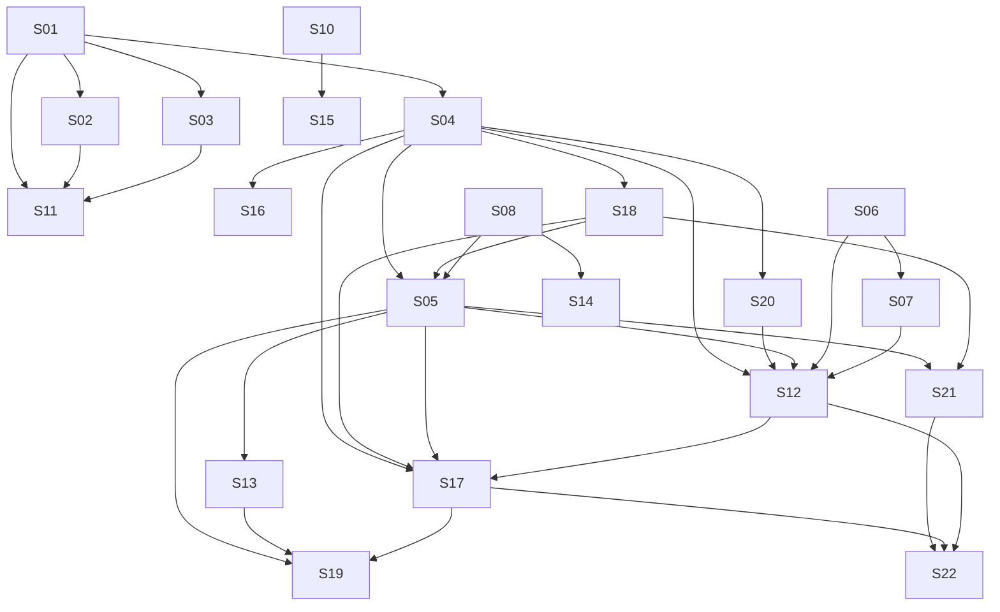

# M23 — Multi-Vertical Scheduling: Appointment Booking & Extensions

**Phase:** Local Development
**Goal:** Let customers and guests actually book against the resource model M21/M22 introduced — chosen-staff, fungible-pool, auto-any, bundled, and multi-leg resolution; variable-duration reservations; versioned intake/attendees — and give the appointment family its three standing-commitment extensions: recurring private reservations, availability alerts, and future-commitment exceptions, plus the no-show terminal state and tenant onboarding bootstrap.
**Depends on:** M21 (`Resource` aggregate), M22 (`Service.resourceRequirements`/`legs`, the resource-scoped availability engine, `resource_occupancy`)
**Blocks:** M24 (Classes & Sessions) — reuses this milestone's `booking_quote_revisions` and resource-resolution precedent for the session family's own resource pool. (M23's recurring schedules are fixed-term and materialized once, so there is no generation pattern to reuse — M24 owns its own `ClassSession` rolling worker.)
**Design rationale:** `docs/discovery/multivertical-booking/multivertical-booking.md` (promoted via `/discovery-to-milestone` on 2026-09-01) — kept as the permanent *why*; this file and the canonical docs it cites (`docs/04-USE_CASES.md` UC-061–077, `docs/02-DOMAIN_MODEL.md` § `RecurringBookingSchedule`/`AvailabilityAlert`/`FutureCommitmentException`, `docs/03-DOMAIN_EVENTS.md`, `docs/13-DATABASE_SCHEMA.md`, `docs/14-API_CONTRACTS.md`) are the source of truth for implementation — nothing below should require opening the discovery doc to understand.

## Non-Goals

- **Everything Cluster 4** (`ClassScheduleTemplate`/`ClassSession`/`ClassSessionBooking`/`RecurringEnrollment`/`ClassAccessContract`) — deferred to M24. UC-075's SESSION-preset branch (Presets D/E/F) stays inert until then; this milestone completes onboarding only for Presets A/B/C/G.
- **Cross-family resource exclusivity proof** (an APPOINTMENT service and a SESSION template sharing a resource) — `resource_occupancy`'s shared exclusion constraint already protects it structurally (M22), but it isn't testable end-to-end until M24 exists alongside this milestone.
- **Manual admin loyalty adjustments, payment processing** — unrelated to this cluster, no change here.

## Build order

| Wave | Story | Theme |
|---|---|---|
| 1 | M23-S01 | Resource resolution for booking creation — chosen/pool/auto-any/bundle/leg (UC-061–066) |
| 1 | M23-S06 | `AvailabilityAlert` aggregate — backend CRUD + BFF (UC-072 create, UC-076 manage) |
| 1 | M23-S08 | `FutureCommitmentException` aggregate — raise + resolve/dismiss, backend + BFF (UC-073, UC-077) |
| 1 | M23-S09 | Appointment no-show terminal status + correction (UC-074) |
| 1 | M23-S10 | Tenant onboarding bootstrap from preset — Presets A/B/C/G (UC-075) |
| 2 | M23-S02 | Variable-duration reservations + versioned intake/attendees (UC-067, UC-068) |
| 2 | M23-S03 | Reschedule extension — resource/bundle/leg-aware, quote revisions (UC-069) |
| 2 | M23-S04 | `RecurringBookingSchedule` aggregate — create/skip/reschedule/pause/end, backend + BFF (UC-070, minus approval/generation) |
| 2 | M23-S07 | Availability-alert matching worker (UC-072 step 3) |
| 2 | M23-S14 | Manager "Exceções de Agenda" worklist frontend (UC-073/077) |
| 2 | M23-S15 | Manager onboarding wizard frontend (UC-075) |
| 3 | M23-S11 | Guest/customer booking flow frontend — resource picker, bundle/leg, variable-duration, intake screens |
| 3 | M23-S16 | Surface `recurringHorizonDays` in the Service booking-policy dashboard panel |
| 3 | M23-S18 | Recurring-schedule fixed term (`endsOn` required and capped), hours-and-closures check and one conflict payload (UC-070) |
| 3 | M23-S20 | Remove recurring-schedule Pause (shipped pause endpoint, event and `PAUSED` status) — lands before S05 and S12 |
| 4 | M23-S05 | Recurring-schedule approval + one-shot occurrence materialization (UC-071) |
| 5 | M23-S12 | Customer "Minha Conta" extension — recurring reservations + availability alerts management |
| 5 | M23-S13 | Staff Agenda extension — recurring-schedule approval queue (UC-071 UI) |
| 5 | M23-S21 | Renewal reminder email for an ending recurring schedule (UC-070) |
| 6 | M23-S17 | Customer creates a recurring private reservation — pattern builder, review and outcome screens (UC-070) |
| 7 | M23-S22 | Customer renews an ending recurring schedule — "Renovar" pre-filled form (UC-070) |
| 7 | M23-S19 | Staff creates a recurring private reservation on a customer's behalf (UC-070) |

```mermaid
graph TD
  S01 --> S02
  S01 --> S03
  S01 --> S04
  S01 --> S11
  S02 --> S11
  S03 --> S11
  S04 --> S05
  S04 --> S12
  S04 --> S16
  S04 --> S17
  S04 --> S18
  S18 --> S05
  S04 --> S20
  S20 --> S12
  S05 --> S21
  S18 --> S21
  S21 --> S22
  S17 --> S22
  S12 --> S22
  S08 --> S05
  S18 --> S17
  S05 --> S12
  S05 --> S13
  S05 --> S17
  S12 --> S17
  S05 --> S19
  S13 --> S19
  S17 --> S19
  S06 --> S07
  S06 --> S12
  S07 --> S12
  S08 --> S14
  S10 --> S15
```

**Wave note (self-dry-run, corrected during `/docs-audit`):** S02 and S03 both call S01's `ResourceResolutionService` in their own description text (S02 for a variable-duration window, S03 for a reschedule's replacement window) — an audit found neither declared that as a `Dependencies:` edge, and both sat in Wave 1 alongside S01 itself. Fixed: both now depend on M23-S01 and sit in **Wave 2**. This cascades: S11 (guest/customer booking flow frontend) depends on S01, S02, **and** S03 — its floor is now `max(S01=1, S02=2, S03=2) + 1` = **Wave 3**, not Wave 2. S12 (Minha Conta extension) needs both S04 (recurring CRUD) and S05 (approval + generation) BFF endpoints, plus S06/S07 (alerts CRUD + matching) — its dependency floor is `max(S04, S05, S06, S07)`'s wave, i.e. Wave 3 (S05) + 1 = **Wave 4**. S13 (staff approval-queue UI) only needs S05, so it's `Wave 3 + 1 = Wave 4` too, not Wave 3 in parallel with S05 itself.

**Update (2026-09-29, M23-S17/S18/S19 added):** M23-S18 now comes **before** S05. S05's generation step is planned to skip hours-conflicted occurrences, but the resolver it reuses checks occupancy only, and occurrences beyond the creation-time horizon can only ever be evaluated at generation — so S05 needs S18's shared hours-and-closures check. S18 depends only on S04 (and TD45-S0), so it sits in **Wave 3**, S05 moves to **Wave 4**, and everything that floors on S05 shifts one wave: S12 and S13 to **Wave 5**, S17 (needs S12 and S18) to **Wave 6**, S19 (needs S17 and S13) to **Wave 7**. S17 also depends on S18 because S18 owns the single conflict payload it renders. S19 is the only one of the three that M23's goal does not need, and none of the three blocks M24.

**Update (2026-09-29, fixed-term recurrence — decided in M23-S18's `/story-discovery`):** a recurring schedule is no longer open-ended and there is no rolling generation. `endsOn` is required and may not be later than `startsOn` + the service's maximum term (`recurringHorizonDays`, 90 days by default); every occurrence of the term is checked at creation (working hours and closures, then occupancy) and materialized as a linked booking once — in the creation transaction for `AUTO_CONFIRM`, at approval for `MANUAL_APPROVAL`. A customer who wants to continue creates a new schedule, so a forgotten schedule cannot hold slots indefinitely. Consequences: M23-S05 loses `GenerateRecurringBookingOccurrencesJob` (approve/reject, the expiry job and one-shot materialization remain); M23-S18 owns the term validation, the hours-and-closures check and the one `409` occurrence payload; M23-S16 relabels the setting as the maximum term; M23-S17 adds an end-date field. Two consequences found by the follow-up `/docs-audit` (2026-09-29): a schedule whose term is over is moved to a new `ENDED` status by a second step of M23-S05's approval-expiry job (so the `status = 'ACTIVE'` cap, overlap and list queries never count an expired schedule), and Pause is removed (with every occurrence already a booking it has no effect and nothing can resume it) by **M23-S20** (Wave 3, before S05 and S12). The renewal path is **M23-S21** (the reminder email, Wave 5) and **M23-S22** (the "Renovar" pre-filled form, Wave 7, which needs a journey/prototype pass first). Wave placement of the existing stories is unchanged.

**Likely-independent stories (preview — not authoritative):** S06, S08, S09, and S10 share no files with each other or with S01 (four independent new/small aggregates, all Wave 1) — a candidate `/run-batch` group. S02 and S03 touch different methods of the same booking-creation/reschedule use cases (`RequestBookingUseCase`/`RequestAuthenticatedBookingUseCase` for S02, `RescheduleBookingUseCase` for S03) and share no files with each other, but **both now have a real `Dependencies:` edge to S01** — not independent of S01, only of each other. `/run-batch` re-derives this live; this is a courtesy preview.

---

### M23-S01 — Resource resolution for booking creation (chosen staff, fungible pool, auto-any, bundle, multi-leg) ✅ Done

**Agent:** `backend-ts` + `bff-ts`
**Complexity:** L
**Docs to load:** `docs/04-USE_CASES.md` UC-061–066, `docs/02-DOMAIN_MODEL.md` § `Service.resourceRequirements`/`legs` (M22), § availability engine (UC-058 algorithm), `docs/13-DATABASE_SCHEMA.md` § `resource_occupancy`, `booking_line_resource_assignments` (M22), `docs/14-API_CONTRACTS.md` § Booking Requests
**Dependencies:** M21-S01 (`Resource`), M22 (`Service.resourceRequirements`, availability engine — exact story ID not yet fixed at this milestone's drafting time; depend on the milestone as a whole)
**Pattern:** Extend existing helpers in-place — `docs/AGENT_PATTERNS.md` documents no "Strategy" pattern (verified during story-discovery, zero matches) and this codebase's established convention for this exact concern is a plain-function `*.helpers.ts` module with a deps bag (`resource-occupancy.helpers.ts`, `booking-request.helpers.ts`, `availability-window-resolution.helpers.ts`). A code-quality review during story-discovery (2026-09-25) confirmed `resource-occupancy.helpers.ts` is well-decomposed (single-responsibility pure functions, clean `ResolutionContext` deps object, no leaked state) and does not benefit from a class-based Strategy hierarchy for the ~4-branch `selectionMode` addition this story needs — that would fragment cohesive logic across files for no real gain. No resolution logic belongs in the `Service`/`Booking` aggregates: resolution requires `IResourceRepository`/`AvailabilityService` I/O, and this codebase's domain layer is zero-framework/I/O-free.

**Baseline already shipped by M22-S03 (✅ Done, PR #483) — do not re-build:** `resolveBookingLinesResourceCandidates()`/`resolveFlatLineCandidates()`/`resolveLeggedLineCandidates()`/`resolveRequirementResources()` in `resource-occupancy.helpers.ts` already resolve every flat/bundle/leg requirement into concrete resources (handling `requiredQuantity`, `resourcePoolIds`, per-leg turnover/transition gaps) and are already wired into `persistRequestedBooking()`, called by both `RequestBookingUseCase` and `RequestAuthenticatedBookingUseCase`. `AvailabilityService` already computes bundle intersection / pool union. `GetAvailabilityUseCase`, `schedule-availability.controller.ts`, and the BFF `schedule-availability.schemas.ts` already accept and honor `resourceId` end-to-end — **UC-066 is already fully implemented**, not new work for this story (its AC below is a non-regression confirmation, not a new build). Atomic bundle/leg locking (one `assertSlotFree()` call across all candidates in one transaction) already exists.

**Description — what this story actually adds:**
1. **`selectionMode` branching** (UC-061/062/063): `resolveCandidateIds()` currently ignores `selectionMode` entirely — it always picks the first N active resources regardless of mode. Add real branching: `CUSTOMER_CHOICE` uses a caller-supplied resource id (validated active/eligible/tenant-scoped via the existing `lookupResource()`); `AUTO_ANY` sorts eligible candidates by least already-locked workload on the tenant-local day (new `IResourceOccupancyRepository` method — none exists today — then `resourceId` as stable secondary sort, UC-063 A1); `AUTO_FUNGIBLE_POOL`/`NONE` keep today's deterministic-first-active behavior (still correct — no identity reveal, no tie-break rule specified for pool).
2. **Request body — structured customer choices, not a bare `resourceId`** (UC-061, UC-064, UC-065): `resourceSelections?: Array<{ serviceId: string; legIndex?: number; resourceType: ResourceType; resourceId: string }>` on both `RequestBookingSchema` and `RequestAuthenticatedBookingSchema` — one entry per customer choice; `serviceId` addresses the line (supports the existing up-to-20-service basket); `legIndex` set only for a legged service's per-leg choice; `resourceType` disambiguates within a bundle. Threaded down through `resolveBookingLinesResourceCandidates` → `resolveFlatLineCandidates`/`resolveLeggedLineCandidates` → `resolveRequirementResources` → `resolveCandidateIds`. Chosen over a bare singular `resourceId` — insufficient for bundle/leg `CUSTOMER_CHOICE` (UC-064/UC-065's own main flows require per-requirement/per-leg choices) — and matches M23-S03's own forward-reference to a `resourceSelections` body field for reschedule, keeping the shape consistent across the milestone.
3. **Response identity fields** (UC-062, UC-063, UC-065): no response path reveals resource identity today (`toBookingResult()`/BFF `bookings.mapper.ts` verified clean). Add optional `assignedResourceName` (flat services) and `itinerary: [{legIndex, resourceName, startsAt, endsAt}]` (legged services) to `BookingRequestResult`, threaded through the BFF mapper. Populated only for `AUTO_ANY` (name revealed, UC-063) and legs (full itinerary, UC-065); omitted for `AUTO_FUNGIBLE_POOL` (identity must stay hidden, UC-062) and `CUSTOMER_CHOICE` (customer already knows their own choice).
4. **Error granularity** (UC-064 A2, UC-065 A1): today every resolution failure throws one generic `BookingSlotUnavailableError`/`BookingServiceResourceTypeUnavailableError`. Add `BOOKING_BUNDLE_PARTIALLY_UNAVAILABLE` (a bundle — `resourceRequirements.length > 1` — has one or more but not all requirements unavailable) and `BOOKING_LEG_UNAVAILABLE` (any leg's requirement fails), with each call site in `resolveFlatLineCandidates`/`resolveLeggedLineCandidates` passing enough context to pick the right one; the existing generic error stays for the true single-resource, non-bundle/non-leg case. Bundle/leg resolution re-validates atomically at submit time via the existing single `assertSlotFree()` call across all candidates — never a partial lock.

**Backend HTTP surface:** existing `POST /bookings` (guest) and its authenticated-customer equivalent — request body gains optional `resourceSelections` (shape above) with no other shape change.

**BFF endpoint spec:** extend `apps/bff/src/features/booking/bookings.controller.ts` + `bookings-guest.controller.ts` + `bookings.schemas.ts` — pass through the new optional `resourceSelections` field; extend `bookings.mapper.ts` to surface `assignedResourceName` (UC-063) / `itinerary` (UC-065) when present.

**Files to create/modify (updated post-implementation to match what actually shipped):**
- `apps/backend/src/contexts/booking/application/use-cases/resource-occupancy.helpers.ts` (+ `.spec.ts`) (modify — trimmed to the per-line orchestrator + `deriveResourceSelectionsFromAssignments()`; the flat/legged candidate-building and per-requirement `selectionMode` algorithm were split out below, both for docs/CODE_STANDARDS.md's file-length limit)
- `apps/backend/src/contexts/booking/application/use-cases/resource-resolution-context.helpers.ts` (new — shared `ResolutionContext`/`selectionKey()`, kept in its own file specifically so the two files below don't import each other in a cycle)
- `apps/backend/src/contexts/booking/application/use-cases/resource-occupancy-candidate-builders.helpers.ts` (new — flat/legged candidate building, moved out of `resource-occupancy.helpers.ts`)
- `apps/backend/src/contexts/booking/application/use-cases/resource-requirement-resolution.helpers.ts` (new — the `selectionMode` branching algorithm itself, moved out of `resource-occupancy.helpers.ts`)
- `apps/backend/src/contexts/booking/application/dtos/request-booking.dto.ts`, `request-authenticated-booking.dto.ts` (modify — `resourceSelections` field, via a new shared `ResourceSelectionSchema` in `packages/validation/src/booking.ts`)
- `apps/backend/src/contexts/booking/application/use-cases/booking-request.helpers.ts` (+ `.spec.ts`) (modify — thread `resourceSelections`/`timezone` through `persistRequestedBooking`, return `candidatesByLine`, extend `toBookingResult()` with the new response fields, add `toResourceSelections()` DTO bridge)
- `apps/backend/src/contexts/booking/application/use-cases/request-booking.use-case.ts` (+ `.spec.ts`) (modify — pass `resourceSelections`/`timezone` through)
- `apps/backend/src/contexts/booking/application/use-cases/request-authenticated-booking.use-case.ts` (+ `.spec.ts`) (modify — pass `resourceSelections`/`timezone` through)
- `apps/backend/src/contexts/booking/application/use-cases/approve-booking.use-case.ts` (modify — not in the original list; the signature change to `resolveBookingLinesResourceCandidates()` requires it. Derives `resourceSelections` from the booking's already-persisted `booking_line_resource_assignments` via `deriveResourceSelectionsFromAssignments()`, so a `CUSTOMER_CHOICE` pick survives re-resolution at approval time — locked in during implementation, see the story's own design-decision record above)
- `apps/backend/src/contexts/booking/application/use-cases/reschedule-booking.use-case.ts` (modify — same reason and same fix as `approve-booking.use-case.ts` above; not in the original list)
- `apps/backend/src/contexts/booking/application/services/booking-slot-conflict.service.ts` (+ `.spec.ts`) (modify — widened `assertSlotFree()`'s param type to `ResourceOccupancyCandidate[]`, classifies bundle/leg/single conflicts)
- `apps/backend/src/contexts/booking/application/ports/resource-occupancy-repository.port.ts` (modify — `countActiveByResource()` for the `AUTO_ANY` tie-break, `findAssignmentsByBookingLines()` for the approval/reschedule replay above)
- `apps/backend/src/contexts/booking/infrastructure/repositories/typeorm-resource-occupancy.repository.ts` (+ `.spec.ts`, `.integration.spec.ts`) (modify — implements both new port methods)
- `apps/backend/src/contexts/booking/infrastructure/repositories/typeorm-resource-occupancy.write-queries.ts` (new — not in the original list; the write-path upsert/insert logic split out of the repository class, also for the file-length limit; named to match the folder's own `.mapper.ts`/`.persistence-errors.ts` split-file convention rather than a generic `.helpers.ts` suffix)
- `apps/backend/eslint.config.js` (modify — added the new write-queries file to the existing TypeORM-import allowlist, same treatment as its sibling repository file)
- `apps/backend/src/test/repositories/booking/in-memory-resource-occupancy.repository.ts` (modify — the two new port methods, for unit tests)
- `apps/backend/src/contexts/booking/domain/errors/booking-service.error.ts` (modify — `BookingResourceSelectionRequiredError`)
- `apps/backend/src/contexts/booking/domain/errors/booking-lifecycle.error.ts` (modify — `BookingBundlePartiallyUnavailableError`, `BookingLegUnavailableError`)
- `apps/backend/src/contexts/booking/infrastructure/http/booking-error.mapper.ts` (modify — map the three new errors)
- `apps/backend/src/contexts/booking/infrastructure/controllers/booking.controller.integration.spec.ts` (modify — not in the original list; end-to-end `POST /bookings` coverage for `CUSTOMER_CHOICE`/`AUTO_ANY`/`AUTO_FUNGIBLE_POOL`/legged resolution against a real Postgres)
- `packages/types/src/error-codes.ts` (modify — `BOOKING_RESOURCE_SELECTION_REQUIRED`, `BOOKING_BUNDLE_PARTIALLY_UNAVAILABLE`, `BOOKING_LEG_UNAVAILABLE`)
- `packages/validation/src/booking.ts` (modify — new shared `ResourceSelectionSchema`, not in the original list; reused by both the backend DTOs and the BFF schema below)
- `packages/i18n/locales/{pt-BR,en}/errors.json` (modify — all three new codes)
- `apps/bff/src/features/booking/bookings.schemas.ts` (modify — `resourceSelections` on both request schemas, importing the shared `ResourceSelectionSchema`)
- `apps/bff/src/features/booking/bookings.types.ts` (modify — not in the original list; `assignedResourceName`/`itinerary` on `BookingLineResponse`, new `BookingLineItineraryLegResponse`). `bookings.controller.ts`/`bookings-guest.controller.ts`/`bookings.mapper.ts` needed **no code change** — booking creation is a pure `body`/response passthrough, already covered by the schema/type changes.
- `apps/backend/http/booking/bookings.http` (modify — new `resourceSelections` example)
- `docs/27-BUSINESS_LOGIC_REFERENCE.md` § Booking — Resource-Scoped Scheduling & Availability (modify — new "selectionMode resolution algorithm (M23-S01)" subsection, plus fixed two claims the M22 baseline text had made that M23-S01 supersedes)
- `docs/04-USE_CASES.md` UC-066 (modify — fix stale `Endpoint:` line; already applied during story-discovery)

**Already correctly implemented by M22-S03 — no changes needed:** ~~`resource-resolution.service.ts`~~ (never built this — see Pattern above), `get-availability.use-case.ts`, `availability.service.ts`, `typeorm-booking-availability.adapter.ts`, `schedule-availability.controller.ts`.

**Acceptance criteria — product:**
- [x] Customer/guest booking a `CUSTOMER_CHOICE` service picks a staff member and sees only that resource's slots.
- [x] Booking an `AUTO_FUNGIBLE_POOL` service (e.g. a court) shows union availability and never reveals which specific unit was assigned.
- [x] Booking an `AUTO_ANY` service shows the assigned staff member's name on confirmation.
- [x] Booking a bundled or multi-leg service either fully succeeds or fully fails — never a partial lock.
- [x] A service with no `resourceRequirements` behaves exactly as before this story (explicit non-regression AC).
- [x] UC-066 (browse a specific staff member's calendar via `GET /v1/schedule/availability?...&resourceId=`) still works — non-regression confirmation only, already shipped by M22-S03.

**Acceptance criteria — technical:**
- Unit:
  - [x] `resolveCandidateIds()` correctly branches per `selectionMode` (`CUSTOMER_CHOICE` uses the caller-supplied id, `AUTO_ANY`/`AUTO_FUNGIBLE_POOL`/`NONE` behave per the Description above), given a fixture resource set
  - [x] Bundle resolution rejects with `BOOKING_BUNDLE_PARTIALLY_UNAVAILABLE` (`409`) when any one required resource is unavailable
  - [x] Leg-chain resolution rejects with `BOOKING_LEG_UNAVAILABLE` (`409`) when any leg's requirement is unavailable, and computes correct per-leg sub-windows including transition gaps
  - [x] `AUTO_ANY` tie-break picks the least-loaded resource, `resourceId` as stable secondary sort
  - [x] A `resourceSelections` entry for another tenant's resource is rejected
- Integration:
  - [x] `POST /bookings` for a `CUSTOMER_CHOICE` service (via `resourceSelections`) persists a resolved `resource_occupancy` row
  - [x] Booking response for `AUTO_ANY` includes `assignedResourceName`; for `AUTO_FUNGIBLE_POOL` never includes any resource identity; for a legged service includes the full `itinerary`
  - [x] A bundle/leg race (two concurrent submits contending for the same resource) — the DB's shared GIST exclusion constraint rejects the loser, `409` (verified generically — a true simultaneous-commit race always throws the generic `BookingSlotUnavailableError` via `rethrowOccupancyInsertError`, regardless of candidate count; the new bundle/leg-specific codes apply to the far more common pre-check-detects-an-existing-conflict path, which is separately unit-tested)
- Tenant isolation:
  - [x] A `resourceSelections` entry naming another tenant's resource is rejected, never silently scoped in
- E2E: none — covered by S11's frontend E2E
- [x] Coverage ≥80% on changed code (backend unit: 3230/3230 passing; booking-context integration: 271/271 passing; BFF unit: 647/647, component: 434/434 — all passing, no regressions)
- [x] `tsc --noEmit` clean, lint clean

---

### M23-S02 — Variable-duration reservations + versioned booking intake/attendees ✅ Done

**Agent:** `backend-ts` + `bff-ts`
**Complexity:** M
**Docs to load:** `docs/04-USE_CASES.md` UC-067, UC-068, `docs/02-DOMAIN_MODEL.md` § `Service.durationPolicy`/`pricingPolicy` (M22), § `service_booking_intake_schema` (M22), `docs/13-DATABASE_SCHEMA.md` § `booking_attendees` (M22)
**Dependencies:** M21-S01, M22 (`durationPolicy`, intake schema — same milestone-level dependency note as S01), M23-S01 (calls its resource-resolution helpers — `resource-requirement-resolution.helpers.ts`'s `resolveRequirementResources()`, orchestrated via `resource-occupancy.helpers.ts` — to resolve the variable-duration window's resource(s), doesn't duplicate resolution logic)
**Pattern:** plain composition — additive request fields on the existing booking-creation use cases; no new pattern.

**Description:**
Two independently-triggerable, additive extensions of `POST /bookings`, bundled in one story because both are conditional branches inside the same request-validation step (not the resource-resolution logic S01 owns):
1. **UC-067 variable duration:** when the service has `durationPolicy = CUSTOMER_SELECTED`, request body carries `startsAt`/`durationMinutes`/`participantCount`; validate against the service's min/max/increment/participant-limit rules, quote the per-increment price (round-up rule per `docs/13-DATABASE_SCHEMA.md`), resolve the required resource(s) for that exact interval (calls S01's resolver with the computed window, doesn't duplicate resolution logic).
2. **UC-068 intake/attendees:** when the service declares an active `service_booking_intake_schema`, request body carries `intakeSchemaVersion`/`intakeAnswers`/optional named attendees; validate required answers against the **displayed** schema version (never silently re-validate against a version that changed mid-flow, UC-068 A1), snapshot version+answers+consent on the booking.

**Design decisions locked in during discovery (2026-09-25):**
- **Basket scope (UC-067 A4 / UC-068 A4):** `serviceIds` is a multi-line basket where duplicates are allowed (`docs/14-API_CONTRACTS.md`), and M23-S01 already established a per-line addressing convention (`resourceSelections`, keyed by `serviceId`+`legIndex`) for exactly this ambiguity. Rather than extend that same per-line pattern to `durationMinutes`/`participantCount`/intake fields, the request body keeps them as flat, request-root fields as UC-067/068 literally describe — but a request may contain **at most one** service that is `durationPolicy = CUSTOMER_SELECTED` and/or intake-bearing; more than one → `422 invalid-multiple-variable-services` (new error code, added to the list below). Matches the discovery doc's "multi-service bookings are business-configured bundles/journeys, not arbitrary carts" framing; avoids inventing a second per-line addressing scheme for a case that's realistically single-service in practice.
- **Missing `durationMinutes` fallback:** no fallback to `Service.durationMinutes` — that field is not authoritative once `durationPolicy = CUSTOMER_SELECTED` (`docs/02-DOMAIN_MODEL.md`, updated). Omitting it on such a service is `422 BOOKING_DURATION_OUT_OF_RANGE`.
- **`participantCount` vs. `ResourceRequirement.requiredQuantity`:** independent. `participantCount` is a customer-supplied capacity/attendee-count input only; it never dynamically overrides `requiredQuantity`, which stays the service's static configured value (UC-067 A3, updated).
- **Intake submitted with no active schema:** silently ignored (not persisted, not an error) — added as UC-068 A5.
- **No new migration or entity files needed** — verified against the actual codebase at story-discovery: `booking.entity.ts` already has `intakeSchemaVersion`/`intakeAnswers`/`participantCount`/`consentAcceptedAt`/`consentVersion` (added by M22-S02's `1748500000011-AddServiceBookingPolicyAndIntakeSchema.ts`), `booking-attendee.entity.ts`/`booking_attendees` already exist with a test builder (also M22-S02, explicitly built "schema-only... reachable once a booking actually submits attendees in M23"), and `booking_lines.duration_mins_at_booking` already exists as a generic per-line duration snapshot — reused directly for the customer-selected duration (`docs/13-DATABASE_SCHEMA.md`, updated), no new `durationMinutes` column anywhere. What actually needs wiring, and was missing from this story's original file list: `booking.aggregate.ts` (zero references to any of these fields today, verified by grep) and `typeorm-booking.repository.ts` (needs `BookingAttendeeEntity` persisted the same way it already persists `BookingLineEntity` — same file, same transaction, no new port).
- **`GET /services/:id/intake-schema` route collision:** that exact path already exists, built by M22-S04 for the staff edit page (`StaffOrManagerRoleGuard`-gated, returns `{active, history[]}`). A second handler can't share the same path. New path: `GET /services/:id/intake-schema/public` (no guard), reusing `GetServiceIntakeSchemaUseCase` but returning only `{ active }` — never `history`, which a customer has no reason to see. Precedent for guest/authenticated path splits already exists in this same controller family (`POST /bookings` vs. `POST /bookings/authenticated`).

**Backend use case steps:**
1. Extend `RequestBookingUseCase`/`RequestAuthenticatedBookingUseCase` validation step: reject if more than one service in the basket is `CUSTOMER_SELECTED`/intake-bearing (`422 invalid-multiple-variable-services`). If `durationPolicy = CUSTOMER_SELECTED`, require and validate interval/participants, compute quote; else use the service's fixed `durationMinutes` (unchanged).
2. Same use cases: if an active intake schema exists, validate `intakeSchemaVersion` matches the currently-active one *or* an explicitly-passed prior version the client displayed (never reject solely for "not the latest"), validate required answers/consent (`422` naming missing fields, UC-068 A3), persist snapshot + attendees (via `booking.aggregate.ts` + `typeorm-booking.repository.ts`, see decisions above). Intake fields submitted for a service with no active schema are ignored, not validated.
3. New read endpoint `GET /services/:id/intake-schema/public` (UC-068 step 1) — reuses `GetServiceIntakeSchemaUseCase`, returns `{ active }` only.

**Backend HTTP surface:** `POST /bookings` (guest+authenticated) body gains optional `durationMinutes`/`participantCount`, `intakeSchemaVersion`/`intakeAnswers`/`consentAccepted`/`attendees`. New `GET /services/:id/intake-schema/public`.

**BFF endpoint spec:** extend `bookings.schemas.ts` for the new optional fields; new route on the existing `apps/bff/src/features/booking/services.public.controller.ts` (already exists — currently only has the services-list route) for `GET /services/:id/intake-schema/public`.

**Files to create/modify:**
- `apps/backend/src/contexts/booking/application/use-cases/request-booking.use-case.ts` / `request-authenticated-booking.use-case.ts` (+ specs) (modify)
- `apps/backend/src/contexts/booking/application/services/booking-quote.service.ts` (+ `.spec.ts`) (new — per-increment price + minimum-charge rounding, isolated from the resolver so S01 doesn't need to know about pricing)
- `apps/backend/src/contexts/booking/domain/booking.aggregate.ts` (+ `.spec.ts`) (modify — carry `intakeSchemaVersion`/`intakeAnswers`/`participantCount`/`consentAcceptedAt`/`consentVersion`/`attendees: BookingAttendee[]` through `requestBooking()`; not in the original list, found at story-discovery — see decisions above)
- `apps/backend/src/contexts/booking/infrastructure/repositories/typeorm-booking.repository.ts` (+ `.spec.ts`) (modify — persist `BookingAttendeeEntity` rows the same way `BookingLineEntity` rows are already persisted, same transaction; not in the original list)
- `apps/backend/src/contexts/booking/application/use-cases/get-service-intake-schema.use-case.ts` — **no change needed**, already exists (M22-S04); reused as-is by the new public route below
- `apps/backend/src/contexts/booking/infrastructure/controllers/service.controller.ts` (+ `.spec.ts`, `.integration.spec.ts`) (modify — new `@Get(':id/intake-schema/public')` route, no guard, returns `{ active }` only)
- `packages/types/src/error-codes.ts` (modify — `BOOKING_INTAKE_ANSWER_MISSING`, `BOOKING_DURATION_OUT_OF_RANGE`, `BOOKING_INVALID_MULTIPLE_VARIABLE_SERVICES`)
- `packages/i18n/locales/{pt-BR,en}/errors.json` (modify — all three new codes)
- `apps/bff/src/features/booking/bookings.schemas.ts` (modify — new optional fields), `services.public.controller.ts` (+ specs) (modify — already exists, add the new route)
- `apps/backend/http/booking/services.http` (modify — new `/intake-schema/public` request)

~~`apps/backend/src/contexts/booking/infrastructure/entities/booking.entity.ts`~~ / ~~`booking-attendee.entity.ts`~~ — struck from the original file list; both already fully exist (M22-S02), no changes needed (see decisions above).

**Acceptance criteria — product:**
- [x] Customer booking a variable-duration service picks start+duration within the configured rules and sees the correct quoted price.
- [x] Customer booking a service with an active intake schema completes the required questions/consent before submitting.
- [x] A service form change mid-flow never silently rewrites an already-completed answer (UC-068 A1).
- [x] A request combining more than one `CUSTOMER_SELECTED`/intake-bearing service in the same basket is rejected, not silently applied to just one of them (UC-067 A4/UC-068 A4).

**Acceptance criteria — technical:**
- Unit:
  - [x] Quote service rounds up to the correct increment, applies minimum charge when set
  - [x] Intake validation rejects a missing required answer/consent with the exact field named
  - [x] Duration validation rejects an interval outside min/max/increment, and rejects a `CUSTOMER_SELECTED` service booked with no `durationMinutes` at all (no fallback to `Service.durationMinutes`)
  - [x] `participantCount` never changes how many resources `resolveRequirementResources()` locks — only `ResourceRequirement.requiredQuantity` does (verified by code review — `participantCount` is never passed into the resource-resolution path; M23-S01's own tests already cover `requiredQuantity` governing resolution)
  - [x] `intakeAnswers`/`attendees` submitted for a service with no active intake schema are ignored — no validation error, nothing persisted
  - [x] A basket with two `CUSTOMER_SELECTED`/intake-bearing services (or the same one twice) is rejected with `BOOKING_INVALID_MULTIPLE_VARIABLE_SERVICES`
- Integration:
  - [x] `POST /bookings` with a variable-duration interval persists the correct quote and locks the resource for the exact computed window
  - [x] `POST /bookings` snapshots intake answers immutably even after the service's schema is later updated
  - [x] `GET /services/:id/intake-schema/public` returns only `{ active }` (no `history`) and requires no auth; `404` for a missing/cross-tenant service id; `{ active: null }` (not `404`) for an inactive service with no published schema, or its last-published schema if one exists — no active-only existence check exists at the repository level, matching UC-068's actual precondition
- Tenant isolation: n/a beyond S01's existing resource-tenant checks
- E2E: none — covered by S11
- [x] Coverage ≥80% on changed code (backend unit: 3280/3280 passing; booking-context integration: 279/279 passing; full backend integration: 662/662 passing; BFF unit: 653/653, component: 437/437 — all passing, no regressions; `architecture-check`: 0 violations)
- [x] `tsc --noEmit` clean, lint clean

---

### M23-S03 — Reschedule extension: resource/bundle/leg-aware, quote revisions ✅ Done

**Agent:** `backend-ts` + `bff-ts`
**Complexity:** M/L (raised from M during story-discovery, 2026-09-26 — see decisions below)
**Docs to load:** `docs/04-USE_CASES.md` UC-069, `docs/14-API_CONTRACTS.md` § Reschedule (extended), § Cancel (UC-007/UC-008, for the role-dispatch precedent), `docs/13-DATABASE_SCHEMA.md` § `booking_quote_revisions`, `docs/03-DOMAIN_EVENTS.md` § BookingRescheduled/BookingCancelled, `docs/27-BUSINESS_LOGIC_REFERENCE.md` § selectionMode resolution algorithm
**Dependencies:** M21-S01, M22, M23-S01 (reuses its resource-resolution helpers — `resource-requirement-resolution.helpers.ts`'s `resolveRequirementResources()`, orchestrated via `resource-occupancy.helpers.ts` — to resolve the replacement resource(s)/window, doesn't duplicate resolution logic)
**Pattern:** customer/admin actor split, mirroring `PATCH /bookings/:id/cancel`'s existing `cancel-customer`/`cancel-admin` BFF-role-dispatch precedent — **not** "plain composition" as originally scoped. Story-discovery (2026-09-26) found the existing `RescheduleBookingUseCase` is staff-only today (hardcoded `staffId`, `StaffOrManagerRoleGuard`), with no customer path at all; UC-069's actor is "Customer, or audited staff acting for the customer," the same actor shape Cancel already solved. Reuse that shape rather than inventing a new one.

**Design decisions locked in during discovery (2026-09-26):**
- **Actor split:** new `RescheduleBookingAsCustomerUseCase` (+ dto + route `reschedule-customer`) for the customer path; the existing `RescheduleBookingUseCase` becomes the staff/admin path, exposed at `reschedule-admin` (renamed route, same class). BFF's single public `PATCH /bookings/:id/reschedule` dispatches by JWT role, exactly like `cancel`/`cancel-customer`/`cancel-admin`.
- **Release-then-assign ordering confirmed already correct — no reorder needed.** Initial discovery flagged `resource-occupancy-assignment.helpers.ts`'s `moveBookingLinesOccupancy()` (release-then-assign) as violating UC-069 A1. Re-examined while implementing: `release()` and `assign()` both run inside the *same* `txManager.run()` transaction as `booking.reschedule()`/`save()` — if `assign()` fails (a concurrent booking wins the replacement resource), the **entire transaction rolls back**, so the `release()` DELETE never actually commits and the original `resource_occupancy` row(s) are restored exactly as before. Postgres's exclusion constraint also blocks (rather than silently races) a concurrent overlapping insert until the first inserter's transaction resolves. Net: UC-069 A1 already holds today, no code change to this helper. Reordering to insert-then-delete would additionally have *broken* a same-resource duration-extension reschedule (new window overlapping the still-present old row on the same resource would hit the exclusion constraint against itself) unless the constraint were also made `DEFERRABLE` — disproportionate machinery for a bug that doesn't exist. Left as-is; only a new integration test proving the rollback behavior is added (see AC below).
- **Reschedule-window eligibility, implemented now:** add `Booking.isEligibleForReschedule(rescheduleWindowHours: number)` (mirrors the existing `isEligibleForCancellation()`), a new `RescheduleWindowExpiredError` (`BOOKING_RESCHEDULE_WINDOW_EXPIRED` in `packages/types/src/error-codes.ts`, mapped to `422` alongside `CancellationWindowExpiredError` in `booking-error.mapper.ts`), and both locale files. The effective window resolves `service.rescheduleWindowHoursOverride ?? tenant cancellationWindowHours default` from the `serviceMap` `RescheduleBookingUseCase` already loads — not the flat tenant-only value the existing Cancel flow uses (a known, separate, out-of-scope gap in Cancel — not fixed here). **Customer path only** — the admin path never runs this check (A3, mirrors the existing cancellation-window staff override).
- **Full UC-069 scope, not time-only:** `durationMinutes` (customer body) re-quotes via M23-S02's `BookingQuoteService`, updating line durations/`totalDurationMins`/price before the `booking_quote_revisions` row is written. `resourceSelections` (customer body), when present, overrides the default `deriveResourceSelectionsFromAssignments()` replay for the matching `CUSTOMER_CHOICE` requirement — same `(serviceId, legIndex, resourceType)`-keyed precedence `POST /bookings` already uses (`docs/27-BUSINESS_LOGIC_REFERENCE.md`); an entry with no match is unused, never an error (same safety property that section documents). `AUTO_ANY`/`AUTO_FUNGIBLE_POOL` requirements always ignore any submitted entry and re-derive fresh, unchanged from today.
- **`BookingRescheduledData` gains `isBusiness: boolean`**, mirroring `BookingCancelledData`'s existing `cancelledBy`/`isBusiness` shape (`docs/03-DOMAIN_EVENTS.md`, already updated) — `rescheduledBy` now holds either actor's id, no longer always a staff id.
- **`docs/27-BUSINESS_LOGIC_REFERENCE.md`'s § selectionMode resolution algorithm** already documents the approve/reschedule replay mechanic (written ahead of this story, during M23-S01) — update its reschedule-related bullets once implemented to reflect the resourceSelections-override addition; don't leave it describing only the pre-S03 behavior.

**Backend use case steps (customer path, `RescheduleBookingAsCustomerUseCase`):**
1. Load booking + ownership check (`booking.customerId !== customerId` → `BookingForbiddenError`, mirrors `CancelBookingAsCustomerUseCase`).
2. Check `booking.isEligibleForReschedule(effectiveRescheduleWindowHours)` → `422 RescheduleWindowExpiredError` if not.
3. If `durationMinutes` present: re-quote via `BookingQuoteService`, update line durations/price.
4. Resolve the replacement resource(s)/window via S01's resolution helpers, merging any body `resourceSelections` over the default replay (see decisions above).
5. Inside `txManager.run()`: `assertSlotFree()` + `moveBookingLinesOccupancy()` (release-then-assign, unchanged — already safe, see decisions above).
6. If price changed: insert a `booking_quote_revisions` row (`revision_no` = next for this `booking_id`), include it in the response.
7. `booking.reschedule(customerId, newScheduledAt, correlationId, undefined, isBusiness: false)`; publish `BookingRescheduled`.

**Backend use case steps (admin path, existing `RescheduleBookingUseCase`, renamed route only):** same resource-resolution/occupancy-move/quote-revision steps as above, minus the eligibility check (A3), actor is `staffId`, `isBusiness: true`, `adminNotes` optional.

A bundle/leg reschedule re-validates the whole chain atomically on both paths (UC-069 A2) — this already works today via the existing `assertSlotFree()`/`resolveBookingLinesResourceCandidates()` wiring, no new logic needed.

**Backend HTTP surface:** existing `PATCH /bookings/:id/reschedule` route splits into `PATCH /bookings/:id/reschedule-customer` (new) and `PATCH /bookings/:id/reschedule-admin` (renamed from `:id/reschedule`) on `booking-completion.controller.ts`, mirroring `:id/cancel-customer`/`:id/cancel-admin` on the same controller.

**BFF endpoint spec:** `apps/bff/src/features/booking/bookings.controller.ts`'s single `PATCH /bookings/:id/reschedule` route dispatches to `reschedule-customer`/`reschedule-admin` by JWT role (mirrors its existing cancel dispatch); `bookings.schemas.ts` gains the customer body schema (`resourceSelections`/`durationMinutes`/`scheduledAt`) alongside the existing admin one, plus the `quoteRevision` response field.

**Files to create/modify:**
- `apps/backend/src/contexts/booking/application/use-cases/reschedule-booking-as-customer.use-case.ts` (+ `.spec.ts`) (new)
- `apps/backend/src/contexts/booking/application/dtos/reschedule-booking-as-customer.dto.ts` (new)
- `apps/backend/src/contexts/booking/application/use-cases/reschedule-booking.use-case.ts` (+ `.spec.ts`) (modify — admin path: resourceSelections/durationMinutes support, `isBusiness: true`)
- `apps/backend/src/contexts/booking/application/dtos/reschedule-booking.dto.ts` (modify — gains optional `resourceSelections`/`durationMinutes`)
- `apps/backend/src/contexts/booking/domain/booking.aggregate.ts` (+ `.spec.ts`) (modify — `isEligibleForReschedule()`, duration/price update on reschedule, `isBusiness` param)
- `apps/backend/src/contexts/booking/domain/events/booking-rescheduled.event.ts` (modify — `isBusiness: boolean`)
- `apps/backend/src/contexts/booking/domain/errors/booking-lifecycle.error.ts` (+ `.spec.ts`) (modify — new `RescheduleWindowExpiredError`)
- `apps/backend/src/contexts/booking/infrastructure/http/booking-error.mapper.ts` (modify — map `RescheduleWindowExpiredError` to `422`)
- `apps/backend/src/contexts/booking/infrastructure/controllers/booking-completion.controller.ts` (+ specs) (modify — `:id/reschedule-customer` new route, `:id/reschedule` renamed to `:id/reschedule-admin`)
- `apps/backend/src/contexts/booking/infrastructure/entities/booking-quote-revision.entity.ts` (new)
- `apps/backend/src/contexts/booking/infrastructure/repositories/typeorm-booking-quote-revision.repository.ts` (+ `.spec.ts`) (new)
- `apps/backend/src/contexts/booking/application/ports/booking-quote-revision-repository.port.ts` (new)
- `apps/backend/src/contexts/booking/infrastructure/migrations/<timestamp>-CreateBookingQuoteRevisions.ts` (new — per `docs/13-DATABASE_SCHEMA.md`'s source-exclusive CHECK; `class_session_booking_id` FK stays unreachable until M24)
- `apps/backend/src/test/infrastructure/integration-global-setup.ts` (modify — register `BookingQuoteRevisionEntity`)
- `apps/backend/src/test/builders/booking/` — new `booking-quote-revision.builder.ts` (+ entity builder), following existing per-aggregate builder conventions
- `packages/types/src/error-codes.ts` (modify — `RESCHEDULE_WINDOW_EXPIRED: 'BOOKING_RESCHEDULE_WINDOW_EXPIRED'`)
- `packages/i18n/locales/{pt-BR,en}/errors.json` (modify — new error code entry, both locales, same commit)
- `apps/bff/src/features/booking/bookings.controller.ts` (+ specs), `bookings.schemas.ts` (modify — role dispatch, new customer schema, `quoteRevision` response field)
- `apps/backend/http/booking/bookings.http` (modify — customer + admin reschedule examples, including the new `422 reschedule-window-expired` case)
- `docs/27-BUSINESS_LOGIC_REFERENCE.md` § selectionMode resolution algorithm (modify — reflect the resourceSelections-override addition, per decisions above)

**Acceptance criteria — product:**
- [ ] ~~Customer rescheduling a resource-scoped/bundle/leg/variable-duration booking sees the recomputed quote before confirming.~~ **Deferred to S11** (Codex round-1 review, PR #519: this story returns the authoritative quote only as part of the committing `PATCH` response — there is no way today for a frontend to preview a price/duration change before the customer confirms it, since no dry-run capability exists. This story is backend/BFF-only; whether a real pre-commit preview needs a new non-mutating endpoint, or a client-side estimate is sufficient, is a UX decision that belongs to S11 once the actual customer reschedule UI is designed — not invented speculatively here.)
- [x] A failed reschedule (replacement unavailable) leaves the original booking fully intact — customer never loses their slot.
- [x] A customer reschedule request outside the effective reschedule window is rejected with a clear error; the original booking is untouched.
- [x] Staff override reschedule records actor+reason without bypassing any capacity/exclusivity check, and is never subject to the reschedule-window check.

**Acceptance criteria — technical:**
- Unit:
  - [x] Reschedule rejects with `409` when replacement is unavailable, original booking state unchanged
  - [x] Customer reschedule rejects with `422 reschedule-window-expired` when outside `service.rescheduleWindowHoursOverride ?? tenant default`; admin reschedule never runs this check
  - [x] `booking_quote_revisions.revision_no` increments correctly per booking
  - [x] A body-supplied `resourceSelections` entry overrides the replayed pick for its matching `CUSTOMER_CHOICE` requirement; an unmatched entry is ignored, not an error (verified at the `mergeResourceSelections()` unit level, the exact function both use cases call)
  - [x] `durationMinutes` on a variable-duration reschedule re-quotes via `BookingQuoteService` and updates line durations/`totalDurationMins`
  - [x] `BookingForbiddenError` when a customer reschedules a booking they don't own
- Integration:
  - [x] Reschedule of a bundle/leg booking is atomic — a mid-chain conflict rolls back the whole attempt (`resolveRescheduleCandidates()` delegates unchanged to S01's own `resolveBookingLinesResourceCandidates()`/`assertSlotFree()`, already covered by that module's own bundle/leg tests; the sequential 409-conflict integration test added for this story exercises the same reschedule code path end-to-end)
  - [x] A losing *concurrent* reschedule (two real HTTP requests fired concurrently at the same target slot via `Promise.all`, not a sequential pre-existing-conflict case) rolls back cleanly — exactly one of the two succeeds, and the loser's booking keeps its original `scheduledAt` (CodeRabbit round-1 review, PR #519: this repo's own `.coderabbit.yaml` path-instructions mandate a concurrency integration test for any PR touching slot-approval/occupancy logic — mirrors the existing `ApproveBookingUseCase` "serializes concurrent approvals" integration test exactly, no raw-connection transaction orchestration needed). The initial discovery-time assessment that this would need fragile two-raw-connection orchestration was wrong — a plain concurrent-HTTP-request test was sufficient, same as the pre-existing approval test already proved.
  - [x] Stale-aggregate-save concurrency (two saves loading the same booking version, one must fail `BookingConcurrentModificationError`) is not re-tested per-use-case here — already covered generically, independent of which use case calls `save()`, by `booking.repository.integration.spec.ts`'s existing "throws BookingConcurrentModificationError when saving a stale loaded aggregate" test; reschedule uses the identical `bookingRepo.save()` path (CodeRabbit round-1 review, declined as already-covered rather than fixed).
- Tenant isolation: n/a beyond existing booking tenant scoping
- E2E: none — covered by S11/S12
- [x] Coverage ≥80% on changed code
- [x] `tsc --noEmit` clean, lint clean

---

### M23-S06 — `AvailabilityAlert` aggregate — backend CRUD + BFF

**Agent:** `backend-ts` + `bff-ts`
**Complexity:** M
**Docs to load:** `docs/04-USE_CASES.md` UC-072, UC-076, `docs/02-DOMAIN_MODEL.md` § `AvailabilityAlert`, `docs/13-DATABASE_SCHEMA.md` § `availability_alerts`/`availability_alert_notification_attempts`, `docs/14-API_CONTRACTS.md` § Availability Alerts, `docs/03-DOMAIN_EVENTS.md` § `AvailabilityAlert*`
**Dependencies:** M21-S01, M22
**Pattern:** Repository + Adapter (`IAvailabilityAlertRepository` port, `TypeOrmAvailabilityAlertRepository` adapter) — matches every other Booking-context aggregate; no new pattern.

**Description:**
Create the `AvailabilityAlert` aggregate exactly per `docs/02-DOMAIN_MODEL.md`'s field list. Authenticated-customer-only (UC-072 A1 redirects an unauthenticated visitor to login, preserving chosen criteria through the redirect — a **frontend** concern, handled in S12). This story covers create/list/edit/cancel and the expiry worker; the *matching* worker (step 3, "when a slot releases, notify") is S07, a separate async trigger.

**Backend use case steps:**
1. **`CreateAvailabilityAlertUseCase`** (UC-072): validates exactly one criteria representation set (`ONE_TIME_RANGE` xor `WEEKLY_PREFERENCE`), persists, publishes `AvailabilityAlertCreated`.
2. **`ListAvailabilityAlertsUseCase`** (UC-076): `findByCustomer(tenantId, customerId)`.
3. **`UpdateAvailabilityAlertUseCase`** (UC-076): re-validates criteria shape, rejects edit on an already-`NOTIFIED`/`EXPIRED` alert (UC-076 A1).
4. **`CancelAvailabilityAlertUseCase`** (UC-072 A2 / UC-076): sets `status = CANCELLED`, publishes `AvailabilityAlertCancelled`.
5. **`ExpireAvailabilityAlertsJob`** (scheduled, same shape as the existing loyalty-expiry cron): finds `ACTIVE` alerts past `expiresAt`, transitions to `EXPIRED`, publishes `AvailabilityAlertExpired` per alert.

**Backend HTTP surface:** new controller — `POST /availability-alerts`, `GET /availability-alerts`, `PATCH /availability-alerts/:id`, `DELETE /availability-alerts/:id`. JWT + Customer only (`403` for STAFF/MANAGER/guest).

**BFF endpoint spec:** new `apps/bff/src/features/booking/availability-alerts.controller.ts` + `.schemas.ts` + `.types.ts`, register in the existing `apps/bff/src/features/booking/` module.

**Files to create/modify:**
- `apps/backend/src/contexts/booking/domain/availability-alert.aggregate.ts` (+ `.spec.ts`) (new)
- `apps/backend/src/contexts/booking/domain/errors/availability-alert-*.error.ts` (new)
- `apps/backend/src/contexts/booking/application/ports/availability-alert-repository.port.ts` (new)
- `apps/backend/src/contexts/booking/application/use-cases/{create,list,update,cancel}-availability-alert.use-case.ts` (+ specs) (new)
- `apps/backend/src/contexts/booking/application/jobs/expire-availability-alerts.job.ts` (+ `.spec.ts`, `.integration.spec.ts`) (new — mirror the existing loyalty-expiry cron's controller+publisher shape)
- `apps/backend/src/contexts/booking/infrastructure/entities/availability-alert.entity.ts` (new)
- `apps/backend/src/contexts/booking/infrastructure/repositories/typeorm-availability-alert.repository.ts` (+ `.spec.ts`) (new)
- `apps/backend/src/contexts/booking/infrastructure/controllers/availability-alert.controller.ts` (+ specs) (new)
- `apps/backend/src/contexts/booking/infrastructure/migrations/<timestamp>-CreateAvailabilityAlerts.ts` (new)
- `packages/types/src/error-codes.ts` + both locale `errors.json` (modify — `BOOKING_ALERT_CRITERIA_INVALID`, `BOOKING_ALERT_NOT_EDITABLE`)
- `apps/bff/src/features/booking/availability-alerts.controller.ts` (+ `.schemas.ts`, `.types.ts`, specs) (new)
- `apps/backend/http/booking/availability-alerts.http` (new)

**Acceptance criteria — product:**
- [ ] Authenticated customer creates an alert with either a one-time range or weekly preference (never both).
- [ ] Customer views, edits, and cancels their own active alerts; an already-notified/expired alert is read-only history.
- [ ] Expired alerts stop counting as active without any manual step.

**Acceptance criteria — technical:**
- Unit:
  - [ ] Aggregate rejects both/neither criteria representation set
  - [ ] Update rejects when `status` is `NOTIFIED`/`EXPIRED`
  - [ ] Expiry job transitions only past-`expiresAt` `ACTIVE` alerts
- Integration:
  - [ ] `POST /availability-alerts` persists and is retrievable via `GET`
  - [ ] Expiry job integration test against real seeded rows
- Tenant isolation:
  - [ ] `GET/PATCH/DELETE /availability-alerts/:id` never crosses tenant or customer boundary
- E2E: none — covered by S12
- [ ] Coverage ≥80% on changed code
- [ ] `tsc --noEmit` clean, lint clean

---

### M23-S07 — Availability-alert matching worker

**Agent:** `backend-ts`
**Complexity:** M
**Docs to load:** `docs/04-USE_CASES.md` UC-072 step 3, `docs/02-DOMAIN_MODEL.md` § `AvailabilityAlert.recordNotificationAttempt`, `docs/13-DATABASE_SCHEMA.md` § `availability_alert_notification_attempts`, `docs/03-DOMAIN_EVENTS.md` § `AvailabilityAlertMatched`
**Dependencies:** M23-S06 (`AvailabilityAlert` aggregate must exist)
**Pattern:** Event-driven consumer — subscribes to whatever already publishes "a resource/window became free" (a booking cancellation/rejection, a schedule-closure removal) and cross-checks against `ACTIVE` alerts.

**Description:**
Every capacity-releasing event in the Booking context (booking cancelled/rejected, closure removed) triggers a match check: does any `ACTIVE` `AvailabilityAlert` for the affected `serviceId` (and, if set, `preferredResourceId`) match the newly-freed window against its criteria (`ONE_TIME_RANGE` overlap or `WEEKLY_PREFERENCE` weekday+local-time match)? On a match, record one deduplicated `availability_alert_notification_attempts` row (`UNIQUE (tenant_id, alert_id, matching_window, channel)`), transition the alert to `NOTIFIED`, publish `AvailabilityAlertMatched`. An alert is never auto-cancelled just because a different channel met the same need (UC-076's own postcondition) — this worker only ever adds notification history, never cancels.

**Backend use case steps:**
1. **`MatchAvailabilityAlertsUseCase`**: given `(tenantId, serviceId, freedWindow, resourceId?)`, queries `ACTIVE` alerts for that service, filters by criteria match, for each match calls `recordNotificationAttempt` + transitions to `NOTIFIED`.
2. New consumer(s) in the Booking context subscribing to whichever existing cancellation/rejection events already fire — grep `apps/backend/src/contexts/booking/infrastructure/events/` first for the real existing shape before adding a new subscription; call the use case, zero domain logic in the handler, rethrow on failure (`docs/ENGINEERING_RULES_BACKEND.md` § Event Handlers).

**Files to create/modify:**
- `apps/backend/src/contexts/booking/application/use-cases/match-availability-alerts.use-case.ts` (+ `.spec.ts`) (new)
- `apps/backend/src/contexts/booking/infrastructure/events/<existing-cancellation-event>.handler.ts` (modify — add the alert-matching call; verify the real existing handler file name at implementation time, don't guess)
- `apps/backend/src/contexts/booking/infrastructure/repositories/typeorm-availability-alert.repository.ts` (+ `.spec.ts`) (modify — matching query)

**Acceptance criteria — product:**
- [ ] Customer with a matching alert receives exactly one notification when a matching slot frees up.
- [ ] An alert already notified for a given window is never notified twice for the same window/channel.

**Acceptance criteria — technical:**
- Unit:
  - [ ] `ONE_TIME_RANGE` overlap match logic; `WEEKLY_PREFERENCE` weekday+local-time match logic (including timezone conversion)
  - [ ] Deduplication: a second match on the same `(alertId, matchingWindow, channel)` is a no-op
- Integration:
  - [ ] End-to-end: cancel a booking that frees a slot matching a real seeded alert, assert `AvailabilityAlertMatched` fires and the notification row is recorded
- Tenant isolation:
  - [ ] Matching never crosses tenant boundary (query scoped by `tenantId` throughout)
- E2E: none — background worker, no UI surface
- [ ] Coverage ≥80% on changed code
- [ ] `tsc --noEmit` clean, lint clean

---

### M23-S08 — `FutureCommitmentException` aggregate — raise + resolve/dismiss, backend + BFF

**Agent:** `backend-ts` + `bff-ts`
**Complexity:** M
**Docs to load:** `docs/04-USE_CASES.md` UC-073, UC-077, `docs/02-DOMAIN_MODEL.md` § `FutureCommitmentException`, `docs/13-DATABASE_SCHEMA.md` § `future_commitment_exceptions`, `docs/14-API_CONTRACTS.md` § Future Commitment Exceptions, `docs/03-DOMAIN_EVENTS.md` § `FutureCommitmentException*`
**Dependencies:** M21-S01 (this story modifies M21-S01's `DeactivateResourceUseCase` to raise an exception when the deactivated resource has future commitments)
**Pattern:** Repository + Adapter, matching every other Booking-context aggregate. Raise (UC-073) and resolve/dismiss (UC-077) are bundled in one story: they're the same aggregate's full lifecycle, and the idempotent-open-entry invariant (`UNIQUE ... WHERE status = 'OPEN'`) is meaningless to implement without both sides present together.

**Description:**
Create `FutureCommitmentException` per `docs/02-DOMAIN_MODEL.md`. `raise()` is called from **other** use cases when they affect a future commitment nobody explicitly reviewed per-session — in this milestone's actual reachable scope, that's specifically `DeactivateResourceUseCase` (M21-S01) when the resource being deactivated has future `APPROVED` bookings or an `ACTIVE` `RecurringBookingSchedule` (S04) referencing it. (An hours-reduction trigger and a schedule-closure trigger are real per the UC text but have no wired caller in this milestone — resource deactivation is the one concrete trigger available at this point in the sequence; note this gap explicitly rather than fabricate the others.)

**Backend use case steps:**
1. **`RaiseFutureCommitmentExceptionUseCase`** (UC-073): idempotent — `findOpenByImpact(tenantId, sourceType, sourceId, affectedType, affectedId)` first; update existing open row (A1) or create new, publishes `FutureCommitmentExceptionRaised`.
2. **Modify `DeactivateResourceUseCase`** (M21-S01): after deactivation, query future `APPROVED` bookings/active recurring schedules referencing the resource; call step 1's use case once per affected commitment, with computed alternatives (a same-type active resource free for the same window, or none — A2).
3. **`ListOpenFutureCommitmentExceptionsUseCase`** (UC-077 step 1): `findByTenant(tenantId, { status: 'OPEN' })`.
4. **`ResolveFutureCommitmentExceptionUseCase`** (UC-077): validates `status = OPEN`, applies the chosen resolution (`KEEP` = no-op booking-side, `REASSIGN`/`RESCHEDULE` = re-runs S03's reschedule logic against the alternative, `CANCEL` = the existing cancellation use case), records decision, publishes `FutureCommitmentExceptionResolved`. A1: re-validates the alternative at commit time; if now unavailable, worklist stays open.
5. **`DismissFutureCommitmentExceptionUseCase`** (UC-077 A2): sets `status = DISMISSED`, publishes `FutureCommitmentExceptionDismissed`.

**Backend HTTP surface:** new controller — `GET /scheduling-exceptions?status=OPEN`, `POST /scheduling-exceptions/:id/resolve`, `POST /scheduling-exceptions/:id/dismiss`. `MANAGER`-only.

**BFF endpoint spec:** new `apps/bff/src/features/booking/scheduling-exceptions.controller.ts` + `.schemas.ts` + `.types.ts`.

**Files to create/modify:**
- `apps/backend/src/contexts/booking/domain/future-commitment-exception.aggregate.ts` (+ `.spec.ts`) (new)
- `apps/backend/src/contexts/booking/application/ports/future-commitment-exception-repository.port.ts` (new)
- `apps/backend/src/contexts/booking/application/use-cases/{raise,list,resolve,dismiss}-future-commitment-exception.use-case.ts` (+ specs) (new)
- `apps/backend/src/contexts/booking/application/use-cases/deactivate-resource.use-case.ts` (+ `.spec.ts`) (modify — calls raise, per step 2 above)
- `apps/backend/src/contexts/booking/infrastructure/entities/future-commitment-exception.entity.ts` (new)
- `apps/backend/src/contexts/booking/infrastructure/repositories/typeorm-future-commitment-exception.repository.ts` (+ `.spec.ts`) (new)
- `apps/backend/src/contexts/booking/infrastructure/controllers/scheduling-exception.controller.ts` (+ specs) (new)
- `apps/backend/src/contexts/booking/infrastructure/migrations/<timestamp>-CreateFutureCommitmentExceptions.ts` (new)
- `packages/types/src/error-codes.ts` + both `errors.json` (modify — `BOOKING_EXCEPTION_NOT_FOUND`, `BOOKING_EXCEPTION_ALREADY_RESOLVED`)
- `apps/bff/src/features/booking/scheduling-exceptions.controller.ts` (+ `.schemas.ts`, `.types.ts`, specs) (new)
- `apps/backend/http/booking/scheduling-exceptions.http` (new)

**Acceptance criteria — product:**
- [ ] Deactivating a resource with future approved bookings creates one worklist entry per affected booking, visible to the manager.
- [ ] Manager resolves an entry via keep/reassign/reschedule/cancel, or dismisses it with a reason; no commitment is ever silently moved.
- [ ] A repeated trigger for the same unresolved impact never duplicates the worklist entry.

**Acceptance criteria — technical:**
- Unit:
  - [ ] Idempotent raise: a second raise for the same open impact updates, doesn't duplicate
  - [ ] Resolve rejects on a non-`OPEN` entry
- Integration:
  - [ ] Deactivating a resource with a real future approved booking creates a real worklist row end-to-end
  - [ ] Resolve re-validates the alternative at commit time; a race leaves the item open (A1)
- Tenant isolation:
  - [ ] Worklist queries/actions never cross tenant boundary
- E2E: none — covered by S14
- [ ] Coverage ≥80% on changed code
- [ ] `tsc --noEmit` clean, lint clean

---

### M23-S09 — Appointment no-show terminal status + correction

**Agent:** `backend-ts` + `bff-ts`
**Complexity:** S
**Docs to load:** `docs/04-USE_CASES.md` UC-074, `docs/02-DOMAIN_MODEL.md` § `Booking` (Cluster 3 modification, `NO_SHOW`), both `BookingStatus` diagram locations (§ Booking Context's modification note **and** the separate "Value Objects Reference" section further down the same file — a past M21 audit found the second one gets missed when only the first is checked), `.copilot/context.md` §5, `docs/13-DATABASE_SCHEMA.md` § `bookings` modified, `docs/03-DOMAIN_EVENTS.md` § `BookingNoShow`
**Dependencies:** M21-S01, M22 (milestone-level only — this story doesn't actually need either; listed for consistency with the cluster's stated dependency floor)
**Pattern:** plain composition — extends the existing `Booking` aggregate's state machine; no new pattern.

**Description:**
Add `NO_SHOW` as a new terminal status reachable from `APPROVED` (`APPROVED → NO_SHOW`), per the already-updated `CLAUDE.md` §5 and both `docs/02-DOMAIN_MODEL.md` `BookingStatus` locations. No loyalty points are awarded for this transition. A manager may correct a mistaken no-show via an append-only audit transition (mirroring `class_session_booking_transitions`' pattern from M24, applied here to `bookings` directly since that table doesn't exist yet at this milestone) — loyalty is awarded only if the corrected resulting status is `COMPLETED`.

**Backend use case steps:**
1. **`MarkBookingNoShowUseCase`** (UC-074): validates scheduled end time has passed (`422` A1) and booking isn't already terminal (`409` A2), transitions to `NO_SHOW`, appends an audit transition row, publishes `BookingNoShow`.
2. **`CorrectBookingNoShowUseCase`** (UC-074 A3): validates current status is `NO_SHOW`, transitions to the corrected status, appends a correction audit transition (actor, reason, timestamp), publishes the resulting event (only `COMPLETED` triggers loyalty).

**Backend HTTP surface:** new `POST /bookings/:id/no-show` (STAFF|MANAGER), `POST /bookings/:id/no-show/correct` (body: `{ correctedStatus, reason }`).

**BFF endpoint spec:** extend `apps/bff/src/features/booking/bookings.controller.ts` with the two new routes + `bookings.schemas.ts`.

**Files to create/modify:**
- `apps/backend/src/contexts/booking/domain/booking.aggregate.ts` (+ `.spec.ts`) (modify — `NO_SHOW` transition, correction method)
- `apps/backend/src/contexts/booking/application/use-cases/mark-booking-no-show.use-case.ts` (+ `.spec.ts`) (new)
- `apps/backend/src/contexts/booking/application/use-cases/correct-booking-no-show.use-case.ts` (+ `.spec.ts`) (new)
- `apps/backend/src/contexts/booking/infrastructure/entities/booking-status-transition.entity.ts` (new — audit row, one per no-show/correction transition)
- `apps/backend/src/contexts/booking/infrastructure/migrations/<timestamp>-AddNoShowToBookings.ts` (new — status CHECK gains `NO_SHOW`, new transitions table)
- `apps/backend/src/contexts/booking/infrastructure/controllers/booking-completion.controller.ts` (+ specs) (modify — the real file hosting cancel/reschedule/complete outcome endpoints per its own header comment; add the two no-show routes here unless it's already at `docs/CODE_STANDARDS.md`'s file-length limit, in which case split into a new `booking-no-show.controller.ts` — verify at implementation time, don't guess which)
- `packages/types/src/error-codes.ts` + both `errors.json` (modify — `BOOKING_NOT_YET_ENDED`, `BOOKING_ALREADY_TERMINAL`)
- `apps/bff/src/features/booking/bookings.controller.ts` (+ specs), `bookings.schemas.ts` (modify)
- `apps/backend/http/booking/bookings.http` (modify)

**Acceptance criteria — product:**
- [ ] Staff/manager marks a past-due appointment as no-show; no loyalty points awarded.
- [ ] Manager corrects a mistaken no-show to `COMPLETED`; loyalty points awarded exactly then, not on the original no-show.

**Acceptance criteria — technical:**
- Unit:
  - [ ] Rejects no-show before scheduled end time (`422`)
  - [ ] Rejects no-show on an already-terminal booking (`409`)
  - [ ] Correction publishes the resulting event, not `BookingNoShow` again
- Integration:
  - [ ] Correction to `COMPLETED` triggers the existing loyalty-award path end-to-end
- Tenant isolation: n/a beyond existing booking tenant scoping
- E2E: none — small state-machine extension, covered by unit/integration
- [ ] Coverage ≥80% on changed code
- [ ] `tsc --noEmit` clean, lint clean

---

### M23-S10 — Tenant onboarding bootstrap from preset (Presets A/B/C/G)

**Agent:** `backend-ts` + `bff-ts`
**Complexity:** L
**Docs to load:** `docs/04-USE_CASES.md` UC-075, `docs/discovery/multivertical-booking/multivertical-booking_ONBOARDING_PRESETS.md` (preset taxonomy, minimum-answer shape per preset), `docs/14-API_CONTRACTS.md` § Tenant Onboarding Bootstrap, `docs/03-DOMAIN_EVENTS.md` § `TenantSchedulingBootstrapped`, `docs/02-DOMAIN_MODEL.md` § `Resource` (M21), `Service` extensions (M22)
**Dependencies:** M21-S01 (`Resource`), M22 (`Service` extensions)
**Pattern:** Orchestration use case — one transaction creating a `Resource`/`Service` graph in dependency order; no new named pattern, but this is the first use case in the Booking context to orchestrate two aggregate types' creation atomically, so verify the transaction-manager usage against `docs/ENGINEERING_RULES_BACKEND.md` § Transactions closely (cross-aggregate writes, single `txManager.run()`).

**Description:**
`BootstrapTenantSchedulingUseCase` takes a `presetId` (A/B/C/G only — a SESSION preset D/E/F is accepted at the API layer per the contract but this story's implementation only completes the appointment-only presets; a SESSION preset's session-half stays inert exactly as UC-075 A1 describes, real work deferred to M24) and per-preset minimum answers, and creates: the tenant's `Resource` graph (staff/room/equipment wrappers, skipping the `LOCATION` row if M21-S02's backfill already ran — check first, never duplicate), the `Service` graph (with `resourceRequirements`/booking policy pre-filled per the preset), and working hours, all in one transaction. Failure at any point rolls back the whole configuration (UC-075 A3) — no partially-configured tenant is ever published.

**Backend use case steps:**
1. Validate the preset's minimum answers (`422` on invalid, A2, returns to the relevant wizard step).
2. Inside one `txManager.run()`: create/verify the `LOCATION` resource, create additional resources per the preset's answers (e.g. named staff for a salon preset), create services with pre-filled `resourceRequirements`/policy per the preset's technical mapping, set working hours.
3. Publish `TenantSchedulingBootstrapped` after commit.
4. Return the generated configuration as an editable review (a read projection of what was just created, not a new aggregate).

**Backend HTTP surface:** new `POST /onboarding/bootstrap`. `MANAGER`-only. Body/response exactly per `docs/14-API_CONTRACTS.md`.

**BFF endpoint spec:** new `apps/bff/src/features/booking/onboarding.controller.ts` + `.schemas.ts` + `.types.ts` — the per-preset minimum-answer shape needs its own Zod union, one variant per preset; don't collapse into a loose `Record<string, unknown>` (violates the schema-level-enforcement rule in `CLAUDE.md` §7's critical invariants list for a similar per-type-data shape).

**Files to create/modify:**
- `apps/backend/src/contexts/booking/domain/services/preset-configuration.service.ts` (+ `.spec.ts`) (new — pure mapping from preset+answers to the concrete `Resource`/`Service` graph; kept separate from the use case so the mapping table is unit-testable in isolation)
- `apps/backend/src/contexts/booking/application/use-cases/bootstrap-tenant-scheduling.use-case.ts` (+ `.spec.ts`, `.integration.spec.ts`) (new)
- `apps/backend/src/contexts/booking/application/dtos/bootstrap-tenant-scheduling.dto.ts` (new — one variant per preset A/B/C/G)
- `apps/backend/src/contexts/booking/infrastructure/controllers/onboarding.controller.ts` (+ specs) (new)
- `packages/types/src/error-codes.ts` + both `errors.json` (modify — `BOOKING_ONBOARDING_ANSWERS_INVALID`, `BOOKING_ONBOARDING_ALREADY_CONFIGURED`)
- `apps/bff/src/features/booking/onboarding.controller.ts` (+ `.schemas.ts`, `.types.ts`, specs) (new)
- `apps/backend/http/booking/onboarding.http` (new)

**Acceptance criteria — product:**
- [ ] Manager completing Preset A/B/C/G's minimum-answer wizard gets a fully working scheduling configuration in one action.
- [ ] Invalid minimum answers return to the relevant wizard step, never a generic error.
- [ ] A failure partway through never leaves a half-configured tenant.
- [ ] A SESSION preset (D/E/F) bootstraps its appointment half correctly; the session half is visibly inert, not broken or silently dropped.

**Acceptance criteria — technical:**
- Unit:
  - [ ] Preset-configuration mapping produces the exact expected `Resource`/`Service` graph per preset (one test per preset A/B/C/G)
  - [ ] Rejects invalid minimum answers per preset with a field-level error
- Integration:
  - [ ] Full bootstrap for each of A/B/C/G persists real `resources`/`services` rows in one transaction
  - [ ] A forced mid-transaction failure leaves zero rows (rollback verified)
  - [ ] Re-running bootstrap on an already-configured tenant is rejected (`BOOKING_ONBOARDING_ALREADY_CONFIGURED`), not silently duplicated
- Tenant isolation:
  - [ ] Bootstrap only ever writes rows for the calling tenant
- E2E: none — covered by S15
- [ ] Coverage ≥80% on changed code
- [ ] `tsc --noEmit` clean, lint clean

---

### M23-S04 — `RecurringBookingSchedule` aggregate — create/skip/reschedule/pause/end, backend + BFF ✅ Done

**Agent:** `backend-ts` + `bff-ts`
**Complexity:** L
**Docs to load:** `docs/04-USE_CASES.md` UC-070 (create/manage side only — approval is S05), `docs/02-DOMAIN_MODEL.md` § `RecurringBookingSchedule` (+2 children), `docs/13-DATABASE_SCHEMA.md` § `recurring_booking_schedules`/assignments/exceptions, `docs/14-API_CONTRACTS.md` § Recurring Private Reservation Schedules, `docs/03-DOMAIN_EVENTS.md` § `RecurringBookingSchedule{Created,ApprovalRequested,Paused,Ended}`
**Dependencies:** M23-S01 (reuses `resolveBookingLinesResourceCandidates()` (`resource-occupancy.helpers.ts`) + `BookingSlotConflictService.assertSlotFree()` for `RESOLVE_PER_OCCURRENCE`'s per-occurrence conflict-checking — corrected during story-discovery, 2026-09-27: the story previously named a `ResourceResolutionService` class that was never actually built; S01 shipped these functions instead)
**Pattern:** Repository + Adapter, matching every other Booking-context aggregate.

**Description:**
Create `RecurringBookingSchedule` (+ `RecurringBookingScheduleResourceAssignment`, `RecurringBookingScheduleException` children) per `docs/02-DOMAIN_MODEL.md`. This story covers request/create (branching `ACTIVE` vs `PENDING_APPROVAL` per the service's effective approval mode), skip/reschedule-one-occurrence, pause, end. It does **not** cover approval decisions or the rolling-horizon generation worker (S05) — an `ACTIVE` schedule created here by an `AUTO_CONFIRM` service has zero materialized occurrences until S05's worker's next run picks it up (documented limitation of sequencing S04 before S05, acceptable since S05 lands in the very next wave). **Superseded (2026-09-29, M23-S18 discovery):** open-ended schedules (`endsOn = null`) and the rolling-horizon worker no longer exist in the design — see the fixed-term update in the wave note; M23-S18 makes `endsOn` required and capped, and M23-S05 materializes the whole term once.

**Aggregate invariants (enforced in `RecurringBookingSchedule.request()`, not just the DB):**
- Guest bookings never eligible — customer-only, or staff on the customer's behalf (`createdByStaffId`).
- A future pattern conflict at creation blocks the whole request, atomically, before either status branch (A1) — resource-conflict-checked the same way S01's resolver checks a one-off booking, just against the recurrence pattern's implied windows.
- At most 50 active `FIXED_ASSIGNMENT` schedules per resource / 50 active `RESOLVE_PER_OCCURRENCE` schedules per service (A4) — app-enforced.
- **Recurrence shape is WEEKLY-only for MVP** (locked in during story-discovery, 2026-09-27): `recurrence = { frequency: 'WEEKLY', daysOfWeek: Weekday[], startTime: 'HH:mm', durationMinutes: int }` — one shared time-of-day across every listed weekday, no per-day override, no other frequency value. See `docs/02-DOMAIN_MODEL.md` § `RecurringBookingSchedule`.
- **Eligible only for a flat, single-resource-requirement service** (`bookingModel = APPOINTMENT`, no `legs`, no multi-resource bundle) — a bundle/multi-leg service is rejected at request time. Bundle/leg recurrence is out of scope for this story.
- **Shared horizon with S05:** both the creation-time conflict check (this story) and (until the 2026-09-29 fixed-term decision) the rolling-horizon generation job (S05) used `Service.bookingPolicy.recurringHorizonDays` (new nullable field, null inherits a 90-day platform default `DEFAULT_RECURRING_HORIZON_DAYS`) and the exact same window-enumeration function — new `apps/backend/src/contexts/booking/domain/recurrence-rule.helpers.ts` (domain-layer pure function, zero framework deps). S04 builds this file; S05 imports it unchanged. Writing the enumeration twice risks the two stories silently disagreeing on what "conflict-free" means.
- **Locking:** `FIXED_ASSIGNMENT` acquires `pg_advisory_xact_lock` on every entry of `resourceIds`, in canonical order, per `docs/13-DATABASE_SCHEMA.md`'s existing not-yet-materialized-pattern protocol. `RESOLVE_PER_OCCURRENCE` acquires it on `serviceId` instead, since no resource id is known before per-occurrence resolution. Either lock covers both the `MAX_ACTIVE_*` cap check and the future-pattern conflict check atomically in one critical section.

**Backend use case steps:**
1. **`RequestRecurringBookingScheduleUseCase`** (UC-070 steps 1–2): resource-conflict-checks the pattern (`FIXED_ASSIGNMENT` via `resourceIds`, `RESOLVE_PER_OCCURRENCE` via S01's resolver against the recurrence's implied windows), branches on the service's effective approval mode — `AUTO_CONFIRM` → `ACTIVE` directly (generation deferred to S05); `MANUAL_APPROVAL` → `PENDING_APPROVAL` with snapshotted `approvalHoldExpiresAt`, publishes `RecurringBookingScheduleApprovalRequested`.
2. **`SkipOrRescheduleOccurrenceUseCase`** (UC-070 A2, only on `ACTIVE`): creates a `RecurringBookingScheduleException` row, cancels/replaces the linked `Booking` as appropriate.
3. **`PauseRecurringBookingScheduleUseCase`** / **`EndRecurringBookingScheduleUseCase`**: status transitions, `end()` also cancels future materialized occurrences (release `resource_occupancy`).

**Backend HTTP surface:** `POST /recurring-booking-schedules`, `GET /recurring-booking-schedules` (caller's own for Customer, all for STAFF|MANAGER), `PATCH /recurring-booking-schedules/:id/occurrences/:occurrenceStart`, `POST /recurring-booking-schedules/:id/pause`, `POST /recurring-booking-schedules/:id/end`.

**BFF endpoint spec:** new `apps/bff/src/features/booking/recurring-booking-schedules.controller.ts` + `.schemas.ts` + `.types.ts`.

**Files to create/modify:**
- `apps/backend/src/contexts/booking/domain/recurring-booking-schedule.aggregate.ts` (+ `.spec.ts`) (new)
- `apps/backend/src/contexts/booking/domain/recurrence-rule.helpers.ts` (+ `.spec.ts`) (new — shared WEEKLY-pattern window-enumeration function; also imported by M23-S05's materialization step)
- `apps/backend/src/contexts/booking/domain/errors/recurring-booking-schedule-*.error.ts` (new)
- `apps/backend/src/contexts/booking/application/ports/recurring-booking-schedule-repository.port.ts` (new)
- `apps/backend/src/contexts/booking/application/use-cases/{request,skip-or-reschedule-occurrence,pause,end}-recurring-booking-schedule.use-case.ts` (+ specs) (new)
- `apps/backend/src/contexts/booking/domain/service.types.ts` (modify — add `recurringHorizonDays: number | null` to `ServiceBookingPolicyProps`)
- `apps/backend/src/contexts/booking/infrastructure/entities/service.entity.ts` (modify — `recurring_horizon_days` column)
- `apps/backend/src/contexts/booking/infrastructure/entities/recurring-booking-schedule.entity.ts` (+ resource-assignment, exception child entities) (new)
- `apps/backend/src/contexts/booking/infrastructure/repositories/typeorm-recurring-booking-schedule.repository.ts` (+ `.spec.ts`) (new)
- `apps/backend/src/contexts/booking/infrastructure/controllers/recurring-booking-schedule.controller.ts` (+ specs) (new)
- `apps/backend/src/contexts/booking/infrastructure/entities/booking.entity.ts` (modify — `recurringScheduleId` column, per `docs/13-DATABASE_SCHEMA.md`)
- `apps/backend/src/contexts/booking/infrastructure/migrations/<timestamp>-CreateRecurringBookingSchedules.ts` (new — creates the 3 new tables, adds `bookings.recurring_schedule_id`, and adds `services.recurring_horizon_days`)
- `packages/types/src/error-codes.ts` + both `errors.json` (modify — `BOOKING_RECURRING_SCHEDULE_CONFLICT`, `BOOKING_RECURRING_SCHEDULE_CAP_REACHED`, `BOOKING_RECURRING_SCHEDULE_NOT_ACTIVE`)
- `apps/bff/src/features/booking/recurring-booking-schedules.controller.ts` (+ `.schemas.ts`, `.types.ts`, specs) (new)
- `apps/backend/http/booking/recurring-booking-schedules.http` (new)

**Acceptance criteria — product:**
- [ ] Customer requests a recurring schedule; `AUTO_CONFIRM` services activate it immediately, `MANUAL_APPROVAL` services queue it for staff review.
- [ ] Customer skips or reschedules a single occurrence without disturbing the standing schedule.
- [ ] Customer pauses/ends a schedule; ending releases every future occurrence's resource lock.

**Acceptance criteria — technical:**
- Unit:
  - [ ] Request rejects a conflicting future pattern before either status branch commits
  - [ ] Request rejects past the 50-per-resource/service cap
  - [ ] Request rejects a bundle/multi-leg service (recurrence is single-resource-only for this story)
  - [ ] Skip/reschedule/pause/end reject on a non-`ACTIVE` schedule where applicable
  - [ ] `recurrence-rule.helpers.spec.ts`: weekly pattern across multiple `daysOfWeek`, horizon boundary (`recurringHorizonDays` null vs. set), `endsOn` interaction with the horizon
- Integration:
  - [ ] `POST /recurring-booking-schedules` on an `AUTO_CONFIRM` service persists `ACTIVE` with zero occurrences (documented — S05 generates them)
  - [ ] `POST /recurring-booking-schedules` on a `MANUAL_APPROVAL` service persists `PENDING_APPROVAL`, no `resource_occupancy` rows written
  - [ ] Two concurrent `RESOLVE_PER_OCCURRENCE` requests for the same service, both under the 50 cap individually, serialize correctly via the `serviceId` advisory lock — only one over-cap request is rejected, not both accepted
- Tenant isolation:
  - [ ] Schedule CRUD never crosses tenant/customer boundary
- E2E: none — covered by S12
- [ ] Coverage ≥80% on changed code
- [ ] `tsc --noEmit` clean, lint clean

---

### M23-S05 — Recurring-schedule approval + one-shot occurrence materialization

**Agent:** `backend-ts` + `bff-ts`
**Complexity:** L
**Docs to load:** `docs/04-USE_CASES.md` UC-071, UC-070 steps 1–4 and A5 (materialization + hold-expiry), `docs/02-DOMAIN_MODEL.md` § `RecurringBookingSchedule.approve`/`reject`, `docs/14-API_CONTRACTS.md` § Recurring Private Reservation Schedules (approve/reject routes), `docs/27-BUSINESS_LOGIC_REFERENCE.md` § Creation-time checks
**Dependencies:** M23-S04 (`RecurringBookingSchedule` aggregate + create/manage use cases), M23-S18 (the term validation and the shared working-hours and closures check this story runs again at approval), M23-S08 (the `FutureCommitmentException` aggregate an occurrence that no longer passes at approval is raised into)
**Pattern:** plain composition — one `MaterializeRecurringScheduleOccurrences` step called by both triggers (the `AUTO_CONFIRM` creation path and approval), with the loyalty-expiry cron shape only for the hold-expiry job's scheduled-job wiring. There is no generation worker: a schedule has a fixed, already-validated term (M23-S18), so its occurrences are created once.

**Description:**
Two coupled pieces, bundled because the materialization step is shared by both triggers (an `AUTO_CONFIRM` schedule needs it at creation, in the same transaction; a `MANUAL_APPROVAL` schedule needs it at approval): the staff approval decision (UC-071) and the one-shot creation of one linked `Booking` per occurrence of the term (UC-070 step 3, deferred from S04).

**Backend use case steps:**
1. **`ApproveRecurringBookingScheduleUseCase`** / **`RejectRecurringBookingScheduleUseCase`** (UC-071): validates `status = PENDING_APPROVAL` (A1: already-resolved by a race → shown as resolved, no-op). On approval: locks as the request path does, re-runs M23-S18's working-hours-and-closures check and the occupancy check for the whole term (a closure or booking may have appeared while the request waited), transitions to `ACTIVE` + sets `approvedByStaffId`/`approvedAt`, and materializes every occurrence that still passes; an occurrence that no longer passes is **not** created and raises a UC-073 future-commitment exception instead (never a silent skip). On rejection: transitions to `CANCELLED` with `cancellationReason = APPROVAL_REJECTED`.
2. **`ExpireRecurringBookingScheduleApprovalsJob`** (UC-070 A5, scheduled): finds `PENDING_APPROVAL` past `approvalHoldExpiresAt`, auto-cancels with `cancellationReason = APPROVAL_EXPIRED` — same mechanic as an expired manual-approval appointment hold; A2 in UC-071 means this job wins the race if it runs before a staff decision. **Second step of the same job — ending finished schedules:** moves every `ACTIVE` schedule whose `endsOn` is before today's date in the schedule's own tenant timezone to the new `ENDED` status, so the caps, the overlap check and the list filter (`status = 'ACTIVE'`) never count an expired schedule. No event is raised and no booking is touched. Both steps run from one trigger handler registered on an existing cron topic — `CRON_REMINDERS_TRIGGER` (`ikaro-cron-reminders`, every 30 minutes, the one `BookingReminderTriggerHandler` and `AdminScheduleReminderTriggerHandler` already use) — so this story needs no new Cloud Scheduler entry, topic or Terraform, unless discovery finds that a 30-minute granularity is too coarse for the approval hold deadline; a dedicated cron topic would then trigger `infra/terraform/README.md`'s "New-resource PR-sequencing playbook" (`modules/scheduler` is hand-authored, so the entry must be added there). The `ENDED` status needs its migration (status column/check), the aggregate and entity status type, the `@ikaro/types` union and its web mirrors; `docs/13-DATABASE_SCHEMA.md`'s `status` row changes in the same commit.
3. **`MaterializeRecurringScheduleOccurrences`** (a shared application step, not a job): for the schedule's term (`enumerateRecurrenceOccurrences()`, the same function the creation checks use), creates a `Booking` per occurrence with `recurringScheduleId` set, in one transaction with the status change; idempotency via the `(tenantId, recurringScheduleId, occurrenceStart)` unique key; resolves resources via S01's resolver (`FIXED_ASSIGNMENT` uses the durable assignment, `RESOLVE_PER_OCCURRENCE` re-resolves each occurrence); every occurrence auto-confirms `APPROVED` regardless of the service's own `defaultApprovalMode` (the schedule was already vetted once). Called from `RequestRecurringBookingScheduleUseCase`'s `AUTO_CONFIRM` branch (a modification to S04's use case) and from the approval use case. Keep each occurrence's resource resolution going through `resolveBookingLinesResourceCandidates()` with `resourceSelections` derived from the stored assignment rows, not hard-wired to one resource id per schedule — `td/TD49-RECURRING-SCHEDULE-BUNDLED-SERVICES.md` extends this later.

**Decisions left for `/story-discovery`:**
- **Skip and reschedule must refer to a real occurrence.** Today `SkipOrRescheduleOccurrenceUseCase` and the aggregate only check that no exception exists for that instant; a date outside `[startsOn, endsOn]`, off the weekly pattern, or with no linked booking still creates an exception row. That was harmless while nothing was materialized; once every occurrence exists it is a data-integrity gap. Proposal: refuse a date that is not a real occurrence of the schedule (which error/code is decided at discovery).
- **One-off routes on a materialized occurrence.** A customer can also cancel or reschedule a generated booking through the ordinary booking routes (the existing cancel, M23-S03's reschedule); those bypass the schedule's exception record, so the occurrence would vanish from the schedule's own view. Block them for a booking with a `recurringScheduleId` and point to the schedule's skip/reschedule, or record an exception automatically?

**Backend HTTP surface:** `POST /recurring-booking-schedules/:id/approve`, `POST /recurring-booking-schedules/:id/reject`. `STAFF|MANAGER` only.

**BFF endpoint spec:** extend `recurring-booking-schedules.controller.ts` (S04) with the two new routes.

**Files to create/modify:**
- `apps/backend/src/contexts/booking/application/use-cases/{approve,reject}-recurring-booking-schedule.use-case.ts` (+ specs) (new)
- `apps/backend/src/contexts/booking/application/use-cases/materialize-recurring-schedule-occurrences.helpers.ts` (+ spec) (new — the shared step)
- `apps/backend/src/contexts/booking/application/use-cases/request-recurring-booking-schedule.use-case.ts` (+ spec) (modify — the `AUTO_CONFIRM` branch calls the shared step)
- `apps/backend/src/contexts/booking/application/jobs/expire-recurring-schedule-approvals.job.ts` (+ `.spec.ts`, `.integration.spec.ts`) (new — approval expiry plus the `ENDED` step)
- `apps/backend/src/contexts/booking/infrastructure/events/expire-recurring-schedule-approvals-trigger.handler.ts` (+ spec) (new — registers on `CRON_REMINDERS_TRIGGER`, same shape as `booking-reminder-trigger.handler.ts`)
- a migration adding `ENDED` to `CHK_booking_rbs_status`, `apps/backend/src/contexts/booking/domain/recurring-booking-schedule.types.ts` (`RecurringBookingScheduleStatus`) and the aggregate (modify)
- `apps/backend/src/contexts/booking/infrastructure/controllers/recurring-booking-schedule.controller.ts` (+ specs) (modify)
- `apps/bff/src/features/booking/recurring-booking-schedules.controller.ts` (+ specs) (modify)
- `apps/backend/src/contexts/booking/application/use-cases/skip-or-reschedule-occurrence.use-case.ts` and `recurring-booking-schedule.aggregate.ts` (+ specs) (modify — the occurrence check above)
- `packages/validation/src/booking.ts` (list query `status` enum) and `apps/bff/src/features/booking/recurring-booking-schedules.types.ts` (status union) (modify — add `'ENDED'`)

**Acceptance criteria — product:**
- [ ] A recurring schedule on an `AUTO_CONFIRM` service shows every occurrence of its term on the calendar as soon as it is created.
- [ ] Staff approves a pending recurring schedule; every occurrence of its term appears on the calendar immediately.
- [ ] Staff rejects a pending schedule; no occurrences are ever created.
- [ ] An unresolved pending request past its hold deadline auto-cancels, customer notified.
- [ ] A recurring schedule whose end date has passed is marked ended ("Encerrada") and stops counting against the tenant's limits.
- [ ] An occurrence that is no longer possible at approval (a closure was added while the request waited) is not created and reaches the manager's exception worklist.

**Acceptance criteria — technical:**
- Unit:
  - [ ] Approve/reject reject a non-`PENDING_APPROVAL` schedule; race-safe (A1)
  - [ ] Materialization idempotency: re-running against an already-created occurrence key is a no-op
  - [ ] Skip/reschedule refuse a date outside the term, off the weekly pattern, or with no linked booking, and create no exception row for it
  - [ ] Created occurrences are always `APPROVED` regardless of the service's `defaultApprovalMode`
- Integration:
  - [ ] Full flow: `PENDING_APPROVAL` → approve → real `Booking` rows for every occurrence with the correct `recurringScheduleId`, in one transaction
  - [ ] `AUTO_CONFIRM` creation materializes the whole term in the creation transaction; a failure creates nothing
  - [ ] A closure added between creation and approval: the affected occurrence raises a UC-073 exception, is not created, and the others are
  - [ ] Expiry job auto-cancels a real seeded past-deadline row
  - [ ] The same job moves an `ACTIVE` schedule whose `endsOn` has passed to `ENDED`, leaves one ending today and one still running untouched, evaluates "today" in the tenant's own timezone (a tenant already past midnight is ended, one still before it is not), and an `ENDED` schedule no longer counts toward the `MAX_ACTIVE_*` caps or the overlap check
  - [ ] The migration adds `ENDED` to the status column's allowed values
- Tenant isolation:
  - [ ] Materialization/approval never cross tenant boundary
- E2E: none — covered by S13
- [ ] Coverage ≥80% on changed code
- [ ] `tsc --noEmit` clean, lint clean

---

### M23-S11 — Guest/customer booking flow frontend — resource picker, bundle/leg, variable-duration, intake screens

**Agent:** `frontend-ts`
**Complexity:** L
**Docs to load:** `docs/16-DASHBOARD_FRONTEND_ARCHITECTURE.md` (hotsite equivalent conventions), `docs/15-HOTSITE_DYNAMIC_ARCHITECTURE.md`, `docs/24-BFF_ARCHITECTURE.md` § Web → BFF Transport Layer, `docs/14-API_CONTRACTS.md` § Booking Requests (extended)
**Dependencies:** M23-S01, M23-S02, M23-S03 (BFF endpoints)
**Pattern:** plain composition — extends the existing, shipped guest/customer booking flow (`apps/web/features/booking/components/public/`); no new pattern.
**Prototype references:** `plan/journey/guest/book-a-service.md` (M23 Cluster 3 extension section) + `plan/journey/guest/prototypes/book-a-service/05-staff-picker.html` through `16-service-type-selector.html`, `dev-notes.md`

**Description:**
Extend the existing Step 1 ("Select Services") to branch on the selected service's `bookingModel`/`resourceRequirements`/`legs`/`durationPolicy` before reaching the existing Step 2 calendar (`AvailabilityCarousel`/`SlotPicker`), per the already-promoted journey's own flow diagram. New screens per the relocated prototype: staff picker (05), auto-staff confirmation (06), fungible-resource booking (07), staff-scoped calendar (08), bundle booking + error (09/09b), multi-leg itinerary + error (10/10b), appointment-availability variant (11), variable-duration reservation + error (12/12b), intake/confirmation + error (13/13b), pending-approval (14), login-required (15), service-type selector (16).

**Files to create/modify:**
- `apps/web/features/booking/components/public/ServiceSelectionStep.tsx` (+ spec) (modify — branch per `bookingModel`/`resourceRequirements`)
- `apps/web/features/booking/components/public/ResourcePicker.tsx` (+ spec) (new — staff/pool/bundle selection; unrelated to S05's dashboard-side `ResourceFilterMenu`/`ResourceSelectField` despite the similar area — this is a public hotsite booking-flow component, hotsite-styled per `--ba-*` tokens, not dashboard Tailwind)
- `apps/web/features/booking/components/public/LegItineraryStep.tsx` (+ spec) (new)
- `apps/web/features/booking/components/public/VariableDurationStep.tsx` (+ spec) (new)
- `apps/web/features/booking/components/public/IntakeAnswersStep.tsx` (+ spec) (new)
- `apps/web/features/booking/components/public/PendingApprovalView.tsx` (+ spec) (new)
- `apps/web/features/booking/api/bookings.ts` (modify — pass through `resourceId`/`durationMinutes`/`intakeAnswers`; verify exact current file name/location at implementation time)
- `packages/i18n/locales/{pt-BR,en}/web.json` (modify — new hotsite booking-flow copy keys, exact namespace verified against the file's real current hotsite-booking section at implementation time)

**Acceptance criteria — product:**
- [ ] Guest/customer booking a `CUSTOMER_CHOICE`/pool/auto-any/bundle/leg service completes the correct branch of the flow end-to-end.
- [ ] Variable-duration and intake-schema services show their respective extra steps only when the service actually requires them.
- [ ] Every new screen paints `--ba-background`/`--ba-text` per the hotsite full-page-component invariant (`docs/ENGINEERING_RULES_FRONTEND.md`).

**Acceptance criteria — technical:**
- Unit:
  - [ ] Each new step component renders and submits correctly in isolation (jsdom + Testing Library)
  - [ ] `ServiceSelectionStep` branches to the correct next step per service configuration fixture
- Integration: n/a — no `.integration.spec.ts` tier for `apps/web`
- Tenant isolation: n/a — hotsite already tenant-scoped by slug
- E2E:
  - [ ] Playwright: full booking through each resolution mode (chosen-staff, pool, auto-any, bundle, leg) against the real BFF/backend
  - [ ] Playwright: variable-duration and intake flows end-to-end
- [ ] Coverage ≥80% on changed code
- [ ] `tsc --noEmit` clean, lint clean

---

### M23-S14 — Manager "Exceções de Agenda" worklist frontend

**Agent:** `frontend-ts`
**Complexity:** M
**Docs to load:** `docs/16-DASHBOARD_FRONTEND_ARCHITECTURE.md`, `docs/24-BFF_ARCHITECTURE.md` § Web → BFF Transport Layer, `docs/14-API_CONTRACTS.md` § Future Commitment Exceptions
**Dependencies:** M23-S08 (BFF endpoints)
**Pattern:** plain composition — matches the existing dashboard worklist/queue shape (e.g. the manual-approval-appointment queue); no new pattern.
**Prototype references:** `plan/journey/manager/scheduling-exceptions.md`, `plan/journey/manager/prototypes/scheduling-exceptions/01-exception-worklist.html`, `dev-notes.md`

**Description:**
Build the manager worklist page from the relocated prototype — list open exceptions, drill into impact + alternatives, choose keep/reassign/reschedule/cancel or dismiss. Add a new MANAGER-only sidebar item ("Exceções") alongside Recursos/Equipe/Configurações.

**Files to create/modify:**
- `apps/web/app/dashboard/scheduling-exceptions/page.tsx` (new)
- `apps/web/app/dashboard/scheduling-exceptions/[id]/page.tsx` (new — resolution detail)
- `apps/web/features/booking/components/dashboard/scheduling-exceptions/SchedulingExceptionWorklist.tsx` (+ spec) (new)
- `apps/web/features/booking/components/dashboard/scheduling-exceptions/SchedulingExceptionResolveForm.tsx` (+ spec) (new)
- `apps/web/features/booking/api/scheduling-exceptions.ts` (new — React Query hooks)
- `apps/web/shells/dashboard/components/Sidebar.tsx` (modify — add "Exceções" to `MANAGER_NAV_KEYS`)
- `packages/i18n/locales/{pt-BR,en}/web.json` (modify — `dashboard.nav.schedulingExceptions` + a new `dashboard.schedulingExceptionsPage` namespace, verified against the real file structure at implementation time, same pattern M21-S04 already established)

**Acceptance criteria — product:**
- [ ] Manager sees "Exceções" in the sidebar and the open worklist matching the prototype's flow.
- [ ] Manager resolves or dismisses an entry; the list updates without a full page reload.

**Acceptance criteria — technical:**
- Unit:
  - [ ] Worklist renders open entries with impact/alternatives per fixture
  - [ ] Resolve form submits the correct resolution type
- Integration: n/a
- Tenant isolation: n/a — client-side
- E2E:
  - [ ] Playwright: manager resolves a real seeded exception end-to-end
- [ ] Coverage ≥80% on changed code
- [ ] `tsc --noEmit` clean, lint clean

---

### M23-S15 — Manager onboarding wizard frontend

**Agent:** `frontend-ts`
**Complexity:** L
**Docs to load:** `docs/16-DASHBOARD_FRONTEND_ARCHITECTURE.md`, `docs/24-BFF_ARCHITECTURE.md` § Web → BFF Transport Layer, `docs/14-API_CONTRACTS.md` § Tenant Onboarding Bootstrap, `docs/discovery/multivertical-booking/multivertical-booking_ONBOARDING_PRESETS.md`
**Dependencies:** M23-S10 (BFF endpoints)
**Pattern:** plain composition — a new multi-step wizard; no existing precedent to extend, but follows the same step-form conventions as the hotsite booking flow.
**Prototype references:** `plan/journey/manager/onboarding.md`, `plan/journey/manager/prototypes/onboarding/01-onboarding-preset.html`, `01b-onboarding-preset-erro.html`, `dev-notes.md`

**Description:**
Build the preset-selection + minimum-answer wizard from the relocated prototype, ending in the "generated configuration as editable review" screen. Surfaces per-preset validation errors inline (422 → wizard step, per UC-075 A2).

**Files to create/modify:**
- `apps/web/app/dashboard/onboarding/page.tsx` (new)
- `apps/web/features/booking/components/dashboard/onboarding/OnboardingPresetPicker.tsx` (+ spec) (new)
- `apps/web/features/booking/components/dashboard/onboarding/OnboardingAnswersForm.tsx` (+ spec) (new — one variant per preset A/B/C/G, plus D/E/F showing the appointment-half-only caveat)
- `apps/web/features/booking/components/dashboard/onboarding/OnboardingReview.tsx` (+ spec) (new)
- `apps/web/features/booking/api/onboarding.ts` (new)
- `packages/i18n/locales/{pt-BR,en}/web.json` (modify — `dashboard.onboardingPage` namespace)

**Acceptance criteria — product:**
- [ ] Manager completes the wizard for any of Presets A/B/C/G and reviews the generated configuration.
- [ ] Invalid answers surface inline at the relevant step, not a generic error page.

**Acceptance criteria — technical:**
- Unit:
  - [ ] Preset picker + per-preset answer form render/validate correctly per fixture
- Integration: n/a
- Tenant isolation: n/a — client-side
- E2E:
  - [ ] Playwright: full bootstrap wizard for at least one preset end-to-end against the real BFF/backend
- [ ] Coverage ≥80% on changed code
- [ ] `tsc --noEmit` clean, lint clean

---

### M23-S12 — Customer "Minha Conta" extension: recurring reservations + availability alerts management

**Agent:** `frontend-ts`
**Complexity:** M
**Docs to load:** `docs/16-DASHBOARD_FRONTEND_ARCHITECTURE.md` (hotsite-account equivalent), `docs/24-BFF_ARCHITECTURE.md` § Web → BFF Transport Layer, `docs/14-API_CONTRACTS.md` § Recurring Private Reservation Schedules, § Availability Alerts
**Dependencies:** M23-S04, M23-S05 (recurring schedules BFF and the `ENDED` status), M23-S06, M23-S07 (alerts BFF), and M23-S20 (pause removal — pause no longer means anything once every occurrence of a fixed term exists as a booking, so this story draws no Pause action)
**Pattern:** plain composition — extends the existing, shipped "Minha Conta" pages. **Verification note (real-precedent check, not `CLAUDE.md` §11's stated aspirational rule):** the existing Customer-facing booking components (`BookingsList.tsx`, `CancelAction.tsx`, etc.) live under `apps/web/features/customer/components/my-account/`, not `apps/web/features/booking/`, despite §11's stated actor-scoped-view convention — verify at implementation time whether that's still the live precedent or has since been migrated (per TD31 Story 11's stated intent) before picking a location for these new components; match whichever is actually true at implementation time, don't assume the doc over the code.
**Prototype references:** `plan/journey/customer/minha-conta.md` (M23 Cluster 3 extension section) + `plan/journey/customer/prototypes/minha-conta/06-reserva-recorrente.html`, `14-recorrentes-lista.html`, `14b-recorrentes-lista-vazia.html`, `07-availability-alert.html`, `dev-notes.md` (the creation-flow screens `13*`, `06b` and `06c` belong to M23-S17)

**Description:**
Add "Meus agendamentos recorrentes" (list/skip/reschedule-occurrence/end a `RecurringBookingSchedule` — no Pause action; each row shows its term, "até dd/mm", and a schedule whose term is over shows an "Encerrada" badge (`ENDED`) — with a distinct "em análise" state for `PENDING_APPROVAL`) and "Meus avisos" (list/edit/cancel an `AvailabilityAlert`) to the customer account area, per the relocated prototype. The alert-creation entry point itself (UC-072 A1's unauthenticated-redirect-preserving-criteria behavior) is part of S11's booking-flow "no availability" state, not this story — this story is the **management** surface only. Creating a recurring schedule is M23-S17's scope; S17 adds the create button and the empty-state CTA to this story's list page (screens `14`/`14b`), so it depends on this story. Consumes the paginated `GET /recurring-booking-schedules` (TD45 Story 1): `{ items, pagination }`, default page size 25.

**Files to create/modify:**
- `apps/web/app/[slug]/my-account/recurring-schedules/page.tsx` (new)
- `apps/web/app/[slug]/my-account/alerts/page.tsx` (new)
- `apps/web/features/customer/components/my-account/RecurringScheduleList.tsx` (+ spec) (new — location per this story's own verification note above)
- `apps/web/features/customer/components/my-account/RecurringScheduleOccurrenceActions.tsx` (+ spec) (new)
- `apps/web/features/customer/components/my-account/AvailabilityAlertList.tsx` (+ spec) (new)
- `apps/web/features/customer/components/my-account/AvailabilityAlertEditForm.tsx` (+ spec) (new)
- `apps/web/features/customer/hooks/useRecurringSchedules.ts` (+ `useAvailabilityAlerts.ts`) (new)
- `packages/i18n/locales/{pt-BR,en}/web.json` (modify — `myAccount.recurringSchedules`/`myAccount.alerts` namespaces, verified against the real existing `myAccount.*` shape at implementation time)

**Acceptance criteria — product:**
- [ ] Customer sees their recurring schedules with correct status (`ACTIVE`/`PENDING_APPROVAL`/`ENDED`/`CANCELLED`) and their term, and can skip/reschedule an occurrence or end a schedule.
- [ ] Customer sees their availability alerts, can edit or cancel an active one; a notified/expired alert shows as read-only history.

**Acceptance criteria — technical:**
- Unit:
  - [ ] List components render each status correctly per fixture
  - [ ] Occurrence-action component submits skip vs. reschedule correctly
- Integration: n/a
- Tenant isolation: n/a — client-side; server-side isolation already covered by S04/S06
- E2E:
  - [ ] Playwright: customer ends a real seeded recurring schedule, and sees a seeded `ENDED` one with its "Encerrada" badge
  - [ ] Playwright: customer edits/cancels a real seeded alert
- [ ] Coverage ≥80% on changed code
- [ ] `tsc --noEmit` clean, lint clean

---

### M23-S13 — Staff Agenda extension: recurring-schedule approval queue

**Agent:** `frontend-ts`
**Complexity:** S
**Docs to load:** `docs/16-DASHBOARD_FRONTEND_ARCHITECTURE.md`, `docs/24-BFF_ARCHITECTURE.md` § Web → BFF Transport Layer, `docs/14-API_CONTRACTS.md` § Recurring Private Reservation Schedules (approve/reject)
**Dependencies:** M23-S05 (BFF approve/reject endpoints)
**Pattern:** plain composition — extends the existing Agenda queue (same surface pattern as the manual-approval-appointment queue); no new pattern.
**Prototype references:** `plan/journey/staff/agenda.md` (M23 Cluster 3 extension section) + `plan/journey/staff/prototypes/agenda/08-recurring-schedule-approval.html`, `dev-notes.md`

**Description:**
Add a "Solicitações recorrentes" tab/filter to the existing Agenda queue surfacing `PENDING_APPROVAL` recurring schedules, with approve/reject actions, per the relocated prototype. Fetches pending requests with `GET /recurring-booking-schedules?status=PENDING_APPROVAL` (TD45 Story 1) rather than filtering client-side, and pages through `pagination.hasMore`.

**Files to create/modify:**
- `apps/web/features/booking/components/dashboard/agenda/RecurringScheduleApprovalQueue.tsx` (+ spec) (new)
- `apps/web/features/booking/components/dashboard/agenda/AgendaPage.tsx` (modify — new tab/filter; verify the exact current component name at implementation time)
- `apps/web/features/booking/api/recurring-booking-schedules.ts` (modify — approve/reject hooks)
- `packages/i18n/locales/{pt-BR,en}/web.json` (modify — Agenda's existing namespace gains the new tab copy)

**Acceptance criteria — product:**
- [ ] Staff sees pending recurring-schedule requests in the Agenda queue and can approve/reject each.

**Acceptance criteria — technical:**
- Unit:
  - [ ] Approval queue renders pending requests and submits the correct action
- Integration: n/a
- Tenant isolation: n/a — client-side
- E2E:
  - [ ] Playwright: staff approves a real seeded pending schedule, sees it become active
- [ ] Coverage ≥80% on changed code
- [ ] `tsc --noEmit` clean, lint clean

---

### M23-S16 — Surface recurringHorizonDays (a recurring schedule's maximum term) in the Service booking-policy dashboard panel

**Agent:** frontend-ts + bff-ts
**Complexity:** S
**Docs to load:** docs/16-DASHBOARD_FRONTEND_ARCHITECTURE.md, docs/24-BFF_ARCHITECTURE.md § Web → BFF Transport Layer, docs/14-API_CONTRACTS.md § Booking Services (booking-policy)
**Dependencies:** M23-S04 (adds `Service.bookingPolicy.recurringHorizonDays` on the backend/BFF)
**Pattern:** plain composition — extends the existing `ServiceBookingPolicyPanel`/`PolicyWhoHowCard` form; no new pattern.

**Discovered:** 2026-09-28, while wrapping up M23-S04 (PR #521) — the field was added to the backend/BFF request-validation schema and domain layer, but no story in this milestone ever surfaced it in the dashboard, and the two TypeScript response-type declarations (`@ikaro/types` and the BFF's own internal type) were never updated to match.

**Description:**
**Meaning (2026-09-29, fixed-term recurrence):** this field is the *maximum term* of a recurring schedule for the service — a customer's `endsOn` may not be later than `startsOn` + this many days (90 by default). It no longer sets a rolling generation window. The label and help text below say so ("Duração máxima de uma reserva recorrente, em dias" / equivalent in `en`), and the help text also explains that null means the 90-day platform default.
`Service.bookingPolicy.recurringHorizonDays` (nullable, null inherits the 90-day platform default `DEFAULT_RECURRING_HORIZON_DAYS`) was added by M23-S04 to the backend domain/validation layer only. The BFF already forwards it transparently at runtime (`services.mapper.ts`'s `bookingPolicy: service.bookingPolicy` passthrough, and the shared `UpdateServiceBookingPolicySchema` already validates it on write) — but both `ServiceBookingPolicyItem` (`packages/types/src/service.dto.ts`) and `ServiceBookingPolicyDetail` (`apps/bff/src/features/booking/services.types.ts`) are missing the field, so TypeScript doesn't know it exists, and the dashboard's "Políticas de reserva" tab has no control to set or view it. Without this, a tenant has no way to override the 90-day default — the field is permanently `null` in practice.

Add `recurringHorizonDays: number | null` to both type declarations (no runtime/mapper logic change needed — the value already round-trips). Add a nullable number input to `PolicyWhoHowCard`, directly below the `recurrenceEligible` checkbox (it only makes sense once recurrence is enabled) — reuse the existing local `toNumberInput`/`parseNullableNumber` helpers already in the same file for `maxBookingAdvanceDaysOverride`'s identical nullable-number shape. Client-side bound: 1–365, matching the backend's own `z.number().int().positive().max(365)` — out-of-range submission surfaces via the panel's existing `resolveErrorMessageFromApiError` path (`handleSave`'s catch block), no new error-handling plumbing.

**BFF endpoint spec:** reuses the existing `PATCH /v1/services/:id/booking-policy` endpoint unchanged — no new route, no BFF controller/schema logic change, only the `ServiceBookingPolicyDetail` type declaration gains the field.

**Files to create/modify:**
- `packages/types/src/service.dto.ts` (modify — add `recurringHorizonDays: number | null` to `ServiceBookingPolicyItem`)
- `apps/bff/src/features/booking/services.types.ts` (modify — add the same field to `ServiceBookingPolicyDetail`)
- `apps/web/features/booking/components/dashboard/services/PolicyConfirmationAndWindowCards.tsx` (modify — `PolicyWhoHowCard` gains the number input)
- `apps/web/features/booking/components/dashboard/services/PolicyConfirmationAndWindowCards.spec.tsx` (modify — new field's render/edit coverage)
- `packages/i18n/locales/{pt-BR,en}/web.json` (modify — `dashboard.servicesPage.politicasHorizonLabel` + a help-text key explaining "null inherits the platform default," verified against the file's real current `politicas*` key shape at implementation time)
- `docs/14-API_CONTRACTS.md` (modify — note `recurringHorizonDays` is now dashboard-editable, if not already implied by the existing booking-policy contract entry)

**Acceptance criteria — product:**
- [ ] A manager can view and set (or clear back to inherited-default) the recurring-schedule horizon for a service from the "Políticas de reserva" tab, without needing direct API access.
- [ ] Leaving the field blank keeps the existing inherit-the-90-day-default behavior — no forced value.

**Acceptance criteria — technical:**
- Unit:
  - [ ] `PolicyWhoHowCard` renders the current `recurringHorizonDays` value (or blank when `null`)
  - [ ] Editing the field calls `onPatch({ recurringHorizonDays })` with the parsed nullable number, mirroring `maxBookingAdvanceDaysOverride`'s existing test shape
  - [ ] Submitting a value outside 1–365 surfaces the mapped error message from a mocked 422 response (existing `resolveErrorMessageFromApiError` path)
- Integration: none — the BFF response is a plain passthrough with no new logic to integration-test; the backend's own round-trip is already covered by M23-S04's `update-service-booking-policy.use-case.spec.ts`/`service.controller.integration.spec.ts`
- Tenant isolation: n/a — client-side; server-side isolation already covered by M23-S04's existing tests
- E2E:
  - [ ] Playwright: manager sets a recurring horizon on a real seeded service, reloads, and sees it persisted
- [ ] Coverage ≥80% on changed code
- [ ] `tsc --noEmit` clean, lint clean

---

### M23-S17 — Customer creates a recurring private reservation — pattern builder, review and outcome screens

**Agent:** frontend-ts
**Complexity:** L
**Docs to load:** docs/04-USE_CASES.md UC-070, docs/16-DASHBOARD_FRONTEND_ARCHITECTURE.md (customer-account equivalent), docs/24-BFF_ARCHITECTURE.md § Web → BFF Transport Layer, docs/14-API_CONTRACTS.md § Recurring Private Reservation Schedules, docs/ENGINEERING_RULES_FRONTEND.md, docs/ENGINEERING_RULES_SHARED.md § Authoring new i18n UI copy keys, docs/08-TESTING_STRATEGY.md § apps/web Testing Infrastructure
**Dependencies:** M23-S04 (`POST /recurring-booking-schedules`, already ✅ Done), M23-S12 (the `recurring-schedules` route tree, list page and data hook this story extends), M23-S05 (the success copy describes its one-shot materialization; the `PENDING_APPROVAL` branch resolves through it and M23-S13), M23-S18 (owns the single `409` occurrence-list payload that `06b` and `06d` render, so this story has no backend or BFF work)
**Pattern:** plain composition — a form, a review step and one result component driven by a discriminated-union outcome type (one variant per HTTP outcome), extending S12's my-account components; no new named pattern.

**Discovered:** 2026-09-29, while implementing TD45-S0 (PR #532), by asking whether any customer-side UI creates a recurring schedule. Verified by searching every M23 frontend story, every prototype and the web code: none does. M23-S11 (booking flow) has no recurrence screen, M23-S12 is explicitly "the management surface only", M23-S13 is the staff approval queue, the prototypes `06b`/`06c` showed only the *results* of a creation (no screen collected the pattern), and no web code calls `POST /recurring-booking-schedules`.

**Description:**
Add the customer-side creation flow for a recurring private reservation: a pattern builder, a review step and the outcome screens, plus the create entry point on M23-S12's list. The screens were prototyped on 2026-09-29 inside the account shell (`plan/journey/customer/prototypes/minha-conta/` `13`, `13b`, `13c`, `13d`, `13e`, `14`, `14b`, and the re-shelled `06b`, `06c`) as a deliberately simple first pass; the journey (`plan/journey/customer/minha-conta.md`) carries the flow diagram and `dev-notes.md` the per-screen contract.

**Decisions already made (state as fact, do not re-derive):**
1. **One route, states not URLs.** `/{slug}/my-account/recurring-schedules/new`; review is step 2 of the same route (client state) and the outcomes are states of that route, matching S12's routing and the journey.
2. **Design system.** `app/[slug]/my-account/**` renders inside `CustomerShell` (the fixed SaaS design system), not the hotsite: Tailwind + shadcn, never `--ba-*` variables. M23-S11's hotsite-styled `ResourcePicker` is **not** reused (`CLAUDE.md` §7: build separate implementations rather than one component reading both branding systems); the resource control here is a small shadcn radio group.
3. **Customer-only.** UC-070 also allows staff to create on a customer's behalf; that is a dashboard surface, has no prototype and is not part of this story.
4. **Which services the form offers.** Filtered client-side, mirroring `assertServiceEligible()`: `recurrenceEligible`, `bookingModel = APPOINTMENT`, no `legs`, exactly one resource requirement with quantity 1, and `durationPolicy` not `CUSTOMER_SELECTED` (duration is read-only in this story). There is no server-side filter today.
5. **Resource control.** Shown only when the requirement's `selectionMode` is `CUSTOMER_CHOICE` → `assignmentPolicy: FIXED_ASSIGNMENT` with exactly one `resourceIds` entry (the schema requires `.length(1)`); for `AUTO_ANY` / `AUTO_FUNGIBLE_POOL` it is omitted and the policy is `RESOLVE_PER_OCCURRENCE`.
6. **Outcome mapping** (the web client sees the `BOOKING_*` wire codes, all already translated in both `errors.json` files):
   | Outcome | Screen |
   |---|---|
   | `201` `ACTIVE` | `13c` |
   | `201` `PENDING_APPROVAL` | `06c` (with `approvalHoldExpiresAt`) |
   | `409` `BOOKING_RECURRING_SCHEDULE_CONFLICT` | `06b` — lists the conflicting occurrences from the `409` body (M23-S18) |
   | `409` `BOOKING_RECURRING_SCHEDULE_CONFLICT` whose list carries `CLOSED` / `OUTSIDE_HOURS` reasons (M23-S18 locked "reject at creation") | `06d` — the same occurrence list with those reasons; occupancy and hours reasons can appear together in one list |
   | `409` `BOOKING_RECURRING_SCHEDULE_CAP_REACHED` | `13d` |
   | `422` `BOOKING_RECURRING_SCHEDULE_INVALID_DATE_RANGE` (reversed end date) / `422` `BOOKING_RECURRING_SCHEDULE_TERM_EXCEEDED` (over the maximum term, new in M23-S18) / `400` (missing end date, blocked client-side first) | `13e`, state A (A1 / A3 / A2) |
   | `422` `BOOKING_RECURRING_SCHEDULE_INELIGIBLE_SERVICE` | unreachable by design (the list is filtered) — treated as a generic failure |
   | network / `5xx` | `13e`, state B — the typed pattern is preserved |
7. **Fixed term, end date required.** The customer always chooses an end date, up to the service's maximum term (`recurringHorizonDays`, 90 by default — read from the service the form already loads, or a fixed 90 until the service DTO exposes it; decided at this story's `/story-discovery`); the date picker's latest selectable date is `startsOn` + the term, and the review step shows "até dd/mm". The prototype files `13`, `13b` and `13e` gain the end-date field as part of this story's Files (a journey change, done inside this story, not now).
8. **Validation** (only rules the backend really enforces): at least one weekday; `endsOn` required, not before `startsOn` (equal is allowed) and not later than `startsOn` + the maximum term (`RecurringBookingScheduleInvalidDateRangeError`); exactly one resource for `FIXED_ASSIGNMENT`. The client applies the same rules and shows the existing `BOOKING_RECURRING_SCHEDULE_INVALID_DATE_RANGE` message for the date rule.
9. **Transport and tenant.** A `bffClient` mutation (React Query) inside `features/customer`; `tenantId` only from `useTenant()`; no raw `fetch()`. "Today" (the earliest start date) is computed in the tenant's timezone, never the browser clock.
10. **Bundled services cannot recur** (single-resource only today), so no multi-resource picker is drawn or built — `td/TD49-RECURRING-SCHEDULE-BUNDLED-SERVICES.md`.
11. **Reusable by staff.** M23-S19 (staff creating on a customer's behalf) reuses the service filter, the request-body builder, the validation and the outcome mapper, so keep them as pure functions with no `CustomerShell` or my-account imports; where they live is M23-S19's decision D.
12. **The occurrence list comes from M23-S18.** `06b` (and `06d`) render the `409` body's list of `{ occurrenceStart, reason }` with `reason` one of `OCCUPIED`, `CLOSED` or `OUTSIDE_HOURS`, a single payload that M23-S18 owns; this story adds no backend or BFF change. Suggesting an alternative resource (shown by the original discovery prototype) is a much larger feature and is not part of this story.

**Decisions left for this story's `/story-discovery`** (each was deliberately not settled when the prototype was drawn):
- **A. Entry point.** Default drawn: a "Reservas recorrentes" link on the Agendamentos page → the list → a create button. Alternatives: a "repetir toda semana" option inside the one-off booking flow, or an entry on the service page. Nav placement in `CustomerShell` (new tab vs. folded into Agendamentos) is S12's open UI decision too.
- **B. Reason labels.** The three reasons (`OCCUPIED`, `CLOSED`, `OUTSIDE_HOURS`) need customer-facing copy in both locales; reuse the wording drawn in `06b` and `06d` unless discovery changes it.
- **C. Eligibility source.** Filter in the client (decision 4) or expose an eligibility indicator from the API so the rule is not duplicated.
- **D. `InformationCompletionPrompt`.** `app/[slug]/layout.tsx` renders it unconditionally for every route, so it wraps this one; check what it does to this flow for a customer with an incomplete profile (the M20-S09 precedent found exactly this silently blocking an inline-edit AC) and fold the answer into the acceptance criteria.
- **E. Copy.** `06b` and `13d` carry richer copy than the one-line messages in `errors.json`; decide which is authoritative and keep both locales in sync.
- **G. Telling the `409` refusals apart (found while implementing M23-S18, 2026-09-29).** `BOOKING_RECURRING_SCHEDULE_CONFLICT` is thrown for two different reasons that the customer must be able to tell apart: (1) an occurrence cannot be honored (booked, closed, outside hours) — the body carries `conflicts: [{ occurrenceStart, reason }]`, drawn by `06b`/`06d`; (2) the pattern overlaps another `ACTIVE` schedule on the same resource (`FIXED_ASSIGNMENT` only, `assertNoActiveScheduleOverlap()`) — the body has **no** `conflicts` member and falls back to the generic translated message. Decide at discovery how the screen distinguishes them: keying on the presence of `conflicts` is enough to pick the right screen, but the fallback copy for case (2) has to say that the pattern overlaps another recurring schedule, and the generic message alone cannot. If a dedicated error code is wanted for case (2), it is a backend change (a new error class, code and both `errors.json` translations) that must land as its own small story **before** this one, not inside it, because this story has no backend work. M23-S18 rewords the generic `BOOKING_RECURRING_SCHEDULE_CONFLICT` message to be neutral about the reason (it used to say "conflicts with an existing commitment", which is wrong for a closed day or working hours) and does not add a code.
- **H. Wire details to render, verified in M23-S18.** The `422` `BOOKING_RECURRING_SCHEDULE_TERM_EXCEEDED` body carries `params: { maxTermDays, latestEndsOn }` (an ISO date); its translation interpolates only `{maxTermDays}`, so the date picker's own limit (decision 7) is the place to show `latestEndsOn`, formatted for the locale. A missing `endsOn` is a plain `400` validation violation (`GENERIC_FIELD_REQUIRED`); confirm its end-to-end mapping when building the client-side block, since the form prevents it first.
- **F. Duration.** Read-only here; a `CUSTOMER_SELECTED` service needs the variable-duration control from the guest booking flow.

**Backend use case steps:** none — reuses M23-S04's `RequestRecurringBookingScheduleUseCase`, as extended by M23-S18.
**Backend HTTP surface:** reuses `POST /recurring-booking-schedules` (M23-S04); the `409` occurrence list is M23-S18's change.
**BFF endpoint spec:** reuses `POST /recurring-booking-schedules` as the existing thin proxy, unchanged.
**Prototype references:** `plan/journey/customer/minha-conta.md` (M23 Cluster 3 extension) + `plan/journey/customer/prototypes/minha-conta/13-nova-recorrencia.html`, `13b-nova-recorrencia-revisar.html`, `13c-nova-recorrencia-sucesso.html`, `13d-nova-recorrencia-limite.html`, `13e-nova-recorrencia-erro.html`, `06b-reserva-recorrente-erro.html`, `06c-recorrente-em-analise.html`, `06d-reserva-recorrente-erro-horario.html` (only if M23-S18 locks "reject at creation"), `14-recorrentes-lista.html`, `14b-recorrentes-lista-vazia.html`, `dev-notes.md`
**New migration / i18n keys / env vars / feature flags:** no migration, env var or feature flag. i18n keys: a new `myAccount.recurringSchedules.new.*` group in both `packages/i18n/locales/{pt-BR,en}/web.json` (form labels and hints, the two steps, the per-outcome result copy, the three occurrence-reason labels, the weekday-required message, the actions), verified against the file's real `myAccount.*` shape at implementation time; weekday names reuse the existing weekday keys if their shape fits. **No new error-code translations:** every `BOOKING_RECURRING_SCHEDULE_*` code this flow can receive (including `BOOKING_RECURRING_SCHEDULE_TERM_EXCEEDED`, added by M23-S18) is already present in both `errors.json` files; only the occurrence-reason labels are new copy here (decision B).

**Files to create/modify:**
- `apps/web/app/[slug]/my-account/recurring-schedules/new/page.tsx` (new)
- `apps/web/features/customer/components/my-account/NewRecurringScheduleForm.tsx` (+ spec) (new)
- `apps/web/features/customer/components/my-account/NewRecurringScheduleReview.tsx` (+ spec) (new)
- `apps/web/features/customer/components/my-account/NewRecurringScheduleResult.tsx` (+ spec) (new — renders the outcome states)
- `apps/web/features/customer/components/my-account/RecurringScheduleList.tsx` (+ spec) (modify — exists once M23-S12 ships: add the create button and the empty-state CTA)
- `apps/web/features/customer/hooks/useCreateRecurringSchedule.ts` (+ spec) (new; it sits beside M23-S12's `useRecurringSchedules.ts`, and its fetcher module path is whatever S12 ships)
- `packages/i18n/locales/pt-BR/web.json`, `packages/i18n/locales/en/web.json` (modify — same change)
- `apps/web/e2e/my-account-recurring-schedule-create.spec.ts` (new; reusable flow helpers go under `apps/web/e2e/helpers/customer/`)
- `plan/journey/customer/minha-conta.md`, `plan/journey/customer/prototypes/minha-conta/dev-notes.md`, `plan/journey/customer/prototypes/minha-conta/index.html` (modify — flip the `13*`/`14*`/`06b`/`06c` `❓ GAP` status in the same commit, and `06d` if it is kept)

**Acceptance criteria — product:**
- [ ] A customer can create a recurring private reservation from Minha Conta: choose a recurrence-eligible service, a resource when the service requires a choice, weekdays, a start time and a period, review it and confirm.
- [ ] A service that auto-confirms shows the created state; a service that requires approval shows the "em análise" state with the time the slot stays protected.
- [ ] A conflicting pattern is refused with nothing created, and the customer can go back and change the pattern; a reached limit, an invalid date range and a network failure each show their own message without losing the pattern the customer typed.
- [ ] The recurring-reservations list has a create button, and its empty state offers one.

**Acceptance criteria — technical:**
- Unit (Vitest, jsdom):
  - [ ] `NewRecurringScheduleForm` offers only eligible services, shows the resource field only for a `CUSTOMER_CHOICE` requirement, requires at least one weekday and an end date, blocks an end date before the start date or later than the maximum term, and allows an equal one
  - [ ] The submit builds the exact `POST` body for both policies — `FIXED_ASSIGNMENT` with exactly one `resourceIds` entry, `RESOLVE_PER_OCCURRENCE` with none
  - [ ] The outcome mapper is table-driven: every status/code in decision 6 lands on its variant, including the unreachable `INELIGIBLE_SERVICE` falling back to the generic failure
  - [ ] `NewRecurringScheduleResult` renders each outcome with its own copy in both locales; `PENDING_APPROVAL` shows the protected-until time from `approvalHoldExpiresAt`
  - [ ] The conflict state lists every occurrence from the `409` body with a label per reason (`OCCUPIED`, `CLOSED`, `OUTSIDE_HOURS`), and falls back to the translated generic message when the body carries no list
  - [ ] `useCreateRecurringSchedule` sends through `bffClient`, takes no tenant parameter (only `useTenant()`), and keeps the typed pattern after a network/`5xx` failure
  - [ ] `RecurringScheduleList` renders the create button and the empty-state CTA
- Integration: n/a — web stories have no integration tier; the backend `POST` is covered by M23-S04
- Tenant isolation: n/a — client-side; the hook's lack of a tenant parameter is asserted above and server-side isolation is covered by M23-S04's tests
- E2E:
  - [ ] Playwright, route `/{slug}/my-account/recurring-schedules/new`: a customer creates a recurring schedule for a real seeded auto-confirm service, sees the created state, and finds it on the list
  - [ ] Playwright, same route: a pattern that collides with seeded occupancy shows the conflict state listing the colliding occurrence with nothing created, and "Alterar padrão" returns to the form with the pattern preserved
  - [ ] Playwright, route `/{slug}/my-account/recurring-schedules`: the empty state's create button opens the form; the start date's "today" comes from the tenant timezone, not the runner clock
- [ ] Coverage ≥80% on changed code
- [ ] `tsc --noEmit` clean, lint clean

---

### M23-S18 — Recurring-schedule creation: fixed term, working hours and closures, one conflict payload ✅ Done

**Agent:** backend-ts
**Complexity:** L
**Docs to load:** docs/04-USE_CASES.md UC-070 and UC-073, docs/02-DOMAIN_MODEL.md § RecurringBookingSchedule, docs/13-DATABASE_SCHEMA.md § `booking.recurring_booking_schedules`, docs/14-API_CONTRACTS.md § Recurring Private Reservation Schedules, docs/27-BUSINESS_LOGIC_REFERENCE.md § Creation-time checks, docs/21-TENANTS_SETTINGS_SCHEMA.md (`businessHours`), docs/ENGINEERING_RULES_BACKEND.md § Transactions and § Migration backfills, docs/ENGINEERING_RULES_SHARED.md § Adding a new error — checklist
**Dependencies:** M23-S04 (✅ Done — the request use case this extends), TD45-S0 (✅ Done, PR #532 — the batched conflict check this story sits next to). M23-S05 depends on **this** story, not the other way round: it runs the same check again at approval.
**Pattern:** plain composition — one in-memory pass over the pattern's occurrences that calls the existing `AvailabilityService.isWindowFree()` with occupancy ignored, fed by a fixed number of range queries; no new named pattern.

**Discovered:** 2026-09-29, while implementing TD45-S0 (PR #532), by asking whether the recurring-schedule conflict check considers working hours and closures. It does not.
**Root cause:** `assertPatternConflictFree()` (`apps/backend/src/contexts/booking/application/use-cases/recurring-booking-schedule-request.helpers.ts`) checks `resource_occupancy` only, and nothing else on the request path references business hours, resource working hours, closures or openings. UC-070's main flow says only "resource-conflict-checks the proposed schedule". Hours and closures are applied by the availability computation, so a customer picking a one-off slot can only choose an open one; a recurring pattern is not picked from offered slots, so nothing constrains it. (The one-off `POST /bookings` path has no server-side hours or closure check either — it relies on the offered slots — and is out of scope here.)

**Description:**
Make creating a recurring schedule aware of the same rule availability uses, so a pattern that can never be honored is refused when it is requested instead of failing quietly later. At discovery the design was also made a fixed term: an open-ended schedule keeps generating occurrences nobody validated (and holds slots for customers who stopped using the service and forgot to end it), so `endsOn` becomes required and capped, every occurrence of the term is checked here, and M23-S05 materializes exactly those occurrences once. This story therefore owns three things: the term validation, the hours-and-closures check, and the body of the `409` for every creation-time refusal that concerns specific occurrences, so that M23-S17 renders a single payload.

**Decisions already made at `/story-discovery` (2026-09-29 — state as fact, do not re-derive):**
1. **What happens on a violation: reject the whole request** with a `409` listing each affected occurrence and why, atomic like UC-070 A1. Nothing is created. The prototype `06d-reserva-recorrente-erro-horario.html` draws this.
2. **Fixed term.** `endsOn` is required and must satisfy `startsOn ≤ endsOn ≤ resolveHorizonEndDate(startsOn, recurringHorizonDays)` (90 days by default, capped at 365 by the shared schema). Three distinct outcomes, because one shared translation cannot say all three (`BOOKING_RECURRING_SCHEDULE_INVALID_DATE_RANGE` is translated "The end date must not be before the start date" in both locales): a **missing** `endsOn` is a plain `400` from the now-required request schema (no domain error); a **reversed** range keeps `RecurringBookingScheduleInvalidDateRangeError`, `422`, unchanged; a date **beyond the maximum term** is a new `RecurringBookingScheduleTermExceededError`, `422`, code `BOOKING_RECURRING_SCHEDULE_TERM_EXCEEDED`, carrying `params: { maxTermDays, latestEndsOn }` so the message can name the limit. Enforced in the aggregate (the two `422` cases), in the request schemas (the `400`), and at the DB: a **new** migration (`1748500000018-…`) that only runs `ALTER COLUMN ends_on SET NOT NULL`. No backfill: confirmed at discovery (2026-09-29) that no recurring-schedule row exists in local, staging or production, so there is nothing to convert. Migration `1748500000017-CreateRecurringBookingSchedules.ts` is **not** edited, because it has already run in staging (an edit would leave staging's column nullable and silently drifted). `docs/13-DATABASE_SCHEMA.md`'s `ends_on` row changes to `NOT NULL` in the same commit. A schedule whose `endsOn` has passed is moved to the new `ENDED` status by a job — owned by M23-S05, not this story (see S05), so the cap count, the overlap check and the list filter keep using `status = 'ACTIVE'` and an expired schedule never counts against them.
3. **One source of truth.** Reuse `AvailabilityService.isWindowFree(date, businessHours, { resource, closures, opening, resourceOpening }, window, [])` with an empty occupancy list. It already combines business hours, the resource's own working hours, full and partial closures, and tenant-wide and resource-scoped openings. No new hours logic is written, so creation and availability cannot disagree.
4. **The window checked is the occupancy window**, `occurrenceStart → start + durationMinutes + effectiveFlatGapMinutes(service.bufferAfterMinutes, resource.turnoverMinutes)` — `buildOccurrenceWindows()` already computes it per (resource × occurrence). This is what the resource-scoped availability path passes to `isWindowFree()`, so a slot availability would not offer (its buffer or turnover runs past closing time) is refused here too. (Corrected during discovery: a first proposal of duration-only was wrong.)
5. **A fixed number of queries.** Load once: `IBookingPlatformPort.getBusinessHoursAndLocale(tenantId)`; tenant-wide closures and openings with the existing `findByTenantAndDateRange(tenantId, from, to)` — verified at discovery: with `resourceId` omitted it returns **tenant-wide records only** (`resourceId ?? IsNull()`); and resource-scoped ones with **one new batched method per port**, `findByTenantAndResourcesAndDateRange(tenantId, resourceIds, from, to)` on `IScheduleClosureRepository` and `IScheduleOpeningRepository` (adapters plus their `InMemoryXxx` doubles), so the count stays constant even for `AUTO_ANY`'s whole eligible pool. Then group by tenant-local date in memory.
6. **The same per-policy rules as the occupancy check**, decided per occurrence: `FIXED_ASSIGNMENT` — the chosen resource must be open; `AUTO_ANY` — at least one eligible resource must be open; `AUTO_FUNGIBLE_POOL` — the first eligible resource must be open. It reuses the resources the conflict check already resolves, in the same pass.
7. **Timezone.** The check needs each occurrence's tenant-local calendar date, which `enumerateRecurrenceOccurrences()` already returns (`occurrenceStartLocalDate`); `ConflictCheckParams.occurrences` is widened from `{ occurrenceStart }` to carry it. `isWindowFree` converts the window to tenant-local HH:mm with `businessHours.timezone`; a window that crosses local midnight is compared as availability compares it today (accepted, pinned by a test).
8. **Read-only, no lock, runs first.** The check adds no write and no lock; it runs before the occupancy check so a schedule that can never be honored is refused without taking any advisory lock. A closure created after it is UC-073's job.
9. **Reused at approval.** The in-memory pass is an exported pure function, callable without the request context. M23-S05 runs it again when staff approves a `MANUAL_APPROVAL` schedule; an occurrence that no longer passes raises a UC-073 exception there instead of being materialized. There is no generation job, so nothing else needs it.
10. **One conflict payload, one code.** The `409` keeps `BOOKING_RECURRING_SCHEDULE_CONFLICT` (no new code, no i18n change) and gains `conflicts: [{ occurrenceStart, reason }]`, `reason` being `OCCUPIED` (an existing booking or hold, from `IResourceOccupancyRepository.findConflictingWindows()`), `CLOSED` (a closure or a normally-closed day) or `OUTSIDE_HOURS`. Hours and occupancy violations are merged into one list, not truncated. The item type is defined once in `@ikaro/types` (`packages/types/src/errors.dto.ts`), which the web reads. M23-S17's `06b` and `06d` render this one payload.

**Backend use case steps:** `RequestRecurringBookingScheduleUseCase` keeps its order (lock → prepare and eligibility → cap → active-schedule overlap → pattern checks → build → save); the term validation runs with the eligibility checks, before any lock; inside the pattern checks the hours-and-closures pass runs first, then the occupancy conflict check, and both contribute to the one `conflicts` list before the error is thrown.
**Backend HTTP surface:** reuses `POST /recurring-booking-schedules`; the `409` body gains `conflicts`; a missing `endsOn` is a `400`, a reversed one keeps its `422`, and an over-cap one is a new `422` (`BOOKING_RECURRING_SCHEDULE_TERM_EXCEEDED`).
**BFF endpoint spec:** none — the BFF stays a thin proxy. Verify that the extended problem-details body passes through `backendHttp` unchanged (add a BFF unit test for it) and that the request schema accepts and requires `endsOn`.
**Prototype references:** `plan/journey/customer/prototypes/minha-conta/06b-reserva-recorrente-erro.html` (the occupancy conflict with its dates), `06d-reserva-recorrente-erro-horario.html` (now the chosen design) and `plan/journey/customer/minha-conta.md`. The customer-facing screens themselves, including the new end-date field, belong to M23-S17.
**New migration / i18n keys / env vars / feature flags:** one migration (`ends_on SET NOT NULL` only, no backfill, with `integration-global-setup.ts` unaffected since no new entity); one new error code, `BOOKING_RECURRING_SCHEDULE_TERM_EXCEEDED`, with a translation in **both** `packages/i18n/locales/{pt-BR,en}/errors.json` in the same commit (CI's exhaustiveness test enforces it). The `errors.json` convention is single-brace `{placeholder}` and `params` values are strings or numbers only, so the message interpolates only `maxTermDays` (e.g. en: "The end date can be at most {maxTermDays} days after the start date."); `latestEndsOn` stays in `params` for M23-S17 to format. Its `docs/25-ERROR_CATALOG.md` entry is added alone (the file has no recurring entries yet; backfilling the others is out of scope); no other i18n keys; no env var or feature flag.

**Files to create/modify:**
- `apps/backend/src/contexts/booking/application/use-cases/recurring-booking-schedule-hours.helpers.ts` (+ spec) (new — the exported in-memory pass, reused by M23-S05's approval step; kept out of the existing helpers file to stay under its length limit)
- `apps/backend/src/contexts/booking/application/use-cases/recurring-booking-schedule-request.helpers.ts` (+ `recurring-booking-schedule-request.helpers.spec.ts`) (modify — widen `ConflictCheckParams.occurrences`, call the new pass first, return the conflicting windows from the occupancy check)
- `apps/backend/src/contexts/booking/application/use-cases/request-recurring-booking-schedule.use-case.ts` (+ spec) (modify — term validation, inject the closure and opening repositories, load the range once)
- `apps/backend/src/contexts/booking/application/ports/schedule-closure-repository.port.ts`, `schedule-opening-repository.port.ts`, their TypeORM adapters `apps/backend/src/contexts/booking/infrastructure/repositories/typeorm-schedule-closure.repository.ts` and `typeorm-schedule-opening.repository.ts`, and the `InMemoryXxx` doubles `apps/backend/src/test/repositories/booking/in-memory-schedule-closure.repository.ts` and `in-memory-schedule-opening.repository.ts` (+ specs, integration specs) (modify — the batched `findByTenantAndResourcesAndDateRange`; neither port has a multi-resource method today)
- `apps/backend/src/contexts/booking/domain/recurring-booking-schedule.aggregate.ts`, `recurring-booking-schedule.types.ts` (+ specs) (modify — `endsOn` required and capped)
- `apps/backend/src/contexts/booking/infrastructure/entities/recurring-booking-schedule.entity.ts`, `apps/backend/src/contexts/booking/infrastructure/repositories/typeorm-recurring-booking-schedule.mapper.ts` (+ specs), and a new migration `apps/backend/src/contexts/booking/infrastructure/migrations/1748500000018-<name>.ts` (modify/new — `ends_on SET NOT NULL` only, no backfill); `src/test/builders/booking/` builder default for `endsOn`
- `apps/backend/src/contexts/booking/application/dtos/request-recurring-booking-schedule.dto.ts` and `apps/backend/src/contexts/booking/infrastructure/controllers/recurring-booking-schedule.controller.ts` (+ spec) (modify — `endsOn` becomes a required string; the controller currently maps `body.endsOn ?? null`)
- `apps/backend/src/contexts/booking/domain/events/recurring-booking-schedule-created.event.ts`, `recurring-booking-schedule-approval-requested.event.ts` and `apps/backend/src/contexts/booking/domain/recurring-booking-schedule-request-event.helpers.ts` (+ specs, + the two event builders in `src/test/builders/booking/`) (modify — add `endsOn` to both payloads, an additive change with no `eventVersion` bump; the only consumer is the audit-log handler and `infra/terraform/pubsub-catalog.json` lists no other, so re-check both before shipping, since an event payload is a contract; `docs/03-DOMAIN_EVENTS.md` gets only the `endsOn` payload field, the Notification-consumer drift there and in `docs/05-BOUNDED_CONTEXTS.md` is out of scope)
- `apps/backend/src/contexts/booking/domain/errors/recurring-booking-schedule.error.ts` (modify — the conflict error carries the occurrences and reasons)
- `apps/backend/src/contexts/booking/infrastructure/http/booking-error.mapper.ts` (+ `booking-error.mapper.spec.ts`) (modify — expose `conflicts` in the problem-details body, and forward `params` for the term-exceeded error; the mapper forwards `params` only for address validation today)
- `packages/types/src/error-codes.ts`, `packages/i18n/locales/{pt-BR,en}/errors.json`, `docs/25-ERROR_CATALOG.md` (modify — `BOOKING_RECURRING_SCHEDULE_TERM_EXCEEDED`); `apps/backend/src/contexts/booking/domain/errors/recurring-booking-schedule.error.ts` also gains `RecurringBookingScheduleTermExceededError`, and `booking-error.mapper.ts` maps it to `422`
- `apps/backend/src/contexts/booking/domain/recurrence-rule.helpers.ts` (+ `.spec.ts`) (modify — `endsOn` becomes non-null in `enumerateRecurrenceOccurrences` and `schedulesOverlap`; delete the now-dead `null` branches and the `'9999-12-31'` fallback, and rewrite the comments that still describe a shared generation job)
- `packages/types/src/errors.dto.ts` (modify — the shared `conflicts` item type; `ProblemDetail` only has an index signature today); `packages/validation/src/booking.ts:278` (modify — `endsOn` from `nullable().optional()` to required; the BFF's `recurring-booking-schedules.schemas.ts` re-exports this schema, so there is no second copy) and `apps/bff/src/features/booking/recurring-booking-schedules.types.ts` (+ specs) (modify — the list item's `endsOn` becomes non-null; grep `@ikaro/types` and `apps/web/` for every consumer of the nullable form)
- `apps/bff/src/features/booking/recurring-booking-schedules.controller.spec.ts` (modify — the `409` body passes through unchanged)
- `apps/backend/src/contexts/booking/infrastructure/controllers/recurring-booking-schedule.controller.integration.spec.ts` (modify — real closures, openings, business hours and term validation)
- `apps/backend/http/booking/recurring-booking-schedules.http` (modify — the new `409` and `422` cases)
- `docs/13-DATABASE_SCHEMA.md` (the `ends_on` row) and any of `docs/04-USE_CASES.md`, `docs/14-API_CONTRACTS.md`, `docs/27-BUSINESS_LOGIC_REFERENCE.md`, `docs/02-DOMAIN_MODEL.md` that drift from the behavior as built (already updated at discovery)
- `plan/journey/customer/minha-conta.md`, `plan/journey/customer/prototypes/minha-conta/dev-notes.md`, `plan/journey/customer/prototypes/minha-conta/index.html` (modify — record the decision; `06d` stays)

**Acceptance criteria — product:**
- [ ] A recurring schedule must have an end date no later than the service's maximum term after its start; a missing or too-late end date is refused.
- [ ] A recurring schedule whose occurrences fall on a closed day, inside a closure, or outside the resource's or business's hours is refused with the affected occurrences and reasons, and nothing is created.
- [ ] A pattern entirely on open days and inside working hours behaves exactly as before.
- [ ] The rule a customer hits at creation is the same rule that decides whether a slot is offered by availability, including a service's trailing buffer or a resource's turnover.
- [ ] A refusal names every affected occurrence and why — an existing booking or hold, a closure or closed day, or outside working hours — so the customer can fix the pattern in one round.
- [ ] M23-S05 applies the same rule again when staff approves a waiting request.

**Acceptance criteria — technical:**
- Unit:
  - [ ] The pass is exported and takes the resources, dates and schedule data as plain input, so the approval step can call it without the request context
  - [ ] Rejects an occurrence on a full-day closure, one overlapped by a partial closure, one outside business hours, and one on a normally-closed weekday with no opening
  - [ ] Accepts a normally-closed day that a tenant-wide or resource-scoped opening makes open; respects a resource whose working hours are narrower than the business's
  - [ ] Per policy: `FIXED_ASSIGNMENT` (the chosen resource), `AUTO_ANY` (one open resource is enough), `AUTO_FUNGIBLE_POOL` (the first eligible resource)
  - [ ] The checked window includes the effective trailing gap: an occurrence whose buffer or turnover ends after closing is refused, one whose gap ends exactly at closing is accepted
  - [ ] Loads closures and openings a constant number of times for the whole term — the query count is the same for 3 and for 90 occurrences, and for 1 and for 5 considered resources (spies on the in-memory repositories)
  - [ ] Parity: the batched verdicts equal `isWindowFree()` evaluated occurrence by occurrence, over the same windows
  - [ ] Timezone: an occurrence near local midnight, and a tenant in a timezone with DST, are evaluated on the tenant-local date
  - [ ] Term: `endsOn` before `startsOn` → `RecurringBookingScheduleInvalidDateRangeError` (`422`, unchanged code); one day past the cap → `RecurringBookingScheduleTermExceededError` (`422`, `BOOKING_RECURRING_SCHEDULE_TERM_EXCEEDED`, `params.latestEndsOn` correct); `endsOn` missing → the request schema rejects it with `400` before the use case runs; `endsOn` equal to `startsOn` and exactly at the cap → accepted; a service with `recurringHorizonDays` set uses it, `null` uses 90
  - [ ] The conflict error carries every affected occurrence with its reason (`OCCUPIED`, `CLOSED`, `OUTSIDE_HOURS`), hours and occupancy merged into one list ordered by `occurrenceStart`
- Integration:
  - [ ] Real Postgres: an existing booking on only the 5th occurrence returns `409` whose body lists exactly that occurrence with reason `OCCUPIED`, and nothing is persisted
  - [ ] Real Postgres: a closure on only the 5th occurrence returns `409` listing it with reason `CLOSED`, nothing persisted; the same request with the closure on another day returns `201`
  - [ ] A resource-scoped closure affects only requests that use that resource; a tenant-wide closure affects all
  - [ ] Real tenant business hours narrower than the requested time are refused (`OUTSIDE_HOURS`)
  - [ ] A request with a closure on one occurrence and a booking on another returns one `409` listing both
  - [ ] After migrating, `ends_on` is `NOT NULL`: inserting a schedule row with a null `ends_on` is rejected by the database
- Tenant isolation:
  - [ ] Another tenant's closures, openings and business hours never affect the request
- BFF:
  - [ ] The `409` body's `conflicts` list reaches the client unchanged; the create schema rejects a request without `endsOn`
- E2E: none — the customer-facing state is covered by M23-S17
- [ ] Stale-reference sweep: grep `'9999-12-31'`, `endsOn === null` / `endsOn: null` and comments that describe a shared generation job across `apps/`, `packages/`, `docs/` and `plan/`, and confirm none survive
- [ ] Coverage ≥80% on changed code
- [ ] `tsc --noEmit` clean, lint clean

---

### M23-S19 — Staff creates a recurring private reservation on a customer's behalf

**Agent:** frontend-ts
**Complexity:** M
**Docs to load:** docs/04-USE_CASES.md UC-070, docs/16-DASHBOARD_FRONTEND_ARCHITECTURE.md, docs/24-BFF_ARCHITECTURE.md § Web → BFF Transport Layer, docs/14-API_CONTRACTS.md § Recurring Private Reservation Schedules, docs/ENGINEERING_RULES_FRONTEND.md, docs/ENGINEERING_RULES_SHARED.md § Authoring new i18n UI copy keys, docs/08-TESTING_STRATEGY.md § apps/web Testing Infrastructure
**Dependencies:** M23-S17 (the pattern rules, service filter, request builder and outcome mapping this story reuses), M23-S13 (the Agenda's recurring-requests tab, and the recurring fetcher module), M23-S05 (approval and materialization)
**Pattern:** plain composition — reuses M23-S17's pure logic (service filter, request-body builder, outcome mapper, validation rules) and adds only a customer step and the dashboard shell; no new named pattern.

**Discovered:** 2026-09-29, while closing the gaps around M23-S17. UC-070 allows staff to create a recurring schedule on a customer's behalf, and `POST /recurring-booking-schedules` already accepts it (`@Roles('CUSTOMER', 'MANAGER', 'STAFF')`, body `customerId`), but no story and no prototype builds a staff-facing UI for it, and the staff dashboard has no create-on-behalf flow of any kind (`apps/web/app/dashboard/bookings/` holds only the queue and the detail page).

**Description:**
Give staff (`STAFF` and `MANAGER`) a way to create a recurring private reservation for a customer from the dashboard: pick the customer, choose the pattern, create it, and see the outcome. The screens were prototyped on 2026-09-29 as a deliberately small first pass in the staff dashboard shell (`plan/journey/staff/prototypes/agenda/` `09`, `09b`, `09c`); the journey (`plan/journey/staff/agenda.md`) carries the flow diagram and `dev-notes.md` the contract.

**Decisions already made (state as fact, do not re-derive):**
1. **No backend or BFF change is needed for the flow itself.** The controller already allows `STAFF|MANAGER`, and the use case takes `customerId` from the body for a staff actor: it requires an active staff member and an existing customer, otherwise `404` `BOOKING_CUSTOMER_NOT_FOUND` (also returned when `customerId` is missing).
2. **Customer picker.** The existing `searchCustomers()` in `apps/web/features/customer/api.ts` (`GET /customers?search=&limit=`, `STAFF|MANAGER`), debounced like `LoyaltySearchPage`; with no term it returns the recent customers. A result carries `customerId`, `name`, `email` (and `currentPoints`, not shown). Only customers with an account in the tenant exist in it, and a guest can never have a recurrence.
3. **Design system.** The dashboard shell (Tailwind + shadcn), never the hotsite's `--ba-*` variables.
4. **Rules come from M23-S17, not a second copy.** The eligible-service filter (`recurrenceEligible`, `APPOINTMENT`, no `legs`, exactly one requirement), the resource field (only for `CUSTOMER_CHOICE`, exactly one `resourceIds` entry), the read-only duration, the validation (a weekday required, `endsOn` required, not before `startsOn` and not beyond the maximum term) and the outcome mapping are M23-S17's; this story adds the `customerId` to the request and the extra `404` outcome.
5. **Outcome mapping** (all codes already translated in both `errors.json` files):
   | Outcome | Panel (`09c`) |
   |---|---|
   | `201` `ACTIVE` | `#criada` |
   | `201` `PENDING_APPROVAL` | `#aguardando` — links to M23-S13's recurring-requests tab |
   | `409` `BOOKING_RECURRING_SCHEDULE_CONFLICT` | `#conflito` |
   | `409` `BOOKING_RECURRING_SCHEDULE_CAP_REACHED` | `#limite` |
   | `404` `BOOKING_CUSTOMER_NOT_FOUND` | `#cliente` — back to the customer step |
   | network / `5xx` | `#falha` — the typed pattern is preserved |
6. **Transport and tenant.** A `bffClient` mutation inside `features/booking`; `tenantId` only from `useTenant()`; no raw `fetch()`.
7. **Ownership.** The created schedule belongs to the chosen customer, so it appears in that customer's own recurring-reservations list (M23-S12) and they can manage it.
8. **Out of scope:** variable-duration services and bundled services (`td/TD49-RECURRING-SCHEDULE-BUNDLED-SERVICES.md`), as in the customer flow.

**Decisions left for this story's `/story-discovery`:**
- **A. Approval on a staff-created schedule (a business rule).** Today `createdByStaffId` is only stored: the status still comes from the service's approval policy, so a staff-created schedule for a manual-approval service lands in `PENDING_APPROVAL` and staff would approve their own request. `09c #aguardando` draws that behavior. If staff creation should skip approval, this story gains a small backend change (the request use case and aggregate, plus `docs/02` and `docs/04`); if not, no backend work.
- **B. Customer notification.** Nothing notifies a customer when a recurring schedule is created or decided — the backend event handler writes an audit log only, and no M23 story lists the notification work. A schedule created for a customer is therefore silent to them. Decide whether that is acceptable, or whether a notification is added here or in its own story (`docs/ENGINEERING_RULES_BACKEND.md` § Adding a new notification type).
- **C. Entry point and route.** Default drawn: a "+ Nova recorrência" button in the Agenda header, route `/dashboard/bookings/recurring/new` (a static segment next to `[id]`). M23-S13 puts recurring requests in a tab inside the Agenda page, so there is no queue route of its own; alternatives are a button inside that tab or an entry under a customer. A new dashboard route must be registered wherever its siblings are: the Topbar title resolver `apps/web/shells/dashboard/model/topbar-route.ts`, `BottomNav.tsx`'s hide-on-drilldown matcher, and — only for a brand-new section — `Sidebar.tsx` and the `MANAGER_ONLY_ROUTES` list in `apps/web/proxy.ts`. Two traps, both verified in code: `matchBookingDetailRoute()` (`shells/dashboard/model/booking-route.ts`, used by the Topbar and by `BottomNav`) reads `/dashboard/bookings/<one segment>` as a booking id, so the route must keep two segments after `/dashboard/bookings/` (as `recurring/new` does) — a single-segment route such as `/dashboard/bookings/recurring` would be treated as booking `recurring`; and `PAGE_TITLE_KEYS` matches by prefix in order, so a title entry for the new route has to come before the `/dashboard/bookings` entry or the page shows the generic Bookings title.
- **D. Where the shared pure logic lives.** M23-S17 places its components in `features/customer/components/my-account/`; the shared logic (decision 4) should live once, in the owning domain slice (`apps/web/features/booking/model/`, per `CLAUDE.md` §11) and be imported by both stories. Confirm at discovery, and move it there if S17 shipped it elsewhere.
- **E. Conflict list.** `#conflito` renders the `409` occurrence list that M23-S18 owns (`{ occurrenceStart, reason }`, reasons `OCCUPIED` / `CLOSED` / `OUTSIDE_HOURS`), falling back to the translated generic message when the body has none; no backend work here.

**Backend use case steps:** none — reuses M23-S04's `RequestRecurringBookingScheduleUseCase`. Conditional on decision A only.
**Backend HTTP surface:** reuses `POST /recurring-booking-schedules` and `GET /customers`, unchanged.
**BFF endpoint spec:** none — both routes exist; the BFF stays a thin proxy.
**Prototype references:** `plan/journey/staff/agenda.md` (M23 Cluster 3 extension) + `plan/journey/staff/prototypes/agenda/09-nova-recorrencia-cliente.html`, `09b-nova-recorrencia-padrao.html`, `09c-nova-recorrencia-resultado.html`, `08-recurring-schedule-approval.html`, `dev-notes.md`
**New migration / i18n keys / env vars / feature flags:** no migration, env var or feature flag. i18n keys: a new group in both `packages/i18n/locales/{pt-BR,en}/web.json` under the dashboard's existing bookings namespace (the button, the two steps, the customer step's states, the per-outcome result copy), verified against the file's real shape at implementation time. No new error-code translations: every code above is already present in both `errors.json` files.

**Files to create/modify:**
- `apps/web/app/dashboard/bookings/recurring/new/page.tsx` (new — route per decision C)
- `apps/web/features/booking/components/dashboard/bookings/NewRecurringScheduleCustomerStep.tsx` (+ spec) (new)
- `apps/web/features/booking/components/dashboard/bookings/NewRecurringScheduleForStaff.tsx` (+ spec) (new)
- `apps/web/features/booking/components/dashboard/bookings/NewRecurringScheduleForStaffResult.tsx` (+ spec) (new)
- `apps/web/features/booking/components/dashboard/bookings/BookingQueuePage.tsx` (+ spec) (modify — the "+ Nova recorrência" button; the real Agenda component today, not the `agenda/` folder M23-S13's plan names)
- `apps/web/shells/dashboard/model/topbar-route.ts` (+ spec) and `apps/web/shells/dashboard/components/BottomNav.tsx` (+ spec) (modify — title and hide-on-drilldown for the new route); `Sidebar.tsx` and `apps/web/proxy.ts` only if decision C picks a new section
- The mutation hook and its fetcher, beside M23-S13's recurring fetcher module (paths per what M23-S13 and M23-S17 ship — confirm at discovery, not stated from memory)
- `packages/i18n/locales/pt-BR/web.json`, `packages/i18n/locales/en/web.json` (modify — same change)
- `apps/web/e2e/dashboard-recurring-schedule-create.spec.ts` (new — the name follows the folder's dashboard specs, confirm at discovery; reusable flow helpers under `apps/web/e2e/helpers/booking/`)
- `plan/journey/staff/agenda.md`, `plan/journey/staff/prototypes/agenda/dev-notes.md`, `plan/journey/staff/prototypes/agenda/index.html` (modify — flip the `09*` `❓ GAP` status in the same commit)
- Only if decision A skips approval: `apps/backend/src/contexts/booking/application/use-cases/request-recurring-booking-schedule.use-case.ts` (+ spec) and `apps/backend/src/contexts/booking/domain/recurring-booking-schedule.aggregate.ts` (+ spec) (modify), and `docs/02-DOMAIN_MODEL.md`, `docs/04-USE_CASES.md`

**Acceptance criteria — product:**
- [ ] Staff can create a recurring reservation for a customer from the dashboard: find the customer, choose the pattern, create it.
- [ ] Each outcome (created, waiting for approval, conflict, limit reached, customer not found, failure) is shown with its own message; on any failure nothing is created and the pattern staff typed is kept.
- [ ] The created schedule belongs to the chosen customer and shows up in that customer's own recurring-reservations list.

**Acceptance criteria — technical:**
- Unit (Vitest, jsdom):
  - [ ] The customer step searches with a debounce, shows the recent customers for an empty term, and offers the no-results and search-error states; nothing can proceed without a chosen customer
  - [ ] Choosing a customer carries its `customerId` into the request, and "Trocar cliente" returns to the step with the search kept
  - [ ] The submit sends the exact `POST` body including `customerId` for both policies (`FIXED_ASSIGNMENT` with exactly one `resourceIds` entry, `RESOLVE_PER_OCCURRENCE` with none)
  - [ ] The outcome mapper lands every status/code in decision 5 on its panel, including the `404` customer-not-found
  - [ ] `NewRecurringScheduleForStaffResult` renders each of the six outcomes with its own copy in both locales
  - [ ] `BookingQueuePage` renders the create button for both `STAFF` and `MANAGER`, and the Topbar resolves a title for the new route
- Integration: n/a — web stories have no integration tier; the backend `POST` and `GET /customers` are covered by M23-S04 and the customer context
- Tenant isolation: n/a — client-side; the hook takes `tenantId` only from `useTenant()` and the search goes through the existing tenant-scoped endpoint
- E2E:
  - [ ] Playwright, route `/dashboard/bookings`: the "+ Nova recorrência" button opens the customer step
  - [ ] Playwright, route `/dashboard/bookings/recurring/new`: staff finds a seeded customer, creates a recurring schedule for a real seeded auto-confirm service, and sees the created state; the same customer then sees it in their own list
  - [ ] Playwright, same route: a pattern that collides with seeded occupancy shows the conflict state with nothing created, and "Alterar padrão" returns to the pattern with everything preserved
  - [ ] Playwright, same route: a manual-approval service shows the waiting-for-approval state, and its link opens M23-S13's recurring-requests tab with the request in it
- [ ] Coverage ≥80% on changed code
- [ ] `tsc --noEmit` clean, lint clean

---

### M23-S20 — Remove recurring-schedule Pause

**Agent:** backend-ts + bff-ts
**Complexity:** M
**Docs to load:** docs/04-USE_CASES.md UC-070 A2, docs/03-DOMAIN_EVENTS.md § RecurringBookingSchedulePaused, docs/13-DATABASE_SCHEMA.md § `booking.recurring_booking_schedules`, docs/14-API_CONTRACTS.md § Recurring Private Reservation Schedules, docs/ENGINEERING_RULES_BACKEND.md § Migration backfills and § Event Handlers, docs/ANTI_PATTERNS.md (the plain `ALTER TABLE` / `CHECK` constraint row), docs/ENGINEERING_RULES_SHARED.md § Retiring a code (the same "remove every use site first" discipline applies to a retired event), infra/terraform/README.md (how `modules/pubsub` derives topics, at discovery)
**Dependencies:** M23-S04 (✅ Done — ships `pause()`, the use case, the route and the event this story removes). Lands **before** M23-S05 (both rewrite `CHK_booking_rbs_status`: this story leaves `PENDING_APPROVAL`, `ACTIVE`, `CANCELLED`; S05 then adds `ENDED`) and before M23-S12 (which draws no Pause action). Shares `recurring-booking-schedule.aggregate.ts` and `recurring-booking-schedule.types.ts` with M23-S18, so it is not a `/run-batch` partner of S18.
**Pattern:** plain composition — pure removal of an existing vertical slice; no named pattern applies.

**Discovered:** 2026-09-29, in the follow-up `/docs-audit` after M23-S18's `/story-discovery` made recurring schedules fixed-term. With every occurrence of the term materialized as a booking up front, Pause has no effect on anything; and it was already one-way — the aggregate's own comment says no resume use case is in scope, so a paused schedule can never return to `ACTIVE`.
**Root cause:** `RecurringBookingSchedule.pause()` (`apps/backend/src/contexts/booking/domain/recurring-booking-schedule.aggregate.ts:230`) only sets `status = 'PAUSED'` and raises `RecurringBookingSchedulePaused`, whose documented effect ("no further occurrences generated until resumed", `docs/03-DOMAIN_EVENTS.md`) referred to the rolling generation worker that the fixed-term design removed. The only consumer of the event is a logging handler (`recurring-booking-schedule-events.handler.ts`), and no web code calls the route.

**Description:**
Retire the Pause capability end to end so the state machine, the API and the docs stop advertising something that does nothing: the `POST /recurring-booking-schedules/:id/pause` route (backend and BFF), `PauseRecurringBookingScheduleUseCase`, the aggregate's `pause()`, the `PAUSED` status, the `RecurringBookingSchedulePaused` event with its logging subscription and builder, and every doc line that names them. Skipping one occurrence and ending the schedule stay exactly as they are. A customer who wants to stop a schedule ends it (`end()` cancels the future bookings) and creates a new one when they want to resume.

**Decisions already made (state as fact, do not re-derive):**
1. **Remove, don't redefine.** Pause is not turned into "cancel the remaining occurrences plus a resume"; that would need a resume use case, a re-check on resume and more UI, all for a capability nobody asked for.
2. **Existing `PAUSED` rows** (none in any real environment — verify per `docs/DEFINITION_OF_DONE.md`'s pre-production rule before relying on that) become `CANCELLED` with `cancellation_reason = 'CUSTOMER_CANCELLED'` in the migration, before the constraint changes.
3. **The constraint change follows the CHECK-constraint rule:** a new migration (never an edit of `1748500000017-CreateRecurringBookingSchedules.ts`) that backfills, then replaces `CHK_booking_rbs_status` with `NOT VALID` + a separate `VALIDATE CONSTRAINT`.
4. **The event is retired end to end, topic included (decided at discovery, 2026-09-29).** Remove the class, its publish site and its subscription, **and** the `RecurringBookingSchedulePaused` entry in `infra/terraform/pubsub-catalog.json`: the `pubsub-catalog` CI job regenerates that file and fails on any diff, so leaving the entry is not possible. Removing it destroys the derived topic and subscription on the next `envs/*` apply (foundation reads the same catalog and drops the IAM grants first, because `envs/*` deploys are gated behind a foundation apply). Undelivered messages on the topic are accepted as lost (the only consumer is the audit-log logger, and staging and local hold no data). **One PR**, labelled `infra-app-mix-ok` with a PR-body note (the catalog change and the code removal are the same change); no `foundation/**` path is edited, so `no-foundation-plus-other-infra-mix` does not apply. CLAUDE.md §9's live-verification gate applies: run a real `terraform plan -refresh-only` for staging and prod and record the outcome in the PR.
6. **`down()` restores the old constraint** (including `'PAUSED'`) but does not reverse the row rewrite, which is not recoverable. No staging or local data exists, so the backfill is a safeguard.
7. **Stale-reference sweep boundary:** fix current docs, `.http`, TD49 and the `plan/journey` notes (one-sentence factual syncs). `docs/discovery/multivertical-booking/*` are historical discovery docs and are left as they are.
5. **Stale-reference sweep is in scope** (`docs/DEFINITION_OF_DONE.md`): every doc, journey note and `.http` block that names Pause.

**Backend use case steps:** none new — delete `PauseRecurringBookingScheduleUseCase`, `RecurringBookingSchedule.pause()` and the `PAUSED` branch of the status type; `assertActive()` keeps rejecting every non-`ACTIVE` status, so skip/reschedule/end behavior is unchanged.
**Backend HTTP surface:** removes `POST /recurring-booking-schedules/:id/pause`; a call to it now returns `404`. Nothing else changes.
**BFF endpoint spec:** removes the matching pause route, its response type and its controller spec case; the rest of `recurring-booking-schedules.controller.ts` is untouched.
**New migration / i18n keys / env vars / feature flags:** one migration (status backfill + constraint replacement); no i18n keys, env vars or feature flags.

**Files to create/modify:**
- `apps/backend/src/contexts/booking/application/use-cases/pause-recurring-booking-schedule.use-case.ts` and its `.spec.ts` (delete)
- `apps/backend/src/contexts/booking/domain/recurring-booking-schedule.aggregate.ts` (+ `.aggregate.spec.ts`) (modify — remove `pause()` and the `RecurringBookingSchedulePaused` import; fix the `assertActive()` comment that mentions PAUSED)
- `apps/backend/src/contexts/booking/domain/recurring-booking-schedule.types.ts` (modify — `RecurringBookingScheduleStatus` loses `'PAUSED'`)
- `apps/backend/src/contexts/booking/domain/events/recurring-booking-schedule-paused.event.ts` (delete)
- `apps/backend/src/test/builders/booking/recurring-booking-schedule-paused-event.builder.ts` (delete) and `apps/backend/src/test/builders/booking/index.ts` (modify — drop the export)
- `apps/backend/src/contexts/booking/infrastructure/events/recurring-booking-schedule-events.handler.ts` (+ `.handler.spec.ts`) (modify — drop the Paused subscription)
- `apps/backend/src/contexts/booking/application/use-cases/log-recurring-booking-schedule-event.use-case.ts` (+ spec) (modify — the comment and any Paused branch)
- `apps/backend/src/contexts/booking/booking.module-providers.ts` (modify — drop the use-case provider and import)
- `apps/backend/src/contexts/booking/infrastructure/controllers/recurring-booking-schedule.controller.ts` (+ `.controller.spec.ts`) (modify — remove the route and constructor dependency)
- `apps/backend/src/contexts/booking/infrastructure/repositories/typeorm-recurring-booking-schedule.repository.integration.spec.ts` (modify — the PAUSED fixture)
- a new migration under `apps/backend/src/contexts/booking/infrastructure/migrations/`
- `apps/backend/http/booking/recurring-booking-schedules.http` (modify — remove the pause request)
- `apps/bff/src/features/booking/recurring-booking-schedules.controller.ts`, `.types.ts`, `.controller.spec.ts` (modify — the `.types.ts` status union at line 19 loses `'PAUSED'`)
- `packages/validation/src/booking.ts` (modify — the list query's `status` `z.enum` at line 312 loses `'PAUSED'`; M23-S05 adds `'ENDED'` to the same enum and to the BFF union)
- `docs/03-DOMAIN_EVENTS.md` (remove the event), `docs/04-USE_CASES.md` (UC-070 A2 and its endpoint line), `docs/05-BOUNDED_CONTEXTS.md` (the event list), `docs/02-DOMAIN_MODEL.md` (status list), `docs/13-DATABASE_SCHEMA.md` (the status row), `docs/14-API_CONTRACTS.md` (the route and the list `status` filter), `docs/27-BUSINESS_LOGIC_REFERENCE.md` (the optimistic-concurrency sentence naming `pause()`) — the stale-reference sweep
- `infra/terraform/pubsub-catalog.json` (regenerate with `pnpm --filter @ikaro/infra-scripts run pubsub-catalog` — the `RecurringBookingSchedulePaused` entry goes; needs the `infra-app-mix-ok` label)
- `apps/bff/src/features/booking/recurring-booking-schedules.types.ts` (also drop `PauseRecurringBookingScheduleResponse`, line 35) and `apps/backend/src/contexts/booking/infrastructure/controllers/recurring-booking-schedule.controller.integration.spec.ts` (add the pause-route `404` case)
- the migration is `1748500000019-…` (the latest existing is `…018`)
- `td/TD49-RECURRING-SCHEDULE-BUNDLED-SERVICES.md`, `plan/journey/customer/use-cases.md`, `plan/journey/customer/minha-conta.md`, `plan/journey/customer/prototypes/minha-conta/dev-notes.md` (the two Pause mentions), `plan/journey/staff/prototypes/agenda/dev-notes.md` — the Pause mentions, as one-sentence factual syncs

**Acceptance criteria — product:**
- [ ] A customer can skip an occurrence or end a recurring schedule exactly as before; there is no way to pause one.
- [ ] Any schedule that was paused before this change is shown as cancelled by the customer, not lost or left in a state the system no longer knows.

**Acceptance criteria — technical:**
- Unit:
  - [ ] The aggregate has no `pause()`; `skipOccurrence`, `rescheduleOccurrence` and `end` still reject a non-`ACTIVE` schedule
  - [ ] The controller no longer exposes the pause route; the events handler subscribes to no Paused event
  - [ ] The BFF controller has no pause route
- Integration:
  - [ ] Real Postgres: the migration turns a seeded `PAUSED` row into `CANCELLED` / `CUSTOMER_CANCELLED`, and afterwards the status constraint rejects `PAUSED`
  - [ ] `POST /recurring-booking-schedules/:id/pause` returns `404`; skip and end still succeed on an `ACTIVE` schedule
- Tenant isolation:
  - [ ] The migration only ever rewrites each row's own status; the surviving routes' cross-tenant behavior is unchanged and stays covered by M23-S04's existing tests: `end-recurring-booking-schedule.use-case.spec.ts` ("throws NotFound for a schedule that belongs to a different tenant") and the controller integration spec's "never crosses tenant/customer boundary on GET"
- E2E: none — no web code calls the route
- [ ] Coverage ≥80% on changed code
- [ ] `tsc --noEmit` clean, lint clean
- [ ] Live check (touches Pub/Sub, per CLAUDE.md §9): the outcome of a real `terraform plan -refresh-only` (staging and prod) confirming the Paused topic and subscription are destroyed and nothing else changes, recorded in the PR
- [ ] Devops PR sequence: 1 PR (`infra-app-mix-ok`), per `infra/terraform/README.md`'s playbook — removal only, no new topic or secret

---

### M23-S21 — Renewal reminder email for an ending recurring schedule

**Agent:** backend-ts + bff-ts
**Complexity:** M
**Docs to load:** docs/04-USE_CASES.md UC-070, docs/03-DOMAIN_EVENTS.md (Commands section — a scheduled reminder is a Command, not an event), docs/05-BOUNDED_CONTEXTS.md, docs/21-TENANTS_SETTINGS_SCHEMA.md (`notification` category), docs/14-API_CONTRACTS.md § Recurring Private Reservation Schedules, docs/ENGINEERING_RULES_BACKEND.md § Adding a new notification type and § Event Handlers, docs/ENGINEERING_RULES_INFRA.md (the Cloud Run timer note, since this rides a cron tick), docs/ENGINEERING_RULES_SHARED.md § Adding a new error — checklist (only if a new error is needed)
**Dependencies:** M23-S05 (`ENDED` status and the trigger-handler wiring on the existing cron topic, which this job reuses), M23-S18 (`endsOn` is required, so every schedule has an end to remind about), M23-S04 (✅ Done — the aggregate, the list read)
**Pattern:** Command + scheduled scan → notification use case — the same shape as `BookingReminderJob` → `BookingReminderDue` → `SendBookingReminderDueNotificationUseCase` (`docs/03-DOMAIN_EVENTS.md`'s Commands section, TD24-S03). No new pattern.

**Description:**
A fixed-term recurring schedule ends by itself, and a customer who still wants the slot must create a new one. Without a nudge, customers will lose their slot by forgetting; this story emails the customer shortly before the term ends, with a link that opens M23-S22's pre-filled renewal form. A scheduled job, running from a trigger handler registered on the existing `CRON_REMINDERS_TRIGGER` cron topic (no new Cloud Scheduler entry, topic or Terraform), scans each tenant in that tenant's own local morning window — the same 06:00–06:29 window and per-tenant timezone handling `BookingReminderJob` uses — for `ACTIVE` schedules whose `endsOn` equals the tenant-local today plus the lead time, and outboxes one `RecurringScheduleRenewalDue` Command per schedule. A notification handler turns it into the email. The Command's dedup key is `(tenantId, recurringScheduleId, localDate)`, so an overlapping or retried tick can never mail the customer twice, and no "reminder sent" column is needed. A schedule whose whole term is no longer than the lead time is never reminded (there is no time to act), and a schedule that is not `ACTIVE` (pending, cancelled, ended) never is.

**Decisions already made (state as fact, do not re-derive):**
1. **Only `ACTIVE` schedules with a future end are reminded**, matched by exact local date (`endsOn = localToday + leadDays`), not "within N days" — that is what makes the job idempotent without new state.
2. **Recipient = the schedule's customer**, resolved through `IBookingCustomerPort` before the outbox transaction opens (reads before `txManager.run()`), exactly as `BookingReminderJob` does. A schedule created by staff on the customer's behalf still reminds the customer.
3. **A Command, not a domain event** (TD24-S03): the reminder changes no state, so it is not an event; `docs/03-DOMAIN_EVENTS.md` gets a new entry in its Commands section.
4. **Email only**, in the customer's locale, via the standard notification-template mechanism (`NotificationTemplateKey`, both locale files, a migration seeding the global default rows plus the existing-tenants backfill).
5. **The email link is a deep link** to `/{slug}/my-account/recurring-schedules/new?renewFrom=<recurringScheduleId>`, built the way the other notification links are built (check the existing reminder use case for the URL helper); M23-S22 owns the page that receives it.

**Decisions left for `/story-discovery` (business decisions, not code questions):**
- **Lead time and where it lives:** default proposal 7 days, as a `tenants.settings.notification` key (name and bounds to be added to `docs/21-TENANTS_SETTINGS_SCHEMA.md`, e.g. `recurringRenewalReminderDays`, integer 1–30), never hard-coded (`CLAUDE.md` §7: no hardcoded business values). Confirm the number and whether a tenant can turn the reminder off.
- **One reminder or two** (for example 7 days and 1 day before). One is the proposal.
- **Suppress the reminder if the customer already created a successor** (another `ACTIVE`/`PENDING_APPROVAL` schedule for the same service that starts on or after this one's `endsOn`)? Proposed: yes, a cheap in-memory check on the same scan.
- **A by-id read:** verify whether M23-S12 or M23-S05 has already added `GET /recurring-booking-schedules/:id`; if not, this story adds it (own schedule for `CUSTOMER`, any for `STAFF|MANAGER`) because M23-S22's pre-fill needs it.

**Backend use case steps:**
1. **`RecurringScheduleRenewalReminderJob.run()`** (per tenant, in the tenant's local window): find `ACTIVE` schedules with `endsOn = localToday + leadDays` and `startsOn < endsOn - leadDays`; resolve the customer's email and name through `IBookingCustomerPort`; outbox one `RecurringScheduleRenewalDue` Command each, in one transaction per tenant.
2. **`SendRecurringScheduleRenewalNotificationUseCase`** (notification context, extends `BaseNotificationUseCase`): localizes the template and dispatches to the customer.

**Backend HTTP surface:** none for the reminder itself; the by-id read above, if it is not already there, is `GET /recurring-booking-schedules/:id`.
**BFF endpoint spec:** only if the by-id read is added here — `GET /v1/recurring-booking-schedules/:id`, JWT required, `CUSTOMER` (own) or `STAFF|MANAGER`, response the same item shape as the list.
**New migration / i18n keys / env vars / feature flags:** a migration inserting the global default template rows for the new key and copying them to every existing tenant (the "existing tenants don't automatically get new template rows" gotcha in `docs/ENGINEERING_RULES_BACKEND.md`); `packages/i18n/locales/{pt-BR,en}/notifications.json` entries; the new `tenants.settings.notification` key; no env var, no feature flag.

**Files to create/modify:**
- `apps/backend/src/contexts/booking/application/jobs/recurring-schedule-renewal-reminder.job.ts` (+ `.spec.ts`, `.integration.spec.ts`) (new)
- `apps/backend/src/contexts/booking/domain/commands/recurring-schedule-renewal-due.command.ts` (+ spec) (new — sibling of `booking-reminder-due.command.ts`)
- `apps/backend/src/contexts/booking/infrastructure/events/recurring-schedule-renewal-reminder-trigger.handler.ts` (+ spec) (new — registers on `CRON_REMINDERS_TRIGGER`)
- `apps/backend/src/contexts/booking/application/ports/recurring-booking-schedule-repository.port.ts`, its TypeORM adapter and `InMemoryXxx` double (+ specs, integration spec) (modify — the "active schedules ending on a date" read)
- `apps/backend/src/contexts/booking/booking.module-providers.ts` (modify — register the job and the trigger handler)
- `apps/backend/src/contexts/notification/domain/notification-template-key.enum.ts`, `notification-template-key.mapping.ts` (+ `.mapping.spec.ts`) (modify)
- `apps/backend/src/contexts/notification/application/use-cases/send-recurring-schedule-renewal-notification/send-recurring-schedule-renewal-notification.use-case.ts` (+ spec) (new)
- `apps/backend/src/contexts/notification/infrastructure/events/recurring-schedule-renewal.handler.ts` (+ spec) (new), and `notification.module.ts` (modify)
- `apps/backend/src/contexts/notification/infrastructure/migrations/<timestamp>-AddRecurringScheduleRenewalTemplate.ts` (new)
- `packages/i18n/locales/{pt-BR,en}/notifications.json` (modify)
- `docs/21-TENANTS_SETTINGS_SCHEMA.md`, `docs/03-DOMAIN_EVENTS.md`, `docs/13-DATABASE_SCHEMA.md` (the notification template rows, if listed there) (modify)
- only if the by-id read is added here: `apps/backend/src/contexts/booking/infrastructure/controllers/recurring-booking-schedule.controller.ts` (+ spec), a use case (+ spec), `apps/bff/src/features/booking/recurring-booking-schedules.controller.ts` (+ spec), `apps/backend/http/booking/recurring-booking-schedules.http` (modify) and a new BFF request file under `apps/bff/http/bookings/` (the BFF has no `.http` for recurring schedules yet — follow that folder's naming), `docs/14-API_CONTRACTS.md`

**Acceptance criteria — product:**
- [ ] A customer whose recurring schedule ends in the configured number of days receives one email, in their language, that says which reservation ends and when and links to renewing it.
- [ ] The customer receives at most one such email per schedule, even if the system retries.
- [ ] A cancelled, ended or still-pending schedule, or one already renewed, never triggers the email.
- [ ] The lead time is a tenant setting, not a fixed number.

**Acceptance criteria — technical:**
- Unit:
  - [ ] The job selects exactly the schedules with `endsOn = localToday + leadDays` in each tenant's own timezone, and only `ACTIVE` ones; a schedule whose term is not longer than the lead time is skipped
  - [ ] Outside the 06:00–06:29 tenant-local window the job does nothing (same as `BookingReminderJob`)
  - [ ] The Command's dedup key is stable for the same tenant, schedule and local date, and differs on another date
  - [ ] The notification use case renders both locales and sends to the customer; `NotificationTemplateKey` ↔ mapping parity spec passes
  - [ ] A customer with no email or a missing profile does not crash the tenant's whole run (logged, skipped)
- Integration:
  - [ ] Real Postgres: seeded schedules ending in 6, 7 and 8 days with lead time 7 — only the 7-day one is picked; a seeded `ENDED`/`CANCELLED`/`PENDING_APPROVAL` one is not
  - [ ] End to end through the outbox: a run creates one notification log row; a second run on the same day creates none
  - [ ] The migration seeds the template for the global default and for a tenant that existed before it
- Tenant isolation:
  - [ ] Tenant A's schedules never produce a Command or an email under tenant B's run, and each tenant's own lead-time setting is used
- E2E: none — server-side email; the link's landing page is covered by M23-S22
- [ ] Coverage ≥80% on changed code
- [ ] `tsc --noEmit` clean, lint clean

---

### M23-S22 — Customer renews an ending recurring schedule ("Renovar")

**Agent:** frontend-ts
**Complexity:** M
**Docs to load:** docs/04-USE_CASES.md UC-070, docs/16-DASHBOARD_FRONTEND_ARCHITECTURE.md (customer-account equivalent), docs/24-BFF_ARCHITECTURE.md § Web → BFF Transport Layer, docs/14-API_CONTRACTS.md § Recurring Private Reservation Schedules, docs/ENGINEERING_RULES_FRONTEND.md, docs/ENGINEERING_RULES_SHARED.md § Authoring new i18n UI copy keys, docs/08-TESTING_STRATEGY.md § apps/web Testing Infrastructure
**Dependencies:** M23-S17 (the creation route, form, validation and outcome mapping this story pre-fills), M23-S12 (the recurring-schedules list this story adds the button to), M23-S21 (the email deep link and the by-id read), M23-S05 (the `ENDED` status the list shows)
**Pattern:** plain composition — a pure pre-fill mapper feeding S17's existing form, plus one button; no new pattern.

**Description:**
Because a recurring schedule is fixed-term, a customer who wants to continue creates a new one. This story removes the retyping: a "Renovar" action on the recurring-schedules list (on an ended schedule, and on an active one whose term is about to end), and the reminder email's deep link `/{slug}/my-account/recurring-schedules/new?renewFrom=<id>`, both open M23-S17's creation form pre-filled from the schedule being renewed — the same service, weekdays, time and, for a fixed-resource schedule, the same resource; the new start date defaults to the day after the old `endsOn` (or today if that is past), and the end date is left for the customer to choose within the service's maximum term. Nothing is created until the customer confirms through S17's normal review step, so every check S18 makes still applies to the renewal exactly as to any new schedule.

**Decisions already made (state as fact, do not re-derive):**
1. **No new route.** It is S17's `new` route with an optional `renewFrom` query parameter; the pre-fill is a pure function of the old schedule, kept free of `CustomerShell` imports like S17's other helpers.
2. **The customer's own schedules only.** An unknown id, another customer's id or a schedule whose service is no longer eligible falls back to the blank form with a one-line notice — never an error page, never data from a schedule the caller does not own.
3. **Renewal is a new schedule**, not an extension: the old one stays as history, `ENDED`.
4. **Design system:** `CustomerShell` (Tailwind + shadcn), never `--ba-*`; all copy through `useTranslations()` with keys in both locale files.
5. **The by-id read comes from M23-S21** (or an earlier story if one already added it); this story adds no backend or BFF work.

**Decisions left for `/story-discovery`:**
- **When the list shows "Renovar" on an `ACTIVE` schedule** (proposal: only when its term ends within the tenant's reminder lead time, so the button appears when the email would have been sent).
- **Prototype:** there is none yet for the button, the pre-filled banner ("Renovando sua reserva de …") or the fallback notice; per CLAUDE.md §15 the journey `.md` and a prototype pass must precede this story's discovery.

**Prototype references:** none yet — to be created in the journey pass (`plan/journey/customer/minha-conta.md`, `prototypes/minha-conta/` — `14` list, `13` form) before `/story-discovery M23-S22`.
**New migration / i18n keys / env vars / feature flags:** i18n keys in `packages/i18n/locales/{pt-BR,en}/web.json` for the button, the banner and the notice; no migration, env var or feature flag.

**Files to create/modify:** (paths to be confirmed against what M23-S12 and M23-S17 actually ship — verify each at discovery, do not assume)
- `apps/web/features/customer/components/my-account/RecurringScheduleList.tsx` (+ spec) (modify — the "Renovar" action)
- the creation form and route from M23-S17 (modify — read `renewFrom`, apply the pre-fill, show the banner and the fallback notice) (+ specs)
- `apps/web/features/customer/utils/` or `hooks/` — a new pure pre-fill mapper (+ spec) and `useRecurringSchedule(id)` (+ spec) if a by-id hook does not exist
- `packages/i18n/locales/{pt-BR,en}/web.json` (modify)
- the Playwright spec and helpers under `apps/web/e2e/` for the customer recurring flow (modify/new)

**Acceptance criteria — product:**
- [ ] A customer sees "Renovar" on an ended recurring schedule and on one that is about to end, and it opens the creation form already filled with that schedule's service, days, time and (for a fixed resource) resource.
- [ ] The renewal starts the day after the old one ends and the customer picks the end date; nothing is booked until they confirm.
- [ ] The email link behaves the same way; for an unknown or someone else's id the customer just gets the normal blank form with a short notice.
- [ ] A renewal that cannot be honored (a closure, an occupied slot) is refused with the same conflict list as any new schedule.

**Acceptance criteria — technical:**
- Unit (Vitest, jsdom/node):
  - [ ] The pre-fill mapper returns the expected form state for a fixed-resource and for an automatic-resource schedule; the start date is the day after `endsOn`, or today when that is in the past
  - [ ] The form applies the pre-fill from `renewFrom`, shows the banner, and falls back to blank plus the notice for a not-found or ineligible schedule
  - [ ] The list shows "Renovar" for `ENDED` and for an `ACTIVE` schedule inside the visibility rule, and not for `PENDING_APPROVAL` or `CANCELLED`
  - [ ] Both locales render every new string
- Integration: n/a — web stories have no integration tier
- Tenant isolation: n/a — client-side; the hook takes `tenantId` only from `useTenant()` and the read is tenant- and owner-scoped server-side (M23-S21)
- E2E:
  - [ ] Playwright, route `/{slug}/my-account/recurring-schedules`: a seeded `ENDED` schedule shows "Renovar"; clicking it opens the pre-filled form
  - [ ] Playwright, route `/{slug}/my-account/recurring-schedules/new?renewFrom=<seeded id>`: the form is pre-filled, the customer picks an end date, confirms, and sees the created state
  - [ ] Playwright, same route with an unknown id: blank form and the notice
  - [ ] Playwright, same route: a renewal colliding with seeded occupancy shows the conflict list with nothing created
- [ ] Coverage ≥80% on changed code
- [ ] `tsc --noEmit` clean, lint clean
