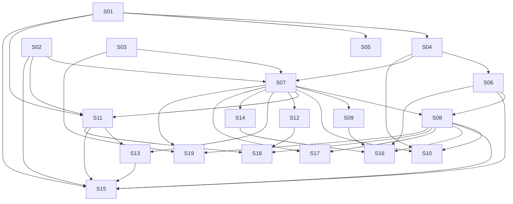

# M24 — Multi-Vertical Scheduling: Classes & Sessions

**Phase:** Local Development
**Goal:** Deliver the SESSION booking model end-to-end — recurring class schedule templates, generated sessions, capacity/waitlist-managed bookings (contract, pay-per-class, verified-guest group), recurring enrollments, class-access contracts, and staff close-out/attendance — completing the fourth and final cluster of the Multi-Vertical Scheduling discovery. This is the largest cluster: it also completes UC-056's SESSION branch (`Service.classResourceSlots` becomes actionable), UC-058's forward-referenced class-template availability check, UC-060's cross-family `resource_occupancy` exclusivity, and UC-075's Presets D/E/F.
**Depends on:** M21 (`Resource` aggregate), M22 (`Service.bookingModel`/`classResourceSlots`, availability engine, `resource_occupancy`), M23 (`booking_quote_revisions` precedent, `FutureCommitmentException`/no-show shape, onboarding-bootstrap `UC-075` flow this milestone extends). Exact M22/M23 story IDs aren't known while all three are drafted in parallel — dependencies below are cited at the concept/doc level, not `M22-Sxx`/`M23-Sxx` IDs; verify the real story IDs against the merged `plan/M22-*.md`/`plan/M23-*.md` files before running `/story-discovery` on any M24 story.
**Blocks:** none — this is the final milestone of the Multi-Vertical Scheduling sequence.
**Design rationale:** `docs/discovery/multivertical-booking/multivertical-booking.md` (Cluster 4, promoted via `/discovery-to-milestone` on 2026-08-31) — kept as the permanent *why*; this file and the canonical docs it cites (`docs/04-USE_CASES.md` UC-078–107, `docs/02-DOMAIN_MODEL.md` § `ClassScheduleTemplate`/`ClassSession`/`ClassSessionBooking`/`RecurringEnrollment`/`ClassAccessContract`/`ClassScheduleTemplateException`, `docs/03-DOMAIN_EVENTS.md`, `docs/13-DATABASE_SCHEMA.md`, `docs/14-API_CONTRACTS.md` § 4b, `docs/21-TENANTS_SETTINGS_SCHEMA.md`) are the source of truth for implementation — nothing below should require opening the discovery doc to understand.

## Non-Goals

- **Payment processing** — UC-101/UC-107's "manual charge record" is an operational log only; Ikaro never charges a card or integrates a payment gateway for classes, same as the rest of the platform.
- **Hotel/multi-day session models** — a `ClassSession` is a single bounded time window; no overnight/multi-day session support.
- **Adding/replacing attendees mid-reservation, or partially changing an APPOINTMENT booking's attendees** — UC-105 A1 explicitly defers this; only removal is supported.
- **A family-account/dependent hierarchy for minors** — UC-068's "a responsible authenticated adult may be the booker" note applies unchanged; no separate minor-account model.

## Build order

| Wave | Story | Theme |
|---|---|---|
| 1 | M24-S01 | `ClassScheduleTemplate` aggregate — CRUD + cancel-range (UC-079, UC-080, UC-096) |
| 1 | M24-S02 | `ClassAccessContract` aggregate — CRUD (UC-099) |
| 1 | M24-S03 | `Service` guest-access-policy extension (UC-078) |
| 2 | M24-S04 | `ClassSession` aggregate + rolling-horizon generation worker (UC-081) |
| 2 | M24-S05 | Onboarding bootstrap SESSION-preset extension — Presets D/E/F (UC-075 completion) |
| 3 | M24-S06 | Staff/Manager session list + single-session override (UC-082, UC-083) |
| 4 | M24-S07 | `ClassSessionBooking` aggregate — core booking creation + guest verification (UC-086, UC-087, UC-088, UC-097) |
| 5 | M24-S08 | Cancellation + waitlist join/auto-promotion + session-level cancel-with-bookings (UC-084, UC-089, UC-090, UC-091) |
| 5 | M24-S09 | Staff approval of verified-guest reservations (UC-098) |
| 6 | M24-S10 | Timer-worker bundle — end-of-session waitlist cleanup, guest-request expiry, offer expiry (UC-092, UC-100, UC-106) |
| 6 | M24-S11 | `RecurringEnrollment` aggregate — enroll/skip/cancel/reschedule (UC-093, UC-094, UC-095, UC-102) |
| 6 | M24-S12 | Attendee editing (UC-105) |
| 7 | M24-S13 | Enrollment views + staff manual booking (UC-103, UC-104) |
| 7 | M24-S14 | Session close-out + attendance + manual payment record (UC-101, UC-107) |
| 8 | M24-S15 | Manager "Turmas" admin frontend |
| 8 | M24-S16 | Staff "Turmas" frontend |
| 8 | M24-S17 | Customer "Reservar Aula" frontend (browse + book) |
| 8 | M24-S18 | Customer "Minha Conta" class extension frontend |
| 8 | M24-S19 | Guest "Book-a-Class" frontend |

**Wave note (self-dry-run):** UC-084 ("Staff/Manager Cancels a Class Session With Existing Bookings") reads like a natural fit alongside UC-082/083 in S06, but its own precondition — "≥1 `ClassSessionBooking` in `CONFIRMED`/`WAITLISTED` status" — means it cannot exist until the `ClassSessionBooking` aggregate does (S07). Moved to S08, bundled with the booking-level cancellation story instead, since UC-084 step 3 ("System transitions every active booking on it to `CANCELLED`") is literally a bulk invocation of the same cancel mechanism UC-089 implements at the single-booking level — a real shared code path, not just a shared aggregate type.

**Wave note (self-dry-run):** UC-092/UC-100/UC-106's own UC text explicitly says "same time-based check as UC-081's generation job (or piggybacked onto it)," which reads like they belong in S04. They were kept as a separate story (S10) instead, because all three require `ClassSessionBooking` rows to exist to have anything to check (an ended session's still-`WAITLISTED` entries, an unresolved `PENDING_APPROVAL` guest request, an expired `PROMOTION_PENDING` offer) — none of that exists until S07 ships. S10 reuses S04's cron-trigger *pattern* (same trigger-bus/`ITriggerBus` mechanism, same `CronBookingController`-style thin publisher), not its code.

**Likely-independent stories (preview — not authoritative):** S01, S02, and S03 touch disjoint aggregates/tables (`class_schedule_templates`+slots+exceptions vs. `class_access_contracts` vs. two new columns on the existing `services` table) with no `Dependencies:` edge between them — a candidate 3-way `/run-batch` group once M21/M22/M23 land. `/run-batch` re-derives this live at run time; this is a courtesy preview, not a green light.

---

### M24-S01 — `ClassScheduleTemplate` aggregate — CRUD + cancel-range

**Agent:** `backend-ts` + `bff-ts`
**Complexity:** L
**Docs to load:** `docs/02-DOMAIN_MODEL.md` § `ClassScheduleTemplate`, `ClassScheduleTemplateException`, `docs/13-DATABASE_SCHEMA.md` § `booking.class_schedule_templates`/`class_schedule_template_slots`/`class_schedule_template_exceptions`, `docs/14-API_CONTRACTS.md` § Session Templates (UC-078–080), `docs/04-USE_CASES.md` UC-079, UC-080, UC-096, `docs/AGENT_PATTERNS.md` Pattern #1 (port+adapter)
**Dependencies:** M22 (`Service.bookingModel=SESSION`, `Service.classResourceSlots` pool), M21 (`Resource`)
**Pattern:** Repository + Adapter (`IClassScheduleTemplateRepository`), matches every other Booking-context aggregate.

**Description:**
Create the `ClassScheduleTemplate` aggregate (root) with its `ClassScheduleTemplateSlot` child collection and the separate `ClassScheduleTemplateException` aggregate, per `docs/02-DOMAIN_MODEL.md`'s exact field lists. A template picks exactly one resource per slot from the service's already-declared `classResourceSlots` pool (M22), sets a recurrence rule, capacity, and optional `trialSlots`.

**Aggregate invariants (enforced in `ClassScheduleTemplate.create()`/`update()`, not just the DB):**
- Each `resourceIds` entry must be a member of `Service.classResourceSlots` for the same `(serviceId, resourceType)` — app-enforced.
- `capacity` cannot exceed the lowest `maxCapacity` ceiling among the template's `ROOM`/capacity-bearing `EQUIPMENT` resources (UC-079 A3).
- At most `MAX_ACTIVE_TEMPLATES_PER_RESOURCE = 50` active templates reference any one resource (UC-079 A4).
- A chosen resource must not already be committed to an overlapping template, an `APPROVED` appointment `Booking`, or an active `RecurringBookingSchedule` (UC-079 A1/A2) — checked via the same advisory-lock protocol `RecurringBookingSchedule` uses (M23 precedent; reuse, don't reinvent).
- Editing only affects future, not-yet-generated sessions (UC-080); a new default `capacity` below an already-materialized, not-yet-started session's `reservedCount` is blocked (UC-080 A2).
- `cancelRange(from, to?)` creates/merges a `ClassScheduleTemplateException` (UC-096 A2: an overlapping existing exception is extended, never duplicated); a range entirely in the past is rejected (UC-096 A1).

**Backend use case steps:**
1. **`CreateClassScheduleTemplateUseCase`** (UC-079): validates slot membership, resource conflicts (A1/A2), capacity ceiling (A3), the 50-cap (A4); persists via `IClassScheduleTemplateRepository.save()`.
2. **`UpdateClassScheduleTemplateUseCase`** (UC-080): loads by `(tenantId, id)`, re-validates capacity-vs-`reservedCount` (A2), saves.
3. **`DeactivateClassScheduleTemplateUseCase`** (UC-080): sets `isActive = false`; stops future generation (checked by S04's worker), does not touch already-materialized sessions.
4. **`CancelTemplateRangeUseCase`** (UC-096): creates/merges a `ClassScheduleTemplateException`; cancels every already-materialized affected future session (calls `ClassSession.cancel()` — **forward reference to S04's aggregate**; if S04 hasn't landed at implementation time, this step is a no-op with a `// TODO(M24-S04)` — but per this milestone's own wave order S04 lands after S01, so at merge time for S04 this use case must be revisited to wire the real call. Flag explicitly in S04's own AC as a cross-story completion item.).
5. **`ListClassScheduleTemplatesUseCase`**: `findByTenant(tenantId, { serviceId?, isActive? })`.

**Backend HTTP surface:** new controller `infrastructure/controllers/class-schedule-template.controller.ts` — `POST /class-schedule-templates`, `PATCH /class-schedule-templates/:id`, `DELETE /class-schedule-templates/:id`, `POST /class-schedule-templates/:id/cancel-range`, `GET /class-schedule-templates`. `STAFF|MANAGER` per `docs/14-API_CONTRACTS.md` § 4b's blanket auth note.

**BFF endpoint spec:** new `apps/bff/src/features/booking/class-schedule-template.controller.ts` + `.schemas.ts` + `.types.ts`, forwarding via `BackendHttpService`. Register in the existing `apps/bff/src/features/booking/` module.

**New migration:** `apps/backend/src/contexts/booking/infrastructure/migrations/<timestamp>-CreateClassScheduleTemplates.ts` — `class_schedule_templates`, `class_schedule_template_slots`, `class_schedule_template_exceptions` exactly per `docs/13-DATABASE_SCHEMA.md`. Verify the current highest migration timestamp at implementation time (`1748500000006` as of this milestone's drafting — M21/M22/M23 will have added more by the time this story starts).

**Files to create/modify:**
- `apps/backend/src/contexts/booking/domain/class-schedule-template.aggregate.ts` (+ `.spec.ts`) (new)
- `apps/backend/src/contexts/booking/domain/class-schedule-template-exception.aggregate.ts` (+ `.spec.ts`) (new)
- `apps/backend/src/contexts/booking/domain/errors/class-schedule-template-*.error.ts` (new — one per new error code)
- `apps/backend/src/contexts/booking/application/ports/class-schedule-template-repository.port.ts` (new)
- `apps/backend/src/contexts/booking/application/use-cases/create-class-schedule-template.use-case.ts` (+ `.spec.ts`) (new)
- `apps/backend/src/contexts/booking/application/use-cases/update-class-schedule-template.use-case.ts` (+ `.spec.ts`) (new)
- `apps/backend/src/contexts/booking/application/use-cases/deactivate-class-schedule-template.use-case.ts` (+ `.spec.ts`) (new)
- `apps/backend/src/contexts/booking/application/use-cases/cancel-template-range.use-case.ts` (+ `.spec.ts`) (new)
- `apps/backend/src/contexts/booking/application/use-cases/list-class-schedule-templates.use-case.ts` (+ `.spec.ts`) (new)
- `apps/backend/src/contexts/booking/infrastructure/entities/class-schedule-template.entity.ts` (+ slot/exception entities) (new)
- `apps/backend/src/contexts/booking/infrastructure/repositories/typeorm-class-schedule-template.repository.ts` (+ `.spec.ts`) (new)
- `apps/backend/src/contexts/booking/infrastructure/controllers/class-schedule-template.controller.ts` (+ `.spec.ts`, `.integration.spec.ts`) (new)
- `apps/backend/src/contexts/booking/infrastructure/migrations/<timestamp>-CreateClassScheduleTemplates.ts` (new)
- `apps/backend/src/contexts/booking/booking.module.ts` (modify)
- `apps/backend/http/booking/class-schedule-templates.http` (new)
- `packages/types/src/error-codes.ts` (modify — `BOOKING_CLASS_TEMPLATE_RESOURCE_CONFLICT`, `BOOKING_CLASS_TEMPLATE_CAPACITY_EXCEEDS_RESOURCE`, `BOOKING_CLASS_TEMPLATE_MAX_ACTIVE_PER_RESOURCE`, `BOOKING_CLASS_TEMPLATE_CAPACITY_BELOW_RESERVED`, `BOOKING_CLASS_TEMPLATE_RANGE_IN_PAST`)
- `packages/i18n/locales/pt-BR/errors.json` + `.../en/errors.json` (modify)
- `apps/bff/src/features/booking/class-schedule-template.controller.ts` (+ `.spec.ts`, `.component.spec.ts`) (new)
- `apps/bff/src/features/booking/class-schedule-template.schemas.ts` (new)
- `apps/bff/http/booking/class-schedule-templates.http` (new)

**Acceptance criteria — product:**
- [ ] Staff/manager can create a class template picking one resource per declared slot, a recurrence rule, capacity, and optional trial slots.
- [ ] Editing a template never retroactively changes an already-generated session.
- [ ] Cancelling a date range blocks future generation for that range without touching history.

**Acceptance criteria — technical:**
- Unit:
  - [ ] Rejects a `resourceIds` entry not in the service's `classResourceSlots` pool
  - [ ] Rejects `capacity` above the lowest resource `maxCapacity`
  - [ ] Rejects a 51st active template on an already-saturated resource
  - [ ] `cancelRange` merges an overlapping existing exception instead of duplicating it
- Integration:
  - [ ] `POST /class-schedule-templates` persists and is retrievable
  - [ ] A resource already committed to an overlapping template is rejected with `409`
- Tenant isolation:
  - [ ] Cross-tenant `serviceId`/`resourceIds` rejected with `404`, never silently scoped wrong
- E2E: none — covered by unit/integration; frontend E2E lands with S15
- [ ] Coverage ≥80% on changed code
- [ ] `tsc --noEmit` clean, lint clean

---

### M24-S02 — `ClassAccessContract` aggregate — CRUD

**Agent:** `backend-ts` + `bff-ts`
**Complexity:** M
**Docs to load:** `docs/02-DOMAIN_MODEL.md` § `ClassAccessContract`, `docs/13-DATABASE_SCHEMA.md` § `booking.class_access_contracts`, `docs/14-API_CONTRACTS.md` § Class Access Contracts, `docs/04-USE_CASES.md` UC-099
**Dependencies:** M22 (`Service.bookingModel=SESSION`)
**Pattern:** Repository + Adapter (`IClassAccessContractRepository`).

**Description:**
Create the `ClassAccessContract` aggregate — a minimal, date-bounded eligibility record. Manager grants a customer booking eligibility for one or more SESSION services over a date range; the contract reserves no seat itself.

**Aggregate invariants:**
- Overlapping active contracts for the same customer are permitted only when `eligibleServiceIds` don't overlap (UC-099 A2) — checked via `(tenant_id, customer_id, status)` index + app-side array-overlap check (no DB constraint for array overlap across rows, per `docs/13-DATABASE_SCHEMA.md`).
- Cancelling early cancels every future booking it funded and ends dependent recurring enrollments (this milestone's S11), releasing capacity.
- Reaching `endsOn` expires the contract the same way — a later contract never silently resumes what an earlier one covered.

**Backend use case steps:**
1. **`CreateClassAccessContractUseCase`** (UC-099 steps 1-2): validates customer exists (cross-context lookup via a narrow adapter, grep `infrastructure/cross-context/` first per `CLAUDE.md` §8), validates no overlapping eligibility, persists.
2. **`CancelClassAccessContractUseCase`** (UC-099 step 4): sets `status = CANCELLED`; cancels dependent future bookings/enrollments (**forward reference to S07/S11** — the cancellation cascade over `ClassSessionBooking`/`RecurringEnrollment` can only be wired once those aggregates exist; implement this use case's own state transition now, wire the cascade call when S07/S11 land, flagged explicitly in those stories' AC).
3. **Expiry**: a lightweight query-time check (`endsOn < today`) marks a contract `EXPIRED` when read, mirroring how `LoyaltyBalance` expiry is query-time-only (`docs/13-DATABASE_SCHEMA.md`'s Loyalty precedent) — no separate cron needed for this aggregate alone.

**Backend HTTP surface:** new controller `infrastructure/controllers/class-access-contract.controller.ts` — `POST /class-access-contracts`, `POST /class-access-contracts/:id/cancel`, `GET /class-access-contracts?customerId=`. `MANAGER`-only (grants eligibility, a manager-level decision, matching the Resource Management precedent from M21).

**BFF endpoint spec:** new `apps/bff/src/features/booking/class-access-contract.controller.ts` + `.schemas.ts`.

**New migration:** `<timestamp>-CreateClassAccessContracts.ts` — `class_access_contracts` exactly per `docs/13-DATABASE_SCHEMA.md`.

**Files to create/modify:**
- `apps/backend/src/contexts/booking/domain/class-access-contract.aggregate.ts` (+ `.spec.ts`) (new)
- `apps/backend/src/contexts/booking/application/ports/class-access-contract-repository.port.ts` (new)
- `apps/backend/src/contexts/booking/application/use-cases/create-class-access-contract.use-case.ts` (+ `.spec.ts`) (new)
- `apps/backend/src/contexts/booking/application/use-cases/cancel-class-access-contract.use-case.ts` (+ `.spec.ts`) (new)
- `apps/backend/src/contexts/booking/infrastructure/entities/class-access-contract.entity.ts` (new)
- `apps/backend/src/contexts/booking/infrastructure/repositories/typeorm-class-access-contract.repository.ts` (+ `.spec.ts`) (new)
- `apps/backend/src/contexts/booking/infrastructure/controllers/class-access-contract.controller.ts` (+ `.spec.ts`, `.integration.spec.ts`) (new)
- `apps/backend/src/contexts/booking/infrastructure/migrations/<timestamp>-CreateClassAccessContracts.ts` (new)
- `apps/backend/src/contexts/booking/booking.module.ts` (modify)
- `packages/types/src/error-codes.ts` (modify — `BOOKING_CLASS_CONTRACT_ELIGIBILITY_OVERLAP`)
- `packages/i18n/locales/{pt-BR,en}/errors.json` (modify)
- `apps/bff/src/features/booking/class-access-contract.controller.ts` (+ `.spec.ts`, `.component.spec.ts`) (new)
- `apps/bff/src/features/booking/class-access-contract.schemas.ts` (new)

**Acceptance criteria — product:**
- [ ] Manager can grant a customer eligibility for one or more SESSION services over a date range, and cancel it early.
- [ ] Two contracts for the same customer with overlapping service coverage and overlapping dates are rejected.

**Acceptance criteria — technical:**
- Unit:
  - [ ] Rejects overlapping eligibility for the same customer/service (A2)
- Integration:
  - [ ] `POST /class-access-contracts` persists and is retrievable
- Tenant isolation:
  - [ ] Cross-tenant `customerId` rejected
- E2E: none — covered by S15's manager frontend E2E
- [ ] Coverage ≥80% on changed code
- [ ] `tsc --noEmit` clean, lint clean

---

### M24-S03 — `Service` guest-access-policy extension

**Agent:** `backend-ts` + `bff-ts`
**Complexity:** S
**Docs to load:** `docs/04-USE_CASES.md` UC-078, `docs/14-API_CONTRACTS.md` § Session Templates
**Dependencies:** M22 (`Service.bookingModel=SESSION`)
**Pattern:** plain composition — extends the existing `Service` aggregate; no new pattern.

**Description:**
Add `guestAccessEnabled: boolean` (default `false`) and `guestTrialPolicy: 'NONE' | 'FIRST_FREE_PER_EMAIL'` to `Service`. Existing in-flight guest reservations are honored to conclusion if staff later disables guest access (A1) — a read-time check, not a migration concern.

**Backend use case steps:**
1. **`UpdateServiceGuestAccessPolicyUseCase`** (UC-078): loads service, validates `bookingModel = SESSION`, saves both fields.

**Backend HTTP surface:** `PATCH /services/:id/guest-access-policy` — new action on the existing `service.controller.ts`.

**BFF endpoint spec:** extend the existing `apps/bff/src/features/booking/services.controller.ts`/`.schemas.ts` (verify exact filename at implementation time — grep `apps/bff/src/features/booking/` for the real service controller name).

**New migration:** `<timestamp>-AddGuestAccessPolicyToServices.ts` — 2 nullable-with-default columns on `services`.

**Files to create/modify:**
- `apps/backend/src/contexts/booking/domain/service.aggregate.ts` (modify — 2 fields + `updateGuestAccessPolicy()`)
- `apps/backend/src/contexts/booking/domain/service.spec.ts` (modify)
- `apps/backend/src/contexts/booking/application/use-cases/update-service-guest-access-policy.use-case.ts` (+ `.spec.ts`) (new)
- `apps/backend/src/contexts/booking/infrastructure/entities/service.entity.ts` (modify)
- `apps/backend/src/contexts/booking/infrastructure/controllers/service.controller.ts` (+ `.spec.ts`, `.integration.spec.ts`) (modify)
- `apps/backend/src/contexts/booking/infrastructure/migrations/<timestamp>-AddGuestAccessPolicyToServices.ts` (new)
- `apps/backend/http/booking/services.http` (modify)
- `apps/bff/src/features/booking/services.controller.ts` (+ `.spec.ts`) (modify — verify real filename)
- `apps/bff/src/features/booking/services.schemas.ts` (modify)

**Acceptance criteria — product:**
- [ ] Staff can enable/disable guest access and pick a trial policy for a SESSION service.
- [ ] Disabling guest access with in-flight guest reservations doesn't cancel them — only blocks new requests.

**Acceptance criteria — technical:**
- Unit:
  - [ ] Rejects the endpoint on a non-`SESSION` service
- Integration:
  - [ ] `PATCH .../guest-access-policy` persists and round-trips
- Tenant isolation: standard cross-tenant `404`
- E2E: none — covered by S15
- [ ] Coverage ≥80% on changed code
- [ ] `tsc --noEmit` clean, lint clean

---

### M24-S04 — `ClassSession` aggregate + rolling-horizon generation worker

**Agent:** `backend-ts`
**Complexity:** M
**Docs to load:** `docs/02-DOMAIN_MODEL.md` § `ClassSession`, `docs/13-DATABASE_SCHEMA.md` § `booking.class_sessions`/`class_session_resources`, `docs/04-USE_CASES.md` UC-081, `docs/ENGINEERING_RULES.md` § Cloud Run CPU throttling (timer/async work can be silently starved — this worker must run via the trigger-bus/Pub-Sub-push path, never a bare in-process `setInterval`)
**Dependencies:** M24-S01 (templates to generate from)
**Pattern:** plain composition, mirrors the existing loyalty-expiry cron shape (`apps/backend/src/contexts/loyalty/application/jobs/expire-points.job.ts` + `apps/backend/src/contexts/loyalty/infrastructure/events/expire-points-trigger.handler.ts` + `apps/backend/src/contexts/booking/infrastructure/controllers/cron-booking.controller.ts`'s thin-publisher pattern) — real, verified precedent, not invented.

**Description:**
Create the `ClassSession` aggregate (root, event-emitting) with its `ClassSessionResource` child. An idempotent worker runs every 15 minutes (Cloud Scheduler → `/pubsub/push`, same infra as the existing reminders cron), computing each active template's next occurrence(s) within the rolling horizon (platform default 90 days, service-configurable shorter) and materializing a `ClassSession` per occurrence not yet generated.

**Aggregate invariants:**
- `reservedCount <= capacity`, enforced by a guarded `UPDATE` (`WHERE reserved_count + :qty <= capacity`), never read-then-write — this milestone doesn't write `reservedCount` yet (that's S07), but the column/guard shape must exist now so S07 doesn't need a schema change.
- `(templateId, startTime)` uniqueness prevents double-generation on retry (UC-081 A1).
- A resource closed or outside its hours for a candidate occurrence blocks generation (A2); an overlapping approved appointment is rejected by the shared `resource_occupancy` constraint (A3, M22).
- Transitions to `AWAITING_ATTENDANCE` at `endTime` (a query-time-computed status transition, not a separate worker write — mirrors how `Booking`'s terminal-state checks work) — stays visible until closed (S14).

**Backend use case steps:**
1. **`GenerateClassSessionsJob`** (UC-081): for each active template, computes next occurrences in horizon, creates `ClassSession` + `ClassSessionResource` rows, skips already-materialized `(templateId, startTime)` keys, records an operational metric on partial failure (A1).
2. **`ListClassSessionsUseCase`**: read-only, `findByTenant(tenantId, { serviceId?, from?, to? })` — used by both S06 (staff) and S17/S19 (customer/guest browse); this is the one shared read model both surfaces call, per `CLAUDE.md` §8's "duplicate read endpoints" anti-pattern.

**Backend HTTP surface:** extend `cron-booking.controller.ts`-style pattern with a new `infrastructure/controllers/cron-class-sessions.controller.ts` — `POST /cron/class-sessions/generate`, publishing a new trigger via `ITriggerBus`; new `infrastructure/events/generate-class-sessions-trigger.handler.ts` subscribes and calls the job. `GET /class-sessions` — public/authenticated variant per `docs/14-API_CONTRACTS.md`.

**New migration:** `<timestamp>-CreateClassSessions.ts` — `class_sessions`, `class_session_resources` exactly per `docs/13-DATABASE_SCHEMA.md`.

**Cross-story completion item:** S01's `CancelTemplateRangeUseCase` (UC-096 step 4, "cancels every already-materialized affected future session") has a placeholder no-op for the `ClassSession.cancel()` call until this story lands — wire the real call here.

**Files to create/modify:**
- `apps/backend/src/contexts/booking/domain/class-session.aggregate.ts` (+ `.spec.ts`) (new)
- `apps/backend/src/contexts/booking/application/ports/class-session-repository.port.ts` (new)
- `apps/backend/src/contexts/booking/application/use-cases/generate-class-sessions.job.ts` (+ `.spec.ts`) (new)
- `apps/backend/src/contexts/booking/application/use-cases/list-class-sessions.use-case.ts` (+ `.spec.ts`) (new)
- `apps/backend/src/contexts/booking/infrastructure/entities/class-session.entity.ts` (+ resource child entity) (new)
- `apps/backend/src/contexts/booking/infrastructure/repositories/typeorm-class-session.repository.ts` (+ `.spec.ts`) (new)
- `apps/backend/src/contexts/booking/infrastructure/controllers/cron-class-sessions.controller.ts` (+ `.spec.ts`) (new)
- `apps/backend/src/contexts/booking/infrastructure/events/generate-class-sessions-trigger.handler.ts` (+ `.spec.ts`, `.integration.spec.ts`) (new)
- `apps/backend/src/contexts/booking/infrastructure/events/cron-trigger-names.constants.ts` (modify — add `CRON_GENERATE_CLASS_SESSIONS_TRIGGER`)
- `apps/backend/src/contexts/booking/infrastructure/controllers/class-session-availability.controller.ts` (new — `GET /class-sessions` read endpoint; verify against `schedule-availability.controller.ts`'s naming precedent)
- `apps/backend/src/contexts/booking/infrastructure/migrations/<timestamp>-CreateClassSessions.ts` (new)
- `apps/backend/src/contexts/booking/booking.module.ts` (modify)
- Cloud Scheduler config for the new 15-min trigger — verify against the existing reminders-cron Terraform/config precedent at implementation time (`infra/terraform/` — grep for the existing cron schedule resource)

**Acceptance criteria — product:**
- [ ] Active templates generate sessions far enough ahead for customers to book into (90-day default horizon).
- [ ] A closed/out-of-hours resource, or one with a conflicting approved appointment, correctly blocks generation for just that occurrence — other occurrences unaffected.

**Acceptance criteria — technical:**
- Unit:
  - [ ] Generation is idempotent — a second run against the same horizon creates zero duplicate rows
  - [ ] A6/A2/A3 blocking conditions each correctly skip just the affected occurrence
- Integration:
  - [ ] End-to-end: an active template with matching-hours resources materializes real `ClassSession` rows after the job runs
  - [ ] `resource_occupancy` exclusion correctly rejects a session generation that would overlap an approved appointment
- Tenant isolation:
  - [ ] Generation for tenant A never creates sessions referencing tenant B's resources/templates
- E2E: none — internal worker; frontend E2E lands with S15/S17/S19
- [ ] Coverage ≥80% on changed code
- [ ] `tsc --noEmit` clean, lint clean

---

### M24-S05 — Onboarding bootstrap SESSION-preset extension (UC-075 completion)

**Agent:** `backend-ts`
**Complexity:** S
**Docs to load:** `docs/04-USE_CASES.md` UC-075 (steps 4/A1), `plan/journey/manager/onboarding.md`
**Dependencies:** M24-S01 (`ClassScheduleTemplate` to create), M23's onboarding-bootstrap story (concept-level — extends `BootstrapTenantFromPresetUseCase`; verify its real name/path against the merged `plan/M23-*.md` file before starting)
**Pattern:** plain composition — extends an existing M23 use case.

**Description:**
Extend the tenant-onboarding bootstrap use case (built in M23 for Presets A/B/C/G) to additionally create the first `ClassScheduleTemplate`(s) for SESSION presets (D/E/F) and the SESSION half of mixed presets (e.g. Preset F). Per UC-075 A1, this is additive — the appointment half of a mixed preset is unaffected.

**Backend use case steps:**
1. Extend `BootstrapTenantFromPresetUseCase` (exact name TBD from M23): after the existing service/resource/policy creation steps, branch on preset type; for D/E/F, create the first `ClassScheduleTemplate`(s) per the preset's declared recurrence pattern (`docs/discovery/multivertical-booking/multivertical-booking_ONBOARDING_PRESETS.md` — read for the exact D/E/F recurrence defaults).
2. Same rollback guarantee as the rest of UC-075 (A3): the whole bootstrap rolls back atomically if any step fails, including this new one.

**Files to create/modify:**
- `apps/backend/src/contexts/booking/application/use-cases/bootstrap-tenant-from-preset.use-case.ts` (modify — exact path TBD from M23; verify before starting)
- `apps/backend/src/contexts/booking/application/use-cases/bootstrap-tenant-from-preset.use-case.spec.ts` (modify — add D/E/F cases)

**Acceptance criteria — product:**
- [ ] Selecting a SESSION or mixed preset during onboarding produces a working `ClassScheduleTemplate`, immediately visible in the generated-configuration review.

**Acceptance criteria — technical:**
- Unit:
  - [ ] Presets D/E/F each produce the documented template shape
  - [ ] A failure partway through a SESSION-preset bootstrap rolls back the whole configuration, template included
- Integration:
  - [ ] `POST /onboarding/bootstrap` with a SESSION preset creates a real, queryable template
- Tenant isolation: standard
- E2E: none — covered by the existing onboarding E2E extended in this story
- [ ] Coverage ≥80% on changed code
- [ ] `tsc --noEmit` clean, lint clean

---

### M24-S06 — Staff/Manager session list + single-session override

**Agent:** `backend-ts` + `bff-ts`
**Complexity:** M
**Docs to load:** `docs/04-USE_CASES.md` UC-082, UC-083, `docs/14-API_CONTRACTS.md` § Sessions
**Dependencies:** M24-S04 (`ClassSession` must exist)
**Pattern:** plain composition.

**Description:**
Staff/manager list view over generated sessions (scoped "mine" for STAFF, "all" for MANAGER — mirrors Agenda's queue-scope precedent) with per-session capacity/resource override for one-off changes (instructor injury, room swap) that never touch the template.

**Backend use case steps:**
1. **`ListClassSessionsForStaffUseCase`** (UC-082): extends S04's `ListClassSessionsUseCase` with the `scope=mine|all` filter — STAFF's "mine" resolves via their own `Resource`-wrapped row (M21) being present in `resourceIds`.
2. **`OverrideClassSessionUseCase`** (UC-083): validates new resource(s) free for the window if changed, validates `capacity >= reservedCount` (A1) and `<=` resource ceiling (A2), saves — this instance only.

**Backend HTTP surface:** `GET /class-sessions?scope=mine|all&from=&to=` (extends S04's controller), `PATCH /class-sessions/:id` — new action on `cron-class-sessions.controller.ts`'s sibling `class-session.controller.ts` (create this controller now for the non-cron session actions).

**BFF endpoint spec:** new `apps/bff/src/features/booking/class-session.controller.ts` + `.schemas.ts`.

**Files to create/modify:**
- `apps/backend/src/contexts/booking/application/use-cases/list-class-sessions-for-staff.use-case.ts` (+ `.spec.ts`) (new)
- `apps/backend/src/contexts/booking/application/use-cases/override-class-session.use-case.ts` (+ `.spec.ts`) (new)
- `apps/backend/src/contexts/booking/infrastructure/controllers/class-session.controller.ts` (+ `.spec.ts`, `.integration.spec.ts`) (new)
- `apps/backend/src/contexts/booking/booking.module.ts` (modify)
- `apps/bff/src/features/booking/class-session.controller.ts` (+ `.spec.ts`, `.component.spec.ts`) (new)
- `apps/bff/src/features/booking/class-session.schemas.ts` (new)

**Acceptance criteria — product:**
- [ ] Staff sees their own sessions by default; manager sees all.
- [ ] Staff/manager can override a single session's capacity/resources without affecting the template or other sessions.

**Acceptance criteria — technical:**
- Unit: [ ] rejects new capacity below `reservedCount`; [ ] rejects new capacity above resource ceiling
- Integration: [ ] override persists as an instance-only change, template untouched
- Tenant isolation: standard
- E2E: none — covered by S15/S16
- [ ] Coverage ≥80%, `tsc --noEmit`/lint clean

---

### M24-S07 — `ClassSessionBooking` aggregate — core booking creation + guest verification

**Agent:** `backend-ts` + `bff-ts`
**Complexity:** L
**Docs to load:** `docs/02-DOMAIN_MODEL.md` § `ClassSessionBooking`, `docs/13-DATABASE_SCHEMA.md` § `class_session_bookings`/`class_session_booking_attendees`/`class_session_booking_transitions`/`guest_class_booking_email_verifications`/`guest_class_trial_redemptions`, `docs/03-DOMAIN_EVENTS.md` § `ClassSessionBookingConfirmed`, `docs/04-USE_CASES.md` UC-086, UC-087, UC-088, UC-097, `docs/14-API_CONTRACTS.md` § Class Session Bookings
**Dependencies:** M24-S04 (sessions to book into), M24-S02 (contracts, for UC-086 eligibility), M24-S03 (guest access policy, for UC-087/088 gating)
**Pattern:** Repository + Adapter, full `AggregateRoot` with outbox-aware repository (matches `Booking`'s own pattern exactly, per `docs/03-DOMAIN_EVENTS.md`'s explicit note).

**Description:**
The biggest story in this milestone — the core session-booking write path. One `POST /class-session-bookings` endpoint branches on caller context: an authenticated customer with a qualifying `ClassAccessContract` books a single contract-funded seat (UC-086); an authenticated customer without one, on a `guestAccessEnabled` service, books pay-per-class (UC-087); an anonymous guest, after email verification, books 1..N named seats (UC-088/097).

**Aggregate invariants:**
- `reservedCount`/`reservedNonMemberCount` maintained by the *same* guarded update that creates/cancels this aggregate — never a separately-timed read-then-write (shared with S04's `ClassSession.reservedCount` guard).
- `WAITLISTED`/`PROMOTION_PENDING` requires non-null `waitlistAccessIntent` — not reachable in this story (waitlist is S08), but the CHECK constraint is created now since it's part of the same table.
- Active attendee count must equal `quantity` in the same transaction (enforced fully in S12, but attendee rows are created here for UC-088's initial group).
- `FIRST_FREE_PER_EMAIL` consumed atomically exactly when a solo verified-guest reservation reaches `CONFIRMED` — via `guest_class_trial_redemptions`' `UNIQUE(tenant_id, normalized_email)`.

**Backend use case steps:**
1. **`RequestClassSessionBookingUseCase`** (UC-086/087/088): atomically checks `reservedCount < capacity` under a guarded UPDATE; branches:
   - Contract path (UC-086): validates active `ClassAccessContract` covering session's service/date; `409 BOOKING_CLASS_NO_QUALIFYING_CONTRACT` if none (A2).
   - Pay-per-class path (UC-087): validates `guestAccessEnabled`; applies the `trialSlots`/`reservedNonMemberCount` threshold — below → `CONFIRMED`, at/above → `PENDING_APPROVAL`.
   - Guest group path (UC-088): only reachable after UC-097's verification confirms; quantity capped by remaining capacity; always `paymentSource = IN_PERSON` (group), `GUEST_TRIAL` only for a verified solo attendee with an unused entitlement.
   - Fills between load and submit (A1 of UC-086) → falls through to `409`, frontend directs to waitlist (S08).
2. **`RequestGuestClassVerificationUseCase`** (UC-097 step 1): stores non-capacity-holding `PENDING_EMAIL_VERIFICATION` draft row, creates `guest_class_booking_email_verifications` token, sends one-time email.
3. **`ConfirmGuestClassVerificationUseCase`** (UC-097 steps 2-3): validates token not expired, re-checks capacity + threshold atomically, transitions the draft to `CONFIRMED`/`PENDING_APPROVAL`, or — if capacity is now gone — leaves it unconfirmed and the frontend offers login/waitlist (A3).

**Backend HTTP surface:** new controller `infrastructure/controllers/class-session-booking.controller.ts` — `POST /class-session-bookings`, `POST /class-session-bookings/guest-verification`, `POST /class-session-bookings/guest-verification/:token/confirm`. Customer/Guest actors per `docs/14-API_CONTRACTS.md` § 4b.

**BFF endpoint spec:** new `apps/bff/src/features/booking/class-session-booking.public.controller.ts` (guest/unauthenticated paths — `.public.controller.ts` prefix per `docs/24-BFF_ARCHITECTURE.md` § Module & Controller Naming) + `class-session-booking.controller.ts` (authenticated customer path) + `.schemas.ts`.

**New migration:** `<timestamp>-CreateClassSessionBookings.ts` — `class_session_bookings`, `class_session_booking_attendees`, `class_session_booking_transitions`, `guest_class_booking_email_verifications`, `guest_class_trial_redemptions` exactly per `docs/13-DATABASE_SCHEMA.md`.

**Files to create/modify:**
- `apps/backend/src/contexts/booking/domain/class-session-booking.aggregate.ts` (+ `.spec.ts`) (new)
- `apps/backend/src/contexts/booking/domain/class-session-attendee.ts` (child entity) (new)
- `apps/backend/src/contexts/booking/domain/errors/class-session-booking-*.error.ts` (new)
- `apps/backend/src/contexts/booking/application/ports/class-session-booking-repository.port.ts` (new)
- `apps/backend/src/contexts/booking/application/use-cases/request-class-session-booking.use-case.ts` (+ `.spec.ts`) (new)
- `apps/backend/src/contexts/booking/application/use-cases/request-guest-class-verification.use-case.ts` (+ `.spec.ts`) (new)
- `apps/backend/src/contexts/booking/application/use-cases/confirm-guest-class-verification.use-case.ts` (+ `.spec.ts`) (new)
- `apps/backend/src/contexts/booking/infrastructure/entities/class-session-booking.entity.ts` (+ attendee/verification entities) (new)
- `apps/backend/src/contexts/booking/infrastructure/repositories/typeorm-class-session-booking.repository.ts` (+ `.spec.ts`) (new)
- `apps/backend/src/contexts/booking/infrastructure/controllers/class-session-booking.controller.ts` (+ `.spec.ts`, `.integration.spec.ts`) (new)
- `apps/backend/src/contexts/booking/infrastructure/migrations/<timestamp>-CreateClassSessionBookings.ts` (new)
- `apps/backend/src/contexts/booking/booking.module.ts` (modify)
- `packages/types/src/error-codes.ts` (modify — `BOOKING_CLASS_SESSION_FULL`, `BOOKING_CLASS_NO_QUALIFYING_CONTRACT`, `BOOKING_CLASS_GUEST_ACCESS_DISABLED`, `BOOKING_CLASS_VERIFICATION_EXPIRED`)
- `packages/i18n/locales/{pt-BR,en}/errors.json` (modify)
- `apps/bff/src/features/booking/class-session-booking.public.controller.ts` (+ `.spec.ts`, `.component.spec.ts`) (new)
- `apps/bff/src/features/booking/class-session-booking.controller.ts` (+ `.spec.ts`, `.component.spec.ts`) (new)
- `apps/bff/src/features/booking/class-session-booking.schemas.ts` (new)

**Acceptance criteria — product:**
- [ ] Contract customer books one seat in an eligible session with no email step.
- [ ] Authenticated customer without a contract can pay-per-class book when the service allows it, subject to the trial-slots threshold.
- [ ] Anonymous guest verifies email, then books 1..N named seats in one action within remaining capacity.
- [ ] A race that fills the session between load and submit never double-books; the second requester gets a clean rejection.

**Acceptance criteria — technical:**
- Unit:
  - [ ] Threshold branch (`reservedNonMemberCount + quantity <= trialSlots`) correctly picks `CONFIRMED` vs `PENDING_APPROVAL`
  - [ ] `FIRST_FREE_PER_EMAIL` never double-consumed for the same email
  - [ ] Expired verification token rejected, no capacity held
- Integration:
  - [ ] Full guest flow: request verification → confirm → booking created, real row
  - [ ] Two concurrent contract-booking requests for the last seat: exactly one succeeds
- Tenant isolation:
  - [ ] A `sessionId` from another tenant is rejected
- E2E: none — covered by S17/S19
- [ ] Coverage ≥80% on changed code
- [ ] `tsc --noEmit` clean, lint clean

---

### M24-S08 — Cancellation + waitlist join/auto-promotion + session-level cancel-with-bookings

**Agent:** `backend-ts` + `bff-ts`
**Complexity:** L
**Docs to load:** `docs/04-USE_CASES.md` UC-084, UC-089, UC-090, UC-091, `docs/03-DOMAIN_EVENTS.md` § `ClassSessionCancelled`/`ClassSessionBookingCancelled`/`ClassSessionBookingWaitlisted`/`WaitlistPromoted`, `docs/21-TENANTS_SETTINGS_SCHEMA.md` § `classCancellationWindowHours`
**Dependencies:** M24-S07 (bookings must exist), M24-S06 (session-level cancel action surface)
**Pattern:** plain composition — extends S07's aggregate with cancellation/waitlist methods.

**Description:**
Customer self-cancellation (within `classCancellationWindowHours`), waitlist join when full, FIFO auto-promotion on any capacity release, and the session-level bulk cancel that cascades to every active booking on it — a real shared transaction: session cancel calls the same per-booking cancel path in a loop, both trigger the same promotion mechanism.

**Backend use case steps:**
1. **`CancelClassSessionBookingUseCase`** (UC-089): validates window (skipped for `WAITLISTED`, A2); transitions `CONFIRMED → CANCELLED`, frees `quantity`, triggers promotion (step 2 below) if a waitlist exists.
2. **`PromoteNextWaitlistEntryUseCase`** (UC-091): on any capacity release, finds earliest-queued `WAITLISTED` entry with `quantity <=` freed capacity, atomically reserves, transitions to `PROMOTION_PENDING`, sets `offerExpiresAt` (tenant-configured deadline, default 24h, never later than session start), sends offer.
3. **`JoinClassSessionWaitlistUseCase`** (UC-090): validates session is full, one qualifying-contract-or-pay-per-class choice, creates `WAITLISTED` row, snapshots `waitlistAccessIntent`; rejects a duplicate active entry (A1).
4. **`AcceptWaitlistOfferUseCase`**/**`DeclineWaitlistOfferUseCase`**: accept → `CONFIRMED`; decline → releases capacity, repeats promotion for the next entry (A2).
5. **`CancelClassSessionWithBookingsUseCase`** (UC-084): sets `ClassSession.status = CANCELLED`, iterates every `CONFIRMED`/`WAITLISTED` booking calling step 1's cancel method (without triggering per-cancellation promotion, since the session itself is gone), publishes one `ClassSessionCancelled` with `cancelledBookingIds`.

**Backend HTTP surface:** `POST /class-session-bookings/:id/cancel`, `POST /class-sessions/:id/waitlist`, `POST /class-session-bookings/:id/waitlist-offer/accept`, `.../decline`, `POST /class-sessions/:id/cancel` — new actions on S06/S07's controllers.

**BFF endpoint spec:** extend `class-session-booking.controller.ts`/`class-session.controller.ts`.

**Files to create/modify:**
- `apps/backend/src/contexts/booking/domain/class-session-booking.aggregate.ts` (modify — `cancel()`, `joinWaitlist()`, `promote()`, `acceptOffer()`/`declineOffer()`)
- `apps/backend/src/contexts/booking/domain/class-session.aggregate.ts` (modify — wire the real `cancel()` per S01/S04's cross-story TODO)
- `apps/backend/src/contexts/booking/application/use-cases/cancel-class-session-booking.use-case.ts` (+ `.spec.ts`) (new)
- `apps/backend/src/contexts/booking/application/use-cases/promote-next-waitlist-entry.use-case.ts` (+ `.spec.ts`) (new)
- `apps/backend/src/contexts/booking/application/use-cases/join-class-session-waitlist.use-case.ts` (+ `.spec.ts`) (new)
- `apps/backend/src/contexts/booking/application/use-cases/accept-waitlist-offer.use-case.ts` (+ `.spec.ts`) (new)
- `apps/backend/src/contexts/booking/application/use-cases/decline-waitlist-offer.use-case.ts` (+ `.spec.ts`) (new)
- `apps/backend/src/contexts/booking/application/use-cases/cancel-class-session-with-bookings.use-case.ts` (+ `.spec.ts`) (new)
- `apps/backend/src/contexts/booking/infrastructure/controllers/class-session-booking.controller.ts` (modify)
- `apps/backend/src/contexts/booking/infrastructure/controllers/class-session.controller.ts` (modify)
- `apps/bff/src/features/booking/class-session-booking.controller.ts` (modify)
- `apps/bff/src/features/booking/class-session.controller.ts` (modify)

**Acceptance criteria — product:**
- [ ] Customer can cancel within the tenant's window; blocked with a clear error otherwise.
- [ ] Waitlisted customer is auto-offered a seat FIFO the moment one opens, with a deadline.
- [ ] Cancelling a session with bookings cancels all of them and notifies every affected customer/guest in one action.

**Acceptance criteria — technical:**
- Unit: [ ] window validation; [ ] FIFO ordering of promotion; [ ] duplicate waitlist entry rejected
- Integration: [ ] cancel → promote round trip through the real event bus; [ ] session-cancel cascades to every active booking atomically
- Tenant isolation: standard
- E2E: none — covered by S17/S18
- [ ] Coverage ≥80%, `tsc --noEmit`/lint clean

---

### M24-S09 — Staff approval of verified-guest reservations

**Agent:** `backend-ts` + `bff-ts`
**Complexity:** S
**Docs to load:** `docs/04-USE_CASES.md` UC-098
**Dependencies:** M24-S07 (`PENDING_APPROVAL` bookings must exist)
**Pattern:** plain composition.

**Description:**
Staff reviews a verified-guest reservation that crossed the `trialSlots` threshold (but still fit overall capacity) and approves or rejects it.

**Backend use case steps:**
1. **`ApproveClassSessionBookingUseCase`** / **`RejectClassSessionBookingUseCase`** (UC-098): approve → `CONFIRMED`, consumes `FIRST_FREE_PER_EMAIL` if solo/available, no capacity change (already reserved); reject → `CANCELLED`, releases capacity, triggers S08's promotion. Race-safe: already-resolved shown as no-op (A1).

**Backend HTTP surface:** `POST /class-session-bookings/:id/approve`, `POST /class-session-bookings/:id/reject` — new actions on S07's controller.

**Files to create/modify:**
- `apps/backend/src/contexts/booking/application/use-cases/approve-class-session-booking.use-case.ts` (+ `.spec.ts`) (new)
- `apps/backend/src/contexts/booking/application/use-cases/reject-class-session-booking.use-case.ts` (+ `.spec.ts`) (new)
- `apps/backend/src/contexts/booking/infrastructure/controllers/class-session-booking.controller.ts` (modify)
- `apps/bff/src/features/booking/class-session-booking.controller.ts` (modify)

**Acceptance criteria — product:**
- [ ] Staff sees pending guest approvals in a queue and can approve/reject in one action.

**Acceptance criteria — technical:**
- Unit: [ ] race-safe no-op on already-resolved
- Integration: [ ] reject correctly triggers waitlist promotion
- Tenant isolation: standard
- E2E: none — covered by S16
- [ ] Coverage ≥80%, `tsc --noEmit`/lint clean

---

### M24-S10 — Timer-worker bundle: end-of-session cleanup, guest-request expiry, offer expiry

**Agent:** `backend-ts`
**Complexity:** M
**Docs to load:** `docs/04-USE_CASES.md` UC-092, UC-100, UC-106
**Dependencies:** M24-S07 (bookings), M24-S08 (waitlist/offer mechanics), M24-S04 (cron-trigger infra pattern)
**Pattern:** plain composition, same trigger-bus pattern as S04.

**Description:**
Three time-based cleanup checks, all triggered the same way (piggybacked onto or alongside S04's generation cron, per the UCs' own text): expiring unpromoted waitlist entries when a session ends (UC-092), expiring unresolved `PENDING_APPROVAL` guest requests at session start (UC-100), and expiring unaccepted `PROMOTION_PENDING` waitlist offers past their deadline or at session start (UC-106).

**Backend use case steps:**
1. **`ExpireEndedSessionWaitlistUseCase`** (UC-092): finds `WAITLISTED` bookings on ended sessions, transitions each to `CANCELLED`.
2. **`ExpireUnresolvedGuestRequestsUseCase`** (UC-100): finds `PENDING_APPROVAL` bookings on started sessions, cancels each and their attendee rows — no promotion after the class begins.
3. **`ExpireWaitlistOffersUseCase`** (UC-106): finds `PROMOTION_PENDING` bookings past `offerExpiresAt` or on a started session, releases capacity, cancels with `WAITLIST_OFFER_EXPIRED`/`_AT_START`, promotes the next fitting entry where time remains.

**Backend HTTP surface:** new `infrastructure/controllers/cron-class-session-cleanup.controller.ts` — `POST /cron/class-sessions/cleanup`, one trigger firing all three use cases in sequence (same transaction-per-use-case, not one giant transaction).

**Files to create/modify:**
- `apps/backend/src/contexts/booking/application/use-cases/expire-ended-session-waitlist.use-case.ts` (+ `.spec.ts`) (new)
- `apps/backend/src/contexts/booking/application/use-cases/expire-unresolved-guest-requests.use-case.ts` (+ `.spec.ts`) (new)
- `apps/backend/src/contexts/booking/application/use-cases/expire-waitlist-offers.use-case.ts` (+ `.spec.ts`) (new)
- `apps/backend/src/contexts/booking/infrastructure/controllers/cron-class-session-cleanup.controller.ts` (+ `.spec.ts`) (new)
- `apps/backend/src/contexts/booking/infrastructure/events/cron-trigger-names.constants.ts` (modify — add `CRON_CLASS_SESSION_CLEANUP_TRIGGER`)
- `apps/backend/src/contexts/booking/infrastructure/events/class-session-cleanup-trigger.handler.ts` (+ `.spec.ts`, `.integration.spec.ts`) (new)
- Cloud Scheduler config — same verification note as S04

**Acceptance criteria — product:**
- [ ] No `WAITLISTED` row persists past the session it was waiting on.
- [ ] No unapproved guest seat persists into attendance.
- [ ] No expired offer holds capacity indefinitely.

**Acceptance criteria — technical:**
- Unit: [ ] each of the 3 checks is a correct no-op when nothing matches
- Integration: [ ] each check correctly transitions real rows end-to-end
- Tenant isolation: standard
- E2E: none — internal workers
- [ ] Coverage ≥80%, `tsc --noEmit`/lint clean

---

### M24-S11 — `RecurringEnrollment` aggregate — enroll/skip/cancel/reschedule

**Agent:** `backend-ts` + `bff-ts`
**Complexity:** L
**Docs to load:** `docs/02-DOMAIN_MODEL.md` § `RecurringEnrollment`, `docs/13-DATABASE_SCHEMA.md` § `booking.recurring_enrollments`, `docs/04-USE_CASES.md` UC-093, UC-094, UC-095, UC-102, `docs/21-TENANTS_SETTINGS_SCHEMA.md` § `classSkipWindowHours`/`classAllowsReschedule`/`classRescheduleWindowDays`/`classMaxReschedulesPerCycle`
**Dependencies:** M24-S07 (bookings), M24-S02 (contracts — enrollment requires one), M24-S01 (templates)
**Pattern:** Repository + Adapter (`IRecurringEnrollmentRepository`).

**Description:**
Standing customer enrollment in a recurring class — one aggregate whose 4 key methods (`enroll`, `skipOccurrence`, `reschedule`, `cancel`) map directly to the 4 bundled UCs.

**Aggregate invariants:**
- Customer-only, never guest; requires an active `ClassAccessContract` covering the template's service; cannot extend beyond the contract's end date.
- Ends automatically when the qualifying contract ends/cancels — never implicitly revived by a later contract.
- Each upcoming matching session gets its own `ClassSessionBooking(seriesId = enrollmentId)`, respecting capacity/waitlist independently per occurrence.

**Backend use case steps:**
1. **`EnrollInRecurringClassUseCase`** (UC-093): validates active qualifying contract, creates `ACTIVE` enrollment ending on/before contract end, creates a `ClassSessionBooking(seriesId=...)` for each matching session in the current horizon (full session → `WAITLISTED`, A1).
2. **`SkipEnrollmentOccurrenceUseCase`** (UC-094): validates `classSkipWindowHours`, cancels just that occurrence's booking, enrollment stays `ACTIVE`, triggers S08 promotion if a waitlist exists.
3. **`RescheduleEnrollmentOccurrenceUseCase`** (UC-102): validates `classAllowsReschedule`, the reschedule window (`classRescheduleWindowDays`), and `classMaxReschedulesPerCycle`; atomically creates a new one-off booking (`seriesId=null`, `rescheduledFromId`) on the replacement session and cancels the original in the same transaction.
4. **`CancelRecurringEnrollmentUseCase`** (UC-095): sets `status = CANCELLED`, cancels every future materialized booking, freeing capacity per session (triggers S08 promotion for each).

**Backend HTTP surface:** new controller `infrastructure/controllers/recurring-enrollment.controller.ts` — `POST /recurring-enrollments`, `PATCH /recurring-enrollments/:id/occurrences/:sessionId` (`action: SKIP`), `POST /recurring-enrollments/:id/occurrences/:sessionId/reschedule`, `POST /recurring-enrollments/:id/cancel`.

**BFF endpoint spec:** new `apps/bff/src/features/booking/recurring-enrollment.controller.ts` + `.schemas.ts`.

**New migration:** `<timestamp>-CreateRecurringEnrollments.ts` — `recurring_enrollments` exactly per `docs/13-DATABASE_SCHEMA.md`.

**Files to create/modify:**
- `apps/backend/src/contexts/booking/domain/recurring-enrollment.aggregate.ts` (+ `.spec.ts`) (new)
- `apps/backend/src/contexts/booking/application/ports/recurring-enrollment-repository.port.ts` (new)
- `apps/backend/src/contexts/booking/application/use-cases/enroll-in-recurring-class.use-case.ts` (+ `.spec.ts`) (new)
- `apps/backend/src/contexts/booking/application/use-cases/skip-enrollment-occurrence.use-case.ts` (+ `.spec.ts`) (new)
- `apps/backend/src/contexts/booking/application/use-cases/reschedule-enrollment-occurrence.use-case.ts` (+ `.spec.ts`) (new)
- `apps/backend/src/contexts/booking/application/use-cases/cancel-recurring-enrollment.use-case.ts` (+ `.spec.ts`) (new)
- `apps/backend/src/contexts/booking/infrastructure/entities/recurring-enrollment.entity.ts` (new)
- `apps/backend/src/contexts/booking/infrastructure/repositories/typeorm-recurring-enrollment.repository.ts` (+ `.spec.ts`) (new)
- `apps/backend/src/contexts/booking/infrastructure/controllers/recurring-enrollment.controller.ts` (+ `.spec.ts`, `.integration.spec.ts`) (new)
- `apps/backend/src/contexts/booking/infrastructure/migrations/<timestamp>-CreateRecurringEnrollments.ts` (new)
- `apps/backend/src/contexts/booking/booking.module.ts` (modify)
- `apps/bff/src/features/booking/recurring-enrollment.controller.ts` (+ `.spec.ts`, `.component.spec.ts`) (new)
- `apps/bff/src/features/booking/recurring-enrollment.schemas.ts` (new)

**Acceptance criteria — product:**
- [ ] Customer with a qualifying contract can enroll in a weekly class; sessions materialize as bookings automatically.
- [ ] Skipping one occurrence keeps the enrollment active; cancelling stops all future occurrences.
- [ ] Reschedule respects the tenant's window/cap settings and links the replacement back to the original.

**Acceptance criteria — technical:**
- Unit: [ ] enrollment rejected without a qualifying contract; [ ] reschedule respects `classMaxReschedulesPerCycle`
- Integration: [ ] enroll creates bookings for every matching upcoming session; [ ] reschedule is atomic (original cancelled + replacement created together)
- Tenant isolation: standard
- E2E: none — covered by S18
- [ ] Coverage ≥80%, `tsc --noEmit`/lint clean

---

### M24-S12 — Attendee editing

**Agent:** `backend-ts` + `bff-ts`
**Complexity:** S
**Docs to load:** `docs/04-USE_CASES.md` UC-105
**Dependencies:** M24-S07 (bookings + attendees must exist)
**Pattern:** plain composition.

**Description:**
Customer removes one or more named attendees from their own group reservation before the service cutoff; quantity/quote/capacity adjust atomically and freed seats trigger waitlist promotion.

**Backend use case steps:**
1. **`RemoveClassSessionAttendeesUseCase`** (UC-105): validates before cutoff (A3), validates ≥1 attendee remains after removal (A2), records removal actor/time/reason, atomically reduces `quantity` and quote, releases freed seats, triggers S08's promotion.

**Backend HTTP surface:** `PATCH /class-session-bookings/:id/attendees` — new action on S07's controller.

**Files to create/modify:**
- `apps/backend/src/contexts/booking/application/use-cases/remove-class-session-attendees.use-case.ts` (+ `.spec.ts`) (new)
- `apps/backend/src/contexts/booking/infrastructure/controllers/class-session-booking.controller.ts` (modify)
- `apps/bff/src/features/booking/class-session-booking.controller.ts` (modify)

**Acceptance criteria — product:**
- [ ] Customer can remove one or more attendees from their group reservation, never down to zero.

**Acceptance criteria — technical:**
- Unit: [ ] rejects removal to zero attendees; [ ] rejects past cutoff
- Integration: [ ] removal atomically adjusts quantity/quote and triggers promotion for freed seats
- Tenant isolation: standard
- E2E: none — covered by S18
- [ ] Coverage ≥80%, `tsc --noEmit`/lint clean

---

### M24-S13 — Enrollment views + staff manual booking

**Agent:** `backend-ts` + `bff-ts`
**Complexity:** M
**Docs to load:** `docs/04-USE_CASES.md` UC-103, UC-104
**Dependencies:** M24-S11 (enrollments), M24-S07 (bookings)
**Pattern:** plain composition.

**Description:**
Staff/manager admin views over enrollments and one-off bookings for a class type (tabs: active series, one-off/drop-in, waitlist, history), plus staff creating a booking/enrollment on a customer's behalf (e.g. phone request) — same eligibility/capacity checks as self-service, tagged `createdByStaff = true`.

**Backend use case steps:**
1. **`ListClassEnrollmentsUseCase`** (UC-103): lists `RecurringEnrollment`s + one-off `ClassSessionBooking`s for a service, grouped by tab; supports inline cancel/manual-promote (reuses S08/S11's methods).
2. **`CreateStaffClassBookingUseCase`** (UC-104): same eligibility path as UC-086/093, tagged `createdByStaff`; `409` if the customer has no qualifying access and pay-per-class is disabled (A1).

**Backend HTTP surface:** `GET /class-schedule-templates/:serviceId/enrollments?status=&type=`, `POST /class-session-bookings` / `POST /recurring-enrollments` with `createdByStaff: true` (extends S07/S11's existing endpoints, not new routes).

**Files to create/modify:**
- `apps/backend/src/contexts/booking/application/use-cases/list-class-enrollments.use-case.ts` (+ `.spec.ts`) (new)
- `apps/backend/src/contexts/booking/application/use-cases/create-staff-class-booking.use-case.ts` (+ `.spec.ts`) (new)
- `apps/backend/src/contexts/booking/infrastructure/controllers/recurring-enrollment.controller.ts` (modify — add the list endpoint)
- `apps/backend/src/contexts/booking/infrastructure/controllers/class-session-booking.controller.ts` (modify — `createdByStaff` branch)
- `apps/bff/src/features/booking/recurring-enrollment.controller.ts` (modify)
- `apps/bff/src/features/booking/class-session-booking.controller.ts` (modify)

**Acceptance criteria — product:**
- [ ] Staff can view all enrollments/one-offs for a class type across tabs and inline-cancel or promote.
- [ ] Staff can create a booking/enrollment for a customer over the phone, same eligibility rules as self-service.

**Acceptance criteria — technical:**
- Unit: [ ] staff booking rejected when customer has no qualifying access and pay-per-class is off
- Integration: [ ] staff-created booking is indistinguishable from self-service except `createdByStaff=true`
- Tenant isolation: standard
- E2E: none — covered by S15
- [ ] Coverage ≥80%, `tsc --noEmit`/lint clean

---

### M24-S14 — Session close-out + attendance + manual payment record

**Agent:** `backend-ts` + `bff-ts`
**Complexity:** M
**Docs to load:** `docs/02-DOMAIN_MODEL.md` § `ClassSession.close()`, `docs/13-DATABASE_SCHEMA.md` § `class_session_payments`, `docs/03-DOMAIN_EVENTS.md` § `ClassSessionBookingCompleted`/`NoShow`/`InPersonPaymentRecorded`/`Reversed`, `docs/04-USE_CASES.md` UC-101, UC-107
**Dependencies:** M24-S07 (bookings/attendees)
**Pattern:** plain composition.

**Description:**
Staff closes a session's roster after `endTime`, marks individual attendance, and optionally records a manually-reported charge outcome for a payable reservation — the same staff action, one real transaction.

**Backend use case steps:**
1. **`CloseClassSessionUseCase`** (UC-101): validates `endTime` passed (A2), not already `CLOSED` (A1); defaults every attendee `PRESENT`, applies staff `NO_SHOW` flags; closes attendee rows + parent reservations atomically; marks session `CLOSED`; publishes `ClassSessionBookingCompleted` per eligible attendee, `ClassSessionBookingNoShow` per no-show.
2. **`RecordClassSessionPaymentUseCase`** / **`ReverseClassSessionPaymentUseCase`** (UC-107): append-only manual charge record; a correction creates a new reversal row (`reversalOfPaymentId`), never overwrites the original.

**Backend HTTP surface:** `POST /class-sessions/:id/close`, `POST /class-session-bookings/:id/payment`, `POST /class-session-bookings/:id/payment/:paymentId/reverse` — new actions on S06/S07's controllers.

**New migration:** `<timestamp>-CreateClassSessionPayments.ts` — `class_session_payments`, `class_session_booking_transitions` (if not already created alongside S07 — verify at implementation time whether S07's migration already included `class_session_booking_transitions`; per this milestone's own schema doc grouping it's listed with `class_session_payments`, so create both here if S07 didn't).

**Files to create/modify:**
- `apps/backend/src/contexts/booking/domain/class-session.aggregate.ts` (modify — `close(attendeeOutcomes)`)
- `apps/backend/src/contexts/booking/application/use-cases/close-class-session.use-case.ts` (+ `.spec.ts`) (new)
- `apps/backend/src/contexts/booking/application/use-cases/record-class-session-payment.use-case.ts` (+ `.spec.ts`) (new)
- `apps/backend/src/contexts/booking/application/use-cases/reverse-class-session-payment.use-case.ts` (+ `.spec.ts`) (new)
- `apps/backend/src/contexts/booking/infrastructure/entities/class-session-payment.entity.ts` (new)
- `apps/backend/src/contexts/booking/infrastructure/controllers/class-session.controller.ts` (modify)
- `apps/backend/src/contexts/booking/infrastructure/controllers/class-session-booking.controller.ts` (modify)
- `apps/backend/src/contexts/booking/infrastructure/migrations/<timestamp>-CreateClassSessionPayments.ts` (new — verify not already created by S07)
- `apps/bff/src/features/booking/class-session.controller.ts` (modify)
- `apps/bff/src/features/booking/class-session-booking.controller.ts` (modify)

**Acceptance criteria — product:**
- [ ] Staff closes a session marking individual attendance; loyalty is only awarded for `PRESENT` contract/pay-per-class attendees.
- [ ] Staff can record and, if needed, correct (never overwrite) an in-person payment outcome.

**Acceptance criteria — technical:**
- Unit: [ ] rejects close before `endTime`; [ ] rejects double-close; [ ] a correction always inserts, never updates the original
- Integration: [ ] close publishes exactly one `Completed`/`NoShow` event per attendee, correctly
- Tenant isolation: standard
- E2E: none — covered by S16
- [ ] Coverage ≥80%, `tsc --noEmit`/lint clean

---

### M24-S15 — Manager "Turmas" admin frontend

**Agent:** `frontend-ts`
**Complexity:** L
**Docs to load:** `docs/16-DASHBOARD_FRONTEND_ARCHITECTURE.md`, `docs/24-BFF_ARCHITECTURE.md` § Web → BFF Transport Layer, `docs/14-API_CONTRACTS.md` § 4b
**Dependencies:** M24-S01, M24-S02, M24-S06, M24-S08, M24-S11, M24-S13
**Pattern:** plain composition — matches `apps/web/features/booking/components/dashboard/services/` shape.
**Prototype references:** `plan/journey/manager/turmas.md`, `plan/journey/manager/prototypes/turmas/01-turmas-list.html` through `07b-nova-matricula-erro.html`, `dev-notes.md`.

**Description:**
Build the manager admin surface: template CRUD, session list/override/cancel, contracts, and matrículas (enrollments) view — following `plan/journey/manager/prototypes/turmas/` exactly. New MANAGER-only sidebar item "Turmas" (`Sidebar.tsx`'s `MANAGER_NAV_KEYS`).

**Files to create/modify:**
- `apps/web/app/dashboard/turmas/page.tsx`, `new/page.tsx`, `[id]/page.tsx`, `[id]/matriculas/page.tsx` (new)
- `apps/web/features/booking/components/dashboard/turmas/TurmasListPage.tsx` (+ `.spec.tsx`) (new)
- `apps/web/features/booking/components/dashboard/turmas/TemplateCreateForm.tsx` (+ `.spec.tsx`) (new)
- `apps/web/features/booking/components/dashboard/turmas/StaffPickerPerSlot.tsx` (+ `.spec.tsx`) (new)
- `apps/web/features/booking/components/dashboard/turmas/ContractCreateForm.tsx` (+ `.spec.tsx`) (new)
- `apps/web/features/booking/components/dashboard/turmas/EnrollmentsPage.tsx` (+ `.spec.tsx`) (new)
- `apps/web/features/booking/api/class-schedule-templates.ts`, `class-access-contracts.ts`, `class-sessions.ts`, `recurring-enrollments.ts` (new — React Query hooks)
- `apps/web/shells/dashboard/components/Sidebar.tsx` (modify — add "Turmas" to `MANAGER_NAV_KEYS`)
- `packages/i18n/locales/{pt-BR,en}/web.json` (modify — `dashboard.nav.turmas`, `dashboard.turmasPage` namespace)

**Acceptance criteria — product:**
- [ ] Manager sees "Turmas" in the sidebar and can create/edit templates, manage contracts, view/manage sessions and matrículas end to end, matching the prototype.
- [ ] All new UI copy localized pt-BR/en in the same commit.

**Acceptance criteria — technical:**
- Unit: [ ] template form validates slot/capacity rules client-side, mirrors backend errors inline
- Integration: n/a (Vitest jsdom/node only)
- Tenant isolation: n/a
- E2E: [ ] Playwright: manager creates a template, sees generated sessions, overrides one, cancels one with a booking on it
- [ ] Coverage ≥80%, `tsc --noEmit`/lint clean

---

### M24-S16 — Staff "Turmas" frontend

**Agent:** `frontend-ts`
**Complexity:** M
**Docs to load:** `docs/16-DASHBOARD_FRONTEND_ARCHITECTURE.md`
**Dependencies:** M24-S06, M24-S08, M24-S09, M24-S14
**Pattern:** plain composition.
**Prototype references:** `plan/journey/staff/turmas.md`, `plan/journey/staff/prototypes/turmas/01-turmas-proximas.html` through `05b-guest-approval-erro.html`, `dev-notes.md`.

**Description:**
Staff's own "Turmas" view — upcoming sessions (scoped to their own resource), roster, guest-approval queue, close-out with attendance/payment.

**Files to create/modify:**
- `apps/web/app/dashboard/turmas/staff/page.tsx` (new — or a role-adaptive branch of S15's list page; verify against `docs/16-DASHBOARD_FRONTEND_ARCHITECTURE.md`'s role-adaptive precedent, mirroring UC-057's own STAFF-vs-MANAGER split)
- `apps/web/features/booking/components/dashboard/turmas/SessionRoster.tsx` (+ `.spec.tsx`) (new)
- `apps/web/features/booking/components/dashboard/turmas/GuestApprovalQueue.tsx` (+ `.spec.tsx`) (new)
- `apps/web/features/booking/components/dashboard/turmas/CloseSessionSheet.tsx` (+ `.spec.tsx`) (new)
- `packages/i18n/locales/{pt-BR,en}/web.json` (modify)

**Acceptance criteria — product:**
- [ ] Staff sees their own upcoming turmas by default, can approve/reject guest requests, and close out a session with attendance/payment.

**Acceptance criteria — technical:**
- Unit: [ ] roster defaults every attendee PRESENT, correctly toggles NO_SHOW
- E2E: [ ] Playwright: staff closes a session, marks one no-show, records a payment
- [ ] Coverage ≥80%, `tsc --noEmit`/lint clean

---

### M24-S17 — Customer "Reservar Aula" frontend (browse + book)

**Agent:** `frontend-ts`
**Complexity:** M
**Docs to load:** `docs/16-DASHBOARD_FRONTEND_ARCHITECTURE.md` (customer-facing pages follow the same transport rules), `docs/24-BFF_ARCHITECTURE.md`
**Dependencies:** M24-S07, M24-S08
**Pattern:** plain composition — actor-scoped view of the Booking domain's own aggregate, lives in the `booking` slice per `CLAUDE.md` §11, not `customer`.
**Prototype references:** `plan/journey/customer/reservar-aula.md`, `plan/journey/customer/prototypes/reservar-aula/00-tipo-reserva.html` through `05b-success-waitlist.html`, `dev-notes.md`.

**Description:**
Authenticated customer browses upcoming sessions for a SESSION service, books drop-in (contract or pay-per-class) or a recurring series, following the prototype's exact flow.

**Files to create/modify:**
- `apps/web/app/[slug]/aulas/page.tsx`, `[serviceId]/page.tsx` (new — hotsite route, verify exact segment naming against `plan/journey/guest/book-a-class.md`'s already-documented `/{slug}/aulas/agenda` route shape for consistency between the guest and customer paths)
- `apps/web/features/booking/components/public/ClassAgendaPage.tsx` (+ `.spec.tsx`) (new — lives in `public/` alongside the existing guest booking components per the actor-scoped-view rule, since an authenticated customer reaches this via the same hotsite route tree)
- `apps/web/features/booking/components/public/ClassBookingConfirm.tsx` (+ `.spec.tsx`) (new)
- `apps/web/features/booking/api/class-session-bookings.ts` (new)

**Acceptance criteria — product:**
- [ ] Authenticated customer browses sessions with remaining capacity, books drop-in or enrolls, matching the prototype.

**Acceptance criteria — technical:**
- Unit: [ ] full sessions show "Full — join waitlist" instead of a book button
- E2E: [ ] Playwright: customer books a drop-in session end to end
- [ ] Coverage ≥80%, `tsc --noEmit`/lint clean

---

### M24-S18 — Customer "Minha Conta" class extension frontend

**Agent:** `frontend-ts`
**Complexity:** M
**Docs to load:** `docs/16-DASHBOARD_FRONTEND_ARCHITECTURE.md`
**Dependencies:** M24-S08, M24-S11, M24-S12
**Pattern:** plain composition — extends the existing, shipped Minha Conta bookings list.
**Prototype references:** `plan/journey/customer/minha-conta.md` (extension section), `plan/journey/customer/prototypes/minha-conta/08-turmas-lista.html` through `12b-waitlist-confirmed.html`, `dev-notes.md`.

**Description:**
Extend the existing `apps/web/features/customer/components/my-account/` surface with class-booking management: view upcoming class bookings/enrollments, cancel, skip an occurrence, reschedule ("reposição"), edit attendees, manage a waitlist offer.

**Files to create/modify:**
- `apps/web/features/customer/components/my-account/ClassBookingsList.tsx` (+ `.spec.tsx`) (new — sibling to the existing `BookingsList.tsx`)
- `apps/web/features/customer/components/my-account/ClassBookingDetailPage.tsx` (+ `.spec.tsx`) (new — sibling to `BookingDetailPage.tsx`)
- `apps/web/features/customer/components/my-account/SkipOccurrenceSheet.tsx` (+ `.spec.tsx`) (new)
- `apps/web/features/customer/components/my-account/RescheduleOccurrenceSheet.tsx` (+ `.spec.tsx`) (new)
- `apps/web/features/customer/components/my-account/EditAttendeesSheet.tsx` (+ `.spec.tsx`) (new)
- `apps/web/features/customer/components/my-account/WaitlistOfferBanner.tsx` (+ `.spec.tsx`) (new)

**Acceptance criteria — product:**
- [ ] Customer manages every class booking/enrollment state from Minha Conta, matching the prototype's states (recorrente, waitlist, promovida, etc.).

**Acceptance criteria — technical:**
- Unit: [ ] skip/reschedule sheets enforce the tenant's configured windows client-side, mirror backend errors inline
- E2E: [ ] Playwright: customer skips one occurrence and reschedules it to a replacement
- [ ] Coverage ≥80%, `tsc --noEmit`/lint clean

---

### M24-S19 — Guest "Book-a-Class" frontend

**Agent:** `frontend-ts`
**Complexity:** M
**Docs to load:** `docs/16-DASHBOARD_FRONTEND_ARCHITECTURE.md`, `docs/15-HOTSITE_DYNAMIC_ARCHITECTURE.md`
**Dependencies:** M24-S03, M24-S07, M24-S08
**Pattern:** plain composition.
**Prototype references:** `plan/journey/guest/book-a-class.md`, `plan/journey/guest/prototypes/book-a-class/*.html`, `dev-notes.md`.

**Description:**
Anonymous visitor browses a tenant's class agenda, verifies email, and requests a trial/drop-in seat (solo or named group) without an account — exactly per `plan/journey/guest/book-a-class.md`'s already-drafted flow.

**Files to create/modify:**
- `apps/web/app/[slug]/aulas/agenda/page.tsx`, `[sessionId]/acesso/page.tsx`, `[sessionId]/fila/page.tsx` (new, per the journey's already-documented routes)
- `apps/web/features/booking/components/public/GuestClassAgendaPage.tsx` (+ `.spec.tsx`) (new)
- `apps/web/features/booking/components/public/GuestClassAccessFlow.tsx` (+ `.spec.tsx`) (new)
- `apps/web/features/booking/components/public/GuestClassVerificationPending.tsx` (+ `.spec.tsx`) (new)
- `apps/web/features/booking/components/public/GuestClassWaitlistStatus.tsx` (+ `.spec.tsx`) (new)

**Acceptance criteria — product:**
- [ ] Guest browses the agenda, verifies email, and books a solo or group trial seat, matching the prototype's 3 auth-state screen (`02-class-access.html`).
- [ ] `guestAccessEnabled=false` services never surface the guest path.

**Acceptance criteria — technical:**
- Unit: [ ] auto-hides guest booking CTA when `guestAccessEnabled=false`
- E2E: [ ] Playwright: guest verifies email and books a solo trial seat end to end
- [ ] Coverage ≥80%, `tsc --noEmit`/lint clean

---

## Coverage check — every UC-078–107 addressed

UC-078 (S03) · UC-079/080 (S01) · UC-081 (S04) · UC-082/083 (S06) · UC-084 (S08) · UC-085 (S04's shared read model, consumed by S17/S19) · UC-086/087/088 (S07) · UC-089 (S08) · UC-090 (S08) · UC-091 (S08) · UC-092 (S10) · UC-093 (S11) · UC-094 (S11) · UC-095 (S11) · UC-096 (S01, wired in S04) · UC-097 (S07) · UC-098 (S09) · UC-099 (S02) · UC-100 (S10) · UC-101 (S14) · UC-102 (S11) · UC-103/104 (S13) · UC-105 (S12) · UC-106 (S10) · UC-107 (S14). All 30 covered, no gaps, no duplicates.
