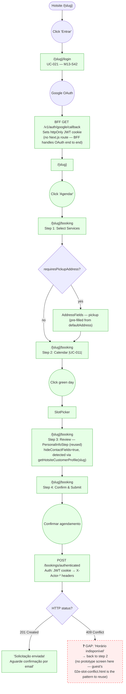

# CUSTOMER — Book a Service

**Actor(s):** CUSTOMER  
**Goal:** Submit a booking request on a tenant's hotsite as an authenticated customer  
**UCs covered:** UC-021, UC-002, UC-011  
**Status:** Reviewed

## Flow

**Note (2026-07-31 docs audit):** this flowchart previously described a generic `/auth/login` + `/api/auth/callback/google` + `/select-tenant` architecture that was never built and has since been superseded — see `customer/login.md`'s 2026-06-24 scope-change note for the canonical, shipped design (tenant-scoped `/{slug}/login`, BFF-only OAuth callback, `/select-tenant` permanently descoped). This file now matches that canonical design instead of duplicating it.

## Pages referenced

| Page / Route | Component | Story | Status |
|---|---|---|---|
| `/{slug}/login` | `LoginPage` | M13-S42 | ✅ Existing |
| BFF `GET /v1/auth/google/callback` | BFF-only, no Next.js route | M13-S42 | ✅ Existing |
| ~~`/select-tenant`~~ | ~~New page (multi-tenant picker)~~ | — | ❌ Descoped — see `customer/login.md` |
| `/[slug]/booking` Step 1 | `ServiceSelectionStep` (reuse, no changes) | M12-S07 | ✅ Existing |
| `/[slug]/booking` Step 2 | `AvailabilityCarousel` + `SlotPicker` (reuse) | M12-S07 | ✅ Existing |
| `/[slug]/booking` Step 3 | `PersonalInfoStep` (reused, `hideContactFields` prop) | M13-S14 | ✅ Existing |
| `/[slug]/booking` Step 4 | `ConfirmationStep` (reuse, no changes) | M12-S07 | ✅ Existing |

## Open questions / gaps

- [x] **UC-021 frontend** (login + OAuth callback + tenant selection) — **Resolved/shipped** via `M13-S42` (login) and `M13-S14` (auth detection in the booking flow). This journey is fully reachable end-to-end.
- [x] **Step 3 personal-info handling** — **Resolved.** No dedicated `AuthenticatedBookingReviewStep` was built. `BookingForm` reuses the existing `PersonalInfoStep` with `hideContactFields={isAuthenticatedCustomer}`, and pre-fills `pickupAddress` from `customerProfile.defaultAddress`.
- [x] **`BookingForm` branching** — **Resolved.** No `mode` prop or cookie inspection in `page.tsx`. `BookingForm` calls `getHotsiteCustomerProfile(slug)` on mount; if it resolves, the form switches to `createAuthenticatedBooking()` (`POST /bookings/authenticated`) instead of the guest path.
- [x] **Customer `defaultAddress` source** — **Resolved as Option B.** `getHotsiteCustomerProfile(slug)` (equivalent to `GET /customers/me` for the hotsite context) supplies `defaultAddress` on mount.
