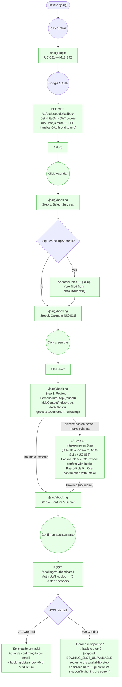

# CUSTOMER — Book a Service

**Actor(s):** CUSTOMER  
**Goal:** Submit a booking request on a tenant's hotsite as an authenticated customer  
**UCs covered:** UC-021, UC-002, UC-011, UC-061–068 (the multi-vertical steps and the intake step — ✅ built by `M23-S11a` except the duration step and the journey confirmation, which stay ❓ Gap for `M23-S11b`; on top of `M23-S29`)  
**Status:** Reviewed

## Flow

```mermaid
flowchart TD
    classDef existing fill:#e6ffe6,stroke:#3a3
    classDef gap stroke:#f00,stroke-dasharray: 5 5,fill:#fee

    Start(["Hotsite /{slug}"]) --> LoginCTA(("Click 'Entrar'"))
    LoginCTA --> LoginPage["/{slug}/login<br/>UC-021 — M13-S42"]
    LoginPage --> OAuth(("Google OAuth"))
    OAuth --> Callback["BFF GET /v1/auth/google/callback<br/>Sets httpOnly JWT cookie<br/>(no Next.js route — BFF handles OAuth end to end)"]
    Callback --> Hotsite["/{slug}"]

    Hotsite --> CTA(("Click 'Agendar'"))
    CTA --> S1["/[slug]/booking<br/>Step 1: Select Services"]

    S1 --> Pickup{"requiresPickupAddress?"}
    Pickup -- yes --> PickupField["AddressFields — pickup (pre-filled from defaultAddress)"]
    Pickup -- no --> S2
    PickupField --> S2

    S2["/[slug]/booking<br/>Step 2: Calendar |UC-011|"] --> DayClick(("Click green day"))
    DayClick --> SlotPicker["SlotPicker"]
    SlotPicker --> S3

    S3["/[slug]/booking<br/>Step 3: Review — PersonalInfoStep (reused)<br/>hideContactFields=true, detected via getHotsiteCustomerProfile(slug)"] -->|"service has an active intake schema"| Intake["✅ Step 4 — IntakeAnswersStep<br/>(03b-intake-answers, M23-S11a / UC-068)<br/>Passo 3 de 5 = 03d-review-confirm-with-intake<br/>Passo 5 de 5 = 04e-confirmation-with-intake"]
    S3 -->|"no intake schema"| S4
    Intake -->|"Próximo (no submit)"| S4

    S4["/[slug]/booking<br/>Step 4: Confirm & Submit"]
    S4 --> Submit(("Confirmar agendamento"))
    Submit --> POST["POST /bookings/authenticated<br/>Auth: JWT cookie → X-Actor-* headers"]
    POST --> SlotOk{"HTTP status?"}
    SlotOk -- 201 Created --> Done["'Solicitação enviada!<br/>Aguarde confirmação por email'<br/>+ booking-details box (04d, M23-S11a)"]
    SlotOk -- 409 Conflict --> S2Error["'Horário indisponível'<br/>→ back to step 2<br/>(shipped: BOOKING_SLOT_UNAVAILABLE routes to the availability step;<br/>no screen here — guest's 02e-slot-conflict.html is the pattern)"]

    class S1,PickupField,S2,DayClick,SlotPicker,S4,Submit,POST,Done,LoginPage,Callback,Hotsite,CTA,S3,S2Error,Intake existing
```

> **M23 extension (✅ built by `M23-S11a`; the duration step and the journey confirmation ❓ Gap for `M23-S11b`):** between Step 1 and the calendar the flow can add one resource-picker step per unit that has a customer choice (none when everything is automatic), a duration step for a variable-duration service, and — after Personal Info — the intake step; a legged service ends with the journey confirmation. The authenticated customer uses the **same screens and the same step engine as the guest** — see the flow diagram in `guest/book-a-service.md` § M23; only the auth bar and `hideContactFields` differ.

**Note (2026-07-31 docs audit):** this flowchart previously described a generic `/auth/login` + `/api/auth/callback/google` + `/select-tenant` architecture that was never built and has since been superseded — see `customer/login.md`'s 2026-06-24 scope-change note for the canonical, shipped design (tenant-scoped `/{slug}/login`, BFF-only OAuth callback, `/select-tenant` permanently descoped). This file now matches that canonical design instead of duplicating it.

## Pages referenced

| Page / Route | Component | Story | Status |
|---|---|---|---|
| `/{slug}/login` | `LoginPage` | M13-S42 | ✅ Existing |
| BFF `GET /v1/auth/google/callback` | BFF-only, no Next.js route | M13-S42 | ✅ Existing |
| ~~`/select-tenant`~~ | ~~New page (multi-tenant picker)~~ | — | ❌ Descoped — see `customer/login.md` |
| `/[slug]/booking` Step 1 | `ServiceSelectionStep` + `ServiceCard` (extended by M23-S11a: type-aware cards, APPOINTMENT-only list) | M12-S07, M23-S11a | ✅ Existing / ✅ extension |
| `/[slug]/booking` Step 2 | `AvailabilityCarousel` + `SlotPicker` (extended by M23-S11a/b: `resourceSelections`/`durationMinutes`) | M12-S07, M23-S11a | ✅ Existing / ✅ extension |
| `/[slug]/booking` Step 3 | `PersonalInfoStep` (reused, `hideContactFields` prop) | M13-S14 | ✅ Existing |
| `/[slug]/booking` Step 4 (only for intake-bearing services) | `IntakeAnswersStep` (new, shared with the guest path; Confirmation then becomes "Passo 5 de 5") | M23-S11a | ✅ Built |
| `/[slug]/booking` final step | `ConfirmationStep` (M23-S11a adds the booking-details box on success; M23-S11b the journey confirmation) | M12-S07, M23-S11a | ✅ Existing / ✅ details box (journey confirmation ❓ S11b) |
| `/[slug]/booking` resource picker step (only when the customer has a real choice — automatic resources have no screen) | `ResourcePicker` + `ResourcePickerStep`, the same components and screens as the guest path (`guest/book-a-service.md` § M23) | M23-S11a | ✅ Built |
| `/[slug]/booking` variable-duration step · journey confirmation | `VariableDurationStep` · `LegItineraryStep`, same as the guest path | M23-S11b | ❓ Gap |

## Open questions / gaps

- [x] **UC-021 frontend** (login + OAuth callback + tenant selection) — **Resolved/shipped** via `M13-S42` (login) and `M13-S14` (auth detection in the booking flow). This journey is fully reachable end-to-end.
- [x] **Step 3 personal-info handling** — **Resolved.** No dedicated `AuthenticatedBookingReviewStep` was built. `BookingForm` reuses the existing `PersonalInfoStep` with `hideContactFields={isAuthenticatedCustomer}`, and pre-fills `pickupAddress` from `customerProfile.defaultAddress`.
- [x] **`BookingForm` branching** — **Resolved.** No `mode` prop or cookie inspection in `page.tsx`. `BookingForm` calls `getHotsiteCustomerProfile(slug)` on mount; if it resolves, the form switches to `createAuthenticatedBooking()` (`POST /bookings/authenticated`) instead of the guest path.
- [x] **Customer `defaultAddress` source** — **Resolved as Option B.** `getHotsiteCustomerProfile(slug)` (equivalent to `GET /customers/me` for the hotsite context) supplies `defaultAddress` on mount.
