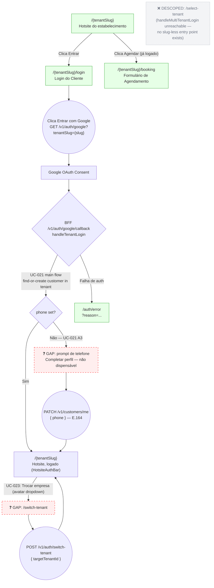

# CUSTOMER — Login (UC-021 + UC-023)

**Actor(s):** CUSTOMER  
**Goal:** Customer authenticates with Google OAuth from a tenant's hotsite and lands on that tenant's hotsite in logged-in state; customers belonging to multiple tenants can switch tenant after login  
**UCs covered:** UC-021, UC-023  
**Status:** Draft

> **Scope change (2026-06-24, `M13-S14` discovery session):** the original design included a login-time tenant-selection screen (`/select-tenant`, UC-021 Case B) for a customer logging in via a generic, tenant-agnostic entry point. No such entry point exists in this product — every login starts from a specific tenant's hotsite, which always supplies the tenant slug directly. That branch (`handleMultiTenantLogin`'s 2+-tenant case, `POST /auth/token`) is unreachable from any shipped UI and was descoped permanently — see `docs/04-USE_CASES.md` UC-021. Multi-tenant customers are still fully supported via UC-023 (switch tenant after login), which is now part of this same flow/story.

## Flow

## Pages referenced

| Page / Route | Component | Story | Status |
|---|---|---|---|
| `/{tenantSlug}` | hotsite pages | M12 | ✅ Existente |
| `/{tenantSlug}/booking` | `BookingForm` | M12-S07 | ✅ Existente |
| `/{tenantSlug}/login` | `CustomerLoginPage` | M13-S42 | ✅ Existente |
| `/auth/error` | `AuthErrorPage` | M13-S02/S42 | ✅ Existente (shared with staff) |
| ~~`/select-tenant`~~ | ~~`SelectTenantPage`~~ | — | ❌ Descoped — see scope-change note above |
| profile completion prompt | `PhoneCompletionPrompt` (inline, `[slug]/layout.tsx`) | M13-S14 | ❌ GAP |
| `/switch-tenant` | `SwitchTenantPage` | M13-S14 (folded from original M13-S30) | ❌ GAP |
| `HotsiteAuthBar` "Trocar empresa" trigger | avatar dropdown item | M13-S14 | ❌ GAP |

## BFF calls in this flow

| Call | When |
|---|---|
| `GET /v1/auth/google?tenantSlug={slug}` | Customer clicks "Entrar" from hotsite |
| `POST /internal/customers` | BFF callback (`handleTenantLogin`) — find or create customer for tenant |
| `PATCH /v1/customers/me { phone }` | UC-021 A3 — phone collection (mandatory) |
| `GET /v1/customers/tenants` | UC-023 — list other tenants customer belongs to (excludes current) |
| `POST /v1/auth/switch-tenant { targetTenantId }` | UC-023 — switch active tenant |

> Removed: `GET /v1/auth/google` (no slug), `GET /internal/customers/tenants?googleOAuthId=...`, `POST /v1/auth/token` — all only reachable via the now-descoped multi-tenant login branch.

## Open questions / gaps

- [x] **Customer area after login:** where does the customer land after successful login? — **Resolved.** Customer lands on `/{slug}` (hotsite, logged-in state); no separate customer dashboard follow-up story is needed, per `M13-DASHBOARD-FRONTEND.md`'s open-questions section.
- [x] **Phone completion placement (UC-021 A3):** is this a separate page or an inline modal/banner on the first screen after login? — **Resolved.** Implemented as a mandatory, non-dismissible inline bottom-sheet component (`M13-S14`) — no "skip" option, unlike the original draft.
- [x] **`/auth/error` shared route:** staff and customer auth failures both redirect to `/auth/error?reason=...`. — **Resolved.** One shared page (`apps/web/app/auth/error/page.tsx`), content driven by `?reason`. Already built (`M13-S02`/`M13-S42`).
- [x] **UC-023 trigger:** the "Trocar empresa" action lives somewhere in the customer area after login. Which component holds it? — **Resolved.** `HotsiteAuthBar`'s avatar dropdown (already shipped, `M13-S42`) — not `CustomerShell` (`M13-S16`, not yet built). `M13-S14` adds the item there directly.
- [x] **Generic login entry (no tenantSlug):** is there a branded entry point for a slug-less login? — **Resolved: not needed for MVP.** No current product flow requires logging in without first knowing which tenant's hotsite you're on. The BFF's slug-less branch (`handleMultiTenantLogin`) and `/select-tenant` were descoped rather than built — see `docs/04-USE_CASES.md` UC-021. Revisit only if a tenant-agnostic entry point (e.g. a unified cross-tenant customer portal) is ever scoped as its own feature.

## Prototype

Folder: `customer/prototypes/login/`

| File | Screen | UC | Story | Status |
|---|---|---|---|---|
| `index.html` | Navigation hub | — | — | ✅ Criado (pre-dates the 2026-06-24 scope change — its Caso B section is no longer being built) |
| `00-hotsite.html` | Hotsite entry (redirect → shared/hotsite.html) | — | — | ✅ Criado |
| `00-login.html` | Customer login screen (redirect → shared/login.html) | UC-021 | M13-S42 | ✅ Criado — implemented |
| `01-select-tenant.html` | Selecionar estabelecimento (Caso B) | UC-021 Caso B | — | ❌ Descoped — not being built, see scope-change note above |
| `02-phone-completion.html` | Completar perfil — solicita telefone | UC-021 A3 | M13-S14 | ✅ Criado — use this copy verbatim (see `M13-DASHBOARD-FRONTEND.md`'s `M13-S14`) |
| `01b-error.html` | Auth error (no-tenant, email-mismatch, tenant-deactivated) | UC-021 A1 err | M13-S02/S42 | ✅ Criado — implemented |
| `dev-notes.md` | Implementation handoff | — | M13-S02/S42 | ✅ Criado (predates the scope change — its `/select-tenant`/generic-entry sections are superseded by this file) |

The switch-tenant feature (UC-023) reuses `customer/prototypes/minha-conta/05-trocar-empresa.html`, not a file in this folder.
