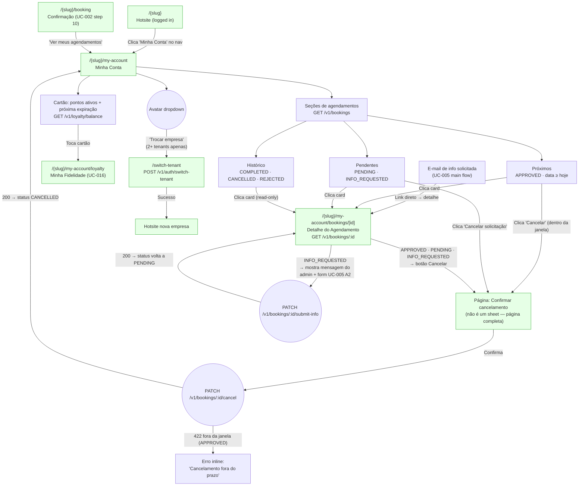
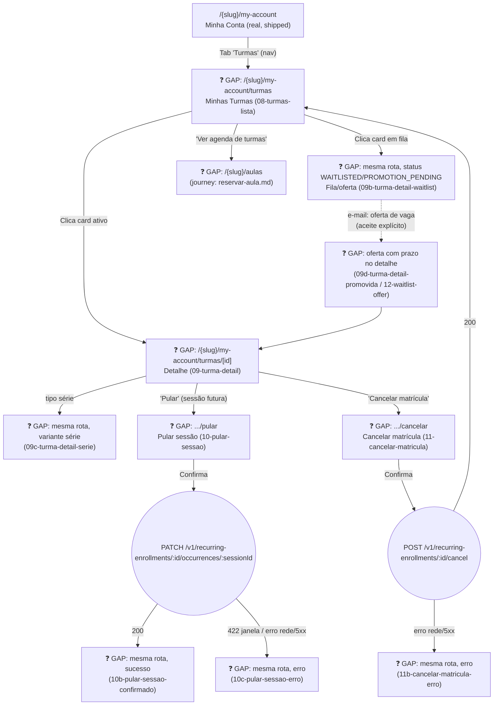

# CUSTOMER — Minha Conta (UC-006 + UC-007 + UC-016 summary)

**Actor(s):** CUSTOMER  
**Goal:** Logged-in customer views their booking history, checks loyalty balance, and cancels eligible bookings — all scoped to the current tenant  
**UCs covered:** UC-006, UC-007, UC-016 (balance summary + full breakdown), UC-023 (trigger), UC-005 A2 (authenticated customer path) — all ✅ Done · UC-070, UC-076 (❓ Gap — M21 Cluster 3, recurring private reservation management + availability alerts) · UC-089, UC-091, UC-094, UC-095, UC-102 (❓ Gap — M21 Cluster 4, class-session enrollment management)
**Status:** Base flow implemented via `M13-S27`–`M13-S30` (all ✅ Done). M21 Cluster 3/4 extensions not yet built, see the ❓ GAP sections in `dev-notes.md`.

## Flow



## Pages referenced

| Page / Route | Component | Story | Status |
|---|---|---|---|
| `/{slug}` (hotsite, logged-in nav) | `HotsiteLayout` logged-in state | M12 | ✅ Existente |
| `/{slug}/booking` (post-booking CTA) | `BookingForm` / confirmation | M12-S07 | ✅ Existente |
| `/{slug}/my-account` | `MinhaContaPage` | M13-S27 | ✅ Existente |
| `/{slug}/my-account/bookings/[id]` | `AgendamentoDetailPage` | M13-S28 | ✅ Existente |
| Cancel confirmation — full page, not a sheet | dedicated `.../bookings/[id]/cancel` page | M13-S28 | ✅ Existente |
| Info submit form (UC-005 A2) | inline section on detail page (customer auth path) | M13-S28 | ✅ Existente |
| `/{slug}/my-account/loyalty` | `MinhaFidelidadePage` | M13-S29 | ✅ Existente |
| Tenant switch modal/page (UC-023) | `TrocarEmpresaPage` — avatar dropdown trigger | M13-S30 | ✅ Existente |

## BFF calls in this flow

| Call | When | Roles |
|---|---|---|
| `GET /v1/bookings` | Minha-conta page load — full booking list | CUSTOMER (filtered to own bookings) |
| `GET /v1/loyalty/balance` | Minha-conta page load — points card | CUSTOMER |
| `GET /v1/loyalty/entries` | Fidelidade page — earning history (paginated) | CUSTOMER |
| `GET /v1/loyalty/redemptions` | Fidelidade page — redemption history (paginated) | CUSTOMER |
| `POST /v1/auth/switch-tenant { targetTenantId }` | UC-023 — customer selects new tenant | CUSTOMER |
| `GET /v1/bookings/:id` | Detail page load | CUSTOMER (ownership enforced) |
| `PATCH /v1/bookings/:id/cancel` | Customer confirms cancel — BFF routes to `/cancel-customer` | CUSTOMER |
| `PATCH /v1/bookings/:id/submit-info` | Customer submits info on INFO_REQUESTED booking (UC-005 A2) | CUSTOMER |

## Section logic (UC-006 step 1)

| Section | Statuses shown | Date filter | Action |
|---|---|---|---|
| **Próximos** | APPROVED | `scheduledAt ≥ today` | Cancel button (if within window) |
| **Pendentes** | PENDING, INFO_REQUESTED | any | "Cancelar solicitação" always shown |
| **Histórico** | COMPLETED, CANCELLED, REJECTED | any | Read-only; no action |

Cancel button visibility for **Próximos** (APPROVED): hidden with note when `scheduledAt − now() < tenants.settings.booking.cancellation_window_hours` (UC-006 A2).

## Open questions / gaps

- [ ] **"Total washes completed" + "Most recently completed service" (UC-006 step 6):** `GET /v1/loyalty/balance` returns only `{ currentPoints, nextExpiryDate, nextExpiryPoints }`. Neither "total washes" nor "last service" is available from this endpoint. Options: (a) add fields to balance endpoint, (b) derive from `GET /v1/loyalty/entries` pagination `total` + first entry's `serviceName`, (c) drop from MVP minha-conta. Decide before `M13-S27` starts.
- [ ] **`CustomerBookingListResponse` DTO missing from `packages/types/src/`:** only a backend-internal `BookingListItem` exists. Add to `packages/types/` in `M13-S27`.
- [ ] **UC-005 A2 scope:** should the info submission form live in this journey's detail page or a separate journey? Recommendation: include it inline in `M13-S28` (detail page) since the customer reaches it from "My Bookings" — it's not a separate navigation destination.
- [x] **Post-cancel destination:** after successful cancel from the detail page, navigate back to `/{slug}/my-account` list (recommended) or show inline CANCELLED state on the detail page and let the customer navigate back manually? — **Resolved.** Redirects to the my-account list, implemented in `M13-S28`.
- [ ] **Empty state CTA (UC-006 A1):** when customer has no bookings, what does the CTA say? "Fazer um agendamento" → `/{slug}/booking`?
- [ ] **`GET /v1/bookings` query params for customer:** the existing endpoint accepts `status` filter. Should the frontend call it once (all statuses) and split client-side, or call it three times (one per section)? Single call + client split is simpler.
- [x] **Pagination:** UC-006 doesn't specify pagination behaviour. The backend supports `limit`/`offset`. — **Resolved.** `limit=50`, no infinite scroll, implemented in `M13-S27`.
- [x] **Loyalty conversion-rate display (`04-fidelidade.html` balance card):** shows a points→currency conversion rate ("10 pts = R$ 1,00 · Valor total: R$ 12,00"), gated on `points_per_currency_unit > 0`. — **Resolved/shipped.** The real `LoyaltyPage.tsx` renders this conversion row exactly when `balance.conversionRate > 0`, matching the prototype. Not cut from MVP.

## Prototype

Folder: `customer/prototypes/minha-conta/`

| File | Screen | UC | Story | Status |
|---|---|---|---|---|
| `index.html` | Navigation hub | — | — | ✅ Criado |
| `00-hotsite-logged-in.html` | Hotsite logged-in state (entry point) | — | — | ✅ Criado |
| `01-minha-conta.html` | Minha Conta — booking list + loyalty strip (clickable) | UC-006 | M13-S27 | ✅ Criado |
| `01b-minha-conta-empty.html` | Minha Conta — estado vazio (nenhum agendamento) | UC-006 A1 | M13-S27 | ✅ Criado |
| `02-agendamento-detail.html` | Detalhe do Agendamento (APPROVED/PENDING) | UC-006 step 5 | M13-S28 | ✅ Criado |
| `02b-agendamento-info-requested.html` | Detalhe — INFO_REQUESTED + form de resposta | UC-005 A2 | M13-S28 | ✅ Criado |
| `02c-agendamento-historico.html` | Detalhe — COMPLETED (read-only, sem ações) | UC-006 step 5 | M13-S28 | ✅ Criado |
| `02d-info-sent.html` | Detalhe — após envio de resposta (booking volta a PENDING) | UC-005 A2 | M13-S28 | ✅ Criado |
| `02e-submit-error.html` | Detalhe — erro ao enviar resposta (rede/5xx no PATCH submit-info) | UC-005 A2 | M13-S28 | ✅ Criado |
| `03-cancel-confirm.html` | Sheet de confirmação de cancelamento | UC-007 | M13-S28 | ✅ Criado |
| `03b-cancel-error.html` | Erro — cancelamento fora da janela de prazo | UC-007 A1 | M13-S28 | ✅ Criado |
| `04-fidelidade.html` | Minha Fidelidade — saldo + tabs ganhos/resgates | UC-016 | M13-S29 | ✅ Criado |
| `04b-fidelidade-empty.html` | Fidelidade — estado vazio (0 pontos) | UC-016 | M13-S29 | ✅ Criado |
| `05-trocar-empresa.html` | Trocar empresa — seleção de tenant (UC-023 trigger) | UC-023 | M13-S30 | ✅ Criado |
| `06-reserva-recorrente.html` | Gerenciar reserva recorrente (skip/reagendar/pausar/encerrar) | UC-070 | — | ❓ Gap (M21 Cluster 3) |
| `06b-reserva-recorrente-erro.html` | Erro — conflito de padrão futuro | UC-070 A1 | — | ❓ Gap (M21 Cluster 3) |
| `06c-recorrente-em-analise.html` | Solicitação recorrente pendente de aprovação | UC-070 (MANUAL_APPROVAL branch) | — | ❓ Gap (M21 Cluster 3) |
| `07-availability-alert.html` | Criar/gerenciar aviso de disponibilidade | UC-072, UC-076 | — | ❓ Gap (M21 Cluster 3) |
| `08-turmas-lista.html` | Minhas Turmas — lista de matrículas | UC-089/091/094/095 | — | ❓ Gap (M21 Cluster 4) |
| `09-turma-detail.html` | Detalhe da matrícula (turma fixa) | UC-094 | — | ❓ Gap (M21 Cluster 4) |
| `09b-turma-detail-waitlist.html` | Detalhe — status `WAITLISTED`/`PROMOTION_PENDING` | UC-090/091 | — | ❓ Gap (M21 Cluster 4) |
| `09c-turma-detail-serie.html` | Detalhe — variante série com fim | UC-094 | — | ❓ Gap (M21 Cluster 4) |
| `09d-turma-detail-promovida.html` | Detalhe — banner pós-promoção (prazo da oferta) | UC-091 | — | ❓ Gap (M21 Cluster 4) |
| `10-pular-sessao.html` | Pular sessão — formulário | UC-094 | — | ❓ Gap (M21 Cluster 4) |
| `10b-pular-sessao-confirmado.html` | Pular sessão — sucesso | UC-094 | — | ❓ Gap (M21 Cluster 4) |
| `10c-pular-sessao-erro.html` | Pular sessão — erro (janela/rede) | UC-094 A3 | — | ❓ Gap (M21 Cluster 4) |
| `11-cancelar-matricula.html` | Cancelar matrícula — confirmação | UC-095 | — | ❓ Gap (M21 Cluster 4) |
| `11b-cancelar-matricula-erro.html` | Cancelar matrícula — erro | UC-095 | — | ❓ Gap (M21 Cluster 4) |
| `12-waitlist-offer.html` | Aceitar/recusar oferta de vaga | UC-091 | — | ❓ Gap (M21 Cluster 4) |
| `12b-waitlist-confirmed.html` | Oferta aceita — confirmação | UC-091 | — | ❓ Gap (M21 Cluster 4) |
| `dev-notes.md` | Implementation handoff | — | M13-S27–M13-S30 | ✅ Criado |

## M21 — Multi-Vertical Scheduling, Cluster 4 extension (❓ Gap, not yet built)

> Promoted from `docs/discovery/multivertical-booking/minha-conta-turmas-journey.md` via `/discovery-to-milestone` — that file already reached implementation-grade rigor during discovery UX work, so this carries its content forward with canonical UC numbers substituted for `CAND-XX`. "Minha Conta" gains a third section — Turmas — alongside the existing Agendamentos and Fidelidade. Full implementation-handoff detail lives in `dev-notes.md`'s own ❓ GAP section — not duplicated here.



**BFF calls (new endpoints — see `docs/14-API_CONTRACTS.md` § Classes & Sessions):**
```
GET /v1/enrollments?status=CONFIRMED,WAITLISTED,PROMOTION_PENDING   -- Minhas Turmas list (composed from RecurringEnrollment + ClassSessionBooking)
GET /v1/enrollments/:id                                              -- detail, ownership enforced (404 if customerId != JWT.sub)
PATCH /v1/recurring-enrollments/:id/occurrences/:sessionId            -- skip (UC-094)
POST /v1/recurring-enrollments/:id/occurrences/:sessionId/reschedule  -- reposição (UC-102)
POST /v1/recurring-enrollments/:id/cancel                             -- UC-095
POST /v1/class-session-bookings/:id/waitlist-offer/accept|decline     -- UC-091's offer response
```

**Open questions / gaps:**
- [ ] No story exists yet — needs `/story-discovery` once the M21 milestone file is drafted.
- [x] **Waitlist promotion:** explicit `PROMOTION_PENDING` offer with accept/decline/expiry — resolved, see `docs/02-DOMAIN_MODEL.md` § `ClassSessionBooking`.
- [x] **Skip-session minimum-notice window:** dedicated `classSkipWindowHours`, separate from `classCancellationWindowHours` — resolved, UC-094 A3, `docs/21-TENANTS_SETTINGS_SCHEMA.md`.
- [ ] Reposição (UC-102) needs its own prototype pass beyond `10-pular-sessao.html`'s existing "reagendar" link — the discovery's own `customer-04d-reagendada.html` screen was discovery-stage only, not relocated at implementation-grade rigor; the implementing story should design this properly rather than treating that screen as a shortcut.
- [x] **Promotion offer deadline:** returned by the backend as `offerExpiresAt`; the client does not derive offer state from a local 24-hour calculation.
- [x] **The canonical persistence/domain names are `Service`, `ClassScheduleTemplate`, `ClassSessionBooking`, and `RecurringEnrollment`.** `ClassType`/`Enrollment` are BFF read-model labels only, never aggregates.

## M21 — Multi-Vertical Scheduling, Cluster 3 extension (❓ Gap, not yet built)

> Promoted from `docs/discovery/multivertical-booking/`. "Minha Conta" gains two new sections: a standing recurring-reservation manager (UC-070) and an availability-alerts manager (UC-072/076). Full implementation-handoff detail lives in `dev-notes.md`'s own ❓ GAP section — not duplicated here.

- [ ] No story exists yet — needs `/story-discovery` once the M21 milestone file is drafted.
- [ ] Exact nav placement (a new top-level tab vs. folded into the existing Agendamentos list) is a UI decision for the implementing story — mirrors the same open question `plan/journey/staff/prototypes/multivertical-booking` extensions left for their own nav placement.
