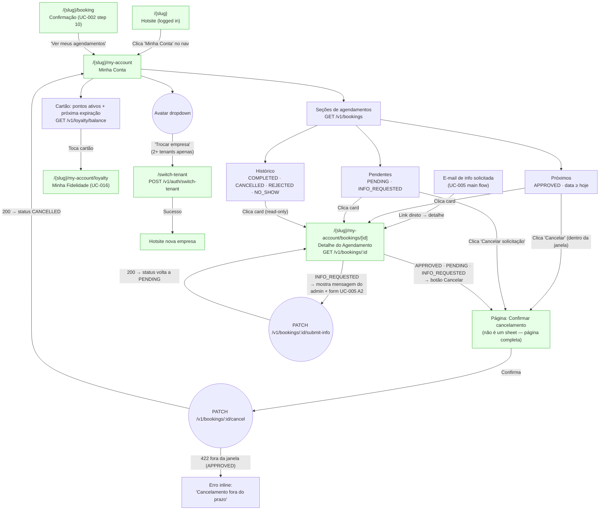
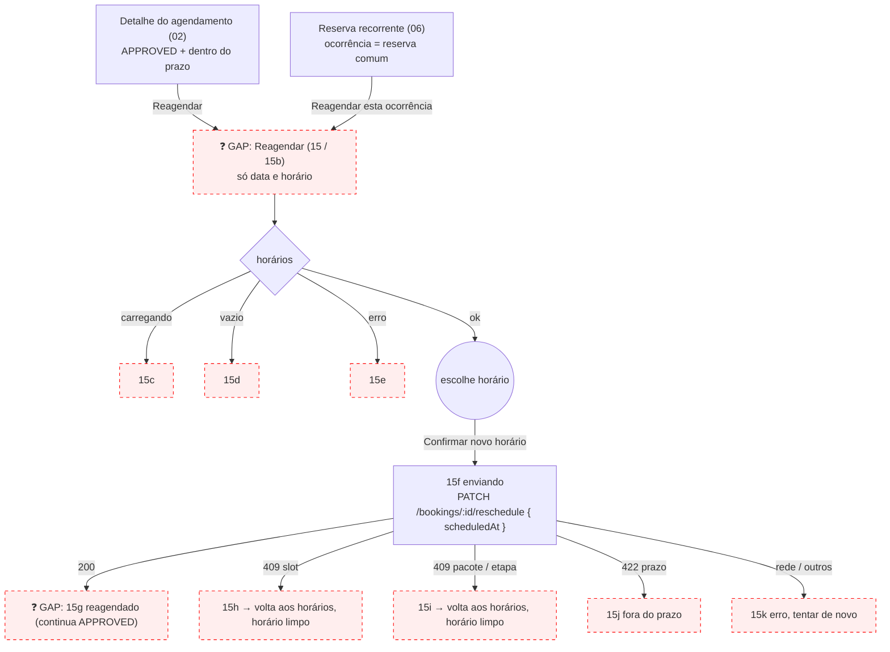
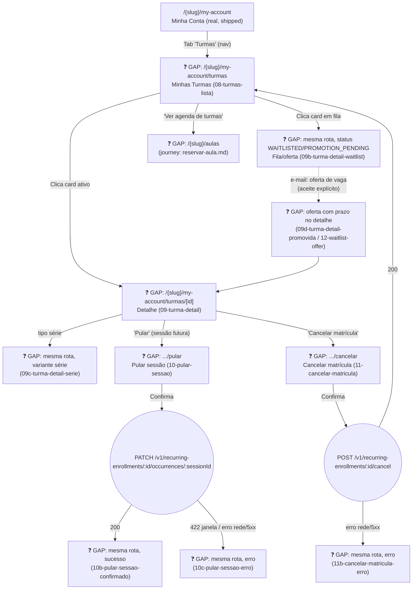
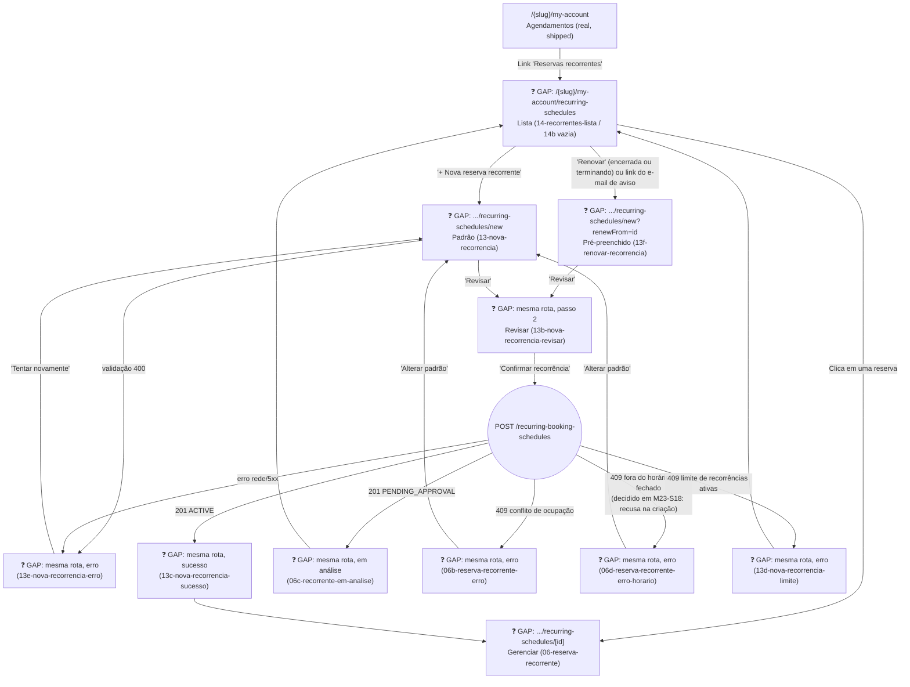

# CUSTOMER — Minha Conta (UC-006 + UC-007 + UC-016 summary)

**Actor(s):** CUSTOMER  
**Goal:** Logged-in customer views their booking history, checks loyalty balance, and cancels eligible bookings — all scoped to the current tenant  
**UCs covered:** UC-006, UC-007, UC-016 (balance summary + full breakdown), UC-023 (trigger), UC-005 A2 (authenticated customer path) — all ✅ Done · UC-069 (❓ Gap — M23 Cluster 3, customer reschedule, `M23-S30`) · UC-070, UC-076 (❓ Gap — M23 Cluster 3, recurring private reservation creation and management + availability alerts) · UC-089, UC-091, UC-094, UC-095, UC-102 (❓ Gap — M24 Cluster 4, class-session enrollment management)
**Status:** Base flow implemented via `M13-S27`–`M13-S30` (all ✅ Done). M23 Cluster 3 and M24 Cluster 4 extensions not yet built, see the ❓ GAP sections in `dev-notes.md`.

## Flow


```mermaid
flowchart TD
    classDef existing fill:#e6ffe6,stroke:#3a3
    classDef gap stroke:#f00,stroke-dasharray: 5 5,fill:#fee

    Hotsite["/{slug}<br/>Hotsite (logged in)"] -->|"Clica 'Minha Conta' no nav"| MinhaConta
    BookingConfirm["/{slug}/booking<br/>Confirmação (UC-002 step 10)"] -->|"'Ver meus agendamentos'"| MinhaConta
    InfoEmail["E-mail de info solicitada<br/>(UC-005 main flow)"] -->|"Link direto → detalhe"| Detail

    MinhaConta["/{slug}/my-account<br/>Minha Conta"] --> LoyaltySummary["Cartão: pontos ativos + próxima expiração<br/>GET /v1/loyalty/balance"]
    LoyaltySummary -->|"Toca cartão"| LoyaltyFull["/{slug}/my-account/loyalty<br/>Minha Fidelidade (UC-016)"]
    MinhaConta --> AvatarMenu(("Avatar dropdown"))
    AvatarMenu -->|"'Trocar empresa'<br/>(2+ tenants apenas)"| SwitchTenant["/switch-tenant<br/>POST /v1/auth/switch-tenant"]
    SwitchTenant -->|"Sucesso"| NewTenant["Hotsite nova empresa"]
    MinhaConta --> BookingList["Seções de agendamentos<br/>GET /v1/bookings"]

    BookingList --> Upcoming["Próximos<br/>APPROVED · data ≥ hoje"]
    BookingList --> Pending["Pendentes<br/>PENDING · INFO_REQUESTED"]
    BookingList --> Past["Histórico<br/>COMPLETED · CANCELLED · REJECTED · NO_SHOW"]

    Upcoming -->|"Clica card"| Detail
    Pending -->|"Clica card"| Detail
    Past -->|"Clica card (read-only)"| Detail

    Upcoming -->|"Clica 'Cancelar' (dentro da janela)"| CancelPage["Página: Confirmar cancelamento<br/>(não é um sheet — página completa)"]
    Pending -->|"Clica 'Cancelar solicitação'"| CancelPage

    Detail["/{slug}/my-account/bookings/[id]<br/>Detalhe do Agendamento<br/>GET /v1/bookings/:id"] -->|"APPROVED · PENDING · INFO_REQUESTED<br/>→ botão Cancelar"| CancelPage

    Detail -->|"INFO_REQUESTED<br/>→ mostra mensagem do admin + form UC-005 A2"| InfoSubmit(("PATCH /v1/bookings/:id/submit-info"))
    InfoSubmit -->|"200 → status volta a PENDING"| Detail

    CancelPage -->|"Confirma"| CancelCall(("PATCH /v1/bookings/:id/cancel"))
    CancelCall -->|"200 → status CANCELLED"| MinhaConta
    CancelCall -->|"422 fora da janela (APPROVED)"| CancelError["Erro inline:<br/>'Cancelamento fora do prazo'"]

    class Hotsite,BookingConfirm,MinhaConta,Detail,CancelPage,LoyaltyFull,SwitchTenant,NewTenant existing
```

## Pages referenced

| Page / Route | Component | Story | Status |
|---|---|---|---|
| `/{slug}` (hotsite, logged-in nav) | `HotsiteLayout` logged-in state | M12 | ✅ Existente |
| `/{slug}/booking` (post-booking CTA) | `BookingForm` / confirmation | M12-S07 | ✅ Existente |
| `/{slug}/my-account` | `MinhaContaPage` | M13-S27 | ✅ Existente |
| `/{slug}/my-account/bookings/[id]` | `AgendamentoDetailPage` | M13-S28 | ✅ Existente |
| Cancel confirmation — full page, not a sheet | dedicated `.../bookings/[id]/cancel` page | M13-S28 | ✅ Existente |
| Info submit form (UC-005 A2) | inline section on detail page (customer auth path) | M13-S28 | ✅ Existente |
| `/{slug}/my-account/loyalty` | `MinhaFidelidadePage` | M13-S29 | ✅ Existente |
| Tenant switch modal/page (UC-023) | `TrocarEmpresaPage` — avatar dropdown trigger | M13-S30 | ✅ Existente |

## BFF calls in this flow

| Call | When | Roles |
|---|---|---|
| `GET /v1/bookings` | Minha-conta page load — full booking list | CUSTOMER (filtered to own bookings) |
| `GET /v1/loyalty/balance` | Minha-conta page load — points card | CUSTOMER |
| `GET /v1/loyalty/entries` | Fidelidade page — earning history (paginated) | CUSTOMER |
| `GET /v1/loyalty/redemptions` | Fidelidade page — redemption history (paginated) | CUSTOMER |
| `POST /v1/auth/switch-tenant { targetTenantId }` | UC-023 — customer selects new tenant | CUSTOMER |
| `GET /v1/bookings/:id` | Detail page load | CUSTOMER (ownership enforced) |
| `PATCH /v1/bookings/:id/cancel` | Customer confirms cancel — BFF routes to `/cancel-customer` | CUSTOMER |
| `PATCH /v1/bookings/:id/submit-info` | Customer submits info on INFO_REQUESTED booking (UC-005 A2) | CUSTOMER |

## Section logic (UC-006 step 1)

| Section | Statuses shown | Date filter | Action |
|---|---|---|---|
| **Próximos** | APPROVED | `scheduledAt ≥ today` | Cancel button (if within window) |
| **Pendentes** | PENDING, INFO_REQUESTED | any | "Cancelar solicitação" always shown |
| **Histórico** | COMPLETED, CANCELLED, REJECTED, NO_SHOW (UC-074, M23) | any | Read-only; no action |

Cancel button visibility for **Próximos** (APPROVED): hidden with note when `scheduledAt − now() < tenants.settings.booking.cancellation_window_hours` (UC-006 A2).

## Open questions / gaps

- [ ] **"Total washes completed" + "Most recently completed service" (UC-006 step 6):** `GET /v1/loyalty/balance` returns only `{ currentPoints, nextExpiryDate, nextExpiryPoints }`. Neither "total washes" nor "last service" is available from this endpoint. Options: (a) add fields to balance endpoint, (b) derive from `GET /v1/loyalty/entries` pagination `total` + first entry's `serviceName`, (c) drop from MVP minha-conta. Decide before `M13-S27` starts.
- [ ] **`CustomerBookingListResponse` DTO missing from `packages/types/src/`:** only a backend-internal `BookingListItem` exists. Add to `packages/types/` in `M13-S27`.
- [ ] **UC-005 A2 scope:** should the info submission form live in this journey's detail page or a separate journey? Recommendation: include it inline in `M13-S28` (detail page) since the customer reaches it from "My Bookings" — it's not a separate navigation destination.
- [x] **Post-cancel destination:** after successful cancel from the detail page, navigate back to `/{slug}/my-account` list (recommended) or show inline CANCELLED state on the detail page and let the customer navigate back manually? — **Resolved.** Redirects to the my-account list, implemented in `M13-S28`.
- [ ] **Empty state CTA (UC-006 A1):** when customer has no bookings, what does the CTA say? "Fazer um agendamento" → `/{slug}/booking`?
- [ ] **`GET /v1/bookings` query params for customer:** the existing endpoint accepts `status` filter. Should the frontend call it once (all statuses) and split client-side, or call it three times (one per section)? Single call + client split is simpler.
- [x] **Pagination:** UC-006 doesn't specify pagination behaviour. The backend supports `limit`/`offset`. — **Resolved.** `limit=50`, no infinite scroll, implemented in `M13-S27`.
- [x] **Loyalty conversion-rate display (`04-fidelidade.html` balance card):** shows a points→currency conversion rate ("10 pts = R$ 1,00 · Valor total: R$ 12,00"), gated on `points_per_currency_unit > 0`. — **Resolved/shipped.** The real `LoyaltyPage.tsx` renders this conversion row exactly when `balance.conversionRate > 0`, matching the prototype. Not cut from MVP.

## Prototype

Folder: `customer/prototypes/minha-conta/`

| File | Screen | UC | Story | Status |
|---|---|---|---|---|
| `index.html` | Navigation hub | — | — | ✅ Criado |
| `00-hotsite-logged-in.html` | Hotsite logged-in state (entry point) | — | — | ✅ Criado |
| `01-minha-conta.html` | Minha Conta — booking list + loyalty strip (clickable) | UC-006 | M13-S27 | ✅ Criado |
| `01b-minha-conta-empty.html` | Minha Conta — estado vazio (nenhum agendamento) | UC-006 A1 | M13-S27 | ✅ Criado |
| `02-agendamento-detail.html` | Detalhe do Agendamento (APPROVED/PENDING) | UC-006 step 5 | M13-S28 | ✅ Criado |
| `02b-agendamento-info-requested.html` | Detalhe — INFO_REQUESTED + form de resposta | UC-005 A2 | M13-S28 | ✅ Criado |
| `02c-agendamento-historico.html` | Detalhe — COMPLETED (read-only, sem ações) | UC-006 step 5 | M13-S28 | ✅ Criado |
| `02f-agendamento-nao-compareceu.html` | Detalhe — NO_SHOW (read-only, sem ações; sem motivo interno; orienta a contatar o estabelecimento) | UC-006 step 5 · UC-074 | M23-S09 (status display) · M23-S27 | ❓ Gap (M23 Cluster 3) |
| `02d-info-sent.html` | Detalhe — após envio de resposta (booking volta a PENDING) | UC-005 A2 | M13-S28 | ✅ Criado |
| `02e-submit-error.html` | Detalhe — erro ao enviar resposta (rede/5xx no PATCH submit-info) | UC-005 A2 | M13-S28 | ✅ Criado |
| `03-cancel-confirm.html` | Sheet de confirmação de cancelamento | UC-007 | M13-S28 | ✅ Criado |
| `03b-cancel-error.html` | Erro — cancelamento fora da janela de prazo | UC-007 A1 | M13-S28 | ✅ Criado |
| `04-fidelidade.html` | Minha Fidelidade — saldo + tabs ganhos/resgates | UC-016 | M13-S29 | ✅ Criado |
| `04b-fidelidade-empty.html` | Fidelidade — estado vazio (0 pontos) | UC-016 | M13-S29 | ✅ Criado |
| `05-trocar-empresa.html` | Trocar empresa — seleção de tenant (UC-023 trigger) | UC-023 | M13-S30 | ✅ Criado |
| `06-reserva-recorrente.html` | Gerenciar reserva recorrente (pular/reagendar/encerrar — sem pausar) | UC-070 A2 | M23-S12 | ❓ Gap (M23 Cluster 3) |
| `06e-pular-fora-do-prazo.html` | Erro — pular uma ocorrência fora do prazo de cancelamento (decidido em M23-S08: a ocorrência é uma reserva) | UC-070 A2 | M23-S12 | ❓ Gap (M23 Cluster 3) |
| `06f-reagendar-fora-do-prazo.html` | Erro — reagendar uma ocorrência fora do prazo de reagendamento | UC-070 A2 | M23-S12 | ❓ Gap (M23 Cluster 3) |
| `15-reagendar.html` | Reagendar: escolher o novo horário (data e hora; duração e escolhas mantidas) | UC-069 | M23-S30 | ❓ Gap (M23 Cluster 3) |
| `15b-reagendar-escolhas-mantidas.html` | Reagendar: pacote / jornada / profissional escolhido (escolhas mostradas só para leitura) | UC-069 A2 | M23-S30 | ❓ Gap (M23 Cluster 3) |
| `15c-carregando-horarios.html` | Carregando horários | UC-069 | M23-S30 | ❓ Gap (M23 Cluster 3) |
| `15d-sem-horarios.html` | Sem horários disponíveis | UC-069 | M23-S30 | ❓ Gap (M23 Cluster 3) |
| `15e-erro-horarios.html` | Erro ao carregar horários | UC-069 | M23-S30 | ❓ Gap (M23 Cluster 3) |
| `15f-enviando.html` | Enviando (Reagendando…) | UC-069 | M23-S30 | ❓ Gap (M23 Cluster 3) |
| `15g-reagendado.html` | Reagendado (continua aprovado) | UC-069 | M23-S30 | ❓ Gap (M23 Cluster 3) |
| `15h-conflito-horario.html` | Erro: horário indisponível (409) | UC-069 A1 | M23-S30 | ❓ Gap (M23 Cluster 3) |
| `15i-conflito-pacote-jornada.html` | Erro: parte do pacote / etapa indisponível (409) | UC-069 A2 | M23-S30 | ❓ Gap (M23 Cluster 3) |
| `15j-fora-do-prazo.html` | Erro: reagendamento fora do prazo (422) | UC-069 | M23-S30 | ❓ Gap (M23 Cluster 3) |
| `15k-erro-envio.html` | Erro ao enviar (rede / outros) | UC-069 | M23-S30 | ❓ Gap (M23 Cluster 3) |
| `06b-reserva-recorrente-erro.html` | Erro — conflito de padrão futuro, com as ocorrências em conflito | UC-070 A1 | M23-S17 | ❓ Gap (M23 Cluster 3) |
| `06c-recorrente-em-analise.html` | Solicitação recorrente pendente de aprovação | UC-070 (MANUAL_APPROVAL branch) | M23-S17 | ❓ Gap (M23 Cluster 3) |
| `06d-reserva-recorrente-erro-horario.html` | Erro — ocorrências fora do horário ou em dia fechado (decidido em M23-S18: recusa na criação; a API já devolve a lista) | UC-070 A1 | M23-S17 (constrói a tela) | ❓ Gap (M23 Cluster 3) |
| `07-availability-alert.html` | Meus avisos — lista e cancelar aviso de disponibilidade (sem editar por enquanto) (sem botão de criar: a criação sempre parte do fluxo de agendamento); entrada: link "Meus avisos" em Agendamentos (`01`) | UC-076 | M23-S12 | ❓ Gap (M23 Cluster 3) |
| `07b-avisos-vazio.html` | Meus avisos — vazio (orienta a usar "Avise-me quando abrir" ao agendar) | UC-076 | M23-S12 | ❓ Gap (M23 Cluster 3) |
| `07c-avisos-carregando.html` | Meus avisos — carregando | UC-076 | M23-S12 | ❓ Gap (M23 Cluster 3) |
| `07d-avisos-erro.html` | Meus avisos — erro ao carregar, com "Tentar novamente" | UC-076 | M23-S12 | ❓ Gap (M23 Cluster 3) |
| `07e-aviso-nao-editavel.html` | Aviso já notificado/expirado — cancelar recusado (409 `BOOKING_ALERT_NOT_EDITABLE`) | UC-076 A1 | M23-S12 | ❓ Gap (M23 Cluster 3) |
| `13-nova-recorrencia.html` | Nova reserva recorrente — padrão (serviço, recurso, dias, horário, período) | UC-070 | M23-S17 | ❓ Gap (M23 Cluster 3) |
| `13b-nova-recorrencia-revisar.html` | Nova reserva recorrente — revisar e confirmar | UC-070 | M23-S17 | ❓ Gap (M23 Cluster 3) |
| `13c-nova-recorrencia-sucesso.html` | Recorrência criada (ACTIVE) | UC-070 | M23-S17 | ❓ Gap (M23 Cluster 3) |
| `13d-nova-recorrencia-limite.html` | Erro — limite de recorrências ativas (409 A4) | UC-070 A4 | M23-S17 | ❓ Gap (M23 Cluster 3) |
| `13f-renovar-recorrencia.html` | Renovar — formulário pré-preenchido (A) e reserva não encontrada (B) | UC-070 | M23-S22 | ❓ Gap (M23 Cluster 3) |
| `13e-nova-recorrencia-erro.html` | Erro — validação do padrão e falha de envio | UC-070 | M23-S17 | ❓ Gap (M23 Cluster 3) |
| `14-recorrentes-lista.html` | Minhas reservas recorrentes — lista com status, prazo de cada uma e "Renovar" | UC-070 | M23-S12 (S17 adiciona o botão de criar) | ❓ Gap (M23 Cluster 3) |
| `14b-recorrentes-lista-vazia.html` | Minhas reservas recorrentes — estado vazio | UC-070 | M23-S12 (S17 adiciona o botão de criar) | ❓ Gap (M23 Cluster 3) |
| `08-turmas-lista.html` | Minhas Turmas — lista de matrículas | UC-089/091/094/095 | — | ❓ Gap (M24 Cluster 4) |
| `09-turma-detail.html` | Detalhe da matrícula (turma fixa) | UC-094 | — | ❓ Gap (M24 Cluster 4) |
| `09b-turma-detail-waitlist.html` | Detalhe — status `WAITLISTED`/`PROMOTION_PENDING` | UC-090/091 | — | ❓ Gap (M24 Cluster 4) |
| `09c-turma-detail-serie.html` | Detalhe — variante série com fim | UC-094 | — | ❓ Gap (M24 Cluster 4) |
| `09d-turma-detail-promovida.html` | Detalhe — banner pós-promoção (prazo da oferta) | UC-091 | — | ❓ Gap (M24 Cluster 4) |
| `10-pular-sessao.html` | Pular sessão — formulário | UC-094 | — | ❓ Gap (M24 Cluster 4) |
| `10b-pular-sessao-confirmado.html` | Pular sessão — sucesso | UC-094 | — | ❓ Gap (M24 Cluster 4) |
| `10c-pular-sessao-erro.html` | Pular sessão — erro (janela/rede) | UC-094 A3 | — | ❓ Gap (M24 Cluster 4) |
| `11-cancelar-matricula.html` | Cancelar matrícula — confirmação | UC-095 | — | ❓ Gap (M24 Cluster 4) |
| `11b-cancelar-matricula-erro.html` | Cancelar matrícula — erro | UC-095 | — | ❓ Gap (M24 Cluster 4) |
| `12-waitlist-offer.html` | Aceitar/recusar oferta de vaga | UC-091 | — | ❓ Gap (M24 Cluster 4) |
| `12b-waitlist-confirmed.html` | Oferta aceita — confirmação | UC-091 | — | ❓ Gap (M24 Cluster 4) |
| `dev-notes.md` | Implementation handoff | — | M13-S27–M13-S30 | ✅ Criado |

## M23 — Reagendar uma reserva (UC-069, ❓ Gap, story `M23-S30`)

> The customer area had no reschedule screen. Decisions (2026-10-03): the customer changes **only the date and time** — the chosen staff/room/equipment and the duration are **kept** (shown read-only for a bundle/journey), so there is no picker, no duration control and no quote preview; only an `APPROVED` booking inside the reschedule window can be rescheduled, and it stays `APPROVED`. Full handoff detail in `prototypes/minha-conta/dev-notes.md` § Reagendar.


```mermaid
flowchart TD
    classDef gap stroke:#f00,stroke-dasharray: 5 5,fill:#fee

    Detail["Detalhe do agendamento (02)<br/>APPROVED + dentro do prazo"] -->|"Reagendar"| Page
    Occ["Reserva recorrente (06)<br/>ocorrência = reserva comum"] -->|"Reagendar esta ocorrência"| Page
    Page["❓ GAP: Reagendar (15 / 15b)<br/>só data e horário"] --> Load{"horários"}
    Load -->|"carregando"| L["15c"]
    Load -->|"vazio"| E["15d"]
    Load -->|"erro"| F["15e"]
    Load -->|"ok"| Pick(("escolhe horário"))
    Pick -->|"Confirmar novo horário"| Sub["15f enviando<br/>PATCH /bookings/:id/reschedule { scheduledAt }"]
    Sub -->|"200"| Ok["❓ GAP: 15g reagendado (continua APPROVED)"]
    Sub -->|"409 slot"| C1["15h → volta aos horários, horário limpo"]
    Sub -->|"409 pacote / etapa"| C2["15i → volta aos horários, horário limpo"]
    Sub -->|"422 prazo"| W["15j fora do prazo"]
    Sub -->|"rede / outros"| X["15k erro, tentar de novo"]
    class Page,Ok,C1,C2,W,X,L,E,F gap
```

**BFF call:** `PATCH /bookings/:id/reschedule` — the BFF dispatches the `CUSTOMER` role to `reschedule-customer`; body `{ scheduledAt }` only. `GET /schedule/availability` for the slot list (with the kept picks and duration pinned — see the open questions).

**Open questions (carried into `/story-discovery M23-S30`):** the customer booking read must expose the kept picks (not returned today); the availability read for a reschedule must pin them and ideally ignore the booking's own window; confirm the `BookingRescheduled` email.

## M24 — Multi-Vertical Scheduling, Cluster 4 extension (❓ Gap, not yet built)

> Promoted from `docs/discovery/multivertical-booking/prototype/minha-conta-turmas-journey.md` via `/discovery-to-milestone` — that file already reached implementation-grade rigor during discovery UX work, so this carries its content forward with canonical UC numbers substituted for `CAND-XX`. "Minha Conta" gains a third section — Turmas — alongside the existing Agendamentos and Fidelidade. Full implementation-handoff detail lives in `dev-notes.md`'s own ❓ GAP section — not duplicated here.


```mermaid
flowchart TD
    classDef gap stroke:#f00,stroke-dasharray: 5 5,fill:#fee

    MinhaConta["/{slug}/my-account<br/>Minha Conta (real, shipped)"] -->|"Tab 'Turmas' (nav)"| MinhasTurmas["❓ GAP: /{slug}/my-account/turmas<br/>Minhas Turmas (08-turmas-lista)"]
    MinhasTurmas -->|"Clica card ativo"| TurmaDetail
    MinhasTurmas -->|"Clica card em fila"| TurmaWaitlist["❓ GAP: mesma rota, status WAITLISTED/PROMOTION_PENDING<br/>Fila/oferta (09b-turma-detail-waitlist)"]
    MinhasTurmas -->|"'Ver agenda de turmas'"| Catalog["❓ GAP: /{slug}/aulas<br/>(journey: reservar-aula.md)"]

    TurmaDetail["❓ GAP: /{slug}/my-account/turmas/[id]<br/>Detalhe (09-turma-detail)"] -->|"tipo série"| TurmaSerieDetail["❓ GAP: mesma rota, variante série<br/>(09c-turma-detail-serie)"]
    TurmaDetail -->|"'Pular' (sessão futura)"| PularSessao
    TurmaDetail -->|"'Cancelar matrícula'"| CancelarMatricula

    TurmaWaitlist -.->|"e-mail: oferta de vaga<br/>(aceite explícito)"| Promovida["❓ GAP: oferta com prazo no detalhe<br/>(09d-turma-detail-promovida / 12-waitlist-offer)"]
    Promovida --> TurmaDetail

    PularSessao["❓ GAP: .../pular<br/>Pular sessão (10-pular-sessao)"] -->|"Confirma"| PularOk(("PATCH /v1/recurring-enrollments/:id/occurrences/:sessionId"))
    PularOk -->|"200"| PularConfirmado["❓ GAP: mesma rota, sucesso<br/>(10b-pular-sessao-confirmado)"]
    PularOk -->|"422 janela / erro rede/5xx"| PularErro["❓ GAP: mesma rota, erro<br/>(10c-pular-sessao-erro)"]

    CancelarMatricula["❓ GAP: .../cancelar<br/>Cancelar matrícula (11-cancelar-matricula)"] -->|"Confirma"| CancelMatriculaCall(("POST /v1/recurring-enrollments/:id/cancel"))
    CancelMatriculaCall -->|"200"| MinhasTurmas
    CancelMatriculaCall -->|"erro rede/5xx"| CancelMatriculaErro["❓ GAP: mesma rota, erro<br/>(11b-cancelar-matricula-erro)"]
```

**BFF calls (new endpoints — see `docs/14-API_CONTRACTS.md` § Classes & Sessions):**
```
GET /v1/enrollments?status=CONFIRMED,WAITLISTED,PROMOTION_PENDING   -- Minhas Turmas list (composed from RecurringEnrollment + ClassSessionBooking)
GET /v1/enrollments/:id                                              -- detail, ownership enforced (404 if customerId != JWT.sub)
PATCH /v1/recurring-enrollments/:id/occurrences/:sessionId            -- skip (UC-094)
POST /v1/recurring-enrollments/:id/occurrences/:sessionId/reschedule  -- reposição (UC-102)
POST /v1/recurring-enrollments/:id/cancel                             -- UC-095
POST /v1/class-session-bookings/:id/waitlist-offer/accept|decline     -- UC-091's offer response
```

**Open questions / gaps:**
- [ ] Stories for this extension live in `plan/M24-MULTIVERTICAL-CLASSES-SESSIONS.md`; each still begins with `/story-discovery`.
- [x] **Waitlist promotion:** explicit `PROMOTION_PENDING` offer with accept/decline/expiry — resolved, see `docs/02-DOMAIN_MODEL.md` § `ClassSessionBooking`.
- [x] **Skip-session minimum-notice window:** dedicated `classSkipWindowHours`, separate from `classCancellationWindowHours` — resolved, UC-094 A3, `docs/21-TENANTS_SETTINGS_SCHEMA.md`.
- [ ] Reposição (UC-102) needs its own prototype pass beyond `10-pular-sessao.html`'s existing "reagendar" link — the discovery's own `customer-04d-reagendada.html` screen was discovery-stage only, not relocated at implementation-grade rigor; the implementing story should design this properly rather than treating that screen as a shortcut.
- [x] **Promotion offer deadline:** returned by the backend as `offerExpiresAt`; the client does not derive offer state from a local 24-hour calculation.
- [x] **The canonical persistence/domain names are `Service`, `ClassScheduleTemplate`, `ClassSessionBooking`, and `RecurringEnrollment`.** `ClassType`/`Enrollment` are BFF read-model labels only, never aggregates.

## M23 — Multi-Vertical Scheduling, Cluster 3 extension (❓ Gap, not yet built)

> Promoted from `docs/discovery/multivertical-booking/`. "Minha Conta" gains two new sections: a standing recurring-reservation area (UC-070 — **creating** a schedule and **managing** it) and "Meus avisos" — the manager of the customer's availability alerts (UC-076, `M23-S12`). Alert **creation** is not here: it is a page of the booking flow (UC-072, `M23-S31`, `customer/book-a-service.md` § Availability alert page). Full implementation-handoff detail lives in `dev-notes.md`'s own ❓ GAP section — not duplicated here.
>
> The creation flow (`13`–`13e`, `14`, `14b`, and the re-shelled `06b`/`06c`, plus the proposed `06d`) was added on 2026-09-29 as a deliberately simple first pass, all inside the same account shell `08-turmas-lista.html` uses (Vitta Studio tenant, Agendamentos tab active). Before that, only the post-creation screens existed — nothing collected the pattern itself. Every choice below is a default to be rechecked at story discovery.


```mermaid
flowchart TD
    classDef gap stroke:#f00,stroke-dasharray: 5 5,fill:#fee

    Agendamentos["/{slug}/my-account<br/>Agendamentos (real, shipped)"] -->|"Link 'Reservas recorrentes'"| Lista["❓ GAP: /{slug}/my-account/recurring-schedules<br/>Lista (14-recorrentes-lista / 14b vazia)"]
    Lista -->|"'+ Nova reserva recorrente'"| Padrao["❓ GAP: .../recurring-schedules/new<br/>Padrão (13-nova-recorrencia)"]
    Lista -->|"'Renovar' (encerrada ou terminando) ou link do e-mail de aviso"| Renovar["❓ GAP: .../recurring-schedules/new?renewFrom=id<br/>Pré-preenchido (13f-renovar-recorrencia)"]
    Renovar -->|"'Revisar'"| Revisar
    Lista -->|"Clica em uma reserva"| Gerenciar["❓ GAP: .../recurring-schedules/[id]<br/>Gerenciar (06-reserva-recorrente)"]

    Padrao -->|"'Revisar'"| Revisar["❓ GAP: mesma rota, passo 2<br/>Revisar (13b-nova-recorrencia-revisar)"]
    Padrao -->|"validação 400"| ErroForm["❓ GAP: mesma rota, erro<br/>(13e-nova-recorrencia-erro)"]
    Revisar -->|"'Confirmar recorrência'"| Envio(("POST /recurring-booking-schedules"))

    Envio -->|"201 ACTIVE"| Sucesso["❓ GAP: mesma rota, sucesso<br/>(13c-nova-recorrencia-sucesso)"]
    Envio -->|"201 PENDING_APPROVAL"| Analise["❓ GAP: mesma rota, em análise<br/>(06c-recorrente-em-analise)"]
    Envio -->|"409 conflito de ocupação"| Conflito["❓ GAP: mesma rota, erro<br/>(06b-reserva-recorrente-erro)"]
    Envio -->|"409 fora do horário / dia fechado<br/>(decidido em M23-S18: recusa na criação)"| ConflitoHorario["❓ GAP: mesma rota, erro<br/>(06d-reserva-recorrente-erro-horario)"]
    Envio -->|"409 limite de recorrências ativas"| Limite["❓ GAP: mesma rota, erro<br/>(13d-nova-recorrencia-limite)"]
    Envio -->|"erro rede/5xx"| ErroForm

    Sucesso --> Gerenciar
    Analise --> Lista
    Conflito -->|"'Alterar padrão'"| Padrao
    ConflitoHorario -->|"'Alterar padrão'"| Padrao
    Limite --> Lista
    ErroForm -->|"'Tentar novamente'"| Padrao
```

**BFF calls (existing endpoints — see `docs/14-API_CONTRACTS.md` § Recurring Private Reservation Schedules):**
```
POST  /recurring-booking-schedules        -- create (UC-070) → 201 { id, status, approvalHoldExpiresAt } | 409 | 422
GET   /recurring-booking-schedules        -- list (own schedules; CUSTOMER sees only theirs)
GET   /bookings?recurringScheduleId=<id>  -- a schedule's occurrences are bookings (M23-S08)
PATCH /bookings/:id/cancel                -- skip one occurrence = cancel its booking (cancellation window applies)
PATCH /bookings/:id/reschedule            -- reschedule one occurrence (reschedule window applies)
POST  /recurring-booking-schedules/:id/end       -- end early (the `…/pause` route was removed by `M23-S20`)
```

### Availability alerts — management only (UC-076)

"Meus avisos" (`07`) lists the customer's alerts (active first, then notified / expired / cancelled history), and cancels an active one (editing is not in the UI yet — the API supports it, a customer who wants different criteria cancels and creates a new alert). There is **no create button**: an alert is created from the booking flow's calendar step, on a page of that flow in the tenant's branding (`customer/book-a-service.md` § Availability alert page, screens `book-a-service/16*`). When the 10-alert cap is hit, that page links here so the customer can cancel one.

**Open questions / gaps:**
- [x] Stories exist: `M23-S12` (list + manage + alerts management), `M23-S31` (alert creation — in the booking flow, see `customer/book-a-service.md`), `M23-S17` (creation flow, this prototype's `13*`/`06b`/`06c`), `M23-S18` (the shared hours-and-closures check and the single `409` occurrence-list payload — backend, and it lands before `M23-S05`; `06d` is now the chosen UI for it, built in `M23-S17`). Each still begins with `/story-discovery`.
- [ ] **Entry point (default drawn here):** a "Reservas recorrentes" link on the Agendamentos page leading to `14`, with the create button on that list. Alternatives to recheck: a "repetir toda semana" option inside the one-off booking flow, or an entry on the service page. Nav placement (a new top-level tab vs. folded into Agendamentos) is the same open UI decision as before.
- [x] **Conflict screen content:** `06b` shows the conflicting occurrences, which the API returns since `M23-S18` — one payload, `conflicts: [{ occurrenceStart, reason }]` with `reason` `OCCUPIED` / `CLOSED` / `OUTSIDE_HOURS` — and `M23-S17` only renders it. Suggesting an alternative resource, which the original discovery prototype showed, is a much bigger feature and is **not** drawn here.
- [ ] **Duration:** drawn as read-only, defined by the service. A `durationPolicy = CUSTOMER_SELECTED` service would need the variable-duration control (see `guest/prototypes/book-a-service/12-reserva-por-tempo.html`) — not drawn.
- [ ] **Staff creating on a customer's behalf** (allowed by UC-070) has no prototype; it is a dashboard surface, not part of this customer journey. Left open.
- [x] **Hours and closures (`06d`) — decided 2026-09-29 in `M23-S18`'s discovery:** creation rejects the whole request with a `409` listing every affected occurrence and why (`OCCUPIED` / `CLOSED` / `OUTSIDE_HOURS`, merged into one list). Because occupancy and hours reasons arrive in one payload, `06b` and `06d` should become **one** screen with a reason label per row — a prototype pass to do before `M23-S17`.
- [x] **Fixed term — decided 2026-09-29; the prototypes were updated in the same-day prototype pass (`13`, `13b`, `13c`, `13e`, `06`, `06b`, `06c`, `06d`, `14`, `14b`, new `13f`):** a recurring schedule always has an end date, chosen by the customer up to the service's maximum term (90 days by default); every occurrence is checked at creation and created once (immediately, or on staff approval). There is no rolling generation and no open-ended schedule, the screens now show: `13`/`13b` (an end-date field with a "máx. N dias" hint; "sem data final" copy removed), `13c` ("geradas… até 90 dias à frente" and "pode levar alguns minutos" no longer true — the whole term appears immediately), `13e` (states for a missing and an over-cap end date), `06`/`06b`/`06d` (the "geradas até 90 dias" copy), and `14`/`14b` (each row's term "até dd/mm", and an "Encerrada" badge for `ENDED`).
- [x] **Pause is removed (prototype `06` and `14` no longer draw it):** with every occurrence already a booking, pausing has no effect and nothing can resume it; `M23-S20` deleted the endpoint (the Pause sheet in prototype `06` is removed in the prototype pass). Skipping one occurrence and ending the schedule stay.
- [ ] **Renewal:** a customer who wants to continue after the term creates a new schedule. `M23-S21` sends the reminder email; `M23-S22` adds the "Renovar" button on the list (`14`) and the pre-filled form (`13`, opened by `?renewFrom=<id>`). **Neither has a prototype yet** — the button, the "Renovando sua reserva de …" banner and the not-found notice need a prototype pass before `/story-discovery M23-S22`.
- [ ] **Bundled services** (more than one resource requirement) cannot recur today; the pattern builder therefore never shows a multi-resource picker. Tracked in `td/TD49-RECURRING-SCHEDULE-BUNDLED-SERVICES.md`.
- [ ] `06`'s production route was proposed as `/my-account/recurring-reservations/[id]`; this journey now uses `/my-account/recurring-schedules/[id]`, matching `M23-S12`'s planned route. A creation has no id, so `06b`/`06c` are states of the `new` route, not of `[id]`.
