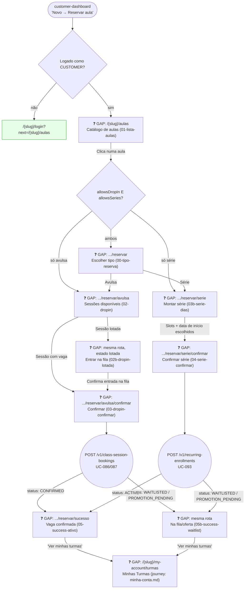

# CUSTOMER — Reservar Aula (Turmas)

**Actor(s):** CUSTOMER  
**Goal:** Authenticated customer with an active class-access contract (or a service-permitted pay-per-class path) browses the class catalog and enrolls in a new class — a one-off drop-in session or a standing recurring series  
**UCs covered:** UC-085, UC-086, UC-087, UC-090, UC-093 (`docs/04-USE_CASES.md`)  
**Status:** ❓ Gap — M21, Multi-Vertical Scheduling, Cluster 4 (Classes/Sessions). No story assigned yet.

> Promoted from `docs/discovery/multivertical-booking/reservar-aula-journey.md` via `/discovery-to-milestone` — that file already reached implementation-grade rigor (route tables, BFF contracts, GAP tags) during discovery UX work, so this promotion carries its content forward with canonical UC numbers substituted for `CAND-XX`, rather than redrafting from scratch. Complements `minha-conta.md`'s Turmas section, which covers managing an *existing* enrollment (skip a session, cancel, watch a waitlist, respond to a waitlist offer). This journey is the "before" — creating a new one.

## Flow

## Pages referenced

| Page / Route | Component | Story | Status |
|---|---|---|---|
| `/{slug}/login?next=/{slug}/aulas` | existing login page | M03 | ✅ Existente |
| `/{slug}/aulas` | `ClassCatalogPage` | — | ❓ GAP |
| `/{slug}/aulas/[classTypeId]/reservar` | `ReservaTypePicker` | — | ❓ GAP |
| `/{slug}/aulas/[classTypeId]/reservar/avulsa` | `DropInSessionPicker` | — | ❓ GAP |
| `/{slug}/aulas/[classTypeId]/reservar/avulsa/confirmar` | `DropInConfirmPage` | — | ❓ GAP |
| `/{slug}/aulas/[classTypeId]/reservar/serie` | `SeriesBuilderPage` | — | ❓ GAP |
| `/{slug}/aulas/[classTypeId]/reservar/serie/confirmar` | `SeriesConfirmPage` | — | ❓ GAP |
| `/{slug}/aulas/[classTypeId]/reservar/sucesso` | `EnrollmentSuccessPage` | — | ❓ GAP |

## BFF calls in this flow

| Call | When | Roles |
|---|---|---|
| `GET /v1/class-types` | Catálogo de aulas — page load. `ClassType` is a BFF read model composed from `Service` + `ClassScheduleTemplate` + next-session projection — **never** a persistence aggregate (canonical vocabulary: `docs/04-USE_CASES.md` UC-081/UC-079). | CUSTOMER |
| `GET /v1/class-types/:classTypeId/sessions?from=&limit=` | Seleção de sessão drop-in (UC-085) | CUSTOMER |
| `GET /v1/class-types/:classTypeId/recurring-slots` | Montagem da série | CUSTOMER |
| `POST /v1/class-session-bookings` | Confirmação drop-in (UC-086/087) | CUSTOMER |
| `POST /v1/recurring-enrollments` | Confirmação série (UC-093) | CUSTOMER |

Full request/response shapes: `docs/14-API_CONTRACTS.md` § Classes & Sessions.

## Open questions / gaps

- [ ] **No story exists yet for any route in this journey** — needs `/story-discovery` once the M21 milestone file is drafted.
- [x] **`ClassSessionBooking.status` is canonicalized.** The BFF projection exposes `CONFIRMED | PENDING_APPROVAL | WAITLISTED | PROMOTION_PENDING | CANCELLED` occurrence state and separates recurring intent (`RecurringEnrollment`) from occurrence state.
- [x] **`trialSlots`/`reservedNonMemberCount` are part of the availability/access contract** for authenticated pay-per-class customers (UC-087) as well as guests (UC-097).
- [ ] Reposição/`classSkipWindowHours` (UC-102, UC-094) belong to `minha-conta.md`'s Turmas section (managing an *existing* enrollment), not here — this journey only covers creating a new one.
- [x] **`ClassType` is explicitly a BFF read model, not an aggregate.** Mapped from `Service`, `ClassScheduleTemplate`, the next-session projection, and resolved resource display data; must not become a literal persistence endpoint or aggregate.
- [x] **Catalog fields are documented in the schema companion.** `class_catalog_color`/`class_catalog_allows_drop_in`/`class_catalog_allows_series` belong to the SESSION service catalog contract (`docs/13-DATABASE_SCHEMA.md`, `services` table, M21 Cluster 2's `class_catalog_*` columns).
- [x] **Contract-less authenticated customers use UC-087.** The BFF contract branches between contract-backed access and pay-per-class access; no payment is processed by Ikaro.
- [x] **Series responses expose separate recurring intent and occurrence state.** The read model represents one `RecurringEnrollment` plus its generated `ClassSessionBooking` occurrences; it does not persist a generic `Enrollment` aggregate.

## Prototype

Folder: `customer/prototypes/reservar-aula/` — relocated from `docs/discovery/multivertical-booking/prototype/customer-reservaraula-*.html`.

| File | Screen | UC | Status |
|---|---|---|---|
| `00-tipo-reserva.html` | Bifurcação avulsa/série | — | ❓ GAP |
| `01-lista-aulas.html` | Catálogo de aulas | UC-085 | ❓ GAP |
| `01b-lista-aulas-vazia.html` | Catálogo — estado vazio (filtro sem resultado) | UC-085 A1 | ❓ GAP |
| `02-dropin.html` | Seleção de sessão drop-in, badges de vagas | UC-085/086 | ❓ GAP |
| `02b-dropin-lotada.html` | Sessão lotada → entrada na fila | UC-090 | ❓ GAP |
| `03-dropin-confirmar.html` | Confirmação drop-in | UC-086/087 | ❓ GAP |
| `03b-serie-dias.html` | Montagem de série (slots + data + preview) | UC-093 | ❓ GAP |
| `04-serie-confirmar.html` | Confirmação série | UC-093 | ❓ GAP |
| `05-success-ativo.html` | Sucesso — vaga garantida (CONFIRMED) | UC-086/087 | ❓ GAP |
| `05b-success-waitlist.html` | Sucesso — na fila/oferta (`WAITLISTED`/`PROMOTION_PENDING`) | UC-090 | ❓ GAP |

**Not yet built:** `index.html` and `dev-notes.md` navigation/handoff files — added as part of this promotion (see below), no discovery-stage equivalent existed.
