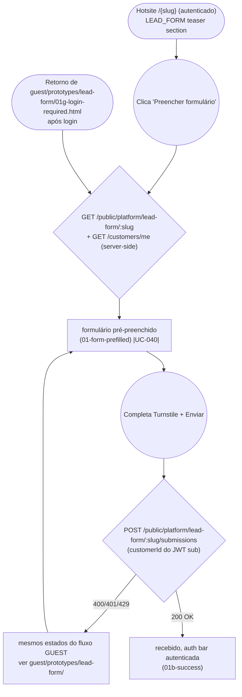

# CUSTOMER — Submit Lead Form

**Actor(s):** CUSTOMER
**Goal:** Submit interest via a tenant's lead-capture form, with contact fields pre-filled from the account profile
**UCs covered:** UC-040
**Status:** Built — M20-S09. Promoted from `docs/discovery/lead-form-module/lead-form-module.md` via `/discovery-to-milestone` (2026-08-23) for milestone `M20-LEAD-FORM-MODULE`.

## Flow

## Pages referenced

| Page / Route | Component | Story | Status |
|---|---|---|---|
| `/[slug]/lead-form` (authenticated) | `LeadFormPage` (same component as GUEST, prefilled via `getHotsiteCustomerProfile()` client-side) | M20-S09 | ✅ Done |

## Open questions / gaps

- [x] Milestone/story: `M20-S09` (`plan/M20-LEAD-FORM-MODULE.md`) — shipped.
- [x] Loading, validation error, captcha error, rate-limited, and generic submission error are identical to the GUEST flow — intentionally not re-prototyped here, per `guest/submit-lead-form.md`. Success **is** re-prototyped (`01b-success.html`), not because the content differs but because the auth bar does — the GUEST success screen shows the unauthenticated "Entrar" link, which would be wrong for an already-logged-in customer. An earlier draft of `01-form-prefilled.html` linked its "Enviar" button to the GUEST success screen; fixed to link to `01b-success.html` instead.

## Prototype

Folder: `customer/prototypes/lead-form/`

| File | Screen | UC | Status |
|---|---|---|---|
| `index.html` | Navigation hub | — | ✅ Criado |
| `01-form-prefilled.html` | Formulário com dados pré-preenchidos | UC-040 | ✅ Criado |
| `01b-success.html` | Envio recebido, auth bar autenticada (avatar/dropdown) | — | ✅ Criado |
| `dev-notes.md` | Implementation handoff | — | ✅ Criado |

Every other alternate state links back into `../../../guest/prototypes/lead-form/` rather than duplicating it.
