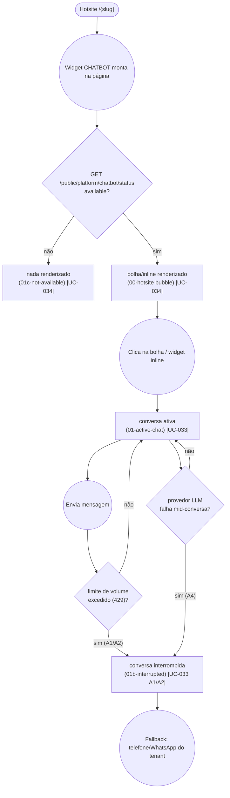

# GUEST — Ask Chatbot

**Actor(s):** GUEST
**Goal:** Ask the tenant's AI-backed chatbot a free-form question about the business (hours, prices, services) directly from the public hotsite, without leaving the page or authenticating
**UCs covered:** UC-033, UC-034
**Status:** Built (M19-S11)

## Flow

Built by M19-S11 (`apps/web/shells/hotsite/components/ChatbotWidget.tsx`) — every node above is
now live, matching the validated prototype exactly. See `guest/prototypes/ask-chatbot/dev-notes.md`
for the implementation handoff details.

Two platform-wide backstops (global daily spend circuit breaker, provider balance floor —
`docs/discovery/CHATBOT/CHATBOT.md` §8.9/§8.10) can also flip the pre-flight check to
`available: false` for every tenant simultaneously; not drawn as a separate node since, from this
one GUEST's perspective, it's indistinguishable from any other "not available" cause.

## Pages referenced

| Page / Route | Component | Story | Status |
|---|---|---|---|
| Hotsite chat bubble (bottom-right, all hotsite pages) | `ChatbotWidget` (collapsed) | M19-S11 | ✅ Built |
| Widget mount — availability pre-flight | `ChatbotWidget` → `GET /public/platform/chatbot/status` | M19-S11 | ✅ Built |
| Active chat panel/inline card | `ChatbotWidget` (active) | M19-S11 | ✅ Built |
| Send message | `ChatbotWidget` → `POST /public/platform/chatbot/messages` | M19-S11 | ✅ Built |
| Interrupted state (cap/failure) | `ChatbotWidget` (interrupted) | M19-S11 | ✅ Built |

## Open questions / gaps

- [x] Milestone/story: M19-S11, built 2026-08-17.
- [x] `ChatbotWidget.tsx`'s one-file decision (M19-S11 story-discovery) was superseded the same day
      by TD37-S05's length-rule enforcement — now split into `ChatbotWidget.tsx`/`ChatbotPanel.tsx`/
      `chatbot-icons.tsx`/`chatbot-widget-storage.ts`, no behavior change. See
      `guest/prototypes/ask-chatbot/dev-notes.md`.
- [ ] Whether the collapsed-bubble state (`01-bubble-collapsed.html` in the original discovery
      prototype) needs its own numbered screen in this folder was resolved: no — `00-hotsite.html`
      (via `shared/hotsite.html`) already shows it, since the bubble lives on every hotsite page, not
      as a distinct step in this journey.
- [ ] Full ten-layer cost/abuse-prevention design (caps, circuit breakers, prompt injection
      defenses) is documented in `docs/discovery/CHATBOT/CHATBOT.md` §8/§9, not repeated here — this
      journey file covers navigation/UX states only, per `README.md`'s "what goes in the flowchart"
      convention.

## Prototype

Folder: `guest/prototypes/ask-chatbot/`

| File | Screen | UC | Status |
|---|---|---|---|
| `index.html` | Navigation hub + dry-run checklist | — | ✅ Criado |
| `00-hotsite.html` | Hotsite entry point (redirect → `shared/hotsite.html`, now with chat bubble) | UC-034 | ✅ Criado |
| `01-active-chat.html` | Conversa ativa (variant `bubble`) | UC-033 | ✅ Criado |
| `01b-interrupted.html` | Limite atingido / provedor falhou | UC-033 A1/A2/A4 | ✅ Criado |
| `01c-not-available.html` | Indisponível (nada renderizado) | UC-034 | ✅ Criado |
| `01d-inline-variant.html` | Variante `inline` (configuração alternativa, não é unhappy path) | UC-033 | ✅ Criado |
| `dev-notes.md` | Implementation handoff (file map, props, BFF calls, validação, máquina de estados) | — | ✅ Criado |
