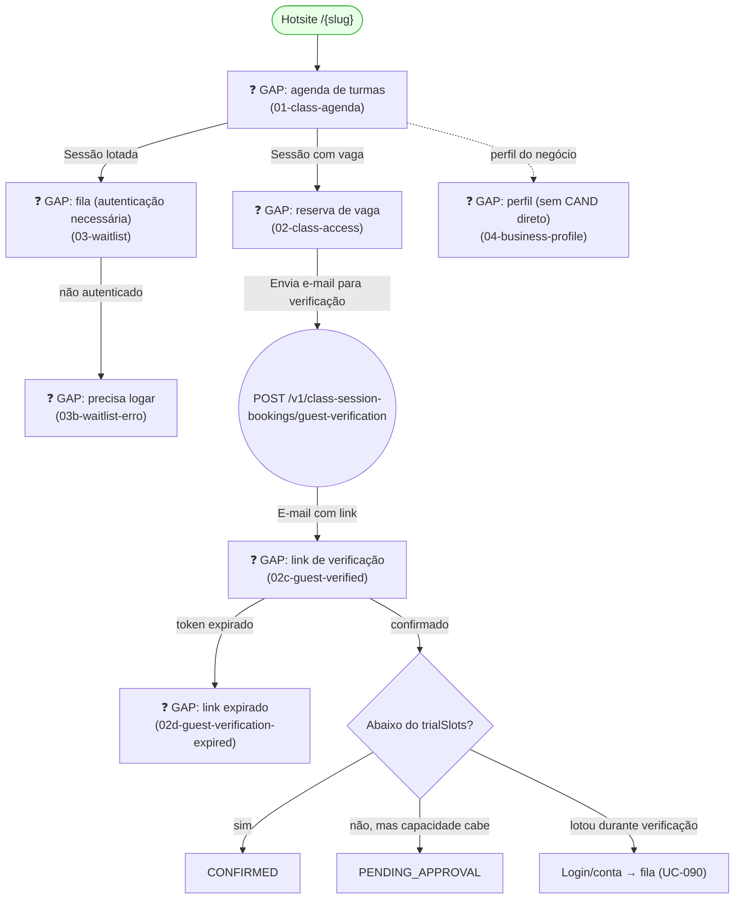

# GUEST — Book a Class (Trial/Drop-In)

**Actor(s):** GUEST  
**Goal:** Anonymous visitor browses a tenant's class agenda, verifies email, and requests a trial/drop-in seat without creating an account  
**UCs covered:** UC-085 (browse), UC-090 (waitlist boundary), UC-097 (email verification + request), UC-088 (verified guest books multiple named units in one action — a state within `02-class-access.html`'s existing verification flow, not a separate screen)  
**Status:** ❓ Gap — M21, Multi-Vertical Scheduling, Cluster 4 (Classes/Sessions). No story assigned yet.

> Promoted from `docs/discovery/multivertical-booking/multivertical-booking_USECASES.md` (CAND-21, 24 A3, 33) via `/discovery-to-milestone`. Parallel to `guest/book-a-service.md` (appointment booking) — this is the SESSION-family equivalent for an anonymous visitor. See `docs/02-DOMAIN_MODEL.md` § `ClassSessionBooking`.

## Flow

## Pages referenced

| Page / Route | Component | Story | Status |
|---|---|---|---|
| `/{slug}/aulas/agenda` | `ClassAgendaPage` | — | ❓ GAP |
| `/{slug}/aulas/[sessionId]/acesso` | `ClassAccessFlow` | — | ❓ GAP |
| `/{slug}/aulas/[sessionId]/fila` | `ClassWaitlistStatus` | — | ❓ GAP |

## BFF calls in this flow

| Call | When | Roles |
|---|---|---|
| `GET /v1/class-sessions?serviceId=&from=` | Agenda de turmas (UC-085) | Guest |
| `POST /v1/class-session-bookings/guest-verification` | Envia e-mail de verificação (UC-097 step 1) | Guest |
| `POST /v1/class-session-bookings/guest-verification/:token/confirm` | Confirma e-mail (UC-097 step 2–3) | Guest |
| `POST /v1/class-sessions/:id/waitlist` | Entrar na fila — requer autenticação (UC-090 A3) | Customer only |

Full request/response shapes: `docs/14-API_CONTRACTS.md` § Classes & Sessions.

## Prototype

Folder: `guest/prototypes/book-a-class/` — relocated from `docs/discovery/multivertical-booking/prototype/public-{02b,06,06b,06c,10,10b,16}*.html`.

| File | Screen | UC | Status |
|---|---|---|---|
| `01-class-agenda.html` | Agenda de turmas por dia (após escolher um serviço de turma) | UC-085 | ❓ GAP |
| `02-class-access.html` | Reserva de vaga (3 estados de autenticação: anônimo/logado sem contrato/logado com contrato); o estado anônimo também cobre UC-088's multi-attendee group checkout | UC-086/087/088/097 | ❓ GAP |
| `02c-guest-verified.html` | Link de verificação confirmado | UC-097 step 2 | ❓ GAP |
| `02d-guest-verification-expired.html` | Link de verificação expirado | UC-097 A1 | ❓ GAP |
| `03-waitlist.html` / `03b-waitlist-erro.html` | Entrada na fila + erro (duplicado/não autenticado) | UC-090 | ❓ GAP |
| `04-business-profile.html` | Perfil do negócio (cliente logado) — **sem CAND direto**, supplementary screen | — | ❓ GAP |

**Not relocated, superseded reference only:** `public-02-class-session-picker.html` — superseded by agenda-first `01-class-agenda.html`; must not be presented as a parallel public route (`docs/discovery/multivertical-booking/prototype/ROUTE_MAP.md`).

## Open questions / gaps

- [ ] No story exists yet — needs `/story-discovery` once the M21 milestone file is drafted.
- [ ] `02-class-access.html`'s "logado sem contrato" state is UC-087's actual UI home — confirm this single screen correctly branches all three auth states rather than needing a split.
- [ ] `04-business-profile.html` has no corresponding CAND/UC — the implementing story should confirm whether it's in scope for this milestone or a separate, unrelated hotsite feature.
