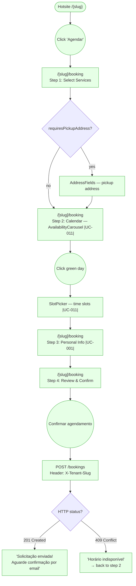
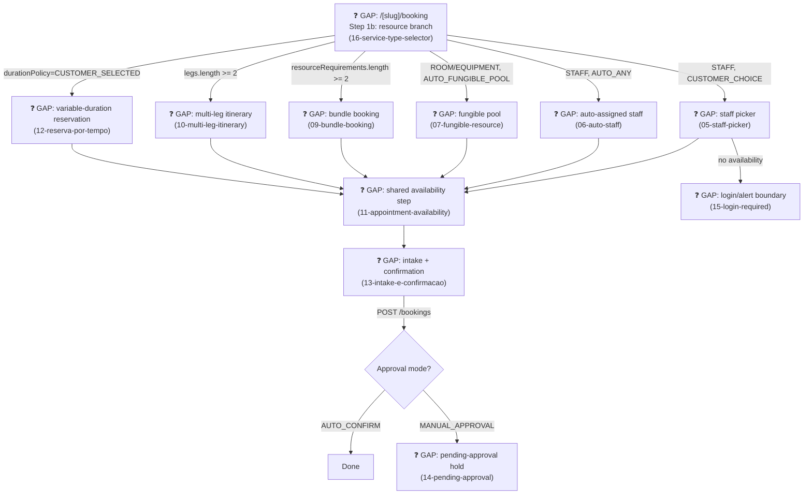

# GUEST — Book a Service

**Actor(s):** GUEST  
**Goal:** Submit a booking request on a tenant's public hotsite without authentication  
**UCs covered:** UC-001, UC-011 (✅ Reviewed) · UC-061, UC-062, UC-063, UC-064, UC-065, UC-066, UC-067, UC-068 (❓ Gap — M21 Cluster 3, resource-scoped/bundle/leg/variable-duration/intake booking extensions)  
**Status:** Base flow reviewed — M21 Cluster 3 extension not yet built, see the ❓ GAP section in `dev-notes.md`

## Flow

## Pages referenced

| Page / Route | Component | Story | Status |
|---|---|---|---|
| `/[slug]/booking` | `BookingForm` (orchestrates steps) | M12-S07 | ✅ Existing |
| Step 1 | `ServiceSelectionStep` + `AddressFields` | M12-S07 | ✅ Existing |
| Step 2 | `AvailabilityCarousel` + `SlotPicker` | M12-S07 | ✅ Existing |
| Step 3 | `PersonalInfoStep` + `PhotoUpload` | M12-S07 | ✅ Existing |
| Step 4 | `ConfirmationStep` | M12-S07 | ✅ Existing |

## Open questions / gaps

- No open gaps for the guest booking path — fully built as of M12-S07.
- UC-005 (A2) — guest submits admin-requested info: backend complete (`PATCH /bookings/:id/submit-info/guest?token=`), but frontend page `/[slug]/bookings/:id/submit-info` does not exist. Tracked in `guest/use-cases.md`. Out of scope for this journey.
- When a session is full or an appointment has no matching availability, a guest cannot create a waitlist entry or availability alert. Preserve the selected session/criteria through login/account creation, then return the authenticated customer to the action.

## M21 — Multi-Vertical Scheduling, Cluster 3 extension (❓ Gap, not yet built)

> Promoted from `docs/discovery/multivertical-booking/`. Step 1 ("Select Services") now branches on the selected service's `bookingModel`/`resourceRequirements`/`legs`/`durationPolicy` before reaching the existing Step 2 calendar. Full implementation-handoff detail lives in `dev-notes.md`'s own ❓ GAP section — not duplicated here.

**Prototype:** `guest/prototypes/book-a-service/05-staff-picker.html` through `16-service-type-selector.html` (relocated from the discovery folder's `public-XX-*.html` screens).

**Open questions:**
- [ ] No story exists yet — needs `/story-discovery` once the M21 milestone file is drafted.
- [ ] Whether `16-service-type-selector.html` replaces or precedes the existing `ServiceSelectionStep` (Step 1) is a UI/routing decision for the implementing story — this discovery screen was built standalone and never reconciled against the shipped car-wash-only selector.
- [ ] Pre-existing dangling links found during this promotion, not fixed here: `16-service-type-selector.html`'s "browse sessions" link (`public-02b-class-agenda.html`, Cluster 4) is not yet promoted.
