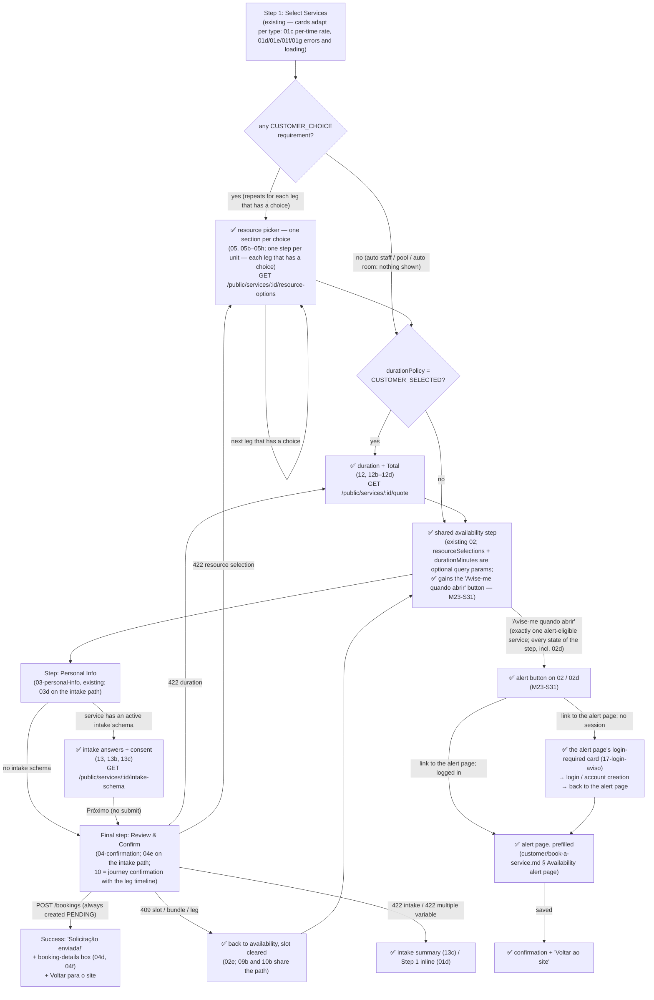

# GUEST — Book a Service

**Actor(s):** GUEST  
**Goal:** Submit a booking request on a tenant's public hotsite without authentication  
**UCs covered:** UC-001, UC-011 (✅ Reviewed) · UC-061, UC-062, UC-063, UC-064 (flat bundle picks), UC-066, UC-068 (✅ Built — `M23-S11a`) · UC-065 (picker per leg ✅ `M23-S11a`; the itinerary confirmation ✅ `M23-S11b`) · UC-067 (per-time card ✅ `M23-S11a`; the duration step ✅ `M23-S11b`); backend/BFF for UC-061–068 shipped in M23-S01–S03 and `M23-S29`; UC-066 = the picker flow, the staff directory is deferred  
**Status:** Base flow reviewed — M23 Cluster 3 extension built by `M23-S11a` (step engine, service cards, resource picker, intake, details box); `M23-S11b` (bundle/journey confirmation, variable duration, combined baskets) ✅ built too, see `dev-notes.md`

## Flow

```mermaid
flowchart TD
    classDef existing fill:#e6ffe6,stroke:#3a3

    Start(["Hotsite /{slug}"]) --> CTA(("Click 'Agendar'"))
    CTA --> S1["/[slug]/booking<br/>Step 1: Select Services"]

    S1 --> Pickup{"requiresPickupAddress?"}
    Pickup -- yes --> PickupField["AddressFields — pickup address"]
    Pickup -- no --> S2
    PickupField --> S2

    S2["/[slug]/booking<br/>Step 2: Calendar — AvailabilityCarousel |UC-011|"] --> DayClick(("Click green day"))
    DayClick --> SlotPicker["SlotPicker — time slots |UC-011|"]
    SlotPicker --> S3

    S3["/[slug]/booking<br/>Step 3: Personal Info |UC-001|"] --> S4
    S4["/[slug]/booking<br/>Step 4: Review & Confirm"]
    S4 --> Submit(("Confirmar agendamento"))
    Submit --> POST["POST /bookings<br/>Header: X-Tenant-Slug"]
    POST --> SlotOk{"HTTP status?"}
    SlotOk -- 201 Created --> Done["'Solicitação enviada!<br/>Aguarde confirmação por email'"]
    SlotOk -- 409 Conflict --> S2Error["'Horário indisponível'<br/>→ back to step 2"]

    class Start,CTA,S1,PickupField,S2,DayClick,SlotPicker,S3,S4,Submit,POST,Done,S2Error existing
```

## Pages referenced

| Page / Route | Component | Story | Status |
|---|---|---|---|
| `/[slug]/booking` | `BookingForm` (orchestrates steps) | M12-S07 | ✅ Existing |
| Step 1 | `ServiceSelectionStep` + `AddressFields` | M12-S07 | ✅ Existing |
| Step 2 | `AvailabilityCarousel` + `SlotPicker` | M12-S07 | ✅ Existing |
| Step 3 | `PersonalInfoStep` + `PhotoUpload` | M12-S07 | ✅ Existing |
| Step 4 | `ConfirmationStep` | M12-S07 | ✅ Existing |

## Open questions / gaps

- No open gaps for the guest booking path — fully built as of M12-S07.
- UC-005 (A2) — guest submits admin-requested info: backend complete (`PATCH /bookings/:id/submit-info/guest?token=`), but frontend page `/[slug]/bookings/:id/submit-info` does not exist. Tracked in `guest/use-cases.md`. Out of scope for this journey.
- A guest cannot create a class-session waitlist entry (M24) or an availability alert. For appointments, the calendar step offers "Avise-me quando abrir" (M23-S31) when the basket holds exactly one alert-eligible service: the button links to the alert page of the booking flow (tenant branding), which — with no session — shows a login-required card; after login/account creation the guest lands on the same page, prefilled with the service, the single resource pick and the duration. An already-authenticated customer sees the form directly. See `customer/book-a-service.md` § Availability alert page.

## M23 — Multi-Vertical Scheduling, Cluster 3 extension (✅ `M23-S11a` built · ✅ `M23-S11b` built)

> Promoted from `docs/discovery/multivertical-booking/`. Step 1 ("Select Services") now decides which extra steps the flow has. Full implementation-handoff detail lives in `dev-notes.md`'s own ❓ GAP section — not duplicated here.
>
> **Two rules shape the whole extension (settled 2026-10-03):** (1) a resource is only asked for when the customer has a real choice — **automatic staff, rooms, equipment and fungible pools have no screen and no note**; (2) the picker is **one step per unit** — a simple service or bundle is one unit with a section per choice (staff, room, equipment), a journey has one step per leg that has a choice.

```mermaid
flowchart TD
    classDef gap stroke:#f00,stroke-dasharray: 5 5,fill:#fee

    S1b["Step 1: Select Services<br/>(existing — cards adapt per type: 01c per-time rate, 01d/01e/01f/01g errors and loading)"] --> HasChoice{"any CUSTOMER_CHOICE<br/>requirement?"}
    HasChoice -- "yes (repeats for each leg that has a choice)" --> Picker["✅ resource picker — one section per choice<br/>(05, 05b–05h; one step per unit — each leg that has a choice)<br/>GET /public/services/:id/resource-options"]
    HasChoice -- "no (auto staff / pool / auto room: nothing shown)" --> HasDuration
    Picker -->|"next leg that has a choice"| Picker
    Picker --> HasDuration{"durationPolicy =<br/>CUSTOMER_SELECTED?"}
    HasDuration -- "yes" --> Duration["✅ duration + Total<br/>(12, 12b–12d)<br/>GET /public/services/:id/quote"]
    HasDuration -- "no" --> Availability
    Duration --> Availability["✅ shared availability step<br/>(existing 02; resourceSelections + durationMinutes are optional query params;<br/>✅ gains the 'Avise-me quando abrir' button — M23-S31)"]

    Availability --> S3m["Step: Personal Info<br/>(03-personal-info, existing; 03d on the intake path)"]
    Availability -->|"'Avise-me quando abrir' (exactly one alert-eligible service; every state of the step, incl. 02d)"| AlertBtn["✅ alert button on 02 / 02d<br/>(M23-S31)"]
    AlertBtn -->|"link to the alert page; no session"| AlertLogin["✅ the alert page's login-required card (17-login-aviso)<br/>→ login / account creation → back to the alert page"]
    AlertBtn -->|"link to the alert page; logged in"| AlertPage["✅ alert page, prefilled<br/>(customer/book-a-service.md § Availability alert page)"]
    AlertLogin --> AlertPage
    AlertPage -->|"saved"| AlertDone["✅ confirmation + 'Voltar ao site'"]
    S3m -->|"service has an active intake schema"| Intake["✅ intake answers + consent<br/>(13, 13b, 13c)<br/>GET /public/services/:id/intake-schema"]
    S3m -->|"no intake schema"| Confirm
    Intake -->|"Próximo (no submit)"| Confirm["Final step: Review & Confirm<br/>(04-confirmation; 04e on the intake path;<br/>10 = journey confirmation with the leg timeline)"]
    Confirm -->|"POST /bookings (always created PENDING)"| Done["Success: 'Solicitação enviada!'<br/>+ booking-details box (04d, 04f)<br/>+ Voltar para o site"]
    Confirm -->|"409 slot / bundle / leg"| BackAvail["✅ back to availability, slot cleared<br/>(02e; 09b and 10b share the path)"]
    Confirm -->|"422 duration"| Duration
    Confirm -->|"422 resource selection"| Picker
    Confirm -->|"422 intake / 422 multiple variable"| Errors["✅ intake summary (13c) / Step 1 inline (01d)"]
    BackAvail --> Availability
```

**Prototype:** `guest/prototypes/book-a-service/` — screens `01c`–`01g`, `05`–`05h`, `02` (the existing date/time step — ✅ it gains the "Avise-me quando abrir" button, `M23-S31`; `02d` gains it too; ✅ plus `17-login-aviso`, the alert page's login-required card for a guest), `09b`, `10`, `10b`, `12`–`12d`, `13`–`13c`, the success variants `04d`/`04f` and the **combined-basket variants** `03e`, `04g`, `04h`, `04i`, `10c` (✅ `M23-S11b`) (`15-login-required.html` is a class-waitlist screen, out of M23-S11a/S11b's scope; `06`, `07`, `08`, `09`, `14` and `16` were removed — see `dev-notes.md`).

**Combined baskets (decided 2026-10-03, `M23-S11b`).** A basket can mix fixed-price services, one variable-duration service, a bundle and one or more journeys; the only restriction is one `CUSTOMER_SELECTED` service per basket. The summary card (`03e`), the Confirmation / journey review (`04g`, `10c`, `04i`) and the success box (`04h`) compose **one row per line** and show **one total**: fixed prices + the quoted amount; duration = the sum of the line durations, where a journey counts its legs plus the transitions between them. Lines run back-to-back from the chosen slot in basket order (the backend's cursor), so a journey that is not the first line starts when the previous lines end. **Per-line time ranges appear only when the basket contains a journey** (its timeline already shows times, so the other lines need ranges to be read in sequence); other multi-line baskets keep today's single start time. Before booking, a bundle or journey names only the customer's own picks; after booking, `04h` names every assigned resource from the response (`assignedResourceName` / `itinerary`), a fungible pool never. Pure single-service baskets render exactly as `03`/`04`/`10`/`04d`/`04f`.

**Stories:** `M23-S29` (backend/BFF prerequisites, ✅ Done), **`M23-S11a`** (step engine, intake, service cards, resource picker, success box) then **`M23-S11b`** (bundle/journey confirmation and variable duration) in `plan/M23-MULTIVERTICAL-APPOINTMENT-BOOKING.md`.

**Open questions:**
- [x] Intake placement decided: its own step after Personal Info, before the final Review & Confirm (`dev-notes.md` § Intake step placement).
- [x] No screen for automatic resources; one picker for every resource and service type; duration is a duration-only step; the legs review is the final Confirmation step; customer rescheduling is a separate story (`dev-notes.md` § Design decisions).
- [x] `06`, `07`, `08`, `09`, `14`, `16` removed.
- [ ] `15-login-required.html` is a **class-waitlist** screen ("Entre para entrar na fila de espera", Pilates), linked to the Cluster 4 class agenda (`public-02b-class-agenda.html`, not yet promoted) — it belongs to M24 and is **not** the appointment availability-alert entry.
- [x] **Availability-alert entry (`M23-S31`, ✅ built):** an "Avise-me quando abrir" button in the calendar step's nav row (`02` and `02d`), shown in every state of the step, only when the basket holds exactly one alert-eligible service. It links to the alert page of the booking flow (`customer/book-a-service.md` § Availability alert page; tenant branding); a guest sees a login-required card there (`17-login-aviso`), logs in and lands on the same prefilled page. Saved → confirmation with "Voltar ao site". Drawn: the button on `02`/`02d` (this folder), `17-login-aviso`, and the alert page with its states `16`–`16i` (`customer/prototypes/book-a-service/`).
