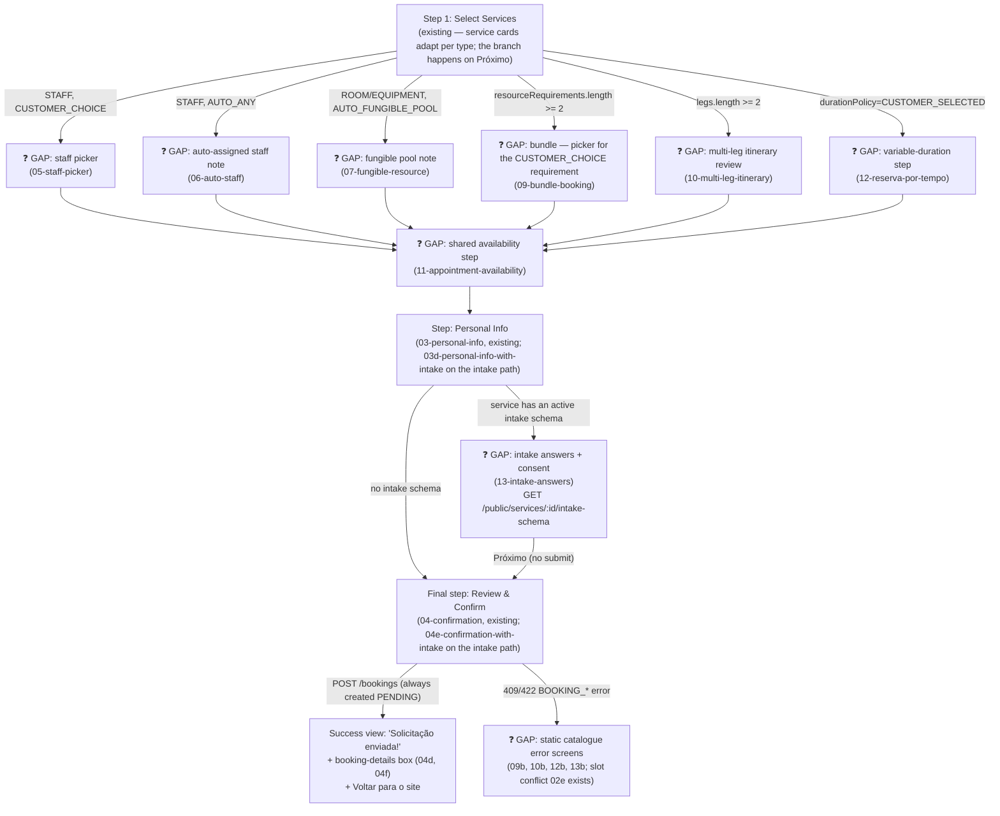

# GUEST — Book a Service

**Actor(s):** GUEST  
**Goal:** Submit a booking request on a tenant's public hotsite without authentication  
**UCs covered:** UC-001, UC-011 (✅ Reviewed) · UC-061, UC-062, UC-063, UC-064, UC-065, UC-066, UC-067, UC-068 (❓ Gap — M23 Cluster 3 frontend, `M23-S11` on top of `M23-S29`; backend/BFF for UC-061–068 shipped in M23-S01–S03; UC-066 = the picker flow, the staff directory is deferred)  
**Status:** Base flow reviewed — M23 Cluster 3 extension not yet built, see the ❓ GAP section in `dev-notes.md`

## Flow

```mermaid
flowchart TD
    classDef existing fill:#e6ffe6,stroke:#3a3

    Start(["Hotsite /{slug}"]) --> CTA(("Click 'Agendar'"))
    CTA --> S1["/[slug]/booking<br/>Step 1: Select Services"]

    S1 --> Pickup{"requiresPickupAddress?"}
    Pickup -- yes --> PickupField["AddressFields — pickup address"]
    Pickup -- no --> S2
    PickupField --> S2

    S2["/[slug]/booking<br/>Step 2: Calendar — AvailabilityCarousel |UC-011|"] --> DayClick(("Click green day"))
    DayClick --> SlotPicker["SlotPicker — time slots |UC-011|"]
    SlotPicker --> S3

    S3["/[slug]/booking<br/>Step 3: Personal Info |UC-001|"] --> S4
    S4["/[slug]/booking<br/>Step 4: Review & Confirm"]
    S4 --> Submit(("Confirmar agendamento"))
    Submit --> POST["POST /bookings<br/>Header: X-Tenant-Slug"]
    POST --> SlotOk{"HTTP status?"}
    SlotOk -- 201 Created --> Done["'Solicitação enviada!<br/>Aguarde confirmação por email'"]
    SlotOk -- 409 Conflict --> S2Error["'Horário indisponível'<br/>→ back to step 2"]

    class Start,CTA,S1,PickupField,S2,DayClick,SlotPicker,S3,S4,Submit,POST,Done,S2Error existing
```

## Pages referenced

| Page / Route | Component | Story | Status |
|---|---|---|---|
| `/[slug]/booking` | `BookingForm` (orchestrates steps) | M12-S07 | ✅ Existing |
| Step 1 | `ServiceSelectionStep` + `AddressFields` | M12-S07 | ✅ Existing |
| Step 2 | `AvailabilityCarousel` + `SlotPicker` | M12-S07 | ✅ Existing |
| Step 3 | `PersonalInfoStep` + `PhotoUpload` | M12-S07 | ✅ Existing |
| Step 4 | `ConfirmationStep` | M12-S07 | ✅ Existing |

## Open questions / gaps

- No open gaps for the guest booking path — fully built as of M12-S07.
- UC-005 (A2) — guest submits admin-requested info: backend complete (`PATCH /bookings/:id/submit-info/guest?token=`), but frontend page `/[slug]/bookings/:id/submit-info` does not exist. Tracked in `guest/use-cases.md`. Out of scope for this journey.
- When a session is full or an appointment has no matching availability, a guest cannot create a waitlist entry or availability alert. Preserve the selected session/criteria through login/account creation, then return the authenticated customer to the action.

## M23 — Multi-Vertical Scheduling, Cluster 3 extension (❓ Gap, not yet built)

> Promoted from `docs/discovery/multivertical-booking/`. Step 1 ("Select Services") now branches on the selected service's `bookingModel`/`resourceRequirements`/`legs`/`durationPolicy` before reaching the existing Step 2 calendar. Full implementation-handoff detail lives in `dev-notes.md`'s own ❓ GAP section — not duplicated here.

```mermaid
flowchart TD
    classDef gap stroke:#f00,stroke-dasharray: 5 5,fill:#fee

    S1b["Step 1: Select Services<br/>(existing — service cards adapt per type; the branch happens on Próximo)"] -->|"STAFF, CUSTOMER_CHOICE"| StaffPicker["❓ GAP: staff picker<br/>(05-staff-picker)"]
    S1b -->|"STAFF, AUTO_ANY"| AutoStaff["❓ GAP: auto-assigned staff note<br/>(06-auto-staff)"]
    S1b -->|"ROOM/EQUIPMENT, AUTO_FUNGIBLE_POOL"| Fungible["❓ GAP: fungible pool note<br/>(07-fungible-resource)"]
    S1b -->|"resourceRequirements.length >= 2"| Bundle["❓ GAP: bundle — picker for the CUSTOMER_CHOICE requirement<br/>(09-bundle-booking)"]
    S1b -->|"legs.length >= 2"| MultiLeg["❓ GAP: multi-leg itinerary review<br/>(10-multi-leg-itinerary)"]
    S1b -->|"durationPolicy=CUSTOMER_SELECTED"| VarDuration["❓ GAP: variable-duration step<br/>(12-reserva-por-tempo)"]

    StaffPicker --> Availability["❓ GAP: shared availability step<br/>(11-appointment-availability)"]
    AutoStaff --> Availability
    Fungible --> Availability
    Bundle --> Availability
    MultiLeg --> Availability
    VarDuration --> Availability

    Availability --> S3m["Step: Personal Info<br/>(03-personal-info, existing; 03d-personal-info-with-intake on the intake path)"]
    S3m -->|"service has an active intake schema"| Intake["❓ GAP: intake answers + consent<br/>(13-intake-answers)<br/>GET /public/services/:id/intake-schema"]
    S3m -->|"no intake schema"| Confirm
    Intake -->|"Próximo (no submit)"| Confirm["Final step: Review & Confirm<br/>(04-confirmation, existing; 04e-confirmation-with-intake on the intake path)"]
    Confirm -->|"POST /bookings (always created PENDING)"| Done["Success view: 'Solicitação enviada!'<br/>+ booking-details box (04d, 04f)<br/>+ Voltar para o site"]
    Confirm -->|"409/422 BOOKING_* error"| Errors["❓ GAP: static catalogue error screens<br/>(09b, 10b, 12b, 13b; slot conflict 02e exists)"]
```

**Prototype:** `guest/prototypes/book-a-service/05-staff-picker.html` through `13b-intake-answers-error.html`, plus the success variants `04d`/`04f` (`15-login-required.html` is out of M23-S11 — availability alerts; `08-staff-calendar`, `14-pending-approval` and `16-service-type-selector` were removed — see `dev-notes.md`).

**Open questions:**
- [x] Stories: `M23-S29` (backend/BFF prerequisites) then `M23-S11` (frontend) in `plan/M23-MULTIVERTICAL-APPOINTMENT-BOOKING.md` — run `/story-discovery M23-S29`, then `M23-S11`.
- [x] Intake placement decided: its own step after Personal Info (Step 3), before the final Review & Confirm — never merged with the summary (`dev-notes.md` § Intake step placement).
- [x] `16-service-type-selector.html` removed (2026-10-02): the existing Step 1 service list is the catalogue; its cards adapt to the service type and a class (M24) is just another service.
- [x] Pending-approval screen (14) dropped: the existing success message already says the request awaits email confirmation; a subtle booking-details box is added below it (`04d`/`04f`), for every booking.
- [x] Staff profile page (08) dropped; UC-066 is the picker flow; a public staff directory is deferred.
- [ ] `15-login-required.html` still links to the Cluster 4 class agenda (`public-02b-class-agenda.html`, not yet promoted) — out of M23-S11's scope, carried by the alert stories (M23-S12/S17) and M24.
