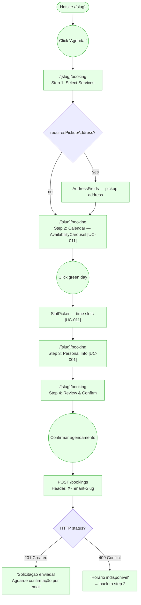
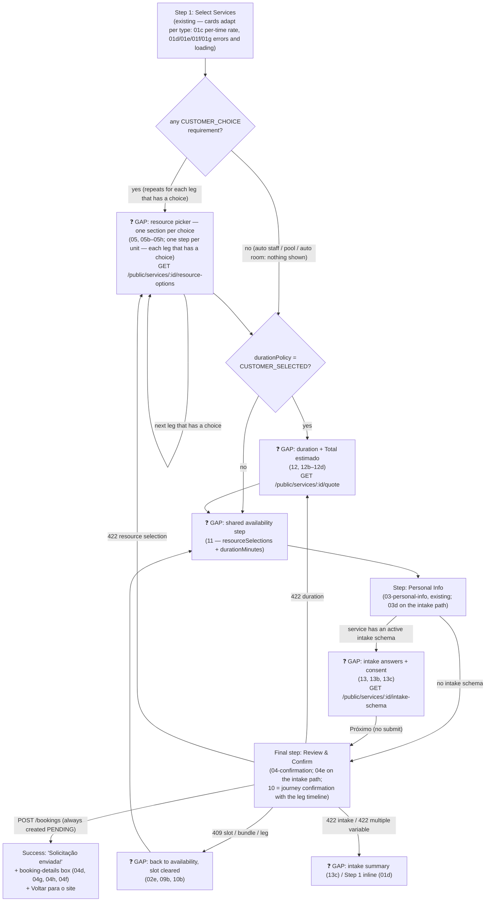

# GUEST — Book a Service

**Actor(s):** GUEST  
**Goal:** Submit a booking request on a tenant's public hotsite without authentication  
**UCs covered:** UC-001, UC-011 (✅ Reviewed) · UC-061, UC-062, UC-063, UC-064, UC-065, UC-066, UC-067, UC-068 (❓ Gap — M23 Cluster 3 frontend, `M23-S11a` (A, B, E) and `M23-S11b` (C, D) on top of `M23-S29`; backend/BFF for UC-061–068 shipped in M23-S01–S03; UC-066 = the picker flow, the staff directory is deferred)  
**Status:** Base flow reviewed — M23 Cluster 3 extension not yet built, see the ❓ GAP section in `dev-notes.md`

## Flow

```mermaid
flowchart TD
    classDef existing fill:#e6ffe6,stroke:#3a3

    Start(["Hotsite /{slug}"]) --> CTA(("Click 'Agendar'"))
    CTA --> S1["/[slug]/booking<br/>Step 1: Select Services"]

    S1 --> Pickup{"requiresPickupAddress?"}
    Pickup -- yes --> PickupField["AddressFields — pickup address"]
    Pickup -- no --> S2
    PickupField --> S2

    S2["/[slug]/booking<br/>Step 2: Calendar — AvailabilityCarousel |UC-011|"] --> DayClick(("Click green day"))
    DayClick --> SlotPicker["SlotPicker — time slots |UC-011|"]
    SlotPicker --> S3

    S3["/[slug]/booking<br/>Step 3: Personal Info |UC-001|"] --> S4
    S4["/[slug]/booking<br/>Step 4: Review & Confirm"]
    S4 --> Submit(("Confirmar agendamento"))
    Submit --> POST["POST /bookings<br/>Header: X-Tenant-Slug"]
    POST --> SlotOk{"HTTP status?"}
    SlotOk -- 201 Created --> Done["'Solicitação enviada!<br/>Aguarde confirmação por email'"]
    SlotOk -- 409 Conflict --> S2Error["'Horário indisponível'<br/>→ back to step 2"]

    class Start,CTA,S1,PickupField,S2,DayClick,SlotPicker,S3,S4,Submit,POST,Done,S2Error existing
```

## Pages referenced

| Page / Route | Component | Story | Status |
|---|---|---|---|
| `/[slug]/booking` | `BookingForm` (orchestrates steps) | M12-S07 | ✅ Existing |
| Step 1 | `ServiceSelectionStep` + `AddressFields` | M12-S07 | ✅ Existing |
| Step 2 | `AvailabilityCarousel` + `SlotPicker` | M12-S07 | ✅ Existing |
| Step 3 | `PersonalInfoStep` + `PhotoUpload` | M12-S07 | ✅ Existing |
| Step 4 | `ConfirmationStep` | M12-S07 | ✅ Existing |

## Open questions / gaps

- No open gaps for the guest booking path — fully built as of M12-S07.
- UC-005 (A2) — guest submits admin-requested info: backend complete (`PATCH /bookings/:id/submit-info/guest?token=`), but frontend page `/[slug]/bookings/:id/submit-info` does not exist. Tracked in `guest/use-cases.md`. Out of scope for this journey.
- When a session is full or an appointment has no matching availability, a guest cannot create a waitlist entry or availability alert. Preserve the selected session/criteria through login/account creation, then return the authenticated customer to the action.

## M23 — Multi-Vertical Scheduling, Cluster 3 extension (❓ Gap, not yet built)

> Promoted from `docs/discovery/multivertical-booking/`. Step 1 ("Select Services") now decides which extra steps the flow has. Full implementation-handoff detail lives in `dev-notes.md`'s own ❓ GAP section — not duplicated here.
>
> **Two rules shape the whole extension (settled 2026-10-03):** (1) a resource is only asked for when the customer has a real choice — **automatic staff, rooms, equipment and fungible pools have no screen and no note**; (2) the picker is **one step per unit** — a simple service or bundle is one unit with a section per choice (staff, room, equipment), a journey has one step per leg that has a choice.

```mermaid
flowchart TD
    classDef gap stroke:#f00,stroke-dasharray: 5 5,fill:#fee

    S1b["Step 1: Select Services<br/>(existing — cards adapt per type: 01c per-time rate, 01d/01e/01f/01g errors and loading)"] --> HasChoice{"any CUSTOMER_CHOICE<br/>requirement?"}
    HasChoice -- "yes (repeats for each leg that has a choice)" --> Picker["❓ GAP: resource picker — one section per choice<br/>(05, 05b–05h; one step per unit — each leg that has a choice)<br/>GET /public/services/:id/resource-options"]
    HasChoice -- "no (auto staff / pool / auto room: nothing shown)" --> HasDuration
    Picker -->|"next leg that has a choice"| Picker
    Picker --> HasDuration{"durationPolicy =<br/>CUSTOMER_SELECTED?"}
    HasDuration -- "yes" --> Duration["❓ GAP: duration + Total estimado<br/>(12, 12b–12d)<br/>GET /public/services/:id/quote"]
    HasDuration -- "no" --> Availability
    Duration --> Availability["❓ GAP: shared availability step<br/>(11 — resourceSelections + durationMinutes)"]

    Availability --> S3m["Step: Personal Info<br/>(03-personal-info, existing; 03d on the intake path)"]
    S3m -->|"service has an active intake schema"| Intake["❓ GAP: intake answers + consent<br/>(13, 13b, 13c)<br/>GET /public/services/:id/intake-schema"]
    S3m -->|"no intake schema"| Confirm
    Intake -->|"Próximo (no submit)"| Confirm["Final step: Review & Confirm<br/>(04-confirmation; 04e on the intake path;<br/>10 = journey confirmation with the leg timeline)"]
    Confirm -->|"POST /bookings (always created PENDING)"| Done["Success: 'Solicitação enviada!'<br/>+ booking-details box (04d, 04g, 04h, 04f)<br/>+ Voltar para o site"]
    Confirm -->|"409 slot / bundle / leg"| BackAvail["❓ GAP: back to availability, slot cleared<br/>(02e, 09b, 10b)"]
    Confirm -->|"422 duration"| Duration
    Confirm -->|"422 resource selection"| Picker
    Confirm -->|"422 intake / 422 multiple variable"| Errors["❓ GAP: intake summary (13c) / Step 1 inline (01d)"]
    BackAvail --> Availability
```

**Prototype:** `guest/prototypes/book-a-service/` — screens `01c`–`01g`, `05`–`05h`, `09b`, `10`, `10b`, `11`, `12`–`12d`, `13`–`13c` and the success variants `04d`/`04f`/`04g`/`04h` (`15-login-required.html` is out of M23-S11a/S11b's scope — availability alerts; `06`, `07`, `08`, `09`, `14` and `16` were removed — see `dev-notes.md`).

**Stories:** `M23-S29` (backend/BFF prerequisites, ✅ Done), **`M23-S11a`** (step engine, intake, service cards, resource picker, success box) then **`M23-S11b`** (bundle/journey confirmation and variable duration) in `plan/M23-MULTIVERTICAL-APPOINTMENT-BOOKING.md`.

**Open questions:**
- [x] Intake placement decided: its own step after Personal Info, before the final Review & Confirm (`dev-notes.md` § Intake step placement).
- [x] No screen for automatic resources; one picker for every resource and service type; duration is a duration-only step; the legs review is the final Confirmation step; customer rescheduling is a separate story (`dev-notes.md` § Design decisions).
- [x] `06`, `07`, `08`, `09`, `14`, `16` removed.
- [ ] `15-login-required.html` still links to the Cluster 4 class agenda (`public-02b-class-agenda.html`, not yet promoted) — out of M23-S11a/S11b's scope, carried by the alert stories (M23-S12/S17) and M24.
