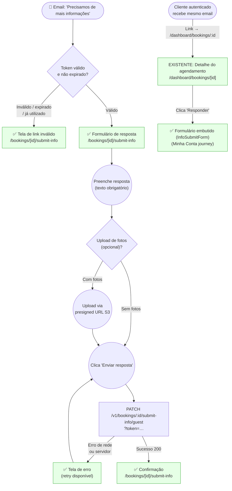

# GUEST — Responder à Solicitação de Informação

**Actor(s):** GUEST (main path — unauthenticated, email link); CUSTOMER (alt path — authenticated, via minha-conta)
**Goal:** Submit the additional information requested by the admin so the booking returns to PENDING and can be approved.
**UCs covered:** UC-005 A2
**Status:** Reviewed — implemented via `M13-S38`/`M13-S39`/`M13-S40` (all ✅ Done in `plan/M13-DASHBOARD-FRONTEND.md`)

## Flow

**Legend:** `existing` (green) = code already in production. `gap` (red, dashed) = no design or prototype exists yet — genuinely undesigned.

**Open verification item:** `DashDetail` (`/dashboard/bookings/[id]`) renders `BookingDetailPage`, which is the STAFF/MANAGER-facing detail component. Whether an authenticated `CUSTOMER` role can load this same route was not re-confirmed during the 2026-07-31 docs audit — verify role access before relying on this node.

## Pages referenced

| Page / Route | Component | Story | Status |
|---|---|---|---|
| `apps/web/app/bookings/[id]/submit-info/page.tsx` | `SubmitInfoPage` | M13-S38/S39/S40 | ✅ Existing |

**Note on routing:** `bookings/` is a static Next.js segment and takes priority over the `[slug]/` dynamic segment — no conflict. The page lives outside both the hotsite (`[slug]/`) and the dashboard (`dashboard/`).

**Note on authenticated path:** The customer's email links to `/dashboard/bookings/:id` (existing stub). The submission form for authenticated customers will be embedded in `BookingDetailPage` (Minha Conta journey — tracked separately as IA gap #2).

## Implementation history

`buildRespondLink()` in `apps/backend/src/contexts/notification/application/use-cases/send-booking-info-requested-notification/send-booking-info-requested-notification.use-case.ts` was updated (and its `.spec.ts` companion) to emit `/bookings/:id/submit-info?token=` instead of the old `/responder` path, as part of the same story that shipped the frontend page.

## Open questions / gaps

- [x] Tenant branding on this page — **Resolved.** `SubmitInfoPage` fetches the tenant's hotsite manifest (`fetchManifestSafely`) and applies `applyBranding()`/`brandName` to both `SubmitInfoForm` and `InvalidLinkView`.
- [x] Photo upload: presigned URL endpoint needed for unauthenticated context — **Resolved**, but via a different design than speculated: no dedicated guest presigned-URL endpoint was created. The existing `POST /bookings/attachments/signed-url` route gained a `guestToken`+`bookingId` branch (`createGuestAttachmentSignedUrl()` in `apps/web/features/booking/api/public.ts`).
- [x] What should the page say if the booking has already been approved/rejected before the guest submits info (booking status is no longer `INFO_REQUESTED`)? — **Resolved.** The API returns `409`/non-`INFO_REQUESTED`; `M13-S40`'s invalid-link view gets a `reason="processed"` variant with copy "este agendamento já foi processado." (No dedicated clickable prototype screen exists yet for this specific reason — only the generic invalid-link screen. Candidate for the next prototype touch-up pass.)
- [ ] Does the "Criar conta / Entrar" link on the success screen (`01f-success.html`) generate real value for the guest at that moment, or is it noise that distracts from the confirmation message? (raised in `prototypes/submit-info/index.html` dry-run checklist item 5)
