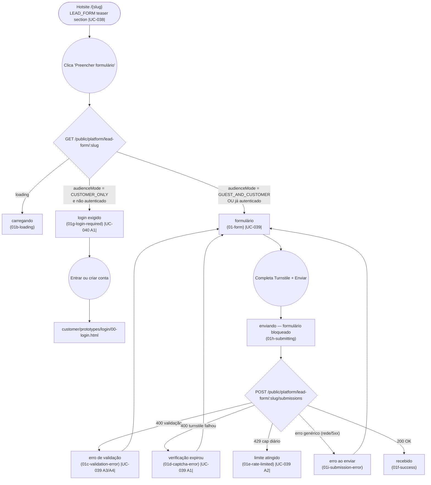

# GUEST — Submit Lead Form

**Actor(s):** GUEST
**Goal:** Submit interest via a tenant's lead-capture form (`LEAD_FORM` hotsite module) without authenticating, or get routed to login when the manager restricted the form to logged-in customers only
**UCs covered:** UC-038, UC-039, UC-040 (A1 branch)
**Status:** Draft — nothing built yet. Promoted from `docs/discovery/lead-form-module/lead-form-module.md` via `/discovery-to-milestone` (2026-08-23) for milestone `M20-LEAD-FORM-MODULE`.

## Flow

Not drawn as a separate node: a module disabled between teaser render and page load (UC-039 A6) — resolves to the existing generic `<Unavailable/>` state, same as any other disabled-module page, not a lead-form-specific screen.

## Pages referenced

| Page / Route | Component | Story | Status |
|---|---|---|---|
| Hotsite teaser section | `LeadFormModule` | — | ❌ Gap |
| `/[slug]/lead-form` | `LeadFormPage` | — | ❌ Gap |

## Open questions / gaps

- [ ] Milestone/story: not yet assigned — run `/story-discovery M20-Sxx` per `plan/M20-LEAD-FORM-MODULE.md`.
- [x] The login-required gate screen has no prior canonical `plan/journey/` precedent to reuse — verified during promotion that only a discovery-stage mockup existed (`docs/discovery/multivertical-booking/prototype/public-15-login-required.html`, itself unpromoted). `01g-login-required.html` here is this milestone's own, real, first promoted instance of this pattern.
- [ ] What happens after login from `01g-login-required.html` is covered by `customer/submit-lead-form.md`, not repeated here — this journey ends at the handoff to login.

## Prototype

Folder: `guest/prototypes/lead-form/`

| File | Screen | UC | Status |
|---|---|---|---|
| `index.html` | Navigation hub + dry-run checklist | — | ✅ Criado |
| `01-form.html` | Formulário — nome/e-mail/telefone + perguntas | UC-039 | ✅ Criado |
| `01b-loading.html` | Carregando o catálogo de perguntas | — | ✅ Criado |
| `01c-validation-error.html` | Erro de validação | UC-039 A3/A4 | ✅ Criado |
| `01d-captcha-error.html` | Verificação de segurança expirou | UC-039 A1 | ✅ Criado |
| `01e-rate-limited.html` | Limite de envios atingido | UC-039 A2 | ✅ Criado |
| `01h-submitting.html` | Enviando — formulário bloqueado, aguardando resposta | — | ✅ Criado |
| `01i-submission-error.html` | Erro genérico ao enviar (rede/5xx) | — | ✅ Criado |
| `01f-success.html` | Envio recebido | — | ✅ Criado |
| `01g-login-required.html` | Login exigido (`CUSTOMER_ONLY`) | UC-040 A1 | ✅ Criado |
| `dev-notes.md` | Implementation handoff | — | ✅ Criado |

Entry point (teaser on the hotsite) is `shared/hotsite.html`'s `.lead-form-teaser` section — a normal full-width section mirroring `BookingCtaModule.tsx`'s treatment, not a floating bubble like `ask-chatbot`'s widget (this module has its own dedicated page, so it earns a real section). No dedicated teaser screen in this folder.
