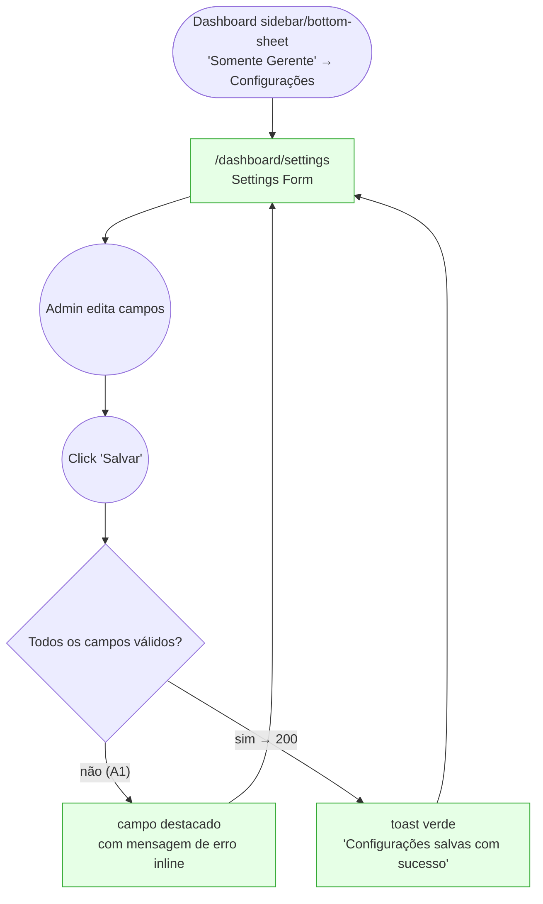

# MANAGER — Configurações (Tenant Settings)

**Actor(s):** MANAGER
**Goal:** Configure tenant-wide operational settings — business hours, timezone, cancellation window, loyalty point expiry, booking buffer, business contact info, and the chatbot's knowledge text — that govern booking, loyalty, and chatbot behavior across the tenant
**UCs covered:** UC-026
**Status:** Draft

## Flow

**Also shipped, undocumented by the original prototype (2026-07-31 docs audit):** the real form has 7 sections (General, Booking, Loyalty, **Notification**, Hours, Contact, **Localization**) vs. the prototype's 5, with ~9 additional fields (`autoApproveEnabled`, `minBookingAdvanceHours`, `maxBookingAdvanceDays`, `slotGranularityMinutes`, `welcomeStaffScreenDays`, `pointsPerCurrencyUnit`, `enableNotifications`, `expiryWarningDays`, `notificationMinPoints`), a structured address with ViaCEP zip-lookup instead of one free-text line, and social links (WhatsApp/Instagram/Facebook). This was a deliberate scope expansion on the `M13-S31` branch. **Resolved** — `01-settings-form.html` was already expanded the same day (2026-07-31) to add all 7 sections (see its own inline comment noting the expansion).

**Shipped (`M19-S13`; added 2026-08-08 as a gap, promoted from `docs/discovery/CHATBOT/CHATBOT.md` via `/discovery-to-milestone`):** an 8th section, **Chatbot**, containing only `chatbot.knowledgeText` (free-form business info/policy/FAQ text fed into UC-033's system-prompt assembly) — no client-side length cap; the server's `400 PLATFORM_SETTINGS_CHATBOT_KNOWLEDGE_TEXT_TOO_LONG` is the sole backstop, since the resolved max can be a per-tenant Ikaro-only override never exposed to this form. See `manager/prototypes/configuracoes/01d-chatbot-section.html` and its `dev-notes.md` entry. Cross-reference: UC-026 (this journey, edits the field) ↔ UC-033 (`guest/ask-chatbot.md`, reads the field).

## Pages referenced

| Page / Route | Component | Story | Status |
|---|---|---|---|
| `/dashboard/settings` | `SettingsForm` | M13-S31 | ✅ Done |

## Open questions / gaps

- [x] **BFF endpoint** — **Resolved/shipped.** `apps/bff/src/features/platform/tenant-settings.controller.ts` fully implements `GET`/`PATCH /tenants/settings` with Zod validation. No separate BFF story was needed after all — it shipped as part of `M13-S31`.
- [ ] **Two data sources, one form** — UC-026 step 1 describes loading "current `tenants.settings` JSONB," but `Nome do estabelecimento` and `Slug` are actually `tenants` table columns, not JSONB fields (UC step 5 confirms the save updates both `tenants.settings` *and* `tenants.name`). The prototype's single combined form needs to make this invisible to the admin — confirm section grouping (e.g. "Geral" / "Agendamento" / "Fidelidade" / "Contato") so the data-source split doesn't leak into the UI.
- [x] **Business hours editor UX** — **Resolved/shipped.** Per-day `TimePicker` + a closed-toggle, in the shipped `SettingsForm.tsx`.
- [ ] **Audit log surface** — UC-026 step 6 says the system logs "who changed what and when," but CLAUDE.md §6 lists "audit log view" as an explicitly missing/undocumented UC. Treat as out of scope for this journey's prototype (no "Histórico de alterações" panel) unless the user says otherwise — don't invent a screen for an undocumented capability.
- [x] **Timezone field** — **Resolved/shipped.** A `<select>` driven by `resolveSettingsLocalization`, in the shipped `SettingsForm.tsx`.

## Prototype

Folder: `manager/prototypes/configuracoes/`

| File | Screen | UC | Status |
|---|---|---|---|
| `index.html` | Navigation hub + dry-run checklist (flags the missing BFF endpoint) | — | ✅ Criado |
| `01-settings-form.html` | Settings form (Geral / Agendamento / Fidelidade / Horário / Contato) | UC-026 | ✅ Criado |
| `01b-validation-error.html` | Invalid field value error | UC-026 A1 | ✅ Criado |
| `01c-saved-success.html` | Save confirmation | UC-026 | ✅ Criado |
| `01d-chatbot-section.html` | Full form + new "Chatbot" section (`knowledgeText`, shipped `M19-S13`) | UC-026 | ✅ Criado |
| `dev-notes.md` | Implementation handoff (BFF gap detailed) | — | ✅ Criado |
