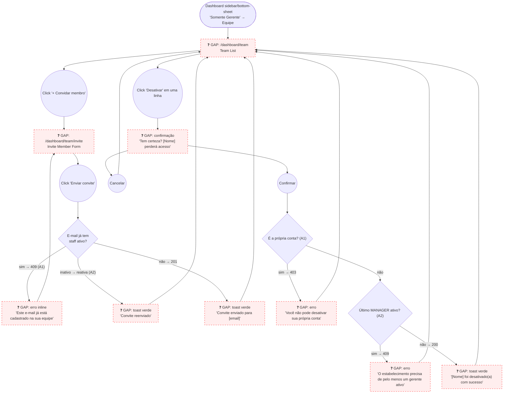

# MANAGER — Equipe (Team Management)

**Actor(s):** MANAGER
**Goal:** Invite new staff members and deactivate departing ones, keeping the team list authoritative for the tenant
**UCs covered:** UC-028, UC-029
**Status:** Draft

## Flow

## Pages referenced

| Page / Route | Component | Story | Status |
|---|---|---|---|
| `/dashboard/team` | `TeamListPage` | TBD | 📋 Gap |
| `/dashboard/team/invite` | `InviteStaffForm` (modal or page — TBD) | TBD | 📋 Gap |
| Deactivate confirmation | `DeactivateStaffSheet` or inline confirm | TBD | 📋 Gap |

## Open questions / gaps

- [ ] **Backend/BFF status** — both fully implemented and `MANAGER`-guarded: `POST /staff/invite`, `PATCH /staff/:id/deactivate` (confirmed via `/uc-audit UC-026,UC-027,UC-028,UC-029`, 2026-06-16). This is a frontend-only gap — no new backend/BFF story required, just thinner `.http` coverage on the BFF side for invite/deactivate (engineering hygiene, not blocking).
- [ ] **List scope** — does the team list show deactivated members too (with an "Inativo" badge, mirroring the active/inactive tabs pattern from `staff/servicos.md`), or only active staff with deactivated members dropped from view entirely?
- [ ] **Invite form surface** — full page (`/dashboard/team/invite`) vs. modal/sheet over the list. `staff/servicos.md` used full pages for create/edit; confirm same pattern here for consistency, or prefer a lighter sheet since the form is only 4 fields.
- [x] **Resend invite affordance** — resolved on the `M13-S43` branch (2026-07-06): `MemberRow.tsx`'s "Reenviar convite" is a direct one-click button, not a link back to the invite form. It calls `POST /staff/invite` with the row's existing name (split into firstName/lastName) and role — no retyping, no navigation.
- [ ] **Role badge** — each row should show a `STAFF`/`MANAGER` badge (reuse `.role-badge` pattern from `shared/dashboard-shell.html`). Confirm visual treatment matches the sidebar footer's existing role badge.
- [ ] **Deactivate confirmation surface** — dedicated confirmation step (route or sheet) vs. inline browser-native confirm. `staff/servicos.md` prototyped a dedicated confirmation screen for the analogous service-deactivation flow; recommend the same here for consistency.

## Prototype

Folder: `manager/prototypes/equipe/`

| File | Screen | UC | Status |
|---|---|---|---|
| `index.html` | Navigation hub + dry-run checklist | — | ✅ Criado |
| `01-team-list.html` | Team list (Ativos / Convites pendentes / Inativos) | — | ✅ Criado |
| `02-invite-form.html` | Invite member form | UC-028 | ✅ Criado |
| `02b-invite-error.html` | Duplicate active email error | UC-028 A1 | ✅ Criado |
| `03-deactivate-confirm.html` | Deactivation confirmation | UC-029 | ✅ Criado |
| `03b-deactivate-self-error.html` | Self-deactivation blocked | UC-029 A1 | ✅ Criado |
| `03c-deactivate-lastmanager-error.html` | Last active manager blocked | UC-029 A2 | ✅ Criado |
| `dev-notes.md` | Implementation handoff | — | ✅ Criado |
