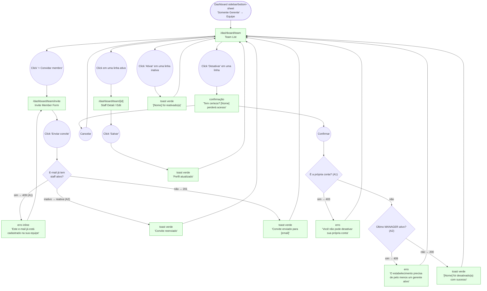

# MANAGER — Equipe (Team Management)

**Actor(s):** MANAGER
**Goal:** Invite new staff members and deactivate departing ones, keeping the team list authoritative for the tenant
**UCs covered:** UC-028, UC-029
**Status:** Draft

## Flow

```mermaid
flowchart TD
    classDef existing fill:#e6ffe6,stroke:#3a3
    classDef gap stroke:#f00,stroke-dasharray: 5 5,fill:#fee

    Start(["Dashboard sidebar/bottom-sheet<br/>'Somente Gerente' → Equipe"]) --> List["/dashboard/team<br/>Team List"]

    List --> InviteBtn(("Click '+ Convidar membro'"))
    List --> DeactivateBtn(("Click 'Desativar' em uma linha"))

    %% UC-028 — Invite
    InviteBtn --> InviteForm["/dashboard/team/invite<br/>Invite Member Form"]
    InviteForm --> InviteSubmit(("Click 'Enviar convite'"))
    InviteSubmit --> EmailCheck{"E-mail já tem<br/>staff ativo?"}
    EmailCheck -- "sim → 409 (A1)" --> EmailError["erro inline<br/>'Este e-mail já está cadastrado na sua equipe'"]
    EmailError --> InviteForm
    EmailCheck -- "inativo → reativa (A2)" --> ReactivateSuccess["toast verde<br/>'Convite reenviado'"]
    EmailCheck -- "não → 201" --> InviteSuccess["toast verde<br/>'Convite enviado para [email]'"]
    ReactivateSuccess --> List
    InviteSuccess --> List

    %% UC-029 — Deactivate
    DeactivateBtn --> DeactivateConfirm["confirmação<br/>'Tem certeza? [Nome] perderá acesso'"]
    DeactivateConfirm --> ConfirmYes(("Confirmar"))
    DeactivateConfirm --> ConfirmNo(("Cancelar"))
    ConfirmNo --> List
    ConfirmYes --> SelfCheck{"É a própria conta? (A1)"}
    SelfCheck -- "sim → 403" --> SelfError["erro<br/>'Você não pode desativar sua própria conta'"]
    SelfCheck -- "não" --> LastManagerCheck{"Último MANAGER ativo? (A2)"}
    LastManagerCheck -- "sim → 409" --> LastManagerError["erro<br/>'O estabelecimento precisa de pelo menos um gerente ativo'"]
    LastManagerCheck -- "não → 200" --> DeactivateSuccess["toast verde<br/>'[Nome] foi desativado(a) com sucesso'"]
    SelfError --> List
    LastManagerError --> List
    DeactivateSuccess --> List

    %% UC-030 — Edit profile
    List --> RowClick(("Click em uma linha ativa"))
    RowClick --> EditDetail["/dashboard/team/[id]<br/>Staff Detail / Edit"]
    EditDetail --> EditSubmit(("Click 'Salvar'"))
    EditSubmit --> EditSuccess["toast verde<br/>'Perfil atualizado'"]
    EditSuccess --> List

    %% UC-031 — Reactivate
    List --> ActivateBtn(("Click 'Ativar' em uma linha inativa"))
    ActivateBtn --> ActivateSuccess["toast verde<br/>'[Nome] foi reativado(a)'"]
    ActivateSuccess --> List

    class List,InviteForm,EmailError,ReactivateSuccess,InviteSuccess,DeactivateConfirm,SelfError,LastManagerError,DeactivateSuccess,EditDetail,EditSuccess,ActivateSuccess existing
```

**Also shipped, not originally covered by this journey (2026-07-31 docs audit):** UC-030 (Admin Edits Staff Member Profile, `/dashboard/team/[id]`) and UC-031 (Admin Reactivates Staff Member, one-click "Ativar" on deactivated rows) — both `M13-S43`/`M13-S44`, ✅ Done. Prototype coverage: `04-staff-detail-edit.html` exists for UC-030 — see the Prototype table below; UC-031's one-click reactivate has no dedicated screen (it's a row action on `01-team-list.html`).

## Pages referenced

| Page / Route | Component | Story | Status |
|---|---|---|---|
| `/dashboard/team` | `TeamListPage` | M13-S43 | ✅ Done |
| `/dashboard/team/invite` | `InviteForm` | M13-S43 | ✅ Done |
| Deactivate confirmation | `DeactivateConfirmPage` | M13-S43 | ✅ Done |
| `/dashboard/team/[id]` (UC-030, not originally in this journey) | `StaffDetailPage` | M13-S43 | ✅ Done |
| Reactivate — one-click "Ativar" (UC-031, not originally in this journey) | inline on `TeamListPage` row | M13-S44 | ✅ Done |

## Open questions / gaps

- [x] **Backend/BFF status** — both fully implemented and `MANAGER`-guarded: `POST /staff/invite`, `PATCH /staff/:id/deactivate`. Shipped as part of `M13-S43`.
- [x] **List scope** — **Resolved/shipped.** `TeamListPage` shows Ativos / Convites pendentes / Inativos, matching the prototype.
- [x] **Invite form surface** — **Resolved/shipped.** Full page (`InviteForm`), matching `staff/servicos.md`'s pattern.
- [x] **Resend invite affordance** — resolved on the `M13-S43` branch (2026-07-06): `MemberRow.tsx`'s "Reenviar convite" is a direct one-click button, not a link back to the invite form. It calls `POST /staff/invite` with the row's existing name (split into firstName/lastName) and role — no retyping, no navigation.
- [x] **Role badge** — **Resolved/shipped**, reusing the `.role-badge` pattern.
- [x] **Deactivate confirmation surface** — **Resolved/shipped.** Dedicated confirmation page (`DeactivateConfirmPage`), matching `staff/servicos.md`'s pattern.

## Prototype

Folder: `manager/prototypes/equipe/`

| File | Screen | UC | Status |
|---|---|---|---|
| `index.html` | Navigation hub + dry-run checklist | — | ✅ Criado |
| `01-team-list.html` | Team list (Ativos / Convites pendentes / Inativos) | — | ✅ Criado |
| `02-invite-form.html` | Invite member form | UC-028 | ✅ Criado |
| `02b-invite-error.html` | Duplicate active email error | UC-028 A1 | ✅ Criado |
| `03-deactivate-confirm.html` | Deactivation confirmation | UC-029 | ✅ Criado |
| `03b-deactivate-self-error.html` | Self-deactivation blocked | UC-029 A1 | ✅ Criado |
| `03c-deactivate-lastmanager-error.html` | Last active manager blocked | UC-029 A2 | ✅ Criado |
| `04-staff-detail-edit.html` | Staff detail / edit profile page | UC-030 | ✅ Criado |
| `dev-notes.md` | Implementation handoff | — | ✅ Criado |
