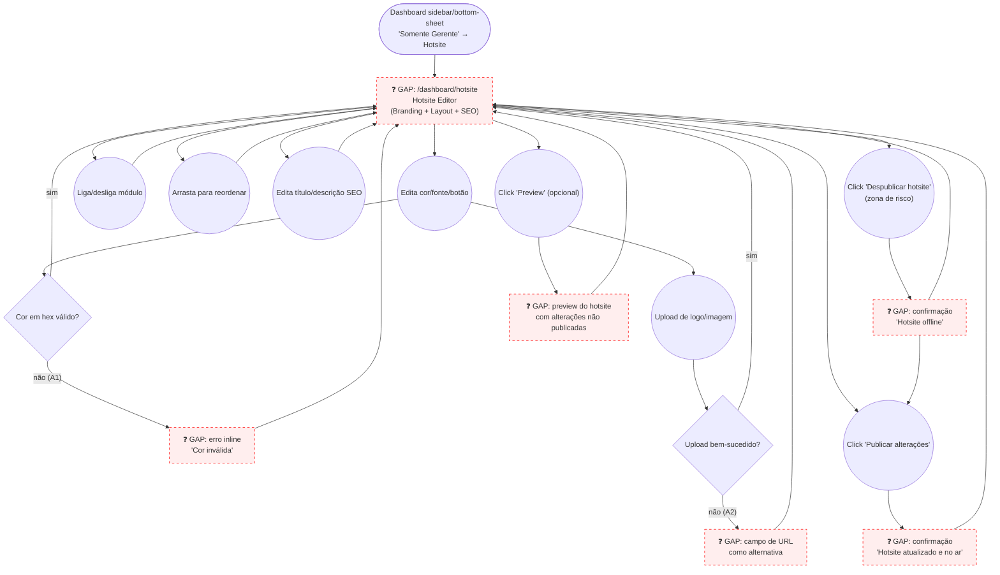

# MANAGER — Hotsite (Branding & Content)

**Actor(s):** MANAGER
**Goal:** Customize the public hotsite's branding (colors, fonts, button style) and content modules (toggle/reorder/configure), set SEO overrides, and publish changes live
**UCs covered:** UC-027
**Status:** Draft

## Flow

## Pages referenced

| Page / Route | Component | Story | Status |
|---|---|---|---|
| `/dashboard/hotsite` | `HotsiteEditorPage` | TBD | 📋 Gap |
| Preview pane | `HotsitePreview` (draft-state render) | TBD | 📋 Gap |

## Open questions / gaps

- [x] **Branding field set expanded** — per `/uc-audit UC-026,UC-027,UC-028,UC-029` (2026-06-16) and your decision to cover the full set, `docs/04-USE_CASES.md` UC-027 Section A lists 13 branding fields (colors, fonts, logo, border radius, button style, spacing, shadow style, button colors), not just the original 4. Resolved further during M13-S35 discovery (2026-07-07): the real `HotsiteBrandingResponse` type carries 5 more fields beyond those 13 (`heroBgStyle`, `alternateSectionBg`, `dividerStyle`, `brandName`, `brandTagline`) — all 18 are in scope for M13-S35, grouped into 5 sub-sections ("Cores" / "Logo e identidade" / "Tipografia" / "Forma e estilo" / "Ritmo visual"). See `plan/journey/manager/prototypes/hotsite/dev-notes.md` and `plan/M13-DASHBOARD-FRONTEND.md` § M13-S35.
- [ ] **Per-module configuration** — the toggle/reorder list shown in the flow above is the simple case. Each module type has its own config shape (HERO: title/subtitle/background image; GALLERY: limit; CONTACT: 4 independent toggles for address/phone/email/map; TESTIMONIALS: grid vs. carousel layout). Does each module need its own drill-down config panel, or are all module configs edited inline in the list? This needs its own decision before the prototype can show real module-editing screens, not just toggle/reorder.
- [ ] **Preview semantics** — `is_published` gates what the public hotsite shows, so "Preview" must render the *draft* (unsaved/unpublished) state. Is this a client-side live preview (iframe re-rendering with draft props), or does it need a preview-mode BFF parameter/token that temporarily serves draft config to the public hotsite route? This is an engineering design question, not just a UI one.
- [x] **Unpublish action** — resolved: the editor exposes "Despublicar hotsite" in a danger-zone section (per `01-hotsite-editor.html`), with its own confirmation screen (`03b-unpublish-success.html`). See the `Unpublish`/`UnpublishSuccess` nodes in the flow above.

## Prototype

Folder: `manager/prototypes/hotsite/`

| File | Screen | UC | Status |
|---|---|---|---|
| `index.html` | Navigation hub + dry-run checklist | — | ✅ Criado |
| `01-hotsite-editor.html` | Editor — Branding (13 fields) / Layout (7 modules) / SEO tabs | UC-027 | ✅ Criado |
| `01b-color-error.html` | Invalid hex color error | UC-027 A1 | ✅ Criado |
| `01c-image-upload-fallback.html` | Image upload failure → URL fallback | UC-027 A2 | ✅ Criado |
| `01d-module-config-hero.html` | Per-module config drill-down (HERO, representative example) | — | ✅ Criado |
| `02-preview.html` | Draft preview mock | — | ✅ Criado |
| `03-publish-success.html` | Publish confirmation | UC-027 | ✅ Criado |
| `03b-unpublish-success.html` | Unpublish confirmation (zona de risco) | UC-027 | ✅ Criado |
| `dev-notes.md` | Implementation handoff (preview semantics + per-module config flagged as open) | — | ✅ Criado |
