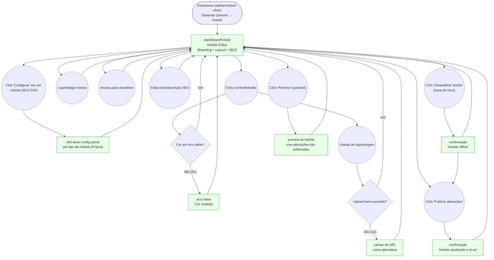

# MANAGER — Hotsite (Branding & Content)

**Actor(s):** MANAGER
**Goal:** Customize the public hotsite's branding (colors, fonts, button style) and content modules (toggle/reorder/configure), set SEO overrides, and publish changes live
**UCs covered:** UC-027
**Status:** Draft

## Flow

```mermaid
flowchart TD
    classDef existing fill:#e6ffe6,stroke:#3a3
    classDef gap stroke:#f00,stroke-dasharray: 5 5,fill:#fee

    Start(["Dashboard sidebar/bottom-sheet<br/>'Somente Gerente' → Hotsite"]) --> Editor["/dashboard/hotsite<br/>Hotsite Editor<br/>(Branding + Layout + SEO)"]

    Editor --> EditBranding(("Edita cor/fonte/botão"))
    Editor --> ToggleModule(("Liga/desliga módulo"))
    Editor --> ReorderModule(("Arrasta para reordenar"))
    Editor --> ConfigModule(("Click 'Configurar' em um módulo (M13-S36)"))
    ConfigModule --> ModuleConfigPanel["drill-down config panel<br/>por tipo de módulo (9 tipos)"]
    ModuleConfigPanel --> Editor
    Editor --> EditSeo(("Edita título/descrição SEO"))

    EditBranding --> ColorValid{"Cor em hex válido?"}
    ColorValid -- "não (A1)" --> ColorError["erro inline<br/>'Cor inválida'"]
    ColorError --> Editor
    ColorValid -- "sim" --> Editor

    EditBranding --> ImageUpload(("Upload de logo/imagem"))
    ImageUpload --> UploadOk{"Upload bem-sucedido?"}
    UploadOk -- "não (A2)" --> UrlFallback["campo de URL<br/>como alternativa"]
    UrlFallback --> Editor
    UploadOk -- "sim" --> Editor

    ToggleModule --> Editor
    ReorderModule --> Editor
    EditSeo --> Editor

    Editor --> PreviewBtn(("Click 'Preview' (opcional)"))
    PreviewBtn --> PreviewPane["preview do hotsite<br/>com alterações não publicadas"]
    PreviewPane --> Editor

    Editor --> PublishBtn(("Click 'Publicar alterações'"))
    PublishBtn --> PublishSuccess["confirmação<br/>'Hotsite atualizado e no ar'"]
    PublishSuccess --> Editor

    Editor --> UnpublishBtn(("Click 'Despublicar hotsite'<br/>(zona de risco)"))
    UnpublishBtn --> UnpublishSuccess["confirmação<br/>'Hotsite offline'"]
    UnpublishSuccess --> PublishBtn
    UnpublishSuccess --> Editor

    class Editor,ColorError,UrlFallback,PreviewPane,PublishSuccess,UnpublishSuccess,ModuleConfigPanel existing
```

**Also drifted from the prototype's documented shape (2026-07-31 docs audit):** the real branding editor has 5 sections/18 fields (adds `heroBgStyle`/`alternateSectionBg`/`dividerStyle`/`brandName`/`brandTagline` — already correctly described in `manager/prototypes/hotsite/dev-notes.md`, just not in the HTML screen itself) vs. the 13-field/4-section prototype; module count is 8 (`FOOTER` added during `M13-S36`) vs. the documented 7; SEO limits are 60/158 chars (real-world Google truncation points) vs. the documented 70/160, and there's an OG-image field the prototype doesn't show. **Resolved** — `01-hotsite-editor.html` was already updated the same day (2026-07-31) to add all of this (see its inline "adicionado 2026-07-31" comments). **Module count updated again 2026-08-08:** now 9 (`CHATBOT` added — promoted from `docs/discovery/CHATBOT/CHATBOT.md` via `/discovery-to-milestone`, UC-027 Section B, `docs/15-HOTSITE_DYNAMIC_ARCHITECTURE.md` § CHATBOT). Unlike `FOOTER`, `CHATBOT` is not yet shipped — see "Open questions / gaps" below.

## Pages referenced

| Page / Route | Component | Story | Status |
|---|---|---|---|
| `/dashboard/hotsite` | `HotsitePage` | M13-S35/S36/S37 | ✅ Done |
| Preview pane | `HotsitePreview` (draft-state render) | M13-S37 | ✅ Done |

## Open questions / gaps

- [x] **Branding field set expanded** — per `/uc-audit UC-026,UC-027,UC-028,UC-029` (2026-06-16) and your decision to cover the full set, `docs/04-USE_CASES.md` UC-027 Section A lists 13 branding fields (colors, fonts, logo, border radius, button style, spacing, shadow style, button colors), not just the original 4. Resolved further during M13-S35 discovery (2026-07-07): the real `HotsiteBrandingResponse` type carries 5 more fields beyond those 13 (`heroBgStyle`, `alternateSectionBg`, `dividerStyle`, `brandName`, `brandTagline`) — all 18 are in scope for M13-S35, grouped into 5 sub-sections ("Cores" / "Logo e identidade" / "Tipografia" / "Forma e estilo" / "Ritmo visual"). See `plan/journey/manager/prototypes/hotsite/dev-notes.md` and `plan/M13-DASHBOARD-FRONTEND.md` § M13-S35.
- [x] **Per-module configuration** — **Resolved/shipped (`M13-S36`).** Each module type has its own drill-down config panel (e.g. `FooterConfigPanel.tsx` for the `FOOTER` module type, added in the same story). The prototype's `01d-module-config-hero.html` shows only the HERO case; the other 7 module types' panels were built directly from the real types without new UX prototypes (an explicit `M13-S36` decision) — candidate for the next prototype touch-up pass if more panels are wanted for review.
- [x] **Preview semantics** — resolved — client-side live preview, confirmed shipped. `HotsiteEditor` passes a `draft: HotsiteAdminContentResponse` prop directly into `apps/web/features/platform/components/hotsite/HotsitePreview.tsx`, which renders the module tree client-side from that prop. No BFF preview-mode parameter/token exists or is needed.
- [x] **Unpublish action** — resolved: the editor exposes "Despublicar hotsite" in a danger-zone section (per `01-hotsite-editor.html`), with its own confirmation screen (`03b-unpublish-success.html`). See the `Unpublish`/`UnpublishSuccess` nodes in the flow above.
- [ ] **CHATBOT config panel not yet built** — the other 8 module types each got a real `<Module>ConfigPanel.tsx` component in `M13-S36` (`apps/web/features/platform/components/hotsite/modules/`, e.g. `HeroConfigPanel.tsx`, `FooterConfigPanel.tsx`). `CHATBOT` needs the identical treatment — `ChatbotConfigPanel.tsx` — once a story exists; unlike the other 7 (which only needed a docs/prototype touch-up since the panels already shipped), this one is genuinely new code, not yet built. See `manager/prototypes/hotsite/01e-module-config-chatbot.html` and its `dev-notes.md` entry.

## Prototype

Folder: `manager/prototypes/hotsite/`

| File | Screen | UC | Status |
|---|---|---|---|
| `index.html` | Navigation hub + dry-run checklist | — | ✅ Criado |
| `01-hotsite-editor.html` | Editor — Branding (13 fields) / Layout (7 modules) / SEO tabs | UC-027 | ✅ Criado |
| `01b-color-error.html` | Invalid hex color error | UC-027 A1 | ✅ Criado |
| `01c-image-upload-fallback.html` | Image upload failure → URL fallback | UC-027 A2 | ✅ Criado |
| `01d-module-config-hero.html` | Per-module config drill-down (HERO, representative example) | — | ✅ Criado |
| `01e-module-config-chatbot.html` | Per-module config drill-down (CHATBOT, 9º tipo — não implementado) | UC-027 Section B | ✅ Criado |
| `02-preview.html` | Draft preview mock | — | ✅ Criado |
| `03-publish-success.html` | Publish confirmation | UC-027 | ✅ Criado |
| `03b-unpublish-success.html` | Unpublish confirmation (zona de risco) | UC-027 | ✅ Criado |
| `dev-notes.md` | Implementation handoff (preview semantics + per-module config flagged as open) | — | ✅ Criado |
