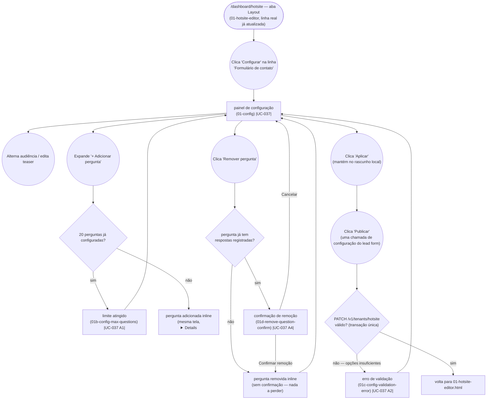

# MANAGER — Configure the Lead Form Module

**Actor(s):** MANAGER
**Goal:** Configure the `LEAD_FORM` hotsite module — who can respond, teaser copy, and up to 20 custom questions — entirely inline on one screen
**UCs covered:** UC-037
**Status:** Shipped in M20-S08. Promoted from `docs/discovery/lead-form-module/lead-form-module.md` via `/discovery-to-milestone` (2026-08-23) for milestone `M20-LEAD-FORM-MODULE`.

## Flow

Not drawn as a separate node (small, same-page state per README's "minor conditional content" rule): empty question label (UC-037 A3). The module-disable toggle (UC-037 A5) is also not drawn here — it's a separate, pre-existing control on the Layout tab row itself (`PATCH /v1/tenants/hotsite`), not part of this screen's own flow at all.

## Pages referenced

| Page / Route | Component | Story | Status |
|---|---|---|---|
| `/dashboard/hotsite` (Layout tab, new row) | `HotsiteEditorMainView` | M20-S08 | ✅ Shipped |
| Lead Form config drill-down | `LeadFormConfigPanel` | M20-S08 | ✅ Shipped |

## Open questions / gaps

- [x] M20-S08 implements UC-037's manager configuration flow.
- [x] Retention window and daily/per-IP submission caps (`settings.leadForm.{retentionMonths,maxSubmissionsPerDay,maxSubmissionsPerIpPerDay}`, UC-042) are **not** configured here — all three live on the existing tenant settings page (`manager/prototypes/configuracoes/01e-lead-form-section.html`). All three are normal tenant-editable settings (post-review redesign 2026-08-24 corrected the two caps away from an Ikaro-only deviation Chatbot's cost caps use — Lead Form submissions have no equivalent Ikaro cost exposure). No new screen for any of it in this journey.
- [x] Mobile navigation keeps the existing icons unchanged; "Leads" is placed inside the existing "Mais" sheet.

## Prototype

Folder: `manager/prototypes/lead-form/`

| File | Screen | UC | Status |
|---|---|---|---|
| `index.html` | Navigation hub | — | ✅ Criado |
| `01-config.html` | Configuração (audiência, teaser, perguntas inline e reordenação) | UC-037 | ✅ Criado |
| `01b-config-max-questions.html` | Limite de 20 perguntas atingido | UC-037 A1 | ✅ Criado |
| `01c-config-validation-error.html` | Pergunta com menos de 2 opções | UC-037 A2 | ✅ Criado |
| `01d-remove-question-confirm.html` | Confirmação ao remover pergunta com respostas já recebidas | UC-037 A4 | ✅ Criado |
| `dev-notes.md` | Implementation handoff | — | ✅ Criado |

Entry point is the real `manager/prototypes/hotsite/01-hotsite-editor.html`, updated in place with the new `LEAD_FORM` row (not a discovery-illustrative copy — this promotion edited the actual shipped file).
