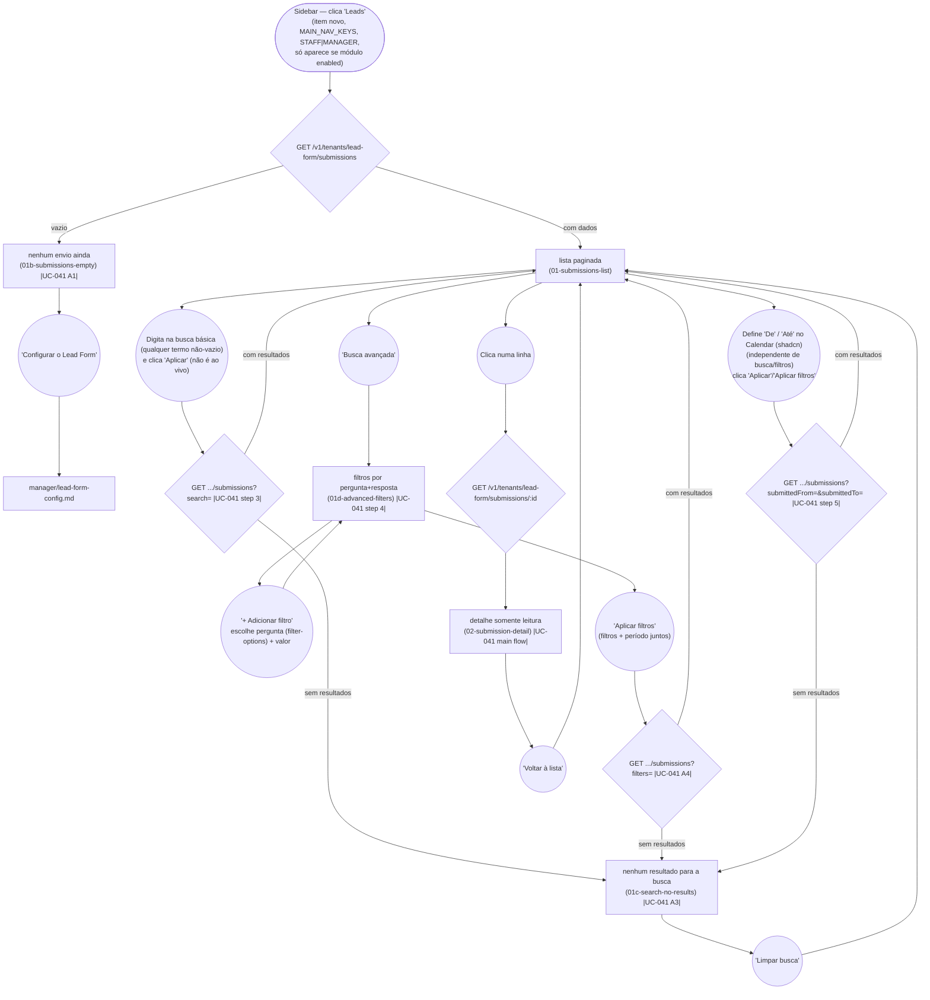

# MANAGER/STAFF — View Leads Submissions

**Actor(s):** MANAGER, STAFF
**Goal:** Review visitor submissions to the lead-capture form on a dedicated screen
**UCs covered:** UC-041
**Status:** ✅ Done — base list/detail + gated nav (M20-S10), search backend/BFF (M20-S12), and search frontend UI (M20-S13, basic/advanced/date-range, all button-driven — see Flow section below). Promoted from `docs/discovery/lead-form-module/lead-form-module.md` via `/discovery-to-milestone` (2026-08-23) for milestone `M20-LEAD-FORM-MODULE`.

**Gated, not unconditional (post-review redesign, 2026-08-24; implementation corrected during M20-S10 story-discovery, 2026-08-27):** the "Leads" sidebar item only renders when `GET /v1/tenants/lead-form/status` reports `enabled: true` for this tenant (fetched server-side by the shared `loadDashboardShellContext()`, `apps/web/shells/dashboard/model/dashboard-shell-context.ts` — called independently by every top-level dashboard section's own `layout.tsx`, since there is no single shared `app/dashboard/layout.tsx` — passed down through `DashboardShell` → `Sidebar`/`BottomNav`/`MoreSheet`) — a tenant that never turned the module on never sees this item, since it would otherwise point at a permanently empty screen.

## Flow

Not drawn as a separate node: a submission whose snapshot references a since-removed question (UC-041 A2) — renders identically to any other detail view, since the snapshot is self-contained.

**Search added post-promotion (2026-08-23, M20-S12/S13):** the manager can search two ways — a **basic** free-text box (name/email/any question/any answer, OR-ed) and **advanced** structured filters (one or more specific question+answer pairs, ANDed — e.g. "estado civil = casado" AND "mora = São Paulo"). Backed by a new `platform.lead_form_answers` child table, one row per question per submission, written once alongside the JSONB snapshot at insert time (`docs/13-DATABASE_SCHEMA.md`) — never a live/derived query, and never a flattened single-text blob (that design was drafted first, then replaced once it became clear it couldn't correctly AND per-question filters). Added as a real replacement for the removed CSV export (Non-Goals) — a way to find a specific lead without exporting anything. **Button-driven, not live/debounced (M20-S13 story-discovery, 2026-08-27, overriding an earlier debounced draft):** the search box and the date range share one "Aplicar"/"Limpar" pair (basic mode) or "Aplicar filtros"/"Limpar filtros" pair (advanced mode) — nothing fires while typing or picking dates, only on the explicit click. Switching modes (via "Busca avançada"/"Voltar para busca simples") always drops the other mode's active query but never the date range; "Limpar"/"Limpar filtros" reset that mode's own inputs + the date range without leaving the current mode.

**Date range added the same day (`submittedFrom`/`submittedTo`):** orthogonal to both search modes — combines with either or stands alone. Interpreted in the tenant's own timezone via `localDateTimeToUTCIso()` (`apps/backend/src/shared/utils/calendar-date.ts`), the same real utility Chatbot's own tenant-timezone-aware daily-cap bucketing already uses — never the UTC-naive `startOfDayUTC()`/`todayUTC()` pair from the same file, which exists only for a platform-wide (not tenant-scoped) breaker. Uses the existing `(tenant_id, submitted_at DESC)` index — no new index needed. Real UI uses shadcn/ui's `Calendar` (range mode, via `Popover`+`Calendar`) — the prototype's native `<input type="date">` pair was a stand-in only, per this codebase's own "prefer shadcn/ui primitives" convention.

## Pages referenced

| Page / Route | Component | Story | Status |
|---|---|---|---|
| `/dashboard/leads` | `LeadFormSubmissionsList` | M20-S10 | ✅ Done |
| `/dashboard/leads/[id]` | `LeadFormSubmissionDetail` | M20-S10 | ✅ Done |

## Open questions / gaps

- [x] Base list/detail + gated nav: `M20-S10`. Search backend/BFF: `M20-S12`. Search frontend UI (basic/advanced/date-range, button-driven): `M20-S13`.
- [x] **No CSV export** — the discovery's original CAND-06 was removed from this milestone's scope entirely, not merely deferred (see `plan/M20-LEAD-FORM-MODULE.md` Non-Goals: current volume doesn't justify new export infrastructure, and a generic async report module is a future initiative once a second real consumer exists; UC-043's unconditional retention purge means there's no path to preserve a lead beyond its retention window besides the read-only detail view — an accepted risk, stated explicitly). Not a gap to fill later inside this journey — a deliberate scope decision. **Search (M20-S12/S13, added 2026-08-23) is the replacement capability** for finding a specific lead without export — see the Flow section above.

## Prototype

Folder: `manager/prototypes/leads/`

| File | Screen | UC | Status |
|---|---|---|---|
| `index.html` | Navigation hub | — | ✅ Criado |
| `01-submissions-list.html` | Lista paginada + busca básica + intervalo de datas (M20-S13) | UC-041 | ✅ Criado |
| `01b-submissions-empty.html` | Nenhum envio ainda | UC-041 A1 | ✅ Criado |
| `01c-search-no-results.html` | Nenhum resultado para a busca/filtros/intervalo | UC-041 A3 | ✅ Criado |
| `01d-advanced-filters.html` | Busca avançada — filtros por pergunta+resposta (ANDed) + intervalo de datas | UC-041 step 4-5, A4-A5 | ✅ Criado |
| `02-submission-detail.html` | Detalhe somente leitura | UC-041 | ✅ Criado |
| `dev-notes.md` | Implementation handoff | — | ✅ Criado |
