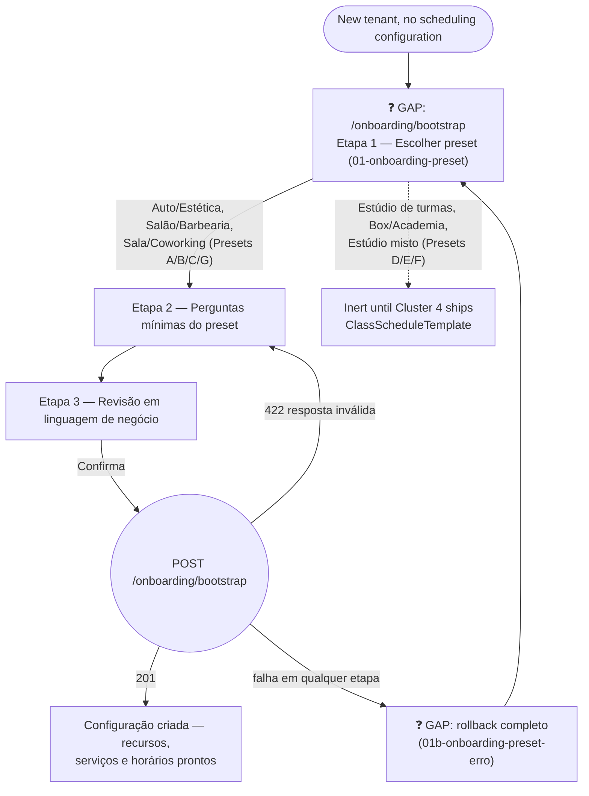

# MANAGER — Onboarding Preset Wizard (New-Tenant Bootstrap)

**Actor(s):** MANAGER  
**Goal:** Bootstrap a brand-new, empty tenant's first `Resource`/`Service` graph from a business-model preset, in business language rather than the raw domain model  
**UCs covered:** UC-075 (Presets A/B/C/G — appointment-only, this cluster; Presets D/E/F SESSION completion arrives with Cluster 4)  
**Status:** ❓ Gap — M21, Multi-Vertical Scheduling, Cluster 3. No story assigned yet.

> Promoted from `docs/discovery/multivertical-booking/multivertical-booking_ONBOARDING_PRESETS.md` and `multivertical-booking_USECASES.md` (CAND-51) via `/discovery-to-milestone`. This wizard is the **only** path allowed to create an empty tenant's first resource/service graph — ordinary resource/service CRUD (UC-045, UC-050 etc.) only makes sense once bootstrap has run. See `docs/02-DOMAIN_MODEL.md` and `docs/discovery/multivertical-booking/multivertical-booking_ONBOARDING_PRESETS.md` for the full preset taxonomy (7 presets, 13 underlying scheduling models) this wizard translates into plain business questions.

## Flow

## Pages referenced

| Page / Route | Component | Story | Status |
|---|---|---|---|
| `/onboarding/bootstrap` | `OnboardingPresetWizard` | — | ❓ GAP |

## BFF calls in this flow

| Call | When | Roles |
|---|---|---|
| `POST /v1/onboarding/bootstrap` | Wizard confirms preset + answers | MANAGER |

Full request/response shapes: `docs/14-API_CONTRACTS.md` § Tenant Onboarding Bootstrap.

## Prototype

Folder: `manager/prototypes/onboarding/` — relocated from `docs/discovery/multivertical-booking/prototype/manager-14-onboarding-preset.html` / `manager-14b-onboarding-preset-erro.html`.

| File | Screen | UC | Status |
|---|---|---|---|
| `01-onboarding-preset.html` | Preset choice → minimum questions → review (Estúdio de turmas example shown) | UC-075 | ❓ GAP |
| `01b-onboarding-preset-erro.html` | Bootstrap failure — full rollback | UC-075 A3 | ❓ GAP |

**Not yet prototyped:** the appointment-only presets (A/B/C/G) this cluster actually delivers — the discovery's own worked example walks the SESSION preset (D, Estúdio de turmas) end-to-end; the implementing story needs an equivalent worked example for at least one appointment-only preset (e.g. Preset A, Auto/Estética) before this is implementation-ready.

## Open questions / gaps

- [ ] No story exists yet — needs `/story-discovery` once the M21 milestone file is drafted.
- [ ] This cluster only delivers Presets A/B/C/G (appointment-only) — the prototype's worked example is Preset D (SESSION), which is inert until Cluster 4 ships. The implementing story must either re-target the worked example to an appointment preset or explicitly scope the SESSION branch out.
- [ ] Final preset copy/labels are explicitly deferred to a copy round per `multivertical-booking_ONBOARDING_PRESETS.md` §6 — not a blocker for implementation, but not final either.
