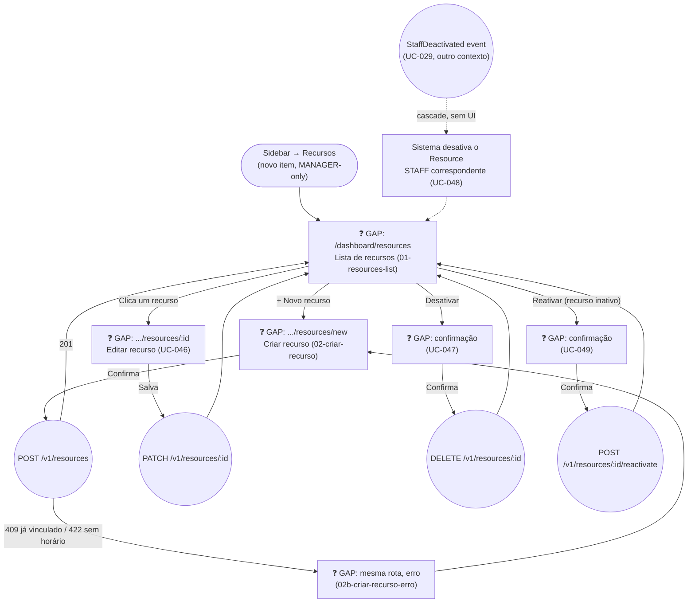

# MANAGER — Recursos (Resource Management)

**Actor(s):** MANAGER  
**Goal:** Create, view, edit, deactivate, and reactivate the tenant's bookable `Resource` rows (`LOCATION`/`STAFF`/`ROOM`/`EQUIPMENT`) — the foundation the rest of M21's multi-vertical scheduling model builds on  
**UCs covered:** UC-044, UC-045, UC-046, UC-047, UC-048, UC-049 (`docs/04-USE_CASES.md`)  
**Status:** 🟡 Partial — backend + BFF shipped in M21-S01 (`GET/POST/PATCH/DELETE /v1/resources`, `POST /v1/resources/:id/reactivate`, all live). Frontend pages below remain ❓ GAP — lands with M21-S04.

> Promoted from `docs/discovery/multivertical-booking/multivertical-booking.md` via `/discovery-to-milestone`. See `docs/02-DOMAIN_MODEL.md` § Booking Context (`Resource` aggregate) for the full domain model and `docs/discovery/multivertical-booking/multivertical-booking_DATA_MODEL.md` §2 for the worked-example rationale this journey doesn't repeat.

## Flow

`UC-048` (staff-deactivation cascade) has no dedicated screen — it's a system-triggered background effect of the existing `manager/equipe.md` deactivation flow (UC-029), surfacing only as the wrapped `Resource` showing "Inativo" the next time this list is viewed.

## Pages referenced

| Page / Route | Component | Story | Status |
|---|---|---|---|
| `/dashboard/resources` | `ResourceListPage` | — | ❓ GAP |
| `/dashboard/resources/new` | `ResourceCreateForm` | — | ❓ GAP |
| `/dashboard/resources/:id` | `ResourceEditForm` (every field editable — name, type, refId, working hours, turnover, capacity — broadened from working-hours-only in PR #457 round 9+) | — | ❓ GAP |

## BFF calls in this flow

| Call | When | Roles |
|---|---|---|
| `GET /v1/resources?type=&isActive=` | Lista de recursos — page load (UC-044) | MANAGER |
| `POST /v1/resources` | Criar recurso (UC-045) | MANAGER |
| `PATCH /v1/resources/:id` | Editar recurso (UC-046) — every field independently optional | MANAGER |
| `DELETE /v1/resources/:id` | Desativar (UC-047) | MANAGER |
| `POST /v1/resources/:id/reactivate` | Reativar (UC-049) | MANAGER |

Full request/response shapes: `docs/14-API_CONTRACTS.md` § Resource Management.

## Prototype

Folder: `manager/prototypes/resources/` — relocated from `docs/discovery/multivertical-booking/prototype/` (`manager-01-resources-list.html` → `01-resources-list.html`, `manager-04-criar-recurso.html` → `02-criar-recurso.html`, `manager-04b-criar-recurso-erro.html` → `02b-criar-recurso-erro.html`), renamed to this folder's numbered convention.

| File | Screen | CAND | Status |
|---|---|---|---|
| `index.html` | Navigation hub | — | ❓ GAP |
| `01-resources-list.html` | Lista de recursos, agrupada por tipo | CAND-41 | ❓ GAP |
| `02-criar-recurso.html` | Criar recurso — formulário (tipo STAFF/ROOM/EQUIPMENT com campos dinâmicos) | CAND-01 | ❓ GAP |
| `02b-criar-recurso-erro.html` | Criar recurso — erro (staff já vinculado / sem horário) | CAND-01 A1/A2 | ❓ GAP |
| `dev-notes.md` | Implementation handoff (routes, BFF contracts, form fields) | — | ✅ Criado |

**Not yet prototyped, needed before this journey is fully implementation-ready:** the working-hours edit screen (UC-046), the deactivate/reactivate confirmation dialogs (UC-047/UC-049) — the discovery's own dev-notes flagged CAND-03/CAND-12 as having "zero entry points... not fixed, flagged as a real gap" (`prototype/dev-notes.md` item 14). Carry these into the M21-S0x story that implements this journey.

## Open questions / gaps

- [x] **Backend + BFF story shipped** — M21-S01 (`plan/M21-MULTIVERTICAL-FOUNDATION.md`). Frontend story (`M21-S04`) is drafted in the same plan file and still needs its own `/story-discovery` pass when picked up.
- [ ] **Working-hours edit, deactivate, and reactivate confirmation screens are not prototyped** — the discovery's own prototype only ever built list + create (+ create-error). The implementing story must design these from the domain model (`docs/02-DOMAIN_MODEL.md`) and the existing `manager/equipe.md`/`staff/horarios.md` confirmation-dialog patterns (`RemoveClosureDialog`-style), not invent a new interaction shape.
- [ ] **Nav placement** — "Recursos" is a new MANAGER-only sidebar item, same tier as "Equipe"/"Configurações"/"Hotsite" (per the discovery's own dev-notes item, "New nav items, not in today's IA"). Exact position in the sidebar order is a UI detail for the implementing story.
