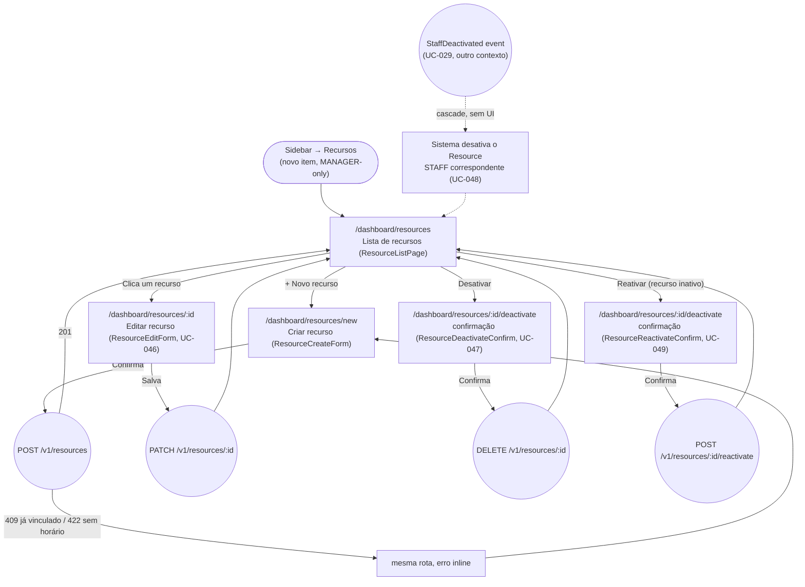

# MANAGER — Recursos (Resource Management)

**Actor(s):** MANAGER  
**Goal:** Create, view, edit, deactivate, and reactivate the tenant's bookable `Resource` rows (`LOCATION`/`STAFF`/`ROOM`/`EQUIPMENT`) — the foundation the rest of M21's multi-vertical scheduling model builds on  
**UCs covered:** UC-044, UC-045, UC-046, UC-047, UC-048, UC-049 (`docs/04-USE_CASES.md`)  
**Status:** ✅ Shipped — backend + BFF in M21-S01 (`GET/POST/PATCH/DELETE /v1/resources`, `POST /v1/resources/:id/reactivate`, all live), `GET /v1/resources/:id` added in M21-S04. Frontend pages below shipped in M21-S04.

> Promoted from `docs/discovery/multivertical-booking/multivertical-booking.md` via `/discovery-to-milestone`. See `docs/02-DOMAIN_MODEL.md` § Booking Context (`Resource` aggregate) for the full domain model and `docs/discovery/multivertical-booking/multivertical-booking_DATA_MODEL.md` §2 for the worked-example rationale this journey doesn't repeat.

## Flow

The deactivate and reactivate confirmations share one route (`/dashboard/resources/:id/deactivate`) — `ResourceDeactivateOrReactivate` picks the right screen from the resource's current `isActive` state.

`UC-048` (staff-deactivation cascade) has no dedicated screen — it's a system-triggered background effect of the existing `manager/equipe.md` deactivation flow (UC-029), surfacing only as the wrapped `Resource` showing "Inativo" the next time this list is viewed.

## Pages referenced

| Page / Route | Component | Story | Status |
|---|---|---|---|
| `/dashboard/resources` | `ResourceListPage` | M21-S04 | ✅ Done |
| `/dashboard/resources/new` | `ResourceCreateForm` | M21-S04 | ✅ Done |
| `/dashboard/resources/:id` | `ResourceEditForm` (every field editable — name, type, refId, working hours, turnover, capacity — broadened from working-hours-only in PR #457 round 9+) | M21-S04 | ✅ Done |
| `/dashboard/resources/:id/deactivate` | `ResourceDeactivateOrReactivate` (picks `ResourceDeactivateConfirm`/`ResourceReactivateConfirm` from the resource's current state — one route serves both directions) | M21-S04 | ✅ Done |

## BFF calls in this flow

| Call | When | Roles |
|---|---|---|
| `GET /v1/resources?type=&isActive=` | Lista de recursos — page load (UC-044) | MANAGER |
| `GET /v1/resources/:id` | Editar recurso — page load (added M21-S04, missed in S01) | MANAGER |
| `POST /v1/resources` | Criar recurso (UC-045) | MANAGER |
| `PATCH /v1/resources/:id` | Editar recurso (UC-046) — every field independently optional | MANAGER |
| `DELETE /v1/resources/:id` | Desativar (UC-047) | MANAGER |
| `POST /v1/resources/:id/reactivate` | Reativar (UC-049) | MANAGER |

Full request/response shapes: `docs/14-API_CONTRACTS.md` § Resource Management.

## Prototype

Folder: `manager/prototypes/resources/` — relocated from `docs/discovery/multivertical-booking/prototype/` (`manager-01-resources-list.html` → `01-resources-list.html`, `manager-04-criar-recurso.html` → `02-criar-recurso.html`, `manager-04b-criar-recurso-erro.html` → `02b-criar-recurso-erro.html`), renamed to this folder's numbered convention.

| File | Screen | CAND | Status |
|---|---|---|---|
| `index.html` | Navigation hub | — | ✅ Criado |
| `01-resources-list.html` | Lista de recursos, agrupada por tipo | CAND-41 | ✅ Criado (`ResourceListPage`) |
| `02-criar-recurso.html` | Criar recurso — formulário (tipo STAFF/ROOM/EQUIPMENT com campos dinâmicos) | CAND-01 | ✅ Criado (`ResourceCreateForm`) |
| `02b-criar-recurso-erro.html` | Criar recurso — erro (staff já vinculado / sem horário) | CAND-01 A1/A2 | ✅ Criado (inline error state) |
| `dev-notes.md` | Implementation handoff (routes, BFF contracts, form fields) | — | ✅ Criado |

**Working-hours edit, deactivate, and reactivate confirmation screens had no discovery-stage prototype** (the discovery's own prototype only ever built list + create + create-error — dev-notes flagged CAND-03/CAND-12 as having "zero entry points"). M21-S04 built them from existing precedents instead of inventing a new shape: `ResourceEditForm`'s working-hours section reuses `apps/web/features/platform/components/settings/SettingsHoursSection.tsx`'s per-weekday editor (extracted into the shared `WeekDayRow` component); `ResourceDeactivateConfirm`/`ResourceReactivateConfirm` mirror `manager/prototypes/equipe/03-deactivate-confirm.html`'s confirmation shape.

## Open questions / gaps

- [x] **Backend + BFF story shipped** — M21-S01 (`plan/M21-MULTIVERTICAL-FOUNDATION.md`). `GET /v1/resources/:id` added in M21-S04.
- [x] **Frontend story shipped** — M21-S04. Working-hours edit, deactivate, and reactivate confirmation screens (not covered by the discovery prototype) were designed from `SettingsHoursSection.tsx` and `manager/prototypes/equipe/03-deactivate-confirm.html` — see the Prototype section above.
- [x] **Nav placement** — "Recursos" shipped as a new MANAGER-only sidebar item, same tier as "Equipe"/"Configurações"/"Hotsite" (`apps/web/shells/dashboard/components/Sidebar.tsx`'s `MANAGER_NAV_KEYS`).
