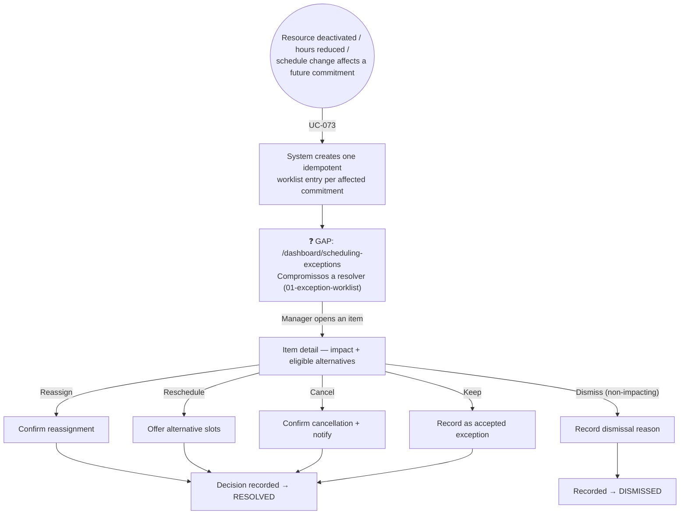

# MANAGER — Scheduling Exceptions (Future Commitment Worklist)

**Actor(s):** MANAGER  
**Goal:** Review and explicitly resolve future bookings/reservations affected by a resource, hours, or schedule change nobody reviewed per-session  
**UCs covered:** UC-073 (System raises), UC-077 (Manager resolves)  
**Status:** ❓ Gap — M21, Multi-Vertical Scheduling, Cluster 3. No story assigned yet.

> Promoted from `docs/discovery/multivertical-booking/multivertical-booking_USECASES.md` (CAND-47, CAND-56) via `/discovery-to-milestone`. See `docs/02-DOMAIN_MODEL.md` § `FutureCommitmentException` for the full domain model. This worklist never silently moves or invalidates a commitment — every item ends in an explicit manager decision (keep, reassign, reschedule, cancel) or dismissal.

## Flow

## Pages referenced

| Page / Route | Component | Story | Status |
|---|---|---|---|
| `/dashboard/scheduling-exceptions` | `SchedulingExceptionWorklistPage` | — | ❓ GAP |

## BFF calls in this flow

| Call | When | Roles |
|---|---|---|
| `GET /v1/scheduling-exceptions?status=OPEN` | Worklist page load (UC-073's output) | MANAGER |
| `POST /v1/scheduling-exceptions/:id/resolve` | Manager keeps/reassigns/reschedules/cancels | MANAGER |
| `POST /v1/scheduling-exceptions/:id/dismiss` | Manager dismisses a non-impacting item | MANAGER |

Full request/response shapes: `docs/14-API_CONTRACTS.md` § Future Commitment Exceptions.

## Prototype

Folder: `manager/prototypes/scheduling-exceptions/` — relocated from `docs/discovery/multivertical-booking/prototype/manager-12-exception-worklist.html`.

| File | Screen | UC | Status |
|---|---|---|---|
| `01-exception-worklist.html` | Worklist — impact, safe alternative, four resolution actions + dismiss | UC-073, UC-077 | ❓ GAP |

**Not yet prototyped:** a dedicated `index.html` navigation hub (added below, this promotion).

## Open questions / gaps

- [ ] No story exists yet — needs `/story-discovery` once the M21 milestone file is drafted.
- [ ] Nav placement — a new MANAGER-only sidebar item, or folded under an existing "Alertas"/notifications surface, is a UI decision for the implementing story.
- [ ] `01-exception-worklist.html`'s own second example item links to `customer-09-reserva-recorrente.html` (relocated to `customer/prototypes/minha-conta/06-reserva-recorrente.html`) — already fixed during this promotion.
