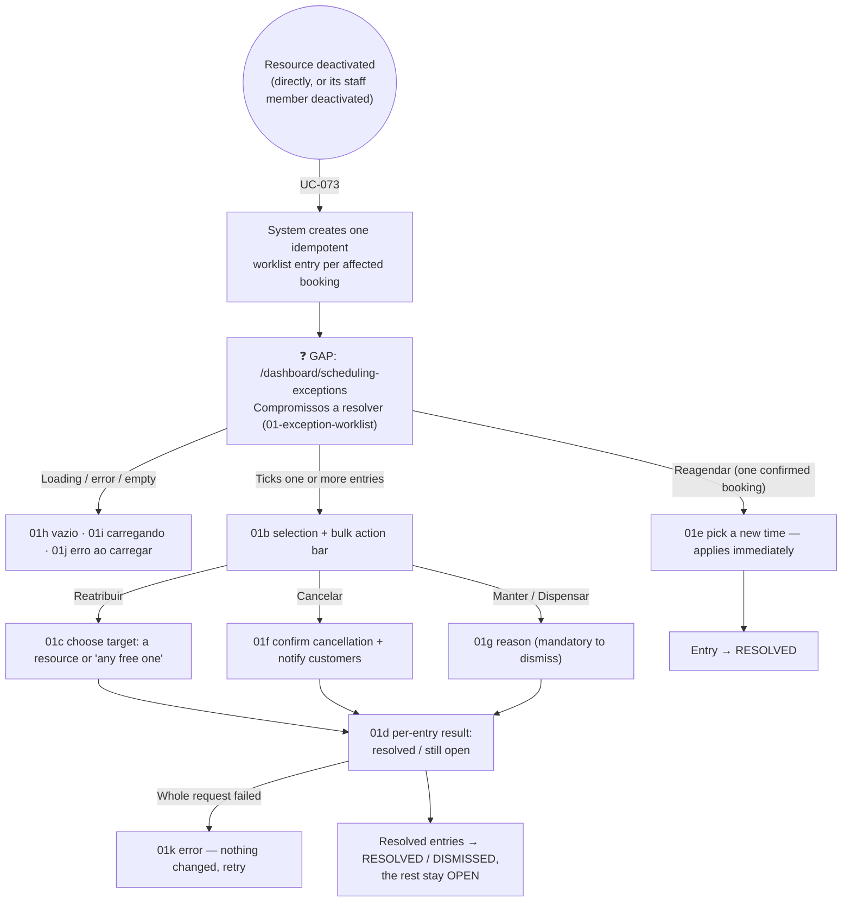

# MANAGER — Scheduling Exceptions (Future Commitment Worklist)

**Actor(s):** MANAGER  
**Goal:** Review and explicitly resolve — one by one or many at once — future bookings affected by a resource change nobody reviewed per-session  
**UCs covered:** UC-073 (System raises), UC-077 (Manager resolves)  
**Status:** ❓ Gap — M23, Multi-Vertical Scheduling, Cluster 3. Backend + BFF: `M23-S08`; this frontend: `M23-S14`. Customer/manager notifications for the worklist: `M23-S23`.

> Promoted from `docs/discovery/multivertical-booking/multivertical-booking_USECASES.md` (CAND-47, CAND-56) via `/discovery-to-milestone`. See `docs/02-DOMAIN_MODEL.md` § `FutureCommitmentException` for the full domain model. This worklist never silently moves or invalidates a commitment — every entry ends in an explicit manager decision (keep, reassign, reschedule, cancel) or a dismissal.

> **Decided in `M23-S08` (2026-09-30):**
> - An entry is one **future booking** (`PENDING`, `INFO_REQUESTED` or `APPROVED`) occupying a resource that was deactivated — either directly (UC-047) or because its staff member was deactivated (UC-048). A recurring schedule has **no entry of its own**: each of its occurrences is a booking and appears as its own entry.
> - **Reassign** = same time, another resource (an explicit one, or "any free one"). **Reschedule** = a manager-chosen new time, applied immediately, for a confirmed (`APPROVED`) booking and **one entry at a time** (the customer is notified by the existing reschedule email). There is no "offer options and wait for the customer" flow.
> - **Reassign, cancel, keep and dismiss work on many entries at once**, best-effort: each booking is its own transaction, the ones that could not be done stay open and are reported back.
> - Sending the manager an alert and telling the customer about a reassign is `M23-S23`, not this screen.

## Flow

```mermaid
flowchart TD
    classDef gap stroke:#f00,stroke-dasharray: 5 5,fill:#fee

    Trigger(("Resource deactivated<br/>(directly, or its staff member deactivated)")) -->|"UC-073"| Raise["System creates one idempotent<br/>worklist entry per affected booking"]
    Raise --> List["❓ GAP: /dashboard/scheduling-exceptions<br/>Compromissos a resolver (01-exception-worklist)"]

    List -->|"Loading / error / empty"| States["01h vazio · 01i carregando · 01j erro ao carregar"]
    List -->|"Ticks one or more entries"| Bulk["01b selection + bulk action bar"]
    List -->|"Reagendar (one confirmed booking)"| Reschedule["01e pick a new time — applies immediately"]

    Bulk -->|"Reatribuir"| Reassign["01c choose target: a resource or 'any free one'"]
    Bulk -->|"Cancelar"| Cancel["01f confirm cancellation + notify customers"]
    Bulk -->|"Manter / Dispensar"| Dismiss["01g reason (mandatory to dismiss)"]

    Reassign --> Result["01d per-entry result:<br/>resolved / still open"]
    Cancel --> Result
    Dismiss --> Result
    Reschedule --> Resolved["Entry → RESOLVED"]
    Result -->|"Whole request failed"| SubmitError["01k error — nothing changed, retry"]
    Result --> Done["Resolved entries → RESOLVED / DISMISSED,<br/>the rest stay OPEN"]
```

## Pages referenced

| Page / Route | Component | Story | Status |
|---|---|---|---|
| `/dashboard/scheduling-exceptions` | `SchedulingExceptionWorklistPage` | M23-S14 | ❓ GAP |

## BFF calls in this flow

| Call | When | Roles |
|---|---|---|
| `GET /v1/scheduling-exceptions?status=OPEN` | Worklist page load (UC-073's output) — each item carries the booking summary and the stored alternatives | MANAGER |
| `POST /v1/scheduling-exceptions/resolve` | Manager keeps/reassigns/cancels one or many entries (`exceptionIds[]`), or reschedules one; per-entry result `RESOLVED` / `STILL_OPEN` | MANAGER |
| `POST /v1/scheduling-exceptions/dismiss` | Manager dismisses one or many non-impacting entries (`exceptionIds[]`, reason required) | MANAGER |

Full request/response shapes: `docs/14-API_CONTRACTS.md` § Future Commitment Exceptions.

## Prototype

Folder: `manager/prototypes/scheduling-exceptions/` — relocated from `docs/discovery/multivertical-booking/prototype/manager-12-exception-worklist.html`, reworked on 2026-09-30 for the `M23-S08` decisions above.

| File | Screen | UC | Status |
|---|---|---|---|
| `01-exception-worklist.html` | Worklist — one card per affected booking, per-row actions, a "no compatible alternative" row and a pending row (no Reagendar) | UC-073, UC-077 | ❓ GAP |
| `01b-selecionados.html` | Two entries ticked, bulk action bar (Reagendar disabled: one at a time) | UC-077 | ❓ GAP |
| `01c-reatribuir.html` | Reassign target: a resource or "any free one", mandatory reason | UC-077 | ❓ GAP |
| `01d-resultado-parcial.html` | Per-entry result after a bulk action: resolved vs still open, with the reason | UC-077 A1 | ❓ GAP |
| `01e-reagendar.html` | Pick a new time for one confirmed booking — applies immediately | UC-077 | ❓ GAP |
| `01f-cancelar.html` | Confirm a cancellation of several bookings | UC-077 | ❓ GAP |
| `01g-dispensar.html` | Dismiss with a mandatory reason (keep is the same panel, reason optional) | UC-077 A2 | ❓ GAP |
| `01h-vazio.html` · `01i-carregando.html` · `01j-erro-carregar.html` | Empty, loading and fetch-error states | UC-073 | ❓ GAP |
| `01k-erro-enviar.html` | The whole request failed — nothing changed | UC-077 | ❓ GAP |

## Open questions / gaps

- [x] Stories exist: `M23-S08` (backend + BFF), `M23-S14` (this page), `M23-S23` (notifications). `M23-S14` still begins with `/story-discovery`.
- [x] Reassign, reschedule, bulk and the "no entry per schedule" rules were decided in `M23-S08` and are drawn here (2026-09-30).
- [ ] Nav placement — a new MANAGER-only sidebar item ("Exceções"), as `M23-S14` states, is drawn as a default to recheck at that story's discovery.
- [ ] **Selecting "all from this resource from a time":** the prototype draws a per-resource "Selecionar todos" control; a free time filter ("a partir de …") is a proposal, not decided.
- [ ] **A `PENDING` / `INFO_REQUESTED` booking** has no Reagendar (only a confirmed booking can be rescheduled); how the manager moves such a booking's time is the normal approval flow, not this screen.
