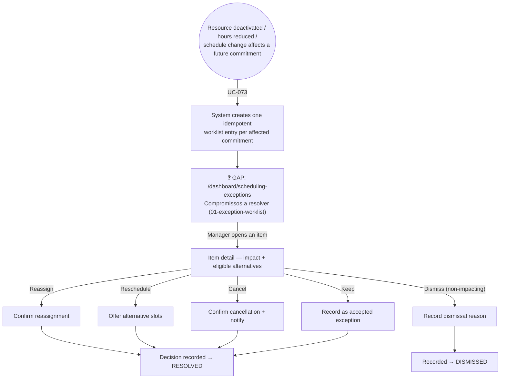

# MANAGER — Scheduling Exceptions (Future Commitment Worklist)

**Actor(s):** MANAGER  
**Goal:** Review and explicitly resolve future bookings/reservations affected by a resource, hours, or schedule change nobody reviewed per-session  
**UCs covered:** UC-073 (System raises), UC-077 (Manager resolves)  
**Status:** ❓ Gap — M23, Multi-Vertical Scheduling, Cluster 3. Backend + BFF: `M23-S08`; this frontend: `M23-S14`. Customer/manager notifications for the worklist: `M23-S23`.

> Promoted from `docs/discovery/multivertical-booking/multivertical-booking_USECASES.md` (CAND-47, CAND-56) via `/discovery-to-milestone`. See `docs/02-DOMAIN_MODEL.md` § `FutureCommitmentException` for the full domain model. This worklist never silently moves or invalidates a commitment — every item ends in an explicit manager decision (keep, reassign, reschedule, cancel) or dismissal.

## Flow

```mermaid
flowchart TD
    classDef gap stroke:#f00,stroke-dasharray: 5 5,fill:#fee

    Trigger(("Resource deactivated / hours reduced /<br/>schedule change affects a future commitment")) -->|"UC-073"| Raise["System creates one idempotent<br/>worklist entry per affected commitment"]
    Raise --> List["❓ GAP: /dashboard/scheduling-exceptions<br/>Compromissos a resolver (01-exception-worklist)"]

    List -->|"Manager opens an item"| Item["Item detail — impact + eligible alternatives"]
    Item -->|"Reassign"| Reassign["Confirm reassignment"]
    Item -->|"Reschedule"| Reschedule["Offer alternative slots"]
    Item -->|"Cancel"| Cancel["Confirm cancellation + notify"]
    Item -->|"Keep"| Keep["Record as accepted exception"]
    Item -->|"Dismiss (non-impacting)"| Dismiss["Record dismissal reason"]

    Reassign --> Resolved["Decision recorded → RESOLVED"]
    Reschedule --> Resolved
    Cancel --> Resolved
    Keep --> Resolved
    Dismiss --> Dismissed["Recorded → DISMISSED"]
```

## Pages referenced

| Page / Route | Component | Story | Status |
|---|---|---|---|
| `/dashboard/scheduling-exceptions` | `SchedulingExceptionWorklistPage` | — | ❓ GAP |

## BFF calls in this flow

| Call | When | Roles |
|---|---|---|
| `GET /v1/scheduling-exceptions?status=OPEN` | Worklist page load (UC-073's output) | MANAGER |
| `POST /v1/scheduling-exceptions/resolve` | Manager keeps/reassigns/cancels one or many entries, or reschedules one (`exceptionIds[]`, per-entry result `RESOLVED`/`STILL_OPEN`) | MANAGER |
| `POST /v1/scheduling-exceptions/dismiss` | Manager dismisses one or many non-impacting items (`exceptionIds[]`) | MANAGER |

Full request/response shapes: `docs/14-API_CONTRACTS.md` § Future Commitment Exceptions.

## Prototype

Folder: `manager/prototypes/scheduling-exceptions/` — relocated from `docs/discovery/multivertical-booking/prototype/manager-12-exception-worklist.html`.

| File | Screen | UC | Status |
|---|---|---|---|
| `01-exception-worklist.html` | Worklist — impact, safe alternative, four resolution actions + dismiss | UC-073, UC-077 | ❓ GAP |

**Not yet prototyped:** a dedicated `index.html` navigation hub (added below, this promotion).

## Open questions / gaps

- [x] Stories exist: `M23-S08` (backend + BFF), `M23-S14` (this page), `M23-S23` (notifications). `M23-S14` still begins with `/story-discovery`.
- [ ] **Prototype pass needed before `M23-S14`** (`CLAUDE.md` §15 — a `/docs-audit` baseline first): `01-exception-worklist.html` draws single-item actions only. It needs a multi-select with a bulk action bar and a reassign target choice (a specific resource or "any free one"), because `M23-S08` resolves and dismisses many entries at once (best-effort, per-entry result). It also draws reschedule as "Oferecer novos horários" (the booking changes only when the customer accepts a proposal), whereas UC-077 and `M23-S08` implement a direct, manager-chosen reschedule applied immediately, for a confirmed booking and one entry at a time — a decision to settle in that pass.
- [ ] Nav placement — a new MANAGER-only sidebar item, or folded under an existing "Alertas"/notifications surface, is a UI decision for the implementing story.
- [ ] `01-exception-worklist.html`'s own second example item links to `customer-09-reserva-recorrente.html` (relocated to `customer/prototypes/minha-conta/06-reserva-recorrente.html`) — already fixed during this promotion.
