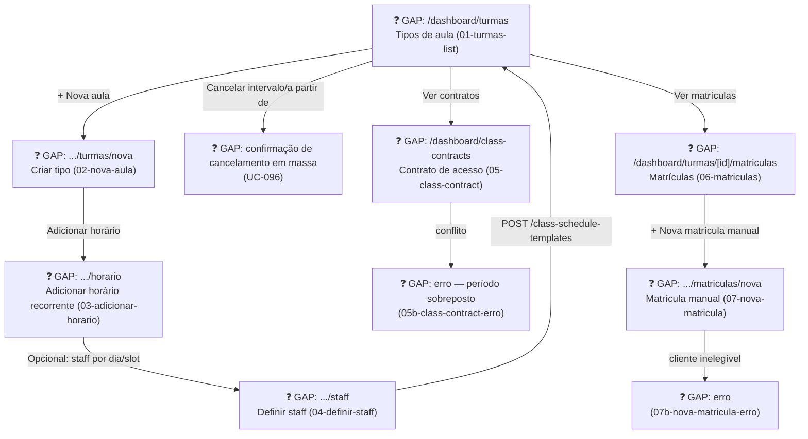

# MANAGER — Turmas (Class Configuration & Enrollment Management)

**Actor(s):** STAFF | MANAGER (Service/class configuration matches today's Service management, not manager-exclusive — see `docs/discovery/multivertical-booking/prototype/dev-notes.md` item 1)  
**Goal:** Configure recurring class templates, manage customer class-access contracts, and view/manage enrollments for a class type  
**UCs covered:** UC-079, UC-080, UC-096 (templates) · UC-099 (class-access contracts) · UC-103, UC-104 (enrollments)  
**Status:** ❓ Gap — M21, Multi-Vertical Scheduling, Cluster 4 (Classes/Sessions). No story assigned yet.

> Promoted from `docs/discovery/multivertical-booking/multivertical-booking_USECASES.md` (CAND-11, 12, 32, 35, 39, 40) via `/discovery-to-milestone`. See `docs/02-DOMAIN_MODEL.md` § `ClassScheduleTemplate`/`ClassAccessContract`/`RecurringEnrollment`. Complements `staff/turmas.md`, which covers the daily operational side (roster, close-out, capacity override, guest approval) rather than configuration.

## Flow

## Pages referenced

| Page / Route | Component | Story | Status |
|---|---|---|---|
| `/dashboard/turmas` | `ClassTemplateListPage` | — | ❓ GAP |
| `/dashboard/turmas/nova` | `ClassTemplateCreateWizard` (type → schedule → staff, 3 steps) | — | ❓ GAP |
| `/dashboard/class-contracts` | `ClassAccessContractForm` | — | ❓ GAP |
| `/dashboard/turmas/[id]/matriculas` | `EnrollmentListPage` | — | ❓ GAP |
| `/dashboard/turmas/[id]/matriculas/nova` | `AdminEnrollmentForm` | — | ❓ GAP |

## BFF calls in this flow

| Call | When | Roles |
|---|---|---|
| `GET /v1/class-schedule-templates` | Template list page load | STAFF \| MANAGER |
| `POST /v1/class-schedule-templates` | Criar template (UC-079) | STAFF \| MANAGER |
| `PATCH /v1/class-schedule-templates/:id` | Editar (UC-080) | STAFF \| MANAGER |
| `DELETE /v1/class-schedule-templates/:id` | Desativar (UC-080) | STAFF \| MANAGER |
| `POST /v1/class-schedule-templates/:id/cancel-range` | Cancelar intervalo/a partir de (UC-096) | STAFF \| MANAGER |
| `POST /v1/class-access-contracts` | Criar contrato (UC-099) | MANAGER |
| `POST /v1/class-access-contracts/:id/cancel` | Cancelar contrato (UC-099 step 4) | MANAGER |
| `GET /v1/class-schedule-templates/:serviceId/enrollments?status=&type=` | Lista de matrículas (UC-103) | STAFF \| MANAGER |
| `POST /v1/class-session-bookings` / `POST /v1/recurring-enrollments` (`createdByStaff: true`) | Matrícula manual (UC-104) | STAFF \| MANAGER |

Full request/response shapes: `docs/14-API_CONTRACTS.md` § Classes & Sessions.

## Prototype

Folder: `manager/prototypes/turmas/` — relocated from `docs/discovery/multivertical-booking/prototype/manager-{turmas-list,nova-aula,adicionar-horario,definir-staff,07,07b,09,09b,09c}*.html`.

| File | Screen | UC | Status |
|---|---|---|---|
| `01-turmas-list.html` | Lista de tipos de aula (accordion por tipo) | UC-079/080 | ❓ GAP |
| `02-nova-aula.html` | Criar tipo de aula — passo 1 | UC-079 | ❓ GAP |
| `03-adicionar-horario.html` | Adicionar horário recorrente — passo 2 | UC-079 | ❓ GAP |
| `04-definir-staff.html` | Atribuição de staff por dia/slot — passo 3 (opcional) | UC-079 | ❓ GAP |
| `05-class-contract.html` / `05b-class-contract-erro.html` | Contrato de acesso + erro (período sobreposto) | UC-099 | ❓ GAP |
| `06-matriculas.html` | Lista de matrículas (4 abas: séries ativas / avulsas / fila / histórico) | UC-103 | ❓ GAP |
| `07-nova-matricula.html` / `07b-nova-matricula-erro.html` | Matrícula manual + erro (cliente inelegível) | UC-104 | ❓ GAP |

**Superseded, kept for historical reference only (not relocated):** `manager-03-class-templates.html`, `manager-06-criar-turma.html`/`06b` — the discovery's own single-step template creation, superseded by the 3-step `01`→`04` flow above (see `docs/discovery/multivertical-booking/prototype/dev-notes.md` item 34).

## Open questions / gaps

- [ ] No story exists yet — needs `/story-discovery` once the M21 milestone file is drafted.
- [ ] `01-turmas-list.html`'s per-row "Editar"/"Staff"/"Ver sessões" actions and `07-nova-matricula.html`'s "Cadastrar novo cliente" link have no dedicated screens yet — scope for the implementing story to design or explicitly defer.
- [ ] Whether the 3-step create wizard (`02`→`03`→`04`) is one multi-step route or three separate pages is a routing decision for the implementing story.
