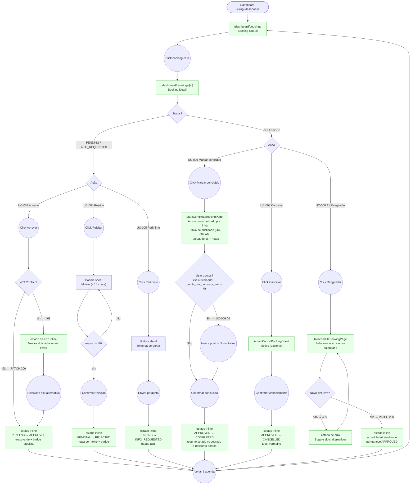
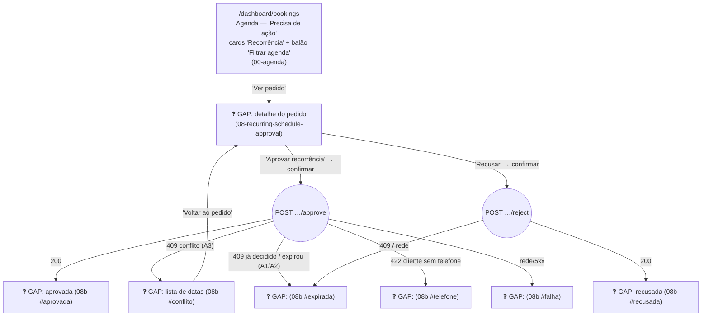
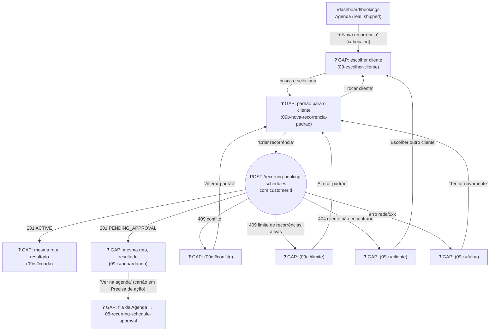
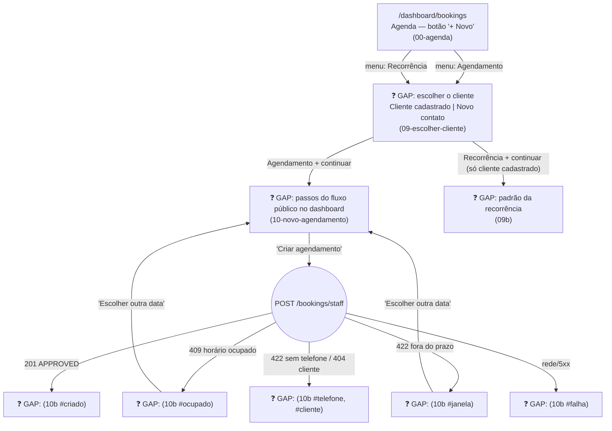
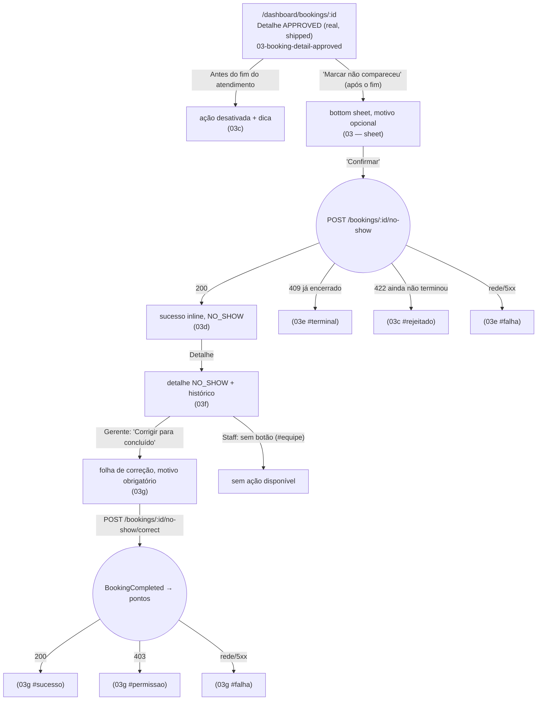

# STAFF — Agenda (Booking Queue & Lifecycle Management)

**Actor(s):** STAFF | MANAGER  
**Goal:** Review the daily booking queue, action each request — approve, reject, or request more information — and manage an approved booking through to completion, cancellation, or reschedule  
**UCs covered:** UC-003, UC-004, UC-005, UC-008, UC-009 (incl. A6 — loyalty redemption during completion) · UC-070 (staff creating a recurrence on a customer's behalf), UC-071, UC-074, UC-108 (staff creating a one-off booking on a customer's behalf) (❓ Gap — M23 Cluster 3, recurring-schedule creation on behalf + approval + appointment no-show)  
**Status:** Draft

> Note: the lifecycle screens referenced here were later implemented in M13-S19 and M13-S20; this document remains the prototype and journey reference.
>
> Validation note (2026-06-29): `apps/web/e2e/staff-booking-lifecycle.spec.ts` now covers the queue card detail shortcut, quick approve, reject, request info, complete success, reschedule success, and cancel success flows.

## Flow

## Pages referenced

| Page / Route | Component | Story | Status |
|---|---|---|---|
| `/dashboard/bookings` | `BookingQueuePage` | M125-S03 | ✅ Done |
| `/dashboard/bookings/[id]` | `BookingDetailPage` + `BookingActionPanel` | M125-S05 | ✅ Done |
| Slot conflict inline state | `SlotConflictAlert` within `BookingActionPanel` | M125-S05 | ✅ Done |
| Approve success inline state | inline banner within `BookingDetailPage` | M125-S05 | ✅ Done |
| Reject bottom sheet | `RejectBookingSheet` within `BookingDetailPage` | M125-S05 | ✅ Done |
| Request info bottom sheet | `RequestInfoSheet` within `BookingDetailPage` | M125-S05 | ✅ Done |
| Mark-complete screen | `MarkCompleteBookingPage` (per-line `actualPriceCharged` override + loyalty redemption strip UC-009 A6 + after-photo upload + notes) | M13 | ✅ Done |
| Complete success inline state | inline banner within `BookingDetailPage` (shows per-line cotado vs cobrado + optional loyalty discount row) | M13 | ✅ Done |
| Admin cancel bottom sheet | `AdminCancelBookingSheet` within `BookingDetailPage` | M13 | ✅ Done |
| Reschedule screen | `RescheduleBookingPage` (reuses UC-011 availability calendar) | M13 | ✅ Done |
| Reschedule slot-conflict state | inline within `RescheduleBookingPage` | M13 | ✅ Done |

## Open questions / gaps

- [x] **Success state UX** — **Resolved.** The admin stays on the detail page after approval; production renders the inline success banner in place (no navigation). The prototype shows `02-approve-success.html` as a separate page only for review clarity — see its `STATE`/`PROTOTYPE` HTML comment, which states "same page, no navigation" explicitly. The aside panel's only action is "Voltar à agenda", a manual back-link, not an auto-redirect.
- [x] **Reject/info success** — **Resolved.** Same pattern as approval: after REJECTED or INFO_REQUESTED, the admin stays on the detail page with an inline banner (`01c-reject-success.html`, `01d-info-success.html`) and a manual "Voltar à agenda" link — no auto-navigate. The same pattern is also used for cancel (`03b-cancel-success.html`), complete (`04b-complete-success.html`), and reschedule (`05c-reschedule-success.html`), confirming this is the system-wide convention for every booking-lifecycle action, not just approve.
- [x] **Queue scope** — **Resolved 2026-06-16; the filter sentence below was superseded 2026-10-08 by M23-S13 (see the M23 section).** Grouped by urgency, not by date: "Precisa de ação" (ALL PENDING + INFO_REQUESTED, any date, sorted by `scheduledAt`) → "Hoje" (today's APPROVED, actionable) → "Próximos dias" (future APPROVED, read-only glance, no quick actions). The previous date-first grouping split same-kind triage work across day sections (a PENDING booking for tomorrow was separated from today's PENDING items). Decorative filter tabs (Pendentes/Info solicitada/Confirmados/Todos) were removed — the sections themselves were the filter. *(2026-10-08: once recurrence requests join "Precisa de ação" the sections can no longer tell the two kinds apart, so M23-S13 adds one real, floating "Filtrar agenda" balloon — not tabs — that shows or hides the four blocks.)*
- [ ] **Queue real-time updates** — polling interval or WebSocket? Two staff members might be viewing the same booking simultaneously.
- [ ] **Slot conflict suggestion count** — prototype shows 3 adjacent free slots. Is 3 the right number? What if all remaining slots in the day are taken?
- [ ] **Notification on approve** — `BookingApproved` event triggers email to customer. Confirm the "email enviado" note in the success banner is accurate for the MVP notification flow.
- [ ] **INFO_REQUESTED → PENDING re-entry** — UC-005 Alt flow A2 (customer submits info) is handled in `customer/` and `guest/` journeys. Confirm: does the booking return to the PENDING queue automatically when the customer responds, or must staff re-find it manually?
- [x] **Queue surfacing of APPROVED bookings** — **Resolved 2026-06-16** by the "Hoje" and "Próximos dias" sections above — see `00-agenda.html`.
- [ ] **Week-strip click target for future days** — clicking any future day-pill jumps to the single "Próximos dias" section (not split per-day), so a future PENDING booking (which lives in "Precisa de ação" instead) won't actually be visible at that anchor. This is a known approximation in the prototype — decide whether production needs real per-day filtering/highlighting or whether this is acceptable.
- [ ] **Mark-complete UX** — per-line `actualPriceCharged` override: inline editable fields next to each line (as shown in UC-009's doc example), or a separate "review charges" step before confirming? Photo upload — does it reuse the same upload component as the guest/customer "before" photos (UC-001 step 8)?
- [x] **Reschedule calendar reuse** — does `RescheduleBookingPage` reuse the guest/customer booking flow's `AvailabilityCarousel` + `SlotPicker` (UC-011), or does staff need a simplified version? — **Resolved.** Confirmed reused; reschedule duration is frozen at the existing booking's `totalDurationMins` (no basket/duration recompute) (`M13-S19`).
- [x] **Admin cancel reason validation** — backend `CancelBookingAsAdminBody.reason` is optional with no minimum length (unlike UC-004 Reject's required ≥10 chars). — **Resolved.** Genuinely optional, no minimum length, confirmed against `CancelBookingAsAdminBody` (`M13-S19`).
- [ ] **Cancel vs. Reschedule entry point** — does the Detail page show both "Cancelar" and "Reagendar" as equally-weighted buttons, or is one primary and the other a secondary/menu action (to avoid accidental cancellation of a confirmed booking)?

## Prototype

Folder: `staff/prototypes/agenda/`

| File | Screen | UC | Story | Status |
|---|---|---|---|---|
| `index.html` | Navigation hub + validation checklist | — | — | ✅ Criado |
| `00-agenda.html` | Booking queue — "Precisa de ação" (PENDING + INFO_REQUESTED, any date) → "Hoje" → "Próximos dias". **M23-S13 extends it:** recurrence-request cards in "Precisa de ação" + the floating "Filtrar agenda" balloon + "+ Nova recorrência" | UC-071, UC-070 | M125-S03 · M23-S13 · M23-S19 | ✅ Criado (base) · ❓ Gap (M23 extension) |
| `01-booking-detail.html` | Booking detail + inline Reject/Info bottom sheets | UC-003, UC-004, UC-005 | M125-S05 | ✅ Criado |
| `01b-slot-conflict.html` | Slot conflict error + adjacent slot picker | UC-003 Alt A1 | M125-S05 | ✅ Criado |
| `01c-reject-success.html` | Reject success inline state (actionState = 'rejected') | UC-004 | M125-S05 | ✅ Criado |
| `01d-info-success.html` | Info-request success inline state (actionState = 'info-requested') | UC-005 | M125-S05 | ✅ Criado |
| `02-approve-success.html` | Approval success (prototype page; production = inline) | UC-003 | M125-S05 | ✅ Criado |
| `00-agenda-next.html` | Booking queue — next-week view (week-nav demo pair with `00-agenda.html`) | — | — | ✅ Criado |
| `03-booking-detail-approved.html` | Booking detail, APPROVED state (Cancel/Complete/Reschedule actions) | UC-008, UC-009 | — | ✅ Criado |
| `03b-cancel-success.html` | Cancel success inline state, triggered from `03-booking-detail-approved.html` | UC-008 | — | ✅ Criado |
| `04-mark-complete.html` | Mark complete flow | UC-009 | — | ✅ Criado |
| `04b-complete-success.html` | Completion confirmed inline state | UC-009 | — | ✅ Criado |
| `05-reschedule.html` | Reschedule flow | UC-008 Alt A1 | — | ✅ Criado |
| `05b-reschedule-conflict.html` | Reschedule Alt A2 — new slot became unavailable on confirm | UC-008 Alt A2 | — | ✅ Criado |
| `05c-reschedule-success.html` | Reschedule confirmed inline state | UC-008 Alt A1 | — | ✅ Criado |
| `08-recurring-schedule-approval.html` | Detail of a recurring-schedule request — details centred, action panel on the right (desktop) / bottom action bar (mobile), approve and reject confirmation sheets. Same shell as `01-booking-detail.html` | UC-071 | M23-S13 | ❓ Gap (M23 Cluster 3) |
| `08b-recurring-approval-result.html` | Inline result states of the detail page (banner on top, data kept, action panel swapped, as in `04b`): approved, rejected, 409 conflict list, 409 already decided/expired, 422 customer has no phone, network/5xx | UC-071 | M23-S13 | ❓ Gap (M23 Cluster 3) |
| `09-escolher-cliente.html` | **Shared customer chooser** for everything staff creates on a customer's behalf (`?tipo=agendamento` or `recorrencia`): *Cliente cadastrado* (search by name, e-mail or phone; recent; no result; search error) and *Novo contato* (name, phone, e-mail, all required → guest booking; disabled for a recurrence) | UC-108, UC-070 | M23-S40 · M23-S19 | ❓ Gap (M23 Cluster 3) |
| `10-novo-agendamento.html` | Novo agendamento — the public flow's steps in the dashboard skin (service → date/time → confirm), summary and actions in the right pane; staff see slots inside the minimum notice | UC-108 | M23-S40 | ❓ Gap (M23 Cluster 3) |
| `10b-novo-agendamento-resultado.html` | Inline outcomes: created `APPROVED`, 409 slot taken, outside the window, customer without phone, customer not found, network/5xx | UC-108 | M23-S40 | ❓ Gap (M23 Cluster 3) |
| `09b-nova-recorrencia-padrao.html` | Nova recorrência — padrão (serviço, recurso, dias, horário, período) para o cliente escolhido | UC-070 | M23-S19 | ❓ Gap (M23 Cluster 3) |
| `09c-nova-recorrencia-resultado.html` | Desfechos: criada, aguardando aprovação, conflito, limite, falha, cliente não encontrado | UC-070 | M23-S19 | ❓ Gap (M23 Cluster 3) |
| `03-booking-detail-approved.html` — "Marcar não compareceu" (extended) | Nova ação + bottom sheet (motivo opcional) no detalhe de um agendamento aprovado | UC-074 | M23-S09 (backend/BFF) · M23-S27 | ✅ Criado |
| `03c-no-show-not-yet-ended.html` | Atendimento ainda não terminou: ação desativada com dica; erro 422 `BOOKING_NOT_YET_ENDED` (`#rejeitado`) | UC-074 A1 | M23-S27 | ✅ Criado |
| `03d-no-show-success.html` | Sucesso inline (`actionState = 'no-show'`), status "Não compareceu" | UC-074 | M23-S27 | ✅ Criado |
| `03e-no-show-error.html` | Erros: 409 `BOOKING_ALREADY_TERMINAL` (`#terminal`) e falha de rede/5xx (`#falha`) | UC-074 A2 | M23-S27 | ✅ Criado |
| `03f-booking-detail-no-show.html` | Detalhe de um não comparecimento + histórico; gerente vê "Corrigir para concluído", staff não (`#equipe`) | UC-074 A3 | M23-S27 | ✅ Criado |
| `03g-correct-no-show.html` | Correção (somente gerente): motivo obrigatório (10–500), sucesso com pontos, falha, 403 | UC-074 A3 | M23-S27 | ✅ Criado |

(Story numbers left as `—` above where they couldn't be confirmed against a specific milestone story — do not guess when citing these in a new story; check `git log` or ask.)

## M23 — Multi-Vertical Scheduling, Cluster 3 extension (❓ Gap, not yet built)

> Promoted from `docs/discovery/multivertical-booking/`. **UC-071's approval queue lives inside the existing "Precisa de ação" block of the Agenda (decided 2026-10-08)** — a recurrence request is something that needs a staff decision now, exactly like a pending booking, so it sits in the same hot list instead of a separate tab. See "Recurrence requests in the Agenda" below. UC-074 (no-show) extends `03-booking-detail-approved.html`'s existing Cancel/Complete/Reschedule action set with a new "Marcar não compareceu" action — same route and component, no new page; the prototype adds its states as `03c`–`03g` (added 2026-09-30 after the M23-S09 discovery; the UI itself is a future frontend story, M23-S09 ships the backend/BFF only). Full implementation-handoff detail lives in `dev-notes.md`'s own ❓ GAP section — not duplicated here.

> **Staff creating a recurring schedule on a customer's behalf** (UC-070 allows it, and `POST /recurring-booking-schedules` already accepts a `customerId` from `STAFF|MANAGER`) was added on 2026-09-29 as a deliberately small first pass (`09`, `09b`, `09c`), in the same staff dashboard shell as `08`. Every choice is a default to recheck at `M23-S19`'s story-discovery.

**Recurrence requests in the Agenda (M23-S13, decided 2026-10-08):**

- **Same queue, clearly marked.** A `PENDING_APPROVAL` recurring schedule is a card in "Precisa de ação", sorted with the bookings by urgency (it carries a 30-minute hold, so it usually sorts first). It differs from a booking card by a teal **"Recorrência"** badge, the pattern as its title ("toda terça · 10:00–12:00", period, number of reservations), a "Decidir até HH:mm" line, a teal left border, and a single **"Ver pedido"** button — **no quick "Aprovar"**, because one decision creates every occurrence of the term and must go through the detail screen.
- **Filter balloon.** The floating "Filtrar agenda" balloon (same trigger + popover shape as Horários' `ResourceFilterMenu` / `ScheduleStatusFilterMenu`) has two groups: *Precisa de ação* → Agendamentos, Recorrências; *Confirmados* → Hoje, Próximos dias. Default = all visible; "Padrão" resets; a badge on the trigger counts hidden options; hiding everything shows an empty state with "Limpar filtro". The header count follows the filter ("4 agendamentos · 1 recorrência").
- **Detail screen `08`** follows the shared detail pattern (details centred, action panel on the right, bottom action bar on mobile). Approve and reject each open a confirmation sheet; reject has **no reason field** (the endpoint takes no body). Outcomes are in `08b`.

**UC-108 — Staff creates a booking on a customer's behalf (added 2026-10-08):**

**UC-074 — Não comparecimento (added 2026-09-30):**

**Open questions / gaps:**
- [x] Stories exist: `M23-S13` (approval queue, UC-071), `M23-S09` (no-show backend/BFF, UC-074 — the button and correction UI are M23-S27) and `M23-S19` (staff creating on a customer's behalf). Each still begins with `/story-discovery`.
- [x] **Entry point — decided 2026-10-08:** a single **"+ Novo"** button above the Agenda queue opens a small menu with **Agendamento** and **Recorrência**; both start at the same customer picker (`09`) and use the same two-column form layout. A second button is never added for the next kind of "create on a customer's behalf". "Recorrência" is UC-070 (staff variant, `M23-S19`).
- [x] **Staff creates a one-off booking for someone who calls or messages — decided 2026-10-08, now UC-108 with stories `M23-S39` (backend/BFF, `POST /bookings/staff`) and `M23-S40` (frontend).** Locked: (1) a person who is not in the system is booked as a **guest** (name, phone and e-mail all required) because a `Customer` needs a Google account — no model change; (2) the booking is created **directly `APPROVED`**, `createdByStaffId` recorded, no manager alert, the customer gets the confirmation e-mail; (3) availability, closures and conflicts are enforced as for a customer, the **minimum notice is not** (a same-day phone booking works; past dates and the maximum advance still are); (4) one shared **customer chooser** (`09`) is the first step of both "Agendamento" and "Recorrência"; (5) the booking steps are the public flow's step engine in a dashboard skin (the public steps use the business's `--ba-*` tokens, which the dashboard may not). Still open for discovery: a click-on-an-empty-slot shortcut in Horários, pre-registering a customer without a Google account (a bigger model change), the guest cancel link.
- [x] **Recurring queue placement — decided 2026-10-08:** recurrence requests fold into the existing "Precisa de ação" block (not a tab, not a separate route), distinguished by badge and filterable through the "Filtrar agenda" balloon. The detail route is proposed as `/dashboard/bookings/recurring/:scheduleId`.
- [ ] **Filter persistence.** Reset on reload (drawn) or remembered per user — decide at `M23-S13`'s `/story-discovery`, following whatever Horários' filters do.
- [ ] **Merged-queue paging.** Bookings and recurrence requests come from two endpoints (`GET /bookings` and the paginated `GET /recurring-booking-schedules?status=PENDING_APPROVAL`); how they are merged and sorted, and whether recurrences page through `pagination.hasMore`, is locked at `M23-S13`'s discovery.
- [ ] **Week strip.** Its day links jump to "Hoje" / "Próximos dias"; when those blocks are filtered out the links need a fallback (do nothing, or switch the block back on).
- [ ] **Approval on a staff-created schedule.** Today a schedule created by staff for a service that requires manual approval still lands in `PENDING_APPROVAL`, so staff would approve their own request. Should staff creation skip approval? (`09c #aguardando` draws today's behavior.)
- [x] **Customer and manager e-mails — shipped in `M23-S28` (corrected 2026-10-08; this bullet used to say nobody is notified).** The customer is e-mailed when a schedule becomes `ACTIVE` (at creation for an `AUTO_CONFIRM` service, at approval otherwise), when it is rejected, when the request expires, and when it is ended. Managers get an alert when a `MANUAL_APPROVAL` request is waiting. `08` and `08b` therefore say "Ana recebe um e-mail". `09b` still never promises one — revisit at `M23-S19`.
- [ ] **Route.** Proposed `/dashboard/bookings/recurring/new`; a brand-new dashboard section would also need registering in the sidebar, the proxy role list, the bottom nav and the topbar titles.
- [x] **The conflict list** in `09c #conflito` is the `409` occurrence-list payload that `M23-S18` owns (reasons `OCCUPIED` / `CLOSED` / `OUTSIDE_HOURS`, occupancy and hours merged into one list); no backend work in `M23-S19`.
- [x] **Fixed term — decided 2026-09-29; prototypes `08`, `09b`, `09c` updated in the same-day prototype pass:** a recurring schedule always has an end date, chosen up to the service's maximum term (90 days by default); every occurrence is checked at creation and created once (immediately, or when staff approve). `09b` therefore needs an end-date field with a "máx. N dias" hint and no "sem data final" copy; `09c` needs its "geradas… até 90 dias à frente" success copy replaced (the whole term appears at once) and `#conflito` needs the reason labels; and `08` should show the requested term ("até dd/mm") instead of "sem data de término", with a note that approving creates every occurrence of the term at once (after the checks re-run — an occurrence that no longer passes is not created and goes to the exception worklist).
- [ ] Variable-duration services and bundled services are out of scope here, as in the customer flow (`td/TD49-RECURRING-SCHEDULE-BUNDLED-SERVICES.md` tracks bundles).
- [x] **No-show: who can do what — decided 2026-09-30 (M23-S09 discovery):** marking is `STAFF|MANAGER`; correcting is `MANAGER` only and its only target is `COMPLETED`. The staff view simply does not render "Corrigir para concluído" (hidden, not disabled); "Marcar não compareceu" before the end time is disabled with the hint "Disponível após o término do atendimento (HH:mm)".
- [x] **No-show: correction reason validation — locked 2026-10-10 (M23-S27 discovery):** required, trimmed, 10–500 characters (same minimum as Reject); the confirm button is disabled until valid.
- [x] **No-show: the customer email** ("foi avisado por email" in `03`, `03d`) shipped with `M23-S25`, so the sentence is true. The staff member's reason is internal and never appears in the email or on the customer's screen (`customer/prototypes/minha-conta/02f`).
- [x] **No-show: the UI story** is `M23-S27` (dashboard actions and sheets, the status-history read, and the customer `02f` detail), created 2026-09-30; it depends on `M23-S09`, `M23-S25` and `M23-S26`. The read-only `NO_SHOW` status display (badge, history list, read-only details) ships earlier, inside `M23-S09`, because the shared status type forces it.
