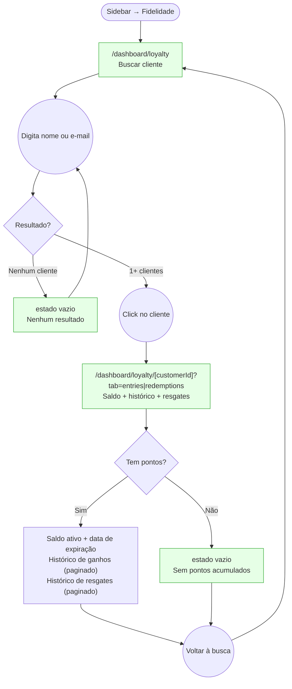

# STAFF — Fidelidade (Customer Loyalty Lookup)

**Actor(s):** STAFF | MANAGER
**Goal:** Look up any customer's active loyalty balance, earning history, and redemption history from the dashboard
**UCs covered:** UC-016 (admin/staff variant)
**Status:** Draft

## Flow

**Note (2026-07-31 docs audit):** the detail route's shape drifted from the original query-param design (`/dashboard/loyalty?customerId=`) to a path segment (`/dashboard/loyalty/[customerId]`), and tabs are named `entries`/`redemptions`, not `earn`/`redeem`.

## Pages referenced

| Page / Route | Component | Story | Status |
|---|---|---|---|
| `/dashboard/loyalty` | `LoyaltySearchPage` | M13-S25 | ✅ Done |
| `/dashboard/loyalty/[customerId]` | `CustomerLoyaltyPage` | M13-S25 | ✅ Done |
| Estado vazio — sem resultados | inline em `LoyaltySearchPage` | M13-S25 | ✅ Done |
| Estado vazio — sem pontos | inline em `CustomerLoyaltyPage` | M13-S25 | ✅ Done |

## Open questions / gaps

- [ ] **Ponto de entrada alternativo:** staff pode chegar à tela de fidelidade do cliente a partir do detalhe do agendamento (UC-003 já mostra o saldo no detalhe) — deve haver um link "Ver histórico completo" no card de fidelidade do booking detail?
- [ ] **Paginação:** `GET /v1/customers/:customerId/loyalty/entries` e `/redemptions` retornam paginado. Quantos itens por página? Scroll infinito ou "carregar mais"?
- [ ] **Resgate manual sem booking:** a tela de busca mostrará um botão "Registrar resgate" desvinculado de agendamento? Decisão de produto — para MVP, resgates são apenas via UC-009 (conclusão de agendamento). Se sim, precisaria de um novo fluxo.
- [ ] **Busca por telefone:** incluir busca por número de telefone além de nome/email?

**Note:** the customer-search endpoint (`GET /v1/customers?search=`) and the loyalty conversion-rate field (`points_per_currency_unit`/`conversionRate`) are no longer open/unverified dependencies — both are scoped and resolved by `M13-S12` (in `plan/M13-DASHBOARD-FRONTEND.md`). `M13-S25` even treats "Confirm M13-S12 has shipped" as a discovery step, i.e. a settled dependency, not a design question.
