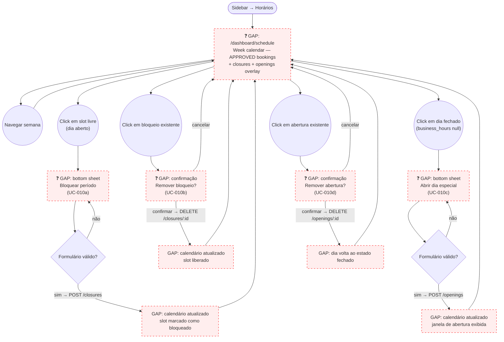

# STAFF — Horários (Schedule & Closure Management)

**Actor(s):** STAFF | MANAGER  
**Goal:** View the calendar of approved bookings and manage schedule closures and openings  
**UCs covered:** UC-010a, UC-010b, UC-010c, UC-010d  
**Status:** Done

## Flow

## Pages referenced

| Page / Route | Component | Story | Status |
|---|---|---|---|
| `/dashboard/schedule` | `SchedulePage` (week calendar grid) | _TBD_ | ❌ Gap |
| Closure creation bottom sheet | `ClosureFormSheet` within `SchedulePage` | _TBD_ | ❌ Gap |
| Closure removal confirmation | `RemoveClosureDialog` within `SchedulePage` | _TBD_ | ❌ Gap |
| Opening creation bottom sheet | `OpeningFormSheet` within `SchedulePage` | _TBD_ | ❌ Gap |
| Opening removal confirmation | `RemoveOpeningDialog` within `SchedulePage` | _TBD_ | ❌ Gap |

## BFF calls (verified — all implemented)

| Operation | Method | Path | Guard |
|---|---|---|---|
| List closures | `GET` | `/v1/schedule/closures` | STAFF \| MANAGER |
| Create closure | `POST` | `/v1/schedule/closures` | STAFF \| MANAGER |
| Remove closure | `DELETE` | `/v1/schedule/closures/:id` | STAFF \| MANAGER |
| List openings | `GET` | `/v1/schedule/openings` | STAFF \| MANAGER |
| Create opening | `POST` | `/v1/schedule/openings` | STAFF \| MANAGER |
| Remove opening | `DELETE` | `/v1/schedule/openings/:id` | STAFF \| MANAGER |
| List approved bookings (for calendar display) | `GET` | `/v1/bookings?status=APPROVED` | STAFF \| MANAGER |

## ScheduleClosure form fields (UC-010a)

| Field | Type | Required | Validation |
|---|---|---|---|
| `date` | date picker | ✅ | not in the past |
| `reason` | enum select: `STAFF_DAY_OFF` \| `MAINTENANCE` \| `HOLIDAY` | ✅ | one of three values |
| `startTime` | time input | ❌ (null = full-day) | if provided, `endTime` must also be provided |
| `endTime` | time input | ❌ (null = full-day) | must be > `startTime` |
| `notes` | text area | ❌ | max 200 chars |

**Error states (from UC-010a alt flows):**
- `422` date in the past → "Não é possível bloquear datas passadas."
- `409` overlapping closure → "Já existe um bloqueio nesse período."
- `409` full-day vs. partial conflict → "Conflito com bloqueio parcial existente na mesma data."
- Warning (not blocking): approved bookings exist in the window → "[X] agendamentos existem nesse período. Reagende ou cancele manualmente."

## ScheduleOpening form fields (UC-010c)

| Field | Type | Required | Validation |
|---|---|---|---|
| `date` | date picker (closed days only) | ✅ | not in the past; day-of-week must be null in `business_hours` |
| `startTime` | time input | ✅ | |
| `endTime` | time input | ✅ | must be > `startTime` |
| `notes` | text area | ❌ | max 200 chars |

**Error states (from UC-010c alt flows):**
- `422` date in the past → "Não é possível abrir datas passadas."
- `422` day already open in `business_hours` → "Esse dia já está aberto nas configurações regulares. Ajuste os horários de funcionamento em vez disso."
- `409` opening already exists for this date → "Já existe uma abertura para esta data."

## Open questions / gaps

- [x] **Calendar granularity** — should the Horários view be a week grid (Mon–Sun columns, hourly rows) or a day view with time blocks? — **Resolved (`M13-S21`).** Week strip (Mon–Sun day buttons) with a day strip selector, plus a time grid below for the selected day's slots (per `businessHours`).
- [x] **APPROVED booking display** — bookings appear as colour-coded time blocks on the calendar. What colour? Does clicking a block navigate to the booking detail? — **Resolved (`M13-S21`).** Blue left border + `--ba-secondary` background; links to `/dashboard/bookings/[id]`.
- [x] **Closure visual** — how are closures rendered? — **Resolved (`M13-S21`).** Grey hatched overlay (`repeating-linear-gradient 135deg`); a booking inside a closure window gets an orange tint + warning icon (UC-010a A4).
- [x] **Normally-closed day entry** — how does staff reach the "Abrir dia especial" sheet? — **Resolved (`M13-S21`).** Closed days show an empty state with an "Abrir dia especial" CTA that opens `OpeningFormSheet` (replaces the FAB on those days).
- [x] **Warning for bookings in blocked window** — UC-010a A4 says "show warning." Is this blocking or non-blocking? — **Resolved (`M13-S21`).** Non-blocking inline warning banner shown after the closure is created: "[X] agendamento(s) aprovado(s) existe(m) nesse período. Reagende ou cancele manualmente."
- [x] **BFF `.http` gap** — `apps/bff/http/schedule/` has `schedule-closures.http` but is missing `schedule-openings.http` and `availability.http`. — **Resolved/assigned.** `M13-S21` explicitly creates both files as part of its own scope (no longer a "should be created" — it's now a concrete deliverable).
- **Story assignment** — confirmed: `M13-S21` ("Horários: schedule management page + closure/opening flows") is the assigned story. Scope: `ScheduleView`/`SchedulePage`, `ClosureFormSheet`, `RemoveClosureDialog`, `OpeningFormSheet`, `RemoveOpeningDialog`.
